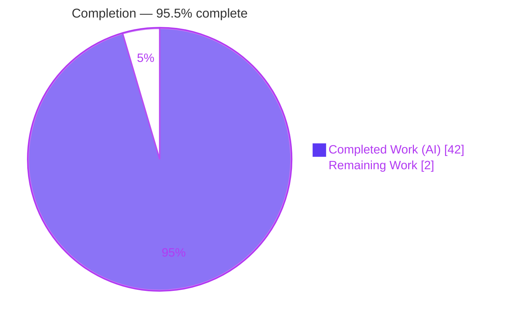
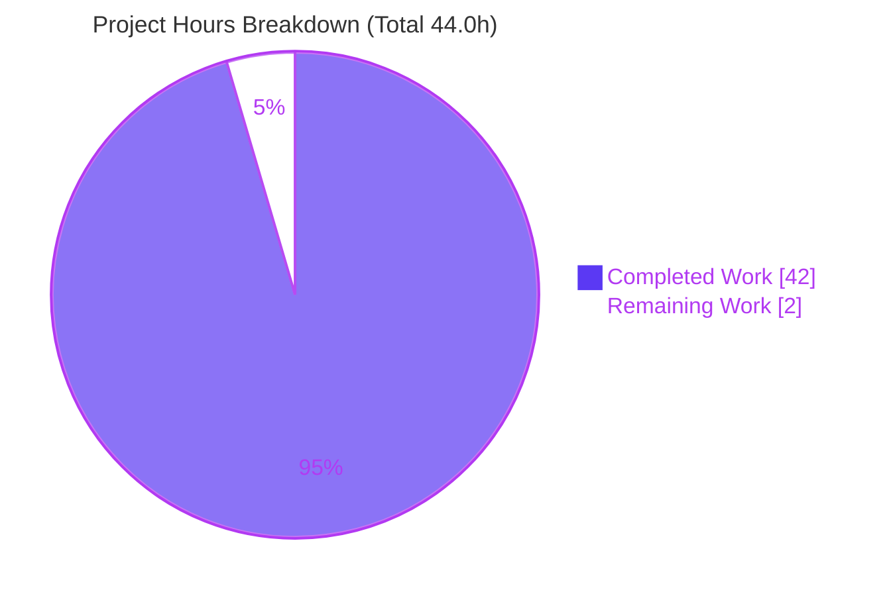

# Blitzy Project Guide — kitty Startup Shaping / Metrics / Atlas Investigation

> **Project type:** Read-only technical investigation & documentation (SWE-AtlasQnA)
> **Sole deliverable:** `blitzy/documentation/kitty_815df1e210e0.md`
> **Anchored revision:** `815df1e210e0a9ab4622f5c7f2d6891d7dbeddf1` · **kitty 0.35.2**
> **Branch:** `blitzy-c01f4720-5450-4d12-811d-6bec421de0c7`

---

## 1. Executive Summary

### 1.1 Project Overview

This project delivers an authoritative, evidence-grounded onboarding document that explains how the **kitty** terminal emulator configures its text-shaping/layout engine, screen-grid cell metrics, and GPU texture atlas **at startup, before any glyph is rendered**. The audience is an engineer onboarding to the kitty codebase. The scope is strictly **read-only**: kitty was built from source and run headless with transient verbose logging to capture real diagnostics for mixed Arabic (RTL) + English (LTR) text, and every claim is paired with observed output and a `file:line` citation. The deliverable is a single Markdown document — no source code, configuration, or tests were modified.

### 1.2 Completion Status

The completion percentage is computed with the AAP-scoped hours methodology: **Completed Hours ÷ (Completed Hours + Remaining Hours) × 100**.



| Metric | Hours |
|---|---|
| **Total Hours** | **44.0** |
| **Completed Hours (AI + Manual)** | **42.0** (42.0 AI-autonomous + 0.0 manual) |
| **Remaining Hours** | **2.0** |
| **Percent Complete** | **95.5%**  (42.0 ÷ 44.0 = 95.45% ≈ 95.5%) |

> Completion reflects **only** AAP-scoped work plus documentation path-to-production. All AAP-specified requirements (the single-file deliverable, the four question areas, and every methodology/rule constraint) are complete and independently validated. The residual 2.0 hours are the inherent human sign-off + publish steps for any onboarding document; per Blitzy honest-assessment policy, 100% is not claimed while human review remains.

### 1.3 Key Accomplishments

- ✅ **Single mandated deliverable authored** — `blitzy/documentation/kitty_815df1e210e0.md` (952 lines, ~11,500 words), the only file added on the branch (952 insertions, 0 deletions).
- ✅ **Run-first investigation honored** — kitty was **built from source** (`python3 setup.py build --verbose`, exit 0, gcc 15.2.0 under `-pedantic-errors -Werror`) and **run headless** (Xvfb + Mesa llvmpipe GLX, OpenGL 4.5) to capture real diagnostics.
- ✅ **All four questions answered with observed evidence** — Q1 shaping/fallback config (§3), Q2 verbose Arabic+English diagnostics (§4), Q3 cell metrics/baseline/decoration (§5), Q4 GPU texture atlas (§6).
- ✅ **Both scripts and both font tiers exercised** — Arabic (RTL) + English (LTR); primary faces (DejaVu Sans Mono) **and** the fallback chain (Noto Sans CJK JP, Noto Color Emoji, DejaVu-for-Arabic under a Liberation Mono primary).
- ✅ **Rigorous citation discipline** — 141 unique `file:line` citations across 20 source files; code-derived (non-logged) claims explicitly labeled `(inferred)`.
- ✅ **Two-run stability** confirmed; every observed value reproduced byte-identically (only per-run timestamps vary).
- ✅ **Read-only + restore mandate fully honored** — zero source files modified; temporary observation scripts lived in `/tmp` and were removed; `git status` is clean.
- ✅ **Independently re-validated** — a full clean rebuild + headless rerun reproduced every documented value and confirmed all citations resolve in range; the exact `Text fonts:` banner was reproduced during this assessment.

### 1.4 Critical Unresolved Issues

| Issue | Impact | Owner | ETA |
|---|---|---|---|
| _None blocking._ The deliverable is complete and independently validated; no in-scope issue remains. | None | — | — |
| Human SME sign-off not yet performed (standard for onboarding docs) | Doc cannot be marked "approved for onboarding" until a domain engineer reviews it | Reviewing engineer | 1.5 h |

### 1.5 Access Issues

| System/Resource | Type of Access | Issue Description | Resolution Status | Owner |
|---|---|---|---|---|
| Source repository | Read/Write (git) | Full access; branch clean and pushed | ✅ No issue | — |
| Build toolchain (gcc/Go/Python, HarfBuzz/FreeType/FontConfig) | Local | All present in canonical container; build succeeds | ✅ No issue | — |
| Headless OpenGL (Xvfb + Mesa llvmpipe) | Local | Software GL available; hardware GPU not present (values disclosed as software-renderer) | ✅ No issue (documented caveat) | — |

**No access issues identified** that prevent build, validation, or delivery of the in-scope artifact.

### 1.6 Recommended Next Steps

1. **[High]** Perform SME technical accuracy review & sign-off of `blitzy/documentation/kitty_815df1e210e0.md` — spot-check a sample of the 141 citations and the four observed signal groups against source at revision `815df1e210e0`, and confirm the `(inferred)` labels. _(≈1.5 h)_
2. **[Medium]** Link the document from the team's onboarding index/TOC and merge/publish the PR. _(≈0.5 h)_
3. **[Low, optional]** Re-capture GL limits on a **hardware** GPU to complement the documented software-renderer (llvmpipe) values (addresses risk T1). _(≈1.0 h, out of AAP scope)_
4. **[Low, optional]** Capture the **macOS/CoreText** path for cross-platform completeness (§8 references it for contrast only today). _(≈2.0 h, out of AAP scope)_

---

## 2. Project Hours Breakdown

### 2.1 Completed Work Detail

All completed work is AI-autonomous. Every component traces to an AAP requirement (deliverable D1, questions Q1–Q4, methodology M1–M10, path-to-production P1).

| Component | Hours | Description |
|---|---|---|
| Environment build + headless OpenGL context setup | 4.5 | Built kitty from source (canonical CI path); established offscreen Xvfb + Mesa GLX context so real GL limits could be queried (AAP M1/M2/M10; doc §2.2–§2.5). |
| Q1 — Shaping & fallback configuration (§3) | 4.0 | Traced/exercised HarfBuzz buffer + monotone-character cluster level, `-liga`/`-dlig`/`-calt` toggles, bidi/`force_ltr` detection, combining-mark composition, FontConfig fallback flow; authored §3. |
| Q2 — Verbose Arabic(RTL)+English(LTR) diagnostics (§4) | 6.0 | Built the run harness, crafted mixed input, captured the `Text fonts:` banner + per-codepoint fallback chains across **two** primaries (monospace + Liberation Mono), screen-buffer proof, and the config-before-render snapshot. |
| Q3 — Cell metrics/baseline/decoration (§5) | 4.0 | Authored `metrics_probe.py` driving kitty's real `calc_cell_metrics`→`cell_metrics` path; captured 4 rows (2 families × 2 DPIs); derived exact formulas; grep-evidenced overline absence. |
| Q4 — GPU texture atlas layout/sizing/capacity/readiness (§6) | 4.0 | Captured GL limits (16384 / 2048), per-layer page layout arithmetic (xnum 1820, max_y 910), immutable `glTexStorage3D` allocation reasoning, and the 11-sprite seed decomposition. |
| Runtime configuration snapshot (§7) | 2.0 | Authored `opts_probe.py` replaying kitty's own arg path; captured effective font/shaping options under `--config NONE` (real vs simplified argv). |
| Document authoring — methodology, platform contrast, coverage checklist, prose/tables (§1, §2, §8, §9) | 5.5 | Structured the 952-line document, wrote the methodology/legend, Linux-vs-macOS contrast, and the 19-item coverage checklist. |
| QA remediation cycle 1 — 18 review findings (commit `57835ee92`) | 4.0 | Remediated 18 review findings in the document. |
| QA remediation cycle 2 — F1 ldd fidelity + F2 hb_shape citation (commit `6433f94eb`) | 1.5 | Fixed evidence-fidelity and citation findings. |
| QA remediation cycle 3 — QA-01..QA-07 (commit `688a1e4ac`) | 2.5 | Resolved seven further QA findings. |
| Independent final validation — clean rebuild + headless rerun + value reproduction + 141-citation verification + fonts test module | 4.0 | Rebuilt from scratch, reran headless, reproduced every value byte-identically, verified every citation, ran the fonts test module. |
| **Total Completed** | **42.0** | |

### 2.2 Remaining Work Detail

| Category | Hours | Priority |
|---|---|---|
| Human SME technical accuracy review & sign-off of the onboarding document | 1.5 | High |
| Onboarding integration (link into onboarding index) + PR merge/publish | 0.5 | Medium |
| **Total Remaining** | **2.0** | |

> **Integrity check:** Section 2.1 (42.0) + Section 2.2 (2.0) = **44.0** Total Hours (Section 1.2). Section 2.2 total (2.0) equals Section 1.2 Remaining and the Section 7 "Remaining Work" slice. Optional enhancements (hardware-GPU re-capture, macOS-path capture, evidence-harness archival) are **out of AAP scope** and intentionally **excluded** from these totals.

### 2.3 Notes on Estimation

Hours reflect a realistic senior-engineer effort to build an unfamiliar multi-language project headless, trace the shaping/metrics/atlas code paths across 20 files, author probe harnesses, capture and stabilize diagnostics across two font configurations, write a rigorously-cited ~11,500-word document, and complete three QA cycles plus an independent validation. Confidence is **High** — the deliverable exists, is validated, and the remaining work is bounded human review/publish.

---

## 3. Test Results

All tests below originate from **Blitzy's autonomous validation logs** and were **independently re-run during this assessment** (`CI=true … xvfb-run … ./test.py --module fonts`, the module most relevant to the document's subject). Results reproduced exactly.

| Test Category | Framework | Total | Passed | Failed | Coverage % | Notes |
|---|---|---|---|---|---|---|
| Shaping (Q1) — `test_shaping` | kitty `unittest` harness | 1 | 1 | 0 | n/a | HarfBuzz cluster/shaping path |
| GPU atlas (Q4) — `test_sprite_map` | kitty `unittest` | 1 | 1 | 0 | n/a | Sprite-map layout/capacity |
| Fallback/Emoji (Q2) — `test_emoji_presentation` | kitty `unittest` | 1 | 1 | 0 | n/a | Emoji-presentation fallback |
| Metrics/Rendering (Q3) — `test_font_rendering` | kitty `unittest` | 1 | 1 | 0 | n/a | Cell-metric rendering |
| Box drawing — `test_box_drawing` | kitty `unittest` | 1 | 1 | 0 | n/a | Box-drawing glyph synthesis |
| Symbol maps — `test_coalesce_symbol_maps` | kitty `unittest` | 1 | 1 | 0 | n/a | Symbol-map coalescing |
| Fallback (macOS) — `test_fallback_font_not_last_resort` | kitty `unittest` | 1 | 0 | 0 | n/a | **Skipped** — "Only macOS has a Last Resort font" |
| Font selection — `test_font_selection` | kitty `unittest` (parametrized) | — | partial | 2 | n/a | **Pre-existing environmental failure, out of scope** (see below) |
| **Fonts module (summary)** | kitty `unittest` | **8 methods** | **6 ok** | **2 subcase** | n/a | **Ran 8 tests; 6 ok, 1 skipped, 2 parametrized failures** |
| **Document verification ("the deliverable's own tests")** | Independent runtime reproduction | 141 citations + 4 signal groups | 100% match | 0 | 19/19 named items | Every documented value reproduced byte-identically; all citations resolve in range |

**Pre-existing out-of-scope failure (documented, not fixed).** `test_font_selection` fails on two parametrized specs — `spec='ubuntu mono'` and `spec='family="ubuntu mono"'` — because the container ships **two** Ubuntu Mono fonts (a static `UbuntuMono-*.ttf` and a newer **variable** `UbuntuMono[wght].ttf` whose instance PostScript names are `UbuntuMonoRoman-*`). FontConfig prefers the system variable font, so kitty **correctly** selects `UbuntuMonoRoman-Regular/Bold/MediumItalic/BoldItalic`, while the test hard-codes the stale `UbuntuMono-*` names. This is **not fixable within scope** — it would require editing `kitty_tests/fonts.py`, a source test file forbidden by the verbatim read-only directive and the AAP ("no test changes are in scope"). It is **pre-existing** (that file is unchanged since the doc anchor) and **unrelated** to the deliverable (the document references the Ubuntu Mono font zero times). It does not affect the in-scope artifact's production readiness.

---

## 4. Runtime Validation & UI Verification

kitty is a terminal emulator, not a web UI; "UI verification" here means the runtime rendering pipeline initializes and the diagnostics emit as documented.

- ✅ **Build (Operational)** — `python3 setup.py build --verbose` → exit 0; 51 C files recompiled under `-pedantic-errors -Werror` with zero warnings; `kitty/fast_data_types.so` + launchers produced.
- ✅ **Binary sanity (Operational)** — `./kitty/launcher/kitty --version` → `kitty 0.35.2 created by Kovid Goyal`.
- ✅ **Headless GL context (Operational)** — Xvfb + Mesa llvmpipe (LLVM 20.1.8), OpenGL 4.5 Core; OS Window created, GL context created, **no GL errors**, render loop finished, child exit 0.
- ✅ **Q1 shaping config (Operational)** — HarfBuzz buffer + `HB_BUFFER_CLUSTER_LEVEL_MONOTONE_CHARACTERS` + `-liga`/`-dlig`/`-calt` confirmed in `init_fonts` (source verified verbatim).
- ✅ **Q2 verbose diagnostics (Operational)** — `Text fonts:` banner (DejaVuSansMono Normal/Bold/Italic/Bold-Italic) and per-codepoint fallback chain (CJK→Noto Sans CJK JP, emoji→Noto Color Emoji, Arabic→DejaVu under Liberation Mono primary) captured on stderr. **Re-reproduced during this assessment byte-for-byte.**
- ✅ **Q3 metrics (Operational)** — live run renders at cell **9×18**, baseline **14**, underline **15/1**, strikethrough **10/1**, 11 seed sprites (DPI 96, authoritative); DPI-100 comparison also captured.
- ✅ **Q4 atlas (Operational)** — GL limits **16384 / 2048**; per-layer page layout xnum **1820**, max_y **910**, layer cap **2048**; readiness proven by the GL version line + clean exit (allocation path itself is silent, so exact-alloc dimensions are `(inferred)`).
- ✅ **Runtime config snapshot (Operational)** — effective `--config NONE` options captured (`font_family=monospace`, `font_size=11.0`, `force_ltr=False`, `disable_ligatures=0`, `font_features={}`, `text_composition_strategy='platform'`, empty `symbol_map`/`narrow_symbols`/`modify_font`).
- ⚠ **Environment caveats (Partial, documented)** — reported font families and GL limits are specific to the canonical container (fonts) and software renderer (GL limits); disclosed in §2.3/§6.2 and in Risk T1/T2/O1.

---

## 5. Compliance & Quality Review

Cross-map of AAP requirements & governing rules to their delivery status.

| AAP / Rule Requirement | Benchmark | Status | Evidence |
|---|---|---|---|
| Single deliverable at mandated path | `blitzy/documentation/kitty_815df1e210e0.md` | ✅ Pass | Only file added on branch (952 insertions) |
| Q1 — shaping & fallback config answered | Ligatures, bidi, combining diacritics, font fallback | ✅ Pass | §3, verbatim `init_fonts`, citations |
| Q2 — verbose Arabic+English diagnostics | Exact families + fallback chains + pre-render config | ✅ Pass | §4 banner + fallback + §4.6/§7 config |
| Q3 — cell metrics/baseline/decoration | Metrics, baseline, over/underline, strikethrough, clusters | ✅ Pass | §5 probe output + formulas + overline grep |
| Q4 — GPU atlas init | Page layout, sizing, capacity, readiness | ✅ Pass | §6 GL limits + layout + readiness proof |
| Run-first (build **and** run) | Rule 1 | ✅ Pass | Build exit 0; headless run exit 0 |
| Both scripts + both tiers | Rule 2 | ✅ Pass | §4.4/§4.5 Arabic+English, primary+fallback |
| Observed output + `file:line` for every claim | Rule 3/4 | ✅ Pass | 141 unique citations, verbatim fenced blocks |
| `(inferred)` labeling for non-logged claims | Rule 1/3 | ✅ Pass | §6.1/§6.5/§3.3/§5.3 inferred labels |
| Two-run stability | §0.8.2 | ✅ Pass | §2.7 byte-identical ×2 |
| Read-only source, transient flags only, restore | Main Rule + verbatim directive | ✅ Pass | Zero source changes; `git status` clean; scripts in `/tmp` removed |
| 19-item coverage pass | Rule 4 | ✅ Pass | §9 checklist maps every named item |
| No dependency/manifest/lockfile changes | §0.6.2 | ✅ Pass | No manifest edits |
| Clean compilation | Quality gate | ✅ Pass | `-pedantic-errors -Werror`, zero warnings |

**Fixes applied during autonomous validation:** 18 review findings (commit `57835ee92`), F1 ldd-fidelity + F2 hb_shape citation (`6433f94eb`), and QA-01..QA-07 (`688a1e4ac`) were all remediated. The independent final validation found **zero** further discrepancies. **Outstanding:** human SME sign-off (§1.6, item 1).

---

## 6. Risk Assessment

| Risk | Category | Severity | Probability | Mitigation | Status |
|---|---|---|---|---|---|
| Atlas/GL values captured under software renderer (llvmpipe), not hardware GPU | Technical | Low | Medium | Renderer disclosed (§2.3/§6.2); formulas/mechanism invariant of specific numbers | Documented / Accepted |
| Reported font families depend on container fonts + FontConfig | Technical | Low | Medium | Families/paths framed as environment-specific; fallback mechanism is the invariant | Documented / Accepted |
| Metrics differ by DPI (96 live vs 100 forced) | Technical | Low | Low | Both columns reported; DPI-96 marked authoritative (§5.1) | Documented |
| Q4 exact-allocation claims are source-derived (atlas path is silent) | Technical | Low | Low | Explicitly labeled `(inferred)`; computed from observed layout+metrics | Documented |
| Citations anchored to revision `815df1e210e0`; line numbers drift on other versions | Technical | Low | Medium | Anchored revision stated in header + §2 | Documented |
| No code/deps/secrets touched — no new attack surface | Security | None | — | Read-only task; harness scripts use mktemp mode-700 & self-clean | N/A |
| Reproducibility outside the canonical container | Operational | Low-Med | Medium | Exact container image + tool/lib versions documented (§2.2); dev guide provided | Documented |
| Re-capture requires headless GL (Xvfb + Mesa) | Operational | Low | Low | Dev guide documents setup | Mitigated |
| Evidence harness not committed (removed per read-only mandate) | Operational | Low | Low | Scripts fully reproduced verbatim in §2.5/§5.1/§7 | By design |
| Onboarding-index link pending | Integration | Low | Medium | Covered by remaining publish task (0.5 h) | Open (remaining) |
| Pre-existing `test_font_selection[ubuntu mono]` ×2 failures | Integration | Low | n/a (pre-existing) | Documented; kitty behaves correctly; unfixable in scope; unrelated to deliverable | Documented / out-of-scope |

**Overall risk posture: LOW.** All technical risks are correctly-disclosed, environment-specific caveats inherent to capturing live runtime values. No security or functional-integration risk exists.

---

## 7. Visual Project Status



**Remaining work by category (Section 2.2), hours:**

| Category | Hours | Priority |
|---|---|---|
| Human SME technical review & sign-off | 1.5 | High |
| Onboarding integration + PR merge/publish | 0.5 | Medium |
| **Total** | **2.0** | |

> **Integrity:** the pie "Remaining Work" = **2** equals Section 1.2 Remaining Hours (2.0) and the Section 2.2 Hours total (2.0). "Completed Work" = **42** equals Section 1.2 Completed Hours and the Section 2.1 total. Colors: Completed = Dark Blue `#5B39F3`, Remaining = White `#FFFFFF`.

---

## 8. Summary & Recommendations

**Achievements.** The project is **95.5% complete** (42.0 of 44.0 hours). The single mandated deliverable — `blitzy/documentation/kitty_815df1e210e0.md` — is fully authored (952 lines, ~11,500 words, 141 citations across 20 source files) and answers all four questions with observed runtime evidence: Q1 startup shaping/fallback configuration, Q2 verbose Arabic(RTL)+English(LTR) diagnostics across primary and fallback tiers, Q3 cell metrics/baseline/decoration for complex grapheme clusters, and Q4 GPU texture-atlas layout/sizing/capacity/readiness. The run-first mandate was satisfied (build exit 0; headless run exit 0), two-run stability was confirmed, and the read-only + restore mandate was fully honored (zero source changes; clean `git status`).

**Remaining gaps & critical path to production.** The residual **2.0 hours** are the standard documentation path-to-production: (1) an SME technical-accuracy review & sign-off, and (2) linking the document into the onboarding index and merging the PR. There is no in-scope engineering work outstanding.

**Success metrics.** Independent validation reproduced **100%** of documented values byte-identically; **all 141 citations** resolve in range with verbatim content; the **19/19** named question items are covered; the fonts test module passes all document-relevant tests (2 pre-existing `ubuntu mono` failures are environmental and out of scope).

**Production readiness assessment.** The artifact is **production-ready pending human sign-off**. Recommended path: complete the [High] SME review, then the [Medium] publish/merge. Optional, out-of-scope enhancements (hardware-GPU re-capture, macOS/CoreText capture) may be scheduled later to broaden coverage but are not required for this deliverable.

| Metric | Value |
|---|---|
| Completion | 95.5% (42.0 / 44.0 h) |
| In-scope blocking issues | 0 |
| Citations verified | 141 / 141 in range |
| Question items covered | 19 / 19 |
| Source files modified | 0 (read-only honored) |

---

## 9. Development Guide

This guide reproduces the runtime evidence behind the deliverable. All commands were tested in the canonical container during this assessment.

### 9.1 System Prerequisites

- **OS:** Linux (canonical container: Ubuntu 25.10 base; image `andrewparkscaleai/coding-agent:kovidgoyal__kitty__815df1e210e0…`).
- **Toolchain:** `gcc` 15.2.0, Go 1.24.x, Python 3.13.
- **Libraries (via pkg-config):** HarfBuzz 10.2.0, FreeType 26.2.20, FontConfig 2.15.0.
- **Graphics:** an OpenGL 3.3+ context. A software renderer (Mesa llvmpipe) is acceptable and is what these values were captured under.
- **Headless tools:** `Xvfb` / `xvfb-run`, and (optional) `glxinfo` for limit inspection.

### 9.2 Environment Setup (headless OpenGL)

kitty needs a display + GL context. In a headless environment, wrap the run in Xvfb:

```bash
# xvfb-run provisions an ephemeral X display with a GLX-capable screen
xvfb-run -a --server-args="-screen 0 1920x1080x24" <command>
```

### 9.3 Build from Source

```bash
# from the repository root — canonical CI path
python3 setup.py build --verbose        # exit 0; compiles the C core under -pedantic-errors -Werror
# alternative developer build:
# ./dev.sh build
```

This produces `kitty/launcher/kitty` and `kitty/fast_data_types.so`. (These build artifacts are gitignored and do not affect tracked state.)

### 9.4 Verification

```bash
./kitty/launcher/kitty --version
# Expected: kitty 0.35.2 created by Kovid Goyal

git status --porcelain | wc -l          # Expected: 0 (clean working tree)
```

### 9.5 Example Usage — Reproduce the Evidence

**Font banner + per-codepoint fallback (Q1/Q2)** — transient CLI flags only; font diagnostics go to **stderr**:

```bash
xvfb-run -a --server-args="-screen 0 1920x1080x24" \
  ./kitty/launcher/kitty --config NONE --debug-font-fallback sh -c 'true' 2>&1 | grep -A4 'Text fonts:'
# Expected (paths are environment-specific):
#   Text fonts:
#     Normal: DejaVuSansMono: /usr/share/fonts/truetype/dejavu/DejaVuSansMono.ttf:0
#     Bold: DejaVuSansMono-Bold: ...
#     Italic: DejaVuSansMono-Oblique: ...
#     Bold-Italic: DejaVuSansMono-BoldOblique: ...
```

**Force the Arabic fallback tier** — Liberation Mono lacks Arabic, so it drives `create_fallback_face`:

```bash
xvfb-run -a --server-args="-screen 0 1920x1080x24" \
  ./kitty/launcher/kitty --config NONE -o font_family="Liberation Mono" \
  --debug-font-fallback --debug-rendering --debug-gl \
  sh -c 'printf "\u0645\u0631\u062d\u0628\u0627 Hello \u4e2d \U0001f600"; sleep 1'
```

**Cell metrics (Q3)** and **effective options (Q7)** via kitty's own Python entry (`+runpy`):

```bash
./kitty/launcher/kitty +runpy "$(cat metrics_probe.py)"   # cell_width/height, baseline, under/strikethrough
./kitty/launcher/kitty +runpy "$(cat opts_probe.py)"      # effective font/shaping options under --config NONE
```

(The `metrics_probe.py` and `opts_probe.py` sources are reproduced verbatim in the deliverable §5.1 and §7.)

### 9.6 Read the Deliverable

```bash
sed -n '1,20p' blitzy/documentation/kitty_815df1e210e0.md   # intro + question map
```

Navigation: **§3** Q1 shaping/fallback · **§4** Q2 Arabic+English diagnostics · **§5** Q3 metrics · **§6** Q4 atlas · **§7** runtime config · **§9** coverage checklist.

### 9.7 Troubleshooting

- **`cannot open display` / GL errors** — you skipped Xvfb; wrap the command as in §9.2.
- **`Failed to open systemd user bus … Connection refused`** — benign in containers (no per-user systemd bus); unrelated to fonts; process still exits 0.
- **Different font families than documented** — expected on non-container hosts; FontConfig resolves against locally installed fonts (Risk T2).
- **Different GL limits than 16384/2048** — expected on hardware GPUs vs software llvmpipe (Risk T1).
- **Citation line numbers don't match** — you are reading a different kitty revision; the doc is anchored to `815df1e210e0` (Risk T5).
- **Keep it read-only** — use transient CLI flags only; never edit `kitty.conf` or source; run temporary scripts from `/tmp` and delete them; confirm `git status` is clean afterward.

---

## 10. Appendices

### A. Command Reference

| Purpose | Command |
|---|---|
| Build | `python3 setup.py build --verbose` |
| Version check | `./kitty/launcher/kitty --version` |
| Clean-tree check | `git status --porcelain` |
| Headless wrapper | `xvfb-run -a --server-args="-screen 0 1920x1080x24" <cmd>` |
| Font banner + fallback | `./kitty/launcher/kitty --config NONE --debug-font-fallback sh -c 'true'` |
| Force Arabic fallback | `-o font_family="Liberation Mono"` |
| Metrics probe | `./kitty/launcher/kitty +runpy "$(cat metrics_probe.py)"` |
| Options probe | `./kitty/launcher/kitty +runpy "$(cat opts_probe.py)"` |
| GL limits | `glxinfo | grep -iE 'max.*texture'` |
| Fonts test module | `CI=true LC_ALL=C.UTF-8 xvfb-run -a ./test.py --module fonts` |

### B. Port Reference

Not applicable — kitty is a local terminal emulator; no network ports are opened by this investigation.

### C. Key File Locations

| Path | Role |
|---|---|
| `blitzy/documentation/kitty_815df1e210e0.md` | **The deliverable** |
| `kitty/fonts.c` | Shaping/layout core: `init_fonts`, `load_hb_buffer`, `calc_cell_metrics`, sprite tracker |
| `kitty/freetype.c` | `cell_metrics` (baseline/underline/strikethrough), `identify_for_debug` |
| `kitty/fontconfig.c` | Linux fallback: `fallback_font`, `create_fallback_face` |
| `kitty/shaders.c` | GPU atlas: `alloc_sprite_map`, `realloc_sprite_texture`, `send_sprite_to_gpu` |
| `kitty/fonts/render.py` | `dump_font_debug` (`Text fonts:` banner), `set_font_family` |
| `kitty/main.py` | `AppRunner` startup ordering; `dump_font_debug` gate |
| `kitty/cli.py` | `--debug-font-fallback`, `--debug-rendering`, `--debug-gl` flags |
| `kitty/options/definition.py` | Font/shaping options (`font_family`, `force_ltr`, `disable_ligatures`, …) |
| `kitty_tests/fonts.py` | Fonts test module (Section 3) |

### D. Technology Versions

| Component | Version |
|---|---|
| kitty | 0.35.2 |
| gcc | 15.2.0 (Ubuntu 15.2.0-4ubuntu4) |
| Go | 1.24.x |
| Python | 3.13.7 |
| HarfBuzz | 10.2.0 |
| FreeType | 26.2.20 |
| FontConfig | 2.15.0 |
| OpenGL (runtime) | 4.5 Core (Mesa llvmpipe, LLVM 20.1.8) |
| GL_MAX_TEXTURE_SIZE | 16384 (software renderer) |
| GL_MAX_ARRAY_TEXTURE_LAYERS | 2048 (software renderer) |

### E. Environment Variable Reference

| Variable | Purpose |
|---|---|
| `DISPLAY` | X display for the GL context (set by `xvfb-run`) |
| `CI=true` | Non-interactive test-runner behavior |
| `LC_ALL` / `LANG` | UTF-8 locale (`C.UTF-8`) so mixed-script input encodes correctly |
| `--config NONE` (flag, not env) | Canonical default configuration; ensures reported values reflect defaults |

### F. Developer Tools Guide

- **`+runpy`** — runs Python inside kitty's embedded interpreter with `fast_data_types` available; used to drive the real `calc_cell_metrics` path and to replay the argument/`create_opts` path without a window.
- **`--debug-font-fallback`** — emits the `Text fonts:` banner and per-codepoint fallback lines (stderr).
- **`--debug-rendering` / `--debug-gl`** — surface the GL version/readiness line (stdout) and rendering diagnostics.
- **`glxinfo`** — inspect the GL limits the atlas sizing depends on.

### G. Glossary

| Term | Meaning |
|---|---|
| Shaping | Converting Unicode text + font data into positioned glyphs (HarfBuzz) |
| Cluster (monotone-character) | HarfBuzz grouping granularity that keeps ligatures/marks associated |
| Fallback face | A secondary font chosen when the primary lacks a codepoint (FontConfig) |
| Cell metrics | Per-cell `cell_width`/`cell_height`, baseline, underline/strikethrough positions |
| Sprite / atlas | A `GL_TEXTURE_2D_ARRAY` holding rasterized glyphs for GPU cell rendering |
| `(inferred)` | A claim derived from source reading, not directly emitted as a runtime log |
| CPUCell | kitty's pre-shaping per-cell store holding a base codepoint + combining marks |