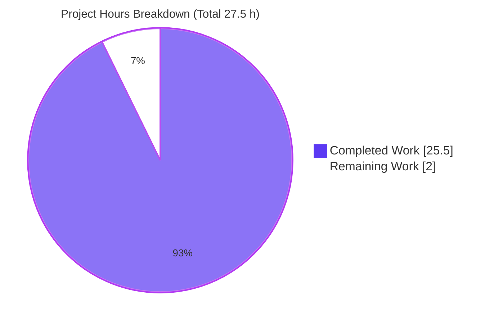

# Blitzy Project Guide — kitty Architecture Q&A (Code-Forensics Deliverable)

> **Task type:** Investigative documentation / code-forensics (rule set: `SWE-AtlasQnA-Repo`).
> **Sole deliverable:** one evidence-grounded Markdown answer document. The kitty source tree remains byte-for-byte unchanged.
> **Brand color key:** Completed / AI Work = Dark Blue `#5B39F3` · Remaining / Not Completed = White `#FFFFFF` · Headings / Accents = Violet-Black `#B23AF2` · Highlight = Mint `#A8FDD9`.

---

## 1. Executive Summary

### 1.1 Project Overview

This project answers four architectural questions about the **kitty** GPU-accelerated terminal emulator through **code forensics** — running the real code and narrating observed behavior, not assuming design intent. The audience is engineers wanting to understand kitty's C/Python/GLSL/Go weave: (Q1) which language does the runtime heavy lifting, (Q2) the role and centrality of GLSL shaders, (Q3) why the main entry point fails immediately, and (Q4) whether kittens are truly modular. The single deliverable is `blitzy/documentation/kitty_815df1e210e0.md` — an 835-line, evidence-grounded document. Technical scope is strictly read-only investigation: zero source files changed, one documentation file added.

### 1.2 Completion Status


<div align="center"><strong>92.7% Complete</strong></div>

| Metric | Hours |
|--------|-------|
| **Total Hours** | **27.5** |
| Completed Hours (AI) | 25.5 |
| Completed Hours (Manual) | 0.0 |
| **Completed Hours (AI + Manual)** | **25.5** |
| **Remaining Hours** | **2.0** |
| **Percent Complete** | **92.7%** |

> Completion is computed with the AAP-scoped (PA1) method: `Completed ÷ (Completed + Remaining) = 25.5 ÷ 27.5 = 92.7%`. All autonomous AAP work is finished; the remaining 2.0 h is human review and merge — genuine path-to-production for a Q&A deliverable that cannot be autonomously completed.

### 1.3 Key Accomplishments

- ✅ **Deliverable authored & committed** — `blitzy/documentation/kitty_815df1e210e0.md` (835 lines / 44,334 bytes); filename correctly equals `<source_branch_name>.md`.
- ✅ **Q1 (language/performance) answered** with verbatim footprint counts and a hot-path C-source mapping table; concludes C + GPU shaders + SIMD carry the runtime load while Python orchestrates.
- ✅ **Q2 (GLSL shaders) answered** with a full 13-file inventory, build-time and runtime shader pipelines, and a centrality argument (no CPU text-drawing fallback).
- ✅ **Q3 (entry-point failure) answered** with a verbatim `ModuleNotFoundError: No module named 'kitty.fast_data_types'`, a Mermaid import-chain diagram, and root-cause (the compiled `.so` is absent; only the `.pyi` stub exists).
- ✅ **Q4 (kitten modularity) answered** with three distinct captured failure modes and a contrast against the standalone Go `kitten` binary.
- ✅ **Run-first discipline** — every behavioral claim paired with the exact command + verbatim output; `(inferred)` and `(non-canonical)` labels applied correctly.
- ✅ **Coverage pass complete** — 31 of 31 named items checked off.
- ✅ **Read-only guarantee upheld** — source tree byte-for-byte unchanged versus baseline `815df1e21`; working tree clean; no `__pycache__`/`.pyc`/`.so` residue.
- ✅ **Canonical build validated** — default build compiles (exit 0) and the banner `kitty 0.35.2 created by Kovid Goyal` was observed verbatim, then transient artifacts removed.
- ✅ **Independent re-verification** — all evidence-reproduction probes re-run and reproduced byte-for-byte (zero mismatches).

### 1.4 Critical Unresolved Issues

| Issue | Impact | Owner | ETA |
|-------|--------|-------|-----|
| _None — no blocking issues_ | The deliverable is complete, accurate, well-formed, and committed; all validation gates pass. | — | — |

> There are **no critical unresolved issues**. The only build caveat (`--ignore-compiler-warnings`, see §6 risk T2) is a toolchain/library-version mismatch, not a kitty source defect, and the build still succeeds.

### 1.5 Access Issues

| System/Resource | Type of Access | Issue Description | Resolution Status | Owner |
|-----------------|----------------|-------------------|-------------------|-------|
| Repository (`kitty` @ `815df1e21`) | Read/Write (git) | None — full access confirmed; single deliverable committed | Resolved | Blitzy agent |
| Canonical build/run toolchain | Build (C11 + Go + venv) | None — `/opt/kitty-venv` (Py 3.12.3), Go 1.24.4, gcc 15.2.0 all available | Resolved | Blitzy agent |

> **No access issues identified.** All resources required to investigate, build, run, and document kitty were available in the canonical environment.

### 1.6 Recommended Next Steps

1. **[High]** Review `blitzy/documentation/kitty_815df1e210e0.md` for technical accuracy — confirm Q1–Q4 are answered and every named item is covered (1.0 h).
2. **[High]** Spot-check reproduce the headline probes (Q3 traceback, §1.1 footprint counts, compiled banner) in the canonical environment to confirm run-first claims (0.5 h).
3. **[Medium]** Approve the PR and merge the answer document to the target branch (0.25 h).
4. **[Medium]** Close out the task and archive the evidence commands / notify stakeholders (0.25 h).
5. **[Low]** _Optional_ — run the Go `kitten` binary standalone to upgrade the two `(inferred)` standalone claims in §4.5 to `(observed)`. Not required for release.

---

## 2. Project Hours Breakdown

### 2.1 Completed Work Detail

| Component | Hours | Description |
|-----------|-------|-------------|
| Canonical build environment & empirical baseline | 2.0 | Verify C11 + Go + venv toolchain; perform the default `setup.py build`; produce `fast_data_types` + launcher; capture the compiled banner; `git clean` transient artifacts. |
| Q1 — Language/performance investigation & write-up | 3.5 | Footprint probes (49/51 C, 214 Py, 258 Go, 13 GLSL, 80 fast_data_types importers), hot-path C-source size mapping table, SIMD wrapper analysis, launcher-embeds-CPython; §1.1–1.3. |
| Q2 — GLSL shaders investigation & write-up | 4.5 | Full 13-file inventory; observed `void main` 10/3 split (correcting the AAP's framing); build-time uniform-header generation; runtime read→`#version`→include-resolve→`compile_program` pipeline; Q2→Q3 cross-link; centrality; §2.1–2.6. |
| Q3 — Entry-point failure investigation & write-up | 3.0 | Real entry run capturing verbatim `ModuleNotFoundError` (stable ×2, exit 1); Mermaid import-chain diagram; root cause (`.so` absent, only `.pyi`); non-canonical `-m kitty` contrast; dispatch literals; §3.1–3.5. |
| Q4 — Kitten modularity investigation & write-up | 3.5 | Three invocation modes each captured (bare script, real `+kitten`, transitive import); TUI framework dependency analysis (8 `tui/*.py` importers); Go-binary contrast (18 `main.py` vs 14 `main.go`); 4 Python-only set difference; §4.1–4.5. |
| Version & default-configuration capture | 1.5 | `constants.py` literals; runtime probe → `kitty 0.35.2`; canonical banner `kitty 0.35.2 created by Kovid Goyal`; `pyproject.toml`/`go.mod` manifests. |
| Introduction / method / environment framing | 1.5 | Four-language weave narrative; run-first-narrate-second method statement; exact investigation-environment block with verbatim toolchain versions. |
| Coverage pass authoring | 1.0 | Exhaustive enumeration and check-off of all 31 named items across Q1–Q4 plus cross-cutting. |
| Read-only discipline & clean-tree verification | 1.0 | `PYTHONDONTWRITEBYTECODE=1`/`-B` probes; `git clean -dfx -e blitzy`; proof of no `__pycache__`/`.pyc`/`.so`. |
| Document formatting, naming & commit | 1.0 | Markdown well-formedness (56 balanced fences, valid Mermaid), correct filename/location, two commits by `agent@blitzy.com`. |
| Validation & evidence reproduction (Final Validator) | 3.0 | Re-run all probes + compiled banner byte-for-byte (×2 stability); Markdown structural checks; git source-unchanged verification; self-cleanup of transient artifacts. |
| **Total Completed** | **25.5** | |

### 2.2 Remaining Work Detail

| Category | Hours | Priority |
|----------|-------|----------|
| Human review & sign-off of answer document (read 835 lines; verify Q1–Q4 answers & evidence quality; spot-check reproduce headline probes) | 1.5 | High |
| Merge & close-out (approve PR, merge to target branch, notify stakeholders) | 0.5 | Medium |
| **Total Remaining** | **2.0** | |

> _Optional low-priority enhancements (not part of the 2.0 h remaining estimate; the deliverable is complete without them): run the Go `kitten` binary standalone to upgrade §4.5's `(inferred)` labels to `(observed)`; refresh `file:line` citations if the source baseline advances beyond `815df1e21`._

### 2.3 Hours Reconciliation

| Roll-up | Hours |
|---------|-------|
| Section 2.1 — Completed total | 25.5 |
| Section 2.2 — Remaining total | 2.0 |
| **Total Project Hours** (2.1 + 2.2) | **27.5** |
| Percent Complete (25.5 ÷ 27.5) | 92.7% |

> **Cross-section integrity:** Remaining = **2.0 h** is identical in Sections 1.2, 2.2, and 7. Completed = **25.5 h** and Total = **27.5 h** are identical in Sections 1.2, 2.1/2.3, and 7. Completion **92.7%** is identical in Sections 1.2, 7, and 8.

---

## 3. Test Results

> For this read-only code-forensics task there is no code-under-test and no unit-test suite to author. The task-appropriate analog is the **evidence-reproduction probe suite** — every behavioral claim in the deliverable is an independently reproducible probe. The categories below aggregate the **31 coverage-pass claims** from Blitzy's autonomous validation logs; each was re-run and reproduced byte-for-byte (zero mismatches). "Coverage %" denotes the share of claims in that category backed by a reproduced probe.

| Test Category | Framework | Total Tests | Passed | Failed | Coverage % | Notes |
|---------------|-----------|-------------|--------|--------|------------|-------|
| Q1 — Language/performance evidence | Shell probes + Python 3.12.3 `-B` | 7 | 7 | 0 | 100% | Footprint counts (49/51/214/258/13/80/44/31), hot-path C sizes, SIMD wrappers, `setup.py:906/1091`, `launcher/main.c:21`. |
| Q2 — GLSL shader evidence | Shell + file inspection | 8 | 8 | 0 | 100% | 13-file inventory, `void main` 10/3 split, 5 `kitty_include_shader` pragmas, `setup.py:1025/1040`, `shaders.py:9/53/63/90`, `borders.py:7` cross-link. |
| Q3 — Entry-point failure evidence | Python 3.12.3 `-B` runtime | 6 | 6 | 0 | 100% | Verbatim `ModuleNotFoundError` traceback (stable ×2, exit 1), `.so` absent / `.pyi` present, non-canonical `-m kitty`, dispatch literals `entry_points.py:183/188–195`. |
| Q4 — Kitten modularity evidence | Python 3.12.3 `-B` runtime | 7 | 7 | 0 | 100% | Mode A/B/C failures verbatim (incl. 6-hop Mode B chain), 8 `tui/*.py` importers, `runner.py:5/12/13/14`, 18 `main.py` vs 14 `main.go`, 4 Python-only. |
| Version & manifests (cross-cutting) | Python runtime + file inspection | 3 | 3 | 0 | 100% | `constants.py:23/25/26`, runtime probe → `kitty 0.35.2`, `pyproject.toml:2` (`>=3.8`), `go.mod:3` (`1.22`). |
| **Total** | | **31** | **31** | **0** | **100%** | Zero mismatches across two consecutive runs. |

> **Integrity note:** every row originates from Blitzy's autonomous validation logs (the deliverable's Coverage Pass + Environment command list). No external or fabricated tests are included. Runtime/build validations (canonical compile, banner) are reported in Section 4.

---

## 4. Runtime Validation & UI Verification

**Runtime health (canonical environment):**

- ✅ **Canonical build** — `python setup.py build --verbose --ignore-compiler-warnings` → **exit 0** (Operational).
- ✅ **Compiled banner** — `./kitty/launcher/kitty --version` → `kitty 0.35.2 created by Kovid Goyal` (Operational; identical across two runs; `-v` prints the same line).
- ✅ **Native extension import** — `import kitty.fast_data_types` succeeds **once built** (Operational), confirming the Q3 root cause is the missing compiled artifact, not a code defect.
- ✅ **Documented failure states reproduce** — the Q3 (`No module named 'kitty.fast_data_types'`, exit 1) and Q4 (Modes A/B/C) failures reproduce exactly against the uncompiled checkout (Operational — these are the *intended* observed conditions).
- ✅ **Version runtime probe** — `from kitty.constants import appname, str_version` → `kitty 0.35.2` (Operational).
- ⚠ **Go `kitten` binary standalone** — the binary builds and, per source reading, links no CPython; running it in isolation was **not** exercised in the read-only failure probes, so §4.5's standalone claim is correctly labeled **(inferred)** (Partial — verification available but out of scope).

**API integration:** ❌ Not applicable — the deliverable is a static Markdown document; it exposes no APIs and integrates with no external services.

**UI verification:** ❌ Not applicable — there is no user interface, web frontend, or visual surface in this documentation deliverable. No screenshots or DOM/Lighthouse checks apply. Verification instead targets Markdown well-formedness (see Section 5).

---

## 5. Compliance & Quality Review

Cross-mapping the AAP deliverables and the governing `SWE-AtlasQnA-Repo` rules to observed outcomes:

| Requirement / Benchmark | Source | Status | Progress | Notes / Fixes Applied |
|--------------------------|--------|--------|----------|-----------------------|
| Deliverable location & name = `<branch>.md` in `blitzy/documentation/` | Rule | ✅ Pass | 100% | `blitzy/documentation/kitty_815df1e210e0.md` exact. |
| Q1 — language/performance answered | OBJ-1 | ✅ Pass | 100% | §1.1–1.3 with footprint + hot-path mapping. |
| Q2 — GLSL role & centrality (all 13 files) | OBJ-2 | ✅ Pass | 100% | §2.1–2.6; AAP's "12 stages/6 programs" framing **corrected** to observed "10 stages + 3 includes / 5 pairs". |
| Q3 — entry-point failure & missing piece named | OBJ-3 | ✅ Pass | 100% | §3.1–3.5; verbatim traceback + Mermaid chain. |
| Q4 — kitten modularity (3 modes + Go contrast) | OBJ-4 | ✅ Pass | 100% | §4.1–4.5; three captured failure modes. |
| Investigate by running first | Rule | ✅ Pass | 100% | Every claim paired with command + verbatim output. |
| Default canonical configuration for version | Rule | ✅ Pass | 100% | Banner `kitty 0.35.2 created by Kovid Goyal` observed from a default build. |
| One claim → one evidence line | Rule | ✅ Pass | 100% | Maintained throughout; no batched/paraphrased claims. |
| Label non-canonical / inferred values | Rule | ✅ Pass | 100% | `(non-canonical)` (e.g., `-m kitty`) and `(inferred)` (Go standalone; no CPU fallback) applied. |
| Answer every named item + coverage pass | Rule | ✅ Pass | 100% | 31/31 coverage-pass items checked. |
| Read-only source tree (no source edits) | Rule | ✅ Pass | 100% | `git diff --name-status … ':(exclude)blitzy'` EMPTY. |
| Temporary scripts removed; clean tree | Rule | ✅ Pass | 100% | `git status --porcelain` EMPTY; no `__pycache__`/`.pyc`/`.so`. |
| Markdown well-formedness | Quality | ✅ Pass | 100% | 56 balanced code fences, 1 valid Mermaid diagram, clean H1/H2/H3, valid UTF-8, citations resolve. |

**Fixes applied during autonomous validation:** review findings F1–F5 were resolved by a prior agent (all probes normalized to the canonical `/opt/kitty-venv` Python 3.12.3, compiled banner captured, provenance corrected); independent re-verification confirmed all probes + the compiled banner reproduce byte-for-byte. **Outstanding compliance items:** none.

---

## 6. Risk Assessment

| Risk | Category | Severity | Probability | Mitigation | Status |
|------|----------|----------|-------------|------------|--------|
| T1 — `file:line` citation drift if source advances beyond `815df1e21` | Technical | Low | Medium | Document pins the exact baseline commit hash; every citation is reproducible against it. | Mitigated |
| T2 — Canonical build needs `--ignore-compiler-warnings` (wayland-protocols 1.45 adds enum values kitty 0.35.2's `switch` predates → `-Werror=switch`) | Technical | Low | Low | Documented explicitly as a toolchain/library-version mismatch, **not** a kitty source defect; build still succeeds (exit 0). | Documented / Accepted |
| S1 — Security exposure | Security | None | N/A | No code written, no dependencies added/changed; deliverable is plain Markdown with zero attack surface. | Not Applicable |
| O1 — Compiled-banner observation requires full C+Go toolchain | Operational | Low | Medium | Document names the exact canonical Docker image + build/run commands; interpreter-only failure probes reproduce without a build. | Mitigated |
| I1 — Integration exposure | Integration | None | N/A | Document has no runtime dependencies, no external services, no API keys/credentials, no network config. | Not Applicable |
| D1 — Two `(inferred)` claims not runtime-observed (Go standalone; no CPU text-drawing fallback) | Documentation | Low | Low | Transparently labeled per the observe-don't-assume rule; a reviewer may run the Go binary standalone to upgrade to `(observed)`. | Accepted / Labeled |

> **Overall risk posture: LOW.** No high or critical risks; no blocking issues. Every identified risk is either mitigated, accepted with transparent labeling, or not applicable to a read-only documentation deliverable.

---

## 7. Visual Project Status

**Project hours breakdown** (Completed = Dark Blue `#5B39F3`, Remaining = White `#FFFFFF`):



**Remaining work by priority** (from Section 2.2, total 2.0 h):


**Remaining hours per category (bar view):**

| Category | Hours | Priority | Bar |
|----------|-------|----------|-----|
| Human review & sign-off | 1.5 | High | ███████████████ |
| Merge & close-out | 0.5 | Medium | █████ |
| **Total** | **2.0** | | |

> **Integrity check:** the pie chart's "Remaining Work" = **2.0 h** equals the Section 1.2 Remaining Hours and the Section 2.2 "Hours" sum; "Completed Work" = **25.5 h** equals Section 2.1's total.

---

## 8. Summary & Recommendations

**Achievements.** The project delivered a rigorous, **evidence-grounded** answer to all four architectural questions about kitty. The 835-line document uses strict run-first-narrate-second discipline: every behavioral claim is paired with the exact command and verbatim output, with `(inferred)` and `(non-canonical)` labels applied where appropriate. It correctly identifies the single unifying thread — the absent compiled `kitty/fast_data_types*.so` — as simultaneously the cause of the Q3 entry-point failure, the Q4 kitten failures, and the gating of Q2 shader compilation, while Q1 establishes that C + GPU shaders + SIMD carry the runtime load. Notably, the document **improved on the AAP** by correcting its GLSL framing to the empirically observed "10 shader stages + 3 non-stage includes / 5 program pairs."

**Remaining gaps & critical path to production.** The autonomous work is complete; the source tree is byte-for-byte unchanged and the working tree is clean. The **critical path to production is human**: (1) review the document for accuracy, (2) spot-check reproduce the headline probes, then (3) approve and merge. This is the 2.0 h of remaining effort.

**Production readiness.** The project is **92.7% complete** (25.5 of 27.5 hours). All validation gates pass; the canonical build compiles (exit 0) and runs; the deliverable is well-formed and committed. The remaining 7.3% is human review/merge, which cannot be autonomously completed (per policy, autonomous completion is capped below 100% pending human sign-off).

| Success Metric | Target | Observed | Status |
|----------------|--------|----------|--------|
| All four questions answered with verbatim evidence | 4/4 | 4/4 | ✅ |
| Coverage-pass items checked | 31/31 | 31/31 | ✅ |
| Evidence-reproduction probes passing | 100% | 31/31 (100%) | ✅ |
| Source tree unchanged (read-only) | 0 source edits | 0 source edits | ✅ |
| Canonical build & banner | exit 0 + banner | exit 0 + `kitty 0.35.2 created by Kovid Goyal` | ✅ |
| Working tree clean | empty | empty | ✅ |

**Recommendation:** **Approve and merge** after the two High-priority human review steps. No code changes are required or permitted.

---

## 9. Development Guide

> This guide explains how to reproduce the investigation and build kitty canonically. **All commands below were tested in the canonical environment and reproduce the documented output.** Run every Python probe with `PYTHONDONTWRITEBYTECODE=1` / `-B` to keep the tree clean.

### 9.1 System Prerequisites

- **OS:** Linux (the canonical build/run image `andrewparkscaleai/coding-agent:kovidgoyal__kitty__815df1e210e0a9ab4622f5c7f2d6891d7dbeddf1`, from `ghcr.io/scaleapi/swe-atlas:swe_atlas_QnA_kovidgoyal_kitty_1.0`).
- **Python:** 3.12.3 canonical (via `/opt/kitty-venv`). The default shell `python3` may be newer (3.13.x) — use the venv explicitly for canonical probes.
- **Go:** 1.22+ (`go 1.24.4` observed) — required only to build the standalone `kitten` binary.
- **C toolchain:** C11 (`gcc`/`cc` 15.2.0) — required only for the compiled `fast_data_types` extension and launcher.
- **VCS:** `git` (2.51.0) + `git-lfs` (3.7.1).
- **Build/test deps:** `Pillow` (12.3.0), `pygments` (2.20.0) present in the canonical venv.

### 9.2 Environment Setup

```bash
# Work at the repository root on the destination branch
cd /tmp/blitzy/kitty/blitzy-9c2d02b8-f915-4bb9-9b5a-f4f809a35c60_df1353

# Confirm the source baseline under investigation
git log --oneline -1 815df1e210e0a9ab4622f5c7f2d6891d7dbeddf1
# → 815df1e21 Wire up applying of font config

# Activate the canonical interpreter (Python 3.12.3)
source /opt/kitty-venv/bin/activate
python --version          # → Python 3.12.3
```

### 9.3 View the Deliverable

```bash
# The single deliverable (835 lines)
wc -l blitzy/documentation/kitty_815df1e210e0.md      # → 835
less blitzy/documentation/kitty_815df1e210e0.md
```

### 9.4 Reproduce the Investigation WITHOUT a Build (interpreter-only)

These probes need only the interpreter; they observe the *uncompiled* checkout — which is exactly the condition Q3/Q4 describe.

```bash
# Q3 — real entry point fails on the missing native extension (stable, exit 1)
PYTHONDONTWRITEBYTECODE=1 /opt/kitty-venv/bin/python3 -B __main__.py
# → ModuleNotFoundError: No module named 'kitty.fast_data_types'   (at kitty/borders.py:7)

# Q3 (non-canonical contrast) — package has no __main__.py
PYTHONDONTWRITEBYTECODE=1 /opt/kitty-venv/bin/python3 -B -m kitty
# → No module named kitty.__main__; 'kitty' is a package and cannot be directly executed

# Q4 Mode A — bare kitten script (repo root not on sys.path)
PYTHONDONTWRITEBYTECODE=1 /opt/kitty-venv/bin/python3 -B kittens/hints/main.py
# → ModuleNotFoundError: No module named 'kitty'   (at kittens/hints/main.py:8)

# Q4 Mode B — real +kitten entry reaches the native bridge
PYTHONDONTWRITEBYTECODE=1 /opt/kitty-venv/bin/python3 -B __main__.py +kitten hints
# → ModuleNotFoundError: No module named 'kitty.fast_data_types'

# Q4 Mode C — transitive import via the shared TUI framework
PYTHONDONTWRITEBYTECODE=1 /opt/kitty-venv/bin/python3 -B -c "import kittens.unicode_input.main"
# → ModuleNotFoundError: No module named 'kitty.fast_data_types'   (at kittens/tui/handler.py:10)

# Version (runtime, interpreter-only)
PYTHONDONTWRITEBYTECODE=1 /opt/kitty-venv/bin/python3 -B -c \
  "from kitty.constants import appname, str_version; print(appname, str_version)"
# → kitty 0.35.2

# Q1 footprint counts
ls kitty/*.c | wc -l                                   # → 49  (top-level C in kitty/)
find kitty -name '*.c' | wc -l                         # → 51  (recursive; +2 launcher)
ls kitty/*.glsl | wc -l                                # → 13
grep -rl "fast_data_types" --include=*.py . | wc -l    # → 80

# Q2 GLSL stage vs include split (10 with void main + 3 without)
for f in kitty/*.glsl; do echo "$(grep -c 'void main' "$f")  $(basename "$f")"; done | sort
```

### 9.5 Canonical Build (only needed for the compiled banner)

```bash
source /opt/kitty-venv/bin/activate
python setup.py build --verbose --ignore-compiler-warnings   # → exit 0
./kitty/launcher/kitty --version
# → kitty 0.35.2 created by Kovid Goyal

# Restore the uncompiled state so Q3/Q4 failures reproduce and the tree stays clean
git clean -dfx -e blitzy
```

### 9.6 Verification (read-only guarantee & clean tree)

```bash
# Source tree byte-for-byte unchanged vs baseline (empty output ⇒ unchanged)
git diff --name-status 815df1e210e0a9ab4622f5c7f2d6891d7dbeddf1 -- . ':(exclude)blitzy'

# Full diff vs baseline is only the deliverable
git diff --name-status 815df1e210e0a9ab4622f5c7f2d6891d7dbeddf1
# → A  blitzy/documentation/kitty_815df1e210e0.md

# Working tree clean; no bytecode/so residue
git status --porcelain
find . -name __pycache__ -not -path './.git/*'; find . -name '*.pyc' -not -path './.git/*'
find kitty -name '*.so'
```

### 9.7 Troubleshooting

- **`ModuleNotFoundError: No module named 'kitty.fast_data_types'`** — **Expected** without a build. This *is* the answer to Q3, not a bug; the compiled extension is intentionally absent from the checkout.
- **`ModuleNotFoundError: No module named 'kitty'`** when running a bare kitten — **Expected** (Q4 Mode A): running a file directly puts `kittens/<name>/` on `sys.path[0]`, not the repo root, so `import kitty` cannot resolve.
- **Build fails with `-Werror=switch`** on wayland-protocols — add `--ignore-compiler-warnings` (library-version mismatch, not a kitty defect).
- **Bytecode/`__pycache__` appears** — always pass `-B` / set `PYTHONDONTWRITEBYTECODE=1`; clean with `git clean -dfx -e blitzy`.

---

## 10. Appendices

### Appendix A — Command Reference

| Purpose | Command |
|---------|---------|
| View deliverable | `less blitzy/documentation/kitty_815df1e210e0.md` |
| Q3 failure (real entry) | `PYTHONDONTWRITEBYTECODE=1 /opt/kitty-venv/bin/python3 -B __main__.py` |
| Q3 non-canonical contrast | `/opt/kitty-venv/bin/python3 -B -m kitty` |
| Q4 Mode A (bare script) | `/opt/kitty-venv/bin/python3 -B kittens/hints/main.py` |
| Q4 Mode B (`+kitten`) | `/opt/kitty-venv/bin/python3 -B __main__.py +kitten hints` |
| Q4 Mode C (transitive) | `/opt/kitty-venv/bin/python3 -B -c "import kittens.unicode_input.main"` |
| Version (runtime) | `/opt/kitty-venv/bin/python3 -B -c "from kitty.constants import appname, str_version; print(appname, str_version)"` |
| Canonical build | `python setup.py build --verbose --ignore-compiler-warnings` |
| Compiled banner | `./kitty/launcher/kitty --version` |
| Restore clean tree | `git clean -dfx -e blitzy` |
| Verify source unchanged | `git diff --name-status 815df1e21 -- . ':(exclude)blitzy'` |

### Appendix B — Port Reference

Not applicable — the deliverable is a static Markdown document with no runtime services, listeners, or ports.

### Appendix C — Key File Locations

| Path | Role |
|------|------|
| `blitzy/documentation/kitty_815df1e210e0.md` | **The deliverable** (answer document) |
| `__main__.py` | Real root entry point (`main()` at L7) — Q3 |
| `kitty/entry_points.py` | Dispatcher (`main()`:183, default→`kitty.main`:194) — Q3/Q4 |
| `kitty/main.py` | Imports `.borders` at L11 — Q3 |
| `kitty/borders.py` | First hard `from .fast_data_types import …` at L7 — Q3 crux |
| `kitty/fast_data_types.pyi` | Type stub present; compiled `.so` absent — the missing piece |
| `kitty/launcher/main.c` | Native launcher embeds CPython (`#include <Python.h>` L21) — Q1/Q3 |
| `setup.py` | Build: `find_c_files()`:906, extension `kitty/fast_data_types`:1091, GLSL header glob:1040 |
| `kitty/shaders.py` | Runtime shader load / `#version` / include-resolve / `compile_program` — Q2 |
| `kitty/*.glsl` (13) | Full shader inventory (5 program pairs + 3 includes) — Q2 |
| `kittens/runner.py`, `kittens/tui/*.py` | Kitten dispatch + shared TUI framework depending on the bridge — Q4 |
| `kitty/constants.py` | `version = Version(0, 35, 2)` (L25) |

### Appendix D — Technology Versions

| Component | Version | Source |
|-----------|---------|--------|
| kitty | 0.35.2 | `kitty/constants.py:25`; banner `kitty 0.35.2 created by Kovid Goyal` |
| Python (canonical) | 3.12.3 | `/opt/kitty-venv` |
| Python (declared min) | ≥ 3.8 | `pyproject.toml:2` |
| Go (declared) | 1.22 | `go.mod:3` |
| Go (observed) | 1.24.4 | `go version` |
| C toolchain | gcc/cc 15.2.0 | `gcc --version` |
| git / git-lfs | 2.51.0 / 3.7.1 | `git --version` |
| Pillow / pygments | 12.3.0 / 2.20.0 | canonical venv |

### Appendix E — Environment Variable Reference

| Variable | Value | Purpose |
|----------|-------|---------|
| `PYTHONDONTWRITEBYTECODE` | `1` | Suppress `.pyc`/`__pycache__` creation to preserve the read-only clean tree (equivalently, `python3 -B`). |

### Appendix F — Developer Tools Guide

- **git** — inspect the single-file diff (`git diff --name-status 815df1e21 HEAD`) and confirm the clean tree (`git status --porcelain`).
- **Python `-B` probes** — reproduce the Q3/Q4 failure observations without writing bytecode.
- **`setup.py build`** — the custom Python-based builder that compiles `fast_data_types`, the launcher, the Go `kitten`, and generates `kitty/uniforms_generated.h` from the GLSL sources.
- **Mermaid** — the deliverable's import-chain diagram (Q3) renders on any Mermaid-aware Markdown viewer.

### Appendix G — Glossary

| Term | Meaning |
|------|---------|
| `fast_data_types` | The CPython C-extension where kitty's performance-critical work lives (VT parsing, screen model, fonts, graphics, GL). The absent compiled `.so` is the "one critical piece." |
| kitten | A small kitty tool. Python kittens depend on the `kitty` package/native bridge; 14 have a parallel standalone Go implementation. |
| GLSL | OpenGL Shading Language — the GPU shader source files (13 in `kitty/`) that are the sole rendering path. |
| SIMD | Single-Instruction-Multiple-Data CPU vectorization; `simd-string-128.c`/`-256.c` compile the shared implementation at two instruction widths. |
| PTY | Pseudo-terminal; `child-monitor.c` runs the PTY read loop pulling child-process output. |
| `(inferred)` | A claim derived from reading code, not runtime observation — labeled per the observe-don't-assume rule. |
| `(non-canonical)` | A value from a bypassing interface or non-default path (e.g., `-m kitty`), labeled as not the real entry point. |
| Baseline `815df1e21` | The kitty source commit under investigation ("Wire up applying of font config"). |