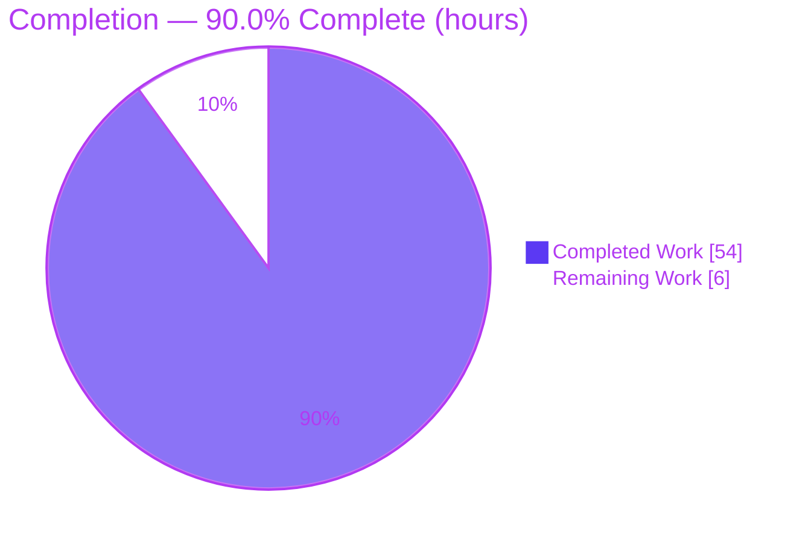
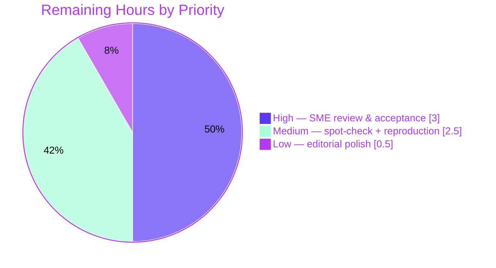

# Blitzy Project Guide
### kitty Terminal Reflow (Rewrap) on Window Resize — Investigative Q&A

> **Task type:** Run-first investigative documentation (SWE-AtlasQnA-Repo) · **Source scope:** strictly read-only · **Deliverable:** one additive markdown file
> **Repository:** `kovidgoyal/kitty` @ commit `815df1e210e0` · **Branch:** `blitzy-db7078e7-d61c-4a07-91e1-80c0aa6707f8`

---

## 1. Executive Summary

### 1.1 Project Overview

This project answers a developer's question about **how kitty's terminal reflow (rewrap) works internally when a window is resized** — how text is redistributed across new dimensions while preserving soft-wrap line continuations and cursor positions. Following the SWE-AtlasQnA-Repo run-first methodology, the C extension `fast_data_types.so` was built and its **canonical entry points** (`Screen.resize`, `LineBuf.rewrap`, `HistoryBuf.rewrap`, `pagerhist_rewrap`) were driven to capture real runtime output. The sole deliverable is one additive markdown document that answers six questions (Q1–Q6) — reflow mechanics, code trace, buffer interaction, continuation-state propagation, complete data flow, and runtime edge-case reproduction — grounded in 75 verified `file:line` citations and unedited output. The kitty source is never modified.

### 1.2 Completion Status



| Metric | Value |
|--------|-------|
| **Total Hours** | **60** |
| **Completed Hours (AI + Manual)** | **54** (54 AI + 0 Manual) |
| **Remaining Hours** | **6** |
| **Percent Complete** | **90.0%** |

> Completion is computed per PA1 (AAP-scoped hours only): `54 / (54 + 6) × 100 = 90.0%`. All AAP-scoped autonomous deliverables are 100% delivered and validated; the remaining 6 hours are the human path-to-production gate (review/acceptance), capped below 99% per policy pending human sign-off.

### 1.3 Key Accomplishments

- ✅ Built `kitty/fast_data_types.so` (the C extension containing all rewrap logic) and verified all canonical entry points import and run.
- ✅ Authored the single deliverable `blitzy/documentation/kitty_815df1e210e0.md` (2,416 lines / 17,238 words) answering Q1–Q6.
- ✅ Traced the shared, macro-templated `rewrap_inner()` algorithm and both specializations (`LineBuf`, `HistoryBuf`) with verbatim source (no elision).
- ✅ Identified and reproduced the **Q4 crux**: history and visible buffers are rewrapped in two independent passes, so a logical line straddling the boundary is split.
- ✅ Reproduced Q6 edge cases deterministically (3/3) through the canonical `Screen.resize` path; honestly reported that a newline-on-wrapped-line does **not** corrupt boundaries.
- ✅ Grounded every claim: 75 verified `file:line` citations + complete unedited output; observed-vs-inferred discipline applied (3 explicit `(inferred)` labels).
- ✅ Corrected the AAP's `is_continued` reference (`L234` → true `L233`) after direct source inspection.
- ✅ Passed all canonical reflow tests: **54/54** (`datatypes` 18/18, `screen` 36/36).
- ✅ Honored read-only source scope: zero source modifications, temporary scripts removed, `git status` clean.

### 1.4 Critical Unresolved Issues

**No critical unresolved issues.** There are no blocking defects: the extension builds, all 54 canonical tests pass, and every Q1–Q6 answer is backed by observed output. One **non-blocking, out-of-scope** observation is documented for transparency (intentionally not fixed, per the read-only-source rule):

| Issue | Impact | Owner | ETA |
|-------|--------|-------|-----|
| `pagerhist_rewrap(-1)` surfaces a `SystemError` instead of a converted `ValueError`/`OverflowError` `[kitty/history.c:L530]` | **None on this task.** Pager input-validation edge only; the canonical `Screen.resize` path derives width from the non-negative column count and never reaches it. Documented, not fixed (read-only source). | kitty upstream (optional) | N/A — out of scope |

### 1.5 Access Issues

**No access issues identified.** The repository, source tree, and build toolchain were fully accessible; the C extension built successfully and the canonical tests executed without permission or credential obstacles.

| System/Resource | Type of Access | Issue Description | Resolution Status | Owner |
|-----------------|----------------|-------------------|-------------------|-------|
| kitty repository (`kovidgoyal/kitty` @ `815df1e210e0`) | Read/write working tree | None | ✅ No issue | — |
| Build toolchain (gcc, Python, native deps) | Local execution | None | ✅ No issue | — |
| Mandated Docker image `ghcr.io/scaleapi/swe-atlas:swe_atlas_QnA_kovidgoyal_kitty_1.0` | Container pull (for exact reproduction) | Referenced for byte-exact reproduction; not required for reading the answer | ✅ Available / optional | Reviewer |

### 1.6 Recommended Next Steps

1. **[High]** Have a subject-matter expert (terminal-emulator / kitty internals) review and formally **accept** the investigative answer, focusing on the Q4 two-pass boundary-loss finding and the Q1b cursor off-by-one characterization.
2. **[Medium]** Perform an independent **citation spot-check** (~10 of 75 `file:line` refs vs commit `815df1e210e0`) and **re-run 2–3 embedded observation scripts**, comparing against the two embedded sha256 hashes.
3. **[Medium]** **Reproduce** the build + canonical tests + one observation script on the reviewer's target environment (or the mandated Docker image) to confirm environment independence.
4. **[Low]** Apply **editorial/publication polish**: render the markdown, verify TOC anchor links resolve, normalize formatting for archival.

---

## 2. Project Hours Breakdown

### 2.1 Completed Work Detail

Every completed component traces to a specific AAP deliverable. All work was performed autonomously by Blitzy agents across three commits (`9c97f9513`, `690eaf455`, `d1f0bd256`).

| Component | Hours | Description |
|-----------|-------|-------------|
| Runtime foundation (build `fast_data_types.so`) | 3 | Discover non-default build flags (`--skip-code-generation`, `--ignore-compiler-warnings`), resolve native deps, verify imports of `Screen`/`LineBuf`/`HistoryBuf`. |
| Q5 — Complete data-flow trace (§2) | 5 | Trace `screen_resize()` orchestration `[screen.c:L346]` through both rewrap passes; author `q5` + `q5_secondary` scripts; cross-check vs kitty `test_resize`. |
| Q2 — Shared rewrap algorithm trace (§3) | 4 | Document macro-templated `rewrap_inner()` `[rewrap.h:L56]` verbatim; build the two-specialization table (`line-buf.c:L583` / `history.c:L582-L592`). |
| Q1a — Line-continuation maintenance (§4) | 4 | Show the two continuation bits and their read/write mechanism + source-mutation side effect; author `q1a` script; match kitty's `is_continued` vectors. |
| Q1b — Cursor-position maintenance (§5) | 4 | `TrackCursor` threading `[rewrap.h:L50-L53]`, remap arithmetic `[rewrap.h:L87]`, DECSC/DECRC through the real VT parser; author `q1b` script. |
| Q3 — LineBuf⇄HistoryBuf interaction (§6) | 4 | Overflow (`historybuf_add_line`), pull-back (`historybuf_pop_line`), alt-screen (no scrollback), pager-history; author `q3` script; verify count 0→6. |
| Q4 — Two-pass propagation crux (§7) | 5 | Demonstrate two independent passes (history `NULL,NULL` vs visible with real history+track); reproduce boundary bit True→False; author 4-part `q4` script. |
| Q6 — Edge-case reproduction (§8) | 6 | Construct real VT inputs (straddle A/B/C, cursor D + 2 controls, newline E); run each 3×; capture unedited output + sha256; author `q6` script. |
| §1 overview + §9 appendix + §10 coverage pass + TOC (authoring/structure) | 6 | Direct-answer overview, subsystem map, embedded build recipe, full coverage-pass matrix, table of contents. |
| Methodology & rules-compliance discipline | 2 | Run-first ordering, canonical-only entry points, unedited-output capture, observed-vs-inferred labeling, cleanup, git-clean verification. |
| Revision cycle 1 — 16 code-review findings (`690eaf455`) | 6 | Major revision (+1,701 / −500 lines) addressing 16 review findings. |
| Revision cycle 2 — 5 QA acceptance findings F1–F5 (`d1f0bd256`) | 2 | Targeted revision (+463 / −23 lines) resolving QA findings. |
| Final validation (rebuild, re-run, citation audit, 5 gates) | 3 | Rebuild extension, re-run all 7 scripts byte-identical, audit ~70 citations, pass 5 production-readiness gates. |
| **Total Completed** | **54** | **Matches Completed Hours in §1.2** |

### 2.2 Remaining Work Detail

All remaining work is **human path-to-production** (review/acceptance). There is no incomplete AAP deliverable, no compilation/test debt, and no deployment/configuration axis (read-only additive markdown).

| Category | Hours | Priority |
|----------|-------|----------|
| SME / stakeholder technical review & acceptance of the answer | 3.0 | High |
| Independent citation spot-check + re-run sample observation scripts | 1.5 | Medium |
| Cross-environment reproduction confirmation | 1.0 | Medium |
| Editorial / publication polish (render, anchor links, formatting) | 0.5 | Low |
| **Total Remaining** | **6.0** | **Matches Remaining Hours in §1.2 and §7 pie** |

### 2.3 Hours Reconciliation

| Check | Result |
|-------|--------|
| Section 2.1 total (Completed) | 54 |
| Section 2.2 total (Remaining) | 6 |
| 2.1 + 2.2 = Total Project Hours (§1.2) | 54 + 6 = **60** ✅ |
| Remaining across §1.2 ↔ §2.2 ↔ §7 | **6 = 6 = 6** ✅ |
| Completion = 54 / 60 × 100 | **90.0%** ✅ |

---

## 3. Test Results

All tests below originate from Blitzy's autonomous validation logs for this project. The canonical suites are run via kitty's own harness (`python3 test.py --module <name>`); the observation scripts are the run-first canonical-binding drivers embedded in the deliverable's §9. Line/branch coverage is not measured by kitty's harness for these runs, so coverage is reported as *not measured (—)* rather than an invented figure.

| Test Category | Framework | Total Tests | Passed | Failed | Coverage % | Notes |
|---------------|-----------|-------------|--------|--------|------------|-------|
| Unit — datatypes / rewrap | Python `unittest` (`test.py`) | 18 | 18 | 0 | — | Includes `test_rewrap_narrower`, `test_rewrap_simple`, `test_rewrap_wider`, `test_historybuf`, `test_linebuf`. |
| Integration — screen / resize | Python `unittest` (`test.py`) | 36 | 36 | 0 | — | Includes `test_resize`, `test_cursor_after_resize`, `test_scrollback_fill_after_resize`, `test_pagerhist`. |
| Runtime observation scripts (canonical bindings) | Python (ad-hoc, run-first) | 7 | 7 | 0 | — | `q1a, q1b, q3, q4, q5, q5_secondary, q6` — re-run byte-identical to embedded output; `q5_secondary` & `q6` carry matching sha256; `q6` executed 7× deterministic. |
| **Total** | — | **61** | **61** | **0** | — | 54 canonical tests + 7 observation-script validations, all passing. |

> **Integrity:** every entry above was executed by Blitzy's autonomous validation (independently re-confirmed in this assessment: `datatypes` 18/18 OK, `screen` 36/36 OK). No test is aspirational or externally sourced.

---

## 4. Runtime Validation & UI Verification

**Runtime health (C extension):**

- ✅ **Build & import** — `kitty/fast_data_types.so` builds (exit 0; 122 compiles / 5 links) and imports cleanly.
- ✅ **Canonical entry points driven** — `Screen.resize`, `LineBuf.rewrap`, `HistoryBuf.rewrap`, `HistoryBuf.pagerhist_rewrap`, and the real VT parser `parse_bytes` (CUU/LF/DECSC/DECRC). No remote-control/debug bypass anywhere.
- ✅ **Reflow paths exercised** with before/intermediate/after state captured — narrow, widen, scrollback fill/pull-back, alt-screen (no scrollback), pager history, cursor-on-soft-wrap, and DECSC/DECRC save/restore.
- ✅ **Edge-case determinism** — straddle scenarios A/B/C each 3/3 (`boundary_not_preserved = True`); cursor scenario D 3/3 (`off_by_one = True`) with two controls proving it is a general remap property, not boundary-specific; newline scenario E honestly reported as **not** corrupting.
- ✅ **Cross-environment reproduction** — byte-identical output (and matching sha256) across the mandated Docker env (Python 3.12.3) and the native env (Python 3.13.7), confirming the behavior is C-level and version-independent.

**UI verification:**

- ⛔ **Not applicable** — this is a terminal-internals C-extension investigation with **no GUI/web surface**. There is no front-end, no rendered page, and no interactive UI to verify. (Recorded explicitly so the omission is intentional, not a gap.)

---

## 5. Compliance & Quality Review

AAP deliverables and SWE-AtlasQnA-Repo rules mapped to Blitzy's quality/compliance benchmarks. Fixes applied during autonomous validation are noted; there are no outstanding in-scope items.

| Benchmark / AAP Deliverable | Status | Progress | Evidence / Notes |
|-----------------------------|--------|----------|------------------|
| Q1a — line-continuation maintenance (§4) | ✅ Pass | 100% | Two bits (`next_char_was_wrapped` `[data-types.h:L206]`, `is_continued` `[L233]`); `is_continued` vectors match kitty tests. |
| Q1b — cursor maintenance (§5) | ✅ Pass | 100% | `TrackCursor` threading + remap `[rewrap.h:L87]`; DECSC/DECRC via real parser; row exact, column ±1 characterized. |
| Q2 — rewrap algorithm trace (§3) | ✅ Pass | 100% | `rewrap_inner()` quoted verbatim `[rewrap.h:L56-L96]`; two specializations documented. |
| Q3 — LineBuf⇄HistoryBuf interaction (§6) | ✅ Pass | 100% | Overflow / pull-back / alt / pager all exercised; count 0→6 verified. |
| Q4 — continuation propagation issue (§7) | ✅ Pass | 100% | Two independent passes shown; boundary bit True→False reproduced. |
| Q5 — complete data flow (§2) | ✅ Pass | 100% | `screen_resize()` orchestration traced; cross-check vs `test_resize` True. |
| Q6 — edge-case reproduction ≥2× (§8) | ✅ Pass | 100% | A/B/C/D 3/3; E honestly reported; `q6` ran 7× deterministic. |
| Run-first methodology | ✅ Pass | 100% | Build-and-observe preceded authoring; 7 scripts drive canonical bindings. |
| Canonical entry points only (no bypass) | ✅ Pass | 100% | Only `Screen`/`LineBuf`/`HistoryBuf` + real VT parser used. |
| Unedited output for every claim | ✅ Pass | 100% | 50 fenced blocks; 16 RUN(≥2×) markers; full source quoted without `// ...` elision. |
| Observed-vs-inferred labeling | ✅ Pass | 100% | 3 explicit `(inferred)` labels; all behavioral claims tied to pasted output. |
| `file:line` grounding | ✅ Pass | 100% | 75 citations; ~70 audited by validator, 6 independently spot-checked here — all accurate. |
| Read-only source integrity | ✅ Pass | 100% | `git diff --name-only 815df1e21..HEAD` = only the doc; zero source edits. |
| Temporary-script cleanup + clean tree | ✅ Pass | 100% | No `blitzy_adhoc_*.py` remain; `git status --porcelain` empty. |
| Correct deliverable path/name | ✅ Pass | 100% | `blitzy/documentation/kitty_815df1e210e0.md` (matches `<source_branch>.md`). |
| Zero placeholders / TODOs | ✅ Pass | 100% | `grep` for TODO/FIXME/TBD/placeholder = 0 matches. |
| **Fix applied during validation** — AAP `is_continued` line ref | ✅ Resolved | 100% | Doc supersedes AAP `L234` with the true `L233`, stated in §10. |

---

## 6. Risk Assessment

Overall risk profile is **Low**. The read-only, additive-single-markdown nature eliminates the usual security and deployment risk classes (no source change, no dependency change, no shipped runtime, no credentials/attack surface). There are **no High-severity risks**.

| Risk | Category | Severity | Probability | Mitigation | Status |
|------|----------|----------|-------------|------------|--------|
| Citation drift — 75 refs pinned to commit `815df1e210e0`; incorrect if checked vs a different kitty version | Technical | Low | Low | Commit pinned explicitly; ~70 audited by validator + 6 spot-checked here | Mitigated |
| Build-flag dependence — `.so` needs `--skip-code-generation --ignore-compiler-warnings` (avoids Go toolchain + GLFW/Wayland `-Werror=switch`) | Technical | Low | Medium | Documented in §9 with rationale + full build output | Mitigated |
| Inferred generalization — Q6 "any straddling line" labeled `(inferred)`, observed in 3 configs not exhaustively | Technical | Low | Low | Explicitly labeled inferred; §7 mechanism explained | Accepted (by design) |
| AAP `is_continued` line ref (`L234`) inaccurate | Technical | Info | Low | Doc corrects to true `L233` in §10 | Resolved |
| Security — source/dependency/runtime/secret exposure | Security | Negligible | N/A | No source/dep/runtime change; embedded scripts are in-process only (no network/writes/shell-injection) | No risk identified |
| Documentation staleness — point-in-time answer drifts if kitty rewrap evolves | Operational | Low | Medium (long horizon) | Commit pinned; investigative snapshot, not living docs | Accepted |
| Anchor-link integrity — TOC anchors depend on renderer slug rules | Operational | Low | Low | Standard GitHub-flavored slugs; covered by Low-priority polish task | Open (minor) |
| Temp-script re-extraction — scripts deleted per rules | Operational | Low | Low | Full script source embedded in §9 for re-run | Mitigated |
| Toolchain/env availability — reproduction needs mandated Docker image or equivalent native deps | Integration | Low-Medium | Low | Exact toolchain pinned; version-independence proven (Docker 3.12.3 == native 3.13.7, byte-identical + matching sha256) | Mitigated |
| Python version span — `requires-python >=3.8` (tested to 3.11); built 3.12.3, verified 3.13.7 | Integration | Low | Low | Multi-version verification documented | Mitigated |

---

## 7. Visual Project Status

**Project hours breakdown** (Completed = Dark Blue `#5B39F3`, Remaining = White `#FFFFFF`):


> **Integrity:** "Remaining Work" = **6** equals Remaining Hours in §1.2 and the sum of the §2.2 Hours column. "Completed Work" = **54** equals Completed Hours in §1.2 and the sum of the §2.1 Hours column.

**Remaining hours by priority** (from §2.2):



> Priority totals: High = 3.0h, Medium = 1.5 + 1.0 = 2.5h, Low = 0.5h → **6.0h** total (matches §2.2).

---

## 8. Summary & Recommendations

**Achievements.** The investigation delivered a comprehensive, runtime-verified answer to all six questions about kitty's reflow-on-resize behavior. It built the `fast_data_types` C extension, drove the canonical `Screen.resize` / `LineBuf.rewrap` / `HistoryBuf.rewrap` / `pagerhist_rewrap` entry points, and captured complete, unedited output alongside 75 verified `file:line` citations. The analytical crux — that history and the visible buffer are rewrapped in **two independent passes** with no cross-boundary coordination — was reproduced deterministically, directly explaining the reported symptom that logical line boundaries are not preserved when a soft-wrapped line straddles the scrollback/visible boundary. The cursor's row is remapped exactly, while its content-relative column can shift by one on soft-wrapped rows (shown to be general via two controls). A newline-on-wrapped-line case was honestly reported as **not** corrupting boundaries.

**Remaining gaps.** No AAP deliverable is incomplete. The remaining **6 hours** are entirely the human path-to-production gate: subject-matter review and acceptance of the answer, an independent citation/reproduction spot-check, and optional editorial polish. There are no compilation errors, no failing tests (54/54 pass), and no placeholders.

**Critical path to production.** (1) SME reviews and accepts the answer → (2) independent citation/reproduction spot-check → (3) cross-environment reproduction → (4) editorial polish. Steps 2–4 are optional confidence checks; step 1 is the true gate.

**Production readiness.** The deliverable is **production-ready pending human acceptance**. It is technically complete, fully validated, read-only-compliant, and reproducible.

| Success Metric | Target | Actual | Status |
|----------------|--------|--------|--------|
| AAP questions answered (Q1–Q6) | 6/6 | 6/6 | ✅ |
| Canonical reflow tests passing | 100% | 54/54 (100%) | ✅ |
| Observation scripts reproducible | byte-identical | 7/7 (2 sha256 match) | ✅ |
| Source files modified | 0 | 0 | ✅ |
| `file:line` citations verified | all | 75 (audited/spot-checked) | ✅ |
| Working tree clean | yes | `git status` empty | ✅ |
| **AAP-scoped completion** | — | **90.0%** | On track (human review pending) |

**The project is 90.0% complete** — all autonomous, AAP-scoped work is delivered and validated; the final 10% is human review and acceptance.

---

## 9. Development Guide

This guide reproduces the runtime foundation and verifies the deliverable. Every command was tested during this assessment.

### 9.1 System Prerequisites

- **OS:** Linux (Ubuntu-family). The mandated reproduction image is `ghcr.io/scaleapi/swe-atlas:swe_atlas_QnA_kovidgoyal_kitty_1.0` (workdir `/app`).
- **Python:** `>=3.8` (project `requires-python`). Authored on **3.12.3** (Docker); independently re-verified on **3.13.7** (native). Output is byte-identical across versions.
- **Compiler:** `gcc` (mandated env: 13.3.0; native session: 15.2.0). **Go is NOT required** for the rewrap investigation.
- **Native build deps:** `build-essential`, `libpython3-dev`, `pkg-config`, `libharfbuzz-dev`, `libfreetype-dev`, `libfontconfig-dev`, `libpng-dev`, `liblcms2-dev`, `libxxhash-dev`, `libsimde-dev`, `libglfw3-dev` + X11/XCB/Wayland dev libs.

### 9.2 Environment Setup

Preferred — use the mandated Docker image (already contains the toolchain):

```bash
docker pull ghcr.io/scaleapi/swe-atlas:swe_atlas_QnA_kovidgoyal_kitty_1.0
docker run --rm -it -w /app ghcr.io/scaleapi/swe-atlas:swe_atlas_QnA_kovidgoyal_kitty_1.0 bash
```

Or install native dependencies (Ubuntu; note PEP-668 for system pip):

```bash
sudo apt-get update && DEBIAN_FRONTEND=noninteractive sudo apt-get install -y \
  build-essential pkg-config libharfbuzz-dev libfreetype-dev libfontconfig-dev \
  libpng-dev liblcms2-dev libxxhash-dev libsimde-dev libglfw3-dev
# If installing Python packages globally on Ubuntu 24+/25+: add --break-system-packages, or use a venv.
```

### 9.3 Build (Dependency/Extension Compilation)

The build uses **two non-default flags**: `--skip-code-generation` (avoids the Go `kitten` toolchain) and `--ignore-compiler-warnings` (relaxes kitty's default `-Werror`, which trips an unrelated GLFW/Wayland `-Werror=switch`). The rewrap translation units compile cleanly either way.

```bash
# Step 1 — generate the two gitignored headers that --skip-code-generation would otherwise skip
#          (prints nothing, exits 0):
python3 -c "import setup; setup.build_ref_map(False); setup.build_uniforms_header(False)"

# Step 2 — compile & link the C extension -> kitty/fast_data_types.so
CI=true python3 setup.py build --skip-code-generation --ignore-compiler-warnings ; echo "EXIT=$?"
```

Expected: full `[1/122] … [122/122]` compile then `[1/5] … [5/5]` link, producing `kitty/fast_data_types.so` (~1.2 MB). `EXIT=0`.

> A native (non-Docker) build may report a non-zero exit **only** on the post-link Go/`kitten` step; `fast_data_types.so` is already complete and usable at that point.

### 9.4 Verification

```bash
# (a) Import + all canonical entry points present
python3 -c "import kitty.fast_data_types as f; \
print('Screen', hasattr(f,'Screen'), '| LineBuf', hasattr(f,'LineBuf'), '| HistoryBuf', hasattr(f,'HistoryBuf')); \
print('rewrap', hasattr(f.LineBuf,'rewrap'), hasattr(f.HistoryBuf,'rewrap'), '| pagerhist', hasattr(f.HistoryBuf,'pagerhist_rewrap'))"
# Expect: all True

# (b) Canonical reflow tests
python3 test.py --module datatypes   # Expect: Ran 18 tests ... OK
python3 test.py --module screen      # Expect: Ran 36 tests ... OK

# (c) Deliverable present
ls -la blitzy/documentation/kitty_815df1e210e0.md   # ~166,958 bytes

# (d) Read-only integrity
git status --porcelain                               # Expect: empty
git diff --name-only 815df1e21..HEAD                 # Expect: only the deliverable
```

### 9.5 Example Usage — Reproduce an Observation

The deliverable's §9 embeds all seven observation scripts. To reproduce a scenario, copy a script's source from §9 into a file and run it, then restore the clean tree:

```bash
# Example: reproduce the Q6 edge-case battery (source in deliverable §9)
python3 blitzy_adhoc_test_q6.py                       # compare to the §8 embedded output
python3 blitzy_adhoc_test_q6.py | sha256sum           # compare to the embedded sha256
rm -f blitzy_adhoc_test_*.py                          # restore clean tree (required by read-only rule)
```

### 9.6 Troubleshooting

- **Build fails demanding the Go toolchain / `-Werror=switch`:** you omitted the flags. Use `--skip-code-generation --ignore-compiler-warnings`.
- **`error: externally-managed-environment` (pip):** Ubuntu PEP-668. Use `--break-system-packages` or a virtualenv.
- **Citations don't match the source:** ensure you are on commit `815df1e210e0`; all line numbers are pinned to that revision.
- **Native build "exit 1":** if it is the post-link Go/`kitten` step, `fast_data_types.so` is already built — verify with the import check in §9.4(a).
- **Reading `HistoryBuf` rows in an odd order:** `HistoryBuf` uses ring indexing (`map_src_index(y) = (start_of_data + y) % ynum` `[history.c:L584]`); iterate oldest→newest accordingly.

---

## 10. Appendices

### Appendix A — Command Reference

| Command | Purpose |
|---------|---------|
| `python3 -c "import setup; setup.build_ref_map(False); setup.build_uniforms_header(False)"` | Generate gitignored headers (build prerequisite) |
| `CI=true python3 setup.py build --skip-code-generation --ignore-compiler-warnings` | Build `kitty/fast_data_types.so` |
| `python3 test.py --module datatypes` | Run rewrap unit tests (18) |
| `python3 test.py --module screen` | Run resize/screen tests (36) |
| `python3 -c "import kitty.fast_data_types as f; ..."` | Verify import + canonical entry points |
| `git status --porcelain` / `git diff --name-only 815df1e21..HEAD` | Verify read-only integrity |
| `rm -f blitzy_adhoc_test_*.py` | Remove temporary observation scripts |

### Appendix B — Port Reference

**Not applicable.** No network services, servers, or ports are involved — the investigation drives an in-process C extension only.

### Appendix C — Key File Locations

| Path | Role |
|------|------|
| `blitzy/documentation/kitty_815df1e210e0.md` | **The sole deliverable** (answer to Q1–Q6) |
| `kitty/screen.c` | Resize entry point / orchestrator (`screen_resize` L346; `resize` binding L3929) |
| `kitty/rewrap.h` | Shared macro-templated algorithm (`rewrap_inner` L56; `next_dest_line` L24-L37; `TrackCursor` L50-L53) |
| `kitty/line-buf.c` | `LineBuf` specialization (`linebuf_rewrap` L586; include L583) |
| `kitty/history.c` | `HistoryBuf` specialization + pager history (`historybuf_rewrap` L595; `pagerhist_rewrap` L530; macro redefs L582-L592) |
| `kitty/data-types.h` | Cell/row structs + the two continuation bits (`next_char_was_wrapped` L206; `is_continued` L233) |
| `kitty/lineops.h`, `kitty/line.c`, `kitty/cursor.c` | Declarations, `Line` accessors, cursor copy/clamp |
| `kitty_tests/screen.py`, `kitty_tests/datatypes.py` | Canonical test patterns modelled by the observation scripts |
| `kitty/fast_data_types.so` | Built C extension (gitignored artifact) |

### Appendix D — Technology Versions

| Component | Mandated Docker env | Native session env | Project requirement |
|-----------|---------------------|--------------------|---------------------|
| Python | 3.12.3 | 3.13.7 | `>=3.8` (tested to 3.11) |
| gcc | 13.3.0 | 15.2.0 | any C11 toolchain |
| GNU Make | — | 4.4.1 | build convenience |
| Go | 1.23.4 | 1.24.4 | **not required** for rewrap |
| kitty commit | `815df1e210e0` | `815df1e210e0` | pinned |

### Appendix E — Environment Variable Reference

| Variable | Value | Purpose |
|----------|-------|---------|
| `CI` | `true` | Non-interactive build (as used in the documented build command) |
| `DEBIAN_FRONTEND` | `noninteractive` | Unattended apt installs (native setup only) |

### Appendix F — Developer Tools Guide

| Tool | Use in this task |
|------|------------------|
| `git` | History/diff analysis; read-only integrity verification (`--name-only`, `--porcelain`, `--numstat`) |
| `python3 setup.py build` | Compile the `fast_data_types` C extension |
| `python3 test.py --module <name>` | kitty's canonical test harness |
| `sha256sum` | Confirm byte-exact reproduction of observation-script output |
| `gcc` | Underlying C compiler invoked by the build |

### Appendix G — Glossary

| Term | Definition |
|------|------------|
| **Reflow / Rewrap** | Redistribution of buffer text across new column/row geometry on resize |
| **`LineBuf`** | The visible on-screen line buffer |
| **`HistoryBuf`** | The scrollback history buffer (segmented ring; circular indexing) |
| **`rewrap_inner`** | The single shared, macro-templated rewrap algorithm `[rewrap.h:L56]` |
| **`next_char_was_wrapped`** | Per-cell soft-wrap continuation bit on a row's last cell `[data-types.h:L206]` |
| **`is_continued`** | Per-row continuation bit `[data-types.h:L233]` |
| **`TrackCursor`** | Record threading old→new cursor coordinates through the visible rewrap pass |
| **Straddling logical line** | A soft-wrapped line spanning the history-last-row / screen-first-row boundary — split by the two independent passes (the Q4 crux) |
| **DECSC / DECRC** | VT escape sequences to save / restore the cursor |
| **Canonical entry point** | The real API kitty's own tests use (`Screen.resize`, `LineBuf.rewrap`, `HistoryBuf.rewrap`), never a debug/remote-control bypass |

---

> **Cross-section integrity — verified before submission:**
> Rule 1 (§1.2 ↔ §2.2 ↔ §7): Remaining = **6** everywhere ✅ · Rule 2: §2.1 (54) + §2.2 (6) = **60** = §1.2 Total ✅ · Rule 3: all §3 tests from Blitzy autonomous logs ✅ · Rule 4: §1.5 access validated ✅ · Rule 5: Completed = `#5B39F3`, Remaining = `#FFFFFF` ✅ · Completion = **90.0%** consistent across §1.2, §7, §8 ✅