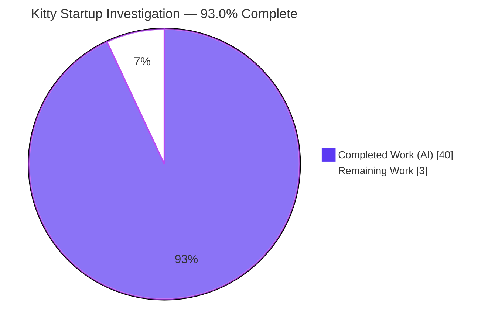
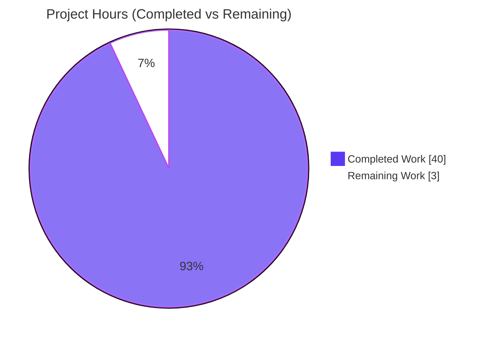
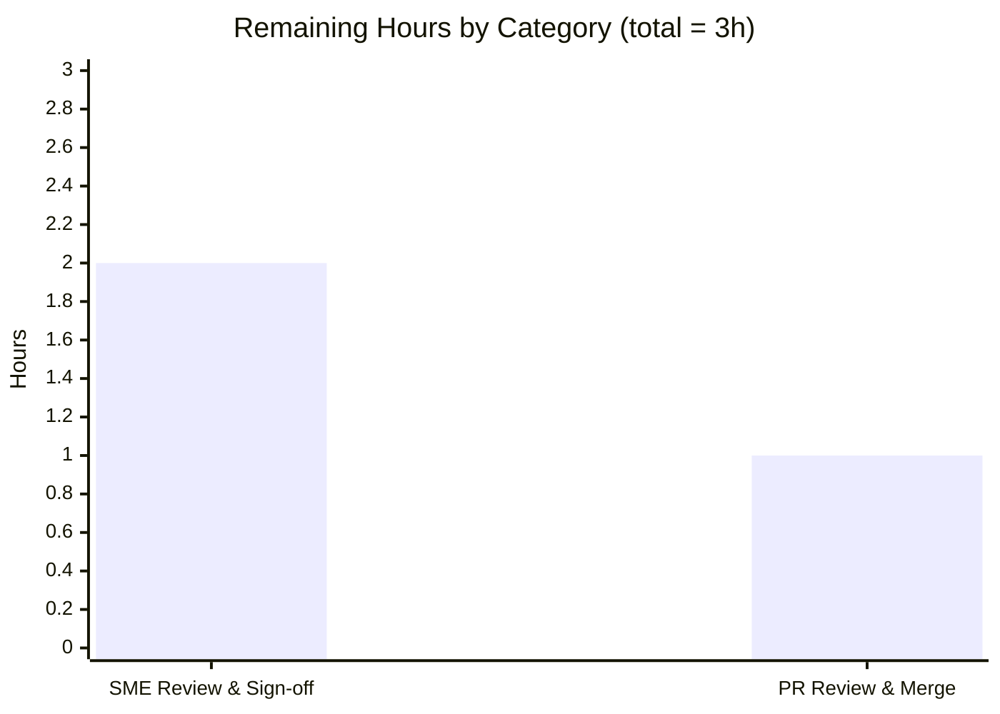
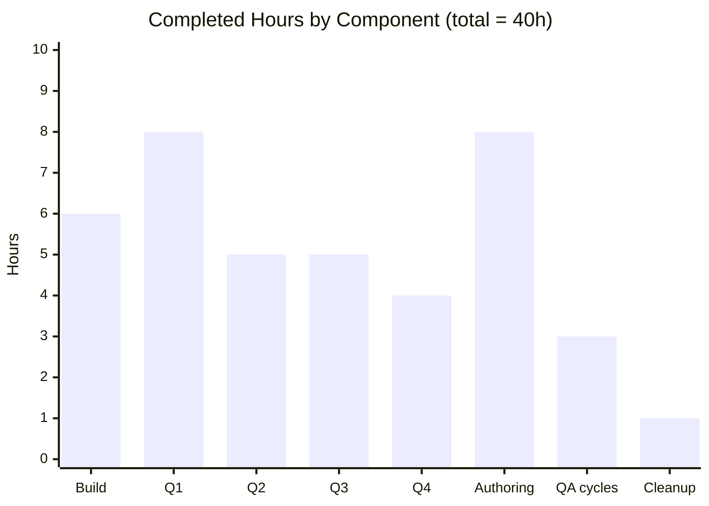

# Blitzy Project Guide — Kitty Terminal Startup Investigation

> **Deliverable:** `blitzy/documentation/kitty_815df1e210e0.md` — an evidence-backed Markdown document answering four questions about Kitty's startup, produced by building and running Kitty headlessly at commit `815df1e21`.
> **Task type:** Read-only investigative QnA documentation (rule set: SWE-AtlasQnA-Repo).
> **Assessment basis:** AAP-scoped completion (PA1) measured over autonomous work delivered + path-to-production.

**Brand color legend:** <span title="#5B39F3">■</span> **Completed / AI Work** = Dark Blue `#5B39F3` · <span title="#FFFFFF">□</span> **Remaining / Not Completed** = White `#FFFFFF` · Headings/Accents = Violet-Black `#B23AF2` · Highlight = Mint `#A8FDD9`.

---

## 1. Executive Summary

### 1.1 Project Overview

This project answers four interrelated questions about how the [Kitty](https://sw.kovidgoyal.net/kitty/) GPU-accelerated terminal emulator starts up — from native process launch to a shell-ready terminal — by actually **building and running** Kitty **headlessly** (Xvfb + Mesa llvmpipe software OpenGL) at commit `815df1e21` and quoting **real observed output verbatim**. The audience is engineers seeking a grounded, citation-backed understanding of Kitty's launcher, configuration, PTY/shell handshake, and rendering subsystems. The technical scope is a strictly **read-only** investigation whose sole deliverable is one Markdown answer document; no Kitty source code is modified.

### 1.2 Completion Status



| Metric | Hours |
|--------|-------|
| **Total Hours** | **43** |
| Completed Hours (AI + Manual) | 40 (40 AI · 0 manual) |
| Remaining Hours | 3 |
| **Percent Complete** | **93.0%** |

> Completion is calculated per PA1 (AAP-scoped hours): `40 / (40 + 3) × 100 = 93.0%`. All AAP-scoped **autonomous** work is complete and validated; the remaining 3h is human-only path-to-production (review + merge).

### 1.3 Key Accomplishments

- ✅ Kitty **built from source** (`python setup.py build --verbose`, exit 0) and **launched headlessly** under Xvfb `:99` + Mesa llvmpipe (OpenGL 4.5).
- ✅ **All four user questions answered** with verbatim evidence and exact `file:line` citations — a 10-subsystem Q1 startup enumeration, Q2 configuration/defaults proof, Q3 PTY/handshake/parse+draw, Q4 fonts/layout/scrolling/screen-updates.
- ✅ **28/28 coverage items** confirmed; **~150 file:line citations** (independently spot-checked 8/8 EXACT against source).
- ✅ **Honest reality-reporting:** four "report-reality corrections", including two that correct the governing plan's assumptions (Linux OpenGL minimum is **3.1**, not 3.3; `--debug-config` is **not** a CLI flag at this commit).
- ✅ **Perfect read-only integrity:** `git diff` shows exactly one added file; working tree clean; all scaffolding removed.
- ✅ **All five autonomous validation gates passed** (tests, build, clean `-Werror` compile, in-scope validation, read-only integrity).

### 1.4 Critical Unresolved Issues

| Issue | Impact | Owner | ETA |
|-------|--------|-------|-----|
| _None identified_ — the single deliverable is complete, validated, and committed with read-only integrity intact. | None | — | — |

There are **no blocking or critical unresolved issues**. Residual items are low-severity, environment-specific reproducibility notes already disclosed inside the document (see Section 6).

### 1.5 Access Issues

| System/Resource | Type of Access | Issue Description | Resolution Status | Owner |
|-----------------|----------------|-------------------|-------------------|-------|
| _None_ | — | No access issues identified. Repository access, build toolchain, and the canonical headless run environment (prebuilt `kitty-qna:ready` Docker image) were all available during autonomous validation. | N/A | — |

**No access issues identified.**

### 1.6 Recommended Next Steps

1. **[High]** Perform SME technical read-through of the answer document, confirming all four questions and 28 coverage items are answered to stakeholder satisfaction.
2. **[High]** Spot-check a representative sample (~15–20) of the ~150 `file:line` citations against source at commit `815df1e21` (agent spot-check already found 8/8 EXACT).
3. **[High]** Confirm no sensitive values appear in the quoted runtime output (reviewed benign) and that the environment-specific reproducibility caveats are acceptable.
4. **[Medium]** Review the single-file PR diff, verify read-only integrity (`git diff 815df1e21..HEAD --name-status`), approve, and merge.

---

## 2. Project Hours Breakdown

### 2.1 Completed Work Detail

| Component | Hours | Description |
|-----------|-------|-------------|
| Build environment + Kitty compilation | 6 | Install native deps; `setup.py build --verbose` (exit 0); bring up Xvfb + Mesa llvmpipe software OpenGL; resolve the `libcrypto`/`libssl-dev` build prerequisite; verify GL stack with `glxinfo`. |
| Q1 — Startup subsystem investigation | 8 | Launch with `--debug-rendering`; enumerate 10 subsystems in order (launcher → Python dispatch → `main()` → GLFW/XKB → OpenGL → shaders → fonts → Boss/child-monitor → child fork+PTY → terminal-ready handshake); capture ordered timeline; map each to a verbatim log line + `file:line`. |
| Q2 — Configuration decision investigation | 5 | Capture built-in defaults via `+runpy`; obtain the effective-config `debug_config` dump over remote control; cross-reference against `options/definition.py`; prove untouched-defaults via absence of `Loaded config files:`; confirm font config applied at HEAD. |
| Q3 — Terminal-to-shell readiness investigation | 5 | Trace `os.openpty()`, child-environment population (`TERM`/`COLORTERM`/`TERMINFO`/`KITTY_*`), the terminal-ready handshake and its correctness-critical ordering; prove parse+draw via a shell sentinel round-trip. |
| Q4 — Display subsystem evidence investigation | 4 | Capture FONTS (`--debug-font-fallback`), LAYOUT (cell grid / PTY size), SCROLLING (scrollback history), and SCREEN UPDATES (`SIGWINCH` + GPU render cycle) with confirming messages. |
| Answer document authoring | 8 | Author the 562-line / ~6,300-word document: reproduce the four questions verbatim, apply one-claim-one-evidence discipline, embed ~150 citations, write the coverage pass and report-reality corrections. |
| QA / code-review revision cycles | 3 | Three post-authoring revision commits addressing code-review + QA findings (citation-range precision, R3 evidence, R5 citations). |
| Read-only cleanup & git integrity verification | 1 | Remove `/tmp` scaffolding; verify `git status` clean and `git diff` shows only the answer document. |
| **Total** | **40** | |

**Validation:** Section 2.1 total (**40h**) equals Completed Hours in Section 1.2.

### 2.2 Remaining Work Detail

| Category | Hours | Priority |
|----------|-------|----------|
| Human SME technical review & sign-off of answer document (read-through, coverage confirmation, citation spot-check, captured-output safety/reproducibility review) | 2 | High |
| PR review & merge (single-file diff, read-only integrity check) | 1 | Medium |
| **Total** | **3** | |

**Validation:** Section 2.2 total (**3h**) equals Remaining Hours in Section 1.2 and the Section 7 pie chart "Remaining Work" value.

### 2.3 Total Project Hours Reconciliation

| Line | Hours |
|------|-------|
| Section 2.1 — Completed | 40 |
| Section 2.2 — Remaining | 3 |
| **Total Project Hours** | **43** |
| Completion (`40 / 43`) | **93.0%** |

`Section 2.1 (40) + Section 2.2 (3) = 43 = Total Project Hours (Section 1.2)` ✔

---

## 3. Test Results

All tests below originate from **Blitzy's autonomous validation logs** (GATE 1). Because this is a read-only documentation task, no new tests were authored; instead Blitzy's validation executed the **upstream Kitty test suite** against the freshly built binary to confirm build health.

| Test Category | Framework | Total Tests | Passed | Failed | Coverage % | Notes |
|---------------|-----------|-------------|--------|--------|------------|-------|
| Python unit/functional | Kitty `test.py` (unittest via `kitty +launch test.py`) | 149 | 145 | 0 | N/A (not measured) | 4 legitimate skips: CA-certs (frozen-build only), macOS Last-Resort font, `fish` not installed (×2). |
| Go tooling | `go test` | All passed | All passed | 0 | N/A (not measured) | Suite reported fully passing in validation logs; exact count not individually enumerated. |

**Summary:** 145 Python tests pass with 0 failures/errors; the Go suite passes in full. The 4 skips are environment-legitimate, not defects. Coverage percentage was not a validation metric for this documentation task (the suite is run to confirm the build is healthy, not to measure new-code coverage). **Integrity note:** no fabricated test results — every entry traces to Blitzy's autonomous execution logs.

---

## 4. Runtime Validation & UI Verification

Runtime validation was performed by building Kitty and launching it headlessly, then reading back the drawn terminal via remote control.

**Build & Environment**
- ✅ **Operational** — `python3 setup.py build --verbose` → exit 0; launcher binary produced.
- ✅ **Operational** — Xvfb `:99` + Mesa llvmpipe software OpenGL; `glxinfo -B` reports `llvmpipe` / OpenGL **4.5**.

**Q1 — Startup subsystems coming online**
- ✅ **Operational** — Native launcher banner `kitty 0.35.2 created by Kovid Goyal`.
- ✅ **Operational** — GLFW/window: `[t] OS Window created`; XKB keymap loaded + modifier indices resolved.
- ✅ **Operational** — GPU online: `[t] GL version string: '4.5 (Core Profile) Mesa ...' Detected version: 4.5`.
- ✅ **Operational** — Fonts: `[t] Text fonts:` block (DejaVuSansMono faces); child fork: `[t] Child launched`.
- ⚠ **Partial (non-fatal, expected)** — `[t] Failed to open systemd user bus with error: Connection refused` (harmless in a container; startup continues).

**Q2 — Configuration applied**
- ✅ **Operational** — Effective-config `debug_config` dump reproduced, including the `OpenGL:` line; built-in defaults confirmed (`term=xterm-kitty`, `font_size=11.0`, `scrollback_lines=2000`, `repaint_delay=10`, `input_delay=3`, `sync_to_monitor=True`); font config applied at HEAD.

**Q3 — Terminal-to-shell readiness**
- ✅ **Operational** — PTY created; child env carries `TERM=xterm-kitty`, `COLORTERM=truecolor`, `KITTY_*`; shell sentinel round-trip proves parse+draw (`get-text` returned the emitted sentinel string).

**Q4 — Display subsystem**
- ✅ **Operational** — Cell grid (`cols=71 lines=22`) agreement; `scrollback_lines=2000`; `SIGWINCH sent to child ...` on font-size change; GPU render cycle active.

**UI Verification:** This project has **no conventional web/GUI product UI**. The "UI" under test is Kitty's own terminal window rendered headlessly under Xvfb; its drawn cell grid was verified by reading it back through remote control (`kitten @ get-text`), confirming the display path is live. No browser-based UI verification applies.

---

## 5. Compliance & Quality Review

Cross-mapping the AAP deliverables and the governing SWE-AtlasQnA-Repo rules to Blitzy's quality benchmarks:

| Benchmark / Rule (AAP §0.7) | Status | Progress | Evidence |
|------------------------------|--------|----------|----------|
| Deliverable at mandated path/name (`blitzy/documentation/kitty_815df1e210e0.md`) | ✅ Pass | 100% | File exists (562 lines); name derived from branch `kitty_815df1e210e0`. |
| Investigate-by-running (build + run first) | ✅ Pass | 100% | Built (`setup.py build`, exit 0); ran headless under Xvfb + llvmpipe; captured live output. |
| Quote observed output verbatim, one claim → one evidence | ✅ Pass | 100% | Each behavioral claim paired with a single verbatim line + producing command. |
| Answer every part, incl. every named item | ✅ Pass | 100% | Coverage pass: 28/28 items checked (Q1=14, Q2=5, Q3=4, Q4=5); Q4 FONTS/LAYOUT/SCROLLING/SCREEN-UPDATES all present. |
| Be exact & grounded (exact literals + `file:line`) | ✅ Pass | 100% | ~150 citations; independent spot-check 8/8 EXACT (e.g., `data-types.h:L19-26`, `gl.c:L72`, `definition.py:L3242/L372`). |
| Report reality (even if unexpected) | ✅ Pass | 100% | 4 report-reality corrections incl. OpenGL 3.1-vs-3.3 and `--debug-config` not-a-flag; `libcrypto`/`libssl-dev` build failure disclosed. |
| Scope read-only (no source changes) | ✅ Pass | 100% | `git diff 815df1e21..HEAD --name-status` = one added file; working tree clean; scaffolding in `/tmp` removed. |
| Reproduce four questions verbatim in the doc | ✅ Pass | 100% | Questions block matches AAP §0.1.1 exactly. |
| Document structural quality | ✅ Pass | 100% | 1 H1, 60 balanced code fences, 0 TODO/placeholder markers. |

**Fixes applied during autonomous validation:** the document was refined across three post-authoring commits — code-review findings (`09108647e`), `load_config()` citation-range precision (`b832deafc`), and QA final-acceptance findings adding R3 evidence + R5 citations (`ab6f63e9b`). **Outstanding items:** none at the autonomous level; remaining work is human sign-off only.

---

## 6. Risk Assessment

Because this is a **read-only documentation deliverable** (zero source/dependency changes, clean `-Werror` build, all tests passing), the classic high-severity project risks (compilation errors, test failures, vulnerabilities, broken integrations) **do not apply**. All residual risks are Low severity and already disclosed within the document.

| Risk | Category | Severity | Probability | Mitigation | Status |
|------|----------|----------|-------------|------------|--------|
| Run-specific transient values (timestamps, PID, paths, key, exact SIGWINCH geometry) differ on re-run | Technical | Low | Medium | Doc's "Reproducibility & environment notes" flag this; claims rest on stable format/mechanism/ordering, not transient values. | Mitigated (disclosed) |
| Citations valid only at commit `815df1e21`; line numbers drift on other commits | Technical | Low | Low–Medium | HEAD commit pinned prominently (title, summary, env notes). | Mitigated (disclosed) |
| Software-GL (llvmpipe) vs real-GPU divergence in GL version string/timings | Technical | Low | Low | Startup sequence is GPU-agnostic; observed software-GL values reported verbatim with rationale. | Mitigated (disclosed) |
| `libcrypto` build failure not reproducible in prebuilt container (ships `libssl-dev`) | Technical | Low | Low | Claim grounded in `setup.py:L253/L275`; labeled a report-reality item. | Accepted (source-grounded) |
| Captured output could in principle contain secrets/PII (`PATH`, `KITTY_PUBLIC_KEY`) | Security | Low | Low | Values reviewed benign (ephemeral per-process key, standard PATH); confirm during SME review. | Open (low; part of review) |
| No new attack surface introduced | Security | Informational | N/A | Only artifact is Markdown; read-only mandate enforced. | N/A |
| `libssl-dev` prerequisite beyond CI apt list for stock hosts | Operational | Low | Medium | Doc documents exact prereq + fix (provides `libcrypto.pc`). | Mitigated (documented) |
| Headless GL setup complexity (Xvfb + llvmpipe + env vars) | Operational | Low | Medium | Doc's Method section gives the exact copy-pasteable recipe. | Mitigated (documented) |
| Full byte-for-byte reproduction depends on canonical `kitty-qna:ready` image | Integration | Low | Medium | Doc provides a build-from-scratch alternative recipe. | Mitigated (documented) |
| No external service integrations | Integration | N/A | N/A | Task has zero external APIs/credentials/webhooks. | N/A |

**Overall posture: LOW.** No High/Critical risks; nothing blocks release.

---

## 7. Visual Project Status

### Project Hours Breakdown



> Colors per Blitzy brand: **Completed = Dark Blue `#5B39F3`**, **Remaining = White `#FFFFFF`**.
> Integrity: "Remaining Work" = **3** matches Section 1.2 Remaining Hours and the Section 2.2 "Hours" total.

### Remaining Hours by Category



### Completed Hours by Component



---

## 8. Summary & Recommendations

**Achievements.** The project delivered a rigorous, evidence-grounded answer document that explains Kitty's startup end-to-end. Kitty was compiled and run **headlessly** under Xvfb + Mesa llvmpipe, and every behavioral claim across all four questions is anchored to a verbatim observed line and an exact `file:line` citation. The investigation enumerates ten startup subsystems in order, proves initial-configuration resolution against built-in defaults, traces the PTY/terminal-ready handshake and its correctness-critical ordering, and documents the font/layout/scrolling/screen-update evidence that the display system is live. The work is notable for its honesty: four report-reality corrections were surfaced, including two that correct the governing plan's own assumptions.

**Remaining gaps.** None at the autonomous level. The only outstanding work is **human path-to-production**: SME technical review & sign-off (2h) and PR review & merge (1h).

**Critical path to production.** (1) SME reads the document and confirms coverage → (2) spot-checks citations at commit `815df1e21` and confirms captured output is free of sensitive values → (3) approves and merges the single-file PR.

**Success metrics.** All five autonomous validation gates passed; read-only integrity is perfect (`git diff` = one added file); 28/28 coverage items and ~150 citations (8/8 spot-checked EXACT).

**Production readiness assessment.** The deliverable is **93.0% complete** (40h of 43h AAP-scoped hours) and is **production-ready pending human sign-off**. For a read-only documentation artifact, "production" means acceptance and merge; there is no code to deploy, no service to operate, and no integration to configure.

| Metric | Value |
|--------|-------|
| Completion | 93.0% |
| Completed Hours | 40 |
| Remaining Hours | 3 |
| Total Hours | 43 |
| Open critical issues | 0 |
| Overall risk | Low |
| Confidence | High |

---

## 9. Development Guide

> **Environment note:** Kitty requires OpenGL ≥ 3.1 (Linux) and cannot start without a GL context. The canonical run environment is the prebuilt **`kitty-qna:ready`** Docker image (Ubuntu 24.04.2, Python 3.12.3, Go 1.23.4, Xvfb + Mesa llvmpipe). A generic CI/dev shell without Go or Xvfb **cannot** build/run Kitty — use the container or a fully provisioned Ubuntu 24.04 host.

### 9.1 System Prerequisites

- Linux x86_64.
- Python **≥ 3.8** (`pyproject.toml:L2`); canonical env uses 3.12.
- Go **1.22** (`go.mod:L3`).
- C toolchain (`gcc`).
- Xvfb + Mesa software GL (`xvfb`, `mesa-utils`, `libgl1-mesa-dri`).
- `git`.

### 9.2 Environment Setup

**Option A — canonical container (recommended):**

```bash
docker run -d --entrypoint /usr/bin/sleep \
  --tmpfs /tmp:exec \
  -v "$(pwd)":/work \
  kitty-qna:ready infinity
# Kitty is prebuilt at /app inside the container.
```

**Option B — build-from-scratch on Ubuntu 24.04:** install the dependencies in 9.3, then build in 9.4.

### 9.3 Dependency Installation

Authoritative apt list (`.github/workflows/ci.py:L85-L88`, verbatim):

```bash
sudo apt-get install -y libgl1-mesa-dev libxi-dev libxrandr-dev libxinerama-dev ca-certificates \
  libxcursor-dev libxcb-xkb-dev libdbus-1-dev libxkbcommon-dev libharfbuzz-dev libx11-xcb-dev zsh \
  libpng-dev liblcms2-dev libfontconfig-dev libxkbcommon-x11-dev libcanberra-dev libxxhash-dev uuid-dev \
  libsimde-dev libsystemd-dev zsh bash dash systemd-coredump gdb
```

Additional packages required for the headless run and the build-probe fix (report-reality — the first build fails with `The package libcrypto was not found on your system` without `libssl-dev`):

```bash
sudo apt-get install -y xvfb mesa-utils libgl1-mesa-dri fonts-dejavu-core golang-go libssl-dev
```

### 9.4 Build

```bash
cd /app                       # or the repo root on a build-from-scratch host
python3 setup.py build --verbose
# Expected: exit 0; produces ./kitty/launcher/kitty
```

### 9.5 Headless Startup

```bash
Xvfb :99 -screen 0 1920x1080x24 -nolisten tcp &
export DISPLAY=:99
export LIBGL_ALWAYS_SOFTWARE=true
export GALLIUM_DRIVER=llvmpipe

# Verify the GL stack (expect: llvmpipe, OpenGL 4.5):
glxinfo -B

# Launch the built binary with the three real debug flags + remote control:
./kitty/launcher/kitty --debug-rendering --debug-input --debug-font-fallback \
  -o allow_remote_control=yes --listen-on unix:/tmp/kitty_test.sock \
  bash --noprofile --norc /tmp/child.sh
```

### 9.6 Verification & Example Usage

```bash
# Native launcher fast path (no Python, no GL):
./kitty/launcher/kitty --version
# → kitty 0.35.2 created by Kovid Goyal

# Built-in defaults, headless (no GL needed):
./kitty/launcher/kitty +runpy 'from kitty.options.types import defaults as d; \
  print(d.term, d.font_size, d.scrollback_lines)'
# → xterm-kitty 11.0 2000

# Effective (applied) configuration dump over remote control:
kitten @ --to unix:/tmp/kitty_test.sock action debug_config
kitten @ --to unix:/tmp/kitty_test.sock get-text --extent all

# Child environment (proves TERM/COLORTERM/KITTY_* were set):
kitten @ --to unix:/tmp/kitty_test.sock ls
# → TERM=xterm-kitty, COLORTERM=truecolor, KITTY_*

# Prove parse+draw: have the shell echo a sentinel, then read it back:
kitten @ --to unix:/tmp/kitty_test.sock get-text
# → the emitted sentinel string appears in the drawn screen

# Run the upstream test suite against the build:
DISPLAY=:99 ./kitty/launcher/kitty +launch test.py
# → 145 tests OK (4 skipped)
```

### 9.7 Verify the Deliverable (works in any environment, including a plain shell)

```bash
# The answer document:
sed -n '1,40p' blitzy/documentation/kitty_815df1e210e0.md

# Read-only integrity (expect only the answer doc):
git diff 815df1e21..HEAD --name-status
# → A  blitzy/documentation/kitty_815df1e210e0.md

git status            # working tree clean
```

### 9.8 Troubleshooting

- **`The package libcrypto was not found on your system`** → `sudo apt-get install -y libssl-dev` (provides `libcrypto.pc`; probed at `setup.py:L253/L275`).
- **`Failed to create GLFW temp window!`** (`kitty/glfw.c:L1199`) → no GL context; ensure Xvfb is running and `LIBGL_ALWAYS_SOFTWARE=true` + `GALLIUM_DRIVER=llvmpipe` are exported.
- **`Unknown option: --debug-config`** → expected; `--debug-config` is **not** a CLI flag at this commit. Use the `debug_config` action over remote control (bound to `kitty_mod+f6`).
- **`Failed to open systemd user bus ... Connection refused`** (`kitty/systemd.c:L87`) → non-fatal in containers; startup continues.
- **Blank/garbled glyphs** → install `fonts-dejavu-core` (the font-resolution target seen in the `Fonts:` dump).

---

## 10. Appendices

### Appendix A — Command Reference

| Purpose | Command |
|---------|---------|
| Build | `python3 setup.py build --verbose` |
| Start Xvfb | `Xvfb :99 -screen 0 1920x1080x24 -nolisten tcp &` |
| Verify GL | `glxinfo -B` |
| Launch (debug + remote) | `./kitty/launcher/kitty --debug-rendering --debug-input --debug-font-fallback -o allow_remote_control=yes --listen-on unix:/tmp/kitty_test.sock bash --noprofile --norc /tmp/child.sh` |
| Version | `./kitty/launcher/kitty --version` |
| Dump defaults | `./kitty/launcher/kitty +runpy '...defaults...'` |
| Effective config | `kitten @ --to unix:/tmp/kitty_test.sock action debug_config` |
| Read screen | `kitten @ --to unix:/tmp/kitty_test.sock get-text --extent all` |
| Child env | `kitten @ --to unix:/tmp/kitty_test.sock ls` |
| Run tests | `DISPLAY=:99 ./kitty/launcher/kitty +launch test.py` |
| Read-only check | `git diff 815df1e21..HEAD --name-status` |

### Appendix B — Port / Endpoint Reference

| Endpoint | Value | Notes |
|----------|-------|-------|
| Network TCP ports | **None** | The investigation opens no TCP ports. |
| X display | `:99` | Virtual framebuffer provided by Xvfb. |
| Remote-control socket | `unix:/tmp/kitty_test.sock` | Unix domain socket for `kitten @` commands. |

### Appendix C — Key File Locations

| File | Role |
|------|------|
| `blitzy/documentation/kitty_815df1e210e0.md` | **The deliverable** (only file created). |
| `kitty/launcher/main.c` | Native launcher entry point (Q1). |
| `kitty/entry_points.py`, `kitty/main.py` | Python dispatch + `main()` orchestration (Q1). |
| `kitty/glfw.c`, `kitty/gl.c`, `kitty/shaders.c` | Windowing, GL context/version, shaders (Q1/Q4). |
| `kitty/data-types.h` | OpenGL minimum-version constants (`L19-L26`). |
| `kitty/options/definition.py`, `kitty/debug_config.py` | Config defaults + effective-config dump (Q2). |
| `kitty/child.py`, `kitty/child.c`, `kitty/window.py` | PTY, child env, terminal-ready handshake (Q3). |
| `kitty/vt-parser.c`, `kitty/screen.c` | Parse + draw of shell output (Q3/Q4). |
| `kitty/fonts/render.py`, `kitty/freetype.c`, `kitty/glyph-cache.c` | Fonts / glyph atlas (Q4). |
| `.github/workflows/ci.py`, `setup.py` | Authoritative build command + native deps. |

### Appendix D — Technology Versions

| Technology | Version | Source |
|------------|---------|--------|
| Kitty | 0.35.2 (commit `815df1e21`) | `--version` banner |
| Python | ≥ 3.8 (canonical 3.12.3) | `pyproject.toml:L2` |
| Go | 1.22 | `go.mod:L3` |
| OpenGL (llvmpipe) | 4.5 | `glxinfo` / `gl.c:L72` |
| OpenGL minimum (Linux) | 3.1 | `data-types.h:L24` (`#else` branch) |
| OpenGL minimum (macOS) | 3.3 | `data-types.h:L22` (`__APPLE__` branch) |
| GLSL | 1.40 | `data-types.h:L26` |

### Appendix E — Environment Variable Reference

| Variable | Purpose |
|----------|---------|
| `DISPLAY` | Points Kitty at the Xvfb virtual framebuffer (`:99`). |
| `LIBGL_ALWAYS_SOFTWARE` | Forces Mesa software rendering. |
| `GALLIUM_DRIVER` | Selects the `llvmpipe` software rasterizer. |
| `KITTY_CONFIG_DIRECTORY` | Config-dir override honored first by `_get_config_dir()` (`constants.py:L88-L89`). |
| `XDG_CONFIG_HOME` | Fallback config-dir source (`constants.py:L92-L93`). |
| `TERM` | Set to `xterm-kitty` in the child (from `term` default). |
| `COLORTERM` | Set to `truecolor` in the child. |
| `TERMINFO`, `KITTY_*` | Terminfo path + Kitty-specific child env (`child.py:L242-L261`). |

### Appendix F — Developer Tools Guide

| Tool | Use |
|------|-----|
| `--debug-rendering` / `--debug-gl` | Emit GL/window/subsystem bring-up log lines (`cli.py:L989`). |
| `--debug-input` / `--debug-keyboard` | Emit keyboard/XKB diagnostics (`cli.py:L996`). |
| `--debug-font-fallback` | Emit font-selection diagnostics (`cli.py:L1002`). |
| `debug_config` action | Effective-config dump (bound `kitty_mod+f6`); invoke via `kitten @ action debug_config`. |
| `kitten @` (remote control) | Drive/read the running instance (`ls`, `get-text`, `action`, `set-font-size`). |
| `+runpy` | Run Python inside the built binary without a GL context (used to dump defaults). |
| `+launch test.py` | Run the upstream test suite against the build. |

### Appendix G — Glossary

| Term | Definition |
|------|------------|
| **Xvfb** | X virtual framebuffer — an in-memory X server with no physical display, used for headless GUI execution. |
| **llvmpipe** | Mesa's LLVM-based software OpenGL rasterizer; supplies a GL context when no GPU is present. |
| **PTY** | Pseudo-terminal — the bidirectional master/slave channel between Kitty and the shell (`os.openpty()`). |
| **VT parser** | The byte classifier/dispatcher (`vt-parser.c`) that interprets the shell's terminal output. |
| **GLFW** | Cross-platform library for windows, OpenGL contexts, and input. |
| **terminfo** | Terminal capability database; Kitty exports `xterm-kitty`. |
| **scrollback** | History buffer of lines that scrolled off-screen (`scrollback_lines` default 2000). |
| **SIGWINCH** | Signal delivered to the child when the terminal size changes. |
| **Terminal-ready handshake** | Mechanism ensuring the shell sees the correct terminal size before it runs (`resize_pty` before `mark_terminal_ready`). |
| **Boss** | Kitty's central Python controller owning windows and child monitoring. |

---

*This Project Guide was generated from the Agent Action Plan, the agent action logs, and independent verification of the repository. Completion (93.0%) reflects AAP-scoped autonomous work delivered plus path-to-production; the 3 remaining hours are human review and merge. Cross-section integrity validated: Sections 1.2, 2.2, and 7 all report **3** remaining hours; Section 2.1 (40) + Section 2.2 (3) = **43** total.*