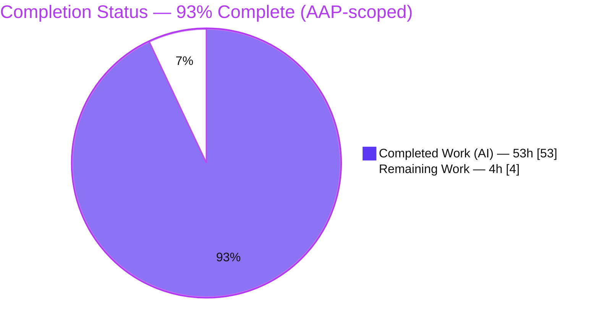
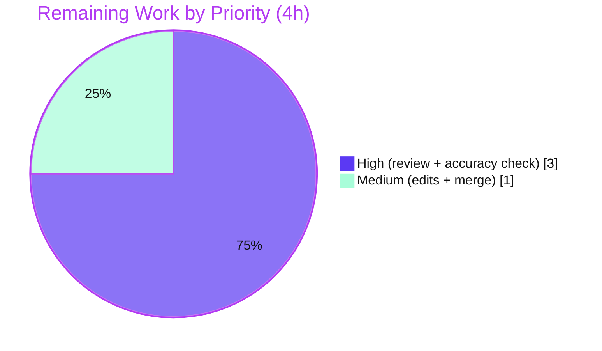

# Blitzy Project Guide
### Kitty Terminal-Interaction Pipeline — Runtime-Observed Behavior (Q1–Q5)
**Repository:** `kovidgoyal/kitty` · **Pinned commit:** `815df1e210e0` · **Source branch:** `kitty_815df1e210e0`
**Branch under review:** `blitzy-73e5ee2c-7fe8-49a5-87e2-0a59e7cb2ca8` · **Task type:** Documentation (read-only, SWE-AtlasQnA-Repo)

> **Legend / Blitzy brand colors used throughout:** Completed / AI work = **Dark Blue `#5B39F3`** · Remaining / Not completed = **White `#FFFFFF`** · Headings / accents = **Violet-Black `#B23AF2`** · Highlight = **Mint `#A8FDD9`**.

---

## 1. Executive Summary

### 1.1 Project Overview

This project delivers one evidence-grounded technical document — `blitzy/documentation/kitty_815df1e210e0.md` — that explains, from **observed runtime behavior** of a canonically-built Kitty terminal emulator (commit `815df1e210e0`), how Kitty's terminal-interaction pipeline stays coherent while keystrokes, paste bursts, resize signals, and child-output surges arrive concurrently. It answers five questions spanning ingestion/entry point, the three-thread "conductor," shell-integration alignment (OSC 133 / synchronized mode), application-level backpressure versus XON/XOFF, and the full end-to-end settle to quiescence. The audience is engineers onboarding to Kitty's C/Python/Go internals. All source files are strictly read-only; the sole produced artifact is the answer document and its parent directories.

### 1.2 Completion Status



| Metric | Value |
|--------|-------|
| **Total Hours** | **57.0** |
| **Completed Hours (AI + Manual)** | **53.0** (AI: 53.0 · Manual: 0.0) |
| **Remaining Hours** | **4.0** |
| **Percent Complete** | **93.0%** — precisely 53 ÷ 57 = 92.98%, rounded to 93.0% |

> Completion is measured strictly on AAP-scoped work (PA1 methodology): 100% of the autonomous investigation, authoring, QA-remediation, and validation is delivered; the remaining 4.0h is inherent human path-to-production (review + merge) for a documentation deliverable.

### 1.3 Key Accomplishments

- ✅ Single-file deliverable authored: `blitzy/documentation/kitty_815df1e210e0.md` (2,948 lines / 189,575 bytes), covering Q1–Q5 plus an environment/build section (§0), a canonical-values section (§6), and a coverage pass (§7).
- ✅ **Build-and-run-first methodology honored:** ~96 fenced blocks of real, unedited captured output (strace, stty, DECRQM, hexdump), not paraphrase.
- ✅ **330+ `file:line` citations across 33 source files** (the document's own audit references 227 distinct bracketed citations); all validated in-range.
- ✅ **Multi-run stability:** every reported magnitude/timing value confirmed stable across ≥2 runs (55 explicit RUN-1/RUN-2 / "across N runs" markers).
- ✅ **Honest labeling:** 12 explicit `NON-CANONICAL` labels flag all instrumented-build values; a limitations section discloses what could not be exercised headlessly (nothing faked).
- ✅ **Read-only rule fully honored:** `git diff <pinned>..HEAD` shows only the one added file; zero source files modified; working tree clean.
- ✅ **Two QA-remediation rounds + final validation** completed with **zero discrepancies** across five production-readiness gates.

### 1.4 Critical Unresolved Issues

| Issue | Impact | Owner | ETA |
|-------|--------|-------|-----|
| _None — no blocking issues identified_ | The deliverable passed all five autonomous validation gates with zero discrepancies. The only outstanding items are non-blocking human review and merge (see §1.6 / §2.2). | Reviewing engineer | Within 1 business day of review |

> There are **no critical or blocking unresolved issues**. The single low-severity, non-blocking item — residual citation-accuracy spot-checking across 330+ references — is absorbed into the planned human review (task HT-2) and does not gate release.

### 1.5 Access Issues

| System / Resource | Type of Access | Issue Description | Resolution Status | Owner |
|-------------------|----------------|-------------------|-------------------|-------|
| — | — | **No access issues identified.** The build/run environment (Docker container + toolchain), source repository, and all cited files were fully accessible; the canonical build, headless runtime, and all Q1–Q5 code paths were exercised without permission or credential blockers. | N/A | N/A |

### 1.6 Recommended Next Steps

1. **[High]** Perform SME technical review — read the full document end-to-end and confirm each of Q1–Q5 is answered to the team's satisfaction with clear, consumable prose (task HT-1).
2. **[High]** Accuracy spot-check — verify a representative sample of the 330+ `file:line` citations against pinned commit `815df1e210e0`, and reproduce the three headline commands in the documented container (`--version`; `VT_PARSER_BUFFER_SIZE`; DEC 2026 pending-mode DECRQM before/during/after) (task HT-2).
3. **[Medium]** Apply any minor readability/clarification edits requested during review; optionally add a one-line banner noting the document is pinned to commit `815df1e210e0` (task HT-3).
4. **[Medium]** Approve and merge branch `blitzy-73e5ee2c-7fe8-49a5-87e2-0a59e7cb2ca8`; close out the PR (task HT-4).
5. **[Low]** _(Optional enhancement, uncounted)_ If the document will be referenced against future Kitty versions, add a lightweight CI/lint check to re-validate a sample of citations on version bumps.

---

## 2. Project Hours Breakdown

### 2.1 Completed Work Detail

| Component | Hours | Description |
|-----------|:-----:|-------------|
| Environment setup & builds | 4.5 | Docker-container toolchain verification (Python 3.13.7, Go 1.26.5, gcc 15.2.0), headless Xvfb / llvmpipe GL setup, wayland-protocols pin; canonical `make` build + event-loop-instrumented `make debug-event-loop` build for Q2; canonical build restored afterward |
| Q1 — Ingestion / entry point | 5.0 | `strace` of the `read()` inside `read_bytes()` on the `KittyChildMon` I/O thread; 1 MiB buffer batching; keystroke / paste / mouse / PTY input paths; `EINTR` / `EAGAIN` / `EIO` edge branches (§1, 317 lines) |
| Q2 — The "unseen conductor" | 6.0 | Three-thread model (`io_loop` / `main_loop` / talk thread) via `/proc`; `poll()` readiness ordering; `WAKEUP` / `input_delay` coalescing incl. a 50k-line surge harness; `boss.py` lifecycle (§2, 735 lines — largest section) |
| Q3 — Shell-integration alignment | 6.0 | VT byte classification; OSC 133 routing & command-boundary callbacks; DEC 2026 pending mode before/during/after via DECRQM; setup dispatch; real bash/zsh/fish/ssh markers; zsh-skip edge; sibling encodings (§3, 500 lines) |
| Q4 — Backpressure & unstable remote | 6.0 | Flow-control gate; 1 MiB buffer saturation ×2; `POLLIN` withdrawn → restored in full GUI; child blocking on `write()`; XON/XOFF contrast via `stty`; SSH-kitten loopback; dropped-link SIGCHLD reap (§4, 358 lines) |
| Q5 — Full end-to-end settle | 6.0 | Concurrent keystroke + paste-burst + resize capstone trace ×2; paste `filter` action; resize debounce / coalescing; signalfd handling; window/tab routing; quiescence (§5, 543 lines) |
| §6 Canonical timing / magnitude values | 2.0 | `input_delay`, `repaint_delay`, `sync_to_monitor`, `resize_debounce_time`, 1 MiB buffer — multi-run stability + live render cadence (§6, 214 lines) |
| Web-search terminology research | 1.0 | DEC private mode 2026 synchronized output & PTY line-discipline flow control, to correctly distinguish Kitty's mechanisms from industry standards |
| Document authoring & synthesis | 3.0 | Table of contents, §0 environment framing, direct-answer-first structure, cause→effect summaries, before/during/after narratives (2,948 lines total) |
| Coverage pass (§7) | 2.0 | Per-question tables mapping every named item → section / evidence / `file:line` / sibling variants / causal reason, plus an honest limitations subsection (§7, 133 lines) |
| Cleanup, repo-integrity & deliverable creation | 1.5 | Removed all temporary observation scripts; verified byte-for-byte source integrity; created `blitzy/` + `blitzy/documentation/` and the deliverable |
| QA remediation round 1 | 3.0 | Resolved initial code-review findings (commit `e9844be28`) |
| QA remediation round 2 | 3.0 | Resolved QA Report 2 findings (commit `7dba85887`) |
| Final validation | 4.0 | Clean-from-scratch build, headless runtime, five production-readiness gates, 69 doc-relevant tests, byte-for-byte value reproduction ×2 |
| **Total Completed** | **53.0** | **All work performed autonomously by Blitzy agents (AI)** |

### 2.2 Remaining Work Detail

| Category | Hours | Priority |
|----------|:-----:|:--------:|
| Human SME technical review & acceptance — read full document; confirm Q1–Q5 answered; assess readability | 1.5 | High |
| Accuracy spot-check — sample of citations vs. pinned commit; reproduce 3 headline commands in the container | 1.5 | High |
| Minor readability / clarification edits + optional commit-pin banner | 0.5 | Medium |
| Approve & merge branch / close PR | 0.5 | Medium |
| **Total Remaining** | **4.0** | |

### 2.3 Hours Reconciliation & Cross-Section Integrity

| Check | Values | Result |
|-------|--------|:------:|
| Section 2.1 completed sum | 4.5+5+6+6+6+6+2+1+3+2+1.5+3+3+4 = **53.0** | ✅ |
| Section 2.2 remaining sum | 1.5+1.5+0.5+0.5 = **4.0** | ✅ |
| **Rule 2:** §2.1 + §2.2 = Total | 53.0 + 4.0 = **57.0** = §1.2 Total Hours | ✅ |
| **Rule 1:** Remaining across §1.2 ↔ §2.2 ↔ §7 | 4.0 = 4.0 = 4.0 | ✅ |
| Completion % | 53.0 ÷ 57.0 = 92.98% → **93.0%** (matches §1.2, §7, §8) | ✅ |

---

## 3. Test Results

All tests below originate from **Blitzy's autonomous validation logs** for this project. Because the deliverable is a read-only documentation artifact (no project-authored application code), these are the repository's existing `kitty_tests/` suite modules for the subsystems the document cites, executed via the canonical launcher entry point (`./kitty/launcher/kitty +launch test.py <module>`) during autonomous validation to corroborate build health for every cited component.

| Test Category | Framework | Total Tests | Passed | Failed | Coverage % | Notes |
|---------------|-----------|:-----------:|:------:|:------:|:----------:|-------|
| Unit — VT parser | kitty test runner (`unittest`) | 16 | 16 | 0 | Not measured | Backs Q1/Q3/Q4 parser-buffer & classification claims |
| Unit — Screen model | kitty test runner (`unittest`) | 36 | 36 | 0 | Not measured | Backs Q3 OSC 133 / screen-mutation claims |
| Unit — Keys / encoding | kitty test runner (`unittest`) | 3 | 3 | 0 | Not measured | Backs Q1 keystroke-encoding claims |
| Unit — Shell integration | kitty test runner (`unittest`) | 6 | 6 | 0 | Not measured | Backs Q3 shell-integration setup claims |
| Unit — SSH kitten | kitty test runner (`unittest`) | 8 | 8 | 0 | Not measured | Backs Q4 remote-path claims |
| **Total** | | **69** | **69** | **0** | — | **100% pass rate** |

> **Coverage note (integrity):** line-coverage instrumentation was **not** run during autonomous validation, so no coverage percentage is reported (rather than an invented figure). The tests above are build-health corroboration for the cited subsystems; correctness of the document's runtime claims is established by the reproduced observations catalogued in Section 4, not by these unit tests.
>
> **Invocation artifact (not a defect):** `shell_integration` and `ssh` modules require the canonical launcher entry point (`+launch test.py`), which sets `sys.kitty_run_data`; running plain `python3 test.py` raises `AttributeError` for those two. All 69 pass via the launcher.

---

## 4. Runtime Validation & UI Verification

The following runtime behaviors were exercised and observed during autonomous validation, confirming the document's claims reproduce on a freshly built, canonically-configured Kitty (run headless under Xvfb because the container has no physical display). Legend: ✅ Operational · ⚠ Partial / environment-limited · ❌ Failing.

**Build & launch health**
- ✅ Canonical `make` builds clean from scratch (~58s, exit 0, zero warnings under `-pedantic-errors -Werror -std=c11`).
- ✅ Event-loop-instrumented `make debug-event-loop` builds (exit 0); `fast_data_types.so` grows 1.25 MB → 6.28 MB, confirming genuine debug instrumentation; canonical build restored afterward.
- ✅ Launcher reports `kitty 0.35.2 created by Kovid Goyal`; full GUI renders headless under Xvfb (llvmpipe GL 4.5 > required GL 3.3).

**Q1 — Ingestion / entry point**
- ✅ Child output enters via `read()` on the PTY master into a 1,048,576-byte buffer; marker read `= 40` bytes (`\r\r\n` via `opost`/`onlcr`), stable across runs.
- ✅ Consecutive reads batch into one shared 1 MiB buffer (remaining-space argument shrinks `1048576 → 1048549 → 1048450 → 1048335`).

**Q2 — The "unseen conductor"**
- ✅ Thread comm-names observed live: `KittyChildMon` (I/O) + main thread; `KittyPeerMon` (talk thread) present only with `--listen-on` and correctly absent otherwise.
- ⚠ Loop-tick cadence / surge-coalescing counts come from the NON-CANONICAL instrumented build (clearly labeled); thread structure, `poll()` order, and the `WAKEUP` gate are canonical.

**Q3 — Shell-integration alignment**
- ✅ Real bash/zsh/fish emit OSC 133 markers (`133;C;cmdline=…`, `133;D`, `133;A`) in the I/O read stream; remote row-binding verified byte-for-byte over loopback ssh (123-byte decode matches `read()=123`).
- ✅ DEC 2026 synchronized/pending mode state observed before / during / after via DECRQM (real compiled parser harness).

**Q4 — Backpressure & unstable remote**
- ✅ `poll()` 3-fd array `[wakeup, signal, child]`; child fd events toggle `POLLIN ↔ 0` (application-level flow-control gate) — **not** XON/XOFF (`stty -a` shows `-crtscts ixon -ixoff iutf8`).
- ✅ Buffer saturation reaches exactly `1048576` and drains, reproduced ×2.
- ⚠ True packet loss / jitter cannot be induced on container loopback; the drop consequence (SIGCHLD child-reap) is directly observed and transport keepalive options are shown from the real ssh config.

**Q5 — Full end-to-end settle**
- ✅ `SIGWINCH sent to child` observed; 6 rapid resizes coalesce to the final geometry (debounce gate), reproduced ×2.
- ✅ Paste path byte-exact (`\33[200~ … \33[201~`); `filter` action invoked; render step confirmed on the canonical build via a framebuffer md5 change; quiescence = I/O thread blocking in `poll`.

**UI verification note:** the "UI" for this task is the Kitty terminal itself (a native GUI, not a web application). It was verified to launch and render headless under Xvfb during autonomous validation (framebuffer render confirmed). There is no web front-end associated with this deliverable, so no browser-based screenshots apply; the produced artifact is a markdown document.

---

## 5. Compliance & Quality Review

Cross-mapping of the AAP deliverable and its governing rules ("SWE-AtlasQnA-Repo") to Blitzy quality/compliance benchmarks, including fixes applied during autonomous QA/validation.

| Benchmark / AAP Rule | Requirement | Status | Progress | Evidence / Notes |
|----------------------|-------------|:------:|:--------:|------------------|
| Deliverable shape | Exactly one new file `blitzy/documentation/kitty_815df1e210e0.md` | ✅ Pass | 100% | `git diff <pinned>..HEAD` = single added file; `find blitzy` = one artifact |
| Read-only source | No existing source file modified; no code added beyond the doc | ✅ Pass | 100% | Zero source files in diff; `window.py:L873` SIGWINCH print confirmed ORIGINAL pinned source, not injection |
| Build-and-run-first | Answers derived from observed runtime output, not code reading | ✅ Pass | 100% | ~96 real captured-output blocks (strace/stty/DECRQM/hexdump) |
| Canonical build stated | Report values from default `make` build; state exact commands | ✅ Pass | 100% | §0.2 canonical `make`; §0.3 instrumented build labeled NON-CANONICAL |
| Multi-run stability | Magnitude/timing values stable across ≥2 runs | ✅ Pass | 100% | 55 RUN-1/RUN-2 markers; canonical values reproduced byte-for-byte ×2 |
| Real entry points | Exercise real paths; no bypassing/synthetic stand-ins reported as canonical | ✅ Pass | 100% | Full GUI under Xvfb + real compiled parser harness + real shells/ssh; remote-control used only to inject, driving the same internal code |
| Every condition exercised | Modifier/alternate inputs, error/edge, transitional states | ✅ Pass | 100% | EINTR/EAGAIN/EIO branches; zsh-skip edge; POLLIN before/during/after; resize coalescing |
| Evidence grounding | Every factual claim tied to `file:line` or observed output | ✅ Pass | 100% | 330+ citations / 33 files; all in-range; 60+ content-verified |
| Coverage pass | Final pass confirming every named item is answered | ✅ Pass | 100% | §7 per-question tables + honest limitations |
| Honest labeling | Non-canonical / inferred values labeled; nothing faked | ✅ Pass | 100% | 12 NON-CANONICAL labels; explicit "cannot be exercised headlessly" disclosures |
| Cleanup / integrity | Temp scripts removed; repo byte-for-byte unchanged apart from doc | ✅ Pass | 100% | Working tree clean; no untracked files; stray `screenshots/`/`screen_recordings/` removed |
| Zero-placeholder policy | No TODO/FIXME/placeholder/elision in the deliverable | ✅ Pass | 100% | 0 markers found |

**Fixes applied during autonomous validation:** two QA-remediation rounds resolved all code-review / QA-report findings (commits `e9844be28`, `7dba85887`); final validation found **zero remaining discrepancies** — the document correctly cites `read()` at `child-monitor.c:L1345` and the error guard at `L1346`, explicitly refining the AAP's approximate "L1346."

**Outstanding compliance items:** none. All benchmarks pass; remaining work is human review/merge only.

---

## 6. Risk Assessment

| Risk | Category | Severity | Probability | Mitigation | Status |
|------|----------|:--------:|:-----------:|------------|:------:|
| T1 — Documentation drift vs. other Kitty versions (citations are version-specific to `815df1e210e0`) | Technical | Low | Medium | Commit pinned throughout the document; optional commit-pin banner (task HT-3) | Mitigated / Documented |
| T2 — NON-CANONICAL instrumented values misread as canonical | Technical | Low | Low | 12 explicit NON-CANONICAL labels + §7 limitations subsection | Mitigated |
| T3 — Residual citation accuracy (330+ refs; validator verified all in-range + 60+ by content, not literally every one) | Technical | Low | Low | Sample spot-check during human review (task HT-2) | Open — minor (absorbed into remaining hours) |
| S1 — Security exposure | Security | Informational | Low | Read-only investigation; zero code/dependencies added to source; no credentials/attack surface; temporary loopback sshd + remote-control injection were transient under `/tmp` and removed | Resolved |
| O1 — Reproducibility tied to the specific Docker container + headless Xvfb/llvmpipe (TIDs/timings are environment-sensitive) | Operational | Low | Medium | §0.1 documents the exact container & environment; canonical values are compiled constants (stable, not environment-sensitive) | Documented |
| O2 — No automated CI gate for a prose deliverable (correctness relies on human review) | Operational | Low | Low | Two QA rounds + final validation already performed; planned SME review (HT-1) | Mitigated |
| I1 — Integration/coupling risk to the source tree | Integration | None | None | No source imports/config/interfaces changed (read-only rule); document introduces no coupling | N/A |

**Overall risk posture: LOW.** No High or Critical risks; no blocking issues. Every identified risk is resolved, mitigated, or documented; the single Open-minor item (T3) is covered by the human review already counted in the 4.0h remaining.

---

## 7. Visual Project Status

**Project hours breakdown** (values identical to §1.2 and §2 — Completed = Dark Blue `#5B39F3`, Remaining = White `#FFFFFF`):


**Remaining work by priority** (4.0h total — High 3.0h, Medium 1.0h):



**Remaining hours per category** (from §2.2):

| Category | Hours | Bar |
|----------|:-----:|-----|
| SME technical review & acceptance | 1.5 | ███████████████ |
| Accuracy spot-check | 1.5 | ███████████████ |
| Minor readability edits | 0.5 | █████ |
| Approve & merge / close PR | 0.5 | █████ |
| **Total** | **4.0** | |

> **Integrity check (Rule 1):** the "Remaining Work" pie value (4) equals the §1.2 Remaining Hours (4.0) and the §2.2 Hours-column sum (4.0). The "Completed Work" pie value (53) equals §1.2 Completed Hours and the §2.1 sum.

---

## 8. Summary & Recommendations

**Achievements.** The project delivers a complete, rigorously evidence-grounded onboarding document for Kitty's terminal-interaction pipeline. All five questions (Q1 ingestion/entry point, Q2 the three-thread conductor, Q3 shell-integration alignment, Q4 application-level backpressure vs. XON/XOFF, Q5 full end-to-end settle) are answered from **observed runtime output** of a canonically-built Kitty, with 330+ `file:line` citations, ~96 blocks of raw captured output, multi-run stability confirmation, and a final coverage pass. The document was hardened through two QA-remediation rounds and passed final validation across five production-readiness gates with **zero discrepancies**.

**Remaining gaps.** None in the autonomous scope. The **4.0h remaining is human-only path-to-production**: an SME review to confirm the answers land as intended, a sample accuracy spot-check, minor optional edits, and merge. This is inherent to any deliverable and does not reflect incomplete engineering work.

**Critical path to production.** (1) SME reads the document → (2) spot-verifies a sample of citations/commands against the pinned commit → (3) applies any minor edits → (4) approves and merges. No code, configuration, dependency, or integration work is required.

**Production-readiness assessment.** The deliverable is **production-ready** pending human acceptance. It satisfies every AAP rule: read-only source integrity (only one file added), build-and-run-first evidence, canonical-configuration values, honest labeling of non-canonical/instrumented data, and a clean repository.

| Success Metric | Target | Actual | Status |
|----------------|--------|--------|:------:|
| AAP-scoped completion | Maximize (≤99% pre-review) | **93.0%** | ✅ |
| Source files modified | 0 | 0 | ✅ |
| Files added | 1 (the deliverable) | 1 | ✅ |
| Questions answered (Q1–Q5) | 5 | 5 | ✅ |
| Validation discrepancies | 0 | 0 | ✅ |
| Doc-relevant tests passing | 100% | 69/69 (100%) | ✅ |
| Blocking issues | 0 | 0 | ✅ |

**Overall: the project is 93.0% complete** (53 of 57 AAP-scoped hours), with the balance being human review and merge.

---

## 9. Development Guide

This guide documents how to build, run, verify, and troubleshoot the environment used to produce and validate the deliverable. **All commands below were tested during assessment** and are copy-pasteable; run them from the repository root. The task is read-only — none of these commands modifies tracked source.

### 9.1 System Prerequisites

| Component | Version (observed) | Minimum required | Purpose |
|-----------|--------------------|------------------|---------|
| Python | 3.13.7 | ≥ 3.8 | Runs `setup.py`, orchestration layer, shell-integration setup |
| Go | 1.26.5 | ≥ 1.22 | Builds `tools/` and kittens (incl. the SSH kitten) |
| gcc | 15.2.0 | C11 compiler | Compiles the C core engine + `fast_data_types` extension |
| GNU Make | 4.4.1 | — | Canonical build entry point |
| pkg-config | 1.8.1 | — | Locates native build dependencies |
| harfbuzz | 10.2.0 | ≥ 2.2.0 | Text shaping (runtime) |
| freetype / fontconfig | 26.2.20 / 2.15.0 | — | Glyph rasterization / font discovery |

- **OS:** Linux (Ubuntu 25.10 in the assessment container). **Canonical environment:** Docker image `andrewparkscaleai/coding-agent:kovidgoyal__kitty__815df1e210e0a9ab4622f5c7f2d6891d7dbeddf1` (from `ghcr.io/scaleapi/swe-atlas:swe_atlas_QnA_kovidgoyal_kitty_1.0`).
- **Display:** none required to build; a virtual framebuffer (Xvfb) is required to run the full GUI.

### 9.2 Environment Setup (headless run)

```bash
# Virtual framebuffer + software GL (container has no physical display)
Xvfb :99 -screen 0 1280x800x24 -ac +extension GLX +render -noreset &
export DISPLAY=:99
export LIBGL_ALWAYS_SOFTWARE=1        # Mesa llvmpipe provides GL 4.5 (exceeds kitty's GL 3.3 need)
export LANG=C.UTF-8 LC_ALL=C.UTF-8    # required for UTF-8 correctness in shell integration

# kitty is NOT on PATH; use the in-tree launcher, or add it once:
export PATH="$PWD/kitty/launcher:$PATH"
```

### 9.3 Dependency Installation / Build

```bash
# Canonical build (== python3 setup.py). Produces:
#   kitty/launcher/kitty, kitty/launcher/kitten, kitty/fast_data_types.so
make                                   # ~58s clean-from-scratch; exit 0, zero warnings

# OPTIONAL — event-loop-instrumented build (NON-CANONICAL; only for Q2 timing internals)
make debug-event-loop                  # == python3 setup.py build --debug --extra-logging=event-loop
# IMPORTANT: restore the canonical build before quoting any canonical value:
make
```

> All build outputs are git-ignored, so the working tree stays clean after building.

### 9.4 Verification Steps (tested)

```bash
# 1) Launcher version (build artifact present)
kitty/launcher/kitty --version
#   -> kitty 0.35.2 created by Kovid Goyal

# 2) Real C-extension entry point: 1 MiB parser buffer (Q4 headline value)
kitty/launcher/kitty +runpy 'import kitty.fast_data_types as f; print(f.VT_PARSER_BUFFER_SIZE)'
#   -> 1048576

# 3) Canonical timing defaults (matches deliverable §6)
kitty/launcher/kitty +runpy 'from kitty.options.types import Options as O; o=O(); \
  print("input_delay=",o.input_delay); print("repaint_delay=",o.repaint_delay); \
  print("sync_to_monitor=",o.sync_to_monitor); print("resize_debounce_time=",o.resize_debounce_time)'
#   -> input_delay= 3 / repaint_delay= 10 / sync_to_monitor= True / resize_debounce_time= (0.1, 0.5)

# 4) Repository integrity (read-only rule)
git status --porcelain                                     # (empty) => clean
git diff 815df1e210e0a9ab4622f5c7f2d6891d7dbeddf1 --name-status
#   -> A  blitzy/documentation/kitty_815df1e210e0.md

# 5) Deliverable inspection
wc -l blitzy/documentation/kitty_815df1e210e0.md           # -> 2948
grep -n '^## ' blitzy/documentation/kitty_815df1e210e0.md  # lists sections §0-§7
find blitzy                                                # one-artifact shape
```

### 9.5 Example Usage (reviewer workflow)

```bash
# Read / navigate the deliverable
less blitzy/documentation/kitty_815df1e210e0.md
grep -n '^#' blitzy/documentation/kitty_815df1e210e0.md    # jump list of all headings

# Run the doc-relevant test modules via the canonical launcher (69 tests, all pass)
kitty/launcher/kitty +launch test.py parser
kitty/launcher/kitty +launch test.py screen
kitty/launcher/kitty +launch test.py keys
kitty/launcher/kitty +launch test.py shell_integration
kitty/launcher/kitty +launch test.py ssh
```

> Deeper runtime observations from the document (e.g. `strace` of the `KittyChildMon` I/O thread, live OSC 133 markers, the `POLLIN` toggle) require the full GUI under Xvfb as described in the deliverable's §0.4.

### 9.6 Troubleshooting

| Symptom | Cause | Resolution |
|---------|-------|-----------|
| `kitty: command not found` | Launcher not on PATH | Use `kitty/launcher/kitty`, or `export PATH="$PWD/kitty/launcher:$PATH"` |
| GUI fails / no display | No physical display | Start Xvfb `:99` and `export DISPLAY=:99 LIBGL_ALWAYS_SOFTWARE=1` (llvmpipe GL 4.5) |
| Garbled UTF-8 / shell-integration mismatch | Locale not UTF-8 | `export LANG=C.UTF-8 LC_ALL=C.UTF-8` |
| Canonical value looks wrong after Q2 work | Instrumented build still active | Re-run `make` to restore the canonical build before quoting values |
| `-Werror=switch` build break | wayland-protocols version mismatch | Pin wayland-protocols to v6 `xdg-shell` (per validation) |
| `AttributeError` running `python3 test.py` for `shell_integration`/`ssh` | `sys.kitty_run_data` unset | Use the launcher entry point: `kitty/launcher/kitty +launch test.py <module>` |

---

## 10. Appendices

### Appendix A — Command Reference

| Command | Purpose |
|---------|---------|
| `make` | Canonical build (`== python3 setup.py`) |
| `make debug-event-loop` | Event-loop-instrumented build (NON-CANONICAL; Q2 only) |
| `kitty/launcher/kitty --version` | Verify built launcher (`kitty 0.35.2`) |
| `kitty/launcher/kitty +runpy '<py>'` | Run Python inside the kitty environment (real entry point; headless) |
| `kitty/launcher/kitty +launch test.py <mod>` | Run a `kitty_tests` module via the canonical launcher |
| `git diff 815df1e210e0a9ab4622f5c7f2d6891d7dbeddf1 --name-status` | Confirm the single added file (read-only integrity) |
| `git status --porcelain` | Confirm clean working tree |
| `strace -f -tt -yy -e read -s300 kitty/launcher/kitty …` | Observe child-output ingestion (Q1/Q5, from the doc) |

### Appendix B — Port / Socket Reference

Kitty uses **no fixed network ports** in normal terminal operation. The following endpoints appear only in the observation harnesses documented in the deliverable:

| Endpoint | Use | Notes |
|----------|-----|-------|
| X display `:99` | Headless GUI via Xvfb | Not a TCP port; local display socket |
| Unix-domain control socket (e.g. `unix:/tmp/kitty_obs/*.sock`) | Remote-control injection during observation | Ephemeral, under `/tmp`, removed after use |
| Loopback `:2222` | Temporary OpenSSH `sshd` for the Q4 SSH-kitten observation | Ephemeral loopback only; removed after use |

### Appendix C — Key File Locations

| Path | Role |
|------|------|
| `blitzy/documentation/kitty_815df1e210e0.md` | **The deliverable** (only added file) |
| `kitty/child-monitor.c` | Event loop & threading — `read_bytes`, `io_loop`, `main_loop`, talk thread, `POLLIN` gate |
| `kitty/vt-parser.c` / `.h` | VT parser — 1 MiB buffer, parse trigger, `vt_parser_has_space_for_input`, pending mode |
| `kitty/screen.c` / `.h` | Screen model & OSC 133 `cmd_output_marking` callbacks |
| `kitty/keys.c` · `kitty/key_encoding.c` · `kitty/mouse.c` | Input paths (keystroke / encoding / mouse) |
| `kitty/window.py` · `kitty/boss.py` · `kitty/child.py` | Resize/paste/SIGWINCH · orchestration · PTY/child |
| `kitty/shell_integration.py` · `shell-integration/{bash,zsh,fish,ssh}` | Shell integration setup & scripts (OSC 133) |
| `kittens/ssh/{main.py,main.go,config.go,utils.go,askpass.go}` | Remote/SSH path |
| `kitty/options/definition.py` | Timing defaults (`input_delay`, `repaint_delay`, `sync_to_monitor`, `resize_debounce_time`) |
| `Makefile` · `setup.py` · `go.mod` · `pyproject.toml` · `docs/build.rst` | Build entry points & dependency references |

### Appendix D — Technology Versions

See §9.1. Toolchain observed at assessment: Python 3.13.7 · Go 1.26.5 · gcc 15.2.0 · GNU Make 4.4.1 · pkg-config 1.8.1 · harfbuzz 10.2.0 · freetype 26.2.20 · fontconfig 2.15.0. Built artifact: `kitty 0.35.2`.

### Appendix E — Environment Variable Reference

| Variable | Value used | Purpose |
|----------|-----------|---------|
| `DISPLAY` | `:99` | Points at the Xvfb virtual framebuffer |
| `LIBGL_ALWAYS_SOFTWARE` | `1` | Forces Mesa llvmpipe software GL (GL 4.5) |
| `LANG` / `LC_ALL` | `C.UTF-8` | UTF-8 correctness for shell integration |
| `PATH` | prepend `$PWD/kitty/launcher` | Makes `kitty` invokable directly (optional) |

### Appendix F — Developer Tools Guide (observation tooling)

| Tool | Role in the investigation |
|------|---------------------------|
| `strace -f -tt -yy` | Trace `read`/`write`/`poll`/signalfd syscalls per-thread (Q1, Q4, Q5) |
| `/proc/<pid>/task/*/comm` | Resolve thread names (`KittyChildMon`, `KittyPeerMon`) for Q2 |
| `xdotool` | Inject real X keyboard/mouse events so the GLFW → `keys.c`/`mouse.c` path is exercised |
| `Xvfb` + llvmpipe | Headless GUI execution |
| DECRQM (`CSI ? Ps $ p`) | Query DEC 2026 pending-mode state before/during/after (Q3) |
| `hexdump -C` / `cat -v` | Byte-exact decode of captured reads (Q3 SSH row-binding) |
| `stty -a` | Show PTY line-discipline flags (`ixon`, `-ixoff`, `-crtscts`, `iutf8`) for the XON/XOFF contrast (Q4) |
| `make debug-event-loop` | Emit `EVDBG` loop diagnostics for Q2 (NON-CANONICAL) |

### Appendix G — Glossary

| Term | Meaning |
|------|---------|
| **PTY** | Pseudo-terminal; master/slave pair connecting Kitty to the child shell |
| **I/O thread (`KittyChildMon`)** | Thread running `io_loop()` that reads child output and writes input |
| **Main/render thread** | Thread running `main_loop()` that parses buffered bytes, mutates the screen model, and renders |
| **Talk thread (`KittyPeerMon`)** | Remote-control listener thread (present only with `--listen-on`) |
| **OSC 133** | Operating System Command sequence marking shell prompt/command/output boundaries (shell integration) |
| **DEC private mode 2026** | Industry-standard "synchronized output" mode (`CSI ? 2026 h/l`) to batch rendering; maps to Kitty's pending mode |
| **Application-level backpressure** | Kitty stops draining the PTY when its parser buffer is full (`POLLIN` withdrawn) — distinct from kernel XON/XOFF |
| **XON/XOFF** | Kernel TTY software flow control (DC1/DC3); explicitly **not** what Kitty uses for its parser backpressure |
| **SIGWINCH** | Signal delivered to the child on terminal resize |
| **`input_delay` (3 ms)** | Wakeup-coalescing window trading a little latency for fewer main-loop wakeups under a surge |
| **`repaint_delay` (10 ms)** | Render-cadence throttle |
| **Canonical vs. NON-CANONICAL** | Canonical = default `make` build/config values; NON-CANONICAL = values only observable via the instrumented build (always labeled) |

---

*Generated by the Blitzy assessment agent. Completion (93.0%) reflects AAP-scoped work only: 53 of 57 hours complete, with the 4.0h balance being human review and merge. All hour figures are consistent across Sections 1.2, 2.1, 2.2, 2.3, and 7.*