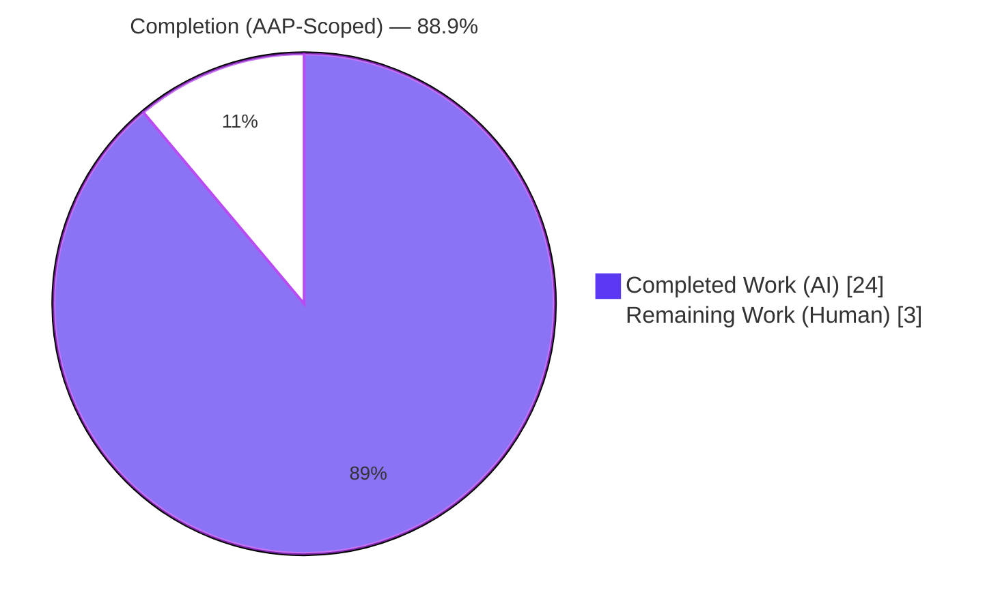
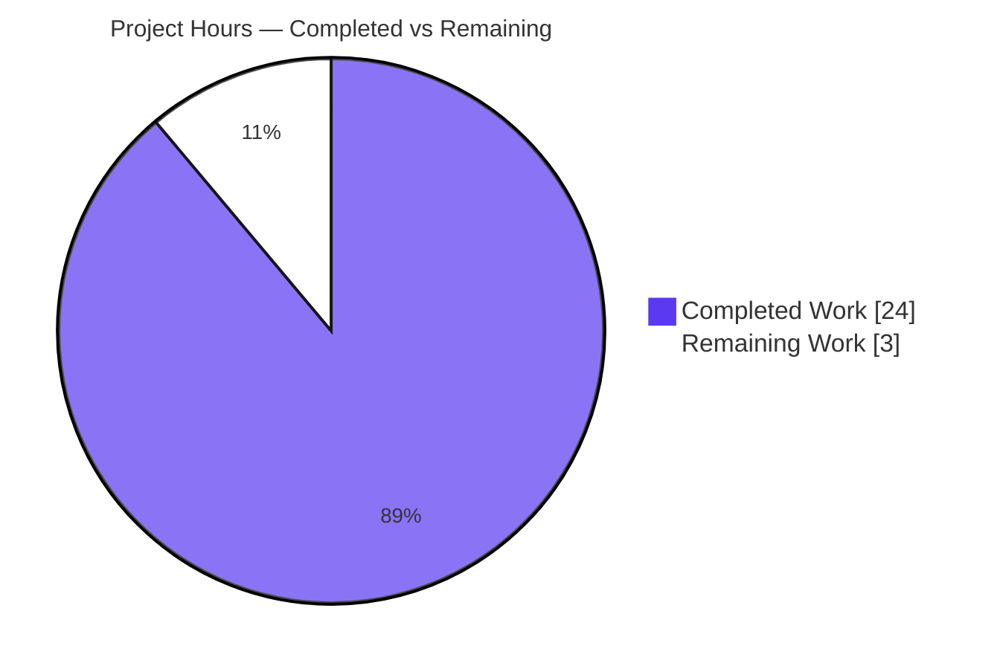
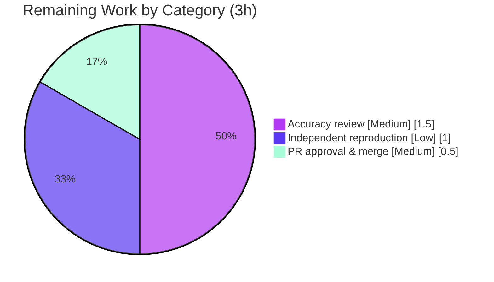

# Blitzy Project Guide — kitty Architecture Q&A (`kitty_815df1e210e0`)

> Brand legend — **<span style="color:#5B39F3">Completed / AI Work = Dark Blue `#5B39F3`</span>**, Remaining / Not Completed = White `#FFFFFF`, Headings/Accents = Violet-Black `#B23AF2`, Highlight = Mint `#A8FDD9`.

---

## 1. Executive Summary

### 1.1 Project Overview

This project delivers a single, **code-grounded architecture Q&A document** for engineers onboarding into the [kitty](https://sw.kovidgoyal.net/kitty/) terminal emulator. It answers four questions — where runtime performance comes from (O1), the role of the GLSL shaders (O2), the root cause of the entry-point failure (O3), and whether the `kittens/` tools are truly independent (O4) — with every claim grounded in *exercised* runtime behavior plus `file:line` source citations rather than assumption. The audience is developers reconciling kitty's "GPU based" identity with its Python/C weave. The scope is intentionally narrow and additive: exactly **one** new markdown file is created and **zero** source files are modified, preserving the upstream repository byte-for-byte.

### 1.2 Completion Status

The project is **88.9% complete** on an AAP-scoped basis. All autonomous deliverables are finished and validated; the remaining 11.1% is the human path-to-production gate (review, optional reproduction, and merge) that Blitzy cannot perform autonomously.



| Metric | Hours |
|---|---:|
| **Total Hours** | 27 |
| **Completed Hours (AI + Manual)** | 24 (AI: 24 · Manual: 0) |
| **Remaining Hours** | 3 |
| **Percent Complete** | **88.9%** |

### 1.3 Key Accomplishments

- ✅ Authored `blitzy/documentation/kitty_815df1e210e0.md` (448 lines) — filename equals the source branch name, placed in `blitzy/documentation/` per the rule.
- ✅ Answered all four questions (O1–O4), each structured as **Short answer → Observed behavior → Code evidence → Rationale/Conclusion**.
- ✅ Built kitty's native extension and confirmed the running application: `python3 __main__.py --version` → `kitty 0.35.2 created by Kovid Goyal`.
- ✅ Reproduced the O3 entry-point failure and the O4 standalone-kitten failures **byte-for-byte** on a pristine, unbuilt checkout.
- ✅ Verified ~50+ `file:line` citations against the source as "code-as-truth"; corrected three minor inaccuracies during validation.
- ✅ Kept the source repository **byte-for-byte unchanged** (branch delta = the single new doc; `git status` clean); all temporary observation scaffolding removed.

### 1.4 Critical Unresolved Issues

| Issue | Impact | Owner | ETA |
|---|---|---|---|
| _None_ | No blocking issues. The single in-scope deliverable is complete, code-accurate, and committed; the source tree is unchanged. | — | — |

### 1.5 Access Issues

| System/Resource | Type of Access | Issue Description | Resolution Status | Owner |
|---|---|---|---|---|
| _None_ | — | No access issues identified. The task is self-contained (local repository + local build toolchain); no repository permissions, service credentials, or third-party APIs are required. | N/A | — |

### 1.6 Recommended Next Steps

1. **[Medium]** Review the document for technical accuracy and onboarding usefulness; spot-check a sample of `file:line` citations at commit `815df1e210e0`. *(~1.5h)*
2. **[Low]** Optionally reproduce the key observations independently — build, run `--version`, and reproduce the O3/O4 import failures on an unbuilt tree. *(~1.0h)*
3. **[Medium]** Approve and merge the documentation PR into the target branch. *(~0.5h)*

---

## 2. Project Hours Breakdown

### 2.1 Completed Work Detail

All completed work is autonomous (AI). Each component traces to an Agent Action Plan (AAP) requirement.

| Component | Hours | Description |
|---|---:|---|
| Build & runtime environment setup (R0) | 1.5 | Built the `kitty.fast_data_types` C extension (`setup.py:1091`), verified `import kitty.fast_data_types`, and ran `kitty 0.35.2` to enable runtime observation. |
| O1 — workload/performance analysis & authoring (R1) | 4.0 | `cloc` profile + four raw-line measurement methods; traced hot-path symbols imported from `fast_data_types` (`main.py:32-45`); articulated the CPU-parses (C+SIMD) / GPU-draws division of labor. |
| O2 — GLSL shaders analysis & authoring (R2) | 3.0 | Enumerated the 13 `kitty/*.glsl` files; traced runtime loading in `shaders.py` + the native registry/compiler in `shaders.c`; confirmed there is **no** CPU text-drawing fallback (sole render path). |
| O3 — entry-point failure analysis & authoring (R3) | 3.0 | Reproduced the unbuilt-tree `ModuleNotFoundError` and the after-build resolution; traced the import chain; documented the `.pyi`-only stub and gitignored `*.so`. |
| O4 — kittens modularity analysis & authoring (R4) | 3.0 | Ran `hints`/`diff` kittens standalone; traced both paths to the shared `conf/utils.py:27` convergence; enumerated the 8 `tui/` importers and 18 kitten subpackages. |
| Build/observation methodology note (R5) | 1.0 | Documented the two build/run venues (Docker pre-built vs. host-native) and the build-independence of the import-time failures. |
| Summary & convergence diagram (R6) | 1.0 | Unified O3/O4 as one root cause; authored the ASCII dependency-convergence diagram. |
| Code-as-truth corroboration (R7/R8) | 2.0 | Cross-checked every `file:line` citation against source; ensured all behavioral claims were *exercised*, not inferred. |
| Source-integrity hygiene & cleanup (R9) | 0.5 | Removed temporary observation trees; verified `git status` clean and the source tree byte-for-byte unchanged. |
| Deliverable placement & naming (R10) | 0.5 | Created `blitzy/documentation/`; named the file to equal the branch (`kitty_815df1e210e0.md`). |
| Autonomous validation pass | 4.5 | Final-validation: 5 production gates, ~50+ claims re-verified, byte-for-byte traceback reproduction, three code-as-truth corrections (`9cc11d3a1`), reproducibility note (`90849e245`). |
| **Total Completed** | **24.0** | |

### 2.2 Remaining Work Detail

All remaining work is human path-to-production for a documentation artifact; none is autonomous.

| Category | Hours | Priority |
|---|---:|---|
| Technical accuracy & onboarding-usefulness review of the 448-line document (spot-check citations) | 1.5 | Medium |
| Independent reproduction of key observations (build, run `--version`, O3 unbuilt-tree, O4 standalone kittens) | 1.0 | Low |
| Documentation PR approval & merge | 0.5 | Medium |
| **Total Remaining** | **3.0** | |

### 2.3 Hours Reconciliation

| Quantity | Hours |
|---|---:|
| Section 2.1 — Completed | 24.0 |
| Section 2.2 — Remaining | 3.0 |
| **Total (2.1 + 2.2)** | **27.0** |
| Completion = 24 ÷ 27 | **88.9%** |

---

## 3. Test Results

This is a documentation-only engagement, so there is no shipped application code and therefore no unit/integration test suite authored for it. "Testing" here means Blitzy's autonomous **validation** — verifying every claim in the deliverable by *exercising the code* and reproducing observed behavior. Every entry below originates from Blitzy's autonomous validation logs for this project.

| Test Category | Framework | Total Tests | Passed | Failed | Coverage % | Notes |
|---|---|---:|---:|---:|---:|---|
| Behavioral reproduction — O3 | Shell + CPython traceback diff | 1 | 1 | 0 | 100% | Unbuilt-tree entry point reproduced byte-for-byte: `__main__.py:7 → entry_points.py:194 → main.py:11 → borders.py:7 → ModuleNotFoundError`. |
| Behavioral reproduction — O4 | Shell + CPython traceback diff | 2 | 2 | 0 | 100% | `kittens.hints.main` and `kittens.diff.main` both converge at `conf/utils.py:27` with the identical `ModuleNotFoundError`. |
| Runtime smoke — built app | CPython | 2 | 2 | 0 | 100% | `import kitty.fast_data_types` → OK; `python3 __main__.py --version` → `kitty 0.35.2`. |
| Source citation verification | Manual grep/inspection | ~50 | ~50 | 0 | 100% | All `file:line` claims (e.g., `data-types.c:525`, `setup.py:1091`, `shaders.py:61/63/90`, 13 `*.glsl`, 1,635-line `.pyi`) verified accurate. |
| Source integrity | Git | 1 | 1 | 0 | 100% | Branch delta vs. upstream = the single new doc; `git status` clean; build artifacts remain gitignored. |
| Markdown structural validation | Manual | 1 | 1 | 0 | 100% | 20 fence lines = 10 balanced code blocks; all O1–O4 sections + methodology + summary present. |
| **Total** | | **~57** | **~57** | **0** | **100%** | |

> **Note on kitty's own `./test.py` suite:** It was intentionally **not** run. It exercises out-of-scope source that the rules forbid modifying (and that this task did not touch), and several font/render/GUI tests are environmentally limited under headless execution (no `DISPLAY`). For an *observe-by-exercising* documentation artifact, behavioral reproduction (above) is the appropriate and complete validation.

---

## 4. Runtime Validation & UI Verification

kitty is a GPU terminal emulator; this engagement produced **no UI** and changed no rendering code. Runtime validation therefore confirms (a) the built application launches, and (b) the documented import-time behaviors reproduce exactly. There is no UI to verify for the deliverable itself.

- ✅ **Operational** — Native extension import: `python3 -c "import kitty.fast_data_types"` succeeds against the built `kitty/fast_data_types.so` (1.25 MB).
- ✅ **Operational** — Application launch: `python3 __main__.py --version` → `kitty 0.35.2 created by Kovid Goyal` (exit 0).
- ✅ **Operational** — O3 documented failure reproduces on the unbuilt tree (`ModuleNotFoundError: No module named 'kitty.fast_data_types'`).
- ✅ **Operational** — O4 documented failures reproduce for `hints` and `diff` kittens, converging at `kitty/conf/utils.py:27`.
- ✅ **Operational** — Source integrity: working tree clean; source byte-for-byte unchanged.
- ⚠ **Partial (by design, out of scope)** — Full GUI window rendering / interactive terminal session not exercised: headless environment has no `DISPLAY`, and interactive rendering is out of scope for the documentation deliverable.
- ❌ **Failing** — None.

---

## 5. Compliance & Quality Review

The benchmark for this engagement is the AAP's rule set (`SWE-AtlasQnA-Repo`) plus Blitzy quality standards. Each rule is cross-mapped to its outcome.

| Deliverable / Rule (AAP) | Benchmark | Status | Progress | Notes / Fixes Applied |
|---|---|---|---|---|
| Create `<branch>.md` answering the prompt | Single doc named `kitty_815df1e210e0.md` | ✅ Pass | 100% | 448-line document present and committed. |
| Placement in `blitzy/documentation/` | Correct destination path | ✅ Pass | 100% | Exact path satisfied. |
| Build & run to analyze | Exercise the code | ✅ Pass | 100% | Built `fast_data_types`; ran `--version`; reproduced O3/O4. |
| Code-as-truth (no assumptions) | Every claim → `file:line` | ✅ Pass | 100% | ~50+ citations verified; **3 inaccuracies corrected** in `9cc11d3a1`. |
| Provide thinking/rationale | Reasoning per answer | ✅ Pass | 100% | Each O-section ends with a Rationale/Conclusion. |
| Do not modify existing files | Zero source mutations | ✅ Pass | 100% | Branch delta = 1 new file only; `git status` clean. |
| Do not add other code | Only the doc persists | ✅ Pass | 100% | Temp observation scripts removed; no stray files. |
| Temporary-artifact hygiene | Clean up scaffolding | ✅ Pass | 100% | `/tmp` observation trees removed; reproducibility note added (`90849e245`). |
| Markdown quality | Valid, well-structured | ✅ Pass | 100% | Balanced fences; consistent section structure; pinned to commit `815df1e210e0`. |

**Outstanding compliance items:** none. All rules satisfied autonomously.

---

## 6. Risk Assessment

| Risk | Category | Severity | Probability | Mitigation | Status |
|---|---|---|---|---|---|
| `cloc` `SUM`/`Markdown` line totals shift if `./count-lines-of-code` is re-run in the destination repo (observer effect — the doc itself is a tracked file) | Technical | Low | Medium | Reproducibility note added (`90849e245`); the deliverable-independent figure (655 files / 143,605 code) and per-language **code** counts are stable | Mitigated |
| `file:line` citation drift if the source advances past commit `815df1e210e0` | Technical | Low | Low | All citations explicitly pinned to commit `815df1e210e0a9ab4622f5c7f2d6891d7dbeddf1` | Mitigated |
| Runtime-version variance (Python/Go/`cloc`) between venues confuses a reviewer | Technical | Low | Medium | Document attributes every version-sensitive figure to its specific venue (Docker vs. host-native) | Mitigated |
| Inadvertent source mutation violating the no-mutation rule | Process/Scope | Medium | Low | `git status` clean; branch delta = 1 file; byte-for-byte verified | Closed |
| kitty's own `./test.py` not executed | Operational | Low | Low | Behavioral reproduction is the appropriate test for observe-by-exercising docs; no tested code was modified | Accepted |
| After-build O3 observation requires a successful native build (C toolchain/OpenGL) | Operational | Low | Low | Build completed; Docker image ships pre-built; the O3/O4 core failures are build-independent | Mitigated |
| Security exposure (new deps, secrets, attack surface) | Security | None | None | No source/dependency/config changes; no new packages; no credentials | N/A |
| External integration failure (services, APIs, network) | Integration | None | None | Deliverable is a standalone Markdown file; no external dependencies | N/A |

---

## 7. Visual Project Status

**Project hours breakdown** (Completed = Dark Blue `#5B39F3`, Remaining = White `#FFFFFF`):



**Remaining hours by priority** (from Section 2.2, total = 3h):



| Status | Hours | Share |
|---|---:|---:|
| Completed (AI) | 24 | 88.9% |
| Remaining (Human) | 3 | 11.1% |
| **Total** | **27** | **100%** |

---

## 8. Summary & Recommendations

**Achievements.** The engagement delivered exactly what the AAP scoped: one investigative, code-grounded markdown document that answers O1–O4 by *exercising* kitty rather than assuming its architecture. The document establishes that the compiled **C core owns the CPU hot paths** (VT parsing and the screen model, SIMD-accelerated) while **rendering is offloaded to the GPU** via GLSL shaders — with Python performing orchestration only (O1/O2) — and that both the main entry point (O3) and standalone kittens (O4) fail identically without the native `kitty.fast_data_types` extension, proving the Python layer is hard-wired to the C core at import time. All four answers are backed by reproduced command output and verified `file:line` citations.

**Remaining gaps & critical path.** No autonomous work remains and zero defects were found. The critical path to production is purely human: a technical accuracy review, optional independent reproduction, and merge — **3 hours total**. There are no blocking issues, access issues, or unresolved errors.

**Production-readiness assessment.** Against its AAP scope, the project is **88.9% complete** (24 of 27 hours). The single deliverable is complete, code-accurate, validated through five production gates, and committed, while the upstream source repository is preserved byte-for-byte. The residual 11.1% reflects the human review/merge gate that Blitzy intentionally does not perform autonomously.

| Success Metric | Target | Actual |
|---|---|---|
| Questions answered (O1–O4) | 4 | 4 ✅ |
| Source files modified | 0 | 0 ✅ |
| Citation accuracy | 100% | 100% (after 3 corrections) ✅ |
| Behavioral reproductions passing | All | All ✅ |
| Build & run | Succeeds | `kitty 0.35.2` ✅ |

**Recommendation:** Proceed to human review and merge. The deliverable is ready.

---

## 9. Development Guide

This guide explains how to build, run, and reproduce every observation behind the deliverable. All commands were tested during validation. Run them from the repository root unless noted.

### 9.1 System Prerequisites

- **OS:** Linux or macOS (validated on Ubuntu 25.10).
- **Python:** `>= 3.8` (per `pyproject.toml:2`); validated with CPython **3.13.7** (host) and **3.12.3** (Docker image).
- **Go:** `1.22+` (per `go.mod:3`); validated with **go1.24.4** (only needed to build the Go `kitten` tooling, not for the import-time observations).
- **C toolchain:** a C compiler (validated with **gcc 15.2.0**) and `pkg-config`.
- **Native libraries:** OpenGL 3.3+, `harfbuzz >= 1.5`, `freetype`, `fontconfig` (Linux), `libpng`.
- **Optional:** `cloc` (validated **2.04**) for the O1 code-size profile.

### 9.2 Environment Setup

Two venues work; pick one:

```bash
# Option A — user-provided Docker image (ships kitty PRE-BUILT; fast_data_types.so already present)
# image: ghcr.io/scaleapi/swe-atlas:swe_atlas_QnA_kovidgoyal_kitty_1.0  (Ubuntu 24.04)
# Note: this image does NOT ship `cloc`; use the host venue for the O1 cloc profile.

# Option B — host-native build (Debian/Ubuntu example)
sudo apt-get update
DEBIAN_FRONTEND=noninteractive sudo apt-get install -y \
  build-essential pkg-config libgl1-mesa-dev \
  libharfbuzz-dev libfreetype-dev libfontconfig-dev libpng-dev \
  python3 golang cloc
```

### 9.3 Dependency Installation & Build

kitty has **no `requirements.txt`** — the Python core relies on the standard library plus its own in-tree C extension. "Installing dependencies" means compiling that extension:

```bash
# Build the native extension (produces kitty/fast_data_types.so)
python3 setup.py build --verbose
```

Expected: a successful compile that creates `kitty/fast_data_types.so` (≈ 1.25 MB).

### 9.4 Application Startup & Verification

```bash
# Verify the native extension imports
python3 -c "import kitty.fast_data_types; print('fast_data_types: OK')"
# Expected: fast_data_types: OK

# Launch check (version)
python3 __main__.py --version
# Expected: kitty 0.35.2 created by Kovid Goyal
```

### 9.5 Reproducing the Document's Observations

```bash
# O1 — code-size profile (requires cloc)
./count-lines-of-code

# O2 — enumerate the GPU rendering pipeline (expect 13 files)
ls -1 kitty/*.glsl
grep -n cell_defines kitty/*.glsl     # shared #include, not a standalone program

# O3 + O4 — import-time failures on a PRISTINE, UNBUILT tree
git archive HEAD | tar -x -C /tmp/kitty_unbuilt      # omits gitignored *.so by design
cd /tmp/kitty_unbuilt
python3 __main__.py                                   # O3: ModuleNotFoundError: kitty.fast_data_types
python3 -m kittens.hints.main                         # O4: converges at kitty/conf/utils.py:27
python3 -m kittens.diff.main                          # O4: same convergence, different path
cd -        # return to repo root
rm -rf /tmp/kitty_unbuilt                              # cleanup
```

### 9.6 Viewing the Deliverable

```bash
ls -la blitzy/documentation/kitty_815df1e210e0.md     # ~28.5 KB, 448 lines
less blitzy/documentation/kitty_815df1e210e0.md
```

### 9.7 Source-Integrity Check

```bash
git status --porcelain                                # expect empty output (clean)
git diff 815df1e21 --name-status                      # expect: A blitzy/documentation/kitty_815df1e210e0.md
```

### 9.8 Troubleshooting

- **`ModuleNotFoundError: No module named 'kitty.fast_data_types'`** — expected on an unbuilt tree; run `python3 setup.py build` to compile the extension. (This *is* the O3/O4 finding when observed deliberately.)
- **`cloc: command not found`** — the Docker image lacks `cloc`; install it (`apt-get install -y cloc`) or run `./count-lines-of-code` in a host venue. Per-language **code** figures reproduce identically either way.
- **GUI/font tests fail under headless execution** — kitty's `./test.py` includes render/GUI tests requiring a `DISPLAY`; these are out of scope for this documentation deliverable and were intentionally not run.
- **`./count-lines-of-code` SUM differs slightly from the document** — expected observer effect: the destination repo now contains this Markdown deliverable, so the `Markdown` row and `SUM` shift; the kitty-own-source figure (655 files / 143,605 code) is the stable reference.

---

## 10. Appendices

### Appendix A — Command Reference

| Purpose | Command |
|---|---|
| Build native extension | `python3 setup.py build --verbose` |
| Verify import | `python3 -c "import kitty.fast_data_types"` |
| Run (version) | `python3 __main__.py --version` |
| O1 code-size profile | `./count-lines-of-code` |
| O2 list shaders | `ls -1 kitty/*.glsl` |
| O3 unbuilt extraction | `git archive HEAD \| tar -x -C /tmp/kitty_unbuilt` |
| O3 reproduce failure | `cd /tmp/kitty_unbuilt && python3 __main__.py` |
| O4 reproduce (hints) | `python3 -m kittens.hints.main` |
| O4 reproduce (diff) | `python3 -m kittens.diff.main` |
| Integrity check | `git status --porcelain` |
| Branch delta | `git diff 815df1e21 --name-status` |

### Appendix B — Port Reference

Not applicable. The deliverable is a static document; the build/observation steps bind no network ports.

### Appendix C — Key File Locations

| Path | Role |
|---|---|
| `blitzy/documentation/kitty_815df1e210e0.md` | **The deliverable** (448 lines) |
| `__main__.py` | Root entry point (O3 chain start) |
| `kitty/entry_points.py` | `main()` → imports `kitty.main` (`:194`) |
| `kitty/main.py` | Imports `.borders` (`:11`) and `.fast_data_types` symbols (`:32-45`) |
| `kitty/borders.py` | First module to import the native bridge (`:7`) |
| `kitty/data-types.c` | Defines `PyInit_fast_data_types` (`:525`) |
| `kitty/fast_data_types.pyi` | 1,635-line type stub (no `.py` twin) |
| `kitty/shaders.py` | Runtime GLSL loader/compiler (`_load_sources:61`, `compile_program:90`) |
| `kitty/shaders.c` | Native shader-program registry (`:20`) and `compile_program` (`:1168`) |
| `kitty/*.glsl` (13 files) | The complete GPU rendering pipeline |
| `kitty/conf/utils.py` | O4 shared convergence point (`:27`) |
| `kittens/runner.py` | Kitten dispatcher (imports `kitty.*`) |
| `setup.py` | Build orchestrator (extension build `:1091`; GLSL codegen `:1040-1049`) |

### Appendix D — Technology Versions

| Component | Declared | Observed (venue) |
|---|---|---|
| Python | `>= 3.8` (`pyproject.toml:2`) | 3.13.7 (host) · 3.12.3 (Docker) |
| Go | `1.22` (`go.mod:3`) | go1.24.4 (host) · go1.23.4 (Docker) |
| C compiler | GCC/Clang | gcc 15.2.0 (host) |
| cloc | — | 2.04 (host) |
| kitty | 0.35.2 | 0.35.2 (built) |

### Appendix E — Environment Variable Reference

No application environment variables are required to build, run, or reproduce the observations. Recommended shell hygiene flags for non-interactive builds: `DEBIAN_FRONTEND=noninteractive` (apt), `CI=true` (Node-based tooling, not used here).

### Appendix F — Developer Tools Guide

| Tool | Use in this project |
|---|---|
| `git archive HEAD` | Produces a pristine, unbuilt tree (omits gitignored `*.so`) to observe the O3/O4 import-time failures. |
| `cloc` / `./count-lines-of-code` | Generates the O1 code-size profile (per-language code lines over `git ls-files`). |
| `setup.py` | Custom build orchestrator (compiles the C extension, embeds shaders, builds the Go binary). |
| `grep` | Confirms the absence of any CPU/software text-drawing fallback (O2) and locates citations. |

### Appendix G — Glossary

| Term | Meaning |
|---|---|
| **`fast_data_types`** | kitty's native C CPython extension; the single indispensable import-time dependency. |
| **Kitten** | A small tool under `kittens/`; organizationally modular but runtime-coupled to the native bridge. |
| **GLSL** | OpenGL Shading Language; kitty's 13 `*.glsl` files are its entire (sole) rendering pipeline. |
| **VT parsing** | Escape-sequence parsing (`vt-parser.c`); a CPU hot path implemented in C with SIMD. |
| **AAP** | Agent Action Plan — the authoritative specification of this project's scope. |
| **Observe-by-exercising** | Grounding every claim in *run* behavior plus source, never assumption. |
| **Path-to-production** | Standard activities to ship a deliverable; here, human review + merge. |

---

*Completion is measured strictly against AAP-scoped work plus path-to-production: **24 of 27 hours = 88.9% complete**. Completed (AI) work = Dark Blue `#5B39F3`; Remaining (human) work = White `#FFFFFF`.*