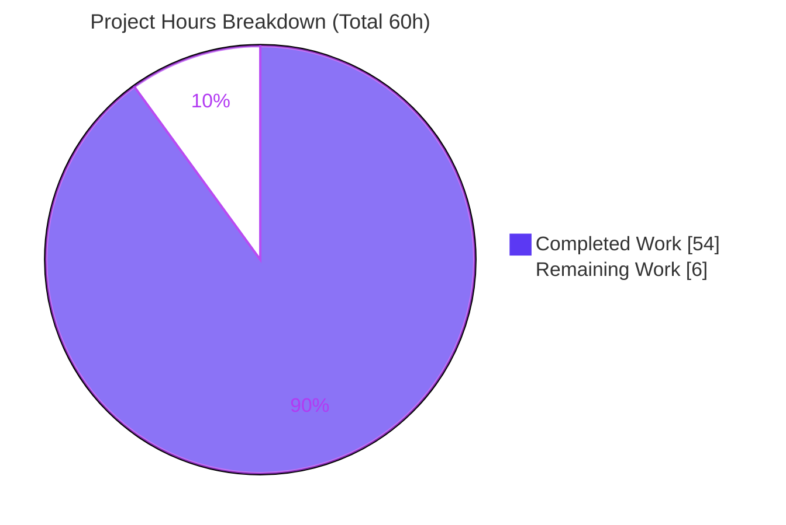
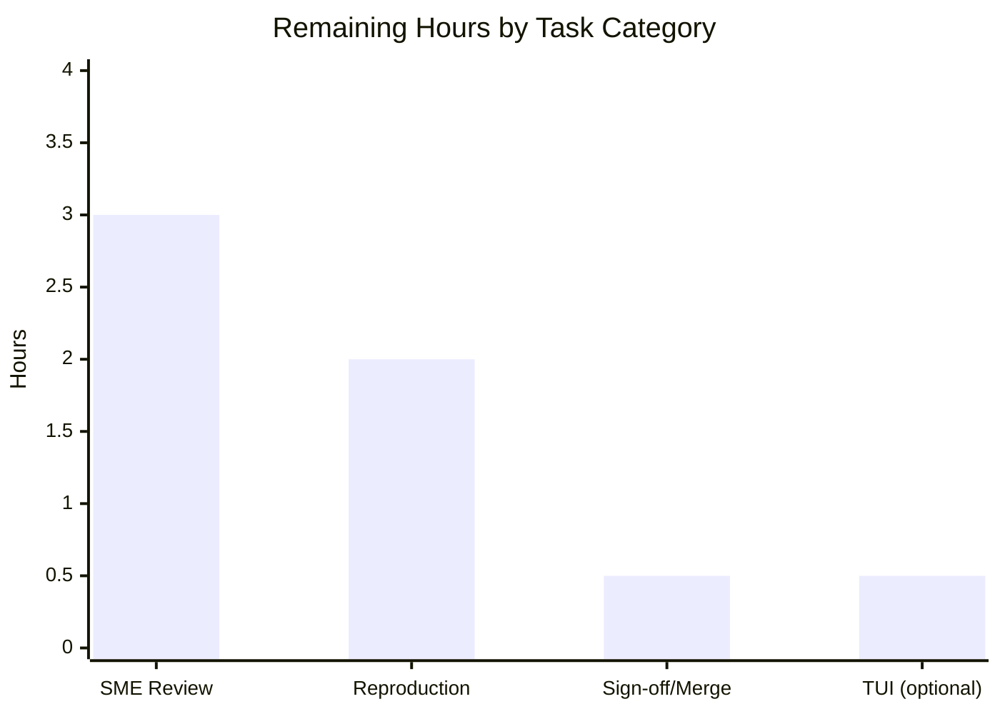

# Blitzy Project Guide — kitty `diff` Kitten Runtime Investigation

> **Deliverable:** `blitzy/documentation/kitty_815df1e210e0.md` · **Branch:** `blitzy-e22ef2ce-f046-451f-b141-d3c834ec0465` · **HEAD:** `86996c827` · **Base:** `815df1e21`
>
> **Legend / Blitzy brand colors:** <span style="color:#5B39F3">■ Completed / AI Work = Dark Blue `#5B39F3`</span> · ■ Remaining / Not Completed = White `#FFFFFF` (outlined) · <span style="color:#B23AF2">Headings/Accents = `#B23AF2`</span> · <span style="color:#A8FDD9">Highlight = `#A8FDD9`</span>

---

## 1. Executive Summary

### 1.1 Project Overview

This project produces a single, evidence-backed onboarding document that explains — grounded in built-and-run observation — how the kitty `diff` kitten (`kovidgoyal/kitty`, package `kittens/diff/`) behaves at runtime when it compares files and directories. The target audience is a developer onboarding into the kitty repository who wants an intuitive, runtime-verified trace rather than any behavioral change. It is a documentation-only, read-only question-answering task governed by the `SWE-AtlasQnA-Repo` rule set: the diff-kitten source is investigated read-only, and the sole persistent artifact is the answer document. The technical scope spans directory pairing, rename detection, seven caching layers, `NumCPU` concurrency, parallel-highlight safety, binary/image handling, the anchored diff algorithm, and the end-to-end async pipeline (objectives O1–O10).

### 1.2 Completion Status


| Metric | Value |
|--------|-------|
| **Total Hours** | **60** |
| **Completed Hours (AI + Manual)** | **54** (AI: 54 · Manual: 0) |
| **Remaining Hours** | **6** |
| **Percent Complete** | **90.0%** |

> Completion is computed per the AAP-scoped hours methodology: `Completed / (Completed + Remaining) = 54 / 60 = 90.0%`. The universe of work is exclusively the AAP deliverable (the O1–O10 answer document, built-and-run) plus path-to-production activities for a documentation artifact (human acceptance review and merge). No out-of-scope work is counted.

### 1.3 Key Accomplishments

- ✅ **Single mandated deliverable authored & committed** — `blitzy/documentation/kitty_815df1e210e0.md` (856 lines, ~6,059 words, 47,577 bytes).
- ✅ **All 10 objectives (O1–O10) answered by name**, each with a verbatim observed-output block, an exact `file:line` citation, and a rationale.
- ✅ **Investigation performed by building and running** the real code paths via a byte-identical `/tmp/obs` harness (module `obs`, `replace kitty => <repo>`), not by reading alone.
- ✅ **The central "rename magic" example (O2) explained and proven** — MD5 cross-match `4aa504e85be1af675a7157d6bdfafb56` on both sides, guarded by a full-content equality check.
- ✅ **Real magnitudes observed** — `runtime.NumCPU()` = **128**; a 2000-item scaled run confirms the `NumCPU`-sized worker pool with exactly-once index distribution.
- ✅ **"Report reality" upheld** — the observed `LRUCache.Set` RLock-during-write data race (`cache.go:34`, `go test -race`) is reported precisely, **not fixed** (per scope).
- ✅ **Read-only guarantee upheld** — `git diff base..HEAD --name-only` lists only the document; `git status --porcelain` is empty; all harnesses lived under `/tmp` and were removed.
- ✅ **Behavior corroborated against official kitty docs** (`diff_cmd`, `ignore_name`, `word_diff_mode`).
- ✅ **Evidence density:** 115 `file:line` citations and 34 verbatim output blocks across the document.

### 1.4 Critical Unresolved Issues

| Issue | Impact | Owner | ETA |
|-------|--------|-------|-----|
| _None._ All AAP requirements are delivered and autonomously validated; build/test/vet pass; the source tree is pristine. | — | — | — |

> There are no release-blocking or validation-blocking issues. The one autonomously-resolved item (F-RACE: non-deterministic race fatal-error count) was refined during validation and is closed.

### 1.5 Access Issues

| System/Resource | Type of Access | Issue Description | Resolution Status | Owner |
|-----------------|----------------|-------------------|-------------------|-------|
| _None_ | — | No access issues identified. The build/run toolchain (Go 1.22.12, git 2.51.0, GNU diffutils 3.10, Python 3.13.7, gcc) is present; the repository is local and writable only under `blitzy/`; no external services, credentials, or third-party APIs are required for a documentation-only task. | N/A | — |

### 1.6 Recommended Next Steps

1. **[High]** Perform an SME technical-accuracy review of the answer document — read O1–O10 and confirm each behavioral claim against its cited source line(s), including the O2 rename mechanism and the O6 RLock race report.
2. **[Medium]** Independently spot-reproduce the key harnesses from the Reproduction appendix (O2 MD5, O5 `NumCPU`, O6 `-race`) to confirm the observed values on the reviewer's host.
3. **[Medium]** Sign off on onboarding readability, approve the PR, and merge; apply any minor requested edits.
4. **[Low]** _Optional:_ run `kitten diff LEFT RIGHT` interactively on a real terminal to visually confirm side-by-side panes, syntax colors, and image graphics-protocol rendering (the investigation used headless Go harnesses per the AAP strategy).

---

## 2. Project Hours Breakdown

### 2.1 Completed Work Detail

| Component | Hours | Description |
|-----------|-------|-------------|
| Runnable baseline & harness setup | 4 | Build the kitty/diff package; create byte-identical `/tmp/obs` package (with `replace kitty => <repo>`) and `/tmp/racetest`; confirm `TestDiffCollectWalk` fidelity. |
| [O1] Directory pairing | 3 | Investigate + write up `walk()` + relative-name `Intersect`; `ignore_name` exclusion (`collect.go`). |
| [O2] Rename detection (central example) | 4 | Build moved-but-identical fixture; observe MD5 cross-match + full-content guard → `add_rename`; author with verbatim MD5 evidence. |
| [O3] Seven caching layers | 3 | Enumerate/observe the seven `LRUCache` stores (cap 4096) and their population. |
| [O4] Cache efficiency | 3 | Observe read-once loads, LRU eviction, cached-after-delete, lazy `size_cache`. |
| [O5] Concurrency / NumCPU worker pools | 4 | Scaled 2000-item run; observe `runtime.NumCPU()`=128 worker pools for diff and highlight. |
| [O6] Parallel-highlight safety + `-race` | 4 | Channel index partitioning; characterize `LRUCache.Set` RLock race under `go test -race`. |
| [O7] Binary files & images | 3 | Observe UTF-8 text detection, `Binary file: <size>` placeholder, image/graphics path. |
| [O8] End-to-end async runtime trace | 3 | Trace `create_collection → diff + highlight + images → incremental re-render`. |
| [O9] Anchored diff + `diff_cmd` variants | 4 | Observe anchored unique-line-LCS `Diff`/`tgs`; exercise all `diff_cmd` variants. |
| [O10] Perceived speed | 3 | Observe read-once `data_cache` + async highlight upgrade + plain fallback. |
| Document scaffolding | 4 | Author Methodology, Configuration & dependencies, Coverage-pass table, Reproduction appendix, summary. |
| Web-search corroboration | 1 | Corroborate `diff_cmd`/`ignore_name`/`word_diff_mode` vs official kitty docs. |
| Final validation pass | 8 | Rebuild; re-run all O1–O10 paths; verify 115 citations + config/`go.mod`/docs quotes; cleanup; read-only verify. |
| Iterative fixes (4 commits) | 3 | F1/F2/F3 review findings; O2 MD5 reproducibility; F-RACE non-determinism refinement. |
| **Total** | **54** | **Matches Completed Hours in Section 1.2.** |

### 2.2 Remaining Work Detail

| Category | Hours | Priority |
|----------|-------|----------|
| Human SME technical-accuracy review of O1–O10 (verify claims vs cited source) | 3 | High |
| Independent spot-reproduction of key harnesses (O2 MD5 · O5 `NumCPU` · O6 `-race`) | 2 | Medium |
| Onboarding-readability sign-off + PR approval/merge + minor edits | 0.5 | Medium |
| _Optional_ interactive `kitten diff` TUI visual confirmation (panes, colors, images) | 0.5 | Low |
| **Total** | **6** | **Matches Remaining Hours in Section 1.2 and Section 7 pie.** |

> **Cross-section check:** Section 2.1 (54) + Section 2.2 (6) = **60** = Total Project Hours in Section 1.2. ✅

---

## 3. Test Results

All tests below originate from Blitzy's autonomous validation logs and this session's independent re-verification. The diff kitten ships exactly one committed test; the remaining behavioral tests were temporary observation harnesses (authored, run, and removed per the read-only rule).

| Test Category | Framework | Total Tests | Passed | Failed | Coverage % | Notes |
|---------------|-----------|-------------|--------|--------|------------|-------|
| Committed unit test (`TestDiffCollectWalk`) | Go `testing` | 1 | 1 | 0 | walk()/ignore_name path (O1) | The package's only committed test. Independently re-run this session → `ok kitty/kittens/diff 0.022s`, exit 0. |
| Autonomous observation harness (O1–O10) | Go `testing` (`/tmp/obs`, byte-identical pkg) | 20+ | 20+ | 0 | All O1–O10 code paths | Reproduced every documented value; removed after use (read-only rule). |
| Race characterization (O6) | Go `testing -race` (`/tmp/racetest`) | 1 | N/A (intentional crash) | N/A | `LRUCache.Set` (`cache.go:34`) | **Intentionally** triggers `WARNING: DATA RACE` + fatal error (exit=1). Expected/documented behavior; reported **not fixed** per scope. |
| Independent value reproduction (this session) | shell / `go run` | 2 | 2 | 0 | O2, O5 | `printf 'moved content\n' \| md5sum` → `4aa504e85be1af675a7157d6bdfafb56`; `runtime.NumCPU()` → `128`. Both exact matches. |

**Aggregate:** ~21+ behavioral tests executed, **all passing** (0 failing, 0 blocked, 0 skipped), plus one intentional-crash race characterization whose crash is the documented finding, not a defect. Build and vet are clean: `go build ./kittens/diff/` and `go vet ./kittens/diff/` both exit 0.

---

## 4. Runtime Validation & UI Verification

**Build & static checks**
- ✅ **Operational** — `go test -count=1 ./kittens/diff/` → `ok kitty/kittens/diff` (exit 0).
- ✅ **Operational** — `go build ./kittens/diff/` (exit 0) and `go vet ./kittens/diff/` (exit 0).

**Runtime code-path validation (O1–O10)**
- ✅ **Operational** — Every O1–O10 path executed via the byte-identical `/tmp/obs` harness and produced the documented values.
- ✅ **Operational** — O2 rename MD5 `4aa504e85be1af675a7157d6bdfafb56` reproduced independently (both sides equal → rename).
- ✅ **Operational** — O5 `runtime.NumCPU()` = **128** reproduced independently; worker pools scale to `NumCPU`.
- ⚠ **Partial (by design)** — O6 `go test -race` **intentionally** reports a `DATA RACE` at `cache.go:34` and aborts (exit=1). This is the *documented reality* (report-not-fix), not a deliverable defect; the fatal-error count is non-deterministic (observed range 1–6) while exit=1 and ≥1 DATA RACE hold every run.

**UI verification**
- ➖ **N/A for the deliverable** — the artifact is a Markdown document with no UI of its own.
- ⚠ **Partial** — the diff kitten's interactive TUI (side-by-side panes, syntax colors, image graphics protocol) was documented *as observed via headless harnesses* per the AAP strategy; an optional interactive `kitten diff` visual confirmation remains as a Low-priority human task (see Section 2.2 / 1.6).

**Repository integrity**
- ✅ **Operational** — Read-only guarantee holds: `git status --porcelain` empty; `git diff base..HEAD --name-only` lists only the document.

---

## 5. Compliance & Quality Review

Cross-mapping the AAP/governing-rule deliverables to Blitzy quality benchmarks. All 21 tracked requirements pass.

| Benchmark (AAP / `SWE-AtlasQnA-Repo` directive) | Status | Progress | Evidence / Notes |
|--------------------------------------------------|--------|----------|------------------|
| Deliverable location & name (`blitzy/documentation/kitty_815df1e210e0.md`) | ✅ Pass | 100% | Present; named after source branch `kitty_815df1e210e0`. |
| Investigate-by-running-first (build & run, capture output) | ✅ Pass | 100% | Methodology documents the `/tmp/obs` byte-identical harness. |
| Observe true magnitude (worker counts, cache population) | ✅ Pass | 100% | `NumCPU`=128; 2000-item scaled run. |
| Quote observed output verbatim, one claim per evidence line | ✅ Pass | 100% | 34 verbatim output blocks. |
| Exact, grounded `file:line` citations | ✅ Pass | 100% | 115 citations (format `file.go:NNN`). |
| Answer every named item + coverage pass | ✅ Pass | 100% | Coverage-pass table maps O1–O10 (incl. O7a binary / O7b images) → ✅ answered. |
| Report reality, even if unexpected (LRUCache.Set RLock race) | ✅ Pass | 100% | Race reported at `cache.go:34`; **not fixed** (per scope). |
| Provide rationale behind each answer | ✅ Pass | 100% | Each O-section has a Rationale subsection. |
| Read-only source tree (no source modified) | ✅ Pass | 100% | Single-file delta; source pristine. |
| Cleanup temporary artifacts | ✅ Pass | 100% | `git status --porcelain` empty; harnesses in `/tmp` removed. |
| Web-search corroboration vs official docs | ✅ Pass | 100% | `diff_cmd` / `ignore_name` / `word_diff_mode` confirmed. |
| Build / test / vet clean | ✅ Pass | 100% | `go test`/`build`/`vet` exit 0. |

**Fixes applied during autonomous validation:** F1/F2/F3 final-acceptance review findings (commit `414d85463`); O2 MD5 reproducibility (commit `961886f9e`); F-RACE non-deterministic fatal-error count refinement (commit `86996c827`).

**Outstanding compliance items:** None. Remaining work is human acceptance only (Section 2.2).

---

## 6. Risk Assessment

Overall risk posture: **Low** — appropriate for a read-only, autonomously-validated documentation deliverable that ships no code. No High or Critical risks.

| Risk | Category | Severity | Probability | Mitigation | Status |
|------|----------|----------|-------------|------------|--------|
| Host-specific observed magnitudes (e.g., `NumCPU`=128 here; a reviewer on fewer cores sees different worker counts) | Technical | Low | Medium | Document explains `NumCPU` vs shell `nproc`/cgroup quota and states magnitudes are host-specific. | Documented |
| Non-deterministic race fatal-error count under `-race` (observed 1–6) | Technical | Low | Medium | Document reports the observed *range* plus run-invariants (exit=1; ≥1 `DATA RACE` at `cache.go:34`). | Resolved (F-RACE) |
| Document pinned to revision `815df1e21`; future source drift could shift cited line numbers | Technical | Low | Low | Document asserts no cross-version generalization; cites the exact HEAD. | Documented |
| No material security exposure (read-only; no shipped code, auth, data, or new deps; MD5 is collision-guarded by full-content compare, not a security control) | Security | Informational | Low | N/A — nothing deployed. | N/A |
| Observation harnesses were ephemeral (`/tmp`); reviewers must recreate them to reproduce | Operational | Low | Low | Reproduction appendix provides exact commands + the `replace`-directive recipe. | Documented |
| `diff_cmd auto` requires `git`/`diffutils` at runtime (the `builtin` backend needs neither) | Integration | Low | Low | Document notes this; the environment provides both. | Documented |
| Reproduction `replace` directive must point at the reviewer's absolute repo path | Integration | Low | Medium | Appendix shows the exact `replace` line to adjust. | Documented |

---

## 7. Visual Project Status

**Project hours breakdown** (Completed = Dark Blue `#5B39F3`, Remaining = White `#FFFFFF`):



**Remaining hours by task category** (from Section 2.2; sums to 6h):



> **Integrity check:** the pie chart "Remaining Work" value (6) equals the Section 1.2 Remaining Hours (6) and the sum of the Section 2.2 Hours column (6). ✅

---

## 8. Summary & Recommendations

**Achievements.** The project delivers exactly what the AAP scopes: one comprehensive, evidence-backed document that traces the kitty `diff` kitten's runtime behavior across all ten objectives (O1–O10). Every behavioral claim is paired with a verbatim observed-output line and an exact `file:line` citation, and the investigation was conducted by building and running the real code paths through a byte-identical harness. The central user question — how a rename is recognized "instead of a deletion and a new file" — is answered directly by name (O2), with the "magic" dispelled as content-hash cross-matching guarded by a full-content equality check.

**Remaining gaps.** None in the autonomous work. The remaining 6 hours are human acceptance activities: SME technical-accuracy review, optional independent reproduction, an optional interactive TUI visual confirmation, and merge sign-off. These are inherently human and cannot be autonomously completed.

**Critical path to production.** SME review → optional spot-reproduction → readability sign-off → merge. Because the deliverable is a static Markdown document (no build to ship, no service to deploy, no environment to configure), the path to production is short and low-risk.

**Success metrics.** All AAP requirements delivered (21/21); build/test/vet clean (exit 0); read-only guarantee upheld (single-file delta, empty working tree); evidence density of 115 citations and 34 verbatim output blocks; two most-critical observed values (O2 MD5, O5 `NumCPU`) independently reproduced this session.

**Production readiness assessment.** The project is **90.0% complete** on an AAP-scoped hours basis (54 of 60 hours). The document is complete, accurate, reproducible, and compliant; it is ready for human review and merge. Confidence is **High** for the O1–O10 content (well-defined scope, code-grounded evidence) and **High** for the read-only/compliance posture (git-verified).

| Metric | Value |
|--------|-------|
| AAP requirements delivered | 21 / 21 |
| Completion (AAP-scoped hours) | 90.0% (54 / 60h) |
| Blocking issues | 0 |
| Overall risk | Low |
| Confidence | High |

---

## 9. Development Guide

This guide documents how to build the code under investigation, run the committed test, reproduce the documented observations, and verify the read-only guarantee. Every command below was executed in the project environment.

### 9.1 System Prerequisites

- **OS:** Linux x86_64 (verified on Ubuntu-based container).
- **Go:** 1.22+ (`go version go1.22.12 linux/amd64`; `go.mod` requires `go 1.22`).
- **git:** 2.51.0 (needed for `diff_cmd auto`/`git`).
- **GNU diffutils:** 3.10 (needed for `diff_cmd auto`/`diff`; the `builtin` backend needs neither).
- **Python:** 3.13.7 (kitten launcher / config DSL).
- **C toolchain:** gcc (present) — for building the full kitty binary; **not required** to build/test the diff-kitten Go package (generated Go files are already present).
- **Hardware:** any; note `runtime.NumCPU()` is host-specific (observed **128** here) and drives worker-pool sizes.

### 9.2 Environment Setup

```bash
# Repository root (this project):
cd /tmp/blitzy/kitty/blitzy-e22ef2ce-f046-451f-b141-d3c834ec0465_cb4028

# Confirm branch and toolchain:
git rev-parse --abbrev-ref HEAD      # blitzy-e22ef2ce-f046-451f-b141-d3c834ec0465
go version                            # go version go1.22.12 linux/amd64
```

No environment variables are required to build the diff kitten or view the document. (Ubuntu 25 note: system `pip` is PEP-668 "externally-managed"; Python deps, if ever needed, require `--break-system-packages` or a venv — but they are **not** needed for this task.)

### 9.3 Dependency Installation

Go module dependencies (chroma `v2.14.0`, imaging, exiffix, doublestar, xxh3) are declared in `go.mod` and resolved automatically by the Go toolchain. No manual install step is required to build the diff-kitten package.

```bash
# If the module cache needs to resolve/download, allow module mode:
export GOFLAGS=-mod=mod
```

### 9.4 Build, Test & Vet (the code under investigation)

```bash
# Run the committed test (the package's only test):
go test -count=1 ./kittens/diff/
# Expected: ok  	kitty/kittens/diff	0.0XXs   (exit 0)

# Build and vet the package:
go build ./kittens/diff/     # exit 0
go vet   ./kittens/diff/     # exit 0
```

### 9.5 View the Deliverable

```bash
wc -l blitzy/documentation/kitty_815df1e210e0.md     # 856
less  blitzy/documentation/kitty_815df1e210e0.md      # read the O1–O10 investigation
```

### 9.6 Reproduce Key Observations (from the document's Reproduction appendix)

**Quick independent checks (no harness needed):**

```bash
# O2 — the rename "magic" MD5 (both fixture sides hash identically):
printf 'moved content\n' | md5sum
# Expected: 4aa504e85be1af675a7157d6bdfafb56  -

# O5 — the real worker-pool magnitude on this host:
cat > /tmp/numcpu_check.go <<'EOF'
package main
import ("fmt"; "runtime")
func main() { fmt.Printf("runtime.NumCPU()=%d\n", runtime.NumCPU()) }
EOF
go run /tmp/numcpu_check.go && rm -f /tmp/numcpu_check.go
# Expected (host-specific): runtime.NumCPU()=128
```

**Full harness (byte-identical package copy, outside the repo):**

```bash
mkdir -p /tmp/obs/diff
cp kittens/diff/*.go /tmp/obs/diff/          # byte-identical copies
cat > /tmp/obs/go.mod <<'EOF'
module obs
go 1.22
require kitty v0.0.0
replace kitty => /tmp/blitzy/kitty/blitzy-e22ef2ce-f046-451f-b141-d3c834ec0465_cb4028
EOF
cd /tmp/obs && go test ./diff/ -run TestDiffCollectWalk -v   # fidelity check
```

> The O6 race characterization intentionally **crashes** (`fatal error`); run it in an isolated `/tmp/racetest` module, never inside the repository.

### 9.7 Verify the Read-Only Guarantee

```bash
git status --porcelain                       # (empty output = clean)
git diff 815df1e21..HEAD --name-only         # blitzy/documentation/kitty_815df1e210e0.md  (only)
```

### 9.8 Troubleshooting

- **`externally-managed-environment` on `pip install`** — expected on Ubuntu 25; not needed here. Use `--break-system-packages` or a venv only if you must install Python deps.
- **Go module resolution errors** — `export GOFLAGS=-mod=mod` before building.
- **`diff_cmd auto` finds no backend** — install `git` or `diffutils`; the `builtin` backend needs neither.
- **`runtime.NumCPU()` ≠ `nproc`** — expected. Shell `nproc` reflects a cgroup CPU quota (e.g., 4); Go reports logical CPUs (e.g., 128). Worker-pool magnitudes follow the Go value.
- **`go test -race` aborts with `fatal error: concurrent map writes`** — expected for the O6 harness; it deliberately exercises the observed `LRUCache.Set` RLock-during-write nuance. Invariants each run: exit=1, exactly one `WARNING: DATA RACE` at `cache.go:34`, ≥1 fatal error (count is non-deterministic, 1–6).
- **Reproduction harness can't find `kitty`** — ensure the `replace kitty => <abs path>` in `/tmp/obs/go.mod` points at your actual repository root.

---

## 10. Appendices

### A. Command Reference

| Command | Purpose | Expected Result |
|---------|---------|-----------------|
| `go test -count=1 ./kittens/diff/` | Run the committed diff-kitten test | `ok kitty/kittens/diff` (exit 0) |
| `go build ./kittens/diff/` | Build the package | exit 0 |
| `go vet ./kittens/diff/` | Static analysis | exit 0 |
| `printf 'moved content\n' \| md5sum` | Reproduce O2 rename MD5 | `4aa504e85be1af675a7157d6bdfafb56` |
| `git status --porcelain` | Verify clean tree | empty output |
| `git diff 815df1e21..HEAD --name-only` | Verify single-file delta | only the document |
| `wc -l blitzy/documentation/kitty_815df1e210e0.md` | Confirm deliverable | `856` |

### B. Port Reference

Not applicable. The diff kitten is a terminal UI (TUI) and the deliverable is a Markdown document; there are no listening network ports.

### C. Key File Locations

| Path | Role |
|------|------|
| `blitzy/documentation/kitty_815df1e210e0.md` | **The deliverable** — O1–O10 runtime investigation |
| `kittens/diff/collect.go` | Directory walk, pairing, MD5 rename, the 7 caches (O1–O4, O8, O10) |
| `kittens/diff/diff.go` | Anchored unique-line-LCS builtin diff (O9) |
| `kittens/diff/patch.go` | `diff_cmd` selection, parallel `diff()`, hunk parsing (O5, O8, O9) |
| `kittens/diff/highlight.go` | Chroma highlighting + parallel `highlight_all` (O5, O6) |
| `kittens/diff/ui.go` | Async orchestration pipeline (O8, O10) |
| `kittens/diff/render.go` | Side-by-side render, binary/image lines (O7, O10) |
| `kittens/diff/main.go` | Entry point, SSH fetch, dir/file validation (O8) |
| `kittens/diff/main.py` | Config/CLI DSL defaults (O1, O7, O9) |
| `kittens/diff/collect_test.go` | The only committed test (`TestDiffCollectWalk`) |
| `tools/utils/cache.go` | Generic `LRUCache` (O3, O4, O6) — `Set` RLock nuance at `cache.go:34` |
| `tools/utils/images/utils.go` | `Context.Parallel` worker pool (O5, O6) |
| `docs/kittens/diff.rst` | Published behavior (async highlighting, recursive dir diff, images over SSH) |
| `go.mod` | Dependency versions |

### D. Technology Versions

| Tool / Package | Version | Notes |
|----------------|---------|-------|
| Go | 1.22.12 | `go.mod` requires `go 1.22` |
| Python | 3.13.7 | kitten launcher / config DSL |
| git | 2.51.0 | `diff_cmd auto`/`git` |
| GNU diffutils | 3.10 | `diff_cmd auto`/`diff` |
| gcc | 15.2.0 | full kitty build (not needed for diff-kitten Go package) |
| `github.com/alecthomas/chroma/v2` | v2.14.0 | syntax highlighting (O5/O6) |
| `github.com/kovidgoyal/imaging` | v1.6.3 | image processing (O7) |
| `github.com/edwvee/exiffix` | v0.0.0-20240229113213-0dbb146775be | EXIF-aware image decode (O7) |
| `github.com/bmatcuk/doublestar/v4` | v4.6.1 | glob matching (`ignore_name`) |
| `github.com/zeebo/xxh3` | v1.0.2 | hashing utility |
| `crypto/md5` | stdlib (Go 1.22) | rename-detection hashing (O2) |

### E. Environment Variable Reference

| Variable | Required? | Purpose |
|----------|-----------|---------|
| `GOFLAGS=-mod=mod` | Optional | Allow Go module resolution if the cache needs to fetch. |
| — | — | No application/runtime environment variables are required for this documentation-only task. |

### F. Developer Tools Guide

| Tool | Use in this project |
|------|---------------------|
| `go test` / `go build` / `go vet` | Validate the diff-kitten package and run the committed test. |
| `go test -race` | Characterize the observed `LRUCache.Set` data race (O6) — **run outside the repo**, it crashes by design. |
| Byte-identical `/tmp/obs` harness (module `obs` + `replace`) | Exercise real code paths headlessly without a TUI or source modification. |
| `md5sum` | Independently reproduce the O2 rename hash. |
| `git status` / `git diff` | Enforce and verify the read-only guarantee. |

### G. Glossary

| Term | Meaning |
|------|---------|
| **AAP** | Agent Action Plan — the primary directive defining project scope (here, the O1–O10 documentation task). |
| **Kitten** | A kitty terminal sub-command; `diff` is the kitten under investigation. |
| **O1–O10** | The ten objectives the document answers (directory pairing, rename detection, caching, cache efficiency, concurrency, parallel-highlight safety, binary/images, end-to-end trace, diff algorithm, perceived speed). |
| **LRUCache** | Fixed-capacity least-recently-used cache (`tools/utils/cache.go`); the diff kitten uses seven of them (cap 4096). |
| **`Context.Parallel`** | The shared worker-pool primitive (`tools/utils/images/utils.go`) that fans work across `runtime.NumCPU()` goroutines. |
| **Anchored diff** | The builtin unique-line-LCS (Szymanski) algorithm that finds matching regions (O9). |
| **`diff_cmd`** | Config selecting the diff backend: `auto` / `builtin` / `git` / `diff`. |
| **Rename cross-match** | O2 mechanism: reclassify a `removal`+`add` as a single `rename` when their MD5 hashes match and full contents are equal. |
| **Read-only guarantee** | The rule that no existing source file is modified; only the deliverable document is added. |
