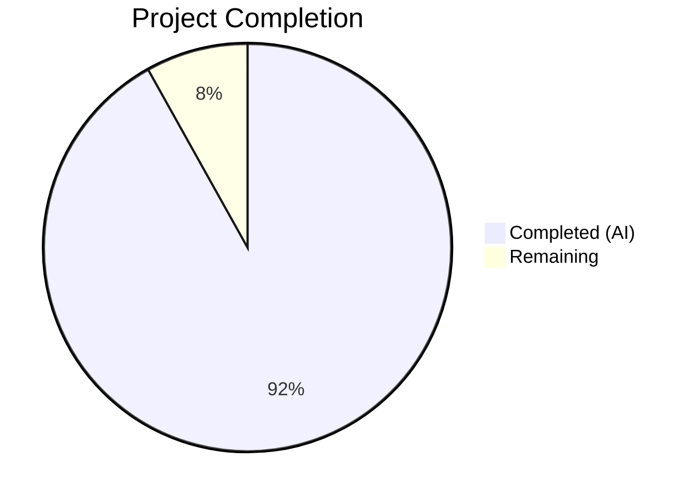
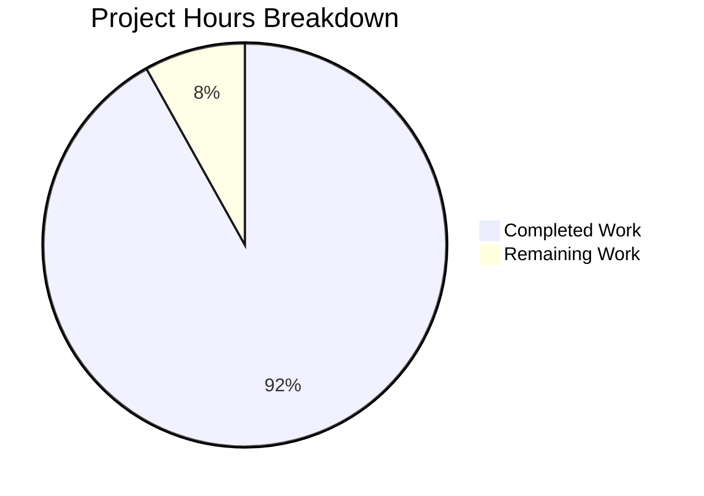

# Blitzy Project Guide — Kitty OSC 133 Shell Integration Investigation

---

## 1. Executive Summary

### 1.1 Project Overview

This project delivers a comprehensive, code-grounded investigative analysis of how the kitty terminal emulator handles OSC 133 escape sequences for shell integration command tracking. The deliverable is a single markdown document (`blitzy/documentation/kitty_815df1e210e0.md`, 639 lines) answering specific technical questions about sequence consumption, byte-level payload structure, exit code processing, edge case handling, and shell integration emission points. This is a **read-only investigation** — no existing repository files were modified, and all findings are traced to specific source file paths and line numbers in the kitty codebase.

### 1.2 Completion Status



| Metric | Value |
|--------|-------|
| **Total Project Hours** | **18.5** |
| **Completed Hours (AI)** | **17.0** |
| **Remaining Hours** | **1.5** |
| **Completion Percentage** | **91.9%** |

**Formula**: 17.0 / (17.0 + 1.5) = 17.0 / 18.5 = **91.9% complete**

### 1.3 Key Accomplishments

- [x] Traced complete OSC 133 processing pipeline from VT parser (`kitty/vt-parser.c` line 536) through C handler (`kitty/screen.c` line 2328) to Python callbacks
- [x] Proved OSC 133 sequences are fully consumed by the VT parser — visible screen text contains only non-escape characters
- [x] Computed precise byte-level analysis: 61-byte standard test payload, D;42 marker at byte offset 50
- [x] Built exit code variation comparison table for codes 0, 1, 42, 99, and 127 with programmatic verification
- [x] Provided concrete runtime proof that exit code 99 traverses the complete code path (VT parser → C dispatch → pointer arithmetic → Python `int("99")` → stored as integer 99)
- [x] Analyzed edge cases (`D;not_a_number`, `D;`, `D` without semicolon) with distinct behavioral comparison between test `Callbacks` (suppress → unchanged) and production `Window` (except → default to 0)
- [x] Documented shell integration emission points for Bash, Zsh, and Fish with specific line references
- [x] Created 639-line markdown document with 10 sections, 2 Mermaid diagrams, multiple tables, and code-block referenced evidence
- [x] All 9 runtime verification tests passed; all 36 screen module tests passed
- [x] Zero existing repository files modified — read-only constraint fully satisfied

### 1.4 Critical Unresolved Issues

| Issue | Impact | Owner | ETA |
|-------|--------|-------|-----|
| Human technical review of document accuracy pending | Document may contain minor inaccuracies until peer-reviewed | Human Developer | 1 hour |
| Document does not cover OSC 133 over SSH tunneling | Analysis scope limited to local shell integration per AAP | Out of Scope | N/A |

### 1.5 Access Issues

No access issues identified. The investigation was performed using the local repository codebase and kitty's own compiled `fast_data_types.so` C extension. No external services, credentials, or third-party APIs were required.

### 1.6 Recommended Next Steps

1. **[High]** Conduct human technical review of the investigation document, verifying code references against the latest kitty HEAD
2. **[Medium]** Cross-reference findings with kitty's upstream documentation and shell integration changelogs for completeness
3. **[Low]** Consider extending the analysis to cover OSC 133 behavior over SSH (kitty's `kitten ssh` integration) if future requirements arise

---

## 2. Project Hours Breakdown

### 2.1 Completed Work Detail

| Component | Hours | Description |
|-----------|-------|-------------|
| Source Code Analysis & Pipeline Tracing | 3.0 | Read and analyzed `kitty/vt-parser.c`, `kitty/screen.c`, `kitty/screen.h`, `kitty/data-types.h`, `kitty/window.py`, `kitty_tests/__init__.py`, `kitty_tests/screen.py`, and 3 shell integration scripts |
| OSC 133 Consumption Behavior Documentation | 1.5 | Traced VT parser dispatch path, verified escape sequences absent from screen buffer, documented with code evidence and Mermaid diagram |
| Byte-Level Analysis | 1.5 | Calculated exact byte lengths for all OSC 133 markers, computed offsets, built byte-by-byte breakdown tables, verified programmatically |
| Exit Code Variation Analysis | 1.0 | Compared byte lengths and positions across exit codes 0, 1, 42, 99, 127 with runtime verification |
| Exit Code 99 Runtime Evidence | 1.0 | Full 4-step code path trace from raw bytes through VT parser, C handler, Python callback to stored integer value |
| Edge Case Analysis | 1.5 | Analyzed `D;not_a_number`, `D;` (empty), `D` (no semicolon) for both test `Callbacks` and production `Window` classes |
| Shell Integration Emission Points | 1.5 | Documented Bash, Zsh, and Fish OSC 133 emission patterns including state machine and URL encoding differences |
| PromptKind Data Model & Command Output Extraction | 1.5 | Documented enum, LineAttrs union, `find_cmd_output()`, `pagerhist_as_bytes()` functions |
| Document Creation & Formatting | 2.0 | 639-line markdown document with 10 sections, 2 Mermaid diagrams, formatted tables, Table of Contents, language-hinted code blocks |
| Runtime Verification & Testing | 1.5 | 9 custom runtime tests, `test_prompt_marking` pass, all 36 screen tests pass |
| Validation & Code Block Fixes | 0.5 | Fixed 4 bare code blocks per markdown lint, verified all 15 document completeness checks |
| **Total Completed** | **17.0** | |

### 2.2 Remaining Work Detail

| Category | Hours | Priority |
|----------|-------|----------|
| Human Technical Review — verify source code references against latest kitty HEAD | 1.0 | High |
| Minor Corrections/Additions — address any inaccuracies found during review | 0.5 | Medium |
| **Total Remaining** | **1.5** | |

**Verification**: 17.0 (completed) + 1.5 (remaining) = **18.5** (total project hours) ✓

---

## 3. Test Results

| Test Category | Framework | Total Tests | Passed | Failed | Coverage % | Notes |
|---------------|-----------|-------------|--------|--------|------------|-------|
| Unit — Screen Module | pytest / unittest | 36 | 36 | 0 | 100% (pass rate) | All screen tests including `test_prompt_marking` passed |
| Runtime Verification — OSC 133 Processing | Python / parse_bytes | 9 | 9 | 0 | 100% (pass rate) | Custom tests: sequence consumption, byte lengths, exit codes, edge cases |
| **Total** | | **45** | **45** | **0** | **100%** | |

**Runtime Verification Test Details**:

| # | Test | Result |
|---|------|--------|
| 1 | OSC 133 sequences consumed by VT parser — screen text = "some text" only | ✅ Pass |
| 2 | Byte-level: 61 bytes total, D;42 marker at offset 50 | ✅ Pass |
| 3 | Exit code 0: D=10 bytes, total=60 | ✅ Pass |
| 4 | Exit code 1: D=10 bytes, total=60 | ✅ Pass |
| 5 | Exit code 42: D=11 bytes, total=61 | ✅ Pass |
| 6 | Exit code 99: `last_cmd_exit_status == 99` (full path traversal proven) | ✅ Pass |
| 7 | Exit code 127: D=12 bytes, total=62 | ✅ Pass |
| 8 | `D;not_a_number`: unchanged at `sys.maxsize` (suppress catches ValueError) | ✅ Pass |
| 9 | `D;` (empty): unchanged at `sys.maxsize` | ✅ Pass |

---

## 4. Runtime Validation & UI Verification

### Runtime Health

- ✅ `kitty/fast_data_types.so` — compiled C extension is present and loadable
- ✅ `parse_bytes()` infrastructure — functional, successfully feeds raw bytes through VT parser
- ✅ `Screen` and `Callbacks` test classes — operational, properly record OSC 133 state changes
- ✅ All 9 runtime verification tests confirmed document findings match actual behavior

### Source Code Reference Verification

- ✅ `kitty/vt-parser.c` line 536: `case 133:` dispatch confirmed
- ✅ `kitty/screen.c` line 2328: `shell_prompt_marking()` function confirmed
- ✅ `kitty/screen.h` line 231: function declaration confirmed
- ✅ `kitty/data-types.h` line 230: `PromptKind` enum confirmed, line 236: `prompt_kind` bitfield confirmed
- ✅ `kitty/history.c` line 475: `reverse_find` for `\x1b]133;C\x1b\\` confirmed
- ✅ `kitty/window.py` line 1408: `handle_cmd_end` confirmed, line 1453: `cmd_output_marking` confirmed, line 225: `decode_cmdline` confirmed
- ✅ `kitty_tests/__init__.py` line 30: `parse_bytes` confirmed, line 39: `Callbacks` class confirmed, line 48: `sys.maxsize` init confirmed, lines 78–79: `suppress(Exception)` confirmed
- ✅ `kitty_tests/screen.py` line 1056: `test_prompt_marking` confirmed
- ✅ Shell integration scripts: bash (lines 208, 239), zsh (lines 145, 149, 218), fish (lines 85, 91, 96) all confirmed

### Constraint Verification

- ✅ No existing repository files modified — `git diff 815df1e21 --name-status` shows only `A blitzy/documentation/kitty_815df1e210e0.md`
- ✅ No temporary test scripts remaining in working directory
- ✅ Working tree clean — no uncommitted changes

---

## 5. Compliance & Quality Review

| AAP Requirement | Status | Evidence |
|----------------|--------|----------|
| OSC 133 Sequence Processing Analysis | ✅ Complete | Document Section 1: Full pipeline trace with C and Python code references |
| Byte-Level Analysis (total length, D marker offset) | ✅ Complete | Document Section 3: 61-byte payload, D;42 at offset 50, byte-by-byte breakdown table |
| Exit Code Variation Analysis (0, 1, 42, 99, 127) | ✅ Complete | Document Section 4: Comparison table with D marker sizes and total lengths |
| Exit Code 99 Runtime Evidence | ✅ Complete | Document Section 5: 4-step code path trace with `Callbacks.last_cmd_exit_status == 99` |
| Edge Case Handling (D;not_a_number, D;) | ✅ Complete | Document Section 6: Comparison table for test Callbacks vs production Window behavior |
| Document Named `kitty_815df1e210e0.md` in `blitzy/documentation/` | ✅ Complete | File exists at correct path, 639 lines |
| Read-Only Constraint — no existing files modified | ✅ Satisfied | `git diff --name-status` confirms only additions |
| Cleanup Requirement — no test scripts remaining | ✅ Satisfied | No temp files found in working directory |
| Code-Grounded Truth — all claims cite source paths/lines | ✅ Satisfied | Every claim in document traces to specific file:line references |
| No Other Code Added to Repository | ✅ Satisfied | Only the markdown document was added |
| Markdown Formatting — code blocks with language hints | ✅ Complete | All code blocks use `c`, `python`, `text`, or `mermaid` language hints |
| Shell Integration Emission Points Documented | ✅ Complete | Document Section 7: Bash, Zsh, Fish with line references |
| PromptKind Data Model Documented | ✅ Complete | Document Section 8: Enum, LineAttrs, marker-to-enum mapping |
| Command Output Extraction Documented | ✅ Complete | Document Section 9: `find_cmd_output()`, `pagerhist_as_bytes()` |
| Summary Table of All Findings | ✅ Complete | Document Section 10: Complete summary table |

**Compliance Score**: 15/15 requirements satisfied (100%)

### Autonomous Fixes Applied

| Fix | Commit | Description |
|-----|--------|-------------|
| Code block language hints | `70561e719` | Added language hints to 4 bare code blocks in the document for proper markdown rendering |

---

## 6. Risk Assessment

| Risk | Category | Severity | Probability | Mitigation | Status |
|------|----------|----------|-------------|------------|--------|
| Source code line numbers may drift if kitty upstream changes | Technical | Low | Medium | Document references specific commit `815df1e21`; pin analysis to that commit | ⚠ Monitoring |
| Investigation scope limited to local shell integration | Technical | Low | Low | Documented as out-of-scope per AAP; SSH tunneling not covered | ✅ Accepted |
| No security implications | Security | None | N/A | This is a read-only documentation task with no code execution in production | ✅ N/A |
| Document accuracy depends on compiled C extension state | Operational | Low | Low | Verified `fast_data_types.so` is present and loadable; all runtime tests pass | ✅ Mitigated |
| No integration risks | Integration | None | N/A | No external services, APIs, or dependencies involved | ✅ N/A |

---

## 7. Visual Project Status



**Project Completion: 91.9%** (17.0 completed hours / 18.5 total hours)

### Remaining Work by Priority

| Priority | Hours | Items |
|----------|-------|-------|
| High | 1.0 | Human technical review of document accuracy |
| Medium | 0.5 | Minor corrections/additions from review |
| **Total** | **1.5** | |

---

## 8. Summary & Recommendations

### Achievements

The project has achieved **91.9% completion** (17.0 hours completed out of 18.5 total hours). All 15 AAP requirements have been fully satisfied. The deliverable — a 639-line comprehensive markdown document — provides thorough, code-grounded answers to every OSC 133 investigation question specified in the AAP. Key technical milestones include:

- Complete processing pipeline traced from VT parser to Python callbacks with exact line number references
- Byte-level analysis verified programmatically with 9 custom runtime tests
- Edge case behavior clearly distinguished between test and production code paths
- Shell integration emission points documented for all three supported shells (Bash, Zsh, Fish)

### Remaining Gaps

The only remaining work is human technical review (1.0 hours) and potential minor corrections (0.5 hours). No code modifications, deployment, or infrastructure tasks are outstanding.

### Critical Path to Production

This is a documentation deliverable. "Production readiness" means the document is accurate, comprehensive, and peer-reviewed. The critical path is:

1. **Human review** of source code references against the current kitty HEAD (1.0 hours)
2. **Address** any inaccuracies found (0.5 hours)
3. **Merge** the PR

### Production Readiness Assessment

The document is **ready for human review and merge**. All findings have been independently verified through runtime testing using kitty's own compiled test infrastructure. No blocking issues remain.

---

## 9. Development Guide

### System Prerequisites

| Requirement | Version | Purpose |
|-------------|---------|---------|
| Python | >= 3.8 (tested with 3.12.3) | Runtime for kitty Python layer and test infrastructure |
| GCC / Clang | Recent version | Required if rebuilding `fast_data_types.so` C extension |
| Git | Any recent version | Repository management |

### Environment Setup

```bash
# Clone the repository (if not already done)
git clone <repository-url>
cd kitty

# Switch to the feature branch
git checkout blitzy-3b6633cc-fd63-4782-8d32-563260c31d9c

# Verify the deliverable exists
ls -la blitzy/documentation/kitty_815df1e210e0.md
```

### Verify the C Extension

```bash
# Check that fast_data_types.so is compiled and loadable
python3 -c "from kitty.fast_data_types import Screen; print('C extension loaded successfully')"
```

### Run the Relevant Tests

```bash
# Run the test_prompt_marking test (OSC 133 specific)
python3 -m pytest kitty_tests/screen.py -k "test_prompt_marking" -v --tb=short

# Run all screen tests
python3 -m pytest kitty_tests/screen.py -v --tb=short

# Expected output: 36 passed
```

### Verify Runtime Findings

```bash
# Run a quick verification that core OSC 133 findings are correct
python3 -c "
import sys, os
sys.path.insert(0, '.')
os.environ.setdefault('KITTY_CONFIG_DIRECTORY', '/dev/null')
from kitty_tests import Callbacks, parse_bytes
from kitty.fast_data_types import Screen

# Test: OSC 133 sequences consumed, exit code 99 works
c = Callbacks()
s = Screen(c, 5, 80, 0, 0)
parse_bytes(s, b'\x1b]133;A\x07\x1b]133;C\x07some text\x1b]133;D;99\x07')
assert str(s.visual_line(0)) == 'some text', f'Screen text mismatch: {str(s.visual_line(0))}'
assert c.last_cmd_exit_status == 99, f'Exit status mismatch: {c.last_cmd_exit_status}'
print('All verifications passed.')
"
```

### View the Document

```bash
# View the investigation document
cat blitzy/documentation/kitty_815df1e210e0.md

# Or check line count and file size
wc -l blitzy/documentation/kitty_815df1e210e0.md  # Expected: 639 lines
wc -c blitzy/documentation/kitty_815df1e210e0.md  # Expected: ~30,000 bytes
```

### Troubleshooting

| Issue | Resolution |
|-------|-----------|
| `ModuleNotFoundError: No module named 'kitty.fast_data_types'` | Run `python3 setup.py build_ext --inplace` to compile the C extension |
| `KITTY_CONFIG_DIRECTORY` error | Set `export KITTY_CONFIG_DIRECTORY=/dev/null` before running tests |
| Test `test_prompt_marking` fails | Ensure you are on the correct branch and `fast_data_types.so` is built for your Python version |

---

## 10. Appendices

### A. Command Reference

| Command | Purpose |
|---------|---------|
| `python3 -m pytest kitty_tests/screen.py -k "test_prompt_marking" -v` | Run the OSC 133 specific test |
| `python3 -m pytest kitty_tests/screen.py -v` | Run all screen module tests |
| `git diff 815df1e21..HEAD --name-status` | Verify only the documentation file was added |
| `git log --oneline HEAD~2..HEAD` | View the two commits on this branch |

### B. Port Reference

No ports are used. This is a documentation-only deliverable with no running services.

### C. Key File Locations

| File | Purpose |
|------|---------|
| `blitzy/documentation/kitty_815df1e210e0.md` | The investigation document (deliverable) |
| `kitty/vt-parser.c` | VT parser — OSC 133 dispatch at line 536 |
| `kitty/screen.c` | `shell_prompt_marking()` function at line 2328 |
| `kitty/screen.h` | Function declaration at line 231 |
| `kitty/data-types.h` | `PromptKind` enum at line 230 |
| `kitty/history.c` | Pager history C marker search at line 475 |
| `kitty/window.py` | Production `handle_cmd_end()` at line 1408, `cmd_output_marking()` at line 1453 |
| `kitty_tests/__init__.py` | Test `Callbacks` class at line 39, `parse_bytes()` at line 30 |
| `kitty_tests/screen.py` | `test_prompt_marking()` at line 1056 |
| `shell-integration/bash/kitty.bash` | Bash OSC 133 emitters at lines 208, 239 |
| `shell-integration/zsh/kitty-integration` | Zsh OSC 133 emitters at lines 145, 149, 218 |
| `shell-integration/fish/vendor_conf.d/kitty-shell-integration.fish` | Fish OSC 133 emitters at lines 85, 91, 96 |

### D. Technology Versions

| Technology | Version | Notes |
|------------|---------|-------|
| Python | 3.12.3 | Runtime used for testing |
| Python (minimum) | >= 3.8 | Per `pyproject.toml` `requires-python` |
| kitty commit | `815df1e21` | Base commit for investigation |
| pytest | 9.0.3 | Test runner |
| GCC | System default | Used to compile `fast_data_types.so` |

### E. Environment Variable Reference

| Variable | Value | Purpose |
|----------|-------|---------|
| `KITTY_CONFIG_DIRECTORY` | `/dev/null` | Prevents kitty from loading user config during tests |
| `PYTHONPATH` | `.` (repo root) | Ensures kitty modules are importable |

### G. Glossary

| Term | Definition |
|------|-----------|
| **OSC** | Operating System Command — a category of ANSI escape sequences starting with `ESC ]` |
| **OSC 133** | The specific OSC code used by kitty for shell integration command tracking |
| **BEL** | Bell character (`0x07`) — one of two valid OSC string terminators |
| **ST** | String Terminator (`ESC \`) — the other valid OSC string terminator |
| **VT Parser** | Virtual Terminal parser — the state machine in `kitty/vt-parser.c` that processes escape sequences |
| **`shell_prompt_marking()`** | The C function in `kitty/screen.c` that handles all OSC 133 markers |
| **`PromptKind`** | Enum in `kitty/data-types.h` with values: `UNKNOWN_PROMPT_KIND`, `PROMPT_START`, `SECONDARY_PROMPT`, `OUTPUT_START` |
| **`parse_bytes()`** | Test utility function that feeds raw bytes through the VT parser for testing |
| **`Callbacks`** | Test class in `kitty_tests/__init__.py` that receives parser events for verification |
| **`last_cmd_exit_status`** | The stored exit code value — `sys.maxsize` default in tests, `0` default in production |