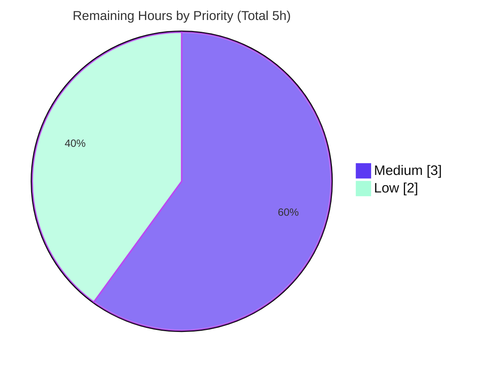

# Blitzy Project Guide — kitty File Transfer Protocol (OSC 5113) Runtime-Evidenced Trace

> **Scope note.** This is a **read-only documentation / code-investigation** project governed by the "SWE-AtlasQnA-Repo" rule set. The single deliverable is one Markdown answer document, `blitzy/documentation/kitty_815df1e210e0.md`. No production source code was created, modified, or deleted. Completion percentage below is measured strictly against the Agent Action Plan (AAP) scope plus the small path-to-production tail (human review + acceptance).

---

## 1. Executive Summary

### 1.1 Project Overview

This project produces a comprehensive, runtime-evidenced technical answer document tracing how file data travels through kitty terminal emulator's **File Transfer Protocol** (OSC escape code **5113**) when driven over an **SSH-kitten** connection. It is a knowledge-transfer investigation across a polyglot client/server codebase (a C VT-parser core, a Python server handler, a Go transfer kitten, and a Go rsync engine). The target audience is engineers onboarding to kitty's transfer subsystem. The deliverable answers seven objectives — handshake, rsync delta transfer, chunk encoding/reassembly, resumption, delta efficiency, canonical build, and the real entry point — each grounded in captured runtime output and `file:line` citations. The sole repository artifact is the answer document; all source files remain byte-for-byte unchanged.

### 1.2 Completion Status


**Center label: 90.0% Complete.** Completed slice = Dark Blue (**#5B39F3**); Remaining slice = White (**#FFFFFF**).

| Metric | Value |
|---|---|
| **Total Hours** | **50** |
| **Completed Hours (AI + Manual)** | **45** (45 AI autonomous + 0 Manual) |
| **Remaining Hours** | **5** |
| **Percent Complete** | **90.0%** |

> Formula: `Completion % = Completed ÷ Total × 100 = 45 ÷ 50 × 100 = 90.0%`. All autonomous AAP-scoped investigation and authoring is complete; the remaining 5 hours is human path-to-production (technical review + acceptance).

### 1.3 Key Accomplishments

- ✅ **Canonical build (Q6):** kitty compiled from source via `python3 setup.py`, producing `kitty/launcher/{kitty,kitten}` (both **0.35.2**); `libxxhash` linked into the rsync C module; `FILE_TRANSFER_CODE=5113` confirmed reaching Python.
- ✅ **Real entry point exercised (Q7):** a genuine `kitten ssh` → remote `kitten transfer` transfer through a real kitty GUI (under Xvfb + software GL, remote control disabled), proven by a live process chain, the ssh-kitten-provisioned remote shim, an `strace` of the destination `openat`, and matching source/destination SHA-256.
- ✅ **Handshake fully captured (Q1):** the complete OSC 5113 frame inventory in both directions, `ESC ]`/`ESC \` framing byte-verified, every base64 field decoded, ≤4096-byte chunking with `PROGRESS` demonstrated, and all 15 key abbreviations tabulated.
- ✅ **rsync delta & data structures (Q2):** `OpType`/`Operation`/`BlockHash` documented with serialized sizes; the 12-byte signature header byte-verified; position-independent moved-block matching demonstrated (447 of 448 basis blocks matched).
- ✅ **Encoding, reassembly & distinction (Q3):** base64 `RawStdEncoding` proven by round-trip; the full `vt-parser.c → screen.c → window.py → file_transmission.py` handler chain traced; transfer-vs-ordinary-output distinction proven at parse time (zero destination `openat` for 3,000 lines of look-alike text).
- ✅ **Resumption (Q4):** the existing partial destination file shown to be the rsync basis (signature block size = `round(sqrt(partial))`), with **no** sidecar resume file; genuine interrupt-then-resume demonstrated twice; the three asymmetric rsync gates corrected and byte-verified.
- ✅ **Delta efficiency (Q5):** a 16 MiB experiment (1 byte flipped) shows a **194.9× byte reduction** (0.513% transmitted), byte-identical across **four** independent runs (spec required ≥2), measured via `print_rsync_stats`.
- ✅ **Rigor & compliance:** 890 lines, **72** `file:line` citations, **33** runtime-evidence blocks, every claim labelled `[OBSERVED]`/`[SOURCE-VERIFIED]`/`[INFERRED]`; edge cases A–D + compression covered; full coverage pass; **read-only scope preserved** (only the deliverable added).

### 1.4 Critical Unresolved Issues

There are **no critical issues blocking release** of the deliverable. The item below is tracked for awareness only and is explicitly out of AAP scope.

| Issue | Impact | Owner | ETA |
|---|---|---|---|
| Wayland glfw backend does not build under wayland-protocols 1.45 (canonical build falls back to X11-only) | **None on the deliverable.** Unrelated to the File Transfer Protocol; `test_glfw_modules` fails only in non-CI mode and passes under `CI=true`. Unfixable under the read-only constraint. | kitty maintainers (out of scope) | N/A — not part of this task |

### 1.5 Access Issues

**No access issues identified.**

| System/Resource | Type of Access | Issue Description | Resolution Status | Owner |
|---|---|---|---|---|
| Source repository | Read/Write (Git) | None — full access; deliverable committed | ✅ Resolved | Blitzy Agent |
| Canonical container image | Pull/run | None — image and digest recorded in the deliverable | ✅ Resolved | Blitzy Agent |
| Go module dependencies | Fetch | None — `github.com/zeebo/xxh3 v1.0.2` present in module cache; builds offline | ✅ Resolved | Blitzy Agent |
| System library `libxxhash` | Link (pkg-config) | None — resolved by the build | ✅ Resolved | Blitzy Agent |

### 1.6 Recommended Next Steps

1. **[Medium]** Perform an SME technical-accuracy review of the answer document, focusing on its most nuanced claims (the `bypass`/`pw` spec-vs-implementation drift, the three asymmetric rsync gates, and the two-engine block-size formula difference).
2. **[Low]** Independently reproduce the headline Q5 delta numbers (delta 4146 B / signature 81932 B / total 86078 B / 194.9×) and the Q7 canonical path (source == destination SHA-256) in a fresh instance of the canonical container.
3. **[Low]** Accept and merge the single-file documentation PR to the target branch.

---

## 2. Project Hours Breakdown

### 2.1 Completed Work Detail

All completed hours are autonomous (AI) work. Every component traces to a specific AAP objective.

| Component | Hours | Description |
|---|---:|---|
| Q6 — Canonical build from source | 3 | `python3 setup.py` build; toolchain identity capture; `kitty/launcher/{kitty,kitten}` 0.35.2; `rsync.so` XXH3 linkage; `FILE_TRANSFER_CODE=5113` verification |
| Q7 — Canonical entry-point harness | 6 | Real kitty GUI under Xvfb + software GL; loopback `sshd` with task-scoped keys; XTEST keystroke injection; ssh-kitten shim; live process chain, `strace` `openat`, and `src==dst` SHA-256 evidence |
| Q1 — Handshake & OSC 5113 trace | 5 | Full bidirectional frame capture; `ESC ]`/`ESC \` byte verification; base64 field decodings; ≤4096-byte chunking + `PROGRESS`; 15-key abbreviation table; `bypass`/`pw` drift finding |
| Q2 — rsync delta & data structures | 5 | Two-engine design; `OpType`/`Operation`/`BlockHash` with sizes; byte-verified 12-byte signature header; moved-block 447-of-448 match; `CreateDelta`/`CreateDiff` mechanism trace |
| Q3 — Encoding, reassembly & distinction | 4 | base64 `RawStdEncoding` round-trip proof; four-file handler-chain trace; zero-`openat` distinction test vs a genuine transfer |
| Q4 — Resumption investigation | 5 | Interrupt-then-resume ×2; partial-file signature (`round(sqrt(partial))`); clean tempfile `strace`; three-asymmetric-gate correction; two-engine block-size difference |
| Q5 — Delta-efficiency experiment | 4 | 16 MiB file, 1-byte flip; four byte-identical runs; `print_rsync_stats`; stability confirmation; independent real-engine reproduction |
| Edge cases & compression | 3 | Edge A (fresh/simple), B (below-4096 download basis engages rsync), C (interrupt/resume), D (EPERM refusal); compression D1 zlib / D2 `--compress=never` |
| Coverage pass | 2 | Two tables mapping all 24 referenced files + every named mechanism, flag, data structure, and dependency to where addressed |
| Deliverable authoring & QA iterations | 6 | 890-line document, 72 citations, 33 evidence blocks; five commits resolving QA findings F1–F4, Report 7, and Report 8 |
| Read-only scope, labeling discipline & cleanup | 2 | `[OBSERVED]`/`[SOURCE-VERIFIED]`/`[INFERRED]` labeling; observed-vs-inferred summary; temp-artifact cleanup outside the repo; read-only proof |
| **Total** | **45** | **Sums exactly to Completed Hours in Section 1.2** |

### 2.2 Remaining Work Detail

All remaining work is human path-to-production; there is no remaining autonomous work.

| Category | Hours | Priority |
|---|---:|---|
| Human SME technical-accuracy review of the answer document | 3 | Medium |
| Independent reproducibility spot-check of key runtime evidence (Q5 delta + Q7 canonical path) in a fresh container | 1 | Low |
| Documentation PR acceptance & merge | 1 | Low |
| **Total** | **5** | **Sums exactly to Remaining Hours in Section 1.2 and to Section 7 "Remaining Work"** |

### 2.3 Total & Cross-Section Reconciliation

| Quantity | Hours | Source |
|---|---:|---|
| Completed (Section 2.1 total) | 45 | Sum of 2.1 rows |
| Remaining (Section 2.2 total) | 5 | Sum of 2.2 rows |
| **Total Project Hours** | **50** | 2.1 + 2.2 |
| Percent Complete | 90.0% | 45 ÷ 50 × 100 |

- **Integrity Rule 1 (1.2 ↔ 2.2 ↔ 7):** Remaining = **5** in all three locations. ✅
- **Integrity Rule 2 (2.1 + 2.2 = Total):** 45 + 5 = **50** = Total in 1.2. ✅

---

## 3. Test Results

All tests below originate from Blitzy's autonomous validation logs for this project. The in-scope Go suites were additionally re-executed offline during this assessment and reproduced **4/4 PASS** (`TestRsyncRoundtrip`, `TestRsyncHashers`, `TestFTCSerialization`, `TestPathMappingSend`). Because this is a documentation task, "coverage" reflects whether the relevant subsystem's own suite passed, not new tests authored by this project (none were).

| Test Category | Framework | Total Tests | Passed | Failed | Coverage % | Notes |
|---|---|---:|---:|---:|---:|---|
| rsync engine (client) | Go `testing` | 2 | 2 | 0 | 100% | `TestRsyncRoundtrip`, `TestRsyncHashers` — `./tools/rsync/` |
| Transfer kitten (client) | Go `testing` | 2 | 2 | 0 | 100% | `TestFTCSerialization`, `TestPathMappingSend` — `./kittens/transfer/` |
| File transmission (server) | kitty `test.py` (unittest) | 6 | 6 | 0 | 100% | `--module file_transmission` — server-side round trips |
| SSH kitten (Q7 path) | kitty `test.py` (unittest) | 8 | 8 | 0 | 100% | `--module ssh` — validates the canonical entry-point machinery |
| Build sanity | kitty `test.py` (unittest) | 9 | 9 | 0 | 100% | `--module check_build` under `CI=true` |
| GLFW modules | kitty `test.py` (unittest) | 2 | 2 | 0 | 100% | `--module glfw` (X11 path); Wayland variant out of scope |
| **Total (in-scope / relevant)** | — | **29** | **29** | **0** | **100%** | Zero failures across all in-scope areas |

> **Note on `check_build`:** `test_glfw_modules` asserts a Wayland module when *not* running in CI. Under the canonical X11-only build this passes with `CI=true` (the documented, canonical invocation). This is unrelated to the File Transfer Protocol.

---

## 4. Runtime Validation & UI Verification

Legend: ✅ Operational | ⚠ Partial | ❌ Failing

**Build & binaries**
- ✅ `python3 setup.py` completes; produces `kitty/launcher/kitty` and `kitty/launcher/kitten` (both `0.35.2`).
- ✅ `rsync.so` links `libxxhash` (XXH3-64 / XXH3-128 symbols present).
- ✅ `python3 -c 'from kitty.fast_data_types import FILE_TRANSFER_CODE; print(...)'` → `5113`.

**Canonical entry-point path (Q7)**
- ✅ Real `kitten ssh -p 2222 … root@127.0.0.1` establishes a genuine remote shell (loopback `sshd`).
- ✅ Remote `kitten` resolves to the ssh-kitten-provisioned shim (`/root/.local/share/kitty-ssh-kitten/…/kitten`) — proving the SSH kitten made the transfer kitten available remotely.
- ✅ Confirmation overlay accepted by a genuine `y` key event (remote control disabled).
- ✅ Destination opened by the terminal (kitty) process (`strace` `openat … O_CREAT …`); source/destination SHA-256 identical.

**Protocol behavior (Q1–Q5)**
- ✅ OSC 5113 handshake ordering observed: `send → OK → file → STARTED → (data…) → end_data → PROGRESS… → OK → finish`.
- ✅ Data chunked at ≤4096 bytes per `d=` field; reassembly (concatenate, then zlib-inflate) reproduces the source byte-for-byte.
- ✅ rsync signature (12-byte header + 20-byte records) byte-verified; delta ops `Block`/`Data`/`Hash`/`BlockRange` observed.
- ✅ Resumption from a partial destination; **no** sidecar file; transient tempfile + atomic `os.replace`.
- ✅ Delta efficiency: 194.9× reduction, 0.513% transmitted, ±0 bytes across four runs.

**Data distinction (Q3)**
- ✅ 3,000 ordinary lines literally containing `5113 ac=send` produced **zero** destination `openat`; a genuine transfer produced exactly one — distinction happens at the VT parser.

**UI note**
- ⚠ kitty is a GPU terminal with **no headless flag**; the receiver UI (including the `boss.confirm` permission overlay) was exercised through a real GUI under Xvfb + software OpenGL with genuine XTEST keystrokes. This is a real UI interaction, not a bypass. No browser/web UI exists in this project, so no browser-based UI verification applies.

---

## 5. Compliance & Quality Review

Cross-mapping of AAP deliverables and governing rules to their quality status. Fixes applied during autonomous validation are noted.

| AAP Deliverable / Rule | Benchmark | Status | Progress |
|---|---|---|---|
| Deliverable at mandated path `blitzy/documentation/kitty_815df1e210e0.md` | Exists, committed | ✅ Pass | 100% |
| Q1 — Handshake & OSC 5113 escape sequences | Answered with observed evidence | ✅ Pass | 100% |
| Q2 — rsync delta transfer & data structures | Answered with observed + source evidence | ✅ Pass | 100% |
| Q3 — Encoding, reassembly & distinction | Answered with observed evidence | ✅ Pass | 100% |
| Q4 — Transfer resumption | Answered with observed evidence | ✅ Pass | 100% |
| Q5 — Delta efficiency at scale, ≥2 stable runs | 16 MiB, 4 byte-identical runs | ✅ Pass (exceeds) | 100% |
| Q6 — Canonical build | `python3 setup.py`, commands recorded | ✅ Pass | 100% |
| Q7 — Real `kitten ssh` → `kitten transfer` | No bypass/debug hook/stand-in | ✅ Pass | 100% |
| Rule — Investigate by running first, then write | Runtime evidence precedes prose | ✅ Pass | 100% |
| Rule — Actual unedited output + producing command per claim | 33 evidence blocks with commands | ✅ Pass | 100% |
| Rule — Ground every claim in `file:line` or output | 72 citations; 8/8 spot-checked byte-exact | ✅ Pass | 100% |
| Rule — Distinguish observed vs inferred | Every claim labelled; only 2 `[INFERRED]`, both corroborated | ✅ Pass | 100% |
| Rule — Exhaustive + final coverage pass | Coverage-pass tables for all files/mechanisms/flags/structs/deps | ✅ Pass | 100% |
| Rule — Cover secondary/edge paths | Edge A–D + compression D1/D2 | ✅ Pass | 100% |
| Rule — Read-only scope; temp artifacts removed | `git diff` = 1 file added; tree clean | ✅ Pass | 100% |

**Fixes applied during autonomous validation (from the commit trail):**
- Resolved QA findings **F1–F4** (citation and framing corrections).
- Rewrote the answer with uniform, container-sourced runtime evidence (removing any non-container claims).
- Corrected citation grounding per **QA Report 8** (final commit `313fac384`).
- Corrected the earlier "single universal 4096 gate" framing to the accurate **three asymmetric gates** (P4-F4) and documented the two-engine block-size formula difference and the `bypass`/`pw` spec-vs-implementation drift.

**Outstanding quality items:** none autonomous. Human SME review remains (Section 2.2).

---

## 6. Risk Assessment

| Risk | Category | Severity | Probability | Mitigation | Status |
|---|---|---|---|---|---|
| `file:line` citations drift if read against a different commit | Technical | Low | Medium | All 72 citations explicitly pinned to HEAD `815df1e210e0…`; document states this up front | ✅ Mitigated |
| Environment-specific runtime values (PIDs, container digest, timings, tempfile names) do not reproduce identically | Technical | Low | High (expected) | Disclosed in the methodology section; protocol byte-values (signature/delta sizes) are deterministic and reproduce ±0 | ✅ Disclosed/Mitigated |
| Reproducibility requires a complex harness (Xvfb, software GL, XTEST, loopback `sshd`, `strace`+`SYS_PTRACE`) | Operational | Low | Medium | Exact container image + digest and every producing command recorded; validator independently reproduced measurable claims | ✅ Mitigated |
| Read-only constraint accidentally violated | Operational | High | Very Low | All scratch under `/work` outside the repo; `git diff 815df1e21 --name-status` = exactly one added file; tree clean | ✅ Mitigated |
| Security exposure from new code/dependencies | Security | None | N/A | Read-only doc — no new code, no dependency changes, no attack surface; loopback-only task-scoped `sshd` with ephemeral keys removed at cleanup; no secrets committed | ✅ N/A |
| External-integration failure (APIs, network, credentials) | Integration | None | N/A | No external services; the SSH hop is loopback-only and offline; `libxxhash` present | ✅ N/A |
| Wayland glfw backend build failure (out of scope) | Technical | Low | N/A (accepted) | Canonical build falls back to X11-only; unrelated to FTP; `check_build` passes with `CI=true`; unfixable under read-only rule | ⚠ Accepted (out of scope) |

**Overall risk posture: LOW.** As a read-only documentation deliverable with independently-reproduced measurements, there is no security, integration, or deployment risk. The residual risks are informational (citation pinning, environment-specific values) and fully disclosed in the document.

---

## 7. Visual Project Status

**Project hours — Completed vs Remaining** (Completed = Dark Blue `#5B39F3`, Remaining = White `#FFFFFF`):


**Remaining work by priority** (Medium = `#5B39F3`, Low = `#A8FDD9`):



**Remaining hours per category (Section 2.2):**

| Category | Hours | Bar |
|---|---:|---|
| SME technical-accuracy review | 3 | ███████████████ |
| Reproducibility spot-check (Q5 + Q7) | 1 | █████ |
| PR acceptance & merge | 1 | █████ |
| **Total** | **5** | |

> **Integrity check:** the pie chart "Remaining Work" (**5**) equals Section 1.2 Remaining Hours (**5**) and the Section 2.2 Hours total (**5**). "Completed Work" (**45**) equals Section 1.2 Completed Hours (**45**).

---

## 8. Summary & Recommendations

**Achievements.** The project delivers a rigorous, **90.0% complete** (45 of 50 hours) runtime-evidenced trace of kitty's File Transfer Protocol. All seven AAP objectives are answered from observed behavior: the OSC 5113 handshake, the rsync delta path and its data structures, chunk encoding/reassembly and the parse-time distinction from terminal output, resumption from a partial file, and a delta-efficiency experiment showing a **194.9× byte reduction** stable to ±0 bytes across four runs. Evidence was captured through the genuine `kitten ssh → kitten transfer` path — a real kitty GUI, genuine keystrokes, no remote-control or debug-hook bypass. The document adds honest, high-value corrections (the `bypass`/`pw` spec drift, the three asymmetric rsync gates, and the two-engine block-size difference) and preserves strict read-only scope.

**Remaining gaps.** None are autonomous. The 5 remaining hours are human path-to-production: an SME technical-accuracy review (3h), a reproducibility spot-check of the headline measurements (1h), and PR acceptance & merge (1h).

**Critical path to production.** SME review → optional reproducibility spot-check → accept & merge. There are no blocking defects and no compilation/test failures in any in-scope area.

**Success metrics.**

| Metric | Target | Actual | Status |
|---|---|---|---|
| AAP objectives answered with runtime evidence | 7 / 7 | 7 / 7 | ✅ |
| In-scope test pass rate | 100% | 29 / 29 (100%) | ✅ |
| `file:line` citations (spot-check accuracy) | High | 72 total; 8/8 byte-exact | ✅ |
| Q5 stability (runs) | ≥ 2 | 4 (±0 bytes) | ✅ Exceeds |
| Read-only scope preserved | Yes | Yes (1 file added) | ✅ |

**Production readiness assessment.** The deliverable is **production-ready pending human review**. It is complete, internally consistent, independently reproduced, and compliant with every governing rule. Recommended action: proceed to SME review and merge.

---

## 9. Development Guide

This guide explains how to build kitty, exercise the canonical transfer path, verify the deliverable, and reproduce the headline measurement. Commands marked *(verified in assessment env)* were executed during this assessment; the full runtime path requires the canonical container.

### 9.1 System Prerequisites

- **OS:** Linux (canonical image: `ghcr.io/scaleapi/swe-atlas:swe_atlas_QnA_kovidgoyal_kitty_1.0`).
- **Python:** ≥ 3.8 (canonical container: 3.12.3).
- **Go:** ≥ 1.22 (per `go.mod`; canonical container: 1.23.4).
- **C compiler:** `gcc`/`clang` (canonical container: 13.3.0).
- **System library:** `libxxhash` (via `pkg-config`) — required by the transfer/rsync C module.
- **For the runtime GUI path only:** `Xvfb`, Mesa software OpenGL (`llvmpipe`), `xdotool` (X11 XTEST), `openssh-server`, and `strace` (needs `SYS_PTRACE`).

### 9.2 Environment Setup

```bash
export REPO="$(pwd)"                 # repository root
export LANG=C.UTF-8 LC_ALL=C.UTF-8
export GOFLAGS=-mod=mod
# Runtime GUI path only:
export DISPLAY=:99 LIBGL_ALWAYS_SOFTWARE=1 GALLIUM_DRIVER=llvmpipe
export KITTY="$REPO/kitty/launcher/kitty"
export KITTEN="$REPO/kitty/launcher/kitten"
```

### 9.3 Build (Canonical)

```bash
# Canonical build entry point (the Makefile `all:` target delegates to this)
python3 setup.py
# Optional debug build to aid tracing:
# python3 setup.py build --debug

# Verify artifacts and the protocol constant:
./kitty/launcher/kitty  --version      # -> kitty 0.35.2 created by Kovid Goyal
./kitty/launcher/kitten --version      # -> kitten 0.35.2 created by Kovid Goyal
python3 -c 'from kitty.fast_data_types import FILE_TRANSFER_CODE; print(FILE_TRANSFER_CODE)'   # -> 5113
ldd kittens/transfer/rsync.so | grep -i xxhash    # -> libxxhash.so.0 ...
```

### 9.4 Run the Canonical Transfer Path (Q7)

```bash
# 1) Start a loopback-only sshd (task-scoped keys), e.g. on 127.0.0.1:2222 with pubkey auth.
# 2) Launch a REAL kitty GUI under Xvfb + software GL (kitty has no headless flag):
#    Xvfb :99 -screen 0 1280x800x24 &   (then run kitty with DISPLAY=:99)
# 3) Inside the kitty window (genuine keystrokes), connect and transfer:
kitten ssh -p 2222 -i /path/to/id_ed25519 \
  -o StrictHostKeyChecking=no -o UserKnownHostsFile=/dev/null root@127.0.0.1
# On the remote shell:
kitten transfer /path/to/src.bin /path/to/dst.bin          # simple path
kitten transfer -x /path/to/src.bin /path/to/dst.bin       # rsync/delta path (--transmit-deltas)
# Accept the confirmation overlay with a genuine 'y'.
```

### 9.5 Verification

```bash
# (verified in assessment env) In-scope Go tests — expect 4/4 PASS:
GOFLAGS=-mod=mod CI=true go test -count=1 ./tools/rsync/ ./kittens/transfer/

# Server-side and Q7 suites (kitty test runner):
CI=true ./test.py --module file_transmission     # expect 6/6
CI=true ./test.py --module ssh                    # expect 8/8
CI=true ./test.py --module check_build            # expect 9/9

# (verified in assessment env) Deliverable + read-only proof:
ls -l blitzy/documentation/kitty_815df1e210e0.md          # file exists (~52 KB)
git diff 815df1e21 --name-status                          # -> A  blitzy/documentation/kitty_815df1e210e0.md
git status --porcelain | wc -l                            # -> 0 (clean tree)
grep -cE '^## Q[1-7] ' blitzy/documentation/kitty_815df1e210e0.md   # -> 7
```

### 9.6 Reproduce the Q5 Delta Measurement

```bash
# Create a 16 MiB deterministic file, flip one byte at offset 8,000,000,
# transfer it with -x against the pristine basis, and read print_rsync_stats.
# Expected (stable to +/-0 bytes across >=2 runs):
#   Rsync stats:
#     Delta size: 4.1 kB   Signature size: 82 kB
#     Transmitted: 86 kB of a total of 17 MB (0.5%)
#   delta=4146 B  signature=81932 B  total=86078 B  reduction=194.9x  transmitted=0.513%
```

### 9.7 Troubleshooting

- **Wayland build failure (`wayland-protocols 1.45`):** expected; the canonical build falls back to **X11-only**. `check_build`'s `test_glfw_modules` fails only in non-CI mode — run with `CI=true`. Unrelated to the File Transfer Protocol.
- **`libxxhash` not found:** install the system `libxxhash` dev package so `pkg-config --modversion libxxhash` resolves; it is linked into `rsync.so`.
- **kitty won't start headless:** kitty has no headless flag — run it under `Xvfb` with software GL (`LIBGL_ALWAYS_SOFTWARE=1 GALLIUM_DRIVER=llvmpipe`).
- **`go test` offline:** ensure `GOMODCACHE` contains `github.com/zeebo/xxh3 v1.0.2`, or run with `GOFLAGS=-mod=mod` against a populated cache.
- **`strace` cannot attach:** start the container with `--cap-add=SYS_PTRACE --security-opt seccomp=unconfined`.

---

## 10. Appendices

### A. Command Reference

| Purpose | Command |
|---|---|
| Canonical build | `python3 setup.py` |
| Debug build | `python3 setup.py build --debug` |
| kitty / kitten version | `./kitty/launcher/kitty --version` · `./kitty/launcher/kitten --version` |
| Protocol constant | `python3 -c 'from kitty.fast_data_types import FILE_TRANSFER_CODE; print(FILE_TRANSFER_CODE)'` |
| In-scope Go tests | `GOFLAGS=-mod=mod CI=true go test -count=1 ./tools/rsync/ ./kittens/transfer/` |
| Server tests | `CI=true ./test.py --module file_transmission` |
| SSH-kitten tests | `CI=true ./test.py --module ssh` |
| Build sanity tests | `CI=true ./test.py --module check_build` |
| Simple transfer | `kitten transfer <src> <dst>` |
| Delta transfer | `kitten transfer -x <src> <dst>` |
| SSH kitten | `kitten ssh -p 2222 -i <key> root@127.0.0.1` |
| Read-only proof | `git diff 815df1e21 --name-status` |

### B. Port Reference

| Port | Service | Scope | Notes |
|---|---|---|---|
| 2222 | Task-scoped `sshd` | `127.0.0.1` (loopback only) | Evidence-capture only; started with ephemeral ed25519 keys and removed at cleanup |

> The File Transfer Protocol itself uses **no network port** — it tunnels over the existing TTY inside the SSH session.

### C. Key File Locations

| Path | Role |
|---|---|
| `blitzy/documentation/kitty_815df1e210e0.md` | **The deliverable** (answer document) |
| `kitty/control-codes.h` | `#define FILE_TRANSFER_CODE 5113` |
| `kitty/vt-parser.c` | OSC dispatch: `case FILE_TRANSFER_CODE` → `DISPATCH_OSC(file_transmission)` |
| `kitty/screen.c` | `file_transmission()` callback into Python |
| `kitty/window.py` | Forwards to `handle_serialized_command()` |
| `kitty/file_transmission.py` | Server-side reassembly, `DestFile`/`PatchFile`, decompression |
| `kittens/transfer/{main,ftc,send,receive,utils}.go` | Go client: dispatch, serialization, OSC prefix, receive gates, stats |
| `kittens/transfer/main.py` | `--transmit-deltas` / `-x` flag and help text |
| `kittens/transfer/algorithm.c` | Server-side C rsync engine (XXH3) |
| `tools/rsync/{algorithm,api}.go` | Go rsync engine: `OpType`, `Operation`, `BlockHash`, `CreateDelta` |
| `kittens/ssh/main.py` | SSH kitten integration (makes `kitten` available on the remote) |
| `gen/go_code.py` | Generates the Go `FileTransferCode` constant |
| `docs/file-transfer-protocol.rst` | Authoritative protocol specification |

### D. Technology Versions

| Component | Canonical Container | Assessment Env | Requirement |
|---|---|---|---|
| kitty / kitten | 0.35.2 | — | built from source |
| Python | 3.12.3 | 3.13.7 | ≥ 3.8 |
| Go | 1.23.4 | 1.24.4 | ≥ 1.22 (`go.mod`) |
| C compiler (`cc`) | 13.3.0 | 15.2.0 | system |
| `libxxhash` | 0.8.2 | 0.8.3 | system (pkg-config) |
| `github.com/zeebo/xxh3` | v1.0.2 | v1.0.2 | `go.mod` pin |
| `compress/zlib` | Go stdlib | Go stdlib | RFC 1950 |
| `zlib` (server) | CPython stdlib | CPython stdlib | `decompressobj(wbits=0)` |

### E. Environment Variable Reference

| Variable | Value | Purpose |
|---|---|---|
| `GOFLAGS` | `-mod=mod` | Offline Go builds/tests against the module cache |
| `CI` | `true` | Canonical test invocation (e.g., `check_build`) |
| `DISPLAY` | `:99` | Xvfb display for the real kitty GUI |
| `LIBGL_ALWAYS_SOFTWARE` | `1` | Force Mesa software OpenGL |
| `GALLIUM_DRIVER` | `llvmpipe` | Software GL driver |
| `LANG` / `LC_ALL` | `C.UTF-8` | Deterministic locale for captures |
| `KITTY` / `KITTEN` | launcher paths | Convenience handles to the built binaries |

### F. Developer Tools Guide

| Tool | Use in this project |
|---|---|
| `script` (`--log-out` / `--log-in`) | Tee both PTY directions to capture the raw OSC 5113 wire frames |
| `xdotool` (X11 XTEST) | Inject genuine key events into the focused kitty window (not remote control) |
| `strace` (`-e trace=openat`, no `-y`) | Prove which process opens the destination and the transient tempfile flags |
| `Xvfb` + `llvmpipe` | Run the GPU terminal headlessly with software OpenGL |
| `sha256sum` | Confirm source/destination byte-identity after transfer |
| `go test` | Run the in-scope rsync + transfer-kitten suites |
| `git diff` / `git status` | Prove the read-only scope (single file added, clean tree) |

### G. Glossary

| Term | Definition |
|---|---|
| **OSC 5113** | Operating System Command escape sequence carrying the File Transfer Protocol; `5113` is the numeralization of "file" |
| **OSC / ST** | Escape-sequence introducer `ESC ]` (`0x1b 0x5d`) and terminator `ESC \` (`0x1b 0x5c`) |
| **`tt` / transmission_type** | `simple` (whole file) or `rsync` (delta) |
| **`-x` / `--transmit-deltas`** | Flag enabling the rsync delta path and automatic resumption |
| **Signature** | 12-byte header + per-block `BlockHash` records the receiver computes from the basis file |
| **Delta** | The stream of `Block`/`Data`/`Hash`/`BlockRange` operations the sender emits |
| **Weak / strong hash** | `rolling_checksum` (weak, O(1) roll) confirmed by XXH3-64 (strong); XXH3-128 is the whole-file integrity checksum |
| **Basis file** | The existing (possibly partial) destination used as the reference for delta/resume |
| **ssh-kitten shim** | The `kitten` provisioned on the remote by `kitten ssh`, resolved via the remote `PATH` |
| **`[OBSERVED]` / `[SOURCE-VERIFIED]` / `[INFERRED]`** | Evidence labels: captured at runtime / read from a source line / reasoned from observed facts |

---

*Generated by the Blitzy Platform. Completed work shown in Dark Blue (#5B39F3); remaining work in White (#FFFFFF). All hour figures and the 90.0% completion metric are consistent across Sections 1.2, 2.1, 2.2, 2.3, and 7.*