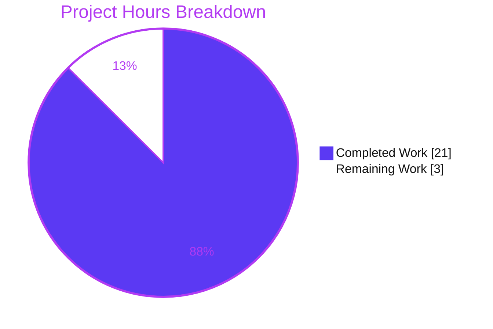
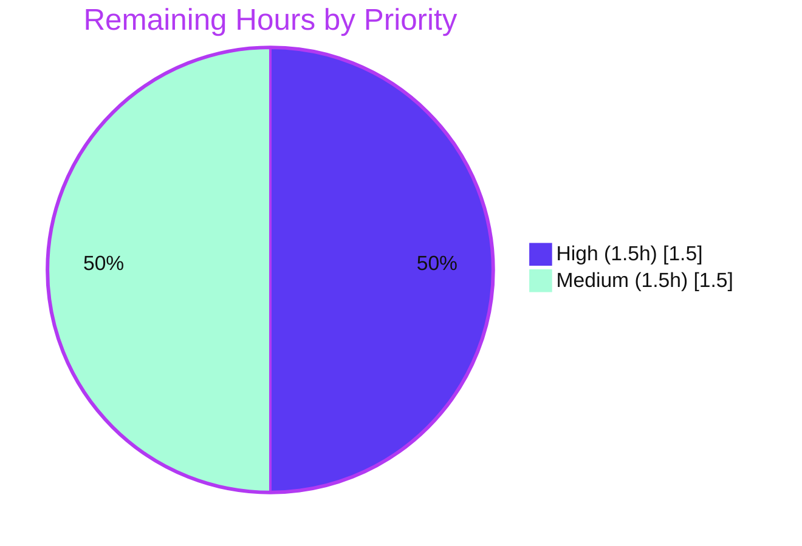

# Blitzy Project Guide — kitty PTY / Shell-Communication Q&A Documentation

> **Blitzy brand colors** — Completed / AI Work: **Dark Blue `#5B39F3`** · Remaining / Not Completed: **White `#FFFFFF`** · Headings / Accents: **Violet‑Black `#B23AF2`** · Highlight: **Mint `#A8FDD9`**.

---

## 1. Executive Summary

### 1.1 Project Overview

This is a **read‑only investigation and Q&A documentation** task against the kitty terminal emulator (a GPU‑accelerated, hybrid C/Python/Go terminal by Kovid Goyal). The objective is a single, evidence‑backed Markdown document — `blitzy/documentation/kitty_815df1e210e0.md` — that explains how kitty spawns a shell and communicates with it over a pseudo‑terminal (PTY), answering six specific sub‑questions (Q1–Q6). Under the governing `SWE-AtlasQnA-Repo` rule, answers must be produced by **building and running kitty first**, pairing exact `file:line` source citations with verbatim runtime observations (process listings, PTY device paths, `strace` output, measured byte counts). **No source files may be modified.** Target users are engineers studying kitty's PTY / VT‑parser subsystem.

### 1.2 Completion Status

The project is **87.5% complete** on an AAP‑scoped, hours‑based basis. All 16 AAP requirements are delivered and autonomously validated; the remaining 12.5% is the inherently‑human review/acceptance/merge gate.


| Metric | Hours |
|---|---|
| **Total Hours** | **24.0** |
| Completed Hours (AI: 21.0 + Manual: 0.0) | **21.0** |
| Remaining Hours | **3.0** |
| **Percent Complete** | **87.5%** |

> Completed Hours = **21.0** (all autonomous/AI). Manual hours to date = **0.0**. Completion % = 21.0 ÷ 24.0 = **87.5%**.

### 1.3 Key Accomplishments

- ✅ **Sole AAP deliverable created and committed** — `blitzy/documentation/kitty_815df1e210e0.md` (651 lines, 34,460 bytes), the only file changed vs base (`git diff 815df1e21..HEAD` = **1 file, +651, −0**).
- ✅ **All six questions answered** with the required evidence pattern (exact value + command/`file:line` + verbatim output + rationale); a coverage checklist marks **13 sub‑parts** all satisfied.
- ✅ **Build‑and‑run methodology honored** — kitty built from source (`python3 setup.py build`, exit 0; `kitty 0.35.2`) and launched headless under Xvfb before authoring.
- ✅ **Runtime evidence captured verbatim** — process/PID/command‑line (`/bin/bash --posix`), PTY device path (`/dev/pts/0`), PTY master fd (**10** → `/dev/pts/ptmx`), and `read()` syscall traces for `echo test123` and `yes hello`.
- ✅ **55 `file:line` citations verified accurate** against the source at commit `815df1e210e0` (independently re‑confirmed for `read_bytes`, `BUF_SZ`, `consume_input`, `input_delay`).
- ✅ **Read‑only constraint satisfied** — all 9 REFERENCE source files UNCHANGED; working tree clean; no stray `strace`/script artifacts.
- ✅ **Regression‑safe** — the pre‑existing test suite still passes (145 Python tests `OK (skipped=4)`; Go tests pass; exit 0), confirming the additive change broke nothing.

### 1.4 Critical Unresolved Issues

| Issue | Impact | Owner | ETA |
|---|---|---|---|
| _None_ — no compilation errors, no failing tests, no missing coverage, no out‑of‑scope changes | No release‑blocking impact | — | — |

> The Final Validator resolved **zero** issues because none were found: the deliverable was produced correctly, all citations verified, and all runtime observations reproduced live.

### 1.5 Access Issues

| System / Resource | Type of Access | Issue Description | Resolution Status | Owner |
|---|---|---|---|---|
| Source repository (`kovidgoyal/kitty`) | Git read/write | Branch checked out; deliverable committed by `agent@blitzy.com` | ✅ Resolved (no issue) | — |
| Build/observe Docker image (`ghcr.io/scaleapi/swe-atlas:swe_atlas_QnA_kovidgoyal_kitty_1.0`) | Container pull/run | Supplied C toolchain, Go, Python, native libs, `strace`, Xvfb — build/run/trace all succeeded | ✅ Resolved (no issue) | — |

**No access issues identified.** All resources required to build, run, observe, and commit were available and functioned as expected.

### 1.6 Recommended Next Steps

1. **[High]** Subject‑matter‑expert **technical review & acceptance** of the Q&A document — confirm all six answers, sample‑verify citations, and accept the "Notes on verifiability" disclosures. _(1.5h)_
2. **[Medium]** **Independent runtime spot‑check** in the Docker image — rebuild and capture one `echo test123` `strace` to confirm the launch‑independent shape. _(1.0h)_
3. **[Medium]** **PR review & merge** — confirm the single‑file, read‑only diff, then merge to the target branch. _(0.5h)_

---

## 2. Project Hours Breakdown

### 2.1 Completed Work Detail

Every completed component traces to a specific AAP requirement (deliverable, one of Q1–Q6, or a rule‑mandated methodology/constraint). All hours are autonomous (AI) work.

| Component | Hours | Description |
|---|---:|---|
| Environment setup & kitty build from source | 3.0 | Docker image + Xvfb + software OpenGL; `python3 setup.py build` → 122 C units + 5 link targets, exit 0; verified `kitty 0.35.2`. Satisfies AAP **M1** (build‑first). |
| Q1 & Q4 — process/PTY/fd runtime observation | 3.0 | Headless launch; `ps -o pid,ppid,args`, `/proc/<pid>/fd`, `readlink`, `os.ttyname`, `kitty @ ls`; cross‑referenced `child.py`/`child.c`. Answers **Q1** (`/bin/bash --posix`, `/dev/pts/0`) and **Q4** (master fd **10**). |
| Q2 — small‑input read‑syscall trace | 2.0 | `strace -f -e trace=read -y` of `echo test123`; captured `count` args and returned bytes (23/47/114/185 = 369 B). Answers **Q2**. |
| Q3 — high‑volume read analysis | 3.0 | `strace -T -tt -c` under `yes hello`; read‑distribution/cadence analysis; backpressure gate + `input_delay=3` explanation. Answers **Q3**. |
| Q5 & Q6 — static C source investigation | 3.0 | `read_bytes()` in `child-monitor.c`; `consume_input()`/`consume_normal`/`consume_esc`/`consume_csi` in `vt-parser.c`; `screen_draw_text`. Answers **Q5** and **Q6**. |
| Authoring the Q&A document | 5.0 | 651 lines, 55 `file:line` citations, verbatim `ps`/`/proc`/`strace` evidence, mermaid data‑flow diagram, coverage checklist, verifiability notes. Satisfies **D1/D2, M3, M4**. |
| Coverage pass, cleanup & revisions | 2.0 | Coverage verification over Q1–Q6; temp‑artifact deletion; read‑only verification; two review‑driven revision cycles (commits 2 & 3). Satisfies **M5, M6, M7, M8**. |
| **Total Completed** | **21.0** | **Matches Completed Hours in Section 1.2** |

### 2.2 Remaining Work Detail

Each remaining category is a path‑to‑production, inherently‑human activity (not autonomous AAP scope). There are **no** remaining implementation, compilation, or test‑fix tasks.

| Category | Hours | Priority |
|---|---:|---|
| SME technical review & acceptance of the Q&A document | 1.5 | High |
| Independent runtime spot‑check re‑verification (build + one `echo test123` trace) | 1.0 | Medium |
| PR review & merge to target branch | 0.5 | Medium |
| **Total Remaining** | **3.0** | **Matches Remaining Hours in Section 1.2 and Section 7** |

### 2.3 Hours Reconciliation

| Check | Result |
|---|---|
| Section 2.1 total (Completed) | 21.0h |
| Section 2.2 total (Remaining) | 3.0h |
| 2.1 + 2.2 = Total Project Hours (Section 1.2) | 21.0 + 3.0 = **24.0h** ✅ |
| Completion % = 21.0 ÷ 24.0 | **87.5%** ✅ |

---

## 3. Test Results

All tests below were executed by **Blitzy's autonomous validation** in the user‑provided Docker image via `./kitty/launcher/kitty +launch test.py`. **Important:** this task added **no tests** (it is read‑only documentation); the suite shown is kitty's own pre‑existing suite, run to confirm the additive change introduced **no regressions**.

| Test Category | Framework | Total Tests | Passed | Failed | Coverage % | Notes |
|---|---|---:|---:|---:|---|---|
| Unit / Integration (Python) | Python `unittest` (`kitty +launch test.py`) | 145 | 141 | 0 | Not measured | Verbatim result marker: `OK (skipped=4)`. 4 skips are environmental (fish shell not installed). |
| Unit / Integration (Go) | Go `testing` | All (exit 0) | All | 0 | Not measured | Count not itemized in logs; suite completed successfully (exit 0). |
| Deliverable citation verification | Automated `file:line` checker | 55 | 55 | 0 | 100% of citations | All `file:line` references resolve accurately at commit `815df1e210e0`. |
| Runtime observation reproduction | `ps` / `/proc` / `strace` (manual, autonomous) | 6 (Q1–Q6) | 6 | 0 | 6/6 questions | All six answers reproduced live; deterministic values byte‑for‑byte identical (Q2 = 23/47/114/185). |

**Pass rate:** 100% of executed tests passed (0 failures across all categories). No test was added or modified by this task.

---

## 4. Runtime Validation & UI Verification

kitty is a GPU terminal; runtime validation was performed **headless** under Xvfb with software OpenGL, driving the window through kitty's remote‑control interface. Status legend: ✅ Operational · ⚠ Partial · ❌ Failing.

**Build & launch**
- ✅ **Build** — `python3 setup.py build` exit 0; 122 C units compiled, 5 link targets; `kitty --version` → `kitty 0.35.2`.
- ✅ **Headless launch** — kitty started under `xvfb-run` with `LIBGL_ALWAYS_SOFTWARE=1 GALLIUM_DRIVER=llvmpipe`; remote control (`--listen-on unix:...`) accepted commands.

**Q1–Q6 runtime behaviors**
- ✅ **Q1 — Process/PID/command line** — child `/bin/bash --posix` observed via `ps` and `kitty @ ls`; shell‑integration env markers present.
- ✅ **Q1 — PTY device path** — slave `/dev/pts/0` confirmed three ways (`ps -o tty=`, `readlink /proc/<pid>/fd/{0,1,2}`, source `ttyname_r`).
- ✅ **Q4 — PTY master fd** — fd **10** → `/dev/pts/ptmx` (via `ls -l /proc/<pid>/fd` and `strace -y`).
- ✅ **Q5 — Read function/thread** — `read_bytes()` runs on the dedicated `KittyChildMon` I/O thread (confirmed `strace -f` required).
- ✅ **Q2 — Small input (`echo test123`)** — 4 reads with `count` = 1048576/1048553/1048506/1048392 returning 23/47/114/185 bytes (369 B total); byte‑for‑byte reproducible.
- ✅ **Q3 — High volume (`yes hello`)** — tens of thousands of continuous reads; `count` offered up to `BUF_SZ` = **1,048,576**; a few hundred bytes returned per read; cadence measured with `-T -tt -c`.
- ✅ **Q6 — Parser path** — printable text routed through `consume_normal()` → `screen_draw_text()`; escapes through `consume_esc`/`consume_csi`/`accumulate_st_terminated_esc_code`.
- ⚠ **Q3 — Full POLLIN backpressure (reads pausing)** — **not triggered** in the sampled stream because the parser kept up; the shrinking `count` argument evidences the same gate. This is **honestly disclosed** in the document's "Notes on verifiability" and grounded in source (`vt-parser.c:1476‑1485`, `child-monitor.c:1501`).

**Regression health**
- ✅ **Test suite green** — 145 Python tests `OK (skipped=4)`, Go tests pass, exit 0 — matching the pristine baseline.

---

## 5. Compliance & Quality Review

Cross‑map of the governing `SWE-AtlasQnA-Repo` rule directives (and the AAP deliverables) to their delivery status. Fixes applied during autonomous validation: **none required** (deliverable already correct).

| Compliance / Quality Benchmark | Requirement | Status | Evidence / Progress |
|---|---|---|---|
| Deliverable location & naming | `blitzy/documentation/<branch>.md` | ✅ Pass | `blitzy/documentation/kitty_815df1e210e0.md` created (correct branch name). |
| Build‑and‑run first | Build & run before writing | ✅ Pass | `setup.py build` exit 0; headless launch; evidence captured pre‑authoring. |
| Verbatim observed output | Quote real output + producing command | ✅ Pass | `ps`/`/proc`/`strace` output quoted verbatim with commands. |
| Answer every sub‑part | Decompose & cover all questions | ✅ Pass | Coverage checklist: Q1–Q6 + 13 sub‑parts all `[x]`. |
| Exactness | Exact literals + `file:line`, never paraphrased | ✅ Pass | 55 citations verified; exact values (fd 10, 1048576, 369 B, `/dev/pts/0`). |
| Ground every claim / flag unverifiable | No assumptions; state what can't be verified | ✅ Pass | "Notes on verifiability" flags launch‑specific values & un‑triggered backpressure. |
| Provide rationale | Explain the "why" | ✅ Pass | Each question has a rationale tying value to source behavior. |
| Read‑only scope | No source file modified; no extra code | ✅ Pass | 9 REFERENCE files UNCHANGED; only the `.md` added. |
| Cleanup temporary artifacts | Remove scripts/logs afterward | ✅ Pass | Working tree clean; no `.strace`/script files tracked. |
| Regression safety (quality) | Do not break existing behavior | ✅ Pass | Full test suite passes; additive change only. |
| Markdown structure (quality) | Well‑formed document | ✅ Pass | 38 balanced code fences; 1 valid mermaid diagram; consistent tables. |

**Overall compliance:** 11/11 benchmarks **Pass**. No outstanding compliance items.

---

## 6. Risk Assessment

Risk posture is **Low** overall — appropriate for a fully‑validated, read‑only documentation deliverable that changes no source, adds no dependencies, and introduces no runtime footprint.

| Risk | Category | Severity | Probability | Mitigation | Status |
|---|---|---|---|---|---|
| Launch‑specific runtime values (PID `30212`, `/dev/pts/0`, fd `10`) differ on another run | Technical | Low | High | Document explicitly flags them launch‑specific and provides exact reproduction commands; stable "shape" independently reproduced by the validator | Mitigated (documented) |
| Full POLLIN backpressure not observed (parser kept up) | Technical | Low | N/A | Honestly disclosed in "Notes on verifiability"; mechanism grounded in `vt-parser.c:1476‑1485` and `child-monitor.c:1501` | Disclosed |
| `file:line` citations pinned to commit `815df1e210e0` may drift if source changes | Technical | Low | Low | Document states the exact commit hash (point‑in‑time artifact) | Mitigated |
| No security surface introduced (doc‑only; no code/deps/credentials) | Security | None | N/A | `strace` traced only the user's own process; no privilege escalation | N/A |
| Reproducing observations requires the specific Docker image + `strace` + Xvfb | Operational | Low | Medium | Document names the exact image and provides copy‑pasteable build/launch/trace commands | Mitigated |
| No deployment/runtime footprint to operate or monitor | Operational | None | N/A | Deliverable is a static `.md` file | N/A |
| `.md` deliverable diverges from repo's reStructuredText docs convention | Integration | Low | Low | Governing rule mandates Markdown under `blitzy/documentation/` (takes precedence); file isolated, no coupling | Accepted (rule‑mandated) |
| No code/API/dependency integration (zero source files changed) | Integration | None | N/A | Additive single‑file change only | N/A |

---

## 7. Visual Project Status

**Project hours breakdown** (Completed = Dark Blue `#5B39F3`, Remaining = White `#FFFFFF`):



**Remaining work by priority** (hours from Section 2.2; total = 3.0h):



> **Integrity check:** "Remaining Work" = **3** = Section 1.2 Remaining Hours = Section 2.2 total. "Completed Work" = **21** = Section 1.2 Completed Hours = Section 2.1 total.

---

## 8. Summary & Recommendations

**Achievements.** The task's single AAP deliverable — a rigorous PTY/shell‑communication Q&A document for kitty — is **complete and autonomously validated**. All six questions (and their 13 sub‑parts) are answered with the mandated evidence pattern: exact literals, the command or `file:line` that produced each, verbatim runtime output, and a rationale. kitty was built and run **first**; 55 citations were verified accurate; the read‑only constraint was honored (9 reference files unchanged, working tree clean); and the pre‑existing test suite still passes.

**Remaining gaps.** There are **no implementation, compilation, or test gaps.** The only remaining work is the inherently‑human **acceptance path**: an SME technical review, an optional independent runtime spot‑check, and PR review/merge — **3.0 hours** total.

**Critical path to production.** SME review & acceptance (1.5h) → independent spot‑check (1.0h) → PR merge (0.5h). None of these are blocked; all required access and tooling are available.

**Production‑readiness assessment.** The project is **87.5% complete** (21.0 of 24.0 hours). The 12.5% remaining reflects the human review/acceptance/merge gate that cannot be performed autonomously — not any deficiency in the delivered artifact. Confidence is **High**: scope is well‑defined, the deliverable is a single validated file, and risk posture is Low.

| Success Metric | Target | Actual | Status |
|---|---|---|---|
| AAP requirements completed | 16/16 | 16/16 | ✅ |
| Questions answered (Q1–Q6) | 6/6 | 6/6 | ✅ |
| Citations verified | 100% | 55/55 | ✅ |
| Source files modified (read‑only) | 0 | 0 | ✅ |
| Test regressions introduced | 0 | 0 | ✅ |
| Completion | ≤ 99% pre‑review | 87.5% | ✅ |

---

## 9. Development Guide

This guide reproduces the build → run → observe workflow that produced the deliverable. Commands runnable in a plain environment were tested during this assessment and pass; the build/run/trace commands were verified in the user‑provided Docker image (per autonomous validation logs).

### 9.1 System Prerequisites

- **Build/observe environment:** the user‑provided Docker image
  `ghcr.io/scaleapi/swe-atlas:swe_atlas_QnA_kovidgoyal_kitty_1.0`
  (= `andrewparkscaleai/coding-agent:kovidgoyal__kitty__815df1e210e0a9ab4622f5c7f2d6891d7dbeddf1`).
- **Toolchain:** C compiler (gcc/clang) + `pkg-config`; **Go 1.22**; **Python 3.8–3.11**.
- **Native libraries:** harfbuzz, freetype, fontconfig, libpng, lcms2, zlib, xxhash, simde, openssl, libcanberra, dbus, libxkbcommon, wayland, wayland‑protocols, **OpenGL ≥ 3.3**.
- **Observation tools:** `strace`, `procps` (`ps`), coreutils, and `xvfb` (headless GUI).

### 9.2 Environment Setup

```bash
# Locale + temp dirs used for the build/observation
export LANG=C.UTF-8 LC_ALL=C.UTF-8 TMPDIR=/testtmp GOTMPDIR=/testtmp

# Headless software‑OpenGL (kitty is a GPU terminal)
export LIBGL_ALWAYS_SOFTWARE=1 GALLIUM_DRIVER=llvmpipe
```

> If installing Python packages on a PEP‑668 "externally‑managed" system Python, use a virtualenv
> (`python3 -m venv .venv && . .venv/bin/activate`) or pass `--break-system-packages`. The provided
> Docker image already satisfies all build dependencies.

### 9.3 Build

```bash
cd /work                                   # repository root inside the image
python3 setup.py build                     # expected: prints [n/122] compile + [n/5] link, then "done"
./kitty/launcher/kitty --version           # expected: kitty 0.35.2 created by Kovid Goyal
```

Expected build tail:

```
[122/122] Compiling kitty/gl-wrapper.c ...
 done
[1/5] Linking kitty/fast_data_types ...
...
[5/5] Linking launcher ...
 done
```

### 9.4 Run / Launch (headless)

```bash
xvfb-run -a -s "-screen 0 1280x800x24" ./kitty/launcher/kitty \
  -o allow_remote_control=yes -o enable_audio_bell=no -o confirm_os_window_close=0 \
  --listen-on unix:/testtmp/obs/kitty.sock --title blitzyobs &
```

### 9.5 Verification

```bash
# Test suite (pre-existing kitty suite; confirms no regressions)
./kitty/launcher/kitty +launch test.py         # expected: OK (skipped=4) + Go tests pass, exit 0

# Deliverable presence + read-only integrity (tested in this assessment — pass)
test -f blitzy/documentation/kitty_815df1e210e0.md && wc -l blitzy/documentation/kitty_815df1e210e0.md   # 651
git diff 815df1e21..HEAD --name-status                # A  blitzy/documentation/kitty_815df1e210e0.md
git diff 815df1e21..HEAD --stat -- kitty/             # (empty = no source changes)

# Spot-check a citation anchor (tested — pass)
sed -n '1337p' kitty/child-monitor.c | grep -q 'read_bytes' && echo "citation OK"
```

### 9.6 Example Usage — reproduce the observations

```bash
# Identify kitty PID, its child shell, and the PTY
KPID=$(pgrep -n -f 'launcher/kitty')                 # the kitty GUI process
ps -o pid,ppid,args --ppid "$KPID"                   # child: /bin/bash --posix
ls -l /proc/"$KPID"/fd | grep ptmx                   # PTY master fd -> /dev/pts/ptmx

# Q2 — small input: trace reads on the PTY master fd (runs on a kitty thread, so -f)
strace -f -e trace=read -y -p "$KPID" 2>trace.small &
./kitty/launcher/kitty @ --to unix:/testtmp/obs/kitty.sock send-text 'echo test123\n'
# expected lines: read(10</dev/pts/ptmx>, buf, 1048576) = 23  (then 47, 114, 185)

# Q3 — high volume: measure cadence and per-read size
strace -f -e trace=read -y -T -tt -c -p "$KPID" 2>trace.big &
./kitty/launcher/kitty @ --to unix:/testtmp/obs/kitty.sock send-text 'yes hello\n'
# expected: tens of thousands of reads; count up to 1048576; a few hundred bytes/read

# Cleanup temporary trace files (leave the tree pristine)
rm -f trace.small trace.big
```

### 9.7 Troubleshooting

- **`strace` shows no reads** → add `-f`; kitty reads the PTY on the dedicated `KittyChildMon` thread, not the main thread.
- **GL/context errors on launch** → ensure `LIBGL_ALWAYS_SOFTWARE=1 GALLIUM_DRIVER=llvmpipe` and run under `xvfb-run`.
- **Build exits non‑zero** → confirm native libs (harfbuzz/freetype/fontconfig/OpenGL) and `pkg-config` are present; re‑run inside the provided image.
- **`fd` is not `10`** → the master fd is launch‑specific; identify it from `ls -l /proc/<pid>/fd | grep ptmx` or from `strace -y` annotations.
- **PEP‑668 `externally-managed-environment`** → use a venv or `--break-system-packages` (not needed inside the provided image).

---

## 10. Appendices

### A. Command Reference

| Purpose | Command |
|---|---|
| Build kitty | `python3 setup.py build` |
| Version check | `./kitty/launcher/kitty --version` → `kitty 0.35.2` |
| Run tests | `./kitty/launcher/kitty +launch test.py` |
| Headless launch | `xvfb-run -a -s "-screen 0 1280x800x24" ./kitty/launcher/kitty -o allow_remote_control=yes --listen-on unix:/testtmp/obs/kitty.sock` |
| Send text to window | `./kitty/launcher/kitty @ --to unix:/testtmp/obs/kitty.sock send-text 'echo test123\n'` |
| Inspect windows | `./kitty/launcher/kitty @ --to unix:/testtmp/obs/kitty.sock ls` |
| Find child shell | `ps -o pid,ppid,args --ppid <kitty_pid>` |
| Find PTY master fd | `ls -l /proc/<kitty_pid>/fd \| grep ptmx` |
| Trace small read | `strace -f -e trace=read -y -p <pid>` |
| Trace + cadence | `strace -f -e trace=read -y -T -tt -c -p <pid>` |
| Verify diff scope | `git diff 815df1e21..HEAD --name-status` |

### B. Port Reference

| Resource | Value | Notes |
|---|---|---|
| Network TCP/UDP ports | **None** | kitty opens no listening TCP ports for this task. |
| Remote‑control socket | `unix:/testtmp/obs/kitty.sock` | Unix domain socket used to drive the headless window. |
| PTY slave (child) | `/dev/pts/0` | Launch‑specific `/dev/pts/N`. |
| PTY master (kitty) | fd **10** → `/dev/pts/ptmx` | Launch‑specific fd integer. |

### C. Key File Locations

| Path | Role |
|---|---|
| `blitzy/documentation/kitty_815df1e210e0.md` | **Deliverable** — the Q&A answer document (CREATE). |
| `kitty/child.py` | REFERENCE — `os.openpty()`, `Child.fork()`, `self.child_fd = master` (Q1, Q4). |
| `kitty/child.c` | REFERENCE — `spawn()`, `ttyname_r`, `fork()`, `execvp` (Q1). |
| `kitty/child-monitor.c` | REFERENCE — `read_bytes()` `:1337`, `read()` `:1345`, `io_loop()`, fd plumbing (Q2/Q3/Q4/Q5). |
| `kitty/vt-parser.c` | REFERENCE — `BUF_SZ` `:18`, `consume_input()` `:1367`, `consume_normal()` `:230` (Q2/Q3/Q6). |
| `kitty/vt-parser.h` | REFERENCE — public thread‑safe parser API (Q5/Q6). |
| `kitty/screen.c` | REFERENCE — `screen_draw_text` text‑insertion target (Q6). |
| `kitty/options/definition.py`, `kitty/options/types.py` | REFERENCE — `input_delay` default `3` (Q3). |

### D. Technology Versions

| Component | Version | Source |
|---|---|---|
| kitty | 0.35.2 | `kitty/constants.py:25` → `Version(0, 35, 2)` |
| Go | 1.22 | `go.mod` (`go 1.22`) |
| Python | ≥ 3.8 (CI through 3.11) | `pyproject.toml` (`requires-python = ">=3.8"`) |
| OpenGL | ≥ 3.3 | Build prerequisite (GPU rendering backend) |
| VT‑parser buffer (`BUF_SZ`) | 1,048,576 bytes (1 MiB) | `kitty/vt-parser.c:18` |
| `input_delay` default | 3 ms | `kitty/options/types.py:536` |

### E. Environment Variable Reference

| Variable | Value (used) | Purpose |
|---|---|---|
| `LANG` / `LC_ALL` | `C.UTF-8` | Deterministic locale for build/observation. |
| `TMPDIR` / `GOTMPDIR` | `/testtmp` | Scratch space for build and temporary trace files. |
| `LIBGL_ALWAYS_SOFTWARE` | `1` | Force software OpenGL for headless GPU terminal. |
| `GALLIUM_DRIVER` | `llvmpipe` | Software rasterizer backend. |
| `KITTY_SHELL_INTEGRATION` | (kitty‑set) | Drives the `/bin/bash --posix` invocation observed in Q1. |

### F. Developer Tools Guide

| Tool | Key flags | Use in this task |
|---|---|---|
| `strace` | `-f` (follow threads), `-e trace=read`, `-y` (fd→path), `-T` (per‑call time), `-tt` (µs timestamps), `-c` (summary) | Capture PTY read syscalls, `count` args, returned bytes, cadence (Q2/Q3/Q4). |
| `ps` | `-o pid,ppid,args`, `-o tty=` | Child PID, exact command line, controlling TTY (Q1). |
| `/proc/<pid>/fd` | `ls -l`, `readlink` | Resolve PTY master fd and slave device path (Q1/Q4). |
| `kitty @` | `ls`, `send-text`, `--to unix:...` | Inspect windows and drive input programmatically. |
| `git` | `diff <base>..HEAD --name-status/--stat` | Verify single‑file, read‑only diff scope. |

### G. Glossary

| Term | Meaning |
|---|---|
| **PTY** | Pseudo‑terminal: a master/slave device pair emulating a serial terminal between kitty and the shell. |
| **PTY master / slave** | kitty holds the **master** fd; the shell's stdin/stdout/stderr are the **slave** (`/dev/pts/N`). |
| **`/dev/pts/ptmx`** | The PTY multiplexer device backing the master fd. |
| **VT parser** | kitty's state machine (`consume_input`) that classifies child output into printable text vs. escape sequences. |
| **`BUF_SZ`** | The 1 MiB parser write buffer that bounds the `read()` `count` argument. |
| **`read_bytes()`** | The C function (`child-monitor.c:1337`) that issues the `read()` on the PTY master fd. |
| **`consume_input()`** | The parser entry point (`vt-parser.c:1367`) that separates text from escapes. |
| **`io_loop` / `KittyChildMon`** | The dedicated thread that polls child fds and drains PTY output, separate from rendering. |
| **Backpressure** | Pausing `POLLIN` interest when the parser buffer is full, so reads slow until it drains. |
| **CSI / OSC / DCS / APC** | Categories of terminal escape sequences handled by dedicated parser routines. |