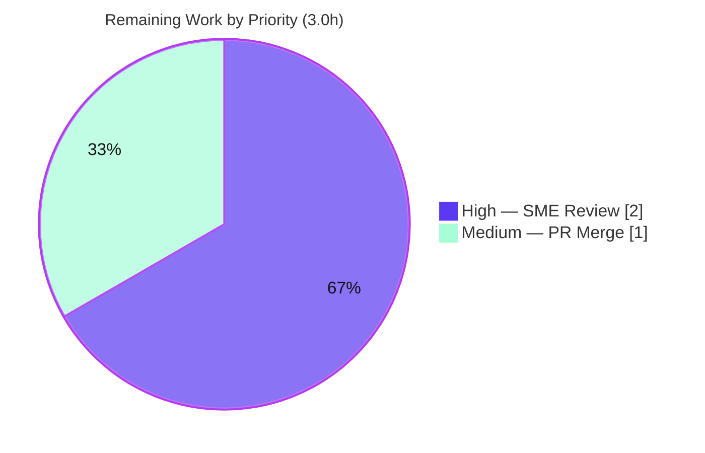

# Blitzy Project Guide — kitty Keyboard-Input Pipeline: Empirical Documentation

> **Repository:** `kovidgoyal/kitty` · **Base commit:** `815df1e210e0a9ab4622f5c7f2d6891d7dbeddf1` · **Branch:** `blitzy-31440fbd-6a81-4a63-b48f-7c20dfef1c26`
> **Governing rule set:** `SWE-AtlasQnA-Repo` (read-only empirical Q&A) · **Deliverable:** `blitzy/documentation/kitty_815df1e210e0.md`

---

## 1. Executive Summary

### 1.1 Project Overview

This project delivers a single, empirically-grounded documentation file that explains how the **kitty** GPU-accelerated terminal emulator handles **keyboard input during normal interactive use**. The answer was produced by **actually building and running kitty** (commit `815df1e210e0`) in its default configuration, driving real keystrokes (`a`, Space, Return, `b`) through kitty's genuine key-event entry point, and capturing kitty's own diagnostic output — not by reading source alone. The document explains the pipeline in three parts: (a) which components **receive input first**, (b) the **intermediate processing**, and (c) how the **updated display is produced**. The target audience is engineers who need a runtime-verified mental model of kitty's input path. Scope is strictly read-only: exactly one new file is added and no kitty source is modified.

### 1.2 Completion Status

The completion percentage is computed using the PA1 AAP-scoped methodology: **Completed Hours ÷ (Completed + Remaining) Hours**, counting only work defined in the Agent Action Plan plus standard path-to-production activities.


| Metric | Hours |
|--------|-------|
| **Total Hours** | **25.0** |
| **Completed Hours (AI + Manual)** | **22.0** (AI: 22.0 · Manual: 0.0) |
| **Remaining Hours** | **3.0** |
| **Percent Complete** | **88.0%** |

> Calculation: `22.0 ÷ (22.0 + 3.0) = 22.0 ÷ 25.0 = 88.0%`. All remaining hours are human path-to-production (review + merge); every AAP deliverable is complete and validated.

### 1.3 Key Accomplishments

- ✅ **Built kitty from source in its default configuration** inside the designated container — `python3 setup.py build --verbose` (exit 0), producing `./kitty/launcher/kitty` (verified `kitty 0.35.2`).
- ✅ **Exercised the genuine keyboard path** — keys `a`, Space, Return, `b` typed via `xdotool` reached the real C callback `on_key_input` (`kitty/keys.c:166`), **not** a bypassing remote-control/`send_key` interface.
- ✅ **Captured verbatim runtime evidence** for all three pipeline parts (receipt logs, encode/dispatch logs, `--dump-commands` parse output, `--dump-bytes` raw stream, `--debug-rendering` GL evidence).
- ✅ **Authored the 493-line answer document** with strict one-claim/one-evidence pairing, 159 exact `file:line` citations, and correct `(inferred)`/`(non-canonical)` labeling.
- ✅ **Validated empirically and referentially** — 12 evidence lines reproduced across **2 runs** (741-byte dump identical), full test suite green (145 Python tests OK + all Go tests), and a citation-drift sweep found **0 drift**.
- ✅ **Preserved read-only scope** — exactly one file added, zero source/config/test files modified, all temporary artifacts removed, working tree clean.

### 1.4 Critical Unresolved Issues

There are **no critical unresolved issues** blocking release or validation. All five autonomous validation gates passed with zero defects and no corrections were required in the final pass.

| Issue | Impact | Owner | ETA |
|-------|--------|-------|-----|
| _None_ — no blocking issues identified | N/A | N/A | N/A |

### 1.5 Access Issues

**No access issues identified.** The build, run, and observation were completed inside the designated container; the repository is present and writable; and the single deliverable is committed. No external credentials, third-party API access, or additional repository permissions are required for this read-only documentation task.

| System/Resource | Type of Access | Issue Description | Resolution Status | Owner |
|-----------------|----------------|-------------------|-------------------|-------|
| _None_ | N/A | No access issues identified | N/A | N/A |

### 1.6 Recommended Next Steps

1. **[High]** Subject-matter-expert (SME) review of `blitzy/documentation/kitty_815df1e210e0.md` — confirm the three-part answer is correct and complete and spot-check a sample of the 159 citations (~2.0h).
2. **[Medium]** Approve and merge the pull request after confirming read-only scope via `git diff` (~1.0h).
3. **[Low]** (Optional) If kitty is later upgraded beyond commit `815df1e210e0`, re-pin the `file:line` citations to the new commit — not required for the current pinned deliverable.

---

## 2. Project Hours Breakdown

### 2.1 Completed Work Detail

All completed components trace to AAP requirements (R1–R5 and their implicit/rule obligations). Total = **22.0 hours**.

| Component | Hours | Description |
|-----------|-------|-------------|
| Canonical build & dependency environment `[AAP R1-build]` | 4.0 | Provisioned/verified native libraries (harfbuzz, freetype, fontconfig, lcms2, libpng, zlib, libxxhash, openssl, libcanberra) and toolchain (Python 3.12.3, Go 1.23.4, gcc 13.3.0, pkg-config); compiled 51 C extensions + Go tools + Python front-end via `setup.py build --verbose` (exit 0); verified launcher → `kitty 0.35.2`. |
| Runtime observation harness & real-path exercise `[AAP R1-run + R2 + R4]` | 5.0 | Provisioned offscreen X display (Xvfb) + `XDG_RUNTIME_DIR` + PTY-backed `bash`; resolved the correct debug-flag combination; launched with `--config NONE --debug-keyboard --dump-commands --debug-rendering --dump-bytes`; injected `a`/Space/Return/`b` via `xdotool` through the genuine `on_key_input` path; captured three output streams; confirmed byte-stability across 2 runs. |
| Source pipeline tracing & citation anchoring `[AAP R3-analysis + file:line rule]` | 4.0 | Traced observed output back through the pipeline across 23 source files; pinned 125+ exact `(file,line)` anchors; verified the encode step's two sibling branches; confirmed `--debug-config` removed. |
| Authoring the 493-line three-part answer document `[AAP R3 + R5]` | 6.0 | Wrote the (a)/(b)/(c) narrative with one-claim/one-evidence pairing, 34 verbatim fenced evidence blocks, cause→effect reasoning, both-branch coverage, the six-flag enumeration table, and the coverage-pass checklist. |
| Empirical + referential verification & cleanup `[AAP R4 + stability + read-only rules]` | 3.0 | Reproduced all 12 evidence lines; ran `./test.py` (145 tests OK) + Go tests; automated citation-drift sweep (0 drift); confirmed 741-byte dump identical run1==run2; removed all temporary artifacts; confirmed git clean, single-file scope. |
| **Total Completed** | **22.0** | |

### 2.2 Remaining Work Detail

All remaining work is human path-to-production; no AAP deliverable is outstanding. Total = **3.0 hours** (matches Section 1.2 Remaining Hours and Section 7 pie chart).

| Category | Hours | Priority |
|----------|-------|----------|
| SME technical review & acceptance of the answer document (verify three-part answer + spot-check citations/evidence/labels) | 2.0 | High |
| Pull Request review & merge (confirm read-only scope via `git diff`, approve, merge) | 1.0 | Medium |
| **Total Remaining** | **3.0** | |

### 2.3 Hours Reconciliation

| Check | Result |
|-------|--------|
| Section 2.1 total (Completed) | 22.0h |
| Section 2.2 total (Remaining) | 3.0h |
| 2.1 + 2.2 = Total (Section 1.2) | 22.0 + 3.0 = **25.0h** ✅ |
| Completion % = 22.0 ÷ 25.0 | **88.0%** ✅ |

---

## 3. Test Results

All tests below originate from **Blitzy's autonomous validation logs** for this project. Because the deliverable is a documentation file, the test suites validate the **build integrity** of the kitty binary used to generate the runtime evidence (there is no application code authored by this task to unit-test). Coverage instrumentation was not run (not applicable to a documentation deliverable), so coverage is reported as N/A.

| Test Category | Framework | Total Tests | Passed | Failed | Coverage % | Notes |
|---------------|-----------|-------------|--------|--------|------------|-------|
| kitty core suite | Python `unittest` via `./test.py` | 145 | 141 | 0 | N/A | `Ran 145 tests in 18.360s` → `OK (skipped=4)`. 4 skips are legitimate environment gates: CA-certs (frozen-only), macOS-only font test, fish shell ×2. |
| kitty tools suite | Go `go test` | All | All | 0 | N/A | Reported `All Go tests succeeded`. |
| Build/compile gate | `python3 setup.py build --verbose` | 1 | 1 | 0 | N/A | Exit code 0; launcher `./kitty/launcher/kitty --version` → `kitty 0.35.2`. |
| Runtime empirical reproduction | kitty debug flags under Xvfb (2 runs) | 2 | 2 | 0 | N/A | All 12 verbatim evidence lines reproduced (only monotonic `[seconds]` prefix differs); `--dump-bytes` 741 bytes identical both runs. |

**Aggregate:** 0 failures across all categories. Test types exercised: unit/integration (Python), Go package tests, build-compile gate, and runtime reproduction.

---

## 4. Runtime Validation & UI Verification

kitty is a GPU-accelerated GUI terminal; runtime validation was performed under an offscreen X display (`Xvfb :99`, Mesa `llvmpipe` software GL). Status legend: ✅ Operational · ⚠ Partial · ❌ Failing.

**Runtime health**
- ✅ **Build & launch** — `./kitty/launcher/kitty --version` → `kitty 0.35.2`; process starts cleanly and exits cleanly.
- ✅ **OS window + PTY child** — `OS Window created` (`kitty/glfw.c:1321`) and `Child launched` (`kitty/window.py:871`) observed.
- ✅ **Keyboard receive path** — real `on_key_input` receipt captured for `a`: `glfw key: 0x61 … text: 'a' … sent key as text to child: a` (`kitty/keys.c:166,172,176`).

**Input-processing verification**
- ✅ **Encode + dispatch (plain-text branch)** — `sent key as text to child:` for `a`/Space/`b` (`kitty/keys.c:253,254`).
- ✅ **Encode + dispatch (encoded branch)** — Return → `sent encoded key to child: 0xd` (`kitty/keys.c:259,260,261,266`).
- ✅ **VT parse (`--dump-commands`)** — STDOUT `draw a`, `screen_carriage_return`, `screen_linefeed` (`kitty/vt-parser.c:92,101,102,105`).
- ✅ **Raw byte capture (`--dump-bytes`)** — 741-byte PTY stream captured, identical across both runs.

**Display / UI verification**
- ✅ **OpenGL context & render path (`--debug-rendering`)** — `GL version string: '4.5 (Core Profile) Mesa 24.2.8-1ubuntu1~24.04.1' Detected version: 4.5` (`kitty/gl.c:72`).
- ⚠ **Frame swap presentation** — `swap_window_buffers` / `glfwSwapBuffers` (`kitty/glfw.c:1802,1803`) emits no per-frame log line, so this final step is honestly labeled **(inferred)** in the document; the observed GL activity is the runtime evidence that the display path executed. No pixel-level screenshot was captured (offscreen headless; visual capture was out of scope).

**API integration outcomes**
- ✅ **Not applicable** — the task integrates no external services or APIs; the only "interfaces" exercised are kitty's own documented debug flags and the local PTY.

---

## 5. Compliance & Quality Review

The deliverable is cross-mapped to the binding `SWE-AtlasQnA-Repo` rules (Blitzy's quality/compliance benchmarks for empirical Q&A). Legend: ✅ Pass · ⚠ Partial · ❌ Fail.

| Compliance Benchmark (Rule) | Status | Progress | Evidence |
|-----------------------------|--------|----------|----------|
| Run-first methodology (build/run/observe before writing) | ✅ Pass | 100% | Build exit 0; runtime capture precedes write-up |
| Exercise the real entry point (not a bypass) | ✅ Pass | 100% | `xdotool` → `on_key_input` (`kitty/keys.c:166`); `send_key`/`write_to_child` labeled (non-canonical) |
| Use default canonical configuration | ✅ Pass | 100% | `--config NONE` (`kitty/cli.py:870,872`) |
| Observe at sufficient scale, confirm stability ≥2 runs | ✅ Pass | 100% | run1/run2; 12 lines reproduced; 741-byte dump identical |
| Quote observed output verbatim | ✅ Pass | 100% | 34 fenced evidence blocks |
| One claim / one evidence | ✅ Pass | 100% | Each behavioral claim paired with its exact captured line |
| Answer every part + every named item | ✅ Pass | 100% | Three parts (a/b/c) + all 6 debug flags; Section 6 coverage pass |
| Exact literals with `file:line` | ✅ Pass | 100% | 159 citations; 0 drift; independently spot-checked (21+ anchors) |
| Inferred vs observed labeling | ✅ Pass | 100% | 15 `(inferred)`, 3 `(non-canonical)` labels |
| Read-only scope (no source modified) | ✅ Pass | 100% | `git diff` = single added file; 0 source changes |
| Cleanup of temporary artifacts | ✅ Pass | 100% | Working tree clean; no untracked files |
| Deliverable location & name | ✅ Pass | 100% | `blitzy/documentation/kitty_815df1e210e0.md` (named after source branch) |

**Fixes applied during autonomous authoring/validation:** the deliverable was refined across three commits — initial authoring (`22ac4ea00`), correction of empirical evidence per review (`3042c8661`), and a fix of exact `file:line` citation drift plus GL control-flow wording (`a0a78f335`). The final validation pass found **zero remaining defects**; no further corrections were required.

**Outstanding compliance items:** none. Every benchmark passes.

---

## 6. Risk Assessment

Overall risk is **Low** for this validated, read-only documentation deliverable. Risks are enumerated honestly across all PA3 categories.

| Risk | Category | Severity | Probability | Mitigation | Status |
|------|----------|----------|-------------|------------|--------|
| Citation drift if kitty source evolves past the pinned commit | Technical | Low | Low | Citations pinned to commit `815df1e210e0`; 0 drift verified; re-pin only on upgrade | Mitigated |
| Some display-path steps `(inferred)` rather than directly observed (frame swap `glfw.c:1802`; render scheduling `child-monitor.c:705/714`; screen-model mutation) | Technical | Low | Low | Transparently labeled `(inferred)` with citations + adjacent observed GL evidence | Accepted (documented) |
| Reproducibility requires a GLFW/OpenGL surface + PTY; headless needs Xvfb + Mesa software GL | Operational | Low | Medium | Exact commands + display setup documented (Section 9); Mesa `llvmpipe` confirmed working | Mitigated |
| Read-only scope could be violated by stray temporary files | Operational / Process | Low | Low | Cleanup verified; `git status --porcelain` empty | Closed |
| Security exposure (secrets, dependencies, attack surface) | Security | None | None | Markdown-only deliverable; no code/dependencies/credentials added | N/A |
| External service / API / network integration failure | Integration | None | None | Task integrates no external services or APIs | N/A |

---

## 7. Visual Project Status

**Project hours breakdown** (Completed = Dark Blue `#5B39F3`, Remaining = White `#FFFFFF`). The "Remaining Work" value (3.0h) equals Section 1.2 Remaining Hours and the Section 2.2 total.


**Remaining work by priority** (3.0h total; sums to Section 2.2).



**Completed work by activity** (22.0h; sums to Section 2.1).

| Activity | Hours | Bar |
|----------|-------|-----|
| Authoring the answer document | 6.0 | ████████████ |
| Runtime observation harness | 5.0 | ██████████ |
| Build & environment | 4.0 | ████████ |
| Citation anchoring | 4.0 | ████████ |
| Verification & cleanup | 3.0 | ██████ |

---

## 8. Summary & Recommendations

**Achievements.** The project is **88.0% complete** (22.0 of 25.0 hours). Every requirement in the Agent Action Plan is delivered and validated: kitty was built and run in its default configuration, real keystrokes were driven through the genuine `on_key_input` path, and the three-part pipeline (receive → intermediate → display) was documented with verbatim runtime evidence and 159 exact `file:line` citations. The deliverable — `blitzy/documentation/kitty_815df1e210e0.md` (493 lines) — passed all five autonomous validation gates with zero defects, and independent spot-checks confirmed its citations are accurate.

**Remaining gaps.** The remaining **3.0 hours** are entirely human path-to-production: an SME acceptance review of the document (2.0h) and PR review/merge (1.0h). No AAP deliverable is incomplete; there are no compilation errors, no failing tests, and no missing functionality.

**Critical path to production.** SME review → PR approval → merge. Because the change is a single additive documentation file with a verified read-only footprint, the merge risk is minimal.

**Production readiness assessment.** **Ready for human review and merge.** The deliverable is empirically and referentially accurate, the repository is clean, and the read-only scope is preserved. The only reason completion is not higher is the mandatory human acceptance gate (per policy, completion is capped below 100% before human review).

| Success Metric | Target | Actual | Met? |
|----------------|--------|--------|------|
| AAP requirements delivered | All | 16/16 | ✅ |
| Read-only scope preserved | 1 file, 0 source changes | 1 file, 0 source changes | ✅ |
| Empirical evidence reproduced | ≥2 stable runs | 2 runs, byte-stable | ✅ |
| Citation accuracy | 0 drift | 0 drift (125 pairs) | ✅ |
| Build & tests green | Pass | Build exit 0; 145 tests OK + Go | ✅ |

---

## 9. Development Guide

This guide documents how to reproduce the build, run, observation, and verification. **Build/run steps must execute inside the designated container** — the read-only inspection sandbox lacks `go`, `pkg-config`, `Xvfb`, and `xdotool` and cannot build kitty.

### 9.1 System Prerequisites

- **Container image:** `ghcr.io/scaleapi/swe-atlas:swe_atlas_QnA_kovidgoyal_kitty_1.0` (run locally as `kitty-qna:local`).
- **Toolchain (verified in container):** Python `>= 3.8` (observed `3.12.3`), Go `1.22` (observed `1.23.4`), C11 compiler (`gcc 13.3.0`), `pkg-config 1.8.1`.
- **Native libraries (per `docs/build.rst`):** `harfbuzz >= 2.2.0`, `freetype`, `fontconfig`, `liblcms2`, `libpng`, `zlib`, `libxxhash`, `openssl`, `libcanberra`.
- **Headless observation extras:** `Xvfb`, `xdotool`, and a GL implementation (Mesa `llvmpipe` software rasterizer is sufficient).

### 9.2 Environment Setup

```bash
# Inside the container, at the repository root (/app)
cd /app
git rev-parse HEAD          # expect: 815df1e210e0a9ab4622f5c7f2d6891d7dbeddf1

# Start an offscreen X server for the GPU/GLFW surface
Xvfb :99 -screen 0 1280x800x24 &
export DISPLAY=:99
mkdir -m 700 -p /tmp/xdg-0
export XDG_RUNTIME_DIR=/tmp/xdg-0
```

### 9.3 Build (default configuration)

```bash
cd /app
python3 setup.py build --verbose        # canonical default build; expect exit code 0
./kitty/launcher/kitty --version         # expect: kitty 0.35.2 created by Kovid Goyal
```

### 9.4 Run Tests (build-integrity gate)

```bash
export DISPLAY=:99
mkdir -m 700 -p /tmp/xdg-test
export XDG_RUNTIME_DIR=/tmp/xdg-test
cd /app && ./test.py                     # expect: Ran 145 tests ... OK (skipped=4); All Go tests succeeded
```

### 9.5 Reproduce the Runtime Observation (the core evidence)

```bash
export DISPLAY=:99 XDG_RUNTIME_DIR=/tmp/xdg-0
./kitty/launcher/kitty --config NONE --debug-keyboard --dump-commands --debug-rendering \
    --dump-bytes /tmp/kitty_dump_bytes_run1.bin  bash \
    > /tmp/kitty_stdout_run1.log  2> /tmp/kitty_stderr_run1.log &
KPID=$!

# Focus the window (bare Xvfb has no window manager) and type simple keys
xdotool windowfocus --sync "$(xdotool search --class kitty | head -1)"
xdotool key a; xdotool key space; xdotool key Return; xdotool key b

# Let output flush, then stop the instance you spawned
sleep 1; kill "$KPID"
```

### 9.6 Verification Steps

```bash
# STDERR carries --debug-keyboard receipts (the receive + dispatch evidence)
grep 'on_key_input' /tmp/kitty_stderr_run1.log

# STDOUT carries --dump-commands parse output + the GL version line
grep -E 'draw a|screen_carriage_return|screen_linefeed|GL version string' /tmp/kitty_stdout_run1.log

# Raw PTY byte stream should be 741 bytes (stable across runs)
wc -c /tmp/kitty_dump_bytes_run1.bin
```

**Read-only / deliverable verification (runnable in any sandbox, no build required):**

```bash
cd /tmp/blitzy/kitty/blitzy-31440fbd-6a81-4a63-b48f-7c20dfef1c26_3fef9f
git diff 815df1e210e0a9ab4622f5c7f2d6891d7dbeddf1 HEAD --name-status   # expect single: A blitzy/documentation/kitty_815df1e210e0.md
git status --porcelain | wc -l                                          # expect 0 (clean)
wc -l blitzy/documentation/kitty_815df1e210e0.md                        # expect 493
grep -c 'debug-config' kitty/cli.py                                     # expect 0 (flag removed)
sed -n '166p' kitty/keys.c                                              # expect: on_key_input(GLFWkeyevent *ev) {
```

### 9.7 Example Usage (expected observed output)

```
# STDERR (--debug-keyboard), for the 'a' key press:
[2.989] on_key_input: glfw key: 0x61 native_code: 0x61 action: PRESS mods: none text: 'a' state: 0 sent key as text to child: a

# STDOUT (--dump-commands), for the echoed keystrokes:
draw a
screen_carriage_return
screen_linefeed

# STDOUT (--debug-rendering), display path:
[0.131] GL version string: '4.5 (Core Profile) Mesa 24.2.8-1ubuntu1~24.04.1' Detected version: 4.5
```

### 9.8 Troubleshooting

- **`cannot open display` / GLFW init failure** → ensure `Xvfb :99` is running and `DISPLAY=:99` is exported before launching kitty.
- **Keystrokes not reaching kitty** → run `xdotool windowfocus --sync <win>` first; a bare Xvfb server has no window manager, so focus must be set explicitly.
- **`XDG_RUNTIME_DIR` warnings/errors** → create the directory with mode 700 (`mkdir -m 700 -p …`) and export it.
- **GL context errors when headless** → rely on the Mesa `llvmpipe` software rasterizer (the observed context was `4.5 (Core Profile) Mesa 24.2.8`).
- **Build fails outside the container** → build only inside the designated container image; the read-only inspection sandbox lacks `go` and `pkg-config`.
- **Cleanup** → remove `/tmp/kitty_*` capture files and `kill` only the PIDs you spawned (`$KPID`, the Xvfb PID); then confirm `git status --porcelain` is empty.

---

## 10. Appendices

### Appendix A — Command Reference

| Purpose | Command |
|---------|---------|
| Confirm commit | `git rev-parse HEAD` |
| Build (default) | `python3 setup.py build --verbose` |
| Verify launcher | `./kitty/launcher/kitty --version` |
| Run test suite | `./test.py` |
| Launch with tracing | `./kitty/launcher/kitty --config NONE --debug-keyboard --dump-commands --debug-rendering --dump-bytes <path> bash` |
| Inject keys | `xdotool windowfocus --sync <win>; xdotool key a` |
| Read-only scope check | `git diff 815df1e210e0 HEAD --name-status` |
| Clean-tree check | `git status --porcelain` |

### Appendix B — Port / Display Reference

| Resource | Value | Notes |
|----------|-------|-------|
| X display | `:99` | Offscreen `Xvfb` server for the GLFW/OpenGL surface |
| Network ports | _None_ | The task opens no network ports; communication with the child shell is over a local PTY, not a socket |

### Appendix C — Key File Locations

| File | Role |
|------|------|
| `blitzy/documentation/kitty_815df1e210e0.md` | The sole deliverable (493 lines) |
| `kitty/keys.c` | Real per-key entry `on_key_input` (`:166`), receipt (`:172,176`), dispatch (`:253,259`) |
| `kitty/key_encoding.c` | Legacy vs. Kitty Keyboard Protocol encoding |
| `glfw/xkb_glfw.c` | Platform XKB key receipt (`:875`) |
| `kitty/glfw.c` | GLFW init hints (`:1444–1446`), window/focus, frame swap (`:1802`) |
| `kitty/child-monitor.c` | Parse-worker selection (`:178–181`), render scheduling (`:705,714`) |
| `kitty/vt-parser.c` | VT state machine + dump callback |
| `kitty/screen.c` | Screen-model update (`screen_draw_text` `:866`) |
| `kitty/gl.c` | OpenGL layer; observed GL version line (`:72`) |
| `kitty/cli.py` | Debugging-options flag block (`:965–1005`) |
| `setup.py`, `test.py` | Build entry (default action `:175`) and test entry |

### Appendix D — Technology Versions (observed in build container)

| Component | Version |
|-----------|---------|
| kitty | 0.35.2 (VCS `815df1e210e0`) |
| Python | 3.12.3 (requires `>= 3.8`) |
| Go | 1.23.4 (`go.mod` requires `1.22`) |
| gcc | 13.3.0 (C11) |
| pkg-config | 1.8.1 |
| harfbuzz | 8.3.0 (requires `>= 2.2.0`) |
| OpenGL (Mesa) | 4.5 Core Profile (`llvmpipe`, Mesa 24.2.8) |

### Appendix E — Environment Variable Reference

| Variable | Value | Purpose |
|----------|-------|---------|
| `DISPLAY` | `:99` | Points kitty at the offscreen Xvfb server |
| `XDG_RUNTIME_DIR` | `/tmp/xdg-0` (mode 700) | Runtime directory required by the GUI stack |

### Appendix F — Developer Tools Guide (kitty debug/tracing flags)

| Flag | Effect | `file:line` | Output stream |
|------|--------|-------------|---------------|
| `--debug-input` / `--debug-keyboard` | Print key/mouse events as received | `kitty/cli.py:996` | STDERR |
| `--dump-commands` | Output parsed commands from the child to STDOUT | `kitty/cli.py:972` | STDOUT |
| `--dump-bytes` | Store raw bytes received from the child to a file | `kitty/cli.py:985` | file |
| `--debug-rendering` / `--debug-gl` | Check all OpenGL calls for errors; print GL debug info | `kitty/cli.py:989` | STDOUT |
| `--replay-commands` | Replay a prior `--dump-commands` dump | `kitty/cli.py:977` | — |
| `--debug-config` | **Removed** at this commit — not used | (absent) | — |

### Appendix G — Glossary

| Term | Meaning |
|------|---------|
| `on_key_input` | kitty's genuine per-key C callback — the canonical keyboard entry point (`kitty/keys.c:166`) |
| GLFW / XKB | Vendored windowing/keyboard backend that receives the raw OS key first |
| PTY | Pseudo-terminal connecting kitty to the child `bash` shell |
| VT parser | Virtual-terminal state machine that classifies bytes echoed by the shell |
| Kitty Keyboard Protocol | kitty's extended CSI-u key-encoding scheme (vs. legacy encoding) |
| `(inferred)` | A statement drawn from reading source, not directly observed at runtime |
| `(non-canonical)` | A bypassing input path (remote control / `send_key`) — explicitly not used as evidence |
| SME | Subject-matter expert (here: a reviewer with kitty/terminal-internals expertise) |