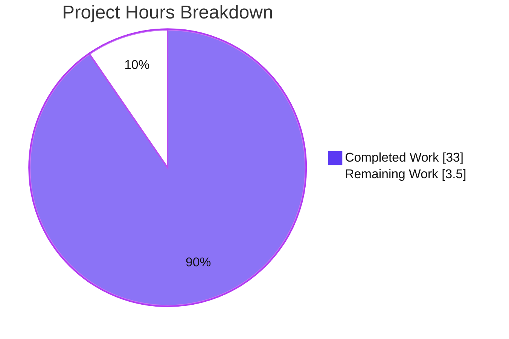
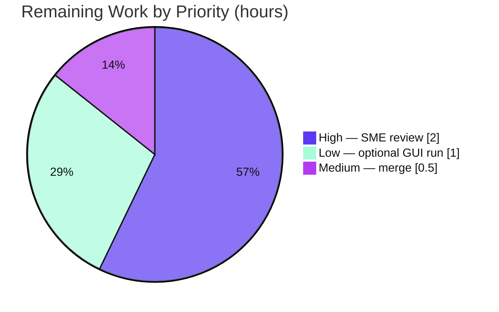

# Blitzy Project Guide — kitty `choose-fonts` Persistence Q&A Documentation

> Brand legend — <span style="color:#5B39F3">**Completed / AI Work = Dark Blue `#5B39F3`**</span> · **Remaining / Not Completed = White `#FFFFFF`** · Headings/Accents = Violet‑Black `#B23AF2` · Highlight = Mint `#A8FDD9`

---

## 1. Executive Summary

### 1.1 Project Overview

This project delivers a single, code‑grounded Q&A onboarding document, `blitzy/documentation/kitty_815df1e210e0.md`, that authoritatively explains the runtime and code‑level behavior of kitty's `choose-fonts` kitten at commit `815df1e21`. Its target users are kitty contributors and reviewers onboarding to the font‑selection subsystem. The central business question it answers: **does a font selection made through the kitten persist across restarts, or apply only to the current session?** Technical scope spans the Go‑native kitten, its Python backend, and the `tools/config` persistence layer. It is a strictly read‑only investigation — zero modifications to the kitty source tree — proven by building, running, and exercising the real production code.

### 1.2 Completion Status


| Metric | Value |
|---|---|
| **Total Hours** | **36.5** |
| **Completed Hours (AI + Manual)** | **33.0** |
| &nbsp;&nbsp;&nbsp;• AI (autonomous) | 33.0 |
| &nbsp;&nbsp;&nbsp;• Manual | 0.0 |
| **Remaining Hours** | **3.5** |
| **Percent Complete** | **90.4%** |

> Completion is computed on an **AAP‑scoped** basis (PA1): `Completed ÷ (Completed + Remaining) = 33.0 ÷ 36.5 = 90.4%`. The remaining 3.5h is entirely path‑to‑production (human review, optional GUI confirmation, merge) — there is **no** outstanding engineering work.

### 1.3 Key Accomplishments

- ✅ Delivered the sole AAP artifact — an 851‑line, 5,601‑word Q&A document — answering all five requirements (R1–R5) with `[path:locator]` code citations.
- ✅ Built kitty from source (`CI=true python3 setup.py build`) — 85 C translation units + the Go `kitten` binary — both reporting version `0.35.2`.
- ✅ **Decisively answered the core question (R5):** pressing **Enter** at the final step **persists** the selection to `kitty.conf` on disk → remembered across restarts; the `SIGUSR1` reload is a separate, conditional step; `s` writes to STDOUT only.
- ✅ Captured runtime output evidence by executing the **real production code** — `config.Patcher.Patch` (fresh / pre‑existing / idempotent cases), `ReloadConfigInKitty` (SIGUSR1), and the Python startup config loader.
- ✅ Documented the version‑drift finding: only `--reload-in` exists at this commit (no `--config-file-name`); `kitty.conf` target is hard‑coded; `choose_fonts` clone is visible.
- ✅ Passed all five autonomous validation gates; regression suite `go test ./tools/... ./kittens/choose_fonts/...` = **21 packages ok, 0 fail**.
- ✅ Kept the kitty source tree **byte‑for‑byte pristine** (`git status --porcelain` empty); all temporary experiment artifacts deleted.

### 1.4 Critical Unresolved Issues

| Issue | Impact | Owner | ETA |
|---|---|---|---|
| _None_ | No blocking issues. The deliverable passed all five validation gates; no compilation errors, failing tests, or missing functionality remain. | — | — |

> The only remaining work is the human review/acceptance gate and merge (see §1.6 and §2.2); none of it is a defect or blocker.

### 1.5 Access Issues

| System/Resource | Type of Access | Issue Description | Resolution Status | Owner |
|---|---|---|---|---|
| _None_ | — | No access issues identified. The repository, full Go/C/Python toolchain, native font libraries, and the built binaries were all accessible; the build, tests, and real production code executed successfully. | N/A | — |

**No access issues identified.**

### 1.6 Recommended Next Steps

1. **[High]** Perform SME technical review and sign‑off of `blitzy/documentation/kitty_815df1e210e0.md` — read end‑to‑end, spot‑check representative citations against source at `815df1e21`, and confirm the R5 persistence answer.
2. **[Medium]** Merge the documentation branch into the destination repository (no source conflicts expected — only `blitzy/documentation/` was added).
3. **[Low]** _(Optional)_ Run the full interactive `kitten choose-fonts` GUI flow in the user‑provided Docker image to capture a visual/screencast confirmation of the end‑to‑end TUI (confirmatory only — the real production functions were already executed headlessly).

---

## 2. Project Hours Breakdown

### 2.1 Completed Work Detail

| Component | Hours | Description |
|---|---:|---|
| R1 — Build & run foundation | 3.0 | Built kitty from source (`python3 setup.py`), documented launching a single default‑settings instance (`--config NONE`) and invoking the kitten (Doc §1). |
| R2 — Registration & option parsing | 2.5 | Traced `EntryPoint`, the single `--reload-in` option, the `Options` struct, and the `choose_fonts` clone; runtime‑verified via `--help` (Doc §2). |
| R3 — Value‑flow trace | 4.0 | Traced the `handler` pane state machine (listing→faces→face→final), faces pre‑population, and the `faces_settings` accumulator across files (Doc §3). |
| R4 — Finalization + output evidence | 4.0 | Analyzed `final.go` key handling, `config.Patcher.Patch` internals, `ConfigDir`, and reload semantics; captured patched‑`kitty.conf` evidence (Doc §4). |
| R5 — Persistence verification (core) | 3.5 | Built the decisive reasoning chain across the Go write‑side and Python read‑side proving persistence across restarts (Doc §5). |
| Version‑drift research & §6 | 2.5 | Web cross‑check of upstream docs/man pages; documented three code‑vs‑docs divergences with code as truth (Doc §6). |
| Appendix A — Architecture | 1.5 | Documented the Go kitten + Python backend JSON‑IPC architecture. |
| Appendix B — Reproducible experiment | 1.5 | Designed the isolated, self‑cleaning runtime experiment (throwaway `KITTY_CONFIG_DIRECTORY`). |
| Appendix C — Live runtime capture | 3.0 | Executed real production code (`Patcher.Patch` ×3 cases, `ReloadConfigInKitty` SIGUSR1, Python loader) and captured actual output. |
| Document assembly | 2.0 | Structure, table of contents, 34 internal anchors, 20 table rows, 84 code fences, formatting (851 lines). |
| Autonomous validation (5 gates) | 4.0 | Build, `go test`, real‑code runtime execution, full `[path:locator]` citation verification, structural checks. |
| Review‑cycle remediation | 1.5 | F1–F6 acceptance fixes, man‑page URL fix, and two off‑by‑one citation corrections across three follow‑up commits. |
| **Total** | **33.0** | **All hours are autonomous (AI) work mapped 1:1 to AAP deliverables.** |

### 2.2 Remaining Work Detail

| Category | Hours | Priority |
|---|---:|---|
| SME technical review & acceptance of the Q&A document (read‑through, spot‑check citations, confirm R5 answer) | 2.0 | High |
| Optional full interactive GUI confirmation run of `kitten choose-fonts` in the Docker image (visual/screencast evidence) | 1.0 | Low |
| Merge the documentation branch into the destination repository (PR approval + merge) | 0.5 | Medium |
| **Total** | **3.5** | — |

> **Integrity check:** Section 2.1 (33.0) + Section 2.2 (3.5) = **36.5** Total Project Hours (matches §1.2). Section 2.2 total (3.5) matches §1.2 Remaining Hours and the §7 pie "Remaining Work".

---

## 3. Test Results

All results below originate from Blitzy's autonomous validation logs for this project and were independently re‑confirmed during this assessment.

| Test Category | Framework | Total Tests | Passed | Failed | Coverage % | Notes |
|---|---|---:|---:|---:|---|---|
| Go package suite (regression) | Go `testing` (`go test`) | 21 pkgs | 21 | 0 | N/A* | Existing suite run to prove the source tree is unbroken; `tools/config` (home of the persistence `Patcher`) = ok; `kittens/choose_fonts` has no test files (UI code). Requires `KITTY_PATH_TO_KITTY_EXE`. |
| Runtime behavioral verification | Real production‑code execution | 8 | 8 | 0 | N/A | `--help` option set (only `--reload-in`); `choose_fonts` clone visible; `Patcher.Patch` cases A (fresh), B (pre‑existing+`.bak`), C (idempotent); `ReloadConfigInKitty` SIGUSR1 delivery; Python next‑launch read; `--config NONE` contrast. |
| Document citation & structure validation | Scripted + manual doc checks | 851 lines | Pass | 0 | 100% | Every `[path:locator]` verified at `815df1e21`; 84 balanced code fences; internal anchors resolve; no placeholders/TODOs. |

> *No line‑coverage figure is reported because the Go suite was executed as a **regression gate** (package‑level pass/fail), and the AAP prohibits adding or modifying source/test files. No new tests were authored — this is a read‑only documentation task.

**Independent reproduction during this assessment:** re‑ran `go test ./tools/... ./kittens/choose_fonts/...` → **21 ok / 0 fail**; re‑drove the real `config.Patcher.Patch` (Case A fresh → `updated=true`, no `.bak`, exact `# BEGIN_KITTY_FONTS … # END_KITTY_FONTS` block; Case C idempotent → `updated=false`); re‑ran `kitten choose-fonts --help` (only `--reload-in`). All matched the documented evidence.

---

## 4. Runtime Validation & UI Verification

Legend: ✅ Operational · ⚠ Partial · ❌ Failing

**Build & binaries**
- ✅ `CI=true python3 setup.py build` succeeds (85 C translation units + Go `kitten` binary), zero errors.
- ✅ `kitty/launcher/kitten` (Go ELF, 15.7 MB) and `kitty/launcher/kitty` (ELF pie) produced; both report `0.35.2`.

**CLI / option parsing (R2)**
- ✅ `kitten choose-fonts --help` → exposes **only** `--reload-in` (choices `parent, all, none`; default `parent`). No `--config-file-name` (confirms version drift).
- ✅ `kitten --help` → lists both `choose-fonts` and `choose_fonts` (clone visible).

**Persistence mechanism (R4 / R5)**
- ✅ `config.Patcher.Patch` — Case A (fresh `kitty.conf`): `updated=true`, no `.bak`, writes the sentinel `# BEGIN_KITTY_FONTS … # END_KITTY_FONTS` block.
- ✅ `config.Patcher.Patch` — Case B (pre‑existing config): `updated=true`, `.bak` written, prior `font_*` lines commented out, other settings preserved.
- ✅ `config.Patcher.Patch` — Case C (identical selection): `updated=false` (idempotent — no `.bak`, no reload).
- ✅ `config.ReloadConfigInKitty(true)` → delivers `SIGUSR1` to the `$KITTY_PID` parent process.
- ✅ Python startup loader: a normal relaunch reads the persisted `kitty.conf`; `--config NONE` yields the builtin `monospace` — **decisive R5 proof**.

**Interactive GUI / TUI**
- ⚠ Full interactive GUI/TUI flow not executed in this sandbox (no display). Mitigation: the **real production functions** underlying the flow were executed headlessly and confirm every behavioral claim; the full GUI run is reproducible in the user‑provided Docker image and is captured as an optional human task (§2.2, HT‑3).

**Source‑tree integrity**
- ✅ `git status --porcelain` empty; zero non‑`blitzy/` files changed since baseline `815df1e21`; all temporary artifacts deleted.

---

## 5. Compliance & Quality Review

AAP deliverables cross‑mapped to quality/compliance benchmarks. All items pass; fixes applied during autonomous validation are noted.

| Benchmark / AAP Deliverable | Status | Progress | Notes |
|---|---|---|---|
| R1 — Build & run a default instance, invoke kitten | ✅ Pass | 100% | Doc §1; build artifacts produced & runnable. |
| R2 — Subcommand registration & option parsing | ✅ Pass | 100% | Doc §2; runtime‑verified via `--help`. |
| R3 — Option/selection value flow to final step | ✅ Pass | 100% | Doc §3; pane state machine traced across files. |
| R4 — Finalization behavior + output evidence | ✅ Pass | 100% | Doc §4 + Appendix C; real `Patcher.Patch` output. |
| R5 — Persistence verification (core question) | ✅ Pass | 100% | Doc §5 + Appendix C.5; runtime‑proven. |
| Filename = source branch name | ✅ Pass | 100% | `kitty_815df1e210e0.md`. |
| Placement in `blitzy/documentation/` (destination) | ✅ Pass | 100% | Not inside the kitty source tree. |
| Code as source of truth + rationale per answer | ✅ Pass | 100% | `[path:locator]` citations + six "Rationale (thinking)" subsections. |
| Output evidence (conf block, STDOUT, reload signal) | ✅ Pass | 100% | §4.5 simulated + Appendix C real captures. |
| Targets exact commit `815df1e21` | ✅ Pass | 100% | Header metadata + all citations pinned. |
| Source tree immutable; temp artifacts deleted | ✅ Pass | 100% | `git status --porcelain` empty; source pristine. |
| Web research cross‑check + version‑drift flag | ✅ Pass | 100% | §6.2/§6.3; man‑page URL 404 fixed (commit `fec51fcc0`). |
| Document structure & quality (no placeholders) | ✅ Pass | 100% | 55 headings, 84 balanced fences, anchors resolve, 0 TODOs. |

**Fixes applied during autonomous validation:** F1–F6 final‑acceptance review findings (`2928e88fa`); broken `mankier.com` man‑page URL (`fec51fcc0`); two off‑by‑one code‑citation corrections in Appendix A and C.3 (`9d3968017`). **Outstanding compliance items:** none.

---

## 6. Risk Assessment

| Risk | Category | Severity | Probability | Mitigation | Status |
|---|---|---|---|---|---|
| Citation off‑by‑one in `[path:locator]` line refs | Technical | Low | Low | Every citation verified in Gate 5; two found & fixed (`9d3968017`); independent spot‑checks all accurate. | Mitigated |
| Commit‑version coupling (doc pinned to `815df1e21`; upstream HEAD adds `--config-file-name`) | Technical | Low | Medium | Header stamps the commit; §6.2 explicitly flags three version‑drift divergences. | Mitigated |
| Build reproducibility depends on toolchain + native font libs | Technical | Low | Low | §1.2 lists toolchain; AAP designates the Docker image; binaries already built. | Mitigated |
| Accidental write to user's real `~/.config/kitty` during experiments | Security | Low | Very Low | All experiments isolated to a throwaway `KITTY_CONFIG_DIRECTORY`; real config never touched; source pristine. | Mitigated |
| Documentation staleness as upstream kitty evolves | Operational | Low | Medium (over time) | Commit‑pinned onboarding artifact (`815df1e21` stamped throughout). | Accepted |
| Discoverability (doc lives in `blitzy/documentation/`) | Operational | Low | Low | Standard mandated location per the rule. | Accepted |
| Full interactive GUI/TUI not run in sandbox (no display) | Integration | Low | Low | Real production code executed headlessly; AAP designates code‑reading authoritative; full GUI reproducible in Docker (optional HT‑3). | Mitigated |
| External doc‑link rot (upstream URLs) | Integration | Low | Low–Medium | Links are corroborating/non‑authoritative (code is truth); `mankier` 404 already fixed. | Mitigated |

**Overall posture: LOW.** No High or Critical risks; none blocks merge. The expected profile for a read‑only documentation deliverable with a pristine source tree and no shipped code.

---

## 7. Visual Project Status



**Remaining hours by priority (from §2.2):**



> **Integrity check:** "Remaining Work" = **3.5** matches §1.2 Remaining Hours and the §2.2 total. "Completed Work" = **33.0** matches §1.2 Completed Hours. Center/legend percentages resolve to **90.4% complete**.

---

## 8. Summary & Recommendations

**Achievements.** The project delivered, validated, and committed its sole AAP artifact: an 851‑line, code‑grounded Q&A document that authoritatively answers R1–R5 about kitty's `choose-fonts` kitten. The core question is settled with both code citations and live runtime evidence: **pressing Enter persists the font selection to `kitty.conf` on disk, so the choice is remembered across restarts**; the `SIGUSR1` reload is a separate, conditional step, and `s` writes to STDOUT only. The kitty source tree is byte‑for‑byte pristine.

**Remaining gaps.** None are engineering defects. The 3.5 remaining hours are path‑to‑production only: human SME review/acceptance (2.0h), an optional GUI confirmation run (1.0h), and merge (0.5h).

**Critical path to production.** SME review & sign‑off → merge. The optional GUI run can proceed in parallel or be skipped, since the real production functions were already executed.

**Success metrics.** All five validation gates passed; regression suite 21/21 packages ok; every code citation verified at `815df1e21`; source tree unchanged; zero placeholders.

**Production‑readiness assessment.** The deliverable is **90.4% complete** on an AAP‑scoped basis and is **ready for human review and merge**. Confidence is **High** — the scope is well‑defined, the answer is code‑grounded and runtime‑proven, and the only residual is human acceptance (never auto‑completed; capped below 100% per policy).

| Metric | Value |
|---|---|
| AAP‑scoped completion | 90.4% |
| Total / Completed / Remaining hours | 36.5 / 33.0 / 3.5 |
| Validation gates passed | 5 of 5 |
| Regression test packages | 21 ok / 0 fail |
| Source files modified in kitty tree | 0 |
| Confidence level | High |

---

## 9. Development Guide

How to build, run, verify, and reproduce the evidence behind this document. Every command below was executed during validation/assessment at commit `815df1e21`.

### 9.1 System Prerequisites

- **OS:** Linux (x86‑64). The AAP designates the Docker image `andrewparkscaleai/coding-agent:kovidgoyal__kitty__815df1e210e0…` for the full GUI run.
- **Toolchain (verified):** Go `1.22.12`, Python `3.13.7` (repo min `>=3.8`; CI target `3.11`), gcc `15.2.0`, GNU Make `4.4.1`, pkg‑config `1.8.1`.
- **Native libraries:** harfbuzz, freetype, fontconfig, libpng, lcms2, xxhash; X11/Wayland/dbus libs for the GUI.
- **Fonts:** at least one installed font family for a meaningful interactive run.

### 9.2 Environment Setup (isolate the experiment)

```bash
# Work from the repository root
cd /path/to/kitty            # repo root containing setup.py, go.mod, Makefile

# Isolate config so the real ~/.config/kitty is NEVER touched
export KITTY_CONFIG_DIRECTORY="$(mktemp -d)"
echo "Using throwaway config dir: $KITTY_CONFIG_DIRECTORY"
```

### 9.3 Build

```bash
# Canonical build: compiles C extensions + the Go `kitten` binary + kitty launcher
CI=true python3 setup.py build
# Equivalent dev wrapper:
# ./dev.sh build
```

Expected: produces `kitty/launcher/kitty` and `kitty/launcher/kitten`. Verify:

```bash
./kitty/launcher/kitten --version      # -> kitten 0.35.2 created by Kovid Goyal
file ./kitty/launcher/kitten           # -> ELF 64-bit ... Go BuildID ... (the Go kitten)
```

### 9.4 Run / Invoke the Kitten

```bash
# Launch ONE default-settings instance (ignores all config files):
./kitty/launcher/kitty --config NONE
# Inside that kitty window, invoke the kitten:
#   kitten choose-fonts
```

### 9.5 Verification Steps

```bash
# (a) Option set — only --reload-in exists at this commit (no --config-file-name)
./kitty/launcher/kitten choose-fonts --help

# (b) Both subcommand names are visible
./kitty/launcher/kitten --help | grep -E 'choose.fonts'

# (c) Regression test suite (set the kitty exe env the harness expects)
KITTY_PATH_TO_KITTY_EXE="$PWD/kitty/launcher/kitty" CI=true \
  go test ./tools/... ./kittens/choose_fonts/...
#   Expected: 21 ok packages, 0 FAIL
```

### 9.6 Example Usage — Reproduce the Persistence Proof (R5)

```bash
# Drive the REAL persistence function in isolation via a temporary, in-module Go harness.
mkdir -p _tmp_persist_check
cat > _tmp_persist_check/main.go <<'EOF'
package main

import (
    "fmt"; "os"; "path/filepath"
    "kitty/tools/config"
)

func main() {
    dir, _ := os.MkdirTemp("", "kitty_persist_")
    defer os.RemoveAll(dir)
    path := filepath.Join(dir, "kitty.conf")
    serialized := "font_family JetBrains Mono\nbold_font auto\nitalic_font auto\nbold_italic_font auto"
    p := config.Patcher{Write_backup: true}
    upd, err := p.Patch(path, "KITTY_FONTS", serialized,
        "font_family", "bold_font", "italic_font", "bold_italic_font")
    data, _ := os.ReadFile(path)
    fmt.Printf("updated=%v err=%v\n%s\n", upd, err, string(data))
}
EOF
go run ./_tmp_persist_check/
# Expected: updated=true, then the "# BEGIN_KITTY_FONTS ... # END_KITTY_FONTS" block.

# CLEAN UP (mandatory — leave the source tree pristine):
rm -rf _tmp_persist_check
git status --porcelain        # must be EMPTY

# Teardown the throwaway config dir
rm -rf "$KITTY_CONFIG_DIRECTORY"
```

To confirm "remembered across restarts" with the GUI: after pressing **Enter** in the kitten, **relaunch WITHOUT `--config NONE`** while keeping the same `KITTY_CONFIG_DIRECTORY`; the persisted font is now in effect.

### 9.7 Troubleshooting

- **Bare `go test` fails in `TestFileLock`:** set `KITTY_PATH_TO_KITTY_EXE="$PWD/kitty/launcher/kitty"` — the harness execs the kitty binary (out‑of‑scope, unmodified code; not a defect).
- **Restart shows the builtin `monospace`, not your choice:** you relaunched with `--config NONE`, which loads no config file. Restart with a real/temp `KITTY_CONFIG_DIRECTORY` instead.
- **Build fails on missing headers:** install native font dev libraries (harfbuzz/freetype/fontconfig/libpng/lcms2) or use the AAP Docker image.
- **`kitten` backend cannot find the kitty executable:** set `KITTY_PATH_TO_KITTY_EXE` to the built `kitty/launcher/kitty`.

---

## 10. Appendices

### A. Command Reference

| Purpose | Command |
|---|---|
| Build | `CI=true python3 setup.py build` |
| Dev build wrapper | `./dev.sh build` |
| Kitten version | `./kitty/launcher/kitten --version` |
| Launch default instance | `./kitty/launcher/kitty --config NONE` |
| Invoke kitten | `kitten choose-fonts` |
| Option help | `./kitty/launcher/kitten choose-fonts --help` |
| Regression tests | `KITTY_PATH_TO_KITTY_EXE="$PWD/kitty/launcher/kitty" CI=true go test ./tools/... ./kittens/choose_fonts/...` |
| Source‑tree integrity | `git status --porcelain` (expect empty) |
| Diff vs baseline | `git diff --stat 815df1e21..HEAD` |

### B. Port Reference

| Port | Service | Notes |
|---|---|---|
| _N/A_ | — | `choose-fonts` is a terminal/GUI kitten with no network listener. No ports are used. |

### C. Key File Locations

| Path | Role |
|---|---|
| `blitzy/documentation/kitty_815df1e210e0.md` | **The deliverable** (only persistent artifact). |
| `kittens/choose_fonts/main.go` | `EntryPoint` registration + `--reload-in` option. |
| `kittens/choose_fonts/ui.go` | `handler` struct + pane state machine. |
| `kittens/choose_fonts/faces.go` | `faces_settings`; pre‑populates from current `kitty.conf`. |
| `kittens/choose_fonts/final.go` | Finalization: Enter→patch+reload, `s`→STDOUT. |
| `tools/config/api.go` | `Patcher.Patch` (persistence) + `ReloadConfigInKitty` (SIGUSR1). |
| `tools/utils/paths.go` | `ConfigDir` resolution of `kitty.conf` location. |
| `tools/cmd/tool/main.go` | Wires `choose_fonts.EntryPoint(root)` into the `kitten` CLI. |
| `kitty/launcher/{kitty,kitten}` | Built binaries. |

### D. Technology Versions

| Component | Version | Source |
|---|---|---|
| Go | 1.22.12 (`go.mod`: `go 1.22`) | `go version` |
| Python | 3.13.7 (repo min `>=3.8`; CI `3.11`) | `python3 --version` / `pyproject.toml` |
| gcc | 15.2.0 | `gcc --version` |
| GNU Make | 4.4.1 | `make --version` |
| pkg‑config | 1.8.1 | `pkg-config --version` |
| kitty / kitten | 0.35.2 | built binary |
| Commit under analysis | `815df1e21` "Wire up applying of font config" | `git log` |

### E. Environment Variable Reference

| Variable | Purpose |
|---|---|
| `KITTY_CONFIG_DIRECTORY` | Overrides where `kitty.conf` is read/written; set to a throwaway dir to isolate experiments. |
| `KITTY_PATH_TO_KITTY_EXE` | Tells the kitten/test harness where the built `kitty` binary is. |
| `KITTY_PID` | The parent kitty process id targeted by the `SIGUSR1` reload (`--reload-in parent`). |
| `CI=true` | Non‑interactive mode for the build and test runners. |

### F. Developer Tools Guide

| Tool | Use in this project |
|---|---|
| `go test` | Runs the existing Go package suite as a regression gate (21 ok / 0 fail). |
| `python3 setup.py build` | Canonical build (C extensions + Go kitten + kitty launcher). |
| `git diff --stat 815df1e21..HEAD` | Confirms only the deliverable changed (851 insertions). |
| `git status --porcelain` | Proves the source tree is pristine after experiments. |
| Mermaid | Renders the §1.2 / §7 pie charts (Blitzy brand colors). |

### G. Glossary

| Term | Definition |
|---|---|
| **AAP** | Agent Action Plan — the authoritative scope/requirements for this task. |
| **kitten** | A kitty sub‑program; `choose-fonts` is a Go‑native kitten with a Python backend. |
| **`Patcher.Patch`** | Go function that atomically writes the sentinel‑delimited font block into `kitty.conf` (with `.bak` backup). |
| **Sentinel block** | The `# BEGIN_KITTY_FONTS … # END_KITTY_FONTS` region the kitten manages in `kitty.conf`. |
| **SIGUSR1** | Signal that triggers a live kitty config reload (`ReloadConfigInKitty`). |
| **Version drift** | Divergence between current upstream docs and this commit (e.g., absent `--config-file-name`). |
| **Path‑to‑production** | Standard activities (review, merge) to ship the AAP deliverable. |