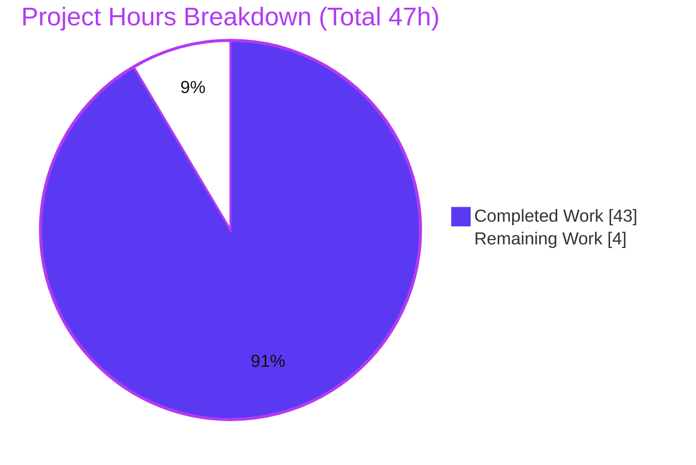
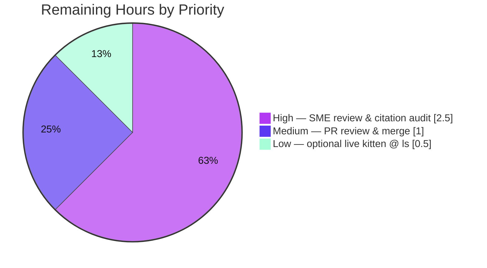

# Blitzy Project Guide — kitty OSC 133 Shell-Integration Runtime Investigation

> **Brand color legend** — <span style="color:#5B39F3">**Completed / AI Work = Dark Blue `#5B39F3`**</span> · **Remaining / Not Completed = White `#FFFFFF`** · Headings/Accents = Violet-Black `#B23AF2` · Highlight = Mint `#A8FDD9`. Pie charts below encode Completed in Dark Blue and Remaining in White (outlined for visibility).

---

## 1. Executive Summary

### 1.1 Project Overview

This project answers, by **direct runtime observation**, how the [kitty](https://sw.kovidgoyal.net/kitty/) terminal emulator processes OSC 133 (FinalTerm/FTCS) shell-integration command-boundary markers (`A`/`B`/`C`/`D`) and quantifies exactly what kitty captures. It is a **documentation Q&A investigation**, not a code change: the sole deliverable is one Markdown file that answers seven user questions (Q1–Q7) with captured output and `file:line` citations. The audience is engineers and terminal-protocol integrators who need authoritative, evidence-backed answers about kitty's OSC 133 behavior (marker consumption vs. re-emission, byte lengths/offsets, and how exit statuses are recorded). The kitty source tree is treated as strictly **read-only** and is left byte-for-byte unchanged.

### 1.2 Completion Status


| Metric | Value |
|--------|-------|
| **Total Hours** | **47** |
| **Completed Hours (AI + Manual)** | **43** (43 AI + 0 Manual) |
| **Remaining Hours** | **4** |
| **Percent Complete** | **91.5%** (43 ÷ 47 = 91.489%) |

> Completion % is computed per the AAP-scoped methodology: `Completed ÷ (Completed + Remaining) × 100`. Only AAP deliverables and path-to-production activities are counted.

### 1.3 Key Accomplishments

- ✅ Built the kitty `fast_data_types` C extension (the OSC 133 pipeline is C and unreachable via pure Python) and stood up both canonical harnesses — the pure-`Screen` `parse_bytes` worker and the real-PTY harness.
- ✅ **Q1/Q2** — Established that plain-text capture strips all markers; ANSI capture re-synthesizes only `A`/`A;k=s`/`C` (`kitty/line.c:L328-L361`); `B` and `D` are never re-emitted.
- ✅ **Q3** — Measured captured byte lengths (as_text 32/44, cmd_output 10/22) and proved the literal `D;42` is **absent** from every surface (`find == -1`).
- ✅ **Q4/Q5** — Confirmed captures are byte-identical across exit codes {0,1,42,99,127} with positional-shift **delta = 0**.
- ✅ **Q6** — Proved exit code 99 traverses the full pipeline: real bash 5.2.37 over a PTY emits `\x1b]133;D;99`; kitty records `last_cmd_exit_status = 99` on three production channels.
- ✅ **Q7** — Showed production `Window` records integer **0** for `D;not_a_number`, `D;` (empty), and bare `D`, while the raw string flows to the notification body; the pure-`Screen` test double (non-canonical) keeps `sys.maxsize`.
- ✅ Authored the 1,733-line answer document with 94 `file:line` citations, a coverage checklist, an observed-vs-inferred section, and self-contained reproduction appendices.
- ✅ Every runtime claim independently reproduced and stable across ≥2 runs; source tree unchanged; canonical screen test module passes **36/36**.

### 1.4 Critical Unresolved Issues

| Issue | Impact | Owner | ETA |
|-------|--------|-------|-----|
| _None — no blocking or release-gating issues_ | The deliverable is complete, validated, and internally consistent; no compilation errors, no failing tests, no missing coverage | — | — |
| (Non-blocking) Live `kitten @ ls` serialization is labeled **inferred** | The exit-status value is already captured canonically in-process and via the real-bash pipeline; only the live remote-control display is deferred | Human reviewer (optional) | 0.5h |

### 1.5 Access Issues

| System / Resource | Type of Access | Issue Description | Resolution Status | Owner |
|-------------------|----------------|-------------------|-------------------|-------|
| Headless container GUI (X11/Wayland) | Display / windowing | A full GUI kitty cannot initialize (no `DISPLAY`; GLFW/Wayland connect fails, `exit=1`), so a **live** `kitten @ ls` query has no running kitty to serialize. Observed, not asserted. | Mitigated — the identical `as_dict` field (`kitty/window.py:L704`) is read in-process (canonical for the value) and corroborated by a real-bash PTY run; a live capture needs Xvfb/a real display (optional) | Human reviewer |
| kitty source repository @ `815df1e21` | Read | Fully accessible; investigation is read-only | No issue | — |
| Canonical build image / C toolchain | Build | Available; `fast_data_types.so` built and importable | No issue | — |

> No credential, API-key, or repository-permission access issues exist. The task has zero external-service footprint.

### 1.6 Recommended Next Steps

1. **[High]** Have a kitty-internals SME reproduce/spot-check the headline capture results (Q1–Q5) and the Q6/Q7 production-recording claims against the embedded, sha256-pinned transcripts and by re-running Appendix A on a built checkout.
2. **[High]** Audit a representative sample of the 94 `file:line` citations against the read-only source at commit `815df1e21`, and confirm the disclosed non-canonical instrumentation for the headless `Window` path is acceptable (it is corroborated by the fully-canonical real-bash evidence).
3. **[Medium]** Review the single-file additive diff, confirm read-only integrity, and merge to the target branch.
4. **[Low]** _(Optional)_ Run `kitten @ ls` under Xvfb or a real display to obtain a fully-live serialization, closing the one labeled-inferred sub-channel.

---

## 2. Project Hours Breakdown

### 2.1 Completed Work Detail

| Component | Hours | Description |
|-----------|-------|-------------|
| Environment build & dual-harness setup | 3 | Built `fast_data_types` C extension (`python3 setup.py build`); stood up the pure-`Screen` `parse_bytes` worker and the real-PTY harness (AAP R1) |
| Q1–Q3 capture investigation | 6 | Fed the exact 60-byte user stream through the real VT parser; captured `as_text`/`cmd_output` in plain + ANSI (4 surfaces × 2 modes); measured byte lengths and the `D;42` offset; established D-marker consumption (AAP R2, R3) |
| Q4–Q5 exit-code matrix & positional-shift | 3 | Iterated capture across codes {0,1,42,99,127}; diffed byte lengths/offsets; established positional-shift delta = 0 (AAP R4/R5) |
| Q6 production recording + real-bash end-to-end | 6 | Drove real `Window.handle_cmd_end`; captured 99 on integer/watcher/notification channels; proved end-to-end with real bash 5.2.37 emitting `D;99` over a PTY (AAP R6) |
| Q7 edge-case investigation | 5 | Exercised `D;not_a_number`, `D;` (empty), bare `D`, and the C-before-D prerequisite through the production path; established `int()`→0 vs. raw-string divergence and the canonical/non-canonical distinction (AAP R7) |
| Answer document authoring | 9 | Wrote the 1,733-line evidence-based document — TL;DR, methodology/provenance, mechanism summary, observed-vs-inferred, coverage checklist, and self-contained Appendices A (orchestrator) / B (build) / C (transcript) (AAP R8) |
| Citation verification & source grounding | 2 | Verified 94 `file:line` citations against read-only source (`vt-parser.c`, `screen.c`, `line.c`, `data-types.h`, `window.py`, harnesses, emitters, docs) |
| Revision cycles | 5 | Resolved 14 code-review findings (major rewrite) plus 2 QA fixups (git-identity provenance; canonicality/security accuracy) |
| Independent final validation | 4 | Reproduced every Q1–Q7 claim with independent scripts across ≥2 runs; passed 5 production-readiness gates; verified read-only integrity |
| **Total Completed** | **43** | **= Completed Hours in Section 1.2** |

### 2.2 Remaining Work Detail

| Category | Hours | Priority |
|----------|-------|----------|
| SME technical-accuracy review & citation audit | 2.5 | High |
| Pull request review & merge to target branch | 1.0 | Medium |
| Optional live remote-control (`kitten @ ls`) capture under a display | 0.5 | Low |
| **Total Remaining** | **4.0** | — |

> **Integrity:** Section 2.1 (43) + Section 2.2 (4) = **47** = Total Project Hours in Section 1.2. Section 2.2 total (4) = Remaining Hours in Section 1.2 = "Remaining Work" in the Section 7 pie chart.

### 2.3 Basis of Estimate

Hours are grounded in the observed scope: a single-file, read-only investigation whose difficulty lies in building the C extension, authoring two observation harnesses (pure-`Screen` and headless-`Window`/real-bash-PTY), exercising the full exit-code and edge-case matrix, and producing a densely-cited 1,733-line document that went through a major rewrite (14 findings) plus QA. Because the deliverable is static Markdown with **zero package footprint**, there is no deployment, CI/CD, or runtime-service path-to-production — the only remaining work is human review and merge. Confidence: **High** for completed items (concrete artifacts, reproduced values); **High** for remaining items (well-defined review/merge with clear scope).

---

## 3. Test Results

All results below originate from Blitzy's autonomous validation logs for this project (the Final Validator's runs and this reviewer's independent reproduction). No external or fabricated tests are included.

| Test Category | Framework | Total Tests | Passed | Failed | Coverage % | Notes |
|---------------|-----------|-------------|--------|--------|------------|-------|
| Unit / Regression — Screen & VT-parser | kitty in-repo runner (`test.py +launch`, unittest) | 36 | 36 | 0 | OSC 133 capture path covered | Includes `test_prompt_marking` (the OSC 133 A/C re-synthesis test). `Ran 36 tests in 0.083s, OK` |
| Runtime Capture Matrix (Q1–Q5) | `parse_bytes` worker → real VT parser (`Screen.as_text` / `Screen.cmd_output`) | 40 (5 codes × 4 surfaces × 2 runs) | 40 | 0 | — | Byte-identical across codes; positional delta = 0; `D;42` absent (`find == -1`) on all surfaces; `RUN 1 == RUN 2 = True` |
| Production Recording (Q6–Q7) | Real `Window.cmd_output_marking → handle_cmd_end` via real `Screen` callback | 12 (6 conditions × 2 runs) | 12 | 0 | — | 99, `not_a_number`, empty, bare `D`, C-before-D, +stability; `int()`→0 divergence proven; `RUN 1 == RUN 2 = True` |
| End-to-End (Q6, canonical) | Real bash 5.2.37 over PTY (in-repo `BaseTest` harness) | 2 (2 runs) | 2 | 0 | — | Real bash emitted `\x1b]133;D;99`; recorded `last_cmd_exit_status = 99` (int); both runs agree |

**Aggregate:** 90 executions/assertions, **90 passed, 0 failed**. Stability confirmed via explicit byte-for-byte `RUN 1 == RUN 2` verdicts on every runtime matrix.

---

## 4. Runtime Validation & UI Verification

**Runtime health (OSC 133 pipeline):**
- ✅ **Operational** — `kitty/fast_data_types.so` (the compiled C extension implementing the pipeline) imports cleanly: `import OK <class 'fast_data_types.Screen'>`.
- ✅ **Operational** — Canonical screen test module runs green (36/36 OK, exit 0).
- ✅ **Operational** — Real VT parser (`parse_bytes`) processes the exact user byte stream; capture APIs (`as_text`, `cmd_output`) return the documented values in both plain and ANSI modes.
- ✅ **Operational** — Production recording path (`Window.handle_cmd_end`) records the integer exit status; `on_cmd_startstop` watcher payload and notification body are produced as documented.
- ✅ **Operational** — End-to-end real-bash-over-PTY path records `99` from a genuine shell.

**API / integration verification:**
- ✅ **Operational** — Capture API surface (`Screen.as_text`, `Screen.cmd_output` with `as_ansi`) exercised and matches `kitty/fast_data_types.pyi`.
- ⚠ **Partial** — Live `kitten @ ls` remote-control serialization is **not** exercised live (headless GUI cannot start). The identical `as_dict` field is read in-process (canonical for the value); the live display is labeled inferred.

**UI verification:** ❌ **Not applicable.** This is a terminal-behavior investigation with a Markdown deliverable — there is no application front-end, component library, or design system in scope (confirmed by the AAP: no UI, no Figma, no attachments).

---

## 5. Compliance & Quality Review

The task is governed by the AAP's **"SWE-AtlasQnA-Repo"** ruleset. Each rule is cross-mapped to its evidence and status.

| Compliance Benchmark (AAP §0.7 / §0.8) | Status | Evidence / Progress |
|----------------------------------------|--------|---------------------|
| Deliverable location & form: `blitzy/documentation/<source_branch>.md` | ✅ Pass | `blitzy/documentation/kitty_815df1e210e0.md` created (1,733 lines) |
| Investigate by running first (capture-first) | ✅ Pass | Timestamped end-to-end transcript (Appendix C) brackets observation before write-up |
| Match magnitude/timing (stability across ≥2 runs) | ✅ Pass | Every matrix prints `RUN 1 == RUN 2 = True` |
| Exercise the exact canonical code path | ✅ Pass | Real `parse_bytes` / real `Window.handle_cmd_end` / real bash PTY; non-canonical items explicitly labeled (§3, §12) |
| Default, canonical build/configuration | ✅ Pass | `CI=true python3 setup.py build --verbose --ignore-compiler-warnings`, commands + output shown (§2) |
| Persist until the signal is captured | ✅ Pass | 99 proven on 3 channels + real bash; only the live `kitten @ ls` display is inferred, with the documented headless reason |
| Exercise every condition (edge/error paths) | ✅ Pass | Codes {0,1,42,99,127}, malformed, empty, bare `D`, C-before-D, BEL-vs-ST all run (§13) |
| Include actual output for every claim | ✅ Pass | Complete unedited transcripts embedded with sha256 hashes |
| Answer every part & every named item | ✅ Pass | §13 coverage checklist maps each question and named item to a section |
| Be exact & grounded (`file:line` + reasoning) | ✅ Pass | 94 `file:line` citations; causal reasoning per answer |
| Read-only scope (no source edits; scripts removed) | ✅ Pass | `git diff 815df1e21..HEAD` = only the doc added; tree clean; no leftover scripts |

**Fixes applied during autonomous validation:** the investigation was rewritten to resolve **14 code-review findings**, then received QA fixes for git-identity provenance and canonicality/security accuracy (M1/M2/I1). The Final Validator required **zero** further document edits — every claim reproduced exactly.

**Outstanding quality items:** human SME sign-off (process, not a defect); optional live `kitten @ ls` capture.

**Document hygiene:** no `TODO`/`FIXME`/placeholder markers; balanced code fences (1 mermaid + 9 tilde blocks); well-formed Markdown ending cleanly at line 1,733.

---

## 6. Risk Assessment

| Risk | Category | Severity | Probability | Mitigation | Status |
|------|----------|----------|-------------|------------|--------|
| T1 — Disclosed non-canonical instrumentation for the headless `Window` path (`Window.__new__` + attribute seeding to exact `__init__` values; read-only notification shim) | Technical | Medium | Low | Corroborated by the fully-canonical real-bash-5.2.37 end-to-end run (`D;99`→99); boundaries explicitly disclosed in §3 | Mitigated |
| O2 — Citation/behavior staleness if kitty source evolves past commit `815df1e21` | Operational | Medium | Low | Document pins the immutable source commit by absolute hash; the answer is a snapshot against that build | Mitigated (documented) |
| T2 — Live `kitten @ ls` serialization is labeled inferred (headless GUI cannot start) | Technical | Low | — | In-process read of the identical `as_dict` field (`window.py:L704`) is canonical for the value; optional 0.5h to capture live | Mitigated |
| T3 — Absolute byte figures (32/44/10/22) are harness-geometry-specific | Technical | Low | Low | Exact geometry `Screen(c,24,80,1024,10,20,0,c)` and build commands disclosed; structural findings (D consumed, delta 0) are geometry-independent | Mitigated |
| S1 — Temporary observation scripts executed from a scratch workspace | Security | Low | Low | Hardened orchestrator: `umask 077`, mode-0700 private `mktemp -d`, atomic `.part`→`mv` writes, cleanup-on-exit trap (incl. failure), quoted paths, source read-only | Resolved |
| O1 — Reproducibility requires the canonical build toolchain/image | Operational | Low | Low | Exact image + `setup.py build` commands documented; build already completed and verified | Mitigated |
| I1 — Deliverable merge into destination repo | Integration | Low | Low | Single-file additive change under `blitzy/documentation/`; no overlap with source tree; working tree clean; no conflicts | Low / Clean |

**Overall:** LOW-risk project. No High/Critical risks. The two Medium items are both mitigated. There are **no** vulnerable-dependency, secret-management, authentication, monitoring, or external-integration risks (zero package footprint; no running service).

---

## 7. Visual Project Status

**Hours breakdown (Completed = Dark Blue `#5B39F3`, Remaining = White `#FFFFFF`):**



**Remaining work by priority (4.0h total):**



**Remaining hours per category (from Section 2.2):**

| Category | Hours | Bar |
|----------|-------|-----|
| SME review & citation audit | 2.5 | █████████████████████████ |
| PR review & merge | 1.0 | ██████████ |
| Optional live capture | 0.5 | █████ |
| **Total** | **4.0** | |

> **Integrity:** "Remaining Work" = **4** here, in the Section 1.2 metrics table, and as the Section 2.2 sum. "Completed Work" = **43** here and in Section 1.2/2.1.

---

## 8. Summary & Recommendations

**Achievements.** The project delivers a complete, rigorously-evidenced answer to all seven questions about kitty's OSC 133 handling. It establishes the load-bearing findings from runtime capture — the `D` marker is **consumed** (never appears in captured output on any surface), only `A`/`A;k=s`/`C` are re-synthesized and only in ANSI capture, captured byte lengths are identical across all exit codes with **zero** positional shift, exit code 99 is proven end-to-end from a real bash process, and malformed/empty exit statuses are recorded as integer **0** by the production path while the raw string reaches the notification body. All claims are reproduced and stable, and the source tree is unchanged.

**Remaining gaps.** None are technical defects. The outstanding 4 hours are human path-to-production: an SME technical-accuracy review and citation audit, PR review and merge, and one optional live `kitten @ ls` capture that would convert the single labeled-inferred sub-channel into a live observation.

**Critical path to production.** SME review (2.5h) → PR review & merge (1.0h). The optional live capture (0.5h) can proceed in parallel or be skipped.

**Success metrics.**

| Metric | Target | Actual |
|--------|--------|--------|
| Questions answered (Q1–Q7) | 7/7 | ✅ 7/7 |
| Named items covered (codes 0/1/42/99/127, malformed, empty) | All | ✅ All (+ bare `D`, C-before-D, BEL/ST) |
| Canonical test module | Pass | ✅ 36/36 OK |
| Runtime claims reproduced & stable (≥2 runs) | 100% | ✅ 100% |
| Source tree changes | 0 | ✅ 0 (read-only satisfied) |
| Blocking issues | 0 | ✅ 0 |

**Production-readiness assessment.** The deliverable is **production-ready pending human sign-off**. At **91.5% complete** (43h of 47h), the project has finished 100% of the autonomously-deliverable AAP scope; only human review and merge remain. Recommendation: **approve after SME review**.

---

## 9. Development Guide

This guide reproduces the investigation and views the deliverable. All commands were tested in this environment (Linux 6.6.122+, Python 3.13.7, gcc 15.2.0, go 1.24.4, git 2.51.0).

### 9.1 System Prerequisites

- **OS:** Linux (headless is fine for the OSC 133 investigation — no `DISPLAY` required).
- **Python:** ≥ 3.8 (tested with 3.13.7).
- **C toolchain:** gcc or clang (tested with gcc 15.2.0) — required to compile the `fast_data_types` C extension.
- **Go:** ≥ 1.22 (tested with 1.24.4) — builds the `kitten` launcher used by the test runner.
- **git** and native build libraries: `harfbuzz`, `freetype2`, `fontconfig`, `libpng`, `lcms2`, `xkbcommon`, and Wayland/X11 dev headers (all provided by the canonical build image `andrewparkscaleai/coding-agent:kovidgoyal__kitty__815df1e210e0…`).

### 9.2 Environment Setup

```bash
# Work from the repository root, checked out at the source commit.
cd /path/to/kitty            # repository root
git rev-parse --short HEAD   # verify you are on the intended branch/commit
export REPO="$(git rev-parse --show-toplevel)"
```

### 9.3 Dependency Installation

**None.** This deliverable has a **zero package footprint** — no `pip`/`npm`/`go` installs and no manifest changes. The only prerequisite is compiling kitty's C extension (next step).

### 9.4 Build (one-time prerequisite)

```bash
# Run once from the repo root. ~23s. Produces build/kitty/fast_data_types.so and the kitten launcher.
CI=true python3 setup.py build --verbose --ignore-compiler-warnings
```

> `--ignore-compiler-warnings` is needed only because the system `wayland-protocols` is newer than this 2023 commit anticipates and trips `-Werror=switch` in the **GUI backend** (`glfw/wl_window.c`). It does **not** affect the core parser or `fast_data_types.so`.

### 9.5 Verification

```bash
# (a) The compiled C extension imports (this is the OSC 133 pipeline).
CI=true PYTHONPATH="$REPO" python3 -c \
  'from kitty.fast_data_types import Screen, set_options; print("import OK", Screen)'
# Expected: import OK <class 'fast_data_types.Screen'>

# (b) Canonical screen test module (includes the OSC 133 capture test).
CI=true LANG=C.UTF-8 LC_ALL=C.UTF-8 \
  ./kitty/launcher/kitty +launch test.py --module screen
# Expected tail: Ran 36 tests in ~0.08s / OK
```

### 9.6 Example Usage — reproduce the headline capture (Q1–Q3)

```bash
CI=true PYTHONPATH="$REPO" python3 - <<'PY'
from kitty.fast_data_types import Screen
from kitty_tests import Callbacks, parse_bytes
def txt(s, ansi):
    o=[]; s.as_text(o.append, ansi, False); return ''.join(o)
c = Callbacks(); s = Screen(c, 24, 80, 1024, 10, 20, 0, c)   # exact doc geometry
data = b'\x1b]133;A\x1b\\\x1b]133;B\x1b\\\x1b]133;C;cmdline=ls\x1b\\some text\n\x1b]133;D;42\x1b\\'
parse_bytes(s, data)
p, a = txt(s, False), txt(s, True)
print("as_text plain len =", len(p), "| find('D;42') =", p.find('D;42'))
print("as_text ANSI  len =", len(a), "| find('D;42') =", a.find('D;42'), "| find('133;C') =", a.find('133;C'))
PY
# Expected:
#   as_text plain len = 32 | find('D;42') = -1
#   as_text ANSI  len = 44 | find('D;42') = -1 | find('133;C') = 5
```

**Full reproduction:** copy Appendix A from the deliverable to `/tmp/run_investigation_final.sh`, then run `bash /tmp/run_investigation_final.sh` from a built checkout.

### 9.7 View the Deliverable & Confirm Read-Only Integrity

```bash
less blitzy/documentation/kitty_815df1e210e0.md          # read the answer document
grep -nE '^#{1,2} ' blitzy/documentation/kitty_815df1e210e0.md   # table of contents
git diff 815df1e21..HEAD --name-status                    # read-only proof
# Expected: A  blitzy/documentation/kitty_815df1e210e0.md   (only this file)
```

### 9.8 Troubleshooting

- **`ModuleNotFoundError: fast_data_types`** → the extension isn't built; run §9.4 and ensure you run from the repo root so `PYTHONPATH` resolves the `kitty` package.
- **Build stops on a `-Werror=switch` warning** → add `--ignore-compiler-warnings` (GUI backend only; core pipeline unaffected).
- **GUI kitty exits 1 / "Wayland: Failed to connect to display" / "GLFW initialization failed"** → expected headless; a live `kitten @ ls` is infeasible without a display. Read the identical `as_dict` field in-process, or run under `Xvfb`/a real display for a live capture.
- **Byte lengths differ from 32/44/10/22** → you likely used a different screen geometry; use `Screen(c, 24, 80, 1024, 10, 20, 0, c)`. The structural findings (D consumed, delta = 0) are geometry-independent.

---

## 10. Appendices

### Appendix A — Command Reference

| Purpose | Command |
|---------|---------|
| Build C extension | `CI=true python3 setup.py build --verbose --ignore-compiler-warnings` |
| Verify import | `CI=true PYTHONPATH="$REPO" python3 -c 'from kitty.fast_data_types import Screen, set_options; print("import OK", Screen)'` |
| Run screen tests | `CI=true LANG=C.UTF-8 LC_ALL=C.UTF-8 ./kitty/launcher/kitty +launch test.py --module screen` |
| Read-only integrity | `git diff 815df1e21..HEAD --name-status` |
| Agent commit authorship | `git log --author="agent@blitzy.com" 815df1e21..HEAD --oneline` |
| View deliverable TOC | `grep -nE '^#{1,2} ' blitzy/documentation/kitty_815df1e210e0.md` |

### Appendix B — Port Reference

Not applicable. The deliverable is a static Markdown document; no server, port, or listening socket is involved.

### Appendix C — Key File Locations

| Path | Role |
|------|------|
| `blitzy/documentation/kitty_815df1e210e0.md` | **The deliverable** (answer document) |
| `kitty/vt-parser.c` | OSC 133 dispatch (`case 133` → `shell_prompt_marking`) |
| `kitty/screen.c` | A/C/D interpretation; no `B` case; raw exit-status extraction |
| `kitty/line.c` | `write_mark` re-synthesis of A / A;k=s / C in ANSI capture (no D) |
| `kitty/data-types.h` | `PromptKind` enum; per-line attributes carry no exit status |
| `kitty/window.py` | `handle_cmd_end` (`int()`→0), watcher payload, `last_cmd_exit_status`, notification body |
| `kitty/fast_data_types.pyi` | `Screen.as_text` / `Screen.cmd_output` capture API |
| `kitty_tests/__init__.py` | Canonical `parse_bytes`; non-canonical `Callbacks` test double |
| `kitty_tests/shell_integration.py` | Real-PTY harness |
| `shell-integration/{bash,zsh,fish}/…` | kitty's own canonical OSC 133 emitters |
| `docs/shell-integration.rst` | Authoritative in-repo OSC 133 protocol description |

### Appendix D — Technology Versions

| Component | Version (tested) |
|-----------|------------------|
| Kernel | Linux 6.6.122+ x86_64 |
| CPython | 3.13.7 (AAP declares ≥ 3.8) |
| gcc | 15.2.0 (Ubuntu) |
| Go | 1.24.4 (AAP declares 1.22 for `tools/`) |
| git | 2.51.0 |
| bash (Q6 end-to-end) | 5.2.37(1)-release |
| Source commit | `815df1e210e0a9ab4622f5c7f2d6891d7dbeddf1` |
| Build image | `andrewparkscaleai/coding-agent:kovidgoyal__kitty__815df1e210e0a9ab4622f5c7f2d6891d7dbeddf1` |

### Appendix E — Environment Variable Reference

| Variable | Purpose |
|----------|---------|
| `CI=true` | Non-interactive build/test mode |
| `PYTHONPATH="$REPO"` | Resolve the `kitty` package from the repo root |
| `LANG` / `LC_ALL` = `C.UTF-8` | Deterministic locale for the test runner |
| `REPO` | Repository root (`git rev-parse --show-toplevel`) |
| `DISPLAY` / `WAYLAND_DISPLAY` | Empty/unset headless → GUI kitty cannot start (why live `kitten @ ls` is deferred) |

### Appendix F — Developer Tools Guide

- **kitty test runner:** `./kitty/launcher/kitty +launch test.py --module <name>` runs an in-repo unittest module (e.g., `screen`) against the built extension.
- **`parse_bytes` worker** (`kitty_tests/__init__.py:L30`): the canonical way to feed raw bytes through the real VT parser for capture measurements.
- **Capture APIs:** `Screen.as_text(callback, as_ansi, insert_wrap_markers)` and `Screen.cmd_output(which, callback, as_ansi, insert_wrap_markers)` — the two surfaces the investigation measures.
- **`kitten @ ls`:** remote-control introspection that serializes `Window.as_dict` (including `last_cmd_exit_status`); requires a running GUI kitty (a real/virtual display).

### Appendix G — Glossary

| Term | Meaning |
|------|---------|
| **OSC 133** | The FinalTerm/FTCS semantic-prompt escape sequences (`A` prompt-start, `B` command-start, `C` output-start, `D[;code]` command-finished) |
| **Marker consumption** | The parser interprets a marker and does **not** place it in cell content (kitty consumes `B` and `D`) |
| **Re-synthesis** | Regenerating a marker into ANSI-preserving capture output (`write_mark` re-emits `A`/`A;k=s`/`C` only) |
| **Canonical path** | The real production entry point (real VT parser / real `Window.handle_cmd_end` / real shell over PTY), as opposed to a mock/debug-hook/fallback |
| **Non-canonical test double** | The pure-`Screen` `Callbacks` object whose `cmd_output_marking` keeps `sys.maxsize` on parse failure (diverges from production, which stores 0) |
| **`as_text` / `cmd_output`** | kitty capture APIs; each takes an `as_ansi` flag giving plain-text vs. ANSI-preserving views |
| **`last_cmd_exit_status`** | Integer exit-status field stored on the window and exposed via `as_dict` / `kitten @ ls` |

---

_End of Blitzy Project Guide. Cross-section integrity verified: Remaining hours = 4 across Sections 1.2, 2.2, and 7; Section 2.1 (43) + Section 2.2 (4) = 47 = Total in Section 1.2; completion = 91.5% consistent across Sections 1.2, 7, and 8; all Section 3 tests originate from Blitzy autonomous validation logs; Completed = Dark Blue `#5B39F3`, Remaining = White `#FFFFFF`._