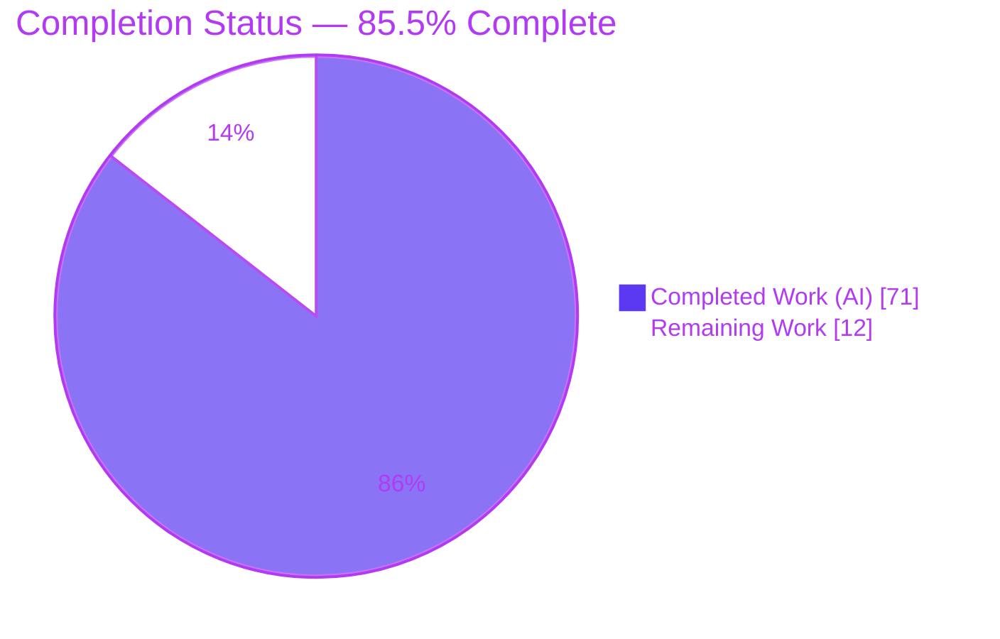
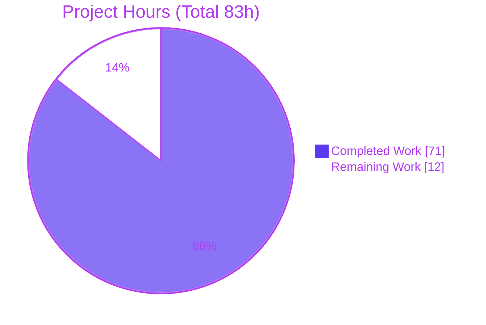
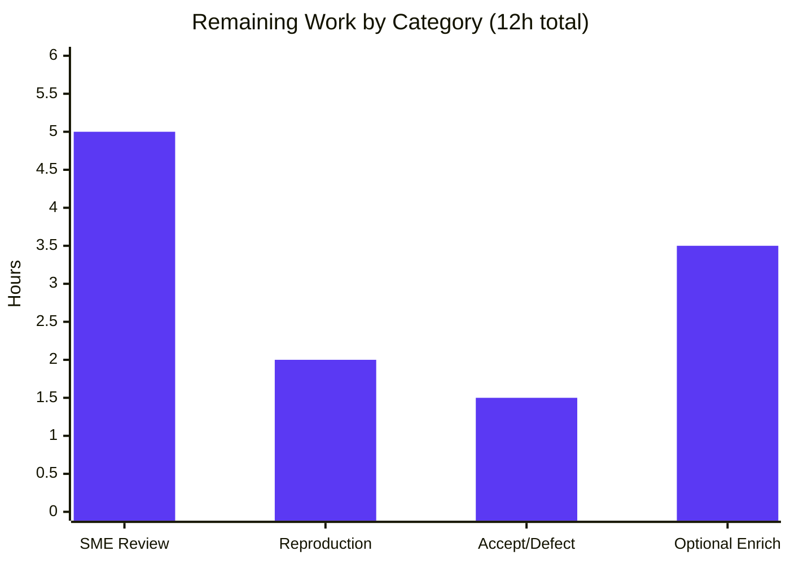

# Blitzy Project Guide — Kitty "diff kitten" Runtime-Evidenced Documentation

> **Brand legend** — <span style="color:#5B39F3">**Completed / AI Work = Dark Blue (#5B39F3)**</span> · Remaining / Not Completed = White (#FFFFFF) · Headings/Accents = Violet-Black (#B23AF2) · Highlight = Mint (#A8FDD9)

---

## 1. Executive Summary

### 1.1 Project Overview

This project delivers a single, comprehensive documentation artifact that explains how the Kitty terminal's **"diff kitten"** (`kitty +kitten diff <left> <right>`) actually behaves at runtime, authored for a newly onboarding engineer. It answers eight technical sub-questions — directory pairing, rename recognition, the caching pipeline, concurrent multi-file processing, parallel-highlighting safety, binary/image handling, an end-to-end runtime trace, and the matching-region diff algorithm — with **runtime-observed evidence** captured through the canonical entry point and inline `file:line` citations. It is a read-only investigation: the sole deliverable is one Markdown file (`blitzy/documentation/kitty_815df1e210e0.md`), and no source file is changed. The business impact is faster, higher-confidence onboarding onto a complex polyglot subsystem.

### 1.2 Completion Status



| Metric | Hours |
|---|---|
| **Total Hours** | **83** |
| **Completed Hours (AI + Manual)** | **71** (AI = 71, Manual = 0) |
| **Remaining Hours** | **12** |
| **Percent Complete** | **85.5%** |

> Completion is computed with the PA1 AAP-scoped hours method: `71 / (71 + 12) = 85.54% → 85.5%`.

### 1.3 Key Accomplishments

- ✅ Authored a 2,230-line, runtime-evidenced answer to **all eight** questions (Q1–Q8), each with `[OBSERVED]` captured output next to every behavioral claim.
- ✅ Built a reproducible investigation harness (PTY capture driver, VT-frame reconstructor, color-run analyzers, fixture generator, differ shims) — all outside the source tree.
- ✅ Exercised the **canonical** entry point `kitty +kitten diff` across text / binary / image inputs and `diff`/`add`/`removal`/`rename`/mode-only item types.
- ✅ Demonstrated exhaustive branch coverage: true rename vs. hash-mismatch; builtin vs. `git` vs. `diff` vs. the full `auto → git → diff → builtin` fallback chain.
- ✅ **Web-validated** the builtin algorithm against Go's `internal/diff` (anchored/patience, O(n log n)) and diffed the kitten's copy against upstream.
- ✅ ~211 `file:line` citations (136 unique) verified against source; several AAP off-by-one line numbers were corrected.
- ✅ Source tree kept **byte-for-byte unchanged** (`git status --porcelain` empty); all temporary artifacts removed.
- ✅ Independent re-verification this session: `go build`, `go test`, and `go test -race` all pass (EXIT 0).

### 1.4 Critical Unresolved Issues

| Issue | Impact | Owner | ETA |
|---|---|---|---|
| Human SME technical review not yet performed | Documentation cannot be accepted to "production" (merge) without expert sign-off | Kitty/diff-kitten SME | 0.5–1 day |
| Three behaviors labeled `[INFERRED]` (plain-first render ordering, image pixel transmit, rename collision-reject) | Not surfaced at the canonical entry point in a headless/offline env; permitted by Rule 1 but optionally enrichable | Reviewer (optional) | Optional |
| Documented upstream concurrency defect (`tools/utils/cache.go:34`) | Pre-existing crash under very high concurrent file volume; **out of scope to fix** here | Upstream Kitty maintainers | Follow-up issue |

### 1.5 Access Issues

| System/Resource | Type of Access | Issue Description | Resolution Status | Owner |
|---|---|---|---|---|
| Build/run container `kitty-diff-env` | Docker exec | None — container is running and operational (Go 1.23.4, built launcher) | Resolved | Platform |
| Source repository | Read/write (git) | None — clean working tree, deliverable committed | Resolved | Platform |
| Web (Go `internal/diff` docs) | Read | None — algorithm characterization validated | Resolved | — |

No blocking access issues identified.

### 1.6 Recommended Next Steps

1. **[High]** Perform SME technical review of all eight answers against the diff-kitten source (accuracy + clarity).
2. **[High]** Spot-check a sample of the `file:line` citations on the frozen branch.
3. **[Medium]** Independently reproduce a representative subset of runtime captures (rebuild via `python3 setup.py`).
4. **[Medium]** Accept/merge the documentation, and file an upstream issue for the documented `cache.go:34` defect.
5. **[Low]** Optionally elevate the three `[INFERRED]` items to `[OBSERVED]` in a richer environment.

---

## 2. Project Hours Breakdown

### 2.1 Completed Work Detail

| Component | Hours | Description |
|---|---|---|
| Runtime harness & container build | 12 | `setup.py` codegen build; PTY capture driver (`ptycap.py`), VT reconstructor (`vtframes.py`), color-run/graphics analyzers (`sgruns.py`, `fgcolors.py`, `gkeys.py`), `make_fixtures.sh`, differ shims |
| Q1 — Directory pairing | 4 | Fixtures F1/F1b/NF; relative-path `Intersect`; add/removal/mode-only; nested-dir pairing; no-fuzzy-match counter-case |
| Q2 — Rename recognition | 4 | Fixtures F2 (rename) / F3 (hash-mismatch); MD5 + full-content re-check; `md5sum` corroboration |
| Q3 — Caching pipeline & efficiency | 6 | 8 `LRUCache`s (cap 4096); layered derive-once-memoize; progress→rerender frames; fg-palette highlight signal; eviction/concurrent-miss probe |
| Q4 — Concurrent multi-file processing | 3 | 60-file fixture F4 ×2; async fan-out; buffered `async_results` channel |
| Q5 — Parallel highlighting safety | 8 | 30 plain runs; threshold sweep; `-race` ×2; NumCPU worker-cap probe; concurrency crash characterization |
| Q6 — Binary & image handling | 6 | F5/BADD/BREM/F6/IMGBAD; `is_image`/`is_path_text` gating; `binary_lines`/`image_lines`; graphics APC classification |
| Q7 — End-to-end runtime trace | 5 | F1/F4/F7/F9/MIX capstone; config-default verification; progress→enriched trace stages |
| Q8 — Matching-region algorithm + web-validation | 8 | F7 ×4 modes + PATH shims; full auto-fallback chain; external `mydiff` + `_CONTEXT_` substitution; F8 changed-center; upstream `internal/diff` comparison |
| Error & config edge cases | 2 | 8-case matrix (args, dir-vs-file, missing path, unknown/bad overrides, bad `diff_cmd`) |
| Authoring & consolidation | 4 | Answer prose, coverage-pass checklist, honest-limitations, Markdown structure |
| Citation accuracy pass | 3 | ~211 citations verified; corrected AAP off-by-one line numbers |
| QA/validation fix rounds + cleanliness | 6 | 6 iterative commits; source-unchanged + artifact-removal verification |
| **Total** | **71** | |

### 2.2 Remaining Work Detail

| Category | Hours | Priority |
|---|---|---|
| Human SME technical review of all 8 answers + citation spot-check | 5 | High |
| Independent reproduction of representative runtime captures (rebuild + re-run) | 2 | Medium |
| Acceptance/merge sign-off + disposition of documented concurrency defect | 1.5 | Medium |
| Optional enrichment: elevate 3 `[INFERRED]` items to `[OBSERVED]` | 3.5 | Low |
| **Total** | **12** | |

### 2.3 Hours Reconciliation

- Section 2.1 completed = **71h**; Section 2.2 remaining = **12h**; **71 + 12 = 83h** = Total (Section 1.2). ✔
- Remaining **12h** is identical in Sections 1.2, 2.2, and 7. ✔
- Completion = `71 / 83 = 85.5%`. ✔

---

## 3. Test Results

All entries originate from Blitzy's autonomous validation logs and were independently re-run this session inside the `kitty-diff-env` container.

| Test Category | Framework | Total Tests | Passed | Failed | Coverage % | Notes |
|---|---|---|---|---|---|---|
| Unit | Go `testing` + `google/go-cmp` | 1 | 1 | 0 | N/A | `TestDiffCollectWalk` (collect/rename walk) → `ok 0.021s` |
| Concurrency / Race | Go `testing` `-race` | 1 | 1 | 0 | N/A | `TestDiffCollectWalk` under `-race` → `ok 1.105s`, race-clean |
| Compilation | `go build` | 1 | 1 | 0 | N/A | `GOPROXY=off go build ./kittens/diff/` → EXIT 0 |
| Runtime / Functional | Canonical `kitty +kitten diff` via PTY | 8 Q-scenarios (F1–F9 + BADD/BREM/IMGBAD/MIX/NF) | 8 | 0 | N/A | All eight questions reproduced; `--help` prints documented usage; real side-by-side diffs rendered |

> **Integrity:** the diff kitten ships a single targeted Go unit test; behavior is otherwise validated at runtime through the canonical entry point (there is no coverage-instrumented suite, hence Coverage = N/A). The documented data race under `-race` is a **pre-existing upstream defect** surfaced by (not introduced by) this investigation; the package's own unit test remains race-clean.

---

## 4. Runtime Validation & UI Verification

- ✅ **Build (`python3 setup.py` → `go build`)** — Operational; EXIT 0 after code generation.
- ✅ **Canonical entry point `kitty +kitten diff --help`** — Operational; prints `kitten diff [options] file_or_directory_left file_or_directory_right`.
- ✅ **Directory diff rendering** — Operational; side-by-side TUI renders file headers, hunk headers (`@@ -3,5 +3,6 @@`), add/removal/mode-change lines.
- ✅ **Rename detection** — Operational; byte-identical file at a new relative path renders as a single rename.
- ✅ **Backend selection** — Operational; `builtin` (no subprocess), `git` (`-U3 --no-index`), `diff` (`-p -U 3`), and `auto` fallback all observed via PATH shims.
- ✅ **Binary/image handling** — Operational; binary summary + add/removal halves; image dimensions/size; malformed image → graceful "Failed to load image…" (no crash).
- ✅ **Concurrency** — Operational at normal scale (60 files, ×2 stable).
- ⚠ **Concurrency at very high volume** — Partial; a **pre-existing** upstream data race (`tools/utils/cache.go:34`) can crash the kitten under a large number of simultaneous highlight writes. Documented, out of scope to fix.
- ⚠ **Three `[INFERRED]` behaviors** — Partial (by environment): plain-first render ordering, image pixel transmit/display, and the rename collision-reject branch were not surfaceable headlessly/offline; each is honestly labeled with its reason.

---

## 5. Compliance & Quality Review

| AAP Deliverable / Rule | Benchmark | Status | Progress |
|---|---|---|---|
| Q1–Q8 answered with runtime evidence + `file:line` | Rule 4 (grounded, complete) | ✅ Pass | ██████████ 100% |
| Canonical entry point used (`kitty +kitten diff`) | Rule 1 (run-first, canonical) | ✅ Pass | ██████████ 100% |
| Observed-output shown next to each claim; no paraphrase | Rule 3 | ✅ Pass | ██████████ 100% |
| `[OBSERVED]` / `[INFERRED]` / `[NON-CANONICAL]` labeling | Rule 3 | ✅ Pass | ██████████ 100% |
| Exhaustive branch/condition coverage (item types, differs, content types) | Rule 2 | ✅ Pass | ██████████ 100% |
| Before/during/after state for stateful behavior | Rule 2 | ✅ Pass (frame-level; one micro-transition inferred) | █████████░ 95% |
| Web-validation of the builtin algorithm | Special instruction | ✅ Pass | ██████████ 100% |
| New file at `blitzy/documentation/<branch>.md` | Main Rule | ✅ Pass | ██████████ 100% |
| Source repository byte-for-byte unchanged | Main Rule / §0.5.2 | ✅ Pass | ██████████ 100% |
| Temporary fixtures/scripts removed | Main Rule | ✅ Pass | ██████████ 100% |
| Coverage-pass over all questions & named items | Rule 4 | ✅ Pass | ██████████ 100% |

**Fixes applied during autonomous validation:** citation re-alignment (AAP off-by-one corrections), embedding of the `sgruns.py` helper, `bash`-not-`python3` invocation fix for `make_fixtures.sh`, and reproducibility fixes (F8 fixture `mkdir`). The final validation session found the deliverable accurate on every axis and required **zero** further edits.

**Outstanding:** human SME sign-off; optional enrichment of the three `[INFERRED]` items.

---

## 6. Risk Assessment

| Risk | Category | Severity | Probability | Mitigation | Status |
|---|---|---|---|---|---|
| Pre-existing concurrency defect `cache.go:34` (`Set` writes map under `RLock`) can crash under very high concurrent volume | Technical | Medium | Low | Documented in Q3/Q5; out of scope to fix; file upstream issue | Documented |
| `file:line` citation drift if source is later modified | Technical | Low | Low | Citations pinned to frozen branch `kitty_815df1e210e0` (base `815df1e21`) | Mitigated |
| Three `[INFERRED]` behaviors not observed at canonical entry point | Technical | Low | Medium | Honestly labeled per Rule 1; optional enrichment path documented | Accepted |
| Reproducibility depends on the ephemeral build container | Operational | Low-Med | Medium | Full rebuild documented in Section 9; commands reproducible | Mitigated |
| Inherent nondeterminism (concurrency completion order, frame counts) | Operational | Low | Medium | Labeled nondeterministic; stability confirmed across ≥2 runs | Documented |
| Documentation placement on upstream merge | Integration | Low | Low | Additive file only; zero source files touched → no conflicts | Low |
| Availability flavor of the documented crash | Security | Low | Low | Pre-existing upstream, not introduced here; documented | Documented |

**Overall risk: LOW** — zero source files changed; build/test/`-race` all pass; deliverable is additive and read-only. No new code, dependencies, secrets, or attack surface introduced.

---

## 7. Visual Project Status



**Remaining hours by category (Section 2.2):**



> **Integrity:** "Remaining Work" = **12h** matches Section 1.2 (Remaining Hours) and the Section 2.2 sum; "Completed Work" = **71h** matches Section 1.2 and the Section 2.1 sum.

---

## 8. Summary & Recommendations

**Achievements.** The project is **85.5% complete**. All eight questions are answered from the canonical `kitty +kitten diff` entry point with unedited captured output and precise `file:line` citations; exhaustive branch coverage (item types, content types, and all four differ backends including the full `auto` fallback chain) is demonstrated; the builtin algorithm is web-validated as an anchored/patience diff running in O(n log n); and the source tree is byte-for-byte unchanged with every temporary artifact removed. Independent re-verification this session reproduced the build, unit test, race test, and canonical `--help` — all green.

**Remaining gaps (12h).** The remainder is dominated by work that is **inherently human**: a subject-matter-expert technical review of the eight answers (5h), independent reproduction of a representative capture subset (2h), and acceptance/merge sign-off plus disposition of the documented upstream defect (1.5h). A further 3.5h is **optional** enrichment to elevate three honestly-labeled `[INFERRED]` behaviors to `[OBSERVED]` in a graphics-capable/throttled/collision-tooled environment.

**Critical path to production.** SME review → citation spot-check → optional reproduction → accept/merge. Because the deliverable is a documentation file with zero source changes, "production" means a reviewed, accepted, and merged onboarding document.

**Production readiness.** The deliverable is **merge-ready pending human review**. It compiles/tests clean, is fully committed (HEAD `81b9d6a87`), is internally consistent, and honestly discloses its own limitations and one pre-existing upstream defect. Per policy, completion is capped below 100% until that human review occurs.

| Metric | Value |
|---|---|
| AAP-scoped completion | 85.5% |
| Completed / Remaining / Total hours | 71 / 12 / 83 |
| Source files changed | 0 |
| Deliverable size | 2,230 lines (132 KB) |
| Questions answered | 8 / 8 |
| Build / Unit / Race | Pass / Pass / Pass |

---

## 9. Development Guide

All commands are executed against the running build/run container `kitty-diff-env` and were tested during this assessment.

### 9.1 System Prerequisites

- **Docker** (daemon running) on the host.
- **Container** `kitty-diff-env` (image `ghcr.io/scaleapi/swe-atlas:swe_atlas_QnA_kovidgoyal_kitty_1.0`) providing **Go 1.23.4** (satisfies `go.mod` `go 1.22`) and **Python 3** to drive `setup.py`.
- A **PTY** is required to run the kitten headlessly (it opens `/dev/tty`).

### 9.2 Environment Setup & Build (code generation is mandatory)

```bash
# Confirm the container is up
docker ps --filter name=kitty-diff-env

# Build: code generation (root kitty package + go:embed targets) THEN Go + C.
# A bare `go build` fails without this step.
docker exec kitty-diff-env bash -lc 'cd /app && python3 setup.py'
```

### 9.3 Verify the Build & Run the Test Suite

```bash
# Compile the diff kitten package
docker exec kitty-diff-env bash -lc 'cd /app && GOPROXY=off go build ./kittens/diff/'          # -> EXIT 0

# Unit test (collection/rename walk)
docker exec kitty-diff-env bash -lc 'cd /app && GOPROXY=off go test -count=1 ./kittens/diff/'   # -> ok  kitty/kittens/diff  0.021s

# Race detector
docker exec kitty-diff-env bash -lc 'cd /app && GOPROXY=off go test -race -count=1 ./kittens/diff/'  # -> ok (race-clean)
```

### 9.4 Run the Diff Kitten (canonical entry point)

```bash
# Documented usage
docker exec kitty-diff-env bash -lc 'cd /app && ./kitty/launcher/kitty +kitten diff --help'
# -> Usage: kitten diff [options] file_or_directory_left file_or_directory_right

# Diff two directories (interactive full-screen TUI)
docker exec -it kitty-diff-env bash -lc 'cd /app && ./kitty/launcher/kitty +kitten diff <LEFT_DIR> <RIGHT_DIR>'

# Config overrides (examples)
#   -o diff_cmd=builtin|git|diff|auto     select the diff backend
#   -o num_context_lines=1                 shrink hunk context
```

> **Quit key:** the kitten speaks the kitty keyboard protocol — the quit key is **`CSI 113 u`** (bytes `1b 5b 31 31 33 75`), **not** a bare `q`. Headless capture drivers must send that sequence and size the PTY window.

### 9.5 Reproduce the Runtime Evidence

The deliverable embeds its own harness in the **Methodology** section: `ptycap.py` (PTY capture), `vtframes.py` (VT-frame reconstruction of synchronized updates), `sgruns.py`/`fgcolors.py`/`gkeys.py` (color-run & graphics-protocol analysis), and `make_fixtures.sh` (fixtures F1–F9 + branch-coverage additions). Recreate the fixtures outside the source tree, run the canonical entry point through `ptycap.py`, and reconstruct frames with `vtframes.py`.

### 9.6 View the Deliverable

```bash
less /tmp/blitzy/kitty/blitzy-563ecbca-453c-452a-819e-24676eb607bc_faea7f/blitzy/documentation/kitty_815df1e210e0.md
```

### 9.7 Troubleshooting

- **`go build` fails with missing `kitty` package / embed targets** → run `python3 setup.py` first (code generation).
- **Capture hangs / kitten won't exit** → send `CSI 113 u`, not `q`; ensure the PTY window is sized (e.g., 120×40).
- **Frame counts differ between runs** → expected; concurrency completion order is nondeterministic. Confirm behavior across ≥2 runs.
- **Non-byte-identical output on re-run** → deterministic items reproduce exactly; concurrency/timing items are qualitatively identical (documented).

---

## 10. Appendices

### A. Command Reference

| Purpose | Command |
|---|---|
| Build (codegen + Go + C) | `python3 setup.py` |
| Build subcommands | `python3 setup.py {build,test,develop,clean,...}` |
| Compile kitten | `GOPROXY=off go build ./kittens/diff/` |
| Unit test | `GOPROXY=off go test -count=1 ./kittens/diff/` |
| Race test | `GOPROXY=off go test -race -count=1 ./kittens/diff/` |
| Help / usage | `./kitty/launcher/kitty +kitten diff --help` |
| Diff two dirs | `./kitty/launcher/kitty +kitten diff <LEFT> <RIGHT>` |
| Verify source unchanged | `git status --porcelain` (expect empty) |

### B. Port Reference

Not applicable — the diff kitten is a terminal TUI (no network ports).

### C. Key File Locations

| Path | Role |
|---|---|
| `blitzy/documentation/kitty_815df1e210e0.md` | **The deliverable** (2,230 lines) |
| `kittens/diff/collect.go` | Directory walk, relative-path pairing, rename detection, 8 caches |
| `kittens/diff/diff.go` | Builtin anchored/patience diff (`Diff`, `tgs`) |
| `kittens/diff/patch.go` | Differ selection (`find_differ`), external invocation, parsing |
| `kittens/diff/highlight.go` | Parallel Chroma highlighting |
| `kittens/diff/render.go` | Text/binary/image/rename rendering |
| `kittens/diff/ui.go` | Async orchestration, event loop, image placement |
| `kittens/diff/main.go` / `main.py` | Go entry point / config options + CLI |
| `tools/utils/cache.go` | `LRUCache` (get-or-create, eviction, locking) |
| `tools/utils/images/utils.go` | `Context.Parallel` worker fan-out over `NumCPU` |
| `kitty/launcher/kitty` | Built launcher (canonical entry point) |

### D. Technology Versions

| Component | Version |
|---|---|
| Go (container) | 1.23.4 (`go.mod` requires `go 1.22`) |
| Python (build driver) | 3.x (container) / 3.13.7 (host) |
| `github.com/alecthomas/chroma/v2` | v2.14.0 |
| `github.com/bmatcuk/doublestar/v4` | v4.6.1 |
| `github.com/google/go-cmp` | v0.6.0 |
| `github.com/kovidgoyal/imaging` | v1.6.3 |
| `golang.org/x/image` | v0.17.0 |

### E. Environment Variable Reference

| Variable | Purpose |
|---|---|
| `GOPROXY=off` | Offline Go build/test (deps vendored/cached) |
| `KITTY_CONFIG_DIRECTORY` | Forces the diff-kitten config directory (overrides XDG search) |
| `XDG_CONFIG_HOME` / `XDG_CONFIG_DIRS` | Config discovery for `diff.conf` |
| `TERM=xterm-kitty` | Terminal type for the kitten TUI |

**Config discovery order:** `$XDG_CONFIG_HOME/kitty/diff.conf` → `~/.config/kitty/diff.conf` → `$XDG_CONFIG_DIRS/kitty/diff.conf`; `/etc/xdg/kitty/diff.conf` merged with lower priority. **Selected defaults:** `num_context_lines=3`, `diff_cmd=auto`, `syntax_aliases=pyj:py pyi:py recipe:py`, `pygments_style=default`, `replace_tab_by=4 spaces`.

### F. Developer Tools Guide

- **`git status --porcelain`** — confirm the source tree is byte-for-byte unchanged (must be empty).
- **`git diff --stat 815df1e21 HEAD`** — confirm exactly one added file (the `.md`).
- **`go test -race`** — Go data-race detector (used to surface the documented upstream cache race).
- **PTY capture** (`ptycap.py`) + **VT reconstruction** (`vtframes.py`) — the embedded harness for capturing the full-screen TUI headlessly.
- **PATH shims** — log which differ backend (`git`/`diff`) the kitten actually execs.

### G. Glossary

| Term | Meaning |
|---|---|
| diff kitten | Kitty's side-by-side directory/file diff tool (`kitty +kitten diff`) |
| Anchored / patience diff | Diff that anchors on unique common lines; O(n log n) (Go `internal/diff`) |
| `tgs` | Longest-common-subsequence of unique lines via Szymanski's algorithm |
| LRUCache | Bounded least-recently-used cache (capacity 4096 per diff cache) |
| `Context.Parallel` | Work-distribution primitive fanning indices to `runtime.NumCPU()` workers |
| Canonical entry point | The real user-facing command `kitty +kitten diff <left> <right>` |
| `[OBSERVED]` / `[INFERRED]` / `[NON-CANONICAL]` | Evidence labels: runtime-captured / code-derived / captured outside the canonical path |
| APC `_G` | Kitty Graphics Protocol Application-Programming-Command (image transmit/display/delete) |
