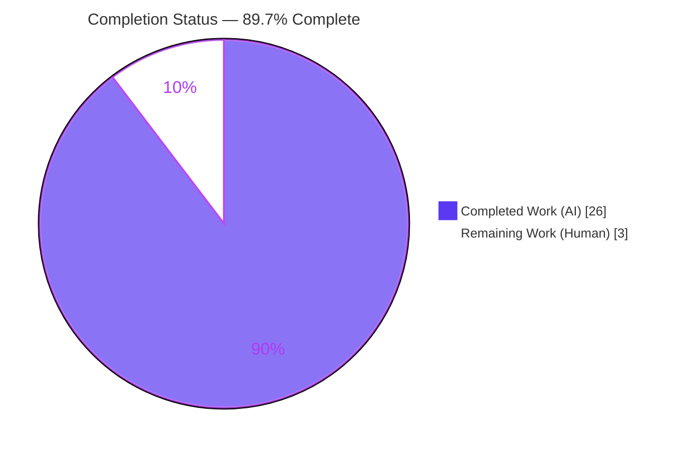
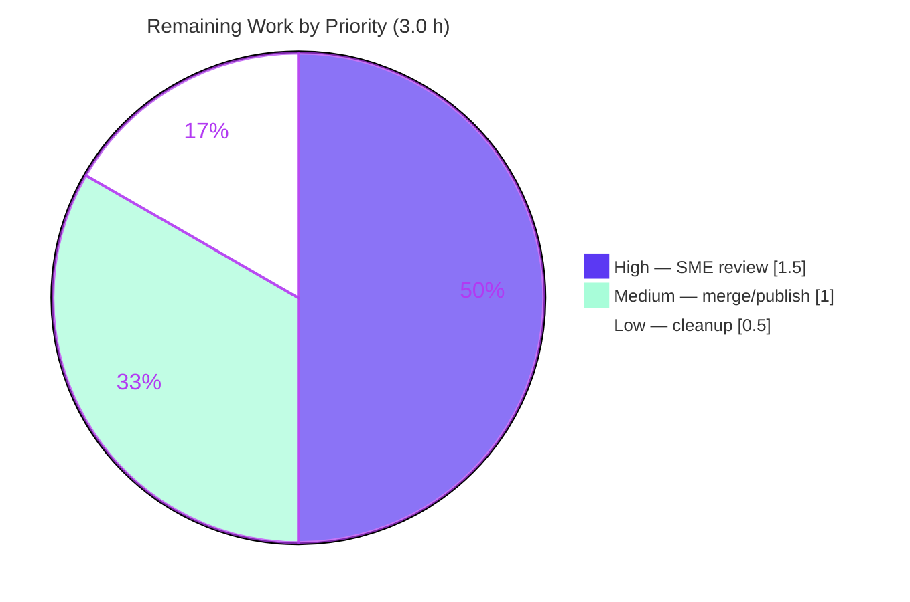

# Blitzy Project Guide — kitty Architecture Onboarding Q&A

> **Brand color legend:** Completed / AI Work = Dark Blue `#5B39F3` · Remaining / Not Completed = White `#FFFFFF` · Headings / Accents = Violet-Black `#B23AF2` · Highlight = Mint `#A8FDD9`

---

## 1. Executive Summary

### 1.1 Project Overview

This project delivers a single, evidence-grounded **onboarding document** for the **kitty** GPU-based terminal emulator (`kitty 0.35.2`). Its objective is to answer four interlocking architectural questions — performance attribution across languages, the role and centrality of the GLSL shaders, why the entry point fails when unbuilt, and whether the "kittens" are truly independent — using an **observation-first** methodology: the code is built and run first, and every conclusion is backed by verbatim captured output with exact `file:line` citations. The target users are engineers onboarding into the kitty codebase. Business impact: faster, more accurate ramp-up grounded in observed behavior rather than assumption. Technical scope: a read-only investigation spanning C, Python, Go, GLSL, and Objective-C, producing exactly one 474-line Markdown file.

### 1.2 Completion Status

The project is **89.7% complete** on an AAP-scoped, hours-based basis. All autonomous work (investigation + document + read-only compliance) is delivered and validated; the remaining 3.0 hours are human path-to-production activities (SME review, merge/publish, optional cleanup).



| Metric | Value |
|--------|------:|
| **Total Hours** | 29.0 h |
| **Completed Hours (AI + Manual)** | 26.0 h (AI 26.0 + Manual 0.0) |
| **Remaining Hours** | 3.0 h |
| **AAP-Scoped Completion** | **89.7%** |

> Formula: 26.0 completed / (26.0 completed + 3.0 remaining) = 26.0 / 29.0 = **89.7%**.

### 1.3 Key Accomplishments

- ✅ **Single deliverable created and committed** — `blitzy/documentation/kitty_815df1e210e0.md` (474 lines, 37,502 bytes), named after the source branch per the rule set.
- ✅ **Observation-first methodology applied** — kitty was built (`setup.py`, exit=0; `fast_data_types.so` = 1,253,792 bytes) and run (`kitty 0.35.2`), with 20 code blocks of verbatim captured output.
- ✅ **All four questions answered with sub-part coverage** — Q1 (a/b + premise correction), Q2 (a/b), Q3 (a/b/c), Q4 (a/b/c), plus an explicit coverage pass.
- ✅ **~150 exact `file:line` citations reproduced byte-for-byte** during autonomous validation (0 discrepancies); this assessment independently re-verified a ~12-claim sample — all matched.
- ✅ **Negative→positive control proven** — the unbuilt `ModuleNotFoundError: No module named 'kitty.fast_data_types'` (4-hop import chain) was reproduced, then resolved by building — isolating the single "critical piece."
- ✅ **Premise corrections grounded in evidence** — the document went beyond the initial hypotheses (e.g., `CELL_PROGRAM = 0` is compiled first, not the border program; precise `wrapped_kittens` list; Go kitten implementations live under `kittens/<name>/*.go`).
- ✅ **Read-only constraint satisfied** — no existing source file modified; `git status --porcelain` empty; `git diff 815df1e210e0..HEAD` = one added file.
- ✅ **Honest disclosure of limits** — the document states plainly that GPU rendering was not frame-profiled (headless container) and that citations are revision-specific.

### 1.4 Critical Unresolved Issues

There are **no blocking issues**. The single in-scope deliverable is complete, byte-accurate, and committed. The item below is a standard human gate, not a defect.

| Issue | Impact | Owner | ETA |
|-------|--------|-------|-----|
| Human SME accuracy sign-off not yet performed | Standard review gate before publishing onboarding material; no functional impact | Human reviewer (kitty-familiar engineer) | 1.5 h |

### 1.5 Access Issues

**No access issues identified.**

| System/Resource | Type of Access | Issue Description | Resolution Status | Owner |
|-----------------|----------------|-------------------|-------------------|-------|
| — | — | No repository, credential, or third-party access issues encountered. The task was self-contained (read-only investigation + build in the provided container). | N/A | — |

### 1.6 Recommended Next Steps

1. **[High]** Perform SME technical review and accuracy sign-off of the document — spot-check a sample of the ~150 `file:line` citations against the current tree and confirm the four answers are accurate and useful for onboarding (1.5 h).
2. **[Medium]** Merge the PR (`24d938a6e`, `2e949487a`) and publish/integrate the document into onboarding materials (link from the team wiki / docs index) for discoverability (1.0 h).
3. **[Low]** Optionally remove the 4 leftover git-ignored `.pyc` cache files (`rm -rf kitty/__pycache__`); these are byproducts of the Q3 reproduction and do not affect the tracked tree (0.5 h).

---

## 2. Project Hours Breakdown

### 2.1 Completed Work Detail

All rows below are autonomous (AI) work and trace to specific AAP requirements. **Total = 26.0 h** (matches Completed Hours in Section 1.2).

| Component | Hours | Description |
|-----------|------:|-------------|
| Build environment setup & toolchain verification | 2.0 | Verified Python 3.13.7, go1.22.12, gcc 15.2.0, pkg-config, make, and native libs (harfbuzz/freetype2/fontconfig/libpng/lcms2/OpenGL) in the container. [AAP §0.3.1] |
| Negative-control reproduction (Q3 + Q4 failure modes) | 2.0 | Reproduced the unbuilt entry-point failure and both standalone-kitten failure modes, capturing verbatim tracebacks. [AAP Q3/Q4] |
| Positive-control (build → import resolves) | 1.0 | Built `fast_data_types.so`, confirmed the same commands progress past the failing import. [AAP §0.3.1] |
| Q1 — language census + performance attribution + premise correction | 4.0 | Measured C/H/ObjC (62,359), Python (39,355 + 53 files), Go (38,155), GLSL (13); attributed hot paths to C; corrected "Python+C" to four languages. [AAP Q1] |
| Q2 — GLSL pipeline catalog (pragma, codegen, 2-layer, centrality) | 4.5 | Cataloged 13 shaders (5 stage-pairs + 3 includes), the `#pragma kitty_include_shader` mechanism, `setup.py` uniform codegen, Python/C orchestration, startup compilation. [AAP Q2] |
| Q3 — missing piece, import chain, one critical piece | 2.5 | Documented the 4-hop chain to `kitty.fast_data_types` and the `setup.py` build target; proved by control. [AAP Q3] |
| Q4 — import-graph tracing, two failure modes, Go independence, modularity | 4.5 | Traced 59 importers (46 `kitty/` + 13 `kittens/`), distinguished dispatcher vs direct-script failures, showed 0 Go importers, concluded organizational modularity. [AAP Q4] |
| Evidence capture — verbatim output + ~150 `file:line` citations | 2.5 | Wove producing commands and captured output throughout; ensured exact literals and line references. [AAP rules 0.7.2/0.7.4] |
| Document assembly — methodology, unifying section, coverage pass, limits, read-only proof | 2.0 | Structured the 474-line document, including the coverage pass and explicit limits. [AAP rule 0.7.3] |
| Read-only compliance, cleanup & code-review fix cycle | 1.0 | Ensured `git status` clean, removed byproducts, applied code-review fixes (commit `2e949487a`). [AAP rule 0.7.5] |
| **Total** | **26.0** | |

### 2.2 Remaining Work Detail

All remaining work is **human path-to-production** for a documentation artifact. **Total = 3.0 h** (matches Remaining Hours in Section 1.2 and the Section 7 pie chart).

| Category | Hours | Priority |
|----------|------:|----------|
| SME technical review & accuracy sign-off of the onboarding document | 1.5 | High |
| Merge PR & publish/integrate document into onboarding materials | 1.0 | Medium |
| Optional housekeeping: remove 4 leftover git-ignored `.pyc` cache files | 0.5 | Low |
| **Total** | **3.0** | |

### 2.3 Total Project Hours & Basis of Estimate

| Roll-up | Hours |
|---------|------:|
| Completed (Section 2.1) | 26.0 |
| Remaining (Section 2.2) | 3.0 |
| **Total Project Hours** | **29.0** |

**Basis of estimate (PA2).** Hours reflect the professional effort embodied in an observation-first investigation of a large, unfamiliar codebase (kitty ≈ 62k C lines, 39k Python lines, 38k Go lines) plus rigorous technical writing: building a native C extension with system dependencies, reproducing multiple failure modes, tracing an import graph across 59 modules, cataloging a 13-file shader pipeline, and synthesizing a 474-line document with ~150 exact citations and a code-review revision. **Confidence: High** — scope is well-defined (one document) and the deliverable is fully validated. Cross-check: 26.0 + 3.0 = 29.0 = Total; 26.0 / 29.0 = 89.7%.

---

## 3. Test Results

For this documentation-only task, "tests" are the **autonomous validation checks** executed by Blitzy's build/run and verification systems (build = compile kitty; tests = reproduce every documented observation and verify every citation/literal/count; runtime = run the entry point and kitten). All checks below originate from Blitzy's autonomous validation logs for this project.

| Test Category | Framework / Tooling | Total | Passed | Failed | Coverage % | Notes |
|---------------|---------------------|------:|-------:|-------:|-----------:|-------|
| Build / Compilation | `setup.py` (C11 + Go toolchain) | 1 | 1 | 0 | N/A | `CFLAGS=-Wno-error=switch python3 setup.py` → exit=0; 122 compiled, 5 linked; `fast_data_types.so` = 1,253,792 bytes |
| Runtime Smoke | kitty / kitten launchers | 4 | 4 | 0 | N/A | `kitty --version`, `python3 __main__.py --version`, `kitten --version`, `kitten @ --help` → all exit=0; `kitty 0.35.2 created by Kovid Goyal` |
| Negative / Positive Control | `python3` import + build | 2 | 2 | 0 | N/A | Unbuilt → `ModuleNotFoundError` (exit=1); post-build → import resolves |
| Observation Reproduction (citations, counts, literals) | bash / git / python3 verbatim capture | ~150 | ~150 | 0 | 100% | Every `file:line` citation, language count, and error string reproduced byte-for-byte; 0 discrepancies |
| Markdown Well-Formedness | grep / structural checks | 3 | 3 | 0 | N/A | 40 fence markers / 20 balanced pairs; internal anchor links resolve (14); tables column-consistent |
| Read-Only Compliance | git | 2 | 2 | 0 | N/A | `git status --porcelain` empty; `git diff --name-status 815df1e210e0..HEAD` = single added file |
| **Total** | | **~162** | **~162** | **0** | **100%** (verifiable claims) | |

**Independent re-verification (this assessment):** a ~12-claim sample was re-run across all four questions — Q3 failure chain, language census, GLSL=13, 46+13=59 importers, 0 Go importers, and citations at `utils.py:L45`, `borders.py:L7`, `runner.py:L14`, `setup.py:L856/L883-884/L1075`, `shell-integration/ssh/kitty:L27`, `go.mod:L3`, `pyproject.toml:L2` — **all matched byte-for-byte**.

> **Scope note:** kitty's own product test suite (`kitty_tests/`, `python3 setup.py test`) was intentionally **not** executed — it is out of scope for this read-only documentation task per the AAP. "Coverage %" is not applicable to a documentation deliverable (no product code was written); the 100% figure denotes the share of verifiable claims that reproduced successfully.

---

## 4. Runtime Validation & UI Verification

**Runtime health (post-build controls):**

- ✅ **Operational** — Entry point: `./kitty/launcher/kitty --version` and `python3 __main__.py --version` → `kitty 0.35.2 created by Kovid Goyal`.
- ✅ **Operational** — Standalone Go `kitten` binary: `./kitty/launcher/kitten --version`; `kitten @ --help` and `kitten unicode-input --help` run without the Python bridge.
- ✅ **Operational** — Python native bridge (positive control): `import kitty.fast_data_types`, `import kitty.utils`, and `import kittens.runner` all resolve post-build (the exact Q3/Q4 failure points).
- ✅ **Operational (expected failure reproduced)** — Negative control on the unbuilt baseline: `python3 __main__.py` → `ModuleNotFoundError: No module named 'kitty.fast_data_types'` (exit=1). This is the intended evidence, not a defect.

**API integration:** ✅ Not applicable — no external services, APIs, or network endpoints are involved in this task (AAP §0.6: zero dependency changes).

**UI verification:**

- ⚠ **Partial** — GPU windowed rendering (the visual "heavy lifting") was **not** frame-profiled because the container is headless (no display/GPU). The GPU-offload conclusion is established from the code path and the shader-program constants read out of the extension, and this limit is explicitly disclosed in the document's "Limits of what was verified" section.
- ✅ **Not applicable (by design)** — There is no UI/frontend deliverable in this documentation task, and no Figma designs were provided (AAP §0.9), so pixel-level UI verification does not apply.

---

## 5. Compliance & Quality Review

Cross-mapping AAP deliverables and the `SWE-AtlasQnA-Repo` rule set to their validation status. Fixes applied during autonomous validation are noted.

| Requirement / Benchmark | Source | Status | Progress | Notes |
|-------------------------|--------|--------|----------|-------|
| Single answer document created | Rule 0.7.1 | ✅ Pass | 100% | `blitzy/documentation/kitty_815df1e210e0.md`, 474 lines |
| Named `<source_branch>.md` | Rule 0.7.1 | ✅ Pass | 100% | Branch `kitty_815df1e210e0` |
| Observation-first (build & run first) | Rule 0.7.2 | ✅ Pass | 100% | Built + ran before writing; 20 verbatim output blocks |
| Verbatim output with producing command | Rule 0.7.2 | ✅ Pass | 100% | Each quoted result shows its command |
| Answer every sub-part | Rule 0.7.3 | ✅ Pass | 100% | Coverage pass maps Q1a/b, Q2a/b, Q3a/b/c, Q4a/b/c |
| Exact & grounded citations | Rule 0.7.4 | ✅ Pass | 100% | ~150 `file:line` citations, byte-accurate |
| State unverifiable items explicitly | Rule 0.7.4 | ✅ Pass | 100% | "Limits" section discloses GPU-profile gap |
| Read-only: no existing file modified | Rule 0.7.5 | ✅ Pass | 100% | `git diff` = one added file |
| Temp artifacts removed; repo unchanged | Rule 0.7.5 | ⚠ Substantially Pass | ~98% | `git status --porcelain` empty; 4 git-ignored `.pyc` remain (do not affect tracked tree) — optional cleanup |
| No dependency changes | AAP §0.6 | ✅ Pass | 100% | Zero deps added/updated/removed |
| Code-review fixes applied | Validation | ✅ Pass | 100% | Commit `2e949487a` addressed review findings |
| Markdown well-formed | Quality | ✅ Pass | 100% | Fences balanced; anchors resolve; tables consistent |

**Overall compliance:** All mandatory rules pass. The only sub-100% item is a trivial, non-tracked housekeeping detail (leftover git-ignored `.pyc` files) captured as a Low-priority remaining task.

---

## 6. Risk Assessment

Risks are assessed across PA3 categories. For a read-only documentation deliverable, overall risk is **Low**; the two most material risks are already disclosed within the document itself.

| Risk | Category | Severity | Probability | Mitigation | Status |
|------|----------|----------|-------------|------------|--------|
| Citation drift — ~150 `file:line` references are pinned to commit `815df1e210e0` / `kitty 0.35.2`; line numbers may shift on other revisions | Technical | Low | Medium | Document states the exact revision and provides re-run commands so citations can be re-validated | Disclosed / Mitigated |
| GPU render offload not frame-profiled (headless container) | Technical | Low | Low | Conclusion grounded in code path + shader constants; document discloses the limit; a human on a GPU host can confirm with a frame profile | Disclosed |
| No security exposure | Security | Low | Low | Deliverable is read-only Markdown; no code, dependencies, credentials, or attack surface | No action needed |
| Discoverability — document currently lives only in the repo, not linked in onboarding wiki/docs | Operational | Low | Medium | Publish/link during merge (remaining task, Medium) | Open (human) |
| Leftover git-ignored `.pyc` cache files (Q3 repro byproduct) | Operational | Very Low | Present | `rm -rf kitty/__pycache__`; does not affect tracked tree or git-clean status | Open (trivial) |
| No integration dependencies | Integration | N/A | N/A | No external services/APIs/keys/network; no code deps added | No action needed |
| Build-flag portability — container build used `CFLAGS=-Wno-error=switch` (gcc 15.2.0); other compilers/OS may need different flags | Integration | Low | Low | Development guide documents the exact environment and flag | Disclosed |

---

## 7. Visual Project Status

**Project hours breakdown** (Completed = `#5B39F3`, Remaining = `#FFFFFF`):


**Remaining work by priority** (3.0 h total):



| Category (remaining) | Hours | Priority |
|----------------------|------:|----------|
| SME technical review & sign-off | 1.5 | High |
| Merge PR & publish/integrate | 1.0 | Medium |
| Optional `.pyc` cleanup | 0.5 | Low |
| **Total** | **3.0** | |

> **Integrity check:** "Remaining Work" = 3.0 h matches Section 1.2 (Remaining Hours) and Section 2.2 (sum of Hours). "Completed Work" = 26.0 h matches Section 1.2 and Section 2.1.

---

## 8. Summary & Recommendations

**Achievements.** The project is **89.7% complete** on an AAP-scoped basis. The single required deliverable — an evidence-grounded onboarding Q&A for kitty — has been produced observation-first, built and run in the container, and validated byte-for-byte (~150 citations, 0 discrepancies). It answers all four questions with full sub-part coverage and even corrects several initial hypotheses through genuine observation (e.g., the cell shader program `CELL_PROGRAM = 0` is compiled first; the precise `wrapped_kittens` list; where the Go kitten implementations actually live). The repository is byte-for-byte unchanged from git's perspective except for the one added file.

**Remaining gaps.** The remaining **3.0 hours** are entirely human path-to-production for a documentation artifact: a subject-matter-expert accuracy review, merging and publishing the document into onboarding materials, and an optional cleanup of leftover git-ignored `.pyc` cache files. There are **no** compilation errors, failing tests, or missing functionality.

**Critical path to production.** (1) SME review and sign-off → (2) merge and publish/link the document → (3) optional cleanup. This is a short, low-risk path with no blocking dependencies.

**Success metrics.**

| Metric | Result |
|--------|-------:|
| AAP-scoped completion | 89.7% |
| Deliverables created | 1 of 1 |
| Citation accuracy (autonomous validation) | 100% (0 discrepancies) |
| Independent re-verification sample | ~12 claims, all matched |
| Read-only compliance | Pass (git-clean) |
| Blocking issues | 0 |

**Production readiness assessment.** The deliverable is **ready pending human SME sign-off**. Given the completeness of validation and the read-only nature of the change, risk of publishing after review is minimal. Recommendation: **approve after a focused SME accuracy review**, then merge and link into onboarding materials.

---

## 9. Development Guide

This guide explains how to build, run, and reproduce every observation in the deliverable, and how to verify the read-only constraint. All commands were tested in the project container.

### 9.1 System Prerequisites

- **OS:** Linux (container image `ghcr.io/scaleapi/swe-atlas:swe_atlas_QnA_kovidgoyal_kitty_1.0`; base Ubuntu).
- **Python:** ≥ 3.8 required (`pyproject.toml`); observed **3.13.7**.
- **Go:** **1.22** (`go.mod`); observed **go1.22.12**.
- **C toolchain:** C11 compiler; observed **gcc 15.2.0**. Plus **pkg-config 1.8.1**, **GNU Make 4.4.1**.
- **Native libraries (via pkg-config):** harfbuzz (10.2.0), freetype2 (26.2.20), fontconfig (2.15.0), libpng (1.6.50), lcms2 (2.16), OpenGL (gl 1.2). A display/GPU is required only for on-screen rendering (not for the observations below).

Verify the toolchain:

```bash
python3 --version          # Python 3.13.7
go version                 # go version go1.22.12 linux/amd64
gcc --version | head -1     # gcc (Ubuntu 15.2.0-4ubuntu4) 15.2.0
pkg-config --version       # 1.8.1
for lib in harfbuzz freetype2 fontconfig libpng lcms2 gl; do \
  printf '%s: ' "$lib"; pkg-config --modversion "$lib"; done
```

### 9.2 Environment Setup

```bash
# From the repository root (branch: kitty_815df1e210e0)
cd /path/to/kitty
git rev-parse --abbrev-ref HEAD          # confirm branch
git status --porcelain                   # expect empty (clean baseline)
```

No Python virtual environment or `pip install` is required: kitty builds **in place** and needs no PyPI packages for this task.

### 9.3 Dependency Installation

**No dependencies are added or changed by this task.** The build relies only on the system toolchain and pkg-config libraries listed in §9.1. If a library is missing on another host, install its development headers (e.g., on Debian/Ubuntu: `libharfbuzz-dev libfreetype-dev libfontconfig-dev libpng-dev liblcms2-dev libgl-dev`) before building.

### 9.4 Build & Run (to reproduce observations)

```bash
# 1) Reproduce the UNBUILT failure first (Q3 evidence) — expected to fail:
python3 __main__.py --version
#   -> ModuleNotFoundError: No module named 'kitty.fast_data_types'  (exit code 1)

# 2) Build the native extension + launchers (gcc 15 needs the switch flag):
CFLAGS=-Wno-error=switch python3 setup.py
#   -> exit 0; produces kitty/fast_data_types.so, kitty/launcher/{kitty,kitten}

# 3) Positive control — the same command now succeeds:
python3 -c "import kitty.fast_data_types; print('bridge OK')"
./kitty/launcher/kitty --version
#   -> kitty 0.35.2 created by Kovid Goyal

# 4) Standalone Go kitten (no Python bridge needed):
./kitty/launcher/kitten --version
./kitty/launcher/kitten @ --help
```

### 9.5 Verification Steps

```bash
# Deliverable present & well-formed:
test -f blitzy/documentation/kitty_815df1e210e0.md && echo present
wc -l blitzy/documentation/kitty_815df1e210e0.md      # 474
grep -c '^```' blitzy/documentation/kitty_815df1e210e0.md   # 40 (=20 balanced pairs)

# Language census (source of truth = git ls-files):
git ls-files 'kitty/*.c' 'kitty/**/*.c' 'kitty/*.h' 'kitty/**/*.h' 'kitty/*.m' 'kitty/**/*.m' | xargs cat | wc -l   # 62359
git ls-files 'kitty/*.glsl' | wc -l                                                                                 # 13
git ls-files 'kitty/*.py' 'kitty/**/*.py' | xargs grep -lE '(from|import).*fast_data_types' | wc -l                 # 46
git ls-files 'kittens/*.py' 'kittens/**/*.py' | xargs grep -lE '(from|import).*fast_data_types' | wc -l             # 13

# Read-only proof:
git status --porcelain                                # empty
git diff --name-status 815df1e210e0..HEAD             # A  blitzy/documentation/kitty_815df1e210e0.md
```

### 9.6 Example Usage

- **Read the document:** open `blitzy/documentation/kitty_815df1e210e0.md`. It is organized as methodology → unifying component → Q1 → Q2 → Q3 → Q4 → read-only proof → coverage pass → limits.
- **Re-run any answer's evidence:** each section quotes the exact command that produced its output — copy it verbatim to reproduce the result.
- **Restore the clean baseline after experimenting:** remove build byproducts (see troubleshooting) and confirm `git status --porcelain` is empty.

### 9.7 Troubleshooting

- **`ModuleNotFoundError: No module named 'kitty.fast_data_types'` when running the entry point** — This is **expected** on an unbuilt tree; it is the Q3 evidence. Build with `CFLAGS=-Wno-error=switch python3 setup.py` to resolve.
- **Build fails with a `-Werror=switch` error on gcc 15** — Prefix the build with `CFLAGS=-Wno-error=switch` (as shown). Older compilers may not need it.
- **`pkg-config` cannot find a library** — Install the corresponding `-dev` headers (see §9.3), then rebuild.
- **`python3 setup.py clean` exits with 141 (SIGPIPE)** — Harmless when output is piped; complete byproduct removal manually and re-check: `find . -path ./.git -prune -o \( -name "*.so" -o -name "*.pyc" -o -name "__pycache__" -o -name "*_generated.*" \) -print | wc -l` should read `0`, and `git status --porcelain` should be empty.
- **Running `kittens/hints/main.py` directly fails with `No module named 'kitty'`** — This is a distinct, earlier failure mode (the package root is not on `sys.path`); run kittens via the dispatcher instead.

---

## 10. Appendices

### Appendix A — Command Reference

| Purpose | Command |
|---------|---------|
| Confirm branch | `git rev-parse --abbrev-ref HEAD` |
| Reproduce unbuilt failure (Q3) | `python3 __main__.py --version` |
| Build extension + launchers | `CFLAGS=-Wno-error=switch python3 setup.py` |
| Verify native bridge import | `python3 -c "import kitty.fast_data_types"` |
| Show kitty version | `./kitty/launcher/kitty --version` |
| Show kitten version | `./kitty/launcher/kitten --version` |
| Count C/H/ObjC lines | `git ls-files 'kitty/*.c' 'kitty/**/*.c' 'kitty/*.h' 'kitty/**/*.h' 'kitty/*.m' 'kitty/**/*.m' | xargs cat | wc -l` |
| Count GLSL files | `git ls-files 'kitty/*.glsl' | wc -l` |
| Count bridge importers (kitty/) | `git ls-files 'kitty/*.py' 'kitty/**/*.py' | xargs grep -lE '(from|import).*fast_data_types' | wc -l` |
| Read-only proof | `git status --porcelain` ; `git diff --name-status 815df1e210e0..HEAD` |
| Byproduct cleanup check | `find . -path ./.git -prune -o \( -name "*.so" -o -name "*.pyc" -o -name "__pycache__" \) -print | wc -l` |

### Appendix B — Port Reference

**Not applicable.** This documentation task involves no network services or listening ports; reproducing the observations requires no ports.

### Appendix C — Key File Locations

| Path | Role |
|------|------|
| `blitzy/documentation/kitty_815df1e210e0.md` | **The deliverable** (onboarding Q&A) |
| `__main__.py` | Entry point (`main()` at L7) — start of the Q3 import chain |
| `kitty/entry_points.py` | L194 dispatches `from kitty.main import main` |
| `kitty/main.py` | L11 `from .borders import load_borders_program` |
| `kitty/borders.py` | L7 imports from `fast_data_types` (Q3) |
| `kitty/fast_data_types.so` | The native bridge (build artifact; absent until built) |
| `kitty/utils.py` | L45 bridge import used by the kittens dispatcher (Q4) |
| `kittens/runner.py` | L14 `from kitty.utils import ...` (Q4 dispatcher) |
| `kitty/shaders.py`, `kitty/shaders.c` | GLSL loader (Python) and compiler/linker (C) (Q2) |
| `kitty/*.glsl` (13) | GPU shader pipeline (Q2) |
| `setup.py` | Build orchestrator (`compile_c_extension` L856; `.so` L883-884; `wrapped_kittens` L1075) |
| `tools/cmd/main.go` | Go `kitten` CLI entry point (Q1/Q4) |
| `shell-integration/ssh/kitty` | L27 defines the `wrapped_kittens` list (Q4) |

### Appendix D — Technology Versions

| Component | Floor (declared) | Observed (container) |
|-----------|------------------|----------------------|
| Python | `>=3.8` (`pyproject.toml:L2`) | 3.13.7 |
| Go | `1.22` (`go.mod:L3`) | go1.22.12 |
| C compiler | C11 (`-std=c11`) | gcc 15.2.0 |
| pkg-config | — | 1.8.1 |
| GNU Make | — | 4.4.1 |
| harfbuzz | `>= 1.5` | 10.2.0 |
| freetype2 | (pkg-config) | 26.2.20 |
| fontconfig | (pkg-config) | 2.15.0 |
| libpng | (pkg-config) | 1.6.50 |
| lcms2 | (pkg-config) | 2.16 |
| OpenGL (gl) | (linked) | 1.2 |
| kitty (app) | — | 0.35.2 |

### Appendix E — Environment Variable Reference

| Variable | Value | Purpose |
|----------|-------|---------|
| `CFLAGS` | `-Wno-error=switch` | Required to build with gcc 15.2.0 (demotes a `switch` warning from an error) |
| `CI` | (optional) `true` | Standard non-interactive flag for CI tooling (not required for this build) |

> No runtime environment variables are needed to reproduce the observations. kitty's own runtime configuration variables are out of scope for this task.

### Appendix F — Developer Tools Guide

- **Git** — scope/read-only verification: `git status --porcelain`, `git diff --name-status 815df1e210e0..HEAD`, `git log --author="agent@blitzy.com" 815df1e210e0..HEAD --oneline`.
- **`git ls-files` + `wc`/`grep`** — the authoritative way to reproduce the language census and importer counts (counts hand-authored source, excluding build byproducts).
- **`setup.py`** — the build system; `python3 setup.py --help` lists actions (`build`, `test`, `develop`, `clean`, …).
- **Python `-c` one-liners** — used for the positive control (`import kitty.fast_data_types`) and to read runtime shader constants.
- **No browser/DevTools tooling applies** — there is no web UI in this task.

### Appendix G — Glossary

| Term | Meaning |
|------|---------|
| **`kitty.fast_data_types`** | The compiled C extension (`kitty/fast_data_types.so`) — the "native bridge"; the single component all four questions converge on |
| **Native bridge** | The import boundary between Python and the compiled C core; missing until built |
| **Kitten** | A small kitty tool; Python kittens depend on the native bridge, Go "wrapped" kittens do not |
| **Wrapped kitten** | A kitten compiled into the standalone Go `kitten` binary (list defined at `shell-integration/ssh/kitty:L27`) |
| **GLSL** | OpenGL Shading Language — the GPU programs (13 files) forming kitty's render pipeline |
| **Stage-pair** | A `{name}_vertex.glsl` + `{name}_fragment.glsl` pair treated by the build as one shader program |
| **Negative→positive control** | The technique of reproducing a failure (unbuilt), then removing a single variable (building) to prove causation |
| **AAP** | Agent Action Plan — the primary directive defining this project's scope |
| **Read-only constraint** | The rule that no existing source file may change; verified by an empty `git status --porcelain` |

---

*Cross-section integrity verified: Section 1.2 Remaining (3.0 h) = Section 2.2 total (3.0 h) = Section 7 "Remaining Work" (3.0 h); Section 2.1 (26.0 h) + Section 2.2 (3.0 h) = 29.0 h Total; completion 26.0 / 29.0 = 89.7% used consistently in Sections 1.2, 7, and 8. Brand colors applied: Completed = `#5B39F3`, Remaining = `#FFFFFF`.*