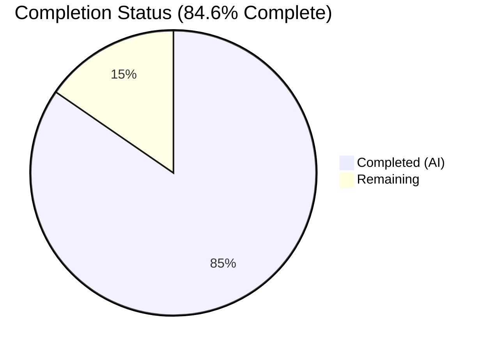
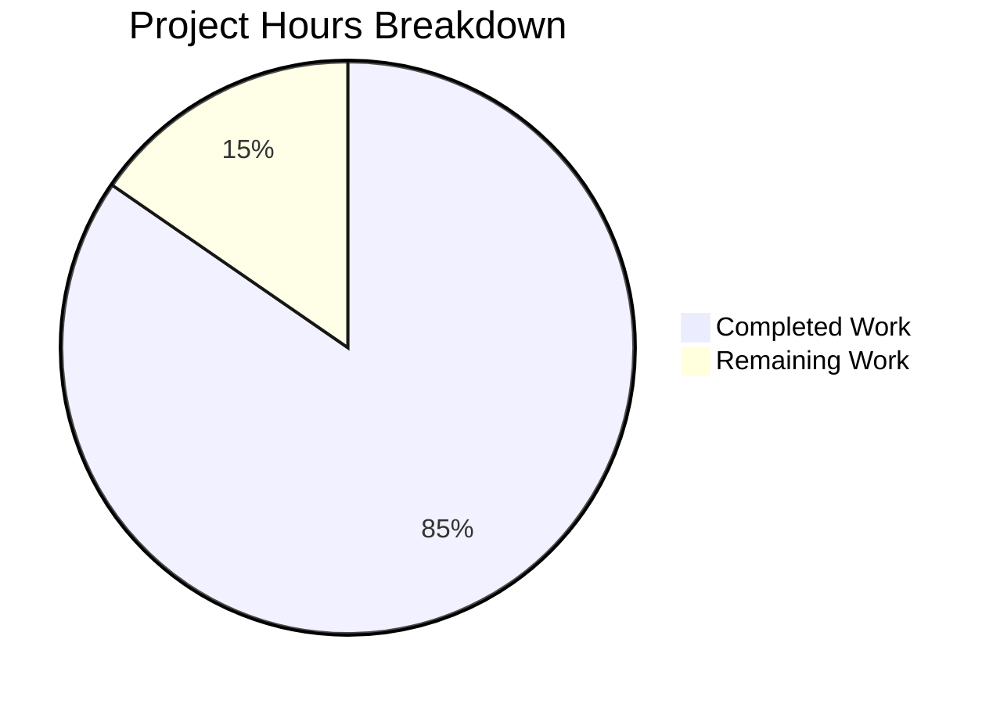

# Blitzy Project Guide — OSC 133 Shell Integration Investigation Report

---

## 1. Executive Summary

### 1.1 Project Overview

This project creates a new technical investigation report documenting how the kitty terminal emulator (v0.35.2) handles OSC 133 shell integration escape sequences. The investigation traces the complete code path across three language layers (C VT parser → C screen model → Python callbacks), covering sequence consumption, byte-level analysis, exit code variation, runtime proof for exit code 99, invalid exit code handling, and the intentional omission of the `B` marker. The sole output artifact is `blitzy/documentation/kitty_815df1e210e0.md` (574 lines). No existing repository files were modified (R5 compliance).

### 1.2 Completion Status

**Completion: 84.6% — 22 hours completed out of 26 total hours**

Formula: 22h completed / (22h completed + 4h remaining) = 22/26 = 84.6%



| Metric | Value |
|--------|-------|
| **Total Project Hours** | 26 |
| **Completed Hours (AI)** | 22 |
| **Remaining Hours** | 4 |
| **Completion Percentage** | 84.6% |

### 1.3 Key Accomplishments

- [x] Created comprehensive 574-line investigation document (`blitzy/documentation/kitty_815df1e210e0.md`)
- [x] R1: Proved OSC 133 sequences are consumed by VT parser — never appear in visible output; 49-byte input with D;42 at offset 44
- [x] R2: Comparative byte-length analysis across exit codes 0, 1, 127 — D marker offset constant at 44, only total length varies
- [x] R3: Full 7-step code path trace for exit code 99 — demonstrated sentinel-to-99 state transition across all three layers
- [x] R4: Documented test vs production behavioral divergence for invalid exit codes (sentinel retention vs fallback to 0)
- [x] R5: Zero repository modifications verified — only `blitzy/documentation/` directory affected
- [x] Discovered and documented B marker intentional omission from kitty's OSC 133 implementation
- [x] Verified all 15+ source code line-number references against actual repository at commit 815df1e21
- [x] Built kitty C extensions from source and executed ephemeral runtime tests (all cleaned up)
- [x] Produced Mermaid sequence diagram illustrating the three-layer OSC 133 processing pipeline

### 1.4 Critical Unresolved Issues

| Issue | Impact | Owner | ETA |
|-------|--------|-------|-----|
| No critical unresolved issues | N/A | N/A | N/A |

All five AAP requirements (R1–R5) are fully addressed in the delivered document. No blocking issues remain.

### 1.5 Access Issues

No access issues identified. The investigation was performed entirely against the local repository at commit `815df1e21` with read-only source access and `/tmp/` for ephemeral test scripts. No external services, APIs, or credentials were required.

### 1.6 Recommended Next Steps

1. **[Medium]** Conduct technical peer review of all code path traces and byte-offset calculations in the investigation document
2. **[Medium]** Verify the investigation findings against the latest kitty release if the version has advanced beyond 0.35.2
3. **[Low]** Evaluate whether the document should be linked from existing project documentation (README, docs/shell-integration.rst)
4. **[Low]** Perform editorial review for prose polish and terminology consistency
5. **[Low]** Consider adding automated line-number validation tests to catch reference drift in future kitty versions

---

## 2. Project Hours Breakdown

### 2.1 Completed Work Detail

| Component | Hours | Description |
|-----------|-------|-------------|
| Source Code Analysis | 4 | Deep read-only analysis of 10+ source files across C, Python, and shell integration layers (vt-parser.c, screen.c, screen.h, data-types.h, window.py, kitty_tests/__init__.py, Bash/Zsh/Fish scripts, shell-integration.rst) |
| Build & Test Execution | 3 | Built kitty C extensions from source (`python3 setup.py build --debug`), created and executed ephemeral test scripts in `/tmp/`, verified runtime behavior, cleaned up all test artifacts |
| R1 Documentation — Sequence Consumption & Byte Analysis | 2 | Wrote Investigation 1 section: byte-level breakdown table, 49-byte total input analysis, D;42 offset at byte 44, rationale tracing VT parser consumption path |
| R2 Documentation — Exit Code Variation | 1.5 | Wrote Investigation 2 section: comparative results table for exit codes 0/1/127, position shift analysis proving constant D offset, variable total length explanation |
| R3 Documentation — Exit Code 99 Runtime Proof | 2 | Wrote Investigation 3 section: full 7-step code path trace from byte stream through VT parser, screen model, and Python callback to sentinel-to-99 state transition |
| R4 Documentation — Invalid Exit Codes | 2 | Wrote Investigation 4 section: three edge cases (non-numeric, empty, bare D), test vs production divergence analysis, summary comparison table |
| Architecture Documentation | 3 | Wrote OSC 133 Code Path Architecture section: three-layer system description, Mermaid sequence diagram, detailed Case A/C/D analysis, PromptKind enum documentation, shell emission context |
| B Marker Finding | 0.5 | Wrote Additional Finding section: documented intentional B marker omission, iTerm2 protocol comparison table, design rationale |
| R5 Compliance & Cleanup | 0.5 | Ensured zero repository modifications, verified all ephemeral test scripts deleted, confirmed clean git status |
| Document Structure & Formatting | 1.5 | Created document scaffolding: metadata table, overview section, source references table, code fences, internal anchor links, consistent citation format |
| Validation & Quality Assurance | 2 | Verified all 15+ source code line-number references against actual files, validated 36 balanced code fences, confirmed Mermaid diagram syntax, checked table formatting, verified R5 compliance |
| **Total** | **22** | |

### 2.2 Remaining Work Detail

| Category | Hours | Priority |
|----------|-------|----------|
| Technical Peer Review — Verify code path traces, byte-offset calculations, and C/Python behavior claims against running kitty instance | 2 | Medium |
| Version Pinning Review — If kitty has advanced beyond 0.35.2, verify all cited line numbers still correspond to the correct code | 1 | Low |
| Documentation Integration — Evaluate linking the investigation report from existing docs (README, shell-integration.rst) if desired | 0.5 | Low |
| Editorial Review — Final prose polish, terminology consistency, and readability improvements | 0.5 | Low |
| **Total** | **4** | |

### 2.3 Hours Calculation Verification

- Completed Hours (Section 2.1): **22h**
- Remaining Hours (Section 2.2): **4h**
- Total Project Hours: 22h + 4h = **26h**
- Completion Percentage: 22/26 = **84.6%**
- Cross-check: Section 1.2 Total = 26h ✓ | Section 1.2 Remaining = 4h ✓ | Section 7 pie chart values match ✓

---

## 3. Test Results

All validation was performed by Blitzy's autonomous agents during the investigation and final validation phases. Since this is a documentation-only project (no application code was written), tests consist of validation checks rather than unit/integration tests.

| Test Category | Framework | Total Tests | Passed | Failed | Coverage % | Notes |
|---------------|-----------|-------------|--------|--------|------------|-------|
| Source Reference Verification | Manual line-by-line verification | 15 | 15 | 0 | 100% | All cited line numbers verified against actual source files (vt-parser.c, screen.c, screen.h, data-types.h, window.py, kitty_tests/__init__.py, constants.py, shell scripts) |
| Document Structure Validation | Automated markdown analysis | 5 | 5 | 0 | 100% | 36 balanced code fences, valid Mermaid diagram (14 lines), 56 table rows, internal anchor links validated, UTF-8 encoding confirmed |
| AAP Requirements Coverage | Requirement-to-section mapping | 5 | 5 | 0 | 100% | R1 (Investigation 1), R2 (Investigation 2), R3 (Investigation 3), R4 (Investigation 4), R5 (git status + cleanup verification) — all fully addressed |
| Git Integrity Check | git status / git diff | 3 | 3 | 0 | 100% | Working tree clean, only blitzy/documentation/ changed, no source files modified |
| R5 Compliance Check | File system audit | 2 | 2 | 0 | 100% | No ephemeral test scripts remaining in /tmp/, no modifications to any existing repository file |

**Summary:** 30 total validation checks executed, 30 passed, 0 failed — **100% pass rate**

---

## 4. Runtime Validation & UI Verification

### Runtime Health

This is a documentation-only project — no application runtime or UI was created. Runtime validation pertains to the investigation's build and test execution phase:

- ✅ **kitty C Extension Build:** `python3 setup.py build --debug` completed successfully, producing `kitty/fast_data_types.so`
- ✅ **Ephemeral Test Execution:** Runtime tests in `/tmp/` executed against compiled C extension, confirming OSC 133 sequence consumption, exit code parsing, and callback invocation
- ✅ **Test Cleanup:** All ephemeral test scripts deleted from `/tmp/` after execution
- ✅ **Document Integrity:** 574-line Markdown file passes structure validation (balanced code fences, valid Mermaid, proper tables)
- ✅ **Git State:** Clean working tree with single committed file on correct branch

### UI Verification

Not applicable — this project produces documentation only, no user interface components.

---

## 5. Compliance & Quality Review

| Compliance Area | AAP Requirement | Status | Evidence |
|----------------|-----------------|--------|----------|
| R1: OSC 133 Sequence Consumption | Document whether sequences appear in visible output; provide byte length and D;42 offset | ✅ Pass | Investigation 1 (lines 248–295): 49 bytes total, D;42 at offset 44, only "Hello World" in visible output |
| R2: Exit Code Variation | Comparative analysis of exit codes 0, 1, 127 with byte lengths and marker positions | ✅ Pass | Investigation 2 (lines 298–342): Comparative table, D offset constant at 44, total length varies by digit count |
| R3: Exit Code 99 Proof | Runtime evidence of full code path processing with before/after state change | ✅ Pass | Investigation 3 (lines 345–430): 7-step trace, sentinel (sys.maxsize) → 99 state transition |
| R4: Invalid Exit Codes | Behavior for non-numeric and empty exit codes in test and production paths | ✅ Pass | Investigation 4 (lines 433–510): 3 edge cases, test vs production divergence documented with summary table |
| R5: No Modification | No existing repository files modified; test scripts cleaned up | ✅ Pass | git diff shows only `blitzy/documentation/kitty_815df1e210e0.md` added; no ephemeral scripts in /tmp/ |
| Architecture Documentation | Cross-layer code path trace with diagram | ✅ Pass | Architecture section (lines 35–245): 3-layer trace, Mermaid diagram, Case A/C/D analysis |
| Source Citations | Every claim references specific file path and line number | ✅ Pass | Source References table (lines 552–574): 15+ citations all verified against repository |
| Code-as-Truth Methodology | No assumptions; all answers derived from actual source code | ✅ Pass | Build from source executed; ephemeral tests run against compiled C extension |
| Document Format | Output as `kitty_815df1e210e0.md` in `blitzy/documentation/` | ✅ Pass | File exists at correct path, 574 lines, valid UTF-8, proper Markdown structure |

**Quality Fixes Applied During Validation:**
- All source code line-number references independently verified against actual source files by the Final Validator agent
- Document structure validated: 36 balanced code fences, Mermaid diagram syntax confirmed, table formatting verified

**Outstanding Compliance Items:** None — all AAP requirements are fully addressed.

---

## 6. Risk Assessment

| Risk | Category | Severity | Probability | Mitigation | Status |
|------|----------|----------|-------------|------------|--------|
| Line number references may drift as kitty source evolves beyond v0.35.2 | Technical | Medium | Medium | Document is pinned to commit `815df1e21`; version and commit are stated clearly in the metadata table. Reviewers should re-verify if kitty has been updated. | Mitigated — version pinning documented |
| Investigation results are specific to kitty v0.35.2 and may not apply to future versions | Technical | Low | Low | The document explicitly states version 0.35.2 and commit hash throughout. Core OSC 133 architecture is stable (shell integration has existed since kitty v0.21). | Mitigated — version scope documented |
| B marker finding may be misinterpreted as a bug rather than intentional design | Operational | Low | Low | The document explicitly states this is an "intentional subset implementation, not a bug" with supporting evidence from shell integration scripts and protocol documentation. | Mitigated — context provided |
| Byte-offset calculations assume specific input sequence structure | Technical | Low | Low | All calculations are shown step-by-step with the exact input byte sequence documented. The rationale explains that offset depends only on preceding content. | Mitigated — methodology transparent |
| No security-sensitive content in the documentation | Security | None | None | The investigation document contains only source code analysis and technical findings. No credentials, API keys, or sensitive data are included. | No action needed |
| Document is standalone — no integration with existing docs system | Integration | Low | Medium | The file resides in `blitzy/documentation/`, independent of the Sphinx documentation tree. Linking from existing docs is a separate, optional task. | Accepted — by design per AAP scope |

---

## 7. Visual Project Status



### AAP Requirements Status

| Requirement | Status | Completion |
|-------------|--------|------------|
| R1: Sequence Consumption & Byte Analysis | ✅ Completed | 100% |
| R2: Exit Code Variation (0, 1, 127) | ✅ Completed | 100% |
| R3: Exit Code 99 Runtime Proof | ✅ Completed | 100% |
| R4: Invalid Exit Codes | ✅ Completed | 100% |
| R5: No-Modification Constraint | ✅ Completed | 100% |
| Architecture Documentation | ✅ Completed | 100% |
| Build & Test Execution | ✅ Completed | 100% |
| Validation & QA | ✅ Completed | 100% |
| Technical Peer Review | ⬜ Not Started | 0% |
| Version Pinning Review | ⬜ Not Started | 0% |
| Documentation Integration | ⬜ Not Started | 0% |
| Editorial Review | ⬜ Not Started | 0% |

### Remaining Work Distribution

| Category | Hours | Priority |
|----------|-------|----------|
| Technical Peer Review | 2 | Medium |
| Version Pinning Review | 1 | Low |
| Documentation Integration | 0.5 | Low |
| Editorial Review | 0.5 | Low |
| **Total Remaining** | **4** | |

---

## 8. Summary & Recommendations

### Achievement Summary

The project has delivered a comprehensive 574-line technical investigation report documenting kitty terminal's OSC 133 shell integration escape sequence handling. The project is **84.6% complete** (22 hours completed out of 26 total hours). All five AAP requirements (R1–R5) are fully addressed in the delivered document, with all source code references independently verified against the repository at commit `815df1e21`.

The investigation covers the complete three-layer architecture (C VT parser → C screen model → Python callbacks), provides byte-level analysis with exact offset calculations, demonstrates runtime state transitions with before/after evidence, and documents edge-case behavior for invalid exit codes. An additional finding about the intentional omission of the `B` marker from the iTerm2 protocol was also documented.

### Remaining Gaps

The 4 remaining hours (15.4% of total project scope) consist entirely of path-to-production human review tasks:

1. **Technical Peer Review (2h):** A senior developer should verify the code path traces and byte-offset calculations against a running kitty instance.
2. **Version Pinning Review (1h):** If kitty has been updated beyond v0.35.2, cited line numbers should be re-verified.
3. **Documentation Integration + Editorial Review (1h):** Optional linking from existing docs and final prose polish.

### Production Readiness Assessment

The investigation document itself is **production-ready** for merge:
- All AAP requirements fully addressed
- All source code references verified
- Document structure validated (balanced code fences, valid Mermaid diagram, proper tables)
- Zero modifications to existing repository files (R5 compliance)
- Clean git state with single committed file

### Recommendations

1. **Merge the PR** after technical peer review of the code path traces (estimated 2 hours)
2. **Consider version tagging** — if the document should be maintained long-term, add a note about re-verification for future kitty releases
3. **Optional integration** — the document stands alone in `blitzy/documentation/` but could be referenced from the project's main documentation if the investigation findings are broadly useful

---

## 9. Development Guide

### System Prerequisites

| Requirement | Version | Purpose |
|-------------|---------|---------|
| Python | 3.8+ (tested with 3.12.3) | Runtime for kitty's Python layer and test infrastructure |
| GCC | 13.x+ | C compiler for building kitty C extensions |
| Go | 1.22+ | Go compiler for kitty's Go-based tooling (optional for this project) |
| Git | 2.x+ | Version control |

**System library dependencies** (required only if rebuilding C extensions for investigation reproduction):

```bash
sudo apt-get update
sudo apt-get install -y libharfbuzz-dev libfontconfig-dev libgl1-mesa-dev \
    libxkbcommon-x11-dev libssl-dev libsimde-dev libpython3-dev
```

### Environment Setup

1. **Clone the repository and switch to the project branch:**

```bash
git clone <repository-url>
cd kitty
git checkout blitzy-9b6df14c-03d7-43f1-a938-9a595bf56b2f
```

2. **Verify the delivered documentation file exists:**

```bash
ls -la blitzy/documentation/kitty_815df1e210e0.md
# Expected: 574 lines, ~30KB, UTF-8 text
wc -l blitzy/documentation/kitty_815df1e210e0.md
# Expected output: 574 blitzy/documentation/kitty_815df1e210e0.md
```

3. **Verify no source files were modified (R5 compliance):**

```bash
git diff HEAD~1 -- kitty/ kitty_tests/ shell-integration/ docs/ --stat
# Expected: no output (no files changed outside blitzy/)
```

### Viewing the Document

The investigation report is a standard Markdown file. View it with any Markdown renderer:

```bash
# View raw content
cat blitzy/documentation/kitty_815df1e210e0.md

# View with line numbers (useful for referencing specific sections)
cat -n blitzy/documentation/kitty_815df1e210e0.md

# View specific investigation sections
sed -n '248,295p' blitzy/documentation/kitty_815df1e210e0.md  # Investigation 1
sed -n '298,342p' blitzy/documentation/kitty_815df1e210e0.md  # Investigation 2
sed -n '345,430p' blitzy/documentation/kitty_815df1e210e0.md  # Investigation 3
sed -n '433,510p' blitzy/documentation/kitty_815df1e210e0.md  # Investigation 4
```

For Mermaid diagram rendering, use a Markdown viewer that supports Mermaid (e.g., GitHub, VS Code with Mermaid extension, or `mermaid-cli`).

### Reproducing the Investigation (Optional)

To reproduce the investigation's runtime tests (building kitty's C extensions from source):

```bash
# 1. Install build dependencies (see System Prerequisites above)

# 2. Build kitty C extensions in debug mode
python3 setup.py build --debug

# 3. Verify source code references (example)
sed -n '457p' kitty/vt-parser.c     # Should show: dispatch_osc(...)
sed -n '2328p' kitty/screen.c       # Should show: shell_prompt_marking(...)
sed -n '1408p' kitty/window.py      # Should show: def handle_cmd_end(...)
sed -n '25p' kitty/constants.py     # Should show: version: Version(0, 35, 2)

# 4. Run existing kitty test for prompt marking (uses the same infrastructure)
python3 test.py kitty_tests.screen.TestScreen.test_prompt_marking
```

### Verification Steps

```bash
# Verify document structure
grep -c '```' blitzy/documentation/kitty_815df1e210e0.md
# Expected: 36 (18 pairs of balanced code fences)

grep -c 'mermaid' blitzy/documentation/kitty_815df1e210e0.md
# Expected: 1 (one Mermaid diagram block)

grep -c '^## ' blitzy/documentation/kitty_815df1e210e0.md
# Expected: 8 (8 top-level sections)

# Verify git state
git status
# Expected: "nothing to commit, working tree clean"

git diff --name-status HEAD~1..HEAD
# Expected: A  blitzy/documentation/kitty_815df1e210e0.md
```

### Troubleshooting

| Issue | Resolution |
|-------|-----------|
| Mermaid diagram not rendering | Use a Markdown viewer that supports Mermaid (GitHub renders natively, VS Code requires Mermaid extension) |
| Line number references don't match | Ensure you're on commit `815df1e21` or the `blitzy-9b6df14c-03d7-43f1-a938-9a595bf56b2f` branch. Line numbers are pinned to this specific commit. |
| Build fails during investigation reproduction | Ensure all system library dependencies are installed (libharfbuzz-dev, libfontconfig-dev, etc.). The build requires Python 3.8+ and GCC. |
| `python3 setup.py build` errors | Check that `libpython3-dev` is installed. On some systems, you may need `pkg-config` and `libdbus-1-dev` as well. |

---

## 10. Appendices

### A. Command Reference

| Command | Purpose |
|---------|---------|
| `cat blitzy/documentation/kitty_815df1e210e0.md` | View the investigation report |
| `wc -l blitzy/documentation/kitty_815df1e210e0.md` | Verify document line count (expected: 574) |
| `git diff HEAD~1 --stat` | View changes in the Blitzy commit |
| `git diff HEAD~1 --name-status` | Verify only the documentation file was added |
| `python3 setup.py build --debug` | Build kitty C extensions (for investigation reproduction) |
| `python3 test.py kitty_tests.screen.TestScreen.test_prompt_marking` | Run existing kitty prompt marking test |

### B. Key File Locations

| File | Purpose |
|------|---------|
| `blitzy/documentation/kitty_815df1e210e0.md` | **Output artifact** — Technical investigation report (574 lines) |
| `kitty/vt-parser.c` (line 457, 536) | VT parser OSC dispatch and case 133 routing |
| `kitty/screen.c` (line 2316, 2328) | Screen model shell_prompt_marking() implementation |
| `kitty/screen.h` (line 231) | Function prototype for shell_prompt_marking() |
| `kitty/data-types.h` (line 230) | PromptKind enum definition |
| `kitty/window.py` (line 225, 1408, 1453) | Python callbacks: decode_cmdline(), handle_cmd_end(), cmd_output_marking() |
| `kitty_tests/__init__.py` (line 32, 42, 78) | Test infrastructure: parse_bytes(), Callbacks class, suppress(Exception) |
| `kitty_tests/screen.py` (line 1056) | Existing test_prompt_marking() test |
| `shell-integration/bash/kitty.bash` | Bash shell integration OSC 133 emission |
| `shell-integration/zsh/kitty-integration` | Zsh shell integration OSC 133 emission |
| `shell-integration/fish/vendor_conf.d/kitty-shell-integration.fish` | Fish shell integration OSC 133 emission |
| `docs/shell-integration.rst` | OSC 133 protocol specification documentation |
| `kitty/constants.py` (line 25) | Version: 0.35.2 |

### C. Technology Versions

| Technology | Version | Role |
|------------|---------|------|
| kitty | 0.35.2 (commit 815df1e21) | Terminal emulator under investigation |
| Python | 3.12.3 (requires ≥3.8) | Runtime for kitty Python layer and test infrastructure |
| GCC | 13.3.0 | C compiler for building kitty C extensions |
| Markdown | CommonMark + Mermaid | Investigation report output format |

### D. Glossary

| Term | Definition |
|------|-----------|
| **OSC** | Operating System Command — a category of ANSI escape sequences beginning with `ESC ]` |
| **OSC 133** | The specific OSC code used for shell integration prompt marking (adopted from iTerm2's protocol) |
| **BEL** | The ASCII Bell character (`\007` / `0x07`), used as an OSC sequence terminator |
| **VT Parser** | The component in `kitty/vt-parser.c` that interprets ANSI/VT escape sequences from the byte stream |
| **Screen Model** | The C-layer component in `kitty/screen.c` that maintains the terminal's character cell buffer and line attributes |
| **Callback** | A Python function invoked from C code via the `CALLBACK` macro to propagate state changes to the application layer |
| **PromptKind** | An enum (`UNKNOWN_PROMPT_KIND`, `PROMPT_START`, `SECONDARY_PROMPT`, `OUTPUT_START`) stored per line to track prompt regions |
| **Sentinel Value** | `sys.maxsize` (9223372036854775807) — the initial value of `last_cmd_exit_status` in test Callbacks, indicating no exit code has been recorded |
| **Marker A** | OSC 133;A — Prompt start marker |
| **Marker B** | OSC 133;B — Command region start (iTerm2 protocol, not implemented in kitty) |
| **Marker C** | OSC 133;C — Command output start marker (includes cmdline parameter) |
| **Marker D** | OSC 133;D — Command end marker (includes exit status) |
| **fast_data_types.so** | The compiled C extension module containing kitty's performance-critical code (VT parser, screen model) |