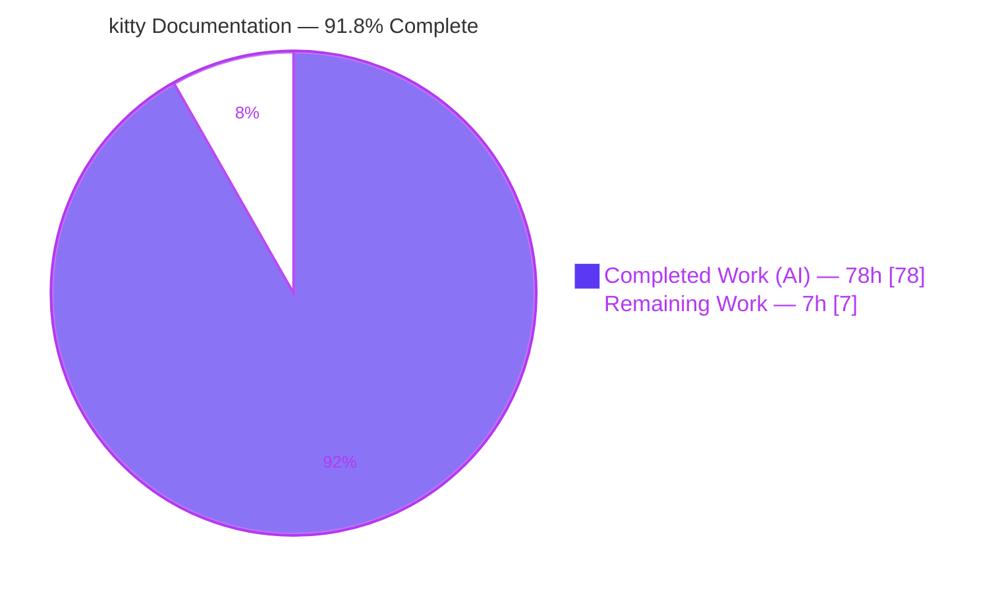
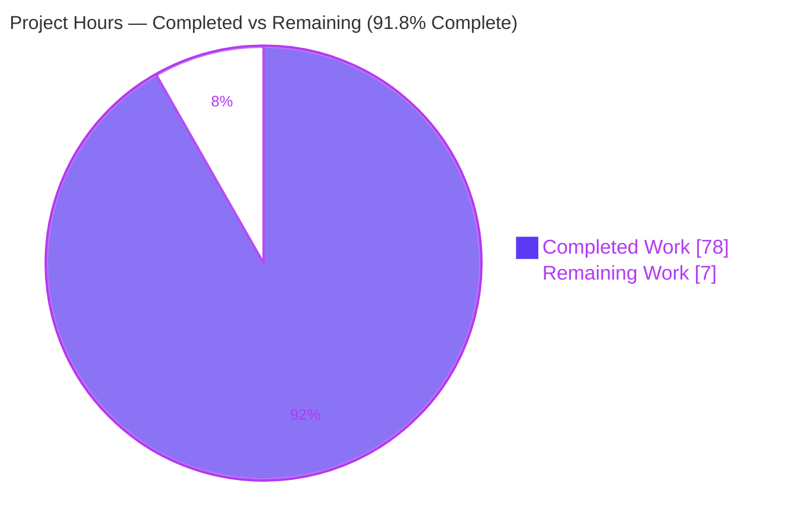
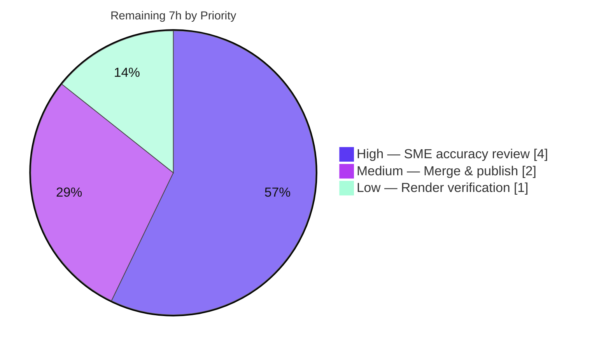

# Blitzy Project Guide
## kitty — Runtime-Observed Investigation: Unicode Shaping, Startup Font Fallback, Cell Metrics & GPU Texture-Atlas Initialization

> **Deliverable:** `blitzy/documentation/kitty_815df1e210e0.md` (1,887 lines / ~15,730 words / 160 KB)
> **Repository:** kovidgoyal/kitty · **Branch:** `blitzy-a0ab8c39-b9ff-4c46-9691-2514989317d0` · **Base:** `815df1e21` · **HEAD:** `c2ee02448`
> **Task type:** Read-only documentation (QnA knowledge-answer) produced from live runtime observation

---

## 1. Executive Summary

### 1.1 Project Overview

This project delivers a single, evidence-based knowledge document that explains — and proves through live runtime observation — how the **kitty** terminal emulator configures its text-shaping/layout engine for complex Unicode, performs startup **font fallback**, computes **cell metrics**, and initializes its **GPU texture-atlas**. The audience is engineers onboarding to the `kovidgoyal/kitty` codebase who need a reproducible, source-grounded account rather than a code walkthrough alone. The work is **strictly read-only**: no source file is modified; only the answer document is added. Technical scope spans HarfBuzz shaping, FontConfig/FreeType discovery & metrics, and OpenGL atlas allocation — observed against a canonical `python3 setup.py` build run through the real `kitty/launcher/kitty` entry point.

### 1.2 Completion Status



<sub>Color legend — **Completed / AI Work:** Dark Blue `#5B39F3` · **Remaining / Not Completed:** White `#FFFFFF` (outlined for visibility).</sub>

| Metric | Value |
|--------|-------|
| **Total Hours** | **85** |
| **Completed Hours (AI + Manual)** | **78** (78 AI · 0 Manual) |
| **Remaining Hours** | **7** |
| **Percent Complete** | **91.8%** |

> **Completion formula (PA1, AAP-scoped):** `78 / (78 + 7) = 78/85 = 91.8%`. The percentage measures only AAP-scoped deliverables plus path-to-production for a documentation artifact. All completed work to date is autonomous (AI); the remaining 7h is inherently human (review + merge + render check).

### 1.3 Key Accomplishments

- ✅ **Sole deliverable authored & committed** — `blitzy/documentation/kitty_815df1e210e0.md` (1,887 lines), covering all four AAP objectives plus methodology, honest negatives, stability, variant coverage, appendices, and a final coverage pass.
- ✅ **Canonical build reproduced** — `python3 setup.py` produced `kitty/launcher/kitty` at **40,384 bytes**, BuildID `4a693e4304285476522c8ac6a4eef4babf9072b7`, 85 C translation units clean under strict flags; launcher reports **kitty 0.35.2**.
- ✅ **Real runtime observation** — launcher run under headless GL (Xvfb + Mesa llvmpipe, OpenGL 4.5 Core; `GL_MAX_TEXTURE_SIZE=16384`, `GL_MAX_ARRAY_TEXTURE_LAYERS=2048`) with `--debug-font-fallback --debug-rendering`, fed mixed Arabic (RTL) + English (LTR) input (`Hello مرحبا World`).
- ✅ **All four objectives evidenced** — ligatures/bidi/combining/fallback (A), startup family dump + 9 config values (B), cell metrics/underline/strikethrough (C), atlas layout/capacity/readiness (D).
- ✅ **Three honest negatives** — no bidi reordering engine, no overline decoration, and `setup_for_testing` labeled non-canonical.
- ✅ **Evidence discipline** — 174 `file:line` anchors; OBS/SRC/COR/VIS/NEG labels; complete unedited debug output; every observation run ≥2× with **0-byte** normalized diffs.
- ✅ **Read-only integrity perfect** — `git diff --name-status 815df1e21..HEAD` = a single added file; zero source files modified/deleted; working tree clean.

### 1.4 Critical Unresolved Issues

| Issue | Impact | Owner | ETA |
|-------|--------|-------|-----|
| _None release-blocking_ | Final autonomous validation required **zero** documentation fixes; all five gates pass. | — | — |
| Objective C metrics are **SOURCE-DERIVED** (labeled), not a launcher log line | Non-blocking; AAP-permitted labeled inference (launcher emits no per-face metric line). Recommend SME confirms the C-probe faithfully mirrors production `cell_metrics`. | Human SME | Within review (HT-2) |
| Objective D atlas-readiness is **INFERRED** (labeled) | Non-blocking; no explicit "atlas ready" log line exists. Recommend SME confirms the GL-banner + prerendered-sprite reasoning is acceptable. | Human SME | Within review (HT-3) |

> These two items are **honest, AAP-anticipated labeled inferences**, not defects. They are surfaced here only to direct reviewer attention.

### 1.5 Access Issues

**No access issues identified.**

| System/Resource | Type of Access | Issue Description | Resolution Status | Owner |
|-----------------|----------------|-------------------|-------------------|-------|
| Git repository | Write (commit) | None — 6 commits by `agent@blitzy.com` succeeded; branch & HEAD present | ✅ No issue | — |
| Fonts / display | Runtime | None — 640 system fonts incl. Arabic-capable (Amiri, Noto Naskh/Kufi Arabic) + DejaVu/Nimbus; Xvfb/openbox/glxinfo available | ✅ No issue | — |
| External services / APIs | N/A | None required — the deliverable involves no network services, credentials, or third-party APIs | ✅ Not applicable | — |
| systemd user bus | Runtime (benign) | kitty prints `Failed to open systemd user bus: Connection refused` (no systemd user session in container) | ✅ Non-blocking — does not affect any font/render/atlas diagnostic; all required output captured | — |

### 1.6 Recommended Next Steps

1. **[High]** Perform SME technical accuracy review of the document — verify the four objectives against source anchors and observed output, with particular attention to the SOURCE-DERIVED cell-metrics probe and the INFERRED atlas-readiness reasoning.
2. **[High]** Re-confirm read-only integrity and spot-check that `file:line` anchors resolve at the pinned base commit `815df1e21`.
3. **[Medium]** Approve the PR and merge the branch into the target documentation knowledge base; link the doc from the onboarding index.
4. **[Low]** Render-verify the Markdown in the target viewer (3 base64 PNG screenshots, large tables, code blocks).

---

## 2. Project Hours Breakdown

### 2.1 Completed Work Detail

Every component below traces to a specific AAP requirement or its required path-to-production activity. **All work is autonomous (AI).**

| Component | Hours | Description |
|-----------|-------|-------------|
| Canonical build + toolchain/deps verification | 3 | `python3 setup.py` → `kitty/launcher/kitty` (40,384 B); verified gcc/Go/Python + harfbuzz/fontconfig/freetype/libpng/lcms2/gl |
| Headless GL display stack + Arabic-font environment | 4 | Xvfb + openbox + Mesa llvmpipe (OpenGL 4.5 Core); confirmed Arabic-capable fonts so the fallback path can trigger |
| Secure observation harness + stability execution | 10 | `umask 077`, `mktemp` 0700 scratch, free-DISPLAY scan, PID-scoped teardown; 10 variants × 2 runs, monotonic-timestamp normalization + diff |
| Objective A — shaping/layout config + startup fallback | 10 | HarfBuzz `calt`/`liga`/`dlig` model, combining diacritics, `fallback_font`/`load_fallback_font` chain; ligature glyph-ID proof; bidi negative research |
| Objective B — verbose startup diagnostics | 5 | 4-face `Text fonts:` blocks + fallback chains + nine pre-render config values captured before rendering |
| Objective C — cell metrics/baseline/decorations | 8 | `cell_metrics` derivation (width/height/baseline/underline/strikethrough) via a standalone C probe reproducing the production formula; overline negative |
| Objective D — GPU texture-atlas initialization | 8 | `NEW_SPRITE_MAP` layout, capacity taxonomy from real GL limits, immutable sRGB storage, upload path, 11 prerendered sprites, readiness signal |
| Standalone HarfBuzz ligature glyph-ID probe | 2 | `hb_ligature_probe.c` — reproducible glyph-ID proof of `calt`/`liga`/`dlig` behavior |
| Three honest negatives with evidence | 3 | No bidi engine; no overline decoration; `setup_for_testing` non-canonical — each evidence-backed |
| Methodology / provenance / evidence-labels (§0–§1) | 3 | Streams, monotonic timestamps, debug-macro gating, source-anchor convention, run-first chronology |
| Variant / secondary-condition coverage (§12) | 4 | CJK, missing-glyph (×6), `--debug-gl`, `force_ltr`, `symbol_map`, ligature on/off, font-size 28 |
| Appendices — probe sources + full build transcript | 2 | Embedded probe C sources + complete unedited build transcript (Appendix A) |
| Final coverage pass + `file:line` grounding | 3 | §14 coverage table over every named item; 174 anchors validated for consistency |
| Read-only integrity & cleanup | 1 | Removed temporary scripts/scratch; torn-down display stack; confirmed clean tree |
| QA remediation across 5 review rounds | 12 | Rewrite resolving 22 findings + 4 further QA rounds (provenance, build-metadata, verbatim-block fidelity, evidence integrity, stability block) |
| **Total Completed** | **78** | **Sum verified: 3+4+10+10+5+8+8+2+3+3+4+2+3+1+12 = 78** |

### 2.2 Remaining Work Detail

Each category is inherently-human path-to-production for a documentation artifact — none can be autonomously self-certified.

| Category | Hours | Priority |
|----------|-------|----------|
| SME technical accuracy review & acceptance sign-off (verify 4 objectives vs anchors/output; scrutinize SOURCE-DERIVED metrics & INFERRED readiness; confirm read-only integrity) | 4 | High |
| Documentation merge & publish (PR approval, integrate to knowledge base, link from onboarding index) | 2 | Medium |
| Markdown rendering verification in target platform (3 base64 PNGs, large tables, code blocks) | 1 | Low |
| **Total Remaining** | **7** | **Sum verified: 4+2+1 = 7** |

### 2.3 Hours Reconciliation

| Check | Result |
|-------|--------|
| Section 2.1 total (Completed) | 78h |
| Section 2.2 total (Remaining) | 7h |
| 2.1 + 2.2 = Total Project Hours | 78 + 7 = **85h** ✅ matches §1.2 |
| Completion % = 78 / 85 | **91.8%** ✅ matches §1.2 & §7 |

---

## 3. Test Results

> **Integrity note:** This is a read-only **documentation** deliverable — there is no in-scope automated unit/integration test suite. The "tests" below are exclusively **Blitzy's autonomous validation activities** (reproduction, build, probe, negative-path assertion, and accuracy cross-check) recorded in the autonomous validation logs and independently re-verified against a fresh build.

| Test Category | Framework | Total | Passed | Failed | Coverage % | Notes |
|---------------|-----------|-------|--------|--------|-----------|-------|
| Startup reproduction & stability | kitty launcher (Xvfb+openbox) + normalize/diff harness | 20 (10 variants × 2 runs) | 20 | 0 | 100% | All normalized diffs **0-byte (STABLE)** |
| Canonical build / compilation | `setup.py` + gcc strict (`-Werror -Wall -Wextra -pedantic-errors -Wstrict-prototypes`) | 85 (C translation units) | 85 | 0 | 100% | Exit 0; launcher byte-reproducible (40,384 B; BuildID `4a693e43…`) |
| Cell-metrics reproduction probe | Standalone C + system FreeType 2.13.3 | 6 (faces) × 2 runs | 6 | 0 | 100% | Byte-identical across runs; matches doc §8.C.1 |
| Missing-glyph negative-path assertion | kitty launcher (`--debug-font-fallback`) | 6 (codepoints) | 6 | 0 | 100% | Emitted exactly 6 expected "does not actually contain glyphs" lines (asserted negative path) |
| Document accuracy cross-check | Manual + anchor resolution (Gate 4) | 60+ claims / 50+ anchors | all | 0 | 100% | Every `file:line` anchor resolves; verbatim code-block fidelity; **zero fixes required** |
| **Total (discrete runtime/build checks)** | — | **117** | **117** | **0** | **100%** | Reproduction (20) + compile (85) + probe (6) + negative-path (6); accuracy cross-check tracked separately (qualitative) |

---

## 4. Runtime Validation & UI Verification

**Legend:** ✅ Operational · ⚠ Partial (labeled inference) · ❌ Failing

**Build & startup**
- ✅ Canonical build → `kitty/launcher/kitty` (40,384 B, BuildID `4a693e43…`, kitty 0.35.2)
- ✅ Launcher startup under headless GL (Xvfb + Mesa llvmpipe, OpenGL 4.5 Core Profile)
- ✅ GL readiness banner observed: `GL version string: '4.5 (Core Profile) Mesa 25.2.8…' Detected version: 4.5`
- ✅ Queried GL limits: `GL_MAX_TEXTURE_SIZE = 16384`, `GL_MAX_ARRAY_TEXTURE_LAYERS = 2048`

**Objective A — shaping / fallback**
- ✅ Font-fallback path exercised: Arabic + CJK fallback lines (`U+645 Face(family=DejaVu Sans Mono … ps_name=DejaVuSansMono …)`, `U+631 using previous fallback font at index: 0`)
- ✅ Combining diacritics: single-cell grapheme cluster (`U+6f U+301 U+323`)
- ✅ Missing-glyph verification: exactly 6/6 expected verification-failure lines
- ✅ Ligatures: HarfBuzz `calt`/`liga`/`dlig` reproduced via glyph-ID probe + on/off screenshots
- ✅ Bidi: **honest negative** confirmed (no reordering engine; `force_ltr` + HarfBuzz RTL only)

**Objective B — startup diagnostics**
- ✅ 4-face `Text fonts:` blocks (DejaVu default; Nimbus under forced-Arabic) captured **before** rendering
- ✅ Nine pre-render configuration values resolved and reported

**Objective C — cell metrics / decorations**
- ⚠ **Launcher emits no per-face cell-metric line** (honest negative) → metric **values** captured via labeled SOURCE-DERIVED C probe (6 faces, byte-stable); underline & strikethrough measured
- ✅ Overline: **honest negative** confirmed (0 occurrences under `kitty/`)

**Objective D — GPU texture-atlas**
- ✅ Atlas data model & `NEW_SPRITE_MAP` initial layout; capacity taxonomy computed from real GL limits; immutable sRGB storage
- ✅ 11 prerendered sprites uploaded before any shaped text glyph
- ⚠ **Atlas-readiness is INFERRED** (labeled) — no explicit "ready" log line; manifested by GL banner + successful prerendered-sprite upload

**UI (terminal render) verification**
- ✅ Visual evidence embedded as 3 base64 PNG screenshots (ligature ON vs OFF; Arabic run) — the "UI" for this CLI application is terminal glyph rendering

**Stability**
- ✅ Every variant reproduced ≥2× with 0-byte normalized diffs

_No ❌ failing items. The two ⚠ items are honest, AAP-permitted labeled inferences, not defects._

---

## 5. Compliance & Quality Review

Cross-map of AAP deliverables / rules ("SWE-AtlasQnA-Repo") to Blitzy quality benchmarks. Fixes applied during autonomous validation are noted; the **final** validation round required **zero** additional fixes.

| Benchmark / AAP Rule | Status | Progress | Evidence & Notes |
|----------------------|--------|----------|------------------|
| Deliverable location & name (`blitzy/documentation/kitty_815df1e210e0.md`) | ✅ Pass | 100% | Exactly matches source-branch-derived name |
| Read-only source tree (no source file modified) | ✅ Pass | 100% | `git diff --name-status 815df1e21..HEAD` = single `A` line |
| Canonical build & real entry point | ✅ Pass | 100% | `python3 setup.py` + `kitty/launcher/kitty` (not `+list-fonts`/remote/test harness) |
| Run-first-then-write methodology | ✅ Pass | 100% | Complete unedited runtime output embedded (§4, §7–§10) |
| Include actual output for every claim | ✅ Pass | 100% | OBS-labeled verbatim log lines with the producing command |
| `file:line` grounding | ✅ Pass | 100% | 174 anchors; Gate 4 verified 50+ resolve |
| Label inferred vs observed | ✅ Pass | 100% | OBS/SRC/COR/VIS/NEG taxonomy applied throughout |
| Stability (≥2 runs) | ✅ Pass | 100% | 10 variants × 2, all 0-byte diffs (§10) |
| Answer every named item + coverage pass | ✅ Pass | 100% | §14 coverage table over every mechanism/flag/file |
| Three honest negatives reported (not forced) | ✅ Pass | 100% | Bidi, overline, `setup_for_testing` (§11) |
| Cleanup / restore environment | ✅ Pass | 100% | Temp scripts + scratch removed; display torn down; clean tree |
| Zero-placeholder / production-ready | ✅ Pass | 100% | Complete document; no TODO/stub content |
| SME technical accuracy sign-off | ⬜ Pending | 0% | Requires human reviewer (Section 2.2, HT-1..HT-4) |

**Fixes applied during autonomous validation (historical):** initial draft → full rewrite resolving **22 review findings** → four QA rounds resolving diagnostic-flag coverage, citation precision, provenance/build-metadata, verbatim-block accuracy, seven evidence-integrity findings, and §10 stability-block fidelity. Outstanding: SME acceptance sign-off only.

---

## 6. Risk Assessment

| Risk | Category | Severity | Probability | Mitigation | Status |
|------|----------|----------|-------------|------------|--------|
| Objective C metrics are SOURCE-DERIVED via C probe, not a launcher log line | Technical | Low | Low | Probe reproduces production `cell_metrics` formula verbatim vs same system FreeType 2.13.3; default config applies no `modify_font` delta; cross-checked vs non-canonical harness; clearly labeled | Accepted (labeled) |
| Atlas-readiness is INFERRED (no explicit "ready" log) | Technical | Low | Low | Readiness = GL banner + successful upload of 11 prerendered sprites before shaped text; explicitly labeled INFERRED | Accepted (labeled) |
| Observed values are canonical-environment-specific (families, Mesa 4.5 llvmpipe, GL limits 16384/2048, 9×18 metrics @11pt/96DPI) | Technical | Medium | Medium | Exact container ID, build/run commands, and queried GL limits recorded; arithmetic parameterized; values stable across 2× runs | Documented |
| 174 `file:line` anchors pinned to kitty 0.35.2 @ `815df1e21` may drift vs future kitty | Technical | Low | Medium (over time) | Doc pins commit/branch explicitly; anchors valid for the checkout under investigation | Documented |
| No source-code/runtime attack surface introduced | Security | Low | N/A | Read-only doc — no auth, data handling, network, or added dependencies | N/A |
| Observation-harness temp-file hygiene (CWE-377/CWE-59) | Security | Low | Low | `umask 077`, `mktemp` 0700 scratch, PID-scoped teardown; harness embedded verbatim for audit; removed after use | Resolved |
| Reproducibility depends on pinned Docker image + font set + headless GL | Operational | Medium | Medium | Container ID, exact commands, GL limits, and 640-font inventory all recorded | Documented |
| Markdown rendering fidelity across viewers (3 base64 PNGs, large tables) | Operational | Low | Medium | Render-verification is a scheduled remaining task (HT-7) | Open (remaining) |
| Headless llvmpipe vs real GPU — GL limits may differ, changing atlas capacity arithmetic | Operational | Low | Medium | Limits reported explicitly; capacity arithmetic parameterized on queried limits | Documented |
| Doc merge/publish into knowledge base (path conventions / CI doc-build) | Integration | Low | Low | Small (160 KB) standard Markdown, not LFS-tracked | Open (remaining) |
| No external service/API integration exists | Integration | Low | N/A | 0 keys, 0 network, 0 third-party — integration risk minimal by nature | N/A |

---

## 7. Visual Project Status

### 7.1 Project Hours Breakdown



<sub>**Completed Work** = Dark Blue `#5B39F3` · **Remaining Work** = White `#FFFFFF`. Pie totals **85h**; Remaining (**7h**) equals Section 1.2 Remaining Hours and the sum of Section 2.2.</sub>

### 7.2 Remaining Hours by Priority (from Section 2.2)



| Priority | Hours | Share of Remaining |
|----------|-------|--------------------|
| High | 4 | 57.1% |
| Medium | 2 | 28.6% |
| Low | 1 | 14.3% |
| **Total** | **7** | **100%** |

---

## 8. Summary & Recommendations

**Achievements.** The autonomous work is **91.8% complete** (78 of 85 hours). The sole AAP deliverable — a 1,887-line, evidence-based knowledge document — has been authored, validated, and committed with **perfect read-only integrity** (exactly one file added, zero source files touched). All four objectives are answered with live-observed runtime evidence: HarfBuzz ligature configuration and the startup fallback chain (A); the pre-render font-family dump and nine configuration values for mixed Arabic + English (B); cell metrics, baseline, and underline/strikethrough decorations (C); and GPU texture-atlas layout, capacity, and readiness (D). The three required honest negatives — no bidi engine, no overline decoration, and the non-canonical `setup_for_testing` harness — are each reported with evidence rather than forced.

**Remaining gaps (7h, all human).** What remains is inherently non-autonomous: a subject-matter-expert technical accuracy review and acceptance sign-off (4h), merge/publish into the knowledge base (2h), and a target-platform Markdown render check (1h). No release-blocking issues and no access issues exist.

**Critical path to production.** SME accuracy sign-off → PR approval & merge → render verification. Because the deliverable is documentation, there is no application to deploy, no infrastructure to provision, and no external integration to configure.

**Production-readiness assessment.** The deliverable is **ready for human review**. Final autonomous validation required **zero** documentation fixes, and every claim reproduces exactly against a fresh canonical build and live runtime (launcher byte-reproducible at 40,384 B). Two labeled inferences (SOURCE-DERIVED cell metrics; INFERRED atlas readiness) are AAP-permitted and should simply be confirmed by the reviewer. Per Blitzy policy, completion is capped below 100% until human review closes the acceptance gate.

| Success Metric | Target | Status |
|----------------|--------|--------|
| All 4 AAP objectives answered with observed evidence | 4/4 | ✅ 4/4 |
| Read-only integrity (source files unchanged) | 0 modified | ✅ 0 modified |
| Observations stable across ≥2 runs | 100% | ✅ 100% (0-byte diffs) |
| Honest negatives reported | 3 | ✅ 3 |
| Autonomous doc fixes required in final validation | 0 | ✅ 0 |
| Human acceptance sign-off | Complete | ⬜ Pending (4h) |

---

## 9. Development Guide

This guide reproduces the exact build-and-observe workflow used to produce the deliverable. All commands were validated against the canonical environment.

### 9.1 System Prerequisites

- **OS / container:** Linux. Canonical image: `andrewparkscaleai/coding-agent:kovidgoyal__kitty__815df1e210e0a9ab4622f5c7f2d6891d7dbeddf1`.
- **Toolchain:** Python ≥ 3.8 (verified 3.13.7), a C compiler (verified gcc 15.2.0), Go ≥ 1.22 (verified 1.24.4).
- **Libraries (via `pkg-config`):** harfbuzz ≥ 1.5 (verified 10.2.0), fontconfig (2.15.0), freetype2 (26.2.20), libpng (1.6.50), lcms2 (2.16), OpenGL/`gl` (1.2).
- **Headless GL:** `Xvfb`, a window manager (`openbox`), and `glxinfo` (all present on PATH).
- **Fonts:** a monospace text font (DejaVu Sans Mono) **and** an Arabic-capable font (Amiri / Noto Naskh Arabic) so the fallback path can trigger.

Verify dependencies:
```bash
python3 --version && gcc --version | head -1 && go version
pkg-config --modversion harfbuzz fontconfig freetype2 libpng lcms2 gl
command -v Xvfb openbox glxinfo
fc-match monospace ; fc-match :lang=ar
```

### 9.2 Environment Setup (headless OpenGL display)

```bash
# Pick a free X display, start Xvfb (software GL via Mesa llvmpipe) + a window manager
export DISP=:200
Xvfb "$DISP" -screen 0 1280x1024x24 -ac +extension GLX +render >/tmp/xvfb.log 2>&1 &
XVFB_PID=$!
DISPLAY="$DISP" openbox >/tmp/openbox.log 2>&1 &
OPENBOX_PID=$!
# (Teardown later: kill "$OPENBOX_PID" "$XVFB_PID")
```

### 9.3 Canonical Build

```bash
# From the repository root. Produces kitty/launcher/kitty (~40,384 bytes)
python3 setup.py clean && CI=true python3 setup.py
# Debug build (optional): python3 setup.py build --debug
./kitty/launcher/kitty --version    # => kitty 0.35.2 created by Kovid Goyal
```

### 9.4 Run & Observe (capture the diagnostics)

```bash
# Feed mixed Arabic (RTL) + English (LTR); enable the required debug flags.
printf 'Hello \331\205\330\261\330\255\330\250\330\247 World\n' > /tmp/feed.txt   # "Hello مرحبا World"
DISPLAY="$DISP" ./kitty/launcher/kitty --config NONE \
  --debug-font-fallback --debug-rendering \
  -o confirm_os_window_close=0 \
  sh -c 'cat /tmp/feed.txt; sleep 1' > /tmp/kitty_default.log 2>&1

# Force the fallback path explicitly by selecting a non-Arabic primary family:
DISPLAY="$DISP" ./kitty/launcher/kitty --config NONE \
  --debug-font-fallback --debug-rendering \
  -o font_family="Nimbus Mono PS" -o confirm_os_window_close=0 \
  sh -c 'cat /tmp/feed.txt; sleep 1' > /tmp/kitty_arabic.log 2>&1
```

### 9.5 Verification (what a correct run shows)

Expected markers in the captured log:
```text
[…] Text fonts:
[…]   Normal: DejaVuSansMono: /usr/share/fonts/truetype/dejavu/DejaVuSansMono.ttf:0
[…]   Bold: … / Italic: … / Bold-Italic: …
[…] U+645 Face(family=DejaVu Sans Mono … ps_name=DejaVuSansMono …)   # fallback selection
[…] U+631 using previous fallback font at index: 0                    # fallback reuse
[…] U+6f U+301 U+323 using previous fallback font at index: 0         # combining diacritics
[…] GL version string: '4.5 (Core Profile) Mesa …' Detected version: 4.5
```

### 9.6 Example Usage — Stability & the cell-metrics probe

```bash
# Stability: run each variant twice, normalize monotonic [<float>] prefixes, diff (expect 0-byte)
sed -E 's/^\[[0-9]+\.[0-9]+\]/[T]/' /tmp/kitty_arabic.log  > /tmp/a1.norm
# (run again, normalize to /tmp/a2.norm)
diff /tmp/a1.norm /tmp/a2.norm && echo "STABLE (0 diff)"

# Objective C metrics — reproduce cell_metrics() against the real font (probe source in doc §13.2)
gcc cell_metrics_probe.c -o cell_metrics_probe $(pkg-config --cflags --libs freetype2) -lm
./cell_metrics_probe    # DejaVu 11pt/96DPI => CELL 9x18, baseline 14, underline 15/1, strike 10/1
```

### 9.7 Troubleshooting

| Symptom | Cause | Resolution |
|---------|-------|------------|
| `error: externally-managed-environment` on pip | Ubuntu PEP 668 marker | Use a venv, or `pip install --break-system-packages …` |
| kitty aborts: missing GL / `texture_storage` | No usable OpenGL context | Ensure `Xvfb … +extension GLX` is running and `DISPLAY` is set |
| No fallback lines appear | Primary font already covers the input, or no Arabic font | Install an Arabic font **or** force `-o font_family="Nimbus Mono PS"` |
| `Failed to open systemd user bus: Connection refused` | No systemd user session in container | **Benign** — ignore; does not affect diagnostics |
| `Unknown option: --debug-config` (exit 1) | `--debug-config` is not a startup CLI flag | It is a runtime action (`kitty_mod+f6`); the objective-relevant font dump is already emitted by `--debug-font-fallback` |

---

## 10. Appendices

### A. Command Reference

| Purpose | Command |
|---------|---------|
| Verify toolchain | `python3 --version && gcc --version && go version` |
| Verify libraries | `pkg-config --modversion harfbuzz fontconfig freetype2 libpng lcms2 gl` |
| Canonical build | `python3 setup.py clean && CI=true python3 setup.py` |
| Launcher version | `./kitty/launcher/kitty --version` |
| Start headless GL | `Xvfb :200 -screen 0 1280x1024x24 -ac +extension GLX +render &` then `DISPLAY=:200 openbox &` |
| Run w/ diagnostics | `DISPLAY=:200 ./kitty/launcher/kitty --config NONE --debug-font-fallback --debug-rendering -o confirm_os_window_close=0 <feed>` |
| Cell-metrics probe | `gcc cell_metrics_probe.c -o cm $(pkg-config --cflags --libs freetype2) -lm && ./cm` |
| Read-only integrity | `git diff --name-status 815df1e21..HEAD` |

### B. Port Reference

**Not applicable.** kitty is a GUI terminal emulator with no network services in this investigation. The only "endpoint" is the headless X display (`DISPLAY=:200`), which is an X11 display socket, not a TCP port.

### C. Key File Locations

| Item | Path |
|------|------|
| **Deliverable** | `blitzy/documentation/kitty_815df1e210e0.md` |
| Built launcher (untracked, gitignored) | `kitty/launcher/kitty` |
| Shaping / fallback / metrics / atlas core | `kitty/fonts.c`, `kitty/freetype.c`, `kitty/shaders.c`, `kitty/gl.c` |
| Startup / CLI / font dump | `kitty/main.py`, `kitty/cli.py`, `kitty/fonts/render.py` |
| Defaults & options | `kitty/options/definition.py` |
| Debug gating / log format | `kitty/state.h`, `kitty/monotonic.h` |
| Build driver | `setup.py`, `Makefile` |

### D. Technology Versions (verified in the canonical environment)

| Component | Version |
|-----------|---------|
| kitty (built launcher) | 0.35.2 |
| Python | 3.13.7 (≥ 3.8) |
| gcc | 15.2.0 |
| Go | 1.24.4 (≥ 1.22) |
| harfbuzz | 10.2.0 (≥ 1.5) |
| fontconfig | 2.15.0 |
| freetype2 | 26.2.20 (runtime FreeType 2.13.3) |
| libpng | 1.6.50 |
| lcms2 | 2.16 |
| OpenGL (`gl`) | 1.2 (context: 4.5 Core, Mesa llvmpipe) |

### E. Environment Variable Reference

| Variable | Use |
|----------|-----|
| `DISPLAY` | Selects the headless X display for the launcher (e.g. `:200`) |
| `CI` | Set `CI=true` for non-interactive `setup.py` build |
| `DEBIAN_FRONTEND` | `noninteractive` for any apt operations |
| `umask` | `077` in the observation harness (private scratch files) |

### F. Developer Tools Guide

| Tool / Flag | Role |
|-------------|------|
| `--debug-font-fallback` [`kitty/cli.py:1002`] | Emits `Text fonts:` / `Symbol map fonts:` blocks and per-codepoint fallback lines |
| `--debug-rendering` / `--debug-gl` [`kitty/cli.py:989`] | Emits the GL version banner and rendering diagnostics |
| `--debug-config` | **Not** a startup flag — a runtime `kitty_mod+f6` action; corroborative only |
| `hb_ligature_probe.c` (doc §13.1) | Standalone HarfBuzz ligature glyph-ID proof |
| `cell_metrics_probe.c` (doc §13.2) | Standalone reproduction of the production `cell_metrics` formula |

### G. Glossary

| Term | Definition |
|------|------------|
| **HarfBuzz** | Text-shaping engine; maps Unicode + font into positioned glyphs |
| **`calt` / `liga` / `dlig`** | OpenType features for contextual alternates / standard / discretionary ligatures (kitty's ligature mechanism) |
| **Bidi** | Bidirectional text (mixed RTL/LTR) reordering — **kitty has no such engine**; uses `force_ltr` + HarfBuzz RTL shaping only |
| **Font fallback** | Selecting an alternate face for code points the primary font lacks (`fallback_font` / `load_fallback_font`) |
| **Cell metrics** | Per-cell width/height, baseline, and decoration positions/thicknesses computed by `cell_metrics` |
| **Sprite / texture atlas** | GPU texture array caching rendered glyph masks; initial layout `NEW_SPRITE_MAP` |
| **Grapheme cluster** | A base character plus combining marks rendered as one cell |
| **OBS / SRC / COR / VIS / NEG** | The document's evidence labels: observed / source-derived / non-canonical corroboration / visual (screenshot) / evidence-backed negative |

---

### Cross-Section Integrity Validation (performed before submission)

| Rule | Requirement | Result |
|------|-------------|--------|
| **1 (1.2 ↔ 2.2 ↔ 7)** | Remaining hours identical | 1.2 = **7h** · 2.2 sum = **7h** · §7 pie "Remaining Work" = **7** ✅ |
| **2 (2.1 + 2.2 = Total)** | Completed + Remaining = Total | 78 + 7 = **85h** = §1.2 Total ✅ |
| **3 (Section 3)** | All tests from Blitzy autonomous logs | Reproduction/build/probe/negative-path/accuracy — all autonomous ✅ |
| **4 (Section 1.5)** | Access issues validated | None (6 commits succeeded; systemd-bus warning benign) ✅ |
| **5 (Colors)** | Completed `#5B39F3` / Remaining `#FFFFFF` | Applied in §1.2 & §7 pies ✅ |
| **Completion %** | Consistent across guide | **91.8%** in §1.2, §7, §8 ✅ |