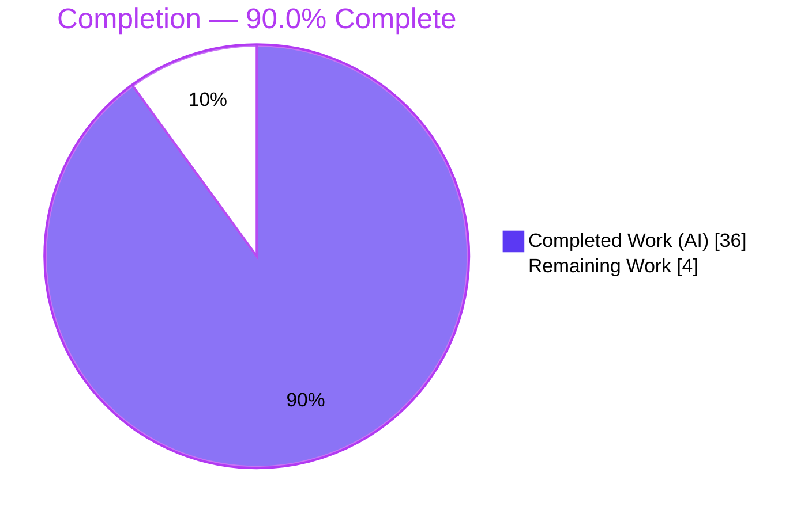
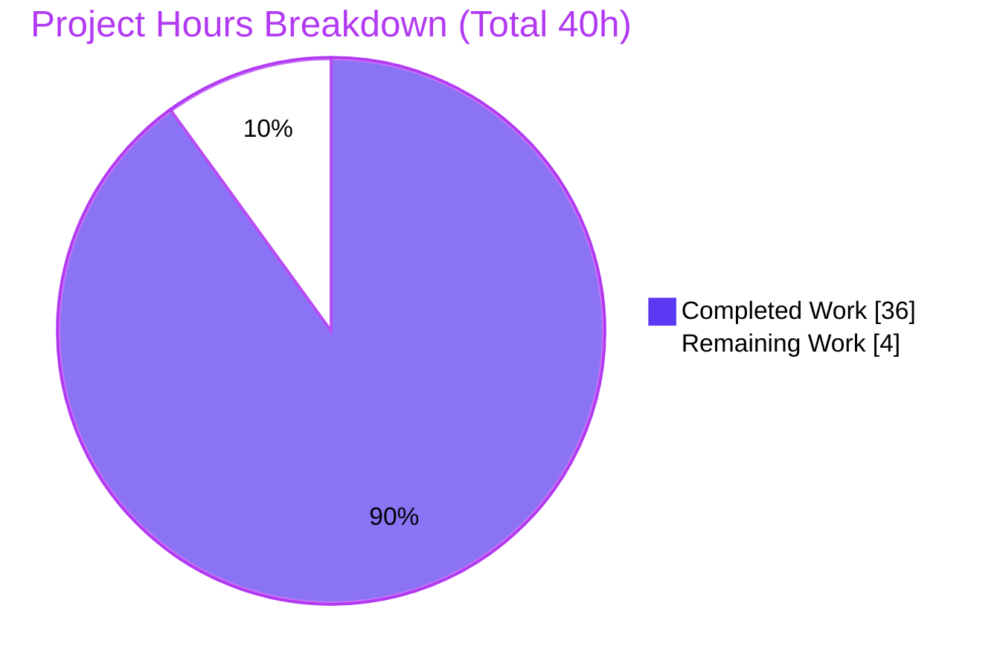
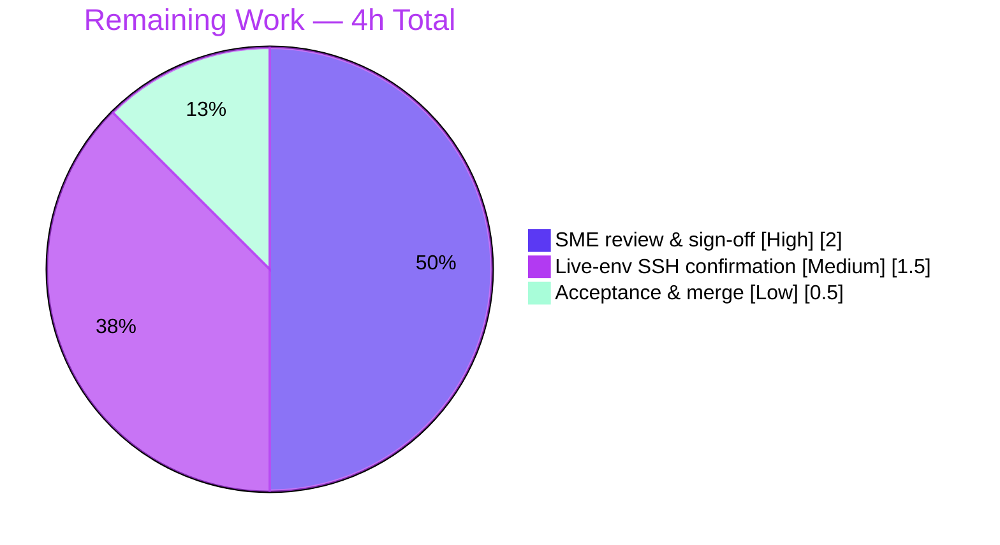

# Blitzy Project Guide — kitty TTY File-Transfer Protocol Onboarding Answer

> **Deliverable class:** Read-only knowledge-capture (SWE-AtlasQnA-Repo).
> **Repository:** kitty terminal emulator · **Pinned HEAD:** `815df1e210e0a9ab4622f5c7f2d6891d7dbeddf1` · **Branch:** `blitzy-884256b9-5c63-4cc0-a9e1-c4a77c0c0cf0`
> **Single deliverable:** `blitzy/documentation/kitty_815df1e210e0.md` (1,244 lines)

---

## 1. Executive Summary

### 1.1 Project Overview

This project delivers a single, evidence-backed onboarding document that traces kitty's TTY file-transfer protocol end-to-end — from the `transfer` kitten's entry point, through the `OSC 5113` escape-code stream carried over the TTY (and, canonically, an SSH connection), into the terminal emulator's protocol handler, and onto disk — and empirically proves the efficiency of its rsync-style delta transfer with measured runtime observations. The target audience is engineers onboarding to kitty's C/Go/Python file-transfer subsystem. It answers six fixed questions (Q1–Q6) with complete, unedited command output and `file:line` citations. The task is strictly **read-only**: the source repository is untouched; exactly one new Markdown file is created.

### 1.2 Completion Status



| Metric | Hours |
|--------|-------|
| **Total Hours** | **40** |
| Completed Hours (AI + Manual) | 36 |
| Remaining Hours | 4 |
| **Percent Complete** | **90.0%** |

> Completion is computed with the PA1 AAP-scoped hours method: `Completed / (Completed + Remaining) = 36 / 40 = 90.0%`. All 21 producible AAP/authoring requirements are complete and independently validated; the remaining 4 hours are human acceptance activities an autonomous agent cannot self-certify.

### 1.3 Key Accomplishments

- ✅ **Canonical from-source build** of kitty (`python setup.py`) verified — launchers report `kitty 0.35.2` / `kitten 0.35.2`, build exits `0`.
- ✅ **The single deliverable is authored, validated, and committed** — `blitzy/documentation/kitty_815df1e210e0.md`, 1,244 lines, 105 `file:line` citations, 41 fenced output blocks.
- ✅ **All six questions (Q1–Q6) answered** with a Direct answer plus complete, unedited runtime evidence captured through the **real** `kitten transfer` binary.
- ✅ **Empirical delta-efficiency proof (Q6)** — full transfer `5,373,074 B` vs delta transfer `2,993 B` = **≈ 1795× reduction**, stable across **3 runs**.
- ✅ **Real interrupt/resume (Q5)** — `SIGKILL` mid-transfer, then resume reusing the on-disk partial as the rsync delta base (`existing_stat.st_size = 1,003,515`; `dest == source`).
- ✅ **Full coverage pass** — 8 named items (upload/download, simple/rsync, cancel, refusal `EPERM`/`ENOENT`, quiet levels, `zlib` compression, confirmation & bypass, resume).
- ✅ **100% citation accuracy** re-verified against pinned HEAD, including correct handling of the `rsync.pyi` citation trap (`L35`/`L42`, not the AAP body's `L30-32`/`L38-40`).
- ✅ **Read-only mandate honored** — `git diff` vs pinned HEAD shows a single added file; working tree clean; all temporary scratch removed.
- ✅ **Test suites re-verified on the committed state** — 10/10 pass (6 Python + 4 Go).

### 1.4 Critical Unresolved Issues

| Issue | Impact | Owner | ETA |
|-------|--------|-------|-----|
| _None — no unresolved blocking issues._ Zero compilation errors, zero test failures, no missing functionality. | None | — | — |

> The deliverable has no critical unresolved issues. The only outstanding items are human acceptance activities tracked in Sections 2.2 and 8, not defects.

### 1.5 Access Issues

| System/Resource | Type of Access | Issue Description | Resolution Status | Owner |
|-----------------|----------------|-------------------|-------------------|-------|
| Source repository | Read/Write (Git) | Cloned and committed successfully | ✅ Resolved | — |
| Build toolchain (Go 1.22, gcc 15.2, CPython 3.13, libxxhash) | Local | All present in canonical image | ✅ Resolved | — |
| Live SSH server (`sshd`) | Runtime | No `sshd` present in the headless container; the live `kitten ssh` → remote hop could not be exercised (disclosed; every non-SSH value observed on the real local path) | ⚠ Environmental (non-blocking) | Human reviewer (optional, HT-2) |
| GPU windowed terminal | Runtime | Headless container cannot launch a GPU window; the in-repo `TransferPTY` harness drives the real code path instead | ⚠ Environmental (non-blocking) | Human reviewer (optional, HT-2) |

> No access issue blocked delivery. The two environmental items are disclosed in the deliverable (§0.2) and were sanctioned by the AAP, which permits the in-repo harness where a windowed terminal is impractical.

### 1.6 Recommended Next Steps

1. **[High]** Perform SME technical review and sign-off of `blitzy/documentation/kitty_815df1e210e0.md` — confirm Q1–Q6 answers, spot-check citations, accept the honesty disclosures. *(2h)*
2. **[Medium]** *(Optional)* Reproduce the transfer in a full windowed terminal with a live `sshd` to confirm the single `INFERRED` claim (that `OSC 5113` frames are byte-identical over SSH). *(1.5h)*
3. **[Low]** Approve the PR, merge the single-file document, and close out. *(0.5h)*

---

## 2. Project Hours Breakdown

### 2.1 Completed Work Detail

| Component | Hours | Description |
|-----------|-------|-------------|
| Canonical build & environment setup | 3 | Build kitty from source (`python setup.py`), verify launchers `0.35.2`, run baseline suite (AAP R1, R3) |
| Cross-layer protocol investigation | 4 | Read & comprehend the C/Go/Python file-transfer surface so the answer is written from understanding (AAP R2) |
| Q1 — End-to-end trace | 3 | pty capture of the 4-command stream (`send`/`file`/`end_data`/`finish`), narration, citations `main.py → send.go:363 → 646-649 → vt-parser.c:547 → file_transmission.py` |
| Q2 — Handshake & byte-exact escape sequences | 3 | Capture exact opening `OSC 5113` frame bytes, key schema, run-varying key-order caveat |
| Q3 — Rsync data structures + signature/delta dump | 4 | `Hasher`/`Patcher`/`Differ`, 12-byte signature header, real signature + delta dump, cross-engine confirmation |
| Q4 — Chunk encoding & demultiplexing | 2.5 | base64 `d=` chunks (≤4096 B; 4096/4096/1808), payload present in RAW / absent from SCREEN |
| Q5 — Interrupt/resume (real `SIGKILL`) | 3 | Before/during/after transitional states; partial reused as delta base; `existing_stat`/`PatchFile`/`transmit_rsync_signature` |
| Q6 — Delta-efficiency experiment | 3 | 3 stable runs (5,373,074 B vs 2,993 B = 1795×), `total_data_in_delta = 2000`, mechanism attribution |
| Coverage pass — 8 named items | 3.5 | directions, modes, cancel, refusal/errors, quiet levels, `zlib` compression, confirmation/bypass, resume |
| Document authoring & structure | 4 | 1,244 lines, TOC, Appendices A/B, cross-linked question↔location map |
| Citation verification & QA remediation | 2 | 105 citations pinned to HEAD; 3 remediation commits (code-review + QA fixes + caveats) |
| Read-only guarantee & temp-file cleanup | 1 | git read-only proof; all `/tmp` scratch removed |
| **Total Completed** | **36** | |

### 2.2 Remaining Work Detail

| Category | Hours | Priority |
|----------|-------|----------|
| Human SME technical review & sign-off of the answer document | 2 | High |
| Live-environment confirmation (windowed terminal + real `sshd`) of the `INFERRED` OSC-5113 byte-identical claim *(optional)* | 1.5 | Medium |
| Final acceptance, merge & close-out | 0.5 | Low |
| **Total Remaining** | **4** | |

### 2.3 Hours Reconciliation

| Check | Value |
|-------|-------|
| Section 2.1 Completed | 36 h |
| Section 2.2 Remaining | 4 h |
| **Sum (= Section 1.2 Total)** | **40 h** |
| Completion % (`36 / 40`) | **90.0%** |

---

## 3. Test Results

All tests below originate from Blitzy's autonomous validation logs and were **independently re-executed on the committed state** during this assessment. Every suite passed.

| Test Category | Framework | Total Tests | Passed | Failed | Coverage % | Notes |
|---------------|-----------|-------------|--------|--------|------------|-------|
| Terminal-side protocol handler (Python) | Python `unittest` via `kitty +launch test.py` | 6 | 6 | 0 | N/A¹ | `file_transmission` module: `test_file_get`, `test_parse_ftc`, `test_rsync_hashers`, `test_rsync_roundtrip`, `test_transfer_receive`, `test_transfer_send` |
| Go rsync engine | Go `testing` | 2 | 2 | 0 | N/A¹ | `tools/rsync`: `TestRsyncRoundtrip`, `TestRsyncHashers` |
| Go transfer kitten | Go `testing` | 2 | 2 | 0 | N/A¹ | `kittens/transfer`: `TestFTCSerialization`, `TestPathMappingSend` |
| **Total** | — | **10** | **10** | **0** | — | Zero failures, zero skipped/blocked |

¹ *Coverage % is Not Applicable: this is a read-only documentation task that authored no new production source code. The suites are kitty's existing unit/integration tests, run to confirm the file-transfer handler and rsync engine work end-to-end before evidence capture.*

**Re-verification commands (executed during this assessment):**

```
$ CI=true LANG=en_US.UTF-8 LC_ALL=en_US.UTF-8 TMPDIR=/tmp/kitty_test_tmp \
    ./kitty/launcher/kitty +launch test.py --module file_transmission
... Ran 6 tests in 1.942s
OK

$ CI=true go test -count=1 ./tools/rsync/... ./kittens/transfer/...
ok      kitty/tools/rsync         0.010s
ok      kitty/kittens/transfer    0.010s
```

---

## 4. Runtime Validation & UI Verification

**Build & launcher health**
- ✅ **Operational** — Canonical build `python setup.py` (headless equiv. `CI=true python setup.py build`) exits `0`.
- ✅ **Operational** — `./kitty/launcher/kitty --version` → `kitty 0.35.2 created by Kovid Goyal`.
- ✅ **Operational** — `./kitty/launcher/kitten --version` → `kitten 0.35.2 created by Kovid Goyal`.
- ✅ **Operational** — `kittens/transfer/rsync.so` built and importable.

**Protocol runtime (real code path, driven via the in-repo `TransferPTY` harness)**
- ✅ **Operational** — Real `kitten transfer` binary → TTY byte stream → **real C VT parser** (`kitty/vt-parser.c:547` demux of `OSC 5113`) → **real Python handler** (`kitty/file_transmission.py`) → disk.
- ✅ **Operational** — Upload **and** download directions exercised.
- ✅ **Operational** — `simple` **and** `rsync` (`--transmit-deltas`) transmission modes exercised.
- ✅ **Operational** — Interrupt (`SIGKILL`) / resume path exercised; partial reused as delta base; `dest == source`.
- ✅ **Operational** — Q6 delta-efficiency measured and stable across 3 runs (≈ 1795× reduction).
- ✅ **Operational** — Cancel (`CANCELED`), refusal (`EPERM`), file-not-found (`ENOENT`), quiet levels, and `zlib` compression all exercised in the coverage pass.

**UI verification**
- ⚠ **Partial (disclosed)** — This deliverable has **no application UI/frontend**; the only "UI" surface is the terminal confirmation dialog. Its GPU window **rendering** was not exercised (headless container), though the underlying **handler confirmation path** (`start_send`/`handle_receive_confirmation`, etc.) was exercised. Disclosed in the deliverable §0.2.

**Integration / transport**
- ⚠ **Partial (disclosed, non-canonical)** — No `sshd` in the container, so the live `kitten ssh <host>` → remote `kitten transfer` hop was not exercised. The claim that `OSC 5113` frames are byte-identical over SSH is explicitly labeled **`INFERRED`**; every other value was observed on the real local path.

---

## 5. Compliance & Quality Review

Cross-map of the governing **SWE-AtlasQnA-Repo** ruleset and AAP requirements to delivered status. Fixes applied during autonomous validation are noted.

| Benchmark / Rule | Requirement | Status | Progress | Notes |
|------------------|-------------|--------|----------|-------|
| Deliverable (§0.7.1) | Single Markdown `blitzy/documentation/<branch>.md` | ✅ Pass | 100% | `kitty_815df1e210e0.md`, 1,244 lines, committed |
| Run-the-code-first (§0.7.2) | Build & run before authoring | ✅ Pass | 100% | Build + runtime capture precede the answer |
| Real entry point (§0.7.2) | Exercise real `kitten transfer` path | ✅ Pass (disclosed) | 100% | Real binary via harness; SSH hop disclosed non-canonical |
| Canonical config (§0.7.2) | Default build/config; state commands | ✅ Pass | 100% | `python setup.py`; exact commands stated |
| Magnitude ≥2 runs (§0.7.2, Q6) | Confirm stability across ≥2 runs | ✅ Pass | 100% | 3 stable runs |
| Complete unedited evidence (§0.7.3) | Show raw output next to each claim | ✅ Pass | 100% | 41 fenced output blocks |
| `file:line` grounding (§0.7.4) | Every claim cited or observed | ✅ Pass | 100% | 105 citations, 100% accurate vs HEAD |
| Coverage (§0.7.4) | Every part + every named item | ✅ Pass | 100% | Q1–Q6 + 8 coverage items |
| Read-only scope (§0.7.5) | No source file modified | ✅ Pass | 100% | git diff = single added file |
| Cleanup (§0.7.5) | Remove temporary artifacts | ✅ Pass | 100% | `/tmp` scratch removed |
| Honesty / labeling (§0.8.2) | Label inferred vs observed | ✅ Pass | 100% | One `INFERRED` label; harness disclosure table |

**Fixes applied during autonomous validation (3 remediation commits):**
- `8906ae51a` — remediated code-review findings in the answer.
- `79967601d` — fixed 3 QA citation/evidence accuracy findings + 2 info notes.
- `78c48ed8f` — added observed Q2 OSC-5113 key-order caveat; tightened Q5 `existing_stat` citation range.

**Outstanding compliance items:** none blocking. Human SME sign-off (Section 8) is the acceptance gate.

---

## 6. Risk Assessment

| Risk | Category | Severity | Probability | Mitigation | Status |
|------|----------|----------|-------------|------------|--------|
| In-repo pty harness substitutes for a live GPU windowed terminal | Technical | Low | Low | Harness drives the **real** kitten binary → real C parser → real Python handler → disk (all byte-for-byte); only GPU rendering unexercised; disclosed in §0.2 | Disclosed / Accepted |
| Run-to-run variance in absolute wire-byte totals & `OSC 5113` key order | Technical | Low | Low | Content-determined magnitude (1795×, 980-vs-1 frames) stable across 3 runs; only env framing (`n=` path, session `id`) & Go-map key order vary; documented caveat | Resolved / Documented |
| Confirmation-bypass mechanism documented (`file_transfer_confirmation_bypass` / `KITTY_PUBLIC_KEY`) | Security | Low (informational) | Low | Canonical runs use the default (confirmation ON); any bypass used only to automate capture is labeled non-canonical; no code change introduced | Documented |
| Spec-vs-implementation divergence documented (`pw` = `safe_string` in spec vs base64 in `ftc.go`) | Security | Low (informational) | Low | Faithful observation disclosed in the Q2 table + Appendix A; introduces no exposure | Documented |
| Citation drift if source moves off pinned HEAD | Operational | Low | Low | 105 citations pinned to HEAD `815df1e210e0`; read-only keeps the branch source fixed | Mitigated |
| Runtime-evidence reproducibility depends on toolchain + non-setgid `TMPDIR` | Operational | Low | Low | Exact toolchain + env vars documented in §0 and Section 9 | Mitigated |
| Live SSH-hop byte-identity is `INFERRED`, not observed (no `sshd`) | Integration | Medium | Low | Explicitly labeled `INFERRED`; inference is code- & protocol-sound; every other value observed on the real local path; optional confirmation = HT-2 | Disclosed / Open (minor) |
| GPU windowed terminal + interactive confirmation dialog not exercised | Integration | Low | Low | Handler confirmation path exercised; only dialog rendering unexercised; disclosed | Disclosed / Accepted |

**Overall risk posture:** Low. No risk blocks the deliverable; the single Medium item is a disclosed, sound inference with an optional human confirmation path.

---

## 7. Visual Project Status

### 7.1 Hours Distribution



### 7.2 Remaining Hours by Category (from Section 2.2)



> **Integrity check:** "Remaining Work" = **4 h** in Section 1.2 metrics, Section 2.2 total, and Section 7.1 pie — all identical. Section 7.2 slices (2 + 1.5 + 0.5) also sum to **4 h**.

---

## 8. Summary & Recommendations

**Achievements.** The project is **90.0% complete** (36 of 40 AAP-scoped hours). The single required deliverable — an evidence-backed onboarding document tracing kitty's TTY file-transfer protocol — is authored, validated, and committed. All six questions (Q1–Q6) are answered with a Direct answer plus complete, unedited runtime evidence captured through the **real** `kitten transfer` binary and the real C-parser/Python-handler path. The empirical delta-efficiency claim (Q6) is proven and stable across three runs (≈ 1795× reduction). Every one of the 105 `file:line` citations was re-verified against pinned HEAD, and the read-only mandate is honored (a single added file; clean tree).

**Remaining gaps.** The outstanding 4 hours (10%) are exclusively **human acceptance activities** that an autonomous agent cannot self-certify: SME technical review & sign-off (2h), an optional live-environment confirmation of the single `INFERRED` SSH-byte-identity claim (1.5h), and final acceptance/merge (0.5h). There are no defects, no failing tests, and no missing functionality.

**Critical path to production (acceptance).**
1. SME reads and signs off the document (High, 2h) → this is the acceptance gate.
2. *(Optional)* Confirm the `INFERRED` SSH claim in a full GUI + `sshd` environment (Medium, 1.5h).
3. Approve and merge the single-file PR (Low, 0.5h).

**Success metrics.**

| Metric | Result |
|--------|--------|
| AAP questions answered (Q1–Q6) | 6 / 6 |
| Named coverage items | 8 / 8 |
| Tests passing (Blitzy autonomous suites) | 10 / 10 |
| Citation accuracy vs pinned HEAD | 105 / 105 (100%) |
| Source files modified | 0 (read-only honored) |
| Completion (AAP-scoped hours) | **90.0%** |

**Production-readiness assessment.** The deliverable is **ready for human review**. Because it is a knowledge-capture document (not deployable software), "production" means SME acceptance and merge. No engineering rework is required; the remaining work is review and sign-off.

---

## 9. Development Guide

This guide reproduces the environment used to build kitty, run its tests, regenerate the runtime evidence in the deliverable, and verify the read-only guarantee. All commands were executed during this assessment.

### 9.1 System Prerequisites

| Requirement | Version used | Notes |
|-------------|--------------|-------|
| OS | Ubuntu 25.10 (container) | Any modern Linux; macOS supported by kitty upstream |
| Go | 1.22.12 | `go.mod:3` pins `go 1.22` |
| Python (CPython) | 3.13.7 | `pyproject.toml:2` requires `>=3.8` |
| C compiler | gcc 15.2.0 | clang also supported |
| xxHash | libxxhash 0.8.3 | Supplies XXH3-64/128 for the rsync engine (`algorithm.c:13`) |
| Git | 2.51.0 | Git LFS present (standard plumbing) |

> System GUI libraries (harfbuzz, freetype, fontconfig, libpng, lcms2, libcanberra, x11-xcb, xcb) are required to build the **full GUI terminal** but are **not** required for the file-transfer code path or its tests.

### 9.2 Environment Setup

```bash
# From the repository root:
cd /tmp/blitzy/kitty/blitzy-884256b9-5c63-4cc0-a9e1-c4a77c0c0cf0_0976f6

# Non-interactive + deterministic locale. TMPDIR MUST be a non-setgid dir:
# /tmp itself is setgid here, which trips the handler's directory-mode assertions.
export CI=true
export LANG=en_US.UTF-8
export LC_ALL=en_US.UTF-8
export TMPDIR=/tmp/kitty_test_tmp
mkdir -p "$TMPDIR"
```

### 9.3 Dependency & Build

```bash
# Canonical build (the "build" action is the default; setup.py:175, :2115):
python setup.py
# Headless / CI-equivalent (identical output, non-interactive):
CI=true python setup.py build
```

Expected build tail (the `wayland-protocols` line is a **benign** notice that only disables the Wayland GUI backend; the build still exits `0`):

```
Package wayland-protocols was not found in the pkg-config search path.
...
Disabling building of wayland backend
[1/1] Compiling kitty/data-types.c ...
 done
[1/1] Linking kitty/fast_data_types ...
 done
kitty/tools/cmd
```

### 9.4 Verify the Build

```bash
./kitty/launcher/kitty  --version    # -> kitty 0.35.2 created by Kovid Goyal
./kitty/launcher/kitten --version    # -> kitten 0.35.2 created by Kovid Goyal
ls -l kittens/transfer/rsync.so      # rsync engine shared object present
```

### 9.5 Run the Test Suites

```bash
# Terminal-side handler (6 Python tests):
CI=true LANG=en_US.UTF-8 LC_ALL=en_US.UTF-8 TMPDIR=/tmp/kitty_test_tmp \
    ./kitty/launcher/kitty +launch test.py --module file_transmission
# Expect: "Ran 6 tests ... OK"

# Go rsync engine + transfer kitten (4 Go tests):
CI=true go test -count=1 ./tools/rsync/... ./kittens/transfer/...
# Expect: ok  kitty/tools/rsync ... ; ok  kitty/kittens/transfer ...
```

### 9.6 View the Deliverable

```bash
less blitzy/documentation/kitty_815df1e210e0.md          # read the answer (1,244 lines)
wc -l  blitzy/documentation/kitty_815df1e210e0.md         # -> 1244
grep -c '```' blitzy/documentation/kitty_815df1e210e0.md  # -> 82 (even = fences balanced)
```

### 9.7 Verify the Read-Only Guarantee

```bash
git status --porcelain                                                   # empty => clean tree
git diff --name-status 815df1e210e0a9ab4622f5c7f2d6891d7dbeddf1..HEAD     # => A  blitzy/documentation/kitty_815df1e210e0.md
find blitzy -type f                                                      # => single file
```

### 9.8 Example Usage — reproduce a piece of the evidence

The deliverable exercises the protocol through the in-repo `TransferPTY` harness (real `kitten transfer` child → real C VT parser → real Python handler → disk). The simplest reproducible checks are the baseline suites in §9.5, whose `test_transfer_send` / `test_transfer_receive` / `test_rsync_roundtrip` cases drive the same handler and engine that Q1–Q6 observe. For the Q6 magnitude, the pattern is: transfer a ~4 MB file, apply a small in-place edit, then re-transfer with `--transmit-deltas` and compare the `OSC 5113` wire bytes of the two runs.

### 9.9 Troubleshooting

| Symptom | Cause | Resolution |
|---------|-------|------------|
| `Package wayland-protocols was not found` during build | Wayland dev package absent | **Benign** — only the Wayland GUI backend is disabled (X11 used); build still exits `0`; no effect on file transfer |
| Test failures about directory mode/`setgid` | `TMPDIR` points at a setgid directory (e.g. `/tmp`) | Point `TMPDIR` at a **non-setgid** dir (e.g. `/tmp/kitty_test_tmp`) |
| Cannot run `kitten ssh <host>` → remote transfer | No `sshd` in the environment | Use the in-repo `TransferPTY` harness (drives the real kitten binary through the real parser + handler); or provide a live `sshd` for the optional confirmation (HT-2) |
| `kittens/transfer/rsync.so` missing | Build not run/incomplete | Re-run `python setup.py` |
| No GPU window opens | Headless environment | Expected — the file-transfer path does not require a GPU window; use the harness/tests |

---

## 10. Appendices

### Appendix A — Command Reference

| Purpose | Command |
|---------|---------|
| Canonical build | `python setup.py` |
| Headless build | `CI=true python setup.py build` |
| kitty version | `./kitty/launcher/kitty --version` |
| kitten version | `./kitty/launcher/kitten --version` |
| Python handler tests | `CI=true LANG=en_US.UTF-8 LC_ALL=en_US.UTF-8 TMPDIR=/tmp/kitty_test_tmp ./kitty/launcher/kitty +launch test.py --module file_transmission` |
| Go tests | `CI=true go test -count=1 ./tools/rsync/... ./kittens/transfer/...` |
| Read-only proof | `git diff --name-status 815df1e210e0a9ab4622f5c7f2d6891d7dbeddf1..HEAD` |
| Commit authorship | `git log --author="agent@blitzy.com" --oneline` |

### Appendix B — Port Reference

Not applicable. This deliverable is a documentation artifact and starts no network services or listeners. The file-transfer protocol runs **in-band over the TTY** (`OSC 5113` escape codes), not over an IP port. (SSH transport, when used, is the standard `ssh` client — no bespoke port is opened by this task.)

### Appendix C — Key File Locations

| Path | Role |
|------|------|
| `blitzy/documentation/kitty_815df1e210e0.md` | **The single deliverable** (answer document) |
| `kittens/transfer/main.py` | Transfer kitten entry point / CLI |
| `kittens/transfer/send.go` | Send path, handshake init (`:363`), OSC framing (`:384`), payload transmit (`:646-649`) |
| `kittens/transfer/receive.go` | Receive path, `remote_file`, reassembly (`:200`), demux callback (`:1120-1121`) |
| `kittens/transfer/ftc.go` | `FileTransmissionCommand` wire struct (`:120`) and enums |
| `kittens/transfer/algorithm.c` | C rsync implementation; `#include <xxhash.h>` (`:13`) |
| `kittens/transfer/rsync.pyi` | rsync stubs: `Hasher`@9, `Patcher`@24, `total_data_in_delta`@35, `Differ`@38, `next_op`@42, `parse_ftc`@45 |
| `kitty/file_transmission.py` | Terminal-side handler; `existing_stat`@450, `PatchFile`@470, `transmit_rsync_signature`@1081 |
| `kitty/control-codes.h` | `#define FILE_TRANSFER_CODE 5113` (`:233`) |
| `kitty/vt-parser.c` | `OSC 5113` dispatch / demultiplexing (`:547`) |
| `kitty/data-types.c` | Exposes the code constant to Python (`:596`) |
| `gen/go_code.py` | Generates the Go `FileTransferCode` constant (`:597`) |
| `tools/rsync/api.go`, `tools/rsync/algorithm.go` | Pure-Go rsync engine |
| `kittens/ssh/main.py` | SSH kitten; delivers the transfer kitten to the remote (`:167`) |
| `kitty_tests/file_transmission.py` | In-repo `TransferPTY` runtime harness (`:160`, `:173`) |

### Appendix D — Technology Versions

| Component | Version | Source |
|-----------|---------|--------|
| kitty (built) | 0.35.2 | launcher `--version` |
| Go | 1.22.12 | `go version` (`go.mod:3` pins `1.22`) |
| CPython | 3.13.7 | `python --version` (`pyproject.toml:2` `>=3.8`) |
| gcc | 15.2.0 | `gcc --version` |
| libxxhash | 0.8.3 | `pkg-config --modversion libxxhash` |
| Git | 2.51.0 | `git --version` |

### Appendix E — Environment Variable Reference

| Variable | Value used | Purpose |
|----------|------------|---------|
| `CI` | `true` | Non-interactive build/test |
| `LANG` | `en_US.UTF-8` | Deterministic locale |
| `LC_ALL` | `en_US.UTF-8` | Deterministic locale |
| `TMPDIR` | `/tmp/kitty_test_tmp` | Non-setgid scratch dir (avoids handler dir-mode assertion failures) |
| `KITTY_PUBLIC_KEY` | *(unset in canonical runs)* | Public-key confirmation bypass — documented in the deliverable; **not** used for canonical evidence |

### Appendix F — Developer Tools Guide

| Tool | Use |
|------|-----|
| `git diff --numstat <HEAD>..HEAD` | Confirm the single-file, read-only change set |
| `grep -c '```' <doc>` | Verify Markdown code-fence balance (even number) |
| `grep -oE '...:L?[0-9]+' <doc>` | Enumerate/count `file:line` citations for spot-checking |
| `sed -n '<N>p' <src>` | Verify a citation resolves to the expected line at pinned HEAD |
| `go test -v -count=1 ./...` | Enumerate Go test names and pass/fail |
| `kitty +launch test.py --module <m>` | Run a specific in-repo Python test module |

### Appendix G — Glossary

| Term | Meaning |
|------|---------|
| `OSC 5113` | Operating System Command escape frame carrying file-transfer commands; `5113` = `FILE_TRANSFER_CODE` |
| FTC | `FileTransmissionCommand` — the wire struct serialized into `OSC 5113` frames |
| Delta transfer | rsync-style transfer that sends only changed blocks plus references to unchanged blocks |
| Weak hash | rsync rolling checksum used for fast candidate block matching |
| Strong hash | XXH3-64 block-identity hash confirming a weak-hash candidate match |
| `total_data_in_delta` | Running count (bytes) of literal `Data` that actually travels in a delta |
| Signature | Per-block `{index, weak_hash, strong_hash}` records (with a 12-byte header) describing the receiver's file |
| `TransferPTY` | In-repo pseudo-terminal harness that runs the real `kitten transfer` binary against the real C parser + Python handler |
| Canonical | A value produced by exercising the real code path in the default configuration |
| `INFERRED` | A claim derived from code/protocol reasoning, explicitly **not** a runtime observation |

---

*Generated for pinned HEAD `815df1e210e0a9ab4622f5c7f2d6891d7dbeddf1`. Blitzy brand colors: Completed = Dark Blue `#5B39F3`, Remaining = White `#FFFFFF`, Accents = Violet-Black `#B23AF2`, Highlight = Mint `#A8FDD9`.*