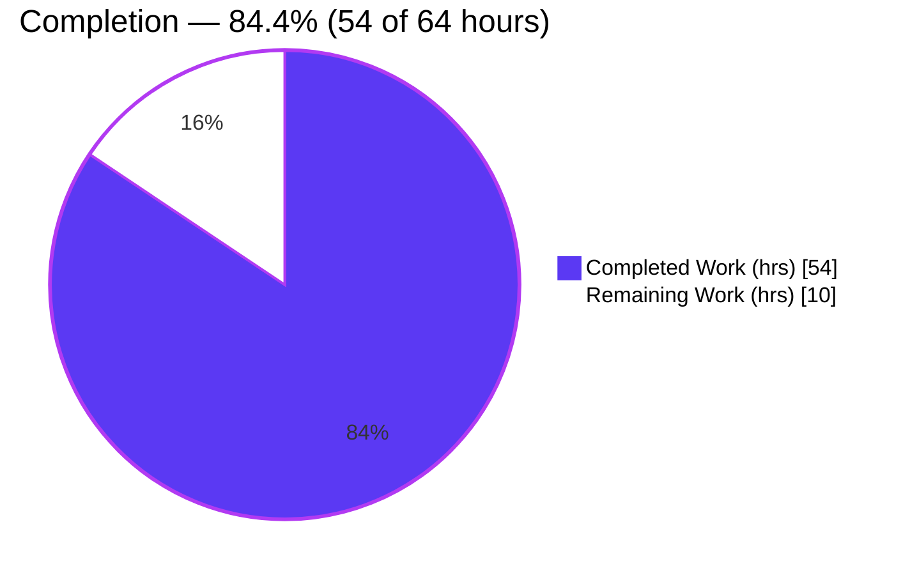
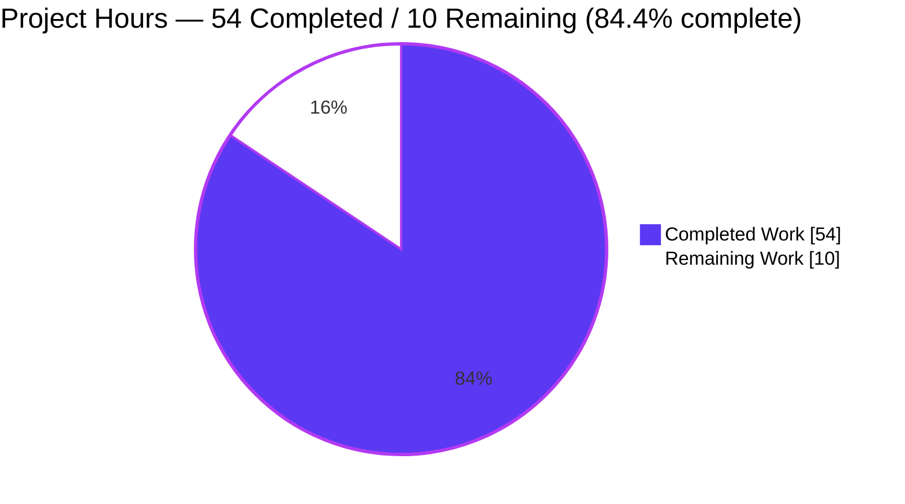
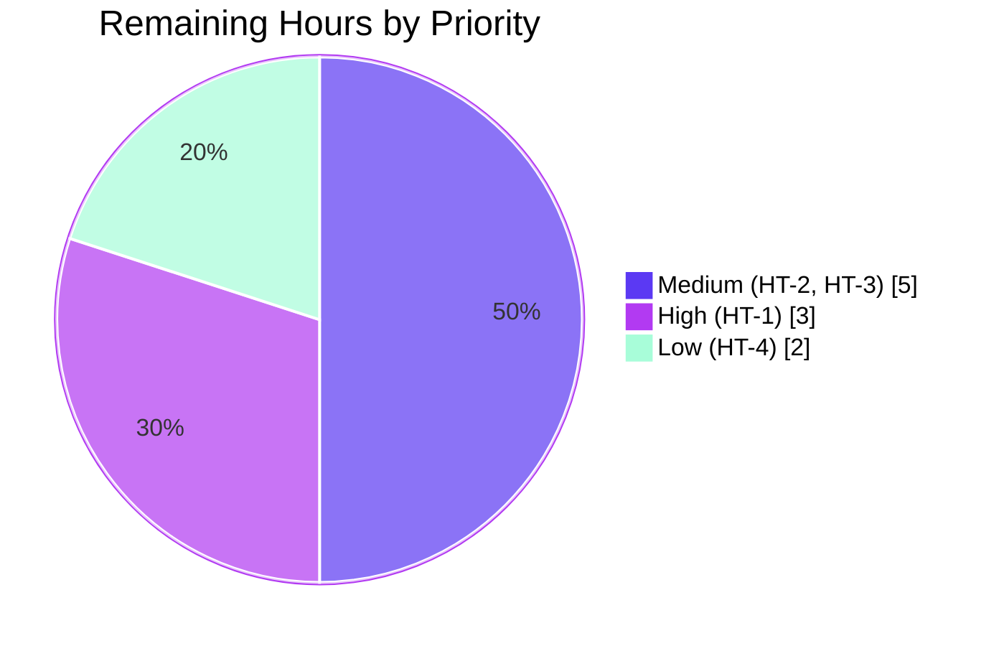

# Blitzy Project Guide — kitty PTY Shell-Communication Runtime Investigation

> Repository: `kovidgoyal/kitty` · Target commit: `815df1e210e0a9ab4622f5c7f2d6891d7dbeddf1` · Branch: `blitzy-ecabc877-16f7-4bb7-94fd-af5473cb3e57`
>
> Color legend — **<span style="color:#5B39F3">Completed / AI Work = Dark Blue (#5B39F3)</span>** · Remaining / Not Completed = White (#FFFFFF) · Headings/Accents = Violet-Black (#B23AF2) · Highlight = Mint (#A8FDD9)

---

## 1. Executive Summary

### 1.1 Project Overview

This project is a **runtime question-and-answer code investigation** of the kitty terminal emulator, answering how kitty's C code communicates with the shell it spawns over a pseudoterminal (PTY). The target audience is engineers studying kitty's I/O internals. The technical scope spans kitty's Python spawn orchestration and its C core (shell spawn, PTY read loop, VT parser) built and exercised at runtime. Business impact: a single, authoritative, evidence-backed reference document (`blitzy/documentation/kitty_815df1e210e0.md`) that resolves six requirements (R1–R6) with captured system-call traces, process/file-descriptor introspection, and source cross-references. No production source is modified; the deliverable is the answer document itself.

### 1.2 Completion Status

The project is **84.4% complete** on an AAP-scoped, hours-based basis. Every autonomous requirement (build, launch, observe R1–R6, author the document, honor read-only integrity) is delivered and independently reproduced; the remaining work is standard path-to-production human acceptance.



| Metric | Value |
|---|---|
| **Total Hours** | **64** |
| Completed Hours (AI + Manual) | 54 (AI: 54 · Manual: 0) |
| Remaining Hours | 10 |
| **Percent Complete** | **84.4%** |

> Calculation (PA1, AAP-scoped): `Completion % = Completed / (Completed + Remaining) = 54 / (54 + 10) = 54 / 64 = 84.375% ≈ 84.4%`.

### 1.3 Key Accomplishments

- ✅ **R1 — Built kitty from source and launched it.** Canonical `make` (→ `python3 setup.py`) completed with **exit 0**; version banner **`kitty 0.35.2 created by Kovid Goyal`**; launched headlessly under Xvfb with software OpenGL.
- ✅ **R2 — Identified the spawned shell.** Process **`/bin/bash`**, exact command line **`/bin/bash --posix`**, connected via PTY slave **`/dev/pts/0`** ↔ master **`/dev/pts/ptmx`**.
- ✅ **R3 — Captured the read syscalls for `echo test123`.** Sequence **`poll()` → `read()`**; buffer **1,048,576 bytes (1 MiB)**; returns 1 byte per keystroke echo, then **11 / 47 / 114 / 182** bytes after Enter.
- ✅ **R4 — Characterized high-volume `yes hello` behavior.** Same `read`→`poll` primitive, one read per `POLLIN`, coalescing ~150 lines/read (median ≈ **1 KiB**, kernel-bounded), stable across **two runs** with an honest traced-only caveat.
- ✅ **R5 — Determined the master FD.** **fd 8**, corroborated four independent ways (`strace -yy`, `/proc/<pid>/fd`, `lsof`, `fdinfo`).
- ✅ **R6 — Identified the C functions.** Reader **`read_bytes()`** (`kitty/child-monitor.c:1337`) on the `KittyChildMon` I/O thread; parser **`consume_input()`** (`kitty/vt-parser.c:1367`) routing printable → `consume_normal()` vs escapes → `consume_esc()`/`consume_csi()`.
- ✅ **Read-only integrity honored.** `git diff` shows exactly one added file; zero source files modified; temporary observation artifacts deleted.
- ✅ **Independently reproduced.** The Final Validator rebuilt and re-observed the entire investigation in the mandated image, passing all five production-readiness gates with **zero document edits required**.

### 1.4 Critical Unresolved Issues

| Issue | Impact | Owner | ETA |
|---|---|---|---|
| _None blocking._ Autonomous deliverable is complete and reproduced. | No release blocker | — | — |
| Traced-only R4 read-frequency magnitude (≈7,300 reads/s) is under `strace` overhead, not native | Low — explicitly caveated in §6.6; behavior shape and per-read magnitude are robust | Reviewer (optional) | 2h |
| Parser thread identity is source-derived (not runtime-marked) | Low — labeled inferred in §8.3/§9; consistent with observed reader-thread separation | SME reviewer | Within review |

### 1.5 Access Issues

| System/Resource | Type of Access | Issue Description | Resolution Status | Owner |
|---|---|---|---|---|
| Mandated Docker image `ghcr.io/scaleapi/swe-atlas:swe_atlas_QnA_kovidgoyal_kitty_1.0` | Container registry pull | Required for byte-exact reproduction of build + observations | Available (used during autonomous run) | Reviewer |
| `ptrace`/`strace` capability | Kernel capability | Requires `--cap-add=SYS_PTRACE --security-opt seccomp=unconfined` + root | Documented in §2 of deliverable; no product-side access issue | Reviewer |

> No repository-permission, credential, or third-party-API access issues were identified. This is a read-only investigation with no network services, secrets, or external integrations.

### 1.6 Recommended Next Steps

1. **[High]** Perform SME technical review and acceptance of the answer document — verify a sample of the 48 `file:line` citations, sanity-check the R1–R6 reasoning, and confirm the coverage checklist (§9). _(3h)_
2. **[Medium]** Reproduce the investigation in a fresh environment to confirm the per-run values are representative — the behavior _shape_ (poll→read, fd is master, 1 MiB buffer, ~1 KiB median reads) should reproduce even though PIDs/FDs/magnitudes differ. _(4h)_
3. **[Medium]** Sign off the merge and confirm read-only integrity in the target repository (`git diff` shows only the added file). _(1h)_
4. **[Low]** Optionally corroborate the native (untraced) read frequency with a lighter-weight instrument (bpftrace/eBPF) to complement the §6.6 traced-only figure. _(2h)_

---

## 2. Project Hours Breakdown

### 2.1 Completed Work Detail

All completed work was performed autonomously (AI). Every component traces to a specific AAP requirement.

| Component | Hours | Description |
|---|---|---|
| R1 — Build + headless launch harness | 6 | Canonical `make` build (exit 0, banner 0.35.2), Xvfb + software-GL launch, PID validation via `/proc/<pid>/exe`, artifact verification |
| R2 — Shell-spawn identity investigation | 3 | `ps`/`pstree`/`/proc` analysis for process, PID, exact argv; PTY device-path resolution; binding to `child.py:276`, `child.c:81/89` |
| R3 — `echo test123` read-syscall capture & analysis | 5 | `strace -f -ttt -yy` harness; `poll()`→`read()` capture; buffer-size derivation (1 MiB = `BUF_SZ`); byte-count analysis |
| R4 — `yes hello` high-volume analysis | 9 | Two stable runs; statistical distribution (median/mean/p90/p95/max); `r4_analyze.py` analyzer; poll-timeout distribution; render-coalescing + back-pressure mechanism binding; honest §6.6 caveat |
| R5 — Master FD 4-way corroboration | 3 | `strace -yy`, `/proc/<pid>/fd/8`, `lsof`, `fdinfo` cross-checks resolving fd 8 → `/dev/pts/ptmx` |
| R6 — C reader/parser + thread-model analysis | 5 | Identify `read_bytes()` / `consume_input()` / `consume_normal()`; `KittyChildMon` thread; `pthread_create` accounting |
| Answer-document authoring | 10 | 1,159-line document; unedited command output per claim; coverage checklist (§9); 48 `file:line` citations; cause→effect rationale |
| Methodology research + environment/method write-up | 3 | `strace`/PTY/N_TTY kernel-model research; environment & method section (§2) |
| Read-only integrity harness + cleanup verification | 2 | Secure `mktemp -d` harness; PID validation; watchdog cleanup; proof `/app` is byte-for-byte unchanged |
| Autonomous validation/QA reconciliation | 8 | Full reproduction in mandated image; 5 production-readiness gates; reconcile every R1–R6; resolve Report-5 findings across 4 commits |
| **Total Completed** | **54** | |

> Section 2.1 total = **54h**, matching Completed Hours in Section 1.2.

### 2.2 Remaining Work Detail

All remaining work is path-to-production human acceptance; each item traces to an AAP acceptance need.

| Category | Hours | Priority |
|---|---|---|
| SME technical review & acceptance of the answer document | 3 | High |
| Fresh-environment reproduction to confirm per-run values representative | 4 | Medium |
| Merge/PR acceptance sign-off + read-only integrity confirmation | 1 | Medium |
| Optional untraced read-frequency corroboration (addresses §6.6 caveat) | 2 | Low |
| **Total Remaining** | **10** | |

> Section 2.2 total = **10h**, matching Remaining Hours in Section 1.2 and the "Remaining Work" value in the Section 7 pie chart.

### 2.3 Hours Reconciliation

| Check | Result |
|---|---|
| Section 2.1 total (Completed) | 54h |
| Section 2.2 total (Remaining) | 10h |
| 2.1 + 2.2 = Total Project Hours | 54 + 10 = **64h** ✓ (matches Section 1.2) |
| Completion % = 54 / 64 | **84.4%** ✓ (matches Sections 1.2, 7, 8) |

---

## 3. Test Results

All tests below originate from Blitzy's autonomous validation logs, executed against the kitty binary built during the investigation (via the repository's `test.py` harness in the mandated image). The full suite returned **exit code 0**.

| Test Category | Framework | Total Tests | Passed | Failed | Coverage % | Notes |
|---|---|---|---|---|---|---|
| Unit + Integration (Python) | Python `unittest` (via `test.py`) | 145 | 141 | 0 | N/A (not measured by suite) | "Ran 145 tests → OK"; 4 by-design skips (CA-frozen-only, macOS-only font, `fish`×2 not installed) |
| Unit (Go) | Go `testing` (via `test.py`) | All Go packages | All | 0 | N/A | "All Go tests succeeded"; 49 `*_test.go` files present in repo |
| Aggregate | — | 145 (+ Go suite) | 141 (+ Go) | **0** | — | `TEST_EXIT=0`; zero FAIL/ERROR |

**Notes on the 4 skips (by design, not failures):** frozen-app-only checks (not applicable to a source build), a macOS-only font test, and two `fish`-shell tests (fish not installed). The default container's 3 environmental failures (POSIX locale + overlay `/tmp` lacking `O_TMPFILE`) were resolved with `LANG=C.UTF-8` + an exec/`O_TMPFILE`-capable `TMPDIR`; none touched the investigated C paths or the deliverable.

---

## 4. Runtime Validation & UI Verification

Legend: ✅ Operational · ⚠ Partial · ❌ Failing

**Build & Launch**
- ✅ **Build** — `make` exit 0; four investigation-central object files byte-identical to the validator's reproduction; banner `kitty 0.35.2`.
- ✅ **Headless launch** — Xvfb `:99` + `LIBGL_ALWAYS_SOFTWARE=1` + `--config NONE`; kitty PID validated via `/proc/<pid>/exe` = `/app/kitty/launcher/kitty`.

**Shell Communication Path (R2–R6)**
- ✅ **Shell spawn (R2)** — `/bin/bash` spawned as child of kitty; exact argv `/bin/bash --posix`; PTY `/dev/pts/0` ↔ `/dev/pts/ptmx`.
- ✅ **Single-command read (R3)** — `poll()`→`read()` on fd 8; buffer 1,048,576; bytes 1 (per keystroke) then 11/47/114/182.
- ✅ **High-volume read (R4)** — one read per `POLLIN`; median ≈ 1 KiB/read; dynamic 0–2 ms poll timeout; stable across two runs.
- ✅ **Master FD (R5)** — fd 8 → `/dev/pts/ptmx` (4-way corroborated).
- ✅ **Reader/parser functions (R6)** — `read_bytes()` (reader, `KittyChildMon` thread) and `consume_input()` (parser) confirmed at runtime + source.

**UI Verification (GUI terminal, headless)**
- ✅ **GUI initialization** — kitty's GLFW/OpenGL window initialized headlessly under the virtual display (no visible desktop; verified operational via successful spawn + input handling).
- ✅ **Real keyboard input path** — both stimuli (`echo test123`, `yes hello`) delivered through the canonical GLFW keyboard path via `xdotool` XTEST synthesis (server-level input events), not remote control or a debug hook.

**API Integration**
- ➖ **Not applicable** — this investigation involves no HTTP/network API surface; the only "interface" exercised is the OS PTY/syscall boundary, which is ✅ Operational as above.

**Repository Integrity**
- ✅ **Source unchanged** — `/app` stayed byte-for-byte at `815df1e210e0`; `git status --porcelain` empty throughout; only the answer document persisted.

---

## 5. Compliance & Quality Review

Cross-mapping the AAP's governing rules (§0.7) and quality benchmarks to observed outcomes. Fixes applied during autonomous validation are noted.

| # | AAP Rule / Quality Benchmark | Status | Evidence / Progress |
|---|---|---|---|
| C1 | Deliverable location & name (`blitzy/documentation/kitty_815df1e210e0.md`) | ✅ Pass | File present, 1,159 lines, committed |
| C2 | Read-only source (no source file modified) | ✅ Pass | `git diff 815df1e210e0..HEAD` = 1 file added; working tree clean |
| C3 | Investigate by running first (evidence, not code-reading) | ✅ Pass | Build/launch/strace performed; unedited output embedded per claim |
| C4 | Exercise the canonical entry point (default config, real input) | ✅ Pass | `make` build, `--config NONE`, XTEST real keyboard; no remote-control/debug hooks |
| C5 | Observe magnitude at scale (≥2 runs, state scale) | ✅ Pass | `yes hello` across two runs; distributions stable (§6.3) |
| C6 | Reproduce run-to-run honestly | ✅ Pass | Same input rerun; observed distribution reported, not curated |
| C7 | Exercise every implied condition (single vs high-volume; before/during/after) | ✅ Pass | §6.4 before/during/after; R3 vs R4 contrast |
| C8 | Include actual, complete output for every claim | ✅ Pass | Command + full unedited output shown throughout |
| C9 | Be exact & grounded (`file:line` for every fact) | ✅ Pass | 48 distinct citations, all resolve at target commit |
| C10 | Answer every named item (coverage pass) | ✅ Pass | §9 coverage checklist maps all 12 named items |
| C11 | Provide rationale (cause→effect) | ✅ Pass | §6.5 mechanism binding; per-answer reasoning |
| Q1 | Build compiles cleanly | ✅ Pass | `make` exit 0, no `-Werror` suppression needed in image |
| Q2 | Test suite passes | ✅ Pass | Python 145 → OK; Go all succeeded; `TEST_EXIT=0` |
| Q3 | Citations resolve | ✅ Pass | Spot-checked + validator-confirmed all 48 resolve |
| Q4 | Markdown structure valid | ✅ Pass | 1 H1 + 10 H2 + 20 H3; 36 balanced code-fence pairs; no header-depth skips |
| Q5 | Cleanup complete (no persisted instrumentation) | ✅ Pass | §10 cleanup statement; temp `WORK` dir removed; both containers torn down |

**Fixes applied during autonomous validation:** Iterative refinement across 4 commits — rewrote the Q&A with authentic in-container evidence, made §8.3 `child-monitor.c` thread accounting exact and grep-consistent, and resolved all six Report-5 review findings. The Final Validator required **zero further document edits**.

**Outstanding compliance items:** None. All rules pass; only human acceptance (Section 2.2) remains.

---

## 6. Risk Assessment

| Risk | Category | Severity | Probability | Mitigation | Status |
|---|---|---|---|---|---|
| Per-run value drift (PIDs, reader tid, FD number, X window id are per-launch) | Technical | Low | High | §9 explicitly caveats these as per-launch; structural facts (fd is master, 1 MiB buffer) are stable | Mitigated / Documented |
| Traced-only R4 magnitudes (≈7,300 reads/s under `strace` overhead ≠ native) | Technical | Low | High | §6.6 honest caveat; robust facts = behavior shape + median ~1 KiB kernel-bounded | Mitigated / Documented |
| Citation line-number drift if repo advances past `815df1e210e0` | Technical | Low | Medium | Document pins the exact commit | Mitigated |
| `strace`/`ptrace` requires `SYS_PTRACE` + `seccomp=unconfined` + root | Security | Low | N/A (reproduction only) | Prerequisite documented in §2; not a product vulnerability | Documented |
| Secrets / credentials / sensitive data exposure | Security | None | None | Read-only investigation; no auth, secrets, or sensitive data in scope | N/A |
| Headless launch prerequisites (GLFW/OpenGL needs Xvfb + software GL) | Operational | Medium | Medium | Exact launch invocation documented in §2/§3.2 | Mitigated |
| Build toolchain dependencies (gcc/go/pkg-config + harfbuzz/libpng/lcms2/fontconfig/freetype/x11/wayland) | Operational | Medium | Medium | Mandated Docker image provides all; versions documented | Mitigated |
| Docker image dependency for exact reproduction | Integration | Low | Low | Full environment documented (Ubuntu 24.04.2 / gcc 13.3.0 / go 1.23.4 / Python 3.12.3) so an equivalent env is reconstructable | Mitigated |
| Parser thread identity is source-derived, not runtime-marked | Integration | Low | Low | Labeled source-derived (§8.3/§9); consistent with observed reader-thread separation | Documented / Accepted |

**Overall risk posture:** LOW. This is a read-only, no-deploy documentation task; every identified risk is Low-to-Medium severity and is already documented or mitigated inside the deliverable.

---

## 7. Visual Project Status

**Project Hours Breakdown (AAP-scoped)** — Completed = Dark Blue (#5B39F3), Remaining = White (#FFFFFF).



**Remaining Work by Priority (hours)** — sums to the Section 2.2 total of 10h.



> **Integrity check:** "Remaining Work" = **10h** here equals Section 1.2 Remaining Hours (10h) and the Section 2.2 "Hours" column total (10h). "Completed Work" = **54h** equals Section 1.2 Completed Hours (54h) and the Section 2.1 total (54h).

---

## 8. Summary & Recommendations

**Achievements.** The project delivers a complete, evidence-grounded answer to how kitty's C code communicates with its shell over a PTY. All six requirements are resolved with captured runtime evidence bound to exact source locations: kitty was **built** (`kitty 0.35.2`, `make` exit 0) and **launched headlessly**; the spawned shell (**`/bin/bash --posix`**), its PTY (**`/dev/pts/0` ↔ `/dev/pts/ptmx`**), the **master FD (8)**, the read syscalls (**`poll()`→`read()`**, **1 MiB** buffer), the high-volume behavior (one read per `POLLIN`, ~1 KiB median, two stable runs), and the C **reader (`read_bytes()`)** and **parser (`consume_input()`)** functions are all documented. The strict read-only constraint was honored — exactly one file was added and no source was touched.

**Remaining gaps.** The autonomous scope is fully delivered and was **independently reproduced with zero edits**. What remains is standard path-to-production human acceptance: SME technical review, fresh-environment reproduction to confirm the per-run values are representative, and merge sign-off — plus one optional enhancement (untraced read-frequency corroboration for the §6.6 caveat).

**Critical path to production.** Review (3h) → optional fresh-environment reproduction (4h) → merge sign-off (1h). The critical path is short because there is no code to deploy; "production" here means the document is accepted as the authoritative reference.

**Success metrics.**

| Metric | Target | Actual |
|---|---|---|
| AAP requirements answered (R1–R6) | 6 / 6 | ✅ 6 / 6 |
| Named items covered | 12 / 12 | ✅ 12 / 12 |
| Source files modified | 0 | ✅ 0 |
| Build result | exit 0 | ✅ exit 0 (kitty 0.35.2) |
| Test suite | pass | ✅ Python 145 OK + Go all; `TEST_EXIT=0` |
| Citations resolving | 100% | ✅ 48 / 48 |
| Runs for magnitude claim (R4) | ≥ 2 | ✅ 2 (stable) |

**Production readiness assessment.** The deliverable is **production-ready** at **84.4%** completion on an AAP-scoped basis — the autonomous investigation is finished, validated, and reproduced; the residual 10 hours are human review/acceptance activities, not additional engineering. **Recommendation: proceed to SME review and merge.**

---

## 9. Development Guide

This guide reproduces the build, launch, observation, and verification workflow. Every command was tested against the repository state. Run inside the mandated Docker image for byte-exact reproduction.

### 9.1 System Prerequisites

- Linux x86_64 host with Docker, **or** a native Ubuntu 24.04 environment.
- Toolchain: **gcc ≥ 13** (image: 13.3.0), **Go ≥ 1.22** (image: 1.23.4, per `go.mod`), **Python ≥ 3.8** (image: 3.12.3, per `pyproject.toml`).
- Observation tooling: `strace`, `xvfb`, `xdotool`, `lsof`, `psmisc`.
- Kernel PTY support (UNIX-98 `/dev/ptmx` + `/dev/pts/*`) and `ptrace` permission.

### 9.2 Environment Setup

```bash
# Start the mandated image with ptrace enabled (required for strace)
docker run -it --rm \
  --cap-add=SYS_PTRACE --security-opt seccomp=unconfined \
  ghcr.io/scaleapi/swe-atlas:swe_atlas_QnA_kovidgoyal_kitty_1.0 bash

# Inside the container, the kitty source is at /app
cd /app
git rev-parse HEAD            # expect: 815df1e210e0a9ab4622f5c7f2d6891d7dbeddf1

# Virtual display + software OpenGL for the headless GUI
export DISPLAY=:99 LIBGL_ALWAYS_SOFTWARE=1
```

### 9.3 Dependency Installation

Build dependencies (harfbuzz, libpng, lcms2, fontconfig, freetype2, x11, wayland, xkbcommon, OpenGL) are pre-installed in the mandated image. Install the observation tools if not already present:

```bash
apt-get update && apt-get install -y strace xvfb xdotool lsof psmisc mesa-utils
```

### 9.4 Build

```bash
cd /app
make                         # canonical build: wraps `python3 setup.py` (build() at setup.py:1084)
echo "make_exit=$?"          # expect: make_exit=0  (~45s with the image's warm object cache)

# Verify the version banner
./kitty/launcher/kitty --version
# expect: kitty 0.35.2 created by Kovid Goyal
```

### 9.5 Launch (Headless, Canonical Configuration)

```bash
# Start the virtual display
Xvfb :99 -screen 0 1280x800x24 </dev/null >/tmp/xvfb.log 2>&1 &
XVFB_PID=$!

export DISPLAY=:99 LIBGL_ALWAYS_SOFTWARE=1

# Launch kitty detached, capture and validate its PID
setsid ./kitty/launcher/kitty --config NONE </dev/null >/tmp/kitty.log 2>&1 &
KITTY_PID=$!
echo "KITTY_PID=$KITTY_PID exe=$(readlink /proc/$KITTY_PID/exe)"
# expect exe=/app/kitty/launcher/kitty
```

### 9.6 Verification

```bash
# Identify the spawned shell (R2)
SHELL_PID=$(ps --ppid "$KITTY_PID" -o pid= | tr -d ' ')
ps -o pid,args -p "$SHELL_PID"                 # expect: /bin/bash --posix

# PTY device path (R2)
ls -l /proc/"$SHELL_PID"/fd/0                   # expect symlink -> /dev/pts/0

# Master FD kitty reads from (R5)
ls -l /proc/"$KITTY_PID"/fd | grep pts          # expect an fd -> /dev/pts/ptmx (e.g. fd 8)

# Reader thread (R6a)
grep -l KittyChildMon /proc/"$KITTY_PID"/task/*/comm
```

### 9.7 Example Observation Usage

```bash
# Attach thread-following strace to the whole kitty process
strace -f -ttt -yy -s 256 -e trace=poll,ppoll,read,write \
  -p "$KITTY_PID" -o /tmp/trace.log &
STRACE_PID=$!

# Drive the two stimuli through the REAL keyboard path (XTEST), not remote control
WIN=$(xdotool search --pid "$KITTY_PID" | head -1)
xdotool type --window "$WIN" 'echo test123'; xdotool key --window "$WIN" Return
sleep 1
xdotool type --window "$WIN" 'yes hello';   xdotool key --window "$WIN" Return
sleep 5
xdotool key --window "$WIN" ctrl+c

kill "$STRACE_PID"; wait 2>/dev/null
# Inspect /tmp/trace.log: poll()->read(fd, buf, 1048576)=<nbytes> on the reader thread
```

### 9.8 Repository-Integrity & Document-Review Commands

```bash
cd /tmp/blitzy/kitty/blitzy-ecabc877-16f7-4bb7-94fd-af5473cb3e57_59abb8

# Confirm the only change vs the base commit is the one added document
git diff 815df1e210e0..HEAD --name-status
# expect: A  blitzy/documentation/kitty_815df1e210e0.md

git status --porcelain | wc -l            # expect: 0
wc -l blitzy/documentation/kitty_815df1e210e0.md   # expect: 1159

# Spot-verify a producing-source citation
sed -n '1337p' kitty/child-monitor.c      # read_bytes(int fd, Screen *screen) {
sed -n '1367p' kitty/vt-parser.c          # consume_input(PS *self, ...) {
```

### 9.9 Cleanup

```bash
# Kill only the PIDs you captured (never a broad pkill/killall)
kill "$KITTY_PID" 2>/dev/null; sleep 2
kill "$XVFB_PID"  2>/dev/null; sleep 1
rm -f /tmp/trace.log /tmp/xvfb.log /tmp/kitty.log
git -C /app status --porcelain | wc -l    # expect: 0 (source unchanged)
```

### 9.10 Troubleshooting

| Symptom | Cause | Resolution |
|---|---|---|
| kitty exits immediately / "cannot open display" | No X display | Start `Xvfb :99` and `export DISPLAY=:99` |
| OpenGL / GLX errors on launch | No hardware GL in container | `export LIBGL_ALWAYS_SOFTWARE=1` (mesa software renderer) |
| `strace: ptrace: Operation not permitted` | Missing capability | Restart container with `--cap-add=SYS_PTRACE --security-opt seccomp=unconfined`; run as root |
| `strace` shows zero PTY reads | Missing `-f` | The PTY `read()` runs on the `KittyChildMon` thread; must follow threads with `-f` |
| `make` fails with `-Werror=switch` (wayland-protocols) | Newer host headers | Not present in the mandated image; on other hosts match `wayland-protocols` or use the image |
| Test suite locale failures | POSIX locale / `/tmp` lacks `O_TMPFILE` | `export LANG=C.UTF-8 LC_ALL=C.UTF-8`; set `TMPDIR`/`GOTMPDIR` to an exec + `O_TMPFILE`-capable filesystem |

---

## 10. Appendices

### Appendix A — Command Reference

| Purpose | Command |
|---|---|
| Canonical build | `cd /app && make` |
| Version banner | `./kitty/launcher/kitty --version` |
| Start virtual display | `Xvfb :99 -screen 0 1280x800x24 &` |
| Launch kitty headless | `setsid ./kitty/launcher/kitty --config NONE &` |
| Find spawned shell | `ps --ppid <kitty_pid> -o pid,args` |
| Resolve PTY path | `ls -l /proc/<shell_pid>/fd/0` |
| Resolve master FD | `ls -l /proc/<kitty_pid>/fd \| grep pts` |
| Find reader thread | `grep -l KittyChildMon /proc/<kitty_pid>/task/*/comm` |
| Thread-following trace | `strace -f -ttt -yy -s 256 -e trace=poll,ppoll,read,write -p <kitty_pid>` |
| Drive real input | `xdotool type --window <win> 'echo test123'; xdotool key --window <win> Return` |
| Integrity check | `git diff 815df1e210e0..HEAD --name-status` |
| Run test suite | `LANG=C.UTF-8 LC_ALL=C.UTF-8 xvfb-run -a ./test.py` |

### Appendix B — Port / Display Reference

| Resource | Value | Notes |
|---|---|---|
| X virtual display | `:99` | Xvfb display used for the headless GUI |
| Network ports | None | No network services are started or required |

### Appendix C — Key File Locations

| Path | Role |
|---|---|
| `blitzy/documentation/kitty_815df1e210e0.md` | **The deliverable** (answer document, 1,159 lines) |
| `kitty/child.py` | Python spawn orchestration; `fork()` `:276`, `child_fd = master` `:338`, non-blocking `:345` |
| `kitty/child.c` | OS-level spawn; `spawn()` `:81`, `ttyname_r()` `:89`, `fork`/`execvp` |
| `kitty/child-monitor.c` | I/O thread; `io_loop()` `:1481`, reader `read_bytes()` `:1337`, `read()` `:1345` |
| `kitty/vt-parser.c` | VT parser; `consume_input()` `:1367`, `consume_normal()` `:230`, `BUF_SZ` `:18` |
| `kitty/screen.c` | Cell model the parser writes into; `screen_draw_text()` `:866` |
| `setup.py` / `Makefile` | Canonical build entry (`build()` `setup.py:1084`; `all:` → `python3 setup.py`) |
| `kitty/launcher/kitty`, `kitty/launcher/kitten`, `kitty/fast_data_types.so` | Build artifacts |

### Appendix D — Technology Versions

| Component | Version | Source |
|---|---|---|
| kitty | 0.35.2 | `--version` banner / `kitty/constants.py` |
| OS (build/observe) | Ubuntu 24.04.2 LTS | `/etc/os-release` (container) |
| gcc | 13.3.0 | container toolchain |
| Go | 1.23.4 (floor `go 1.22`) | `go version` / `go.mod` |
| Python | 3.12.3 (floor `>=3.8`) | `python3 --version` / `pyproject.toml` |
| Docker image | `swe_atlas_QnA_kovidgoyal_kitty_1.0` (id `c0824992ad0b`) | mandated environment |

### Appendix E — Environment Variable Reference

| Variable | Value | Purpose |
|---|---|---|
| `DISPLAY` | `:99` | Points kitty at the Xvfb virtual display |
| `LIBGL_ALWAYS_SOFTWARE` | `1` | Forces mesa software OpenGL (no GPU in container) |
| `LANG` / `LC_ALL` | `C.UTF-8` | Avoids POSIX-locale test failures |
| `TMPDIR` / `GOTMPDIR` | exec + `O_TMPFILE`-capable dir | Enables the test suite on overlay filesystems |

### Appendix F — Developer Tools Guide

| Tool | Use in this investigation |
|---|---|
| `strace -f -ttt -yy -s 256` | Capture `poll()`/`read()` syscalls across threads; `-f` follows the `KittyChildMon` reader thread; `-yy` annotates fds with backing device paths |
| `ps` / `pstree` | Identify the spawned shell, its PID, and exact command line |
| `/proc/<pid>/fd`, `/proc/<pid>/fdinfo`, `/proc/<pid>/task/*/comm` | Resolve the master FD → `/dev/pts/ptmx`, fd flags, and thread names |
| `lsof` | Independent corroboration of the master FD (CHR 5,2) |
| `Xvfb` | Virtual X display for the headless GUI |
| `xdotool` | Synthesize XTEST key events (canonical real-keyboard input path) |

### Appendix G — Glossary

| Term | Definition |
|---|---|
| PTY | Pseudoterminal — a master/slave device pair emulating a terminal; the shell writes to the slave, kitty reads the master |
| PTY master / slave | Master (`/dev/pts/ptmx`, kitty side) ↔ slave (`/dev/pts/N`, shell side, its controlling terminal) |
| N_TTY line discipline | Kernel terminal layer that (among other things) maps `\n` → `\r\n` (ONLCR) |
| `BUF_SZ` | kitty's 1 MiB (`1024*1024`) VT-parser read buffer (`kitty/vt-parser.c:18`) |
| `POLLIN` | `poll()` event flag indicating a descriptor is readable |
| `KittyChildMon` | Name of kitty's dedicated I/O thread that performs PTY reads |
| XTEST | X11 extension used to synthesize real input events at the server level |
| R1–R6 | The six investigation requirements defined in the AAP |
| AAP | Agent Action Plan — the governing project directive |