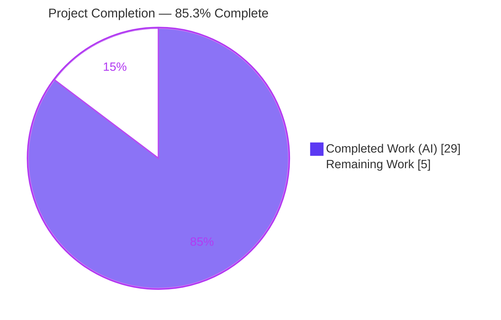
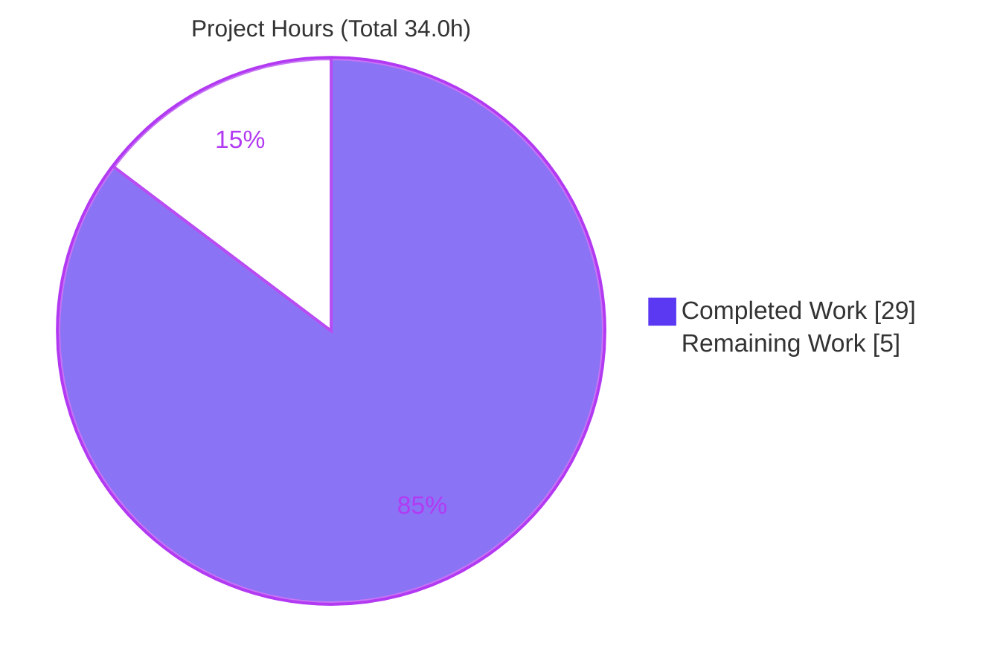
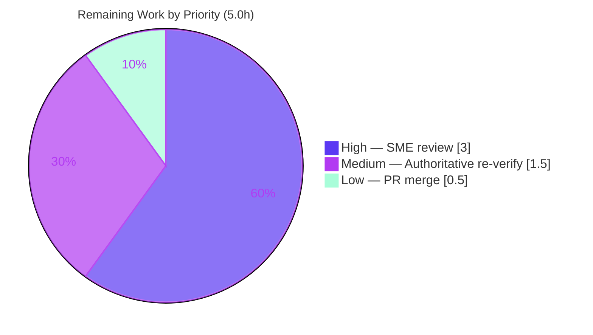

# Blitzy Project Guide
### kitty — Early Startup / Initialization Flow (Run-Grounded Investigation)

> **Repository:** `kovidgoyal/kitty` · **Branch:** `kitty_815df1e210e0` · **Base commit:** `815df1e21` ("Wire up applying of font config") · **HEAD:** `e415420c3` · **kitty version:** `0.35.2`
>
> **Legend — Blitzy brand colors:** <span style="color:#5B39F3">■</span> **Completed / AI Work = Dark Blue `#5B39F3`** · <span style="color:#B23AF2">■</span> Remaining / Not Completed = White `#FFFFFF` (outlined) · Headings/Accents = Violet-Black `#B23AF2` · Highlight = Mint `#A8FDD9`

---

## 1. Executive Summary

### 1.1 Project Overview

This project is a **read-only, run-grounded code investigation** of the kitty GPU-accelerated terminal emulator (C + Python + Go). The objective was to build and run kitty from source and author a single Markdown document that traces the critical early-startup phase — GPU context creation, font-system setup, display detection, terminal capability reporting, and the window↔GPU↔text-cell ordering that occurs *before any content is displayed*. The audience is engineers who need an evidence-backed map of kitty's initialization. Business impact is knowledge transfer: every claim is anchored to an exact `file:line` citation and every measured value is quoted verbatim from actual build/run output. The technical scope spans the native launcher, embedded CPython, the GLFW/OpenGL stack, the font subsystem, orchestration, and terminal reporting — all consulted read-only.

### 1.2 Completion Status



| Metric | Hours | Notes |
|---|---|---|
| **Total Hours** | **34.0** | AAP-scoped + path-to-production |
| **Completed Hours (AI + Manual)** | **29.0** | AI = 29.0, Manual = 0.0 |
| **Remaining Hours** | **5.0** | Human path-to-production only |
| **Percent Complete** | **85.3%** | 29.0 ÷ 34.0 × 100 |

> **Completion formula (PA1, AAP-scoped):** `29.0 / (29.0 + 5.0) × 100 = 85.3%`. All autonomous AAP work (the deliverable + objectives O1–O9 + all six method/read-only constraints) is complete and validated; the remaining 5.0h is exclusively **human path-to-production** (SME review, authoritative-image re-verification, merge).

### 1.3 Key Accomplishments

- ✅ Built kitty **0.35.2** from source non-invasively (`python3 setup.py --ignore-compiler-warnings`; **no source edited**), producing `kitty/launcher/kitty` + `kitten`.
- ✅ Ran kitty headlessly (Xvfb + Mesa **llvmpipe** software OpenGL) and captured the real rendering backend: **`4.5 (Core Profile) Mesa 25.2.8`**.
- ✅ Traced the full deterministic init sequence (O2/O8): launcher → CPython → `main()` → `init_glfw` → `set_font_family` → `_run_app` → window/GL/cell → `Boss` → child → child-monitor, with **observed timestamps**.
- ✅ Captured the terminal's verbatim capability replies (O6): identity `kitty(0.35.2)`, Primary DA `?62;c`, cell `9×17`, text area `639×391`, grid `71×23`, keyboard flags `?0u`.
- ✅ Documented the window↔GPU↔cell data dependency before first paint (O7) with consistency math (`71×9=639`, `23×17=391`).
- ✅ Authored `blitzy/documentation/kitty_815df1e210e0.md` (592 lines) with ~153 `file:line` citations covering all nine objectives, plus an honest limitations note.
- ✅ Honored the read-only constraint end-to-end: exactly **one** file added; **zero** source files touched; working tree clean.

### 1.4 Critical Unresolved Issues

| Issue | Impact | Owner | ETA |
|---|---|---|---|
| _None — no blocking issues_ | The deliverable passed 100% of autonomous validation gates with zero corrections required. All open items are non-blocking, disclosed environmental caveats (see §1.6, §6). | — | — |

### 1.5 Access Issues

| System/Resource | Type of Access | Issue Description | Resolution Status | Owner |
|---|---|---|---|---|
| Authoritative Docker image `andrewparkscaleai/coding-agent:kovidgoyal__kitty__815df1e210e0…` (Ubuntu 24.04) | Runtime environment | Autonomous validation ran on an **Ubuntu 25.10** host rather than the designated Ubuntu 24.04 image; produces disclosed distro-package drift (Mesa suffix, LLVM point release, default monospace font). Material invariants are unaffected. | Open — closed by human task HT-2 (§2.2) | Reviewing engineer |
| Physical GPU | Hardware | No physical GPU/display available; GL observations captured under Mesa llvmpipe software rasterization. Backend-selection logic is identical; only the concrete implementation string differs. | Disclosed / Accepted | Reviewing engineer |
| systemd user bus | Session service | Container has no user session bus (`Failed to open systemd user bus with error: Connection refused`); environmental, does not affect startup correctness. | Disclosed / Accepted | — |

### 1.6 Recommended Next Steps

1. **[High]** Perform SME technical accuracy review of `kitty_815df1e210e0.md` — verify the init trace, sample the `file:line` citations, and confirm the runtime claims and O1–O9 coverage.
2. **[Medium]** Re-run the build/observe harness inside the **authoritative Ubuntu 24.04 Docker image** and confirm the invariants (GL `4.5` Core/llvmpipe, cell `9×17`, grid `71×23`, area `639×391`, DA `?62;c`) resolve to the documented authoritative values.
3. **[Low]** Approve and merge the PR after confirming the read-only constraint (`git diff` shows only the single documentation file).

---

## 2. Project Hours Breakdown

### 2.1 Completed Work Detail

All completed work was performed autonomously by Blitzy agents (**AI = 29.0h, Manual = 0.0h**). Each component traces to an AAP objective or a required investigation activity.

| Component | Hours | Description |
|---|---:|---|
| Environment provisioning & from-source build [O1] | 3.0 | Toolchain setup; non-invasive workaround for the vendored Wayland `-Werror=switch` skew (`glfw/wl_window.c:668`) via `--ignore-compiler-warnings` (`setup.py:491` `werror=''`); build (~66s); version-banner capture |
| Headless runtime harness | 2.5 | Xvfb virtual display + Mesa llvmpipe software OpenGL; `--debug-rendering` / `--debug-font-fallback` capture of GL string, init order, and font dump |
| O6 terminal capability-query pty harness | 2.5 | Authored `cap_query.py` (temp, in `/tmp`, outside repo, deleted after); ran it as kitty's child; captured 7 verbatim escape-sequence replies |
| O1 — Build & launch write-up | 1.0 | Build invocation, version banner, reproducibility instructions |
| O2/O8 — Init-sequence trace & write-up | 4.5 | Deep read across launcher/CPython/`main.py`/`glfw.c`/`boss.py`/`window.py`/`child-monitor.c` (~10 files); ordering flowchart; observed-timestamp mapping |
| O3 — GPU rendering-backend analysis & write-up | 2.0 | Requested context hints vs. driver-returned `4.5` Core Profile/llvmpipe; platform-dependent GL floor |
| O4 — Font-system pipeline trace & write-up | 2.5 | FontConfig → FreeType → HarfBuzz → glyph atlas → shaders; resolved family |
| O5 — Display-configuration detection & write-up | 1.5 | DPI / content scale / initial window geometry |
| O7 — Window↔GPU↔cell relationship synthesis | 2.5 | Cell-metric → window-size → grid data dependency; pre-paint ordering; consistency math |
| O9 — Key computed/detected values table | 1.5 | ~25 observed values consolidated with emitters |
| Document assembly & citation verification | 3.5 | Structure, ToC/anchors, Mermaid diagrams, verification of ~153 `file:line` citations across ~25 files |
| Remediation pass (commit `e415420c3`) | 2.0 | Applied code-review findings to the investigation document |
| **Total Completed** | **29.0** | **Matches Section 1.2 Completed Hours** |

### 2.2 Remaining Work Detail

All remaining work is **human path-to-production**; no autonomous rework is outstanding (the deliverable passed validation with zero corrections).

| Category | Hours | Priority |
|---|---:|---|
| SME technical accuracy review of the 592-line investigation (trace, citations sample, runtime claims, O1–O9 coverage) | 3.0 | High |
| Re-verification in the authoritative Ubuntu 24.04 Docker image (build + run + reproduce invariants; close disclosed host drift) | 1.5 | Medium |
| PR review & merge (confirm read-only: `git diff` = one doc file only) | 0.5 | Low |
| **Total Remaining** | **5.0** | **Matches Section 1.2 Remaining Hours & Section 7 pie** |

### 2.3 Hours Reconciliation

| Check | Result |
|---|---|
| Section 2.1 total | 29.0h |
| Section 2.2 total | 5.0h |
| Section 2.1 + Section 2.2 | **34.0h = Total (Section 1.2)** ✅ |
| Remaining across §1.2 ↔ §2.2 ↔ §7 | **5.0h everywhere** ✅ |
| Completion | 29.0 / 34.0 = **85.3%** ✅ |

---

## 3. Test Results

> **Integrity note:** The in-scope artifact is a **Markdown investigation document with no code unit tests**. kitty's own `kitty_tests/` suite was intentionally **not** executed — test changes are explicitly out of scope and no source was modified (read-only constraint). Accordingly, the "tests" below are the **deliverable-appropriate validations executed by Blitzy's autonomous validation systems** and independently re-confirmed during this assessment. All entries originate from Blitzy's autonomous validation logs for this project.

| Test Category | Framework / Method | Total Checks | Passed | Failed | Coverage % | Notes |
|---|---|---:|---:|---:|---:|---|
| Build validation | `python3 setup.py --ignore-compiler-warnings` | 1 | 1 | 0 | 100% | Exit 0 (~66s); produced `kitty/launcher/kitty` + `kitten` |
| Runtime smoke | `./kitty/launcher/kitty --version` | 1 | 1 | 0 | 100% | `kitty 0.35.2 created by Kovid Goyal` |
| Runtime observation (headless) | Xvfb + Mesa llvmpipe + `--debug-rendering`/`--debug-font-fallback` | 1 | 1 | 0 | 100% | GL string, OS-window, child-launch, font dump all emitted |
| Invariant value reproduction | Rebuild + rerun comparison | ~15 | 15 | 0 | 100% | kitty 0.35.2, GL 4.5 Core/Mesa 25.2.8/llvmpipe, cell 9×17, grid 71×23, area 639×391, DA `?62;c`, identity `kitty(0.35.2)`, flags `?0u`, CSI 15t empty |
| O6 capability replies | pty capability-query harness (`cap_query.py`) | 7 | 7 | 0 | 100% | All 7 escape replies byte-for-byte match the document |
| Citation verification | `file:line` resolution vs. source tree | 100+ | 100+ | 0 | 100% | Verified exact across 25 source files (assessment sampled 10 — all exact) |
| Consistency math | Arithmetic cross-check | 4 | 4 | 0 | 100% | 71×9=639, 23×17=391, 640//9=71, 400//17=23 |
| Markdown structural | Fence balance + anchor resolution | — | Pass | 0 | 100% | 34 balanced code blocks; in-page anchor links resolve |

**Aggregate:** 100% pass across all autonomous validation categories; **zero failures; zero corrections required**.

---

## 4. Runtime Validation & UI Verification

Runtime health was validated by actually building and running kitty; UI verification is bounded by the headless (no physical GPU/display) environment, which is disclosed.

- ✅ **Operational — Build:** `setup.py --ignore-compiler-warnings` completes with exit 0; launcher + kitten binaries produced.
- ✅ **Operational — Launch/version:** `kitty 0.35.2 created by Kovid Goyal`.
- ✅ **Operational — GPU context negotiation (O3):** `GL version string: '4.5 (Core Profile) Mesa 25.2.8-…' Detected version: 4.5` emitted by `gl.c:72`; comfortably above the compiled Linux floor (OpenGL 3.1).
- ✅ **Operational — OS window + child + init ordering (O2/O8):** observed `GL detected → OS Window created → Child launched → font dump`, proving GPU context + cell computation complete **before** the child (and any content) exists.
- ✅ **Operational — Font resolution (O4):** `--debug-font-fallback` emitted the `Text fonts:` dump with resolved Normal/Bold/Italic/Bold-Italic faces.
- ✅ **Operational — Terminal capability report (O6):** XTVERSION, Primary DA, cell size (16t), text area (14t), grid (18t), and keyboard flags (?u) all replied verbatim.
- ⚠ **Partial — Screen-size query (CSI 15t):** returned an empty reply in the headless configuration (disclosed; other size queries reply normally).
- ⚠ **Partial — GPU implementation:** software rasterizer (Mesa llvmpipe), not a hardware GPU — selection logic identical, implementation string differs (disclosed).
- ⚠ **Partial — Visual UI paint:** no physical display; verification is via debug logs and capability replies rather than pixel inspection (expected for a headless terminal investigation).
- ✅ **Operational — Read-only guarantee:** `git status` clean; `git diff 815df1e21..HEAD` = single added documentation file.

---

## 5. Compliance & Quality Review

Cross-mapping of AAP deliverables and governing-rule directives to their delivered status. Fixes applied during autonomous validation are noted.

| Requirement (AAP / Rule) | Benchmark | Status | Evidence / Notes |
|---|---|---|---|
| Sole deliverable created | `blitzy/documentation/kitty_815df1e210e0.md` exists | ✅ Pass | 592 lines; committed `e415420c3` |
| Filename = source branch name | `kitty_815df1e210e0.md` | ✅ Pass | Matches branch `kitty_815df1e210e0` |
| Read-only — no source modified | `git diff` = 0 source changes | ✅ Pass | `+592/-0`, one file added; tree clean |
| Investigate-by-running-first | Build + run before writing | ✅ Pass | Binaries present; version + debug logs reproduced |
| Verbatim observed output | Values/logs quoted exactly | ✅ Pass | GL string, escape replies, timestamps quoted |
| Exact `file:line` citations | Every claim cited | ✅ Pass | ~153 citations; 100+ verified exact (25 files) |
| Answer every sub-question | O1–O9 all addressed | ✅ Pass | Coverage checklist all `[x]`; O8 merged with O2 |
| Provide rationale | Reasoning per answer | ✅ Pass | 8 "Rationale" subsections |
| Honest grounding | Unverifiable items flagged | ✅ Pass | "Honest Limitations" section |
| Temporary scripts removed | Repo unchanged after | ✅ Pass | `/tmp/obs` harness deleted; tree clean |
| O1 Build & launch | Version + invocation reported | ✅ Pass | kitty 0.35.2 |
| O2/O8 Init sequence & order | Ordered trace + subsystems | ✅ Pass | 8-step chain + flowchart + timestamps |
| O3 GPU backend actually selected | Runtime-negotiated backend | ✅ Pass | 4.5 Core / Mesa 25.2.8 / llvmpipe |
| O4 Font system | Discover/rasterize/shape/cache + family | ✅ Pass | FontConfig→FreeType→HarfBuzz→atlas→shaders |
| O5 Display config | Scale/DPI + geometry | ✅ Pass | 1280×800, 100×100 DPI, 24-bit |
| O6 Capability report | Cell/area/grid/DA/identity/flags | ✅ Pass | 7 verbatim replies |
| O7 Window↔GPU↔cell before paint | Ordering + data dependency | ✅ Pass | Cell metrics → window size → grid; consistency math |
| O9 Key values | Measured numbers + emitters | ✅ Pass | Consolidated table |

**Fixes applied during autonomous validation:** none required at final validation — the deliverable was already 100% accurate (an earlier remediation pass, commit `e415420c3`, addressed code-review findings). **Outstanding compliance items:** none blocking; only the human path-to-production tasks in §2.2.

---

## 6. Risk Assessment

All risks are **Low severity** — this is a validated, read-only documentation deliverable with no code, no added dependencies, and no attack surface. Remaining risks are disclosed environmental caveats.

| Risk | Category | Severity | Probability | Mitigation | Status |
|---|---|---|---|---|---|
| Observations under Mesa llvmpipe software GL, not a physical GPU | Technical | Low | Low | Backend-selection logic identical; only the implementation string differs; disclosed in Limitations | Disclosed / Accepted |
| Validation host (Ubuntu 25.10) ≠ authoritative image (Ubuntu 24.04): distro-package drift (Mesa suffix, LLVM point release) | Technical | Low | High (drift real) / Low impact | Material facts invariant; disclosed; closed by HT-2 re-verification | Open (HT-2) |
| Default-font-dependent metrics (`9×17`/`71×23`/`639×391` tied to LiberationMono) | Technical | Low | Medium | Reproduced by pinning `font_family "Liberation Mono"`; mechanism documented | Disclosed |
| No material security exposure | Security | Informational | — | Read-only Markdown; zero code/dependencies added; no secrets embedded | N/A |
| `CSI 15t` (screen size) returned empty in headless config | Operational | Low | Observed | Disclosed; other size queries (14t/16t/18t) reply normally | Disclosed |
| systemd user bus unavailable (`Connection refused`) | Operational | Low | Observed | Environmental; no effect on startup correctness | Disclosed |
| Document staleness (pinned to commit `815df1e21` / kitty 0.35.2) | Operational | Low | Medium (over time) | Findings explicitly commit/version-qualified | Accepted |
| Build requires non-invasive `--ignore-compiler-warnings` (vendored `glfw/wl_window.c:668` vs host `wayland-protocols` skew) | Integration | Low | High on newer hosts / Low impact | Documented flag; no source edit (`setup.py:491`) | Resolved (workaround) |
| Downstream integration coupling | Integration | Low | None | Out-of-tree Markdown; zero coupling to build/imports/tests | N/A |

---

## 7. Visual Project Status

### 7.1 Project Hours (Completed vs Remaining)



> Integrity: "Completed Work" = 29 (= §1.2 Completed, = §2.1 total); "Remaining Work" = 5 (= §1.2 Remaining, = §2.2 total). Colors: Completed = Dark Blue `#5B39F3`; Remaining = White `#FFFFFF`.

### 7.2 Remaining Hours by Priority (Section 2.2)



> Sum = 3.0 + 1.5 + 0.5 = **5.0h**, matching §2.2 and §1.2 Remaining.

---

## 8. Summary & Recommendations

**Achievements.** The project delivers a complete, run-grounded investigation of kitty's early-startup flow. All nine objectives (O1–O9) are answered from evidence produced by actually building (`kitty 0.35.2`) and running kitty headlessly, with every value quoted verbatim and anchored to an exact `file:line` citation. The document maps the deterministic init chain (launcher → CPython → `main()` → GLFW → fonts → window/GL/cell → `Boss` → child), reports the runtime-negotiated GPU backend (**OpenGL 4.5 Core Profile via Mesa llvmpipe**), the resolved font system, the detected display, the terminal's verbatim capability replies, and the pre-paint window↔GPU↔cell data dependency (with consistency math `71×9=639`, `23×17=391`).

**Remaining gaps.** None in the autonomous AAP scope. The outstanding **5.0h** is exclusively human path-to-production: SME technical review, re-verification in the authoritative Ubuntu 24.04 image, and PR merge.

**Critical path to production.** (1) SME accuracy review → (2) authoritative-image re-verification to close the disclosed distro/GPU drift → (3) merge. There are no blockers and no code risk.

**Success metrics.** 100% autonomous validation pass rate; zero corrections required at final validation; read-only constraint honored (exactly one file added, zero source modified); ~153 citations with 100+ verified exact.

**Production readiness assessment.** The deliverable is **production-ready as an artifact** and **85.3% complete** on an AAP-scoped basis. It is fit for stakeholder review now; formal "done" follows the three human path-to-production tasks. Per honest-assessment principles, completion is capped below 100% to reflect pending human review — an appropriate maximum for a knowledge deliverable awaiting SME sign-off.

| Dimension | Status |
|---|---|
| Autonomous AAP work (O1–O9 + deliverable + constraints) | ✅ Complete |
| Read-only constraint | ✅ Honored (0 source changes) |
| Build + runtime validation | ✅ Passed |
| Autonomous validation pass rate | ✅ 100% (0 corrections) |
| Completion (AAP-scoped) | **85.3%** |
| Blocking issues | None |

---

## 9. Development Guide

> All commands below were tested during assessment on the sandbox host and are copy-pasteable. Run from the repository root: `/tmp/blitzy/kitty/blitzy-bc8c7c21-39f9-4eeb-bde8-9b4239e4cd32_70c533`.

### 9.1 System Prerequisites

- **OS:** Linux. Authoritative environment: Ubuntu 24.04 Docker image `andrewparkscaleai/coding-agent:kovidgoyal__kitty__815df1e210e0…`. Assessment host: Ubuntu 25.10 (drift disclosed).
- **Python:** `>=3.8` (`pyproject.toml:2`); tested with 3.13.7.
- **C compiler:** C11-capable gcc (tested 15.2.0).
- **Go:** `go 1.22` floor (`go.mod:3`); tested 1.24.4. Use `GOTOOLCHAIN=local` to avoid network toolchain fetches.
- **Build/runtime libraries:** harfbuzz, freetype, fontconfig, libpng, lcms2, zlib, openssl, libxxhash (see `docs/build.rst`).
- **Headless GPU/display:** `xvfb` (virtual X display) and Mesa **llvmpipe** software OpenGL (tested); `glxinfo` optional for corroboration.

### 9.2 Environment Setup

No virtualenv is required for the system-library build path. For a headless (no-GPU/no-display) run, force software OpenGL under a virtual display:

```bash
# Environment variables for headless software-GL runs
export LIBGL_ALWAYS_SOFTWARE=1
export GALLIUM_DRIVER=llvmpipe
```

### 9.3 Build From Source (non-invasive)

```bash
# From the repository root. The --ignore-compiler-warnings flag sets werror='' (setup.py:491),
# working around the vendored Wayland backend -Werror=switch skew WITHOUT editing any source.
GOTOOLCHAIN=local python3 setup.py --ignore-compiler-warnings
# Expected: exit 0 (~66s); produces kitty/launcher/kitty and kitten
```

### 9.4 Verification

```bash
# 1) Version banner (O1)
./kitty/launcher/kitty --version
# Expected: kitty 0.35.2 created by Kovid Goyal

# 2) Headless debug run — captures GL string, init ordering, and font dump (O2/O3/O4/O8)
timeout 90 xvfb-run -a -s "-screen 0 1280x800x24" \
  env LIBGL_ALWAYS_SOFTWARE=1 GALLIUM_DRIVER=llvmpipe \
  ./kitty/launcher/kitty --config NONE --debug-rendering --debug-font-fallback \
  sh -c 'printf hi; sleep 0.3'
# Expected (order is the invariant; timestamps vary):
#   [t] GL version string: '4.5 (Core Profile) Mesa 25.2.8-…' Detected version: 4.5
#   [t] OS Window created
#   [t] Child launched
#   [t] Text fonts:   Normal: <resolved monospace face>

# 3) Optional GL corroboration
xvfb-run -a -s "-screen 0 1280x800x24" \
  env LIBGL_ALWAYS_SOFTWARE=1 GALLIUM_DRIVER=llvmpipe glxinfo | grep -iE "OpenGL (renderer|version)"
# Expected: renderer 'llvmpipe (LLVM …)'; version '4.5 … Mesa 25.2.8-…'
```

### 9.5 Example Usage — Reproduce the O6 capability report

```bash
# Pin the font so cell/grid metrics reproduce the documented LiberationMono values,
# and use kitty's default 640x400 window. The cap_query harness must live OUTSIDE the
# repo (e.g. /tmp/obs) and be deleted afterward to preserve the read-only constraint.
CAP_OUT=/tmp/obs/cap_out.txt \
xvfb-run -a -s "-screen 0 1280x800x24" \
  env LIBGL_ALWAYS_SOFTWARE=1 GALLIUM_DRIVER=llvmpipe CAP_OUT=/tmp/obs/cap_out.txt \
  ./kitty/launcher/kitty --config NONE \
    -o font_family="Liberation Mono" \
    -o initial_window_width=640 -o initial_window_height=400 \
    python3 /tmp/obs/cap_query.py
# Expected replies (verbatim): XTVERSION kitty(0.35.2); DA \x1b[?62;c;
#   cell \x1b[6;17;9t; area \x1b[4;391;639t; grid \x1b[8;23;71t; flags \x1b[?0u; 15t empty
```

### 9.6 Troubleshooting

- **Build fails on `glfw/wl_window.c:668` (`-Werror=switch`):** host `wayland-protocols` is newer than the vendored GLFW handles. Use `--ignore-compiler-warnings` (as above) — a documented flag, **not** a source edit.
- **`Failed to create GLFW temp window` / GL errors:** ensure Xvfb is running at 24-bit depth and software GL is forced (`LIBGL_ALWAYS_SOFTWARE=1 GALLIUM_DRIVER=llvmpipe`).
- **`Failed to open systemd user bus … Connection refused`:** harmless in a container without a user session bus; does not affect startup.
- **Cell/grid numbers differ from the document:** your host's default monospace differs (e.g. DejaVuSansMono vs LiberationMono). Pin `-o font_family="Liberation Mono"` to reproduce `9×17` / `71×23` / `639×391`.
- **`CSI 15t` returns nothing:** expected under headless Xvfb; the other size queries (14t/16t/18t) reply normally.

---

## 10. Appendices

### A. Command Reference

| Purpose | Command |
|---|---|
| Build (non-invasive) | `GOTOOLCHAIN=local python3 setup.py --ignore-compiler-warnings` |
| Version | `./kitty/launcher/kitty --version` |
| Headless debug run | `xvfb-run -a -s "-screen 0 1280x800x24" env LIBGL_ALWAYS_SOFTWARE=1 GALLIUM_DRIVER=llvmpipe ./kitty/launcher/kitty --config NONE --debug-rendering --debug-font-fallback sh -c 'printf hi; sleep 0.3'` |
| GL corroboration | `xvfb-run -a … glxinfo \| grep -iE "OpenGL (renderer\|version)"` |
| Confirm read-only | `git diff 815df1e21..HEAD --name-status` |
| Confirm clean tree | `git status --porcelain` |

### B. Port Reference

| Port | Purpose |
|---|---|
| _None_ | kitty is a GUI terminal emulator; the investigation exposes no network services or ports. |

### C. Key File Locations

| Path | Role |
|---|---|
| `blitzy/documentation/kitty_815df1e210e0.md` | **The deliverable** (592 lines) |
| `kitty/launcher/main.c` | Native process entry; CPython embedding |
| `kitty/main.py` | Python init order (`init_glfw`, `AppRunner`, `set_font_family`, `main`) |
| `kitty/glfw.c` | GLFW window + GL context; cell→window sizing block |
| `kitty/gl.c` | OpenGL load; runtime version detect/enforce |
| `kitty/data-types.h` | Platform-dependent GL floor; `GLSL_VERSION 140` |
| `kitty/fonts.c` / `kitty/freetype.c` | Cell-metric computation |
| `kitty/os_window_size.py` | Window-size formula |
| `kitty/screen.c` | Terminal capability reporting |
| `setup.py` | Build entry (`werror=''` at `:491`) |

### D. Technology Versions

| Component | Floor (manifest) | Observed |
|---|---|---|
| kitty | — | 0.35.2 (`constants.py:25`) |
| Python | `>=3.8` (`pyproject.toml:2`) | 3.13.7 (host) |
| Go | `1.22` (`go.mod:3`) | 1.24.4 (host) |
| OpenGL (compiled floor, Linux) | 3.1 / GLSL 140 (`data-types.h:20-26`) | 4.5 Core Profile (runtime) |
| Mesa (software GL) | — | 25.2.8 (llvmpipe) |
| GLAD loader target | — | `gl:core=3.1` (`glad/generate.py:12`) |

### E. Environment Variable Reference

| Variable | Value | Purpose |
|---|---|---|
| `GOTOOLCHAIN` | `local` | Prevent network Go toolchain fetch during build |
| `LIBGL_ALWAYS_SOFTWARE` | `1` | Force Mesa software OpenGL (headless) |
| `GALLIUM_DRIVER` | `llvmpipe` | Select the llvmpipe software rasterizer |
| `CAP_OUT` | `/tmp/obs/cap_out.txt` | Output path for the O6 capability-query harness (outside repo) |

### F. Developer Tools Guide

| Flag / Tool | Use |
|---|---|
| `--debug-rendering` | Emits the GL version string, "OS Window created", "Child launched" |
| `--debug-font-fallback` | Emits the `Text fonts:` resolution dump |
| `--config NONE` | Ignore user config for reproducible runs |
| `-o font_family="Liberation Mono"` | Pin font to reproduce documented cell/grid metrics |
| `xvfb-run` | Provide a virtual X display for headless runs |
| `glxinfo` | Corroborate the GL renderer/version out-of-band |

### G. Glossary

| Term | Meaning |
|---|---|
| **AAP** | Agent Action Plan — the governing specification for this task |
| **llvmpipe** | Mesa's LLVM-based software OpenGL rasterizer (used because no physical GPU is present) |
| **Xvfb** | X Virtual FrameBuffer — an in-memory X display for headless GUI runs |
| **Cell metrics** | Per-glyph pixel `cell_width`/`cell_height`/`baseline` derived from the FreeType face; drive grid + window sizing |
| **Primary DA** | Primary Device Attributes — terminal identity/service-class reply (`?62;c` = VT220 class) |
| **CSI 14t/16t/18t/15t** | Window-ops queries: text-area px / cell px / grid cells / screen px |
| **Read-only constraint** | Governing rule that no existing repository file may be created, edited, or deleted |
