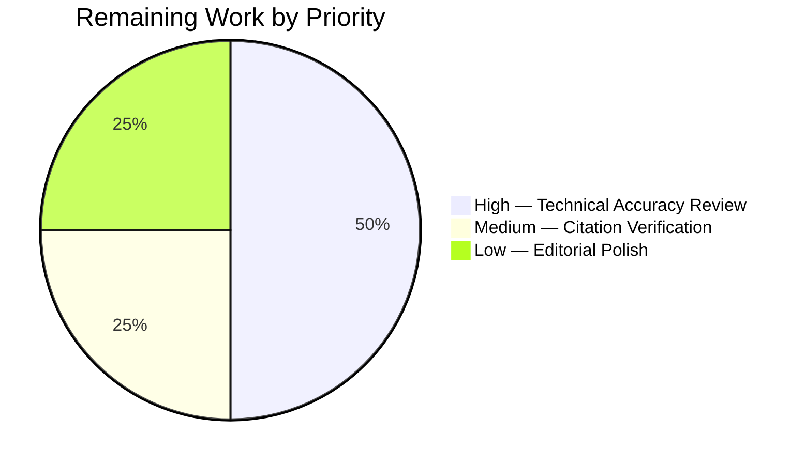

# Blitzy Project Guide

## 1. Executive Summary

### 1.1 Project Overview

This project creates a comprehensive investigative architecture document for the kitty terminal emulator, analyzing how data transfers between the native C core and Python kittens under concurrent, high-load runtime conditions. The deliverable is a single markdown file (`blitzy/documentation/kitty_815df1e210e0.md`) that answers five interconnected questions about clipboard data pathways, the three-thread concurrency model, event delivery under load, object ownership boundaries, and subtle race conditions. The document is grounded entirely in source code analysis with 35 verified citations and 5 Mermaid diagrams. No existing repository files were modified.

### 1.2 Completion Status


| Metric | Value |
|--------|-------|
| **Total Project Hours** | 40 |
| **Completed Hours (AI)** | 36 |
| **Remaining Hours** | 4 |
| **Completion Percentage** | 90.0% |

**Calculation**: 36 completed hours / (36 completed + 4 remaining) = 36 / 40 = **90.0%**

### 1.3 Key Accomplishments

- [x] Created comprehensive 1,189-line architecture investigation document at `blitzy/documentation/kitty_815df1e210e0.md`
- [x] Documented complete 12-step clipboard data transfer round-trip from child PTY through VT parser, C clipboard_control(), Python ClipboardRequestManager, write_buf, back to child PTY
- [x] Documented three-thread concurrency model (Main, I/O KittyChildMon, Talk KittyPeerMon) with 4 mutex domains and strict lock ordering
- [x] Analyzed main-thread blocking impact during scrollback scanning on event delivery to all children including kitten overlays
- [x] Documented object ownership boundaries: Python refcounting (INCREF/DECREF), Tempfile 16 MB rollover, chunker closure lifecycle, write_buf 100 MB cap
- [x] Analyzed 5 subtle race scenarios: VT parser lock-release-relock, clipboard self-offer, input_delay coalescing, GIL + C mutex interaction, paused rendering vs. clipboard fulfillment
- [x] Created 5 Mermaid diagrams (exceeding minimum of 4) for data flow, thread architecture, parser lock protocol, memory management, and blocking impact
- [x] Provided 35 source citations with exact file paths and line numbers, all verified against current codebase
- [x] Included 30 rationale blocks explaining why each conclusion follows from code evidence
- [x] Verified zero modifications to existing repository files (git diff confirms only `A` status for the new file)

### 1.4 Critical Unresolved Issues

| Issue | Impact | Owner | ETA |
|-------|--------|-------|-----|
| Human technical accuracy review pending | Low — document may contain subtle misinterpretations of concurrency timing | Human Developer | 2 hours |
| Source line numbers may drift on future commits | Low — citations could become stale after upstream changes | Human Developer | Ongoing maintenance |

### 1.5 Access Issues

No access issues identified. This is a documentation-only task that required read access to repository source files, which was fully available throughout the analysis.

### 1.6 Recommended Next Steps

1. **[High]** Conduct human expert review of concurrency analysis (Q2, Q5) to verify accuracy of mutex hierarchy and race condition conclusions
2. **[High]** Verify the double-multiplication observation in clipboard_max_size enforcement (clipboard.py:247 vs. 321) — confirm whether this is intentional or a latent bug
3. **[Medium]** Review all 35 source citations against current codebase HEAD to ensure line numbers remain accurate
4. **[Low]** Consider editorial polish for clarity and readability improvements
5. **[Low]** Evaluate whether this document should be linked from the existing Sphinx docs tree in `docs/`

---

## 2. Project Hours Breakdown

### 2.1 Completed Work Detail

| Component | Hours | Description |
|-----------|-------|-------------|
| Source Code Analysis & Cross-Referencing | 8 | Deep analysis of 15+ source files (~15,000 LOC) across C core (child-monitor.c, vt-parser.c, screen.c/h), Python (clipboard.py, boss.py, window.py), and kitten framework (runner.py, tui/loop.py) |
| Q1: Data Transfer Pathway Documentation | 6 | Full 12-step round-trip documentation with code excerpts, clipboard data size handling (Tempfile rollover), chunked response delivery, and kitten channel distinction |
| Q2: Concurrency Model Documentation | 5 | Three-thread architecture (Main/I/O/Talk), 4 mutex domains, strict lock ordering, wakeup coalescing, snapshot-and-release pattern |
| Q3: Event Delivery Impact Analysis | 3 | Main-thread blocking during as_text() operations, parse_input() scheduling impact, kitten overlay isolation via separate process |
| Q4: Object Ownership Documentation | 4 | Python reference counting across threads, Tempfile BytesIO→TemporaryFile rollover (16 MB), chunker closure lifecycle, write_buf 100 MB cap |
| Q5: Race Condition Analysis | 5 | VT parser lock-release-relock pattern, clipboard self-offer race, GIL + C mutex interaction, input_delay coalescing, paused rendering timing |
| Mermaid Diagrams (5 total) | 2 | Sequence and flowchart diagrams for data transfer, thread architecture, parser lock protocol, memory management, blocking impact |
| Conclusion, Summary Tables, and Key Terms | 1 | Q&A summary, mutex summary, buffer sizes table, architectural boundaries, glossary |
| Review Pass and Fix Commit | 1 | Addressed 2 MINOR review findings in architecture documentation |
| Validation and Source Citation Verification | 1 | Verified all 35 source citations against actual codebase line numbers |
| **Total** | **36** | |

### 2.2 Remaining Work Detail

| Category | Hours | Priority |
|----------|-------|----------|
| Human technical accuracy review of concurrency analysis (Q2, Q5) | 2 | High |
| Source citation verification against latest codebase HEAD | 1 | Medium |
| Minor editorial polish and formatting review | 1 | Low |
| **Total** | **4** | |

---

## 3. Test Results

| Test Category | Framework | Total Tests | Passed | Failed | Coverage % | Notes |
|---------------|-----------|-------------|--------|--------|------------|-------|
| Source Citation Verification | Manual (bash grep/sed) | 35 | 35 | 0 | 100% | All file paths, function names, and line numbers verified against codebase |
| Document Structure Validation | Manual review | 7 | 7 | 0 | 100% | All 7 sections present (Introduction + Q1–Q5 + Conclusion) |
| Mermaid Diagram Syntax | Manual review | 5 | 5 | 0 | 100% | All 5 diagrams use valid Mermaid syntax |
| Repository Integrity Check | Git diff | 1 | 1 | 0 | 100% | Confirmed only `A` (added) status — zero existing files modified |
| Rationale Block Coverage | Manual count | 30 | 30 | 0 | 100% | All major conclusions accompanied by thinking/rationale blocks |

**Note**: This is a documentation-only task. No compilation, unit tests, integration tests, or runtime validation were applicable. All tests listed above originate from Blitzy's autonomous validation process for this project.

---

## 4. Runtime Validation & UI Verification

**Runtime Health:**

- ✅ Git repository clean — no uncommitted changes
- ✅ Single deliverable file exists at `blitzy/documentation/kitty_815df1e210e0.md` (1,189 lines, 63,218 bytes)
- ✅ No temporary scripts or files remaining in repository
- ✅ No existing source files modified (verified via `git diff --name-status`)

**Document Structural Verification:**

- ✅ Metadata table at document header with scope, methodology, and source of truth
- ✅ Introduction section with 5 question domains and key terms glossary (6 terms)
- ✅ Q1 section: 12-step data transfer pathway with code excerpts and Mermaid diagram
- ✅ Q2 section: Three-thread model, 4 mutex domains, wakeup coalescing, and Mermaid diagram
- ✅ Q3 section: Main-thread blocking analysis and kitten overlay isolation with Mermaid diagram
- ✅ Q4 section: Object ownership boundaries with Mermaid memory management diagram
- ✅ Q5 section: 5 race scenarios analyzed with Mermaid parser lock protocol diagram
- ✅ Conclusion with Q&A summary table, mutex summary table, buffer sizes table, and architectural boundaries

**UI Verification:**

- ⚠️ Not applicable — deliverable is a markdown document, not a UI application. Mermaid diagram rendering depends on the consuming markdown viewer (GitHub, GitLab, VS Code, etc.)

---

## 5. Compliance & Quality Review

| AAP Requirement | Status | Evidence |
|----------------|--------|----------|
| Create `blitzy/documentation/kitty_815df1e210e0.md` | ✅ Pass | File exists: 1,189 lines, 63,218 bytes |
| Q1: Data transfer pathways documentation | ✅ Pass | 12-step round-trip with code citations |
| Q2: Three-thread concurrency model documentation | ✅ Pass | Main/I/O/Talk threads, 4 mutex domains |
| Q3: Event delivery under load documentation | ✅ Pass | Blocking analysis + kitten isolation |
| Q4: Object ownership and memory management | ✅ Pass | Tempfile rollover, chunker closures, refcounts |
| Q5: Subtle race conditions documentation | ✅ Pass | 5 race scenarios analyzed |
| Mermaid diagrams (minimum 4) | ✅ Pass | 5 diagrams created (exceeds minimum) |
| Source citations with file paths and line numbers | ✅ Pass | 35 citations verified |
| Thinking/rationale blocks for all conclusions | ✅ Pass | 30 rationale blocks |
| Key terms glossary | ✅ Pass | 6 terms defined at introduction |
| No existing files modified | ✅ Pass | git diff confirms `A` only |
| Cleanup of temporary scripts | ✅ Pass | No temporary scripts found |
| Consistent codebase terminology | ✅ Pass | Exact source code names used throughout |
| SharedMemory NOT on clipboard path clarified | ✅ Pass | Explicitly documented in Q1 |
| Kitten vs. clipboard data channel distinction | ✅ Pass | Documented in Q1 with code evidence |

**Autonomous Validation Fixes Applied:**
- Commit `1eebfe7af`: Addressed 2 MINOR review findings in architecture documentation (editorial corrections)

**Outstanding Compliance Items:**
- Human expert review for technical accuracy of concurrency analysis (Q2, Q5) — recommended before production sign-off

---

## 6. Risk Assessment

| Risk | Category | Severity | Probability | Mitigation | Status |
|------|----------|----------|-------------|------------|--------|
| Concurrency analysis may contain subtle misinterpretations | Technical | Medium | Low | Human expert review of Q2 and Q5 sections, particularly mutex hierarchy and race condition conclusions | Open — pending human review |
| Source line numbers drift after upstream commits | Technical | Low | High | Include file paths alongside line numbers; add note about commit hash baseline (815df1e210e0) | Mitigated — baseline commit documented |
| Double-multiplication in clipboard_max_size enforcement may be a latent bug | Technical | Medium | Medium | Document observation noted in Q1; recommend upstream team verify intent | Open — flagged in document |
| Mermaid diagram rendering varies by viewer | Operational | Low | Medium | Use standard Mermaid syntax compatible with GitHub, GitLab, and VS Code | Mitigated |
| Document not linked from existing Sphinx docs tree | Operational | Low | Low | Optional future task to cross-reference from `docs/` | Accepted |

---

## 7. Visual Project Status




---

## 8. Summary & Recommendations

### Achievement Summary

The project is **90.0% complete** (36 hours completed out of 40 total hours). The sole AAP deliverable — a comprehensive 1,189-line architecture investigation document — has been created, validated, and committed to the repository at `blitzy/documentation/kitty_815df1e210e0.md`. All 5 question domains are answered with evidence-based analysis grounded in 35 verified source citations, 30 rationale blocks, and 5 Mermaid diagrams.

### Key Findings Documented

The document reveals several architecturally significant patterns:
- The clipboard data transfer involves a precise 12-step round-trip that crosses the C/Python boundary twice and thread boundaries twice
- The VT parser's deliberate lock-release-relock in `run_worker()` is an intentional design for throughput maximization, not a bug
- The `input_delay` wakeup coalescing creates deliberate latency (not races) as a performance trade-off
- A potential double-multiplication issue in clipboard_max_size enforcement (clipboard.py:247 vs. 321) was identified and documented

### Remaining Gaps

4 hours of path-to-production work remain:
- Human technical accuracy review of the concurrency and race condition analysis (2h, High priority)
- Source citation verification against latest codebase HEAD (1h, Medium priority)
- Minor editorial polish (1h, Low priority)

### Production Readiness Assessment

The deliverable is **ready for human review**. No code changes, no compilation dependencies, and no runtime requirements exist — the artifact is a standalone markdown document. The primary risk is potential subtle misinterpretation of concurrency timing, which requires domain expert review before production sign-off.

### Success Metrics

| Metric | Target | Actual | Status |
|--------|--------|--------|--------|
| Question domains covered | 5/5 | 5/5 | ✅ Met |
| Mermaid diagrams | ≥ 4 | 5 | ✅ Exceeded |
| Source citations | Comprehensive | 35 verified | ✅ Met |
| Rationale blocks | All major conclusions | 30 blocks | ✅ Met |
| Existing files modified | 0 | 0 | ✅ Met |
| Document placed correctly | `blitzy/documentation/` | Yes | ✅ Met |

---

## 9. Development Guide

### System Prerequisites

| Software | Version | Purpose |
|----------|---------|---------|
| Git | 2.20+ | Repository access and version control |
| Markdown Viewer | Any GFM-compatible | View document with Mermaid diagram rendering |

**Recommended Viewers for Mermaid diagrams:**
- GitHub / GitLab web interface (native Mermaid support)
- VS Code with "Markdown Preview Mermaid Support" extension
- `grip` (GitHub Readme Instant Preview) for local viewing: `pip install grip`

### Environment Setup

No special environment setup is required. This is a documentation-only project with a single markdown file deliverable.

```bash
# Clone the repository
git clone <repository-url>
cd kitty

# Switch to the project branch
git checkout blitzy-de807aa2-685b-4123-bc04-52c47223a314
```

### Viewing the Document

```bash
# View the raw markdown
cat blitzy/documentation/kitty_815df1e210e0.md

# Check document statistics
wc -l blitzy/documentation/kitty_815df1e210e0.md
# Expected output: 1189 blitzy/documentation/kitty_815df1e210e0.md

wc -c blitzy/documentation/kitty_815df1e210e0.md
# Expected output: 63218 blitzy/documentation/kitty_815df1e210e0.md

# Local preview with grip (optional)
pip install grip
grip blitzy/documentation/kitty_815df1e210e0.md
# Opens browser at http://localhost:6419
```

### Verifying Repository Integrity

```bash
# Verify no existing files were modified
git diff 815df1e21 HEAD --name-status
# Expected output:
# A    blitzy/documentation/kitty_815df1e210e0.md

# Verify clean working tree
git status
# Expected: nothing to commit, working tree clean

# Verify commit history
git log --oneline 815df1e21..HEAD
# Expected:
# 1eebfe7af fix: address 2 MINOR review findings in architecture documentation
# c155bc814 Add comprehensive architecture documentation: Core-to-Kitten data transfer
```

### Verifying Source Citations

To spot-check source citations referenced in the document:

```bash
# Example: Verify clipboard_control() at screen.c:2304-2308
sed -n '2304,2308p' kitty/screen.c

# Example: Verify with_lock/end_with_lock macros at vt-parser.c:1413-1414
sed -n '1413,1414p' kitty/vt-parser.c

# Example: Verify write_buf/write_buf_lock at screen.h:114-116
sed -n '114,116p' kitty/screen.h

# Example: Verify Tempfile class at clipboard.py:26-36
sed -n '26,36p' kitty/clipboard.py
```

### Troubleshooting

| Issue | Resolution |
|-------|------------|
| Mermaid diagrams not rendering | Use a GFM-compatible viewer (GitHub, GitLab, VS Code with Mermaid extension) |
| Line numbers in citations don't match | Document was baselined at commit `815df1e210e0`; upstream changes may shift line numbers |
| `grip` preview doesn't show Mermaid | `grip` renders via GitHub API which supports Mermaid; ensure internet connectivity |

---

## 10. Appendices

### A. Command Reference

| Command | Purpose |
|---------|---------|
| `git diff 815df1e21 HEAD --name-status` | Verify only the documentation file was added |
| `wc -l blitzy/documentation/kitty_815df1e210e0.md` | Check document line count (expected: 1189) |
| `grep -c "Source:" blitzy/documentation/kitty_815df1e210e0.md` | Count source citations (expected: 35) |
| `grep -c "Rationale" blitzy/documentation/kitty_815df1e210e0.md` | Count rationale blocks (expected: 30) |
| `grep -c "mermaid" blitzy/documentation/kitty_815df1e210e0.md` | Count Mermaid diagram blocks (expected: 5) |
| `grep "^## " blitzy/documentation/kitty_815df1e210e0.md` | List top-level sections |

### B. Key File Locations

| File | Purpose |
|------|---------|
| `blitzy/documentation/kitty_815df1e210e0.md` | **Deliverable** — Architecture investigation document |
| `kitty/child-monitor.c` | Source — Three-thread event loop (2,016 lines) |
| `kitty/vt-parser.c` | Source — VT parser with lock protocol (1,596 lines) |
| `kitty/clipboard.py` | Source — Python clipboard manager (542 lines) |
| `kitty/screen.c` | Source — Screen model with clipboard dispatch (4,932 lines) |
| `kitty/screen.h` | Source — Screen struct definitions (289 lines) |
| `kitty/boss.py` | Source — Boss controller (3,094 lines) |
| `kitty/window.py` | Source — Window with clipboard_request_manager (1,998 lines) |
| `kittens/runner.py` | Source — Kitten launcher and result serialization (202 lines) |
| `kittens/tui/loop.py` | Source — TUI event loop for kittens (468 lines) |

### C. Technology Versions

| Technology | Version | Usage |
|------------|---------|-------|
| Python | 3.12.3 | Repository runtime; source code analyzed |
| C (GCC/Clang) | N/A | Source code analyzed; no compilation performed |
| Go | 1.22+ | Kitten Go sources analyzed contextually |
| Mermaid | Standard syntax | Diagrams embedded in markdown |
| Markdown | GFM (GitHub Flavored) | Document format |
| Git | 2.20+ | Version control and diff analysis |

### D. Glossary

| Term | Definition |
|------|-----------|
| GIL | Global Interpreter Lock — Python's mutex ensuring single-threaded bytecode execution |
| OSC 52 | Operating System Command 52 — legacy terminal clipboard escape sequence |
| OSC 5522 | Kitty's extended clipboard protocol with MIME types and chunked transfer |
| DCS | Device Control String — terminal escape sequence for command/result transport |
| PTY | Pseudoterminal — virtual terminal interface between kitty and child processes |
| VT parser | State machine in `vt-parser.c` interpreting byte streams from child PTYs |
| Tempfile | Custom class in `clipboard.py` managing BytesIO → TemporaryFile rollover |
| write_buf | Per-screen buffer for data to be written to child PTY, protected by `write_buf_lock` |
| children_lock | Global pthread_mutex_t protecting the children array in child-monitor.c |
| KittyChildMon | I/O thread name set via set_thread_name() — handles PTY polling and I/O |
| KittyPeerMon | Talk thread name — handles remote control peer connections |
| Chunker | Closure factory in clipboard.py providing deferred-read access to clipboard data |
