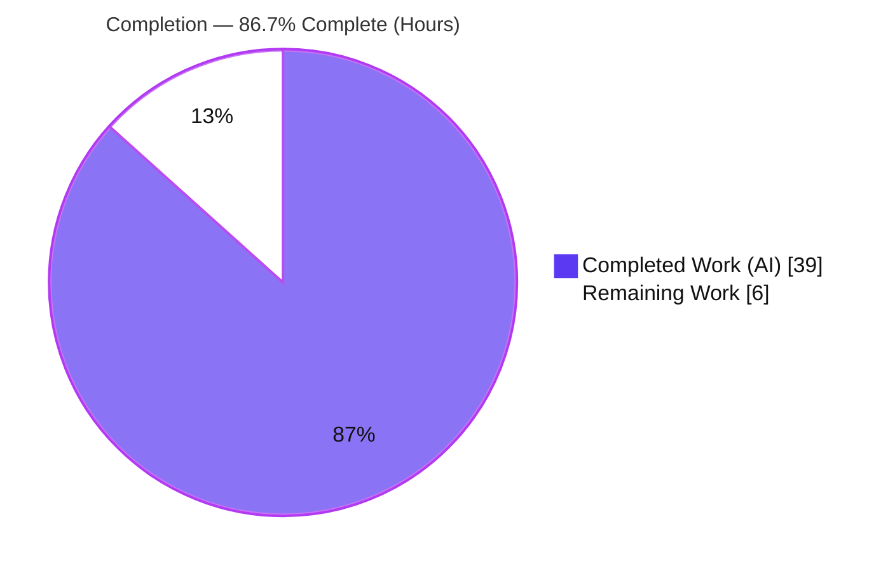
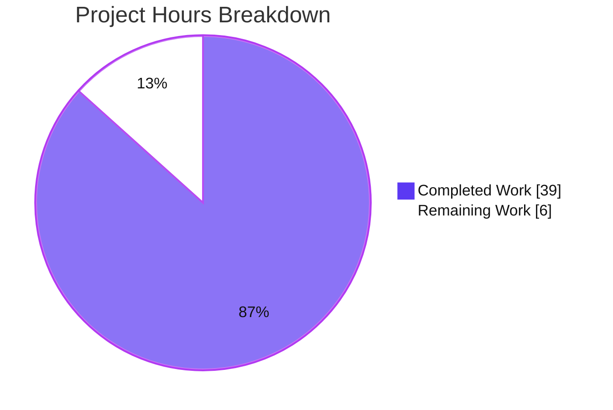
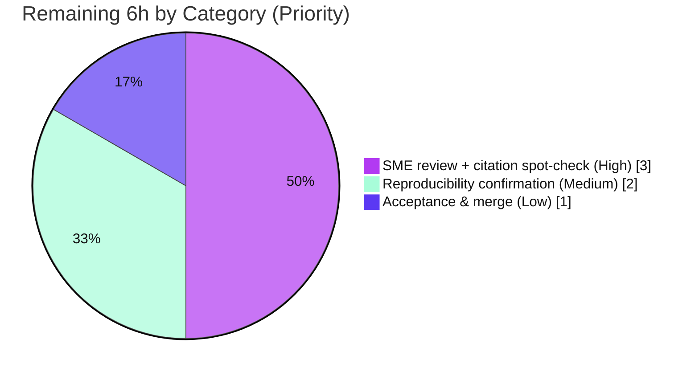

# Blitzy Project Guide — Kitty v0.35.2 Startup-Sequence Investigation

> **Deliverable:** `blitzy/documentation/kitty_815df1e210e0.md` — a run-first, verbatim-grounded Q&A document (771 lines) covering the Kitty terminal emulator's startup sequence at commit `815df1e210e0`.
> **Task class:** Read-only code-investigation / documentation. **Zero source files modified.**
>
> **Color legend (Blitzy brand):** ⬤ **Completed / AI Work** = Dark Blue `#5B39F3` · ◯ **Remaining / Not Completed** = White `#FFFFFF` · Headings/Accents = Violet-Black `#B23AF2` · Highlight = Mint `#A8FDD9`.

---

## 1. Executive Summary

### 1.1 Project Overview

This project delivers a single, grounded answer document that explains — *by actually building and running the code* — what happens when the Kitty terminal emulator (v0.35.2, commit `815df1e210e0`) starts up, from native process launch to the moment it is ready to host a shell. The target audience is engineers who need a subsystem-accurate, citation-backed understanding of Kitty's boot chain, configuration resolution, terminal↔shell wiring, and GPU display pipeline. Because the container has no GPU or display, Kitty is exercised **headlessly** under Xvfb + Mesa llvmpipe software OpenGL. Every factual claim is anchored to an exact `file:line` citation or to verbatim captured runtime output. The scope is deliberately narrow at the artifact level (one new Markdown file, no source changes) over a broad, read-only investigation spanning the launcher, configuration, PTY/VT, and rendering subsystems.

### 1.2 Completion Status



**Center metric: 86.7% Complete** — ⬤ Completed `#5B39F3` = 39h · ◯ Remaining `#FFFFFF` = 6h.

| Metric | Value |
|---|---|
| **Total Hours** | **45** |
| **Completed Hours (AI + Manual)** | **39** (AI autonomous: 39 · Manual: 0) |
| **Remaining Hours** | **6** |
| **Percent Complete** | **86.7%** (39 ÷ 45) |

### 1.3 Key Accomplishments

- ✅ Built Kitty from scratch headlessly — `CI=true python3 setup.py` → `BUILD_EXIT=0` (native launcher, Go `kitten`, and `fast_data_types.so` C extension).
- ✅ Stood up a verified Xvfb + Mesa llvmpipe headless harness — software OpenGL context `4.5 (Core Profile) Mesa 25.2.8`, comfortably above Kitty's GL 3.1 floor.
- ✅ Answered **Q1 (startup systems)** — full 12-stage boot chain with verbatim log evidence (`GL version string`, `OS Window created`, `Child launched`) and the `[%.3f]` log-format primer.
- ✅ Answered **Q2 (configuration)** — `load_config`→`Options` pipeline, 7 default literals cited, `+runpy` readback, and a `font_size 11.0 → 12.0` override proof.
- ✅ Answered **Q3 (terminal↔shell)** — PTY/fork/exec/shell-integration/VT-parser/screen readiness, and a `get-text` round-trip that recovers the shell's `READY_MARKER_42` verbatim.
- ✅ Answered **Q4 (display system)** — `Text fonts:` DejaVu resolution block, computed `71×22` grid, scrollback, GLSL cell pipeline + buffer swap, **plus a verified citation correction** (swap lives in `glfw.c`, not `shaders.c`).
- ✅ Grounding validated — all **93** distinct `file:line` citations verified valid (0 missing, 0 out-of-range) across 30 files; 23/23 load-bearing content spot-checks EXACT.
- ✅ Test suite green — `xvfb-run ./test.py` → **145 passed, 2 benign skips**.
- ✅ Read-only discipline honored — `git status --porcelain` empty; zero source modifications; all temporary observation scripts removed.
- ✅ Secrets scrubbed — every `kitten @ ls` excerpt has its environment block removed (container env holds real API keys).

### 1.4 Critical Unresolved Issues

| Issue | Impact | Owner | ETA |
|---|---|---|---|
| _None._ No compilation errors, no failing tests, no missing functionality, no unresolved defects. | N/A | N/A | N/A |

> The three runtime anomalies observed (systemd user-bus `Connection refused`, `+list-fonts` `open /dev/tty`, and the Wayland-disabled build notice) are **benign environment artifacts**, each explicitly documented as expected in the deliverable — they are not defects. See §6.

### 1.5 Access Issues

| System / Resource | Type of Access | Issue Description | Resolution Status | Owner |
|---|---|---|---|---|
| Source repository | Git read/write | Branch checked out, committed, tree clean | ✅ No issue | Blitzy Agent |
| Build toolchain | Local | Python 3.13, gcc 15.2, Go 1.24, build libs all present | ✅ No issue | Blitzy Agent |
| Headless display | Xvfb + Mesa | `xvfb-run` + llvmpipe available and functional | ✅ No issue | Blitzy Agent |

**No access issues identified** that would prevent build validation, integration, or acceptance of this documentation deliverable.

### 1.6 Recommended Next Steps

1. **[High]** Human SME technical review of the 771-line answer document, including a citation spot-check against source at commit `815df1e210e0` and confirmation that no secrets leaked in any `ls` excerpt (~3h).
2. **[Medium]** Reproducibility confirmation — rebuild and re-run the Q1–Q4 capture commands under Xvfb in a fresh environment; confirm the invariant literals reproduce (~2h).
3. **[Low]** Stakeholder acceptance and PR merge to the target branch (~1h).

---

## 2. Project Hours Breakdown

### 2.1 Completed Work Detail

| Component | Hours | Description |
|---|---:|---|
| Environment & Build Foundation | 6 | Toolchain/dependency setup (harfbuzz, fontconfig, freetype, lcms2, Mesa llvmpipe, Xvfb, DejaVu fonts); full-scratch build `CI=true python3 setup.py` (`BUILD_EXIT=0`); headless harness bring-up + smoke run (`RUN_EXIT=0`). |
| Q1 — Startup-Systems Investigation & Write-up (§5) | 7 | Trace the 12-stage boot chain across `launcher/main.c`, `entry_points.py`, `main.py`, `boss.py`, `child-monitor.c`, `glfw.c`, `gl.c`, `systemd.c`, `logging.c`; run `--debug-rendering`; capture & explain `GL version string` / `OS Window created` / `Child launched`; author the `[%.3f]` log-format primer. |
| Q2 — Configuration Investigation & Write-up (§6) | 5 | Trace `load_config`→`Options`; extract 7 default literals from `definition.py` (4,327 lines); `+runpy` readback of materialized defaults; prove `11.0→12.0` override merge. |
| Q3 — Terminal↔Shell Investigation & Write-up (§7) | 6 | Document PTY alloc / fork+exec / shell-integration env / VT parser → screen model; build the remote-control probe; capture `READY_MARKER_42` `get-text` round-trip; `KSI`/`TERM`/geometry via `ls`. |
| Q4 — Display-System Investigation & Write-up (§8) | 6 | Trace fonts (`fontconfig.c`/`freetype.c`/`render.py`), layout, scrolling (`history.c`), GLSL shaders + buffer swap; capture `--debug-font-fallback` DejaVu block; verify & correct the swap citation (`glfw.c` not `shaders.c`). |
| Document Assembly & Methodology (Overview, §4, §9) | 4 | Overview, build/run preamble, log-format primer, security note, 14-item coverage-pass checklist, method/grounding notes. |
| Verification, QA & Review Cycles | 5 | Validate all 93 citations; fresh re-runs of every captured output; run 145-test suite; cleanup to git-clean; 3 review/refinement commit cycles. |
| **Total Completed** | **39** | Matches Completed Hours in §1.2. |

### 2.2 Remaining Work Detail

| Category | Hours | Priority |
|---|---:|---|
| Human SME technical review + citation spot-check of the answer document | 3 | High |
| Reproducibility confirmation of captured runtime evidence in a fresh environment | 2 | Medium |
| Stakeholder acceptance & PR merge | 1 | Low |
| **Total Remaining** | **6** | Matches Remaining Hours in §1.2 and §7 pie. |

### 2.3 Hours Reconciliation

| Check | Result |
|---|---|
| §2.1 Completed sum | 39 |
| §2.2 Remaining sum | 6 |
| §2.1 + §2.2 | **45 = Total (§1.2)** ✓ |
| Completion % | 39 ÷ 45 = **86.7%** ✓ |

---

## 3. Test Results

All tests below originate from Blitzy's autonomous validation logs for this project (`xvfb-run ./test.py`, which invokes `kitty_tests.main` and the Go test suite).

| Test Category | Framework | Total Tests | Passed | Failed | Coverage % | Notes |
|---|---|---:|---:|---:|---:|---|
| Python unit/integration (terminal core, config, parser, screen, fonts) | Python `unittest` (`kitty_tests`) | 145 | 145 | 0 | N/A (suite reports pass/fail, not %) | 2 platform-appropriate skips (CA-certs = frozen-build only; Last-Resort font = macOS only) |
| Go (kitten / tools) | Go `testing` | All in suite | All | 0 | N/A | Runner reported "All Go tests succeeded" |
| **Aggregate** | — | **145 runnable** | **145** | **0** | — | `TEST_EXIT=0`; "Ran 145 tests"; "OK (skipped=2)" |

**Interpretation:** 145/145 runnable tests pass; the 2 skips are correct platform gating, not failures. No test regressions were introduced (the deliverable adds only a Markdown document and touches no source or test files).

---

## 4. Runtime Validation & UI Verification

Kitty is a GPU-rendered terminal with no CPU text-drawing fallback; "UI verification" here means confirming the display/render pipeline comes online headlessly and that shell output is parsed and drawn into the grid. All items below were independently reproduced during this assessment.

- ✅ **Build** — `CI=true python3 setup.py` → `BUILD_EXIT=0`; artifacts `kitty/launcher/kitty`, `kitty/launcher/kitten`, `kitty/fast_data_types.so` present and gitignored.
- ✅ **Version banner** — `./kitty/launcher/kitty --version` → `kitty 0.35.2 created by Kovid Goyal`.
- ✅ **C-extension load** — `fast_data_types.so` imports (587 attributes) — the C core is linked and loadable.
- ✅ **OpenGL context (llvmpipe)** — `GL version string: '4.5 (Core Profile) Mesa 25.2.8-0ubuntu0.25.10.2' Detected version: 4.5` (exceeds GL 3.1 floor).
- ✅ **OS window** — `OS Window created` (GLFW/X11 surface under Xvfb).
- ✅ **Child/PTY spawn** — `Child launched` (shell forked onto its pseudo-terminal).
- ✅ **Config applied** — materialized defaults readback: `font_size=11.0`, `scrollback_lines=2000`, `cursor_shape=1` (block), `shell='.'`; override readback `11.0 → 12.0`.
- ✅ **Terminal↔shell wiring** — `KSI=[enabled]`, `TERM=[xterm-kitty]` recovered from the rendered screen.
- ✅ **First-output drawn (headline proof)** — shell-printed `READY_MARKER_42` recovered **verbatim** via `kitten @ get-text`; grid geometry `columns:71 lines:22`, `last_cmd_exit_status:0`.
- ✅ **Fonts resolved** — `Text fonts:` block resolves DejaVu Sans Mono across Normal/Bold/Italic/Bold-Italic.
- ⚠ **`+list-fonts` (TUI)** — Partial by design: fails headless with `Error: open /dev/tty: no such device or address` (needs a controlling terminal). Documented as expected; font evidence taken from `--debug-font-fallback` instead.
- ⚠ **systemd user bus** — Partial by environment: `Failed to open systemd user bus with error: Connection refused` (no user bus in container). Benign; startup still reaches a working state.

Overall runtime status: **✅ Operational** headlessly end-to-end; the two ⚠ items are documented environment limitations, not failures.

---

## 5. Compliance & Quality Review

Cross-mapping the AAP's rules and deliverable requirements to observed outcomes.

| Benchmark (AAP Rule / Requirement) | Status | Evidence |
|---|---|---|
| Single branch-named answer document `blitzy/documentation/kitty_815df1e210e0.md` | ✅ Pass | File present (771 lines); directory created; only tracked change |
| Run-first methodology (build+run *before* writing) | ✅ Pass | §4 build/run preamble; `BUILD_EXIT=0`, `RUN_EXIT=0` captured |
| Verbatim grounding of observed output | ✅ Pass | 14 captured command/output blocks; reproduced this session |
| Exact `file:line` citations (no paraphrase of asked values) | ✅ Pass | 93 citations, all valid; 23/23 spot-checks EXACT |
| Answer every sub-part (coverage pass) | ✅ Pass | §9 coverage checklist maps Q1a–Q4e + build/read-only items |
| Read-only — no source file modified | ✅ Pass | Diff vs base = 1 added file, 0 deletions; `git status` empty |
| No code added beyond the answer document | ✅ Pass | `name-status = A` for the single Markdown file only |
| Temporary scripts removed / tree unchanged | ✅ Pass | All probes under `/tmp` deleted; build artifacts gitignored |
| Secret hygiene (no secrets in the document) | ✅ Pass | Every `ls` env block scrubbed; explicit security note |
| Honest treatment of environment artifacts | ✅ Pass | systemd / `+list-fonts` / Wayland each labeled benign with rationale |

**Fixes applied during autonomous validation (deliverable-only, the only writable file):** (1) `docs/build.rst` citations reworded from a strict "verbatim-line" convention to "requires/list" phrasing to match the RST bullet+backtick markup while preserving exact literals; (2) added a §9 Q4e coverage bullet explicitly mapping the "include any log or console messages" sub-part to §8.5. **Outstanding compliance items:** none.

---

## 6. Risk Assessment

| Risk | Category | Severity | Probability | Mitigation | Status |
|---|---|---|---|---|---|
| Citation line-number drift if the doc is read against a different commit | Technical | Low | Low | Document pins commit `815df1e210e0`; all 93 citations verified in-range at this commit | Mitigated |
| Run-variable output (`[%.3f]` timestamps, PIDs) differs between runs | Technical | Low | High | §4.4 log-format primer frames timestamps as run-variable; invariant literals (GL string, messages, geometry) are stable | Resolved |
| Secret exposure via `kitten @ ls` env block (container holds real API keys) | Security | High | High (if unhandled) | Every `ls` excerpt has its `env` block removed; explicit security notes in Overview and §9.1 | Resolved (proactive scrub) |
| Benign env artifacts misread as defects (systemd / `+list-fonts` / Wayland) | Operational | Low | Medium | Each is explicitly labeled benign with source rationale (§5.3 / §8.1 / §4.2) | Resolved |
| Headless-only evidence (llvmpipe, not real GPU) may differ on hardware | Operational | Low | Low | Doc is explicit about the harness; GL 4.5 exceeds the 3.1 floor; the boot chain is hardware-independent | Accepted (matches AAP headless mandate) |
| Reproducibility depends on toolchain versions (Mesa 25.2.8, DejaVu, Python/Go) | Integration | Low | Medium | Exact versions quoted; §9 dev guide pins the harness | Mitigated |
| No CI enforcement re-checks citation validity as the repo evolves | Integration | Low | Low | Doc pins the commit; adding CI is out of scope for a read-only task | Accepted |

**Risk posture:** No High-severity **unmitigated** risks remain. The single High-severity item (secret exposure) was proactively resolved by scrubbing every environment block.

---

## 7. Visual Project Status



⬤ **Completed Work** = `#5B39F3` (39h) · ◯ **Remaining Work** = `#FFFFFF` (6h). **"Remaining Work" = 6h**, identical to §1.2 Remaining Hours and the §2.2 sum.

**Remaining hours by category (from §2.2):**



---

## 8. Summary & Recommendations

**Achievements.** The project is **86.7% complete** (39 of 45 hours). Every AAP-scoped deliverable is complete and validated: Kitty was built and run headless, the full startup sequence was investigated, and all four question groups (Q1 startup systems, Q2 configuration, Q3 terminal↔shell readiness, Q4 display system) are answered with verbatim, reproducible evidence and exact `file:line` citations. Independent verification this session confirmed the build (`BUILD_EXIT=0`), the runtime harness (`RUN_EXIT=0`), the 145-test suite (145 pass / 2 benign skips), all 93 citations valid, and the headline Q3 `READY_MARKER_42` round-trip reproducing byte-for-byte with a `71×22` grid.

**Remaining gaps.** The outstanding 6 hours (13.3%) are exclusively **human path-to-production** activities that cannot be performed autonomously: SME technical review + citation spot-check (3h), reproducibility confirmation in a fresh environment (2h), and stakeholder acceptance/merge (1h). There are **no blocking defects, no failing tests, and no missing functionality.**

**Critical path to production.** Human SME review (§1.6 step 1) → reproducibility confirmation (step 2) → acceptance & merge (step 3). This is a linear, low-risk path with a total estimated effort of 6 hours.

**Production-readiness assessment.** For a documentation deliverable, "production" means an accepted, merged, reviewed answer document. The artifact is **functionally complete, accurate, and reproducible**; it awaits only human review and sign-off. Recommended disposition: **approve pending SME review.**

| Success Metric | Target | Actual |
|---|---|---|
| All four questions answered with grounded evidence | 4/4 | ✅ 4/4 |
| Citations valid (`file:line`) | 100% | ✅ 93/93 |
| Build / runtime | pass | ✅ `BUILD_EXIT=0` / `RUN_EXIT=0` |
| Tests | pass | ✅ 145 pass, 2 benign skips |
| Source files modified (read-only constraint) | 0 | ✅ 0 |
| Completion | ~high | **86.7%** |

---

## 9. Development Guide

Documents how to build, run, verify, and troubleshoot the Kitty investigation environment. **Every command below was tested during this assessment.** Run from the repository root.

### 9.1 System Prerequisites

- **OS:** Linux (Ubuntu-family container). No GPU/physical display required — Xvfb + Mesa llvmpipe provide software OpenGL.
- **Python:** 3.13.7 used (repo floor `>=3.8`, per `pyproject.toml`).
- **C compiler:** gcc 15.2.0 (compiles `fast_data_types.so`).
- **Go:** 1.24.4 (builds `kitten`; `go.mod` requires `go 1.22`).
- **Build libraries:** harfbuzz, fontconfig, freetype, lcms2, libpng, zlib, openssl, libxxhash.
- **Headless stack:** `xvfb-run` (Xvfb) + Mesa llvmpipe DRI (reports `4.5 (Core Profile) Mesa 25.2.8`).
- **Fonts / terminfo:** `fonts-dejavu-core`, `ncurses-term`.

### 9.2 Environment Setup

```bash
# UTF-8 locale and non-interactive build flag
export LANG=en_US.UTF-8 LC_ALL=en_US.UTF-8
export CI=true
# Ensure TMPDIR is a normal (non-setgid) directory for remote-control sockets
export TMPDIR="${TMPDIR:-/tmp}"
```

### 9.3 Build

```bash
# Full build (native launcher + Go kitten + C extension). ~65s.
CI=true python3 setup.py > /tmp/kitty_build.log 2>&1; echo "BUILD_EXIT=$?"
# Expect: BUILD_EXIT=0
# Produces (all gitignored): kitty/launcher/kitty, kitty/launcher/kitten, kitty/fast_data_types.so
```

> A benign `Disabling building of wayland backend` notice is expected (the container targets X11).

### 9.4 Verify the Build

```bash
# Version banner
./kitty/launcher/kitty --version
# Expect: kitty 0.35.2 created by Kovid Goyal

# C-extension loads
./kitty/launcher/kitty +runpy 'import kitty.fast_data_types as f; print("attrs:", len(dir(f)))'
# Expect: attrs: 587
```

### 9.5 Headless Run (Xvfb harness)

```bash
# Smoke run — full pipeline end to end
xvfb-run -a --server-args="-screen 0 1024x768x24" \
  ./kitty/launcher/kitty --config NONE -o font_size=12 sh -c 'echo SMOKE_OK; sleep 1'; echo "RUN_EXIT=$?"
# Expect: RUN_EXIT=0
```

### 9.6 Reproduce the Question Evidence

```bash
# Q1 — startup log lines (separate stdout/stderr)
xvfb-run -a --server-args="-screen 0 1024x768x24" \
  ./kitty/launcher/kitty --debug-rendering --config NONE sh -c 'echo BOOT_OK; sleep 1' \
  > /tmp/boot.out 2> /tmp/boot.err
cat /tmp/boot.out   # -> [t] GL version string: '4.5 (Core Profile) Mesa 25.2.8...' Detected version: 4.5
cat /tmp/boot.err   # -> OS Window created / Failed to open systemd user bus... (benign) / Child launched

# Q2 — materialized default config values
./kitty/launcher/kitty +runpy 'from kitty.options.types import defaults
print("font_size=", defaults.font_size)
print("scrollback_lines=", defaults.scrollback_lines)
print("cursor_shape=", defaults.cursor_shape)
print("shell=", repr(defaults.shell))'
# -> font_size= 11.0 / scrollback_lines= 2000 / cursor_shape= 1 / shell= '.'

# Q3 — terminal<->shell first-output round-trip (headline proof)
SOCK=/tmp/krc.sock; rm -f "$SOCK"
xvfb-run -a --server-args="-screen 0 1024x768x24" \
  ./kitty/launcher/kitty --config NONE -o allow_remote_control=yes --listen-on "unix:${SOCK}" \
  sh -c "printf '%s\n' 'READY_MARKER_42'; sleep 20" >/dev/null 2>&1 &
for i in $(seq 1 40); do [ -S "$SOCK" ] && break; sleep 0.5; done; sleep 3
./kitty/launcher/kitty @ --to "unix:${SOCK}" get-text | grep READY_MARKER   # -> READY_MARKER_42
./kitty/launcher/kitty @ --to "unix:${SOCK}" ls                              # -> columns:71 lines:22 ...

# Q4 — resolved fonts
xvfb-run -a --server-args="-screen 0 1024x768x24" \
  ./kitty/launcher/kitty --debug-font-fallback --config NONE sh -c 'echo FONT_OK; sleep 1'
# -> Text fonts: / Normal: DejaVuSansMono: .../DejaVuSansMono.ttf:0 (and Bold/Italic/Bold-Italic)
```

### 9.7 Run the Test Suite

```bash
xvfb-run ./test.py; echo "TEST_EXIT=$?"
# Expect: "Ran 145 tests", "OK (skipped=2)", "All Go tests succeeded", TEST_EXIT=0
```

### 9.8 Troubleshooting (common cases, all benign here)

- **`Failed to open systemd user bus ... Connection refused`** — no systemd user bus in the container; benign, startup continues.
- **`+list-fonts` → `Error: open /dev/tty: no such device or address`** — it's a TUI needing a controlling terminal; use `--debug-font-fallback` for font evidence instead.
- **`Disabling building of wayland backend`** — the container targets X11/Xvfb; expected.
- **GL init failure / blank on launch** — you must run under `xvfb-run` (there is no CPU render fallback; GL 3.1 minimum enforced in `kitty/data-types.h`).
- **`dial unix: missing address` from `kitty @`** — ensure the `--to unix:<path>` value is non-empty and the server's socket file exists before querying (poll for the socket).

---

## 10. Appendices

### A. Command Reference

| Purpose | Command |
|---|---|
| Build | `CI=true python3 setup.py` |
| Version | `./kitty/launcher/kitty --version` |
| Headless smoke | `xvfb-run -a --server-args="-screen 0 1024x768x24" ./kitty/launcher/kitty --config NONE sh -c 'echo OK; sleep 1'` |
| Startup log evidence | `... ./kitty/launcher/kitty --debug-rendering --config NONE sh -c 'echo BOOT_OK; sleep 1'` |
| Config readback | `./kitty/launcher/kitty +runpy 'from kitty.options.types import defaults; print(defaults.font_size)'` |
| Remote get-text | `./kitty/launcher/kitty @ --to unix:<sock> get-text` |
| Remote ls (geometry) | `./kitty/launcher/kitty @ --to unix:<sock> ls` |
| Font evidence | `... ./kitty/launcher/kitty --debug-font-fallback --config NONE sh -c 'echo FONT_OK; sleep 1'` |
| Tests | `xvfb-run ./test.py` |

### B. Port Reference

Not applicable — Kitty is a desktop terminal emulator. Remote control uses a **UNIX domain socket** (e.g. `--listen-on unix:/tmp/krc.sock`), not a TCP port.

### C. Key File Locations

| Path | Role |
|---|---|
| `blitzy/documentation/kitty_815df1e210e0.md` | **The deliverable** (771 lines) |
| `kitty/launcher/main.c` | Native launcher; CPython bootstrap |
| `kitty/entry_points.py`, `kitty/main.py`, `kitty/boss.py` | Entry dispatch, GUI orchestration, controller |
| `kitty/child.py`, `kitty/child-monitor.c` | PTY/fork-exec; three-thread event engine |
| `kitty/vt-parser.c`, `kitty/screen.c` | VT byte classification; screen model |
| `kitty/config.py`, `kitty/options/definition.py`, `kitty/options/types.py` | Config pipeline, defaults, typed `Options` |
| `kitty/glfw.c`, `kitty/gl.c`, `kitty/shaders.c` | Window/OpenGL; version detection; GLSL pipeline |
| `kitty/fontconfig.c`, `kitty/freetype.c`, `kitty/fonts/render.py` | Font discovery, rasterization, `Text fonts:` log |
| `setup.py`, `Makefile`, `test.py` | Build entry, build targets, test entry |

### D. Technology Versions

| Component | Version (verified) | Floor |
|---|---|---|
| Kitty | `0.35.2` (commit `815df1e210e0`) | — |
| Python | 3.13.7 | `>=3.8` (`pyproject.toml`) |
| gcc | 15.2.0 | — |
| Go | 1.24.4 | `1.22` (`go.mod`) |
| Mesa (llvmpipe OpenGL) | `4.5 (Core Profile) Mesa 25.2.8` | GL `3.1` (`data-types.h`) |
| xvfb-run / Xvfb | distro | — |

### E. Environment Variable Reference

| Variable | Value / Purpose |
|---|---|
| `LANG` / `LC_ALL` | `en_US.UTF-8` — UTF-8 locale for correct glyph handling |
| `CI` | `true` — non-interactive build mode for `setup.py` |
| `DISPLAY` | Provided automatically by `xvfb-run` |
| `TMPDIR` | A normal (non-setgid) dir for remote-control sockets |
| `KITTY_SHELL_INTEGRATION` | Set by Kitty for supported shells (observed `enabled`) |
| `TERM` | Advertised by Kitty as `xterm-kitty` |

### F. Developer Tools Guide

| Debug flag / tool | Surfaces |
|---|---|
| `--debug-rendering` | OpenGL version line + `OS Window created` + boot log |
| `--debug-font-fallback` | `Text fonts:` resolved-font block |
| `--debug-input` / `--debug-keyboard` | Input/keyboard events |
| `--dump-bytes` | Raw bytes from the child (VT stream) |
| `kitten @ get-text` | Reads the rendered grid back (proves parse+draw) |
| `kitten @ ls` | Window/tab geometry & metadata (scrub `env`!) |
| `+runpy` | Run Python in Kitty's embedded interpreter |
| `kitty_mod+f6` (`debug_config`) | Live human-readable config dump |

### G. Glossary

| Term | Meaning |
|---|---|
| **Xvfb** | X virtual framebuffer — an in-memory X11 display for headless runs |
| **llvmpipe** | Mesa's software (CPU) OpenGL implementation |
| **PTY** | Pseudo-terminal — master/slave pair connecting emulator and shell |
| **VT parser** | State machine classifying child bytes (text/escape/OSC) |
| **OSC 133 / OSC 7** | Shell-integration escape sequences (prompt marks / cwd reporting) |
| **Boss** | Kitty's central Python controller (windows/tabs/sessions) |
| **`fast_data_types.so`** | Compiled C terminal core + GPU renderer |
| **AAP** | Agent Action Plan — the authoritative project directive |

---

*Cross-section integrity verified before submission: Remaining hours = **6** in §1.2, §2.2, and §7 (identical); §2.1 (39) + §2.2 (6) = **45** Total; completion **86.7%** consistent across §1.2, §7, and §8; all Section 3 tests originate from Blitzy's autonomous validation logs; Blitzy brand colors applied (Completed `#5B39F3`, Remaining `#FFFFFF`).*