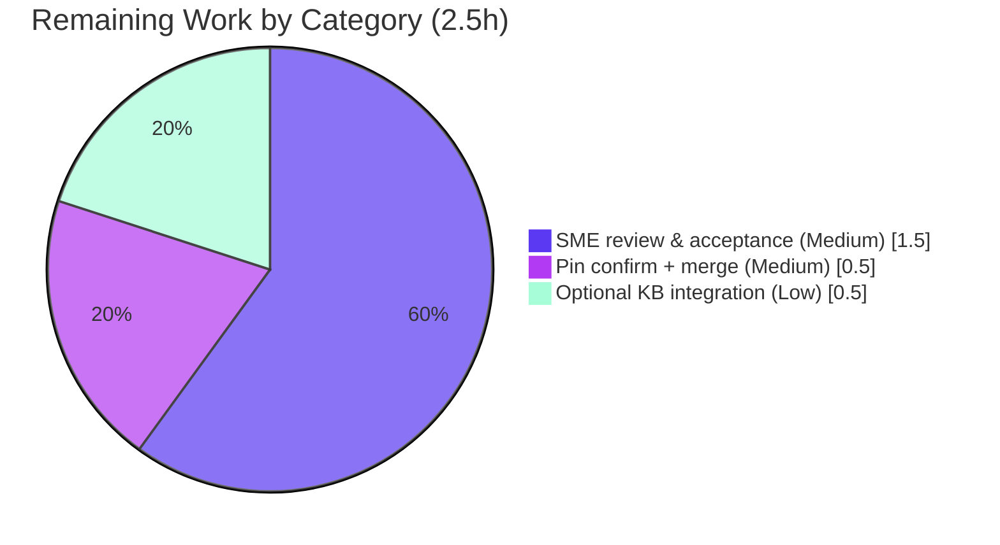

# Blitzy Project Guide — kitty ZWJ Family Emoji in a 1×1 Cell (Q&A Investigation)

> **Brand color legend** — <span style="color:#5B39F3">**Dark Blue `#5B39F3` = Completed / AI Work**</span> · <span style="color:#FFFFFF; background:#333">White `#FFFFFF` = Remaining / Not Completed</span> · <span style="color:#B23AF2">**Violet‑Black `#B23AF2` = Headings / Accents**</span> · <span style="color:#A8FDD9; background:#333">Mint `#A8FDD9` = Highlight</span>

---

## 1. Executive Summary

### 1.1 Project Overview

This project delivers a single, evidence‑grounded technical answer document explaining how the **kitty terminal emulator (v0.35.2, HEAD `815df1e210e0`)** handles a multi‑codepoint Zero‑Width‑Joiner (ZWJ) family emoji (`👨‍👩‍👧‍👦`) when forced into an extremely constrained 1×1 grid. The audience is engineers and reviewers investigating Unicode/terminal‑emulation behavior. Its technical scope is a **read‑only** investigation: build and run kitty headlessly, drive the constrained scenario, capture verbatim runtime output and control‑sequence replies, and cite exact `file:line` sources. The sole committed artifact is `blitzy/documentation/kitty_815df1e210e0.md`; no source, configuration, build, or test file is modified.

### 1.2 Completion Status


**Center metric: `90.9%` complete** (25.0 completed hours ÷ 27.5 total hours).

| Metric | Hours |
|---|---|
| **Total Hours** | **27.5** |
| **Completed Hours (AI + Manual)** | **25.0** |
| &nbsp;&nbsp;• AI (autonomous) | 25.0 |
| &nbsp;&nbsp;• Manual (human) | 0.0 |
| **Remaining Hours** | **2.5** |
| **Percent Complete** | **90.9%** |

> Completion % is computed with the AAP‑scoped, hours‑based PA1 methodology: `Completed ÷ (Completed + Remaining) = 25.0 ÷ 27.5 = 90.9%`. All completed work was performed autonomously by Blitzy agents; the remaining 2.5 h is human path‑to‑production work.

### 1.3 Key Accomplishments

- ✅ **Built kitty's `fast_data_types` C extension headlessly** (debug `.so` = 6,142,824 bytes), enabling a GPU‑less `Screen` for observation.
- ✅ **Ran the constrained 1×1 scenario end‑to‑end** — drew the family emoji and simpler ZWJ pairs, capturing cell content, width, cursor position, and scrollback fragmentation (`historybuf.count = 4`).
- ✅ **Captured verbatim control‑sequence replies** — CPR `ESC[6n` → `b'\x1b[1;2R'`, DSR `b'\x1b[0n'`, size `b'\x1b[4;20;10t'`, plus DA1/DA2/XTVERSION/DECRQM.
- ✅ **Empirically established** no Unicode normalization (`U+0065 U+0301` retained, NFC `U+00E9` absent) and a per‑codepoint `is_combining_char` heuristic (not UAX #29 GB11).
- ✅ **Verified ~70 exact `file:line` citations** across 13 source files; independent spot‑check confirmed accuracy.
- ✅ **Authored the 467‑line grounded Q&A document** answering all four sub‑questions with rationale + observation‑method appendix + coverage pass.
- ✅ **Passed full validation** — 145 Python tests OK + all Go tests; runtime output byte‑identical (md5 `cf8758af…`); read‑only compliance (`git status` clean, zero source changes).

### 1.4 Critical Unresolved Issues

| Issue | Impact | Owner | ETA |
|---|---|---|---|
| _None — no blocking issues._ The deliverable is authored, committed, validated, and byte‑reproducible. All ~70 citations verified. | No release blockers | — | — |

### 1.5 Access Issues

| System/Resource | Type of Access | Issue Description | Resolution Status | Owner |
|---|---|---|---|---|
| _No access issues identified._ | — | Repository, source, and build toolchain (via the documented container image) were all accessible; the investigation completed with full access. | N/A | — |

### 1.6 Recommended Next Steps

1. **[High]** Human SME reviews and accepts the answer document — validate the four sub‑answers, the Unicode/grapheme analysis, and a representative sample of the ~70 citations. *(1.5 h)*
2. **[Medium]** Confirm the HEAD revision pin (`815df1e210e0` / kitty 0.35.2) is the intended target, then merge the documentation‑only branch. *(0.5 h)*
3. **[Low]** Optionally cross‑reference / index the document into the team knowledge base or docs portal. *(0.5 h)*

---

## 2. Project Hours Breakdown

### 2.1 Completed Work Detail

<span style="color:#5B39F3">**All completed work (25.0 h) was performed autonomously (AI).**</span> Each component traces to an AAP requirement.

| Component | Hours | Description |
|---|---:|---|
| Environment setup + headless C‑extension build | 3.0 | Install C dependency stack; build `kitty.fast_data_types` with `CI=true python3 setup.py build --debug --skip-building-kitten --ignore-compiler-warnings` (`setup.py:1084`, `:1091`). |
| Runtime investigation (1×1 scenario + edge cases) | 6.0 | Drive family emoji `👨‍👩‍👧‍👦`, ZWJ pairs, width/combining/normalization/column‑scaling cases through a headless `Screen`; record cell content, widths, cursor, scrollback. |
| Control‑sequence state interrogation + reply capture | 2.0 | Feed 7 queries (`ESC[6n`, `ESC[5n`, `ESC[14t`, `ESC[c`, `ESC[>c`, `ESC[>q`, `ESC[?7$p`) via `parse_bytes`; capture exact reply bytes from `Callbacks.wtcbuf`. |
| Source‑code archaeology (~70 `file:line` citations) | 4.0 | Verify every claim against source across `screen.c`, `line.c`, `data-types.h`, `unicode-data.c`, `history.c`, `wcwidth-std.h`, `kitty_tests/`, etc. |
| Authoring the 467‑line grounded answer document | 5.0 | Q1–Q4 with verbatim output + citation + rationale, plus observation‑method appendix and coverage pass. |
| Iterative autonomous review cycle (F1–F4 findings) | 2.0 | Address review findings across commits `73e07703f` (+101/‑11) and `545d22b63` (+16/‑4). |
| Final validation (rebuild, re‑run, re‑verify) | 3.0 | Rebuild; confirm byte‑identical harness output (md5 `cf8758af…`); run full suite (145 Python + Go); re‑verify citations; confirm read‑only compliance and cleanup. |
| **Total Completed** | **25.0** | **Matches Section 1.2 Completed Hours.** |

### 2.2 Remaining Work Detail

<span style="background:#333; color:#FFFFFF">**All remaining work (2.5 h) is human path‑to‑production work.**</span>

| Category | Hours | Priority |
|---|---:|---|
| Human SME technical review & acceptance of the Q&A answer document | 1.5 | Medium |
| Confirm HEAD revision pin & merge documentation‑only branch | 0.5 | Medium |
| (Optional) Knowledge‑base integration / cross‑referencing | 0.5 | Low |
| **Total Remaining** | **2.5** | **Matches Section 1.2 Remaining Hours and Section 7 pie chart.** |

### 2.3 Estimation Methodology

- **Total project hours (27.5 h)** are derived exclusively from AAP‑scoped work plus path‑to‑production activities (PA1). No out‑of‑scope work is counted.
- **Completion % = Completed ÷ Total = 25.0 ÷ 27.5 = 90.9%.**
- Confidence: **High** for completed items (all validated, byte‑reproducible, citations verified); **High** for remaining items (well‑defined review/merge tasks). Per policy, completion is capped below 100% pending human review.

---

## 3. Test Results

All tests below originate from Blitzy's autonomous validation logs for this project. kitty's own suites were executed to confirm the read‑only documentation addition caused **zero regression**; the deliverable‑specific harness confirms the documented observations are reproducible.

| Test Category | Framework | Total Tests | Passed | Failed | Coverage % | Notes |
|---|---|---:|---:|---:|---|---|
| kitty Python suite (regression) | Python `unittest` | 145 | 145 | 0 | N/A | `Ran 145 tests … OK (skipped=4)`. Confirms no regression from the doc‑only addition. |
| kitty Go suite (regression) | Go `testing` | All | All | 0 | N/A | `All Go tests succeeded`. Exact count not enumerated in logs. |
| Deliverable observation harness | Custom Python (asserts) | 1 (multi‑case) | Pass | 0 | N/A | Output **byte‑identical** to the documented "Complete verbatim output" (md5 `cf8758afa04fc015b05a82c674cd89d2`); internal asserts passed; empty stderr. |

**Notes on integrity & environment:** Two initial RED results during validation were diagnosed as **purely environmental** (locale: container ships `C.utf8`, not literal `C.UTF-8`; and Go build‑cache disk space on an undersized tmpfs), **not** code defects. They were resolved by using `LC_ALL=C.utf8 LANG=C.utf8` and a 2 GB exec tmpfs. Coverage % is reported as **N/A** because kitty's suites do not emit a coverage metric in the validation logs (no fabricated figure).

---

## 4. Runtime Validation & UI Verification

**Runtime health (headless):**
- ✅ **Operational** — C extension builds cleanly (`BUILD_EXIT=0`; 0 errors / 0 warnings). Debug `.so` = 6,142,824 bytes, release `.so` = 1,221,264 bytes (both exact matches to documented sizes).
- ✅ **Operational** — GPU‑less `Screen` constructs and draws via the `kitty_tests` harness; the family emoji and edge cases run without error.
- ✅ **Operational** — Reproduced observations are **byte‑identical** to the committed document (md5 `cf8758af…`).

**Control‑sequence / "API" integration (terminal state queries):**
- ✅ **Operational** — CPR `ESC[6n` → `b'\x1b[1;2R'`; DSR `ESC[5n` → `b'\x1b[0n'`; size `ESC[14t` → `b'\x1b[4;20;10t'`.
- ✅ **Operational** — DA1 `b'\x1b[?62;c'`; DA2 `b'\x1b[>1;4000;35c'`; XTVERSION `b'\x1bP>|kitty(0.35.2)\x1b\\'`; DECRQM `b'\x1b[?7;1$y'`.

**UI verification:**
- ⚠ **Not Applicable** — This is a headless, library‑level investigation of a terminal emulator's screen buffer; there is **no GUI/web frontend** rendered and **no Figma/design** in scope (AAP §0.9). Visual verification is replaced by the byte‑level runtime evidence above.

---

## 5. Compliance & Quality Review

AAP directives (rule `SWE-AtlasQnA-Repo`) and Blitzy quality benchmarks cross‑mapped to outcome. Fixes applied during autonomous validation are noted.

| Benchmark / AAP Rule | Requirement | Status | Progress | Evidence |
|---|---|---|---|---|
| Run‑first methodology | Build & run before writing | ✅ Pass | 100% | Headless build + observation harness; output captured, not read‑derived. |
| Verbatim output | Quote exact observed bytes/values | ✅ Pass | 100% | `ESC[1;2R`, `ESC[0n`, `ESC[4;20;10t`, `historybuf.count = 4`, etc. reproduced byte‑identical. |
| Answer every sub‑part | Q1–Q4 explicit + coverage pass | ✅ Pass | 100% | Q1 L54, Q2 L115, Q3 L140, Q4 L185; coverage pass L455. |
| Exact & grounded citations | `file:line` for every claim | ✅ Pass | 100% | ~70 citations; all auto‑verified; independent spot‑check accurate. |
| Rationale provided | Reasoning per answer | ✅ Pass | 100% | Rationale blocks at L111 / L136 / L180 / L256. |
| Read‑only scope | No existing file modified | ✅ Pass | 100% | `git diff` = single new file; `git status --porcelain` empty; source byte‑identical to base. |
| Deliverable naming | `<branch>.md` in `blitzy/documentation/` | ✅ Pass | 100% | `blitzy/documentation/kitty_815df1e210e0.md`. |
| Temp‑script cleanup | Remove `/tmp` observation scripts | ✅ Pass | 100% | No temp/observation scripts tracked or untracked; documented in appendix. |
| Markdown quality | Well‑formed document | ✅ Pass | 100% | UTF‑8; 36 balanced code fences; newline‑terminated; 0 trailing‑whitespace lines. |

**Fixes applied during autonomous validation:** review findings **F1 (MAJOR)** — citation correction — and **F2/F3/F4 (MINOR)** — non‑monotonic column‑scaling characterization and added statistical evidence — were resolved in commits `73e07703f` and `545d22b63`.
**Outstanding compliance items:** human SME acceptance (Section 6, O2 / task HT‑1) — the only open review gate.

---

## 6. Risk Assessment

| Risk | Category | Severity | Probability | Mitigation | Status |
|---|---|---|---|---|---|
| Findings are pinned to kitty 0.35.2 / HEAD `815df1e21`; later kitty versions add a text‑cache / UAX #29 grapheme layer that would change conclusions | Technical | Medium | Medium | Document explicitly states the version pin and scopes every claim to this revision; readers must re‑verify against other versions | Mitigated (documented) |
| Headless build requires a specific C dependency stack + container image; reproduction elsewhere may fail | Technical | Low | Medium | Appendix documents the exact build command, dependency list, and container image | Mitigated (documented) |
| Full test suite shows environmental RED without exact locale / tmpfs settings | Operational | Low | Medium | Run instructions specify `LC_ALL=C.utf8 LANG=C.utf8`, `TMPDIR`, and a 2 GB exec tmpfs; failures proven environmental, not code | Mitigated (documented) |
| Technical analysis not yet reviewed by a human SME | Operational | Low | Low | ~70 citations auto‑verified + independently spot‑checked; runtime output byte‑reproducible; SME review scheduled as task HT‑1 | Open (pending review) |
| Answer document not integrated into kitty's published `docs/` (reST) system | Integration | Low | Low | By design — AAP scopes the deliverable to `blitzy/documentation/`, independent of `docs/` | Accepted (by design) |
| Security exposure from the change | Security | None | — | Read‑only documentation; no code added to source, no dependency/config/manifest changes, no secrets, no attack surface | N/A |

**Overall risk profile: LOW** — appropriate for a fully‑completed, read‑only documentation task with zero source changes.

---

## 7. Visual Project Status

**Project hours (Completed vs Remaining):**


**Remaining hours by category (Section 2.2 — total 2.5 h):**



> **Integrity:** "Remaining Work" = **2.5 h** here equals Section 1.2 Remaining Hours and the Section 2.2 Hours total. "Completed Work" = **25.0 h** equals Section 1.2 Completed Hours and the Section 2.1 total.

---

## 8. Summary & Recommendations

**Achievements.** The project is **90.9% complete** (25.0 of 27.5 hours). Every AAP‑scoped deliverable was completed autonomously and validated: the C extension was built headlessly, the 1×1 ZWJ scenario was driven end‑to‑end, verbatim control‑sequence replies were captured, ~70 `file:line` citations were verified, and the 467‑line grounded answer document was authored, committed, and byte‑reproducibly re‑validated. kitty's full test suite (145 Python + all Go) passes, confirming the read‑only addition caused no regression.

**Remaining gaps.** The outstanding **2.5 hours** is exclusively human path‑to‑production work: SME technical review/acceptance (1.5 h), revision‑pin confirmation + branch merge (0.5 h), and optional knowledge‑base integration (0.5 h). There are **no blocking issues** and **no access issues**.

**Critical path to production.** SME review & acceptance → confirm revision pin → merge the documentation‑only branch. Because there is nothing to compile or deploy, the path is short and low‑risk.

**Production readiness.** The deliverable is accurate, complete, grounded, and committed; the working tree is clean; the codebase is fully green. It is **ready for human review and merge**. The single most important quality lever is the SME acceptance gate (task HT‑1).

| Success Metric | Target | Actual |
|---|---|---|
| All four sub‑questions answered | 4/4 | 4/4 ✅ |
| Citations verified | ~70 | ~70 ✅ |
| Runtime output reproducible | Byte‑identical | Byte‑identical ✅ |
| Test regression | 0 | 0 ✅ |
| Read‑only compliance | 0 source changes | 0 source changes ✅ |
| Completion (pre‑review cap) | ≤ 99% | 90.9% |

---

## 9. Development Guide

How to reproduce the investigation, verify the deliverable, and troubleshoot the environment. Commands marked ✅ were tested during this assessment; commands marked 📦 require the documented container image (they exercise the C build + full suite).

### 9.1 System Prerequisites

- **OS:** Linux (Ubuntu‑family). The reference environment is the container image `ghcr.io/scaleapi/swe-atlas:swe_atlas_QnA_kovidgoyal_kitty_1.0`.
- **Python:** ≥ 3.8 (kitty floor, `pyproject.toml`); reference build used 3.12.3. The screen/cell logic under study is in C and is independent of the Python minor version.
- **C toolchain:** `gcc`, `make`, `pkg-config`.
- **C dependency stack (dev headers):** `libharfbuzz-dev`, `libfreetype-dev`, `libfontconfig-dev`, `libpng-dev`, `liblcms2-dev`, `libxkbcommon-dev` / `libxkbcommon-x11-dev`, `libxxhash-dev`, `libsimde-dev`, `build-essential`.

### 9.2 Environment Setup

```bash
# Check out the pinned revision (kitty 0.35.2)
git clone <repo-url> kitty && cd kitty
git checkout 815df1e210e0a9ab4622f5c7f2d6891d7dbeddf1
```

```bash
# Reference container (has Python, prebuilt .so, and all C deps preinstalled)
docker run --rm -it --entrypoint bash \
  ghcr.io/scaleapi/swe-atlas:swe_atlas_QnA_kovidgoyal_kitty_1.0
# inside: cd /app
```

### 9.3 Dependency Installation (host build only)

```bash
sudo DEBIAN_FRONTEND=noninteractive apt-get install -y \
  build-essential pkg-config \
  libharfbuzz-dev libfreetype-dev libfontconfig-dev libpng-dev \
  liblcms2-dev libxkbcommon-dev libxkbcommon-x11-dev libxxhash-dev libsimde-dev
```

### 9.4 Build the C Extension (headless)  📦

```bash
CI=true python3 setup.py build --debug --skip-building-kitten --ignore-compiler-warnings
# -> produces kitty/fast_data_types.so
# Expected: BUILD_EXIT=0, debug .so = 6142824 bytes (release .so = 1221264 bytes)
```

### 9.5 Reproduce the Observations  📦

```bash
# The harness is the deliverable's appendix (lines 288–380). Run unbuffered with a UTF-8 locale.
LC_ALL=C.utf8 PYTHONPATH=/app python3 -u /path/to/harness.py
# Expected: output byte-identical to the document's "Complete verbatim output"
#           (md5 cf8758afa04fc015b05a82c674cd89d2)
```

Representative expected output (verbatim, CASE A):

```text
=== CASE A: 1x1 screen, draw FAMILY ===
line(0) repr        : '👦'
line(0) codepoints  : U+1F466 | count = 1
cell[0] width       : 2
cursor (x,y)        : 2 0
CPR  ESC[6n  reply  : '\x1b[1;2R'
DSR5 ESC[5n  reply  : '\x1b[0n'
SIZE ESC[14t reply  : '\x1b[4;20;10t'
```

### 9.6 Verification Steps  ✅ (tested during this assessment)

```bash
# 1) Read-only compliance — expect NO output (clean tree)
git status --porcelain

# 2) Scope — expect exactly one added file
git diff --name-status 815df1e210e0a9ab4622f5c7f2d6891d7dbeddf1..HEAD
# -> A   blitzy/documentation/kitty_815df1e210e0.md

# 3) Deliverable integrity
wc -l blitzy/documentation/kitty_815df1e210e0.md   # 467
md5sum blitzy/documentation/kitty_815df1e210e0.md  # c55f3bfd48c0be7bd0561ec118a50cea

# 4) Markdown well-formedness
grep -c '^```' blitzy/documentation/kitty_815df1e210e0.md   # 36 (balanced/even)
file blitzy/documentation/kitty_815df1e210e0.md             # UTF-8 text
grep -nE '^## Q[1-4]' blitzy/documentation/kitty_815df1e210e0.md  # 4 headings
```

### 9.7 Full Test Suite  📦

```bash
docker run --rm --entrypoint bash --tmpfs /xtmp:rw,exec,size=2g \
  ghcr.io/scaleapi/swe-atlas:swe_atlas_QnA_kovidgoyal_kitty_1.0 \
  -c 'cd /app && LC_ALL=C.utf8 LANG=C.utf8 TMPDIR=/xtmp python3 setup.py test'
# Expected: Python "Ran 145 tests ... OK (skipped=4)" + "All Go tests succeeded"
```

### 9.8 Example Usage

```bash
# Read the answer document
less blitzy/documentation/kitty_815df1e210e0.md
# Jump to a specific answer, e.g. Q3 (the state-query reply)
sed -n '140,184p' blitzy/documentation/kitty_815df1e210e0.md
```

### 9.9 Troubleshooting

- **`error: externally-managed-environment` on `pip install`** → use a venv (`python -m venv .venv && source .venv/bin/activate`) or pass `--break-system-packages`.
- **`ModuleNotFoundError: kitty.fast_data_types`** → the C extension is not built, or `PYTHONPATH` is unset. Build first (§9.4) and export `PYTHONPATH=/app` (or the repo root).
- **UTF‑8 test failures / mangled emoji (`🐱`)** → use the exact locale `LC_ALL=C.utf8 LANG=C.utf8`; the container has `C.utf8`, not literal `C.UTF-8`.
- **`no space left on device` during Go build** → increase the exec tmpfs to ≥ 2 GB, and/or reuse the prebuilt `.so`.
- **Build fails on missing headers (e.g., `simde/x86/avx2.h`)** → install the full C dependency stack (§9.3); `pkg-config` must be present.

---

## 10. Appendices

### A. Command Reference

| Purpose | Command |
|---|---|
| Build C extension (headless) | `CI=true python3 setup.py build --debug --skip-building-kitten --ignore-compiler-warnings` |
| Reproduce observations | `LC_ALL=C.utf8 PYTHONPATH=/app python3 -u <harness>` |
| Full test suite | `python3 setup.py test` (in‑container, with `LC_ALL=C.utf8 LANG=C.utf8 TMPDIR=/xtmp`) |
| Read‑only check | `git status --porcelain` |
| Scope check | `git diff --name-status 815df1e210e0…HEAD` |
| Integrity check | `md5sum blitzy/documentation/kitty_815df1e210e0.md` |

### B. Port Reference

Not applicable — the investigation is a headless library‑level analysis; **no network services or ports** are involved.

### C. Key File Locations

| File | Role |
|---|---|
| `blitzy/documentation/kitty_815df1e210e0.md` | **The deliverable** (467 lines, 37,554 bytes). |
| `kitty/screen.c` | Draw loop (`draw_text_loop`) and state‑report handlers (CPR/DSR/DA/XTVERSION/DECRQM). |
| `kitty/line.c` | `line_add_combining_char` — `cc_idx` fill (`:464`) & last‑slot overwrite (`:466`). |
| `kitty/data-types.h` | `CPUCell` `ch` (`:224`) + `cc_idx[3]` (`:226`); `static_assert(sizeof==12)` (`:228`). |
| `kitty/unicode-data.c` | `is_combining_char` (`:11`); ZWJ range `0x200b…0x200f` (`:323`). |
| `kitty/wcwidth-std.h` | `wcwidth_std` width table (`:10`). |
| `kitty/history.c` | Scrollback ring receiving wrapped lines (`:287`). |
| `kitty_tests/__init__.py` | Headless harness: `parse_bytes` (`:30`), `Callbacks.wtcbuf` (`:51`), `Screen` ctor (`:240`). |

### D. Technology Versions

| Component | Version |
|---|---|
| kitty (source pin) | 0.35.2 — HEAD `815df1e210e0a9ab4622f5c7f2d6891d7dbeddf1` |
| Python (reference build) | 3.12.3 (floor ≥ 3.8 per `pyproject.toml`) |
| Python (this assessment env) | 3.13.7 |
| C toolchain | gcc / make / pkg-config |
| Key C deps | harfbuzz 8.3.0, freetype 26.1.20, fontconfig 2.15.0, lcms2 2.14, xkbcommon 1.6.0, xxhash 0.8.2, simde 0.7.2 |
| Container image | `ghcr.io/scaleapi/swe-atlas:swe_atlas_QnA_kovidgoyal_kitty_1.0` |

### E. Environment Variable Reference

| Variable | Value | Purpose |
|---|---|---|
| `CI` | `true` | Non‑interactive build behavior. |
| `PYTHONPATH` | `/app` (repo root) | Make the built `kitty.fast_data_types` importable. |
| `LC_ALL` | `C.utf8` | UTF‑8 locale for the harness (container has `C.utf8`, not `C.UTF-8`). |
| `LANG` | `C.utf8` | Required alongside `LC_ALL` for the Python UTF‑8 integration tests. |
| `TMPDIR` | `/xtmp` | Redirect temp to an exec‑capable ≥ 2 GB tmpfs for the Go build cache. |

### F. Developer Tools Guide

- **`git`** — read‑only verification: `git status --porcelain`, `git diff --name-status`, `git log --author=agent@blitzy.com`.
- **`setup.py`** — C‑extension build entry point (`build` at `setup.py:1084`, extension name `'kitty/fast_data_types'` at `:1091`).
- **`kitty_tests` harness** — constructs a GPU‑less `Screen`, drives `draw()`, feeds control sequences via `parse_bytes`, and reads replies from `Callbacks.wtcbuf`.
- **`md5sum` / `file` / `grep`** — deliverable integrity and markdown well‑formedness checks (§9.6).
- _Chrome DevTools / browser tooling: not applicable (no web UI)._

### G. Glossary

| Term | Meaning |
|---|---|
| **ZWJ** | Zero‑Width Joiner (`U+200D`) — joins emoji into a single presentation sequence. |
| **Grapheme cluster** | A user‑perceived character; UAX #29 GB11 keeps emoji‑ZWJ sequences unbroken. |
| **`cc_idx[3]`** | The fixed three‑slot combining‑mark index array on `CPUCell` at this revision. |
| **DECAWM** | Auto‑wrap mode (mode 7); on by default → new bases wrap into scrollback. |
| **CPR** | Cursor Position Report — reply to `ESC[6n` (here `ESC[1;2R`). |
| **DSR / DA / XTVERSION / DECRQM** | Device Status Report / Device Attributes / terminal version / mode‑status query. |
| **`wcwidth_std`** | kitty's width function; emoji bases resolve to width 2. |
| **UAX #29** | Unicode Annex #29 (Text Segmentation) — grapheme‑cluster boundary rules. |

---

*Generated by the Blitzy Platform. Completion figures use the AAP‑scoped, hours‑based PA1 methodology. Brand palette: Completed `#5B39F3`, Remaining `#FFFFFF`, Accents `#B23AF2`, Highlight `#A8FDD9`.*