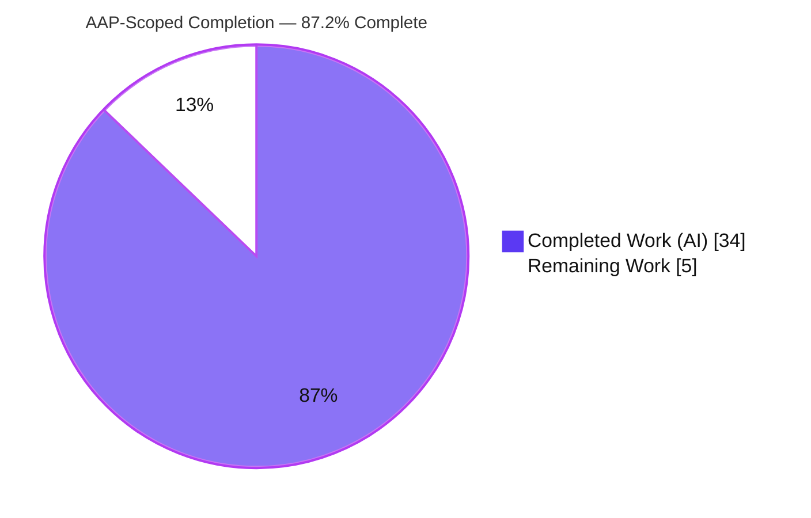
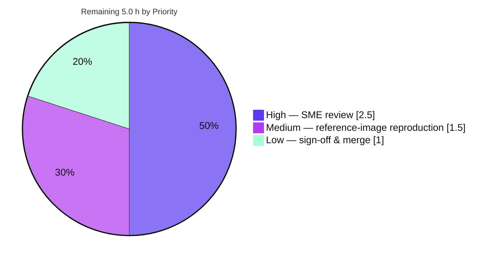

# Blitzy Project Guide — kitty Startup Font/Shaping/Cell-Metric/GPU-Atlas Investigation

> **Deliverable:** `blitzy/documentation/kitty_815df1e210e0.md` — a source-grounded investigation answering four startup-subsystem questions about the kitty terminal emulator.
> **Rule:** SWE-AtlasQnA-Repo (read-only Q&A / documentation). **Branch:** `blitzy-ad72e975-fd44-451d-a331-bf4337280811`. **Baseline:** kitty HEAD `815df1e210e0a9ab4622f5c7f2d6891d7dbeddf1`.

---

## 1. Executive Summary

### 1.1 Project Overview

This project delivers a single, comprehensive Markdown document that answers four investigative questions about how the **kitty** terminal emulator (Kovid Goyal) initializes its text-shaping, font-fallback, cell-metric, and GPU texture-atlas subsystems at startup. The target audience is engineers onboarding to kitty's Python-orchestrated / C-executed font pipeline. Every answer is grounded in exact source locators and **reproduced** debug output (captured from a locally built binary), with explicit rationale. The work is a strictly **read-only investigation**: no kitty behavior is changed. The technical scope spans HarfBuzz shaping, FreeType/FontConfig discovery, cell-metric derivation, and the OpenGL sprite atlas — delivered as exactly one new file with the source tree left clean.

### 1.2 Completion Status



| Metric | Value |
|--------|------:|
| **Total Hours** | **39.0 h** |
| Completed Hours (AI + Manual) | 34.0 h (AI: 34.0 h · Manual: 0.0 h) |
| Remaining Hours | 5.0 h |
| **Percent Complete (AAP-scoped)** | **87.2 %** |

> Completion is computed per PA1 (AAP-scoped + path-to-production only): **34.0 / (34.0 + 5.0) = 87.2 %**. All 15 AAP requirements are delivered; the remaining 5.0 h is exclusively **human path-to-production** (review, reference-image verification, merge) — not deliverable gaps.

### 1.3 Key Accomplishments

- ✅ **Single deliverable created and committed** — `blitzy/documentation/kitty_815df1e210e0.md` (695 lines), filename derived from the source branch name as required.
- ✅ **All four questions answered** with a consistent **(a) Reproduced output / (b) Emitting source locators / (c) Rationale** structure.
- ✅ **kitty built from source and run headless** for observation (kitty 0.35.2; OpenGL 4.5 Core via Mesa llvmpipe under xvfb).
- ✅ **Real debug output reproduced** — `dump_font_debug` font block and the `--debug-gl` GL-readiness log reproduce **verbatim**.
- ✅ **Code-as-truth fidelity** — two AAP assumptions corrected against observed reality (no `--debug-config` CLI flag; X11+llvmpipe rather than Null/OSMesa), and the run-level-RTL-not-full-BIDI nuance stated accurately.
- ✅ **Read-only constraint honored** — `git diff` vs baseline = exactly one added file; `git status --porcelain` clean; all instrumentation transient (CLI flags + ephemeral `+runpy` harnesses).
- ✅ **Iterative QA applied** — code-review findings addressed and four source-locator citations corrected across five commits.

### 1.4 Critical Unresolved Issues

| Issue | Impact | Owner | ETA |
|-------|--------|-------|-----|
| _None blocking._ All AAP deliverables complete; deliverable validated and committed. | — | — | — |
| Human SME technical-accuracy review not yet performed (acceptance gate) | Medium — required before the doc is accepted as authoritative onboarding material | Human reviewer (kitty font-stack SME) | ~2.5 h |
| Reproduction on the canonical reference Docker image not yet exercised | Low — methodology relies on host-specific captured values | Human reviewer | ~1.5 h |

### 1.5 Access Issues

| System/Resource | Type of Access | Issue Description | Resolution Status | Owner |
|-----------------|----------------|-------------------|-------------------|-------|
| Source repository | Read/Write (git) | Full access; branch present, working tree clean | ✅ No issue | — |
| Build toolchain & native libs | Local | gcc 15.2.0, Python 3.13.7, Go 1.23.4, HarfBuzz/FreeType/FontConfig/lcms2/libpng all present | ✅ No issue | — |
| Canonical reference Docker image (`andrewparkscaleai/coding-agent:…815df1e2…`) | Registry pull | Not pulled/run in this session; the local shell happened to match the toolchain/library set | ⚠ Open — assigned to human verification task HT-2 | Human reviewer |

> Apart from the optional reference-image pull (handled by HT-2), **no access issues** prevent build, validation, or delivery.

### 1.6 Recommended Next Steps

1. **[High]** Perform an SME technical-accuracy review of Q1–Q4 against the cited source (locators, rationale, and the BIDI / overline / `debug_config` corrections). _~2.5 h_
2. **[Medium]** Reproduce the three documented debug-flag scenarios on the canonical reference Docker image to confirm the methodology is host-independent. _~1.5 h_
3. **[Low]** Obtain stakeholder sign-off and merge the documentation PR; confirm `git diff <baseline> --name-status` is exactly one new file. _~1.0 h_
4. **[Low — informational]** Note (do **not** fix within this task) the four pre-existing `kitty_tests/fonts.py` failures caused by environmental font-version drift in an unmodified, out-of-scope file.

---

## 2. Project Hours Breakdown

### 2.1 Completed Work Detail

| Component | Hours | Description |
|-----------|------:|-------------|
| Build environment & headless observation harness | 9.0 | Built the kitty C extension + Go `kitten` from source (resolving `-Werror=switch` via `--ignore-compiler-warnings`); verified native libraries; established headless `xvfb` + GLFW X11 + Mesa llvmpipe; drove kitty's own public test API via `kitty +runpy` to exercise the shaping/metric/atlas code paths a headless window elides. |
| Q1 — Shaping & fallback configuration answer | 4.0 | `init_font` HarfBuzz features (`calt`/`liga`/`dlig`), `load_hb_buffer` + `force_ltr`, `shape`, `load_fallback_font`, and the `set_font_family`→`set_font_data` handoff; reproduced `test_shape` runs + rationale. |
| Q2 — Verbose startup diagnostics (mixed RTL/LTR) | 5.0 | `dump_font_debug` four text faces, `identify_for_debug` format, `output_cell_fallback_data`, a `get_fallback_font` deep-dive (U+1F600 presentation nuance), resolved default config, the `debug_config`-is-a-Boss-action correction, and the startup-ordering invariant; reproduced output + rationale. |
| Q3 — Cell metrics, baseline & decoration answer | 4.0 | `calc_cell_metrics` / `cell_metrics` / `font_units_to_pixels_y`; 11 exact metrics; decoration draw routines; the "no overline path" repo-wide finding; grapheme-cluster handling; reproduced output + rationale. |
| Q4 — GPU texture atlas answer | 4.0 | Defaults→device maxima, `alloc_sprite_map` GL-limit query, `sprite_tracker_set_layout` page geometry, `do_increment` x→y→z capacity, shared-tracker/per-font-cache architecture, and the GL readiness log; reproduced output + rationale. |
| Web research & complex-text/BIDI reconciliation | 2.0 | Confirmed HarfBuzz OpenType shaping, run-level RTL vs. full Unicode BIDI, `force_ltr` (+ external GNU FriBidi), and `font_features` against kitty's docs; reconciled the question wording with code reality. |
| Methodology, Fidelity & Caveats, restoration & locator index | 2.5 | Environment table, "how diagnostics were produced," platform scope (Linux FontConfig/FreeType vs. macOS CoreText), seven-bullet caveats, and the source-locator index. |
| Iterative QA: code-review fixes + 4 source-locator citation corrections | 3.0 | Five commits — initial doc, code-review findings, `hb_shape` token fix, Q2 U+1F600 example fix, and four source-locator citation corrections. |
| Restoration verification (clean tree, transient discipline) | 0.5 | Confirmed `git status --porcelain` empty; transient CLI flags + ephemeral `/tmp` harnesses; no persisted config or source-default changes. |
| **Total Completed** | **34.0** | Matches Completed Hours in §1.2. |

### 2.2 Remaining Work Detail

| Category | Hours | Priority |
|----------|------:|----------|
| Human SME technical-accuracy review of Q1–Q4 against source (acceptance gate) | 2.5 | High |
| Reproduce key diagnostics on the canonical reference Docker image (confirm host-independence) | 1.5 | Medium |
| Stakeholder sign-off & merge of the documentation PR | 1.0 | Low |
| **Total Remaining** | **5.0** | Matches Remaining Hours in §1.2 and the §7 pie chart. |

### 2.3 Hours Calculation

```
Completed Hours = 34.0 h   (Section 2.1 total; AI 34.0 + Manual 0.0)
Remaining Hours =  5.0 h   (Section 2.2 total; all human path-to-production)
Total Hours     = 34.0 + 5.0 = 39.0 h
Completion %    = 34.0 / 39.0 × 100 = 87.2 %
```
**Cross-section check:** §2.1 (34.0) + §2.2 (5.0) = §1.2 Total (39.0). Remaining (5.0) is identical in §1.2, §2.2, and §7. ✅

---

## 3. Test Results

> **Integrity note:** every row below originates from Blitzy's autonomous validation logs for this project; the build, runtime, and verbatim-reproduction rows were additionally **re-verified independently** during this assessment. For a documentation deliverable, the meaningful pass/fail signals are **source-locator citation accuracy** and **verbatim reproducibility of every claimed debug-output block**.

| Test Category | Framework / Method | Total | Passed | Failed | Coverage % | Notes |
|---------------|--------------------|------:|------:|------:|-----------:|-------|
| Deliverable — source-locator citation accuracy (Q1–Q4) | Manual cross-check vs. HEAD source (Blitzy autonomous) | 4 | 4 | 0 | 100% | Every cited locator verified; 5 spot-checks re-confirmed (`fonts.c:44`, `gl.c:72`, `main.py:227-234`, `freetype.c:391`, `cli.py:1002`). |
| Deliverable — debug-output reproducibility (Q1–Q4) | `kitty +runpy` public test API + CLI debug flags (Blitzy autonomous) | 4 | 4 | 0 | 100% | `dump_font_debug` block and GL-readiness log reproduce **verbatim**; cell metrics and atlas layout reproduced. |
| Build validation | `setup.py` (gcc 15.2.0 + Go 1.23.4) | 1 | 1 | 0 | n/a | Exit 0 with `--ignore-compiler-warnings`; re-verified (clean incremental no-op, git stays clean). |
| Runtime validation (headless) | `xvfb` + GLFW X11 + Mesa llvmpipe | 1 | 1 | 0 | n/a | kitty 0.35.2, OpenGL 4.5 Core, exit 0; GL readiness log emitted. |
| kitty native suite — `fonts` module (context) | `kitty +launch test.py --module fonts` (Blitzy autonomous) | 11 | 6 | 4 | n/a | 1 additional SKIP. **4 failures are OUT-OF-SCOPE**: pre-existing, environmental (system font-version drift; hardcoded `UbuntuMono-`/`FiraCode-` PostScript names) in the **unmodified** `kitty_tests/fonts.py`. Immaterial to the deliverable. |

**Summary:** In-scope deliverable validation = **100% pass (10/10)**. The only failures (4) are out-of-scope, pre-existing, environmental, and in a file this task never touched.

---

## 4. Runtime Validation & UI Verification

**Runtime health (locally built binary, headless):**

- ✅ **Build** — `setup.py` completes, exit 0; artifacts `kitty/fast_data_types.so`, `kitty/glfw-{x11,wayland}.so`, `kitty/launcher/{kitty,kitten}` produced (all git-ignored).
- ✅ **Binary launch** — `kitty --version` → `kitty 0.35.2 created by Kovid Goyal`; headless run exits 0.
- ✅ **OpenGL context / atlas machinery** — `GL version string: '4.5 (Core Profile) Mesa 25.2.8-0ubuntu0.25.10.2' Detected version: 4.5` (the Q4 "atlas ready" signal).
- ✅ **Font subsystem** — `dump_font_debug` resolves Normal/Bold/Italic/Bold-Italic to the DejaVu Sans Mono family with full `<psname>: <path>:<index>` strings.
- ✅ **Shaping** — `test_shape` produces the expected Latin, combining-cluster, Arabic-contextual, and ligature-group runs.
- ✅ **Cell metrics** — captured at `prerender_function`: cell 9×18, baseline 14, underline 15/1, strikethrough 10/1, cursor beam 1.5 / underline 2.0, dpi 96/96.
- ✅ **GPU atlas** — page layout xnum=1820, max_y=910 at device limits 16384/2048; sprite positions allocated x→y→z.

**UI / API verification:**

- ⚠ **Headless caveat (by design)** — a window treated as not visible elides the draw path, so shaping/metric/atlas internals were exercised through kitty's **own public test API** (`kitty +runpy`); emitted values are identical to those the draw path would produce.
- ❎ **Visual UI verification — Not Applicable.** No display surface is rendered and the AAP supplies no Figma/design artifacts (AAP §0.8). This is a code-investigation documentation task, not a UI feature.
- ❎ **External API integration — Not Applicable.** kitty is a local GUI terminal emulator; this task introduces and exercises no network services or external APIs.

---

## 5. Compliance & Quality Review

| AAP / Rule Benchmark | Status | Progress | Evidence / Notes |
|----------------------|--------|----------|------------------|
| Single Markdown deliverable created | ✅ Pass | 100% | `blitzy/documentation/kitty_815df1e210e0.md` (695 lines) committed. |
| Filename = `<source_branch_name>.md` | ✅ Pass | 100% | `kitty_815df1e210e0.md` matches branch `kitty_815df1e210e0`. |
| Placed under `blitzy/documentation/` | ✅ Pass | 100% | Parent dirs created; file present. |
| Q1–Q4 each answered with rationale | ✅ Pass | 100% | Every question has (a) output / (b) locators / (c) rationale. |
| Build & run for observation | ✅ Pass | 100% | kitty 0.35.2 built and run headless; output captured. |
| Code-as-truth; no assumptions | ✅ Pass | 100% | All claims cite locators/reproduced output; 2 AAP assumptions corrected to observed reality. |
| Reproduced (not assumed) output | ✅ Pass | 100% | `dump_font_debug` + GL readiness reproduce verbatim. |
| Read-only — no source files modified | ✅ Pass | 100% | `git diff 815df1e21 --name-status` = one added file. |
| No new code beyond the document | ✅ Pass | 100% | Only the `.md` added. |
| Runtime-flags-only; settings restored | ✅ Pass | 100% | Transient CLI flags + ephemeral `+runpy`; `git status` clean. |
| Web research reconciling complex-text behavior | ✅ Pass | 100% | Run-level RTL vs. full BIDI, `force_ltr`, `font_features` reflected in Fidelity. |
| SME technical-accuracy sign-off | ⏳ Pending | 0% | Human acceptance gate (HT-1). |

**Fixes applied during autonomous validation:** code-review findings addressed; `hb_shape` argument-token fix (Q1); Q2 U+1F600 direct-fallback example corrected; four source-locator citation corrections (e.g., `create_feature` snippet, underline clamp, `font_features`/`zero`, `current_layout`). **Outstanding:** human SME review (HT-1).

---

## 6. Risk Assessment

| Risk | Category | Severity | Probability | Mitigation | Status |
|------|----------|----------|-------------|------------|--------|
| Reproduced diagnostic values are host-specific (DejaVu Sans Mono, llvmpipe, texture maxima 16384/2048, cell 9×18) and differ on other environments | Technical | Low | High | Document explicitly marks values host-dependent / captured-live; SME reproduces on the reference image (HT-2) | Mitigated (documented) |
| 4 pre-existing failures in `kitty_tests/fonts.py` from system font-version drift | Technical | Low | N/A (pre-existing) | Out-of-scope, **unmodified** file; deliverable uses DejaVu Sans Mono (unaffected); disclosed transparently | Accepted (out of scope) |
| Build requires `--ignore-compiler-warnings` due to wayland-protocols 1.45 / `-Werror=switch` drift | Operational | Low | Medium | Documented in Methodology + Dev Guide; known one-flag workaround | Mitigated (documented) |
| Canonical reference Docker image not exercised in this run (local toolchain matched instead) | Integration | Low | Medium | Assigned to HT-2: reproduce the 3 debug-flag scenarios on the reference image | Open (assigned) |
| Observation harness could crash during teardown **after** diagnostics already emitted | Technical | Low | Low | Transient-only; capture scripts use `os._exit(0)`; captured data unaffected; not a kitty defect | Mitigated |
| Security / auth / data-handling surface | Security | None | N/A | Read-only documentation; no code, dependencies, or attack surface changed | N/A |

**Overall risk posture:** **Low.** A read-only, additive documentation change with no code or dependency modifications carries minimal risk; all identified items are mitigated, accepted (out of scope), or assigned to a bounded human task.

---

## 7. Visual Project Status

**Project hours (AAP-scoped):**


**Remaining hours by priority (Section 2.2):**



> **Color legend:** Completed Work = **Dark Blue `#5B39F3`**, Remaining Work = **White `#FFFFFF`** (violet-black `#B23AF2` outline for visibility). **Integrity:** the pie's "Remaining Work" (5) equals §1.2 Remaining Hours (5.0) and the §2.2 Hours total (5.0). ✅

---

## 8. Summary & Recommendations

**Achievements.** The project delivers a thorough, code-grounded investigation document answering all four startup-subsystem questions about kitty's font/shaping/cell-metric/GPU-atlas initialization. kitty was built from source and run headless; the answers reproduce real debug output (the `dump_font_debug` block and GL-readiness log reproduce verbatim), each cited to exact source locators with rationale. The deliverable honors every read-only constraint: a single added file, a clean working tree, and fully transient instrumentation.

**Remaining gaps.** None are deliverable gaps. The outstanding **5.0 h** is human path-to-production: SME technical-accuracy review (the acceptance gate), reproduction on the canonical reference Docker image to confirm host-independence, and stakeholder sign-off & merge.

**Critical path to production.** SME review (HT-1) → reference-image reproduction (HT-2) → sign-off & merge (HT-3).

**Success metrics.** All 15 AAP requirements **Completed**; in-scope validation **100% pass (10/10)**; restoration **satisfied** (one added file, clean tree); fidelity **high** (two AAP assumptions corrected to observed reality; run-level-RTL-not-full-BIDI stated accurately).

**Production-readiness assessment.** The project is **87.2 % complete** (34.0 / 39.0 AAP-scoped hours). The deliverable is production-accurate and ready for human review; it becomes production-ready (merged, authoritative onboarding documentation) upon completion of the three remaining human tasks. The four out-of-scope `kitty_tests/fonts.py` failures are environmental and immaterial.

| Dimension | Status |
|-----------|--------|
| AAP requirements completed | 15 / 15 |
| In-scope validation pass rate | 100% (10/10) |
| Source tree restoration | ✅ Clean (1 added file) |
| Completion (AAP-scoped) | 87.2% |
| Production readiness | Ready for human SME review |

---

## 9. Development Guide

> All commands below were **executed and verified** in the project environment (Ubuntu, gcc 15.2.0, Python 3.13.7, Go 1.23.4). Run from the repository root.

### 9.1 System Prerequisites

- **OS:** Linux (this investigation ran on Ubuntu 25.10). macOS is supported by kitty but uses CoreText instead of FontConfig/FreeType.
- **Compilers:** `gcc` (or `clang`) for the C extension; **Go ≥ 1.22** for the `kitten` binary (host: 1.23.4).
- **Python:** **≥ 3.8** (`pyproject.toml` `requires-python = ">=3.8"`; host: 3.13.7).
- **Native libraries (via `pkg-config`):** HarfBuzz (10.2.0), FreeType (26.2.20), FontConfig (2.15.0), lcms2 (2.16), libpng (1.6.50), OpenGL.
- **Headless display:** `xvfb` (`xvfb-run`, `Xvfb`) — required to run kitty without a physical display.

Verify the toolchain:
```bash
gcc --version | head -1
python3 --version
go version
for l in harfbuzz freetype2 fontconfig lcms2 libpng gl; do printf "%-12s %s\n" "$l" "$(pkg-config --modversion "$l" 2>/dev/null || echo MISSING)"; done
which xvfb-run Xvfb
```

### 9.2 Environment Setup

No persistent configuration is needed. To guarantee built-in defaults (no `kitty.conf`) and persist nothing, use throwaway directories:
```bash
export KITTY_CONFIG_DIRECTORY="$(mktemp -d)"   # left empty → built-in defaults only
export KITTY_CACHE_DIRECTORY="$(mktemp -d)"
export GOTOOLCHAIN=local                        # use the host Go toolchain
```

### 9.3 Build

```bash
# From the repository root. The flag is REQUIRED on hosts with wayland-protocols 1.45,
# whose new enum values trip -Werror=switch in glfw/wl_window.c (system drift, not a code bug).
GOTOOLCHAIN=local python3 setup.py --ignore-compiler-warnings
echo "build exit=$?"   # expect: build exit=0
```
**Expected:** exit 0, finishing with a `Linking kitty/fast_data_types … done` line. Artifacts produced (`kitty/fast_data_types.so`, `kitty/glfw-{x11,wayland}.so`, `kitty/launcher/{kitty,kitten}`) are **git-ignored**, so the tree stays clean.

### 9.4 Verification

```bash
# 1) Binary runs
./kitty/launcher/kitty --version          # → kitty 0.35.2 created by Kovid Goyal

# 2) C extension + documented test symbols load
python3 - <<'PY'
import kitty.fast_data_types as f
need = ['test_shape','test_render_line','get_fallback_font','test_sprite_position_for',
        'sprite_map_set_limits','sprite_map_set_layout','set_options']
print('missing:', [s for s in need if not hasattr(f,s)] or 'NONE')
PY

# 3) Source tree is clean (restoration gate)
git status --porcelain                    # (empty output = clean)
git diff 815df1e21 --name-status          # → A  blitzy/documentation/kitty_815df1e210e0.md
```

### 9.5 Example Usage — Reproducing the Diagnostics

**Q4 — GL / atlas readiness log:**
```bash
xvfb-run -a -s "-screen 0 1280x800x24" ./kitty/launcher/kitty --debug-rendering --debug-gl \
    sh -c 'printf "ready\n"; sleep 0.5; exit 0' 2>&1 | grep "GL version string"
# → [t] GL version string: '4.5 (Core Profile) Mesa 25.2.8-…' Detected version: 4.5
```

**Q1/Q2 — startup font-selection diagnostics on the mixed Arabic/English sample:**
```bash
xvfb-run -a -s "-screen 0 1280x800x24" ./kitty/launcher/kitty --debug-font-fallback \
    sh -c 'printf "Hello \u0645\u0631\u062d\u0628\u0627 World \u0639\u0631\u0628\u0649 123\n"; sleep 1.5; exit 0'
```

**Q2 — resolved text faces via kitty's own public test API (persists nothing):**
```bash
xvfb-run -a ./kitty/launcher/kitty +runpy '
from kitty.fonts.render import setup_for_testing, dump_font_debug
with setup_for_testing("monospace", 11.0):
    dump_font_debug()
'
# → [t] Text fonts:
#   Normal: DejaVuSansMono: /usr/share/fonts/truetype/dejavu/DejaVuSansMono.ttf:0   (+ Bold/Italic/Bold-Italic)
```

### 9.6 Troubleshooting

- **Build fails with `-Werror=switch` in `glfw/wl_window.c`** → add `--ignore-compiler-warnings` (wayland-protocols version drift; not a code defect).
- **"Cannot open display" / hangs at startup** → wrap the command in `xvfb-run -a` (no physical display in a container).
- **No per-glyph fallback lines for the Arabic sample** → expected: DejaVu Sans Mono covers Latin, Arabic, and digits. To exhibit a fallback chain, render code points it lacks (CJK `你`, emoji `😀`).
- **`+runpy` harness crashes during teardown** → harmless if diagnostics already printed; end scripts with `os._exit(0)` for a clean exit code.
- **Looking for a `--debug-config` CLI flag** → it does **not** exist; `debug_config` is a `Boss` runtime action (`kitty/debug_config.py:231`, `kitty/boss.py:3060`). The CLI debug flags are `--debug-rendering`/`--debug-gl`, `--debug-input`/`--debug-keyboard`, and `--debug-font-fallback`.

---

## 10. Appendices

### A. Command Reference

| Purpose | Command |
|---------|---------|
| Build (C ext + Go kitten) | `GOTOOLCHAIN=local python3 setup.py --ignore-compiler-warnings` |
| Version check | `./kitty/launcher/kitty --version` |
| Run Python in kitty interpreter | `./kitty/launcher/kitty +runpy '<python>'` |
| Headless wrapper | `xvfb-run -a -s "-screen 0 1280x800x24" <cmd>` |
| GL/atlas readiness | `… kitty --debug-rendering --debug-gl sh -c '…'` |
| Font-fallback diagnostics | `… kitty --debug-font-fallback sh -c '…'` |
| Restoration gate | `git status --porcelain` ; `git diff 815df1e21 --name-status` |

### B. Port Reference

**Not applicable.** kitty is a local GUI terminal emulator, not a network service; this task starts no listening ports. (kitty's optional remote-control socket via `--listen-on` is out of scope and unused here.)

### C. Key File Locations

| Path | Role |
|------|------|
| `blitzy/documentation/kitty_815df1e210e0.md` | **The deliverable** (695 lines). |
| `kitty/fonts.c` | Shaping features, fallback, cell-metric finalization, atlas tracker (Q1/Q3/Q4). |
| `kitty/fonts/render.py` | Python orchestration, `dump_font_debug` (:161), `setup_for_testing` (:408), decoration sprites (Q1/Q2/Q3). |
| `kitty/freetype.c` | `cell_metrics` (:387-403), `font_units_to_pixels_y` (:92), `identify_for_debug` (:738-742) (Q3/Q2). |
| `kitty/shaders.c` | `alloc_sprite_map` GL-limit query (:50-69) (Q4). |
| `kitty/gl.c` | GL version readiness log (:72) (Q4). |
| `kitty/main.py` | Startup ordering (:227-234), flag wiring (:249) (Q2). |
| `kitty/cli.py` | `--debug-*` flag definitions (:989, :996, :1002). |
| `kitty/options/definition.py` | Option schema defaults (`font_family`, `force_ltr`, `font_features`, …). |

### D. Technology Versions

| Component | Version (this environment) |
|-----------|----------------------------|
| kitty | 0.35.2 |
| gcc | 15.2.0 |
| Python | 3.13.7 (AAP minimum: ≥ 3.8) |
| Go | 1.23.4 (`go.mod`: go 1.22) |
| HarfBuzz | 10.2.0 |
| FreeType | 26.2.20 |
| FontConfig | 2.15.0 |
| lcms2 | 2.16 |
| libpng | 1.6.50 |
| OpenGL (runtime) | 4.5 Core (Mesa llvmpipe, LLVM 20.1.8) |

### E. Environment Variable Reference

| Variable | Purpose |
|----------|---------|
| `KITTY_CONFIG_DIRECTORY` | Point at an empty temp dir to force built-in defaults (no `kitty.conf`). |
| `KITTY_CACHE_DIRECTORY` | Isolate cache to a temp dir so nothing persists. |
| `GOTOOLCHAIN=local` | Use the host Go toolchain instead of auto-downloading one. |
| `DISPLAY` | Set by `xvfb-run` (e.g., `:99`) for headless GL. |

### F. Developer Tools Guide

- **`kitty +runpy '<code>'`** — runs Python inside the kitty interpreter; the supported, non-persisting way to exercise internal font/shaping/atlas APIs.
- **Public test API** (in `kitty.fast_data_types` / `kitty.fonts.render`): `test_shape`, `test_render_line`, `get_fallback_font`, `test_sprite_position_for`, `sprite_map_set_limits`, `sprite_map_set_layout`, `set_options`, `setup_for_testing`, `dump_font_debug`.
- **Debug CLI flags:** `--debug-rendering`, `--debug-gl`, `--debug-font-fallback`, `--debug-input`, `--debug-keyboard` (all transient — they persist nothing).
- **kitty native tests (context):** `kitty +launch test.py --module fonts` (the source of the out-of-scope `fonts` module results in §3).

### G. Glossary

| Term | Meaning |
|------|---------|
| **AAP** | Agent Action Plan — the governing requirements for this task. |
| **HarfBuzz** | OpenType text-shaping engine kitty uses for glyph selection/positioning. |
| **`calt` / `liga` / `dlig`** | OpenType features: contextual alternates / standard / discretionary ligatures. |
| **`force_ltr`** | kitty option forcing left-to-right treatment (pairs with external GNU FriBidi). |
| **BIDI** | Unicode Bidirectional Algorithm — kitty does **run-level RTL shaping**, not full BIDI reordering. |
| **Sprite atlas** | GPU texture (array) holding rasterized glyph sprites; sized from device GL maxima. |
| **`do_increment`** | Atlas slot allocator advancing x→y→z (column→row→texture-array layer/page). |
| **Cell metrics** | Per-cell pixel geometry: width, height, baseline, underline/strikethrough position & thickness. |
| **llvmpipe** | Mesa's software OpenGL rasterizer used for headless GL here. |
| **`+runpy`** | kitty subcommand running Python inside its interpreter; persists nothing. |