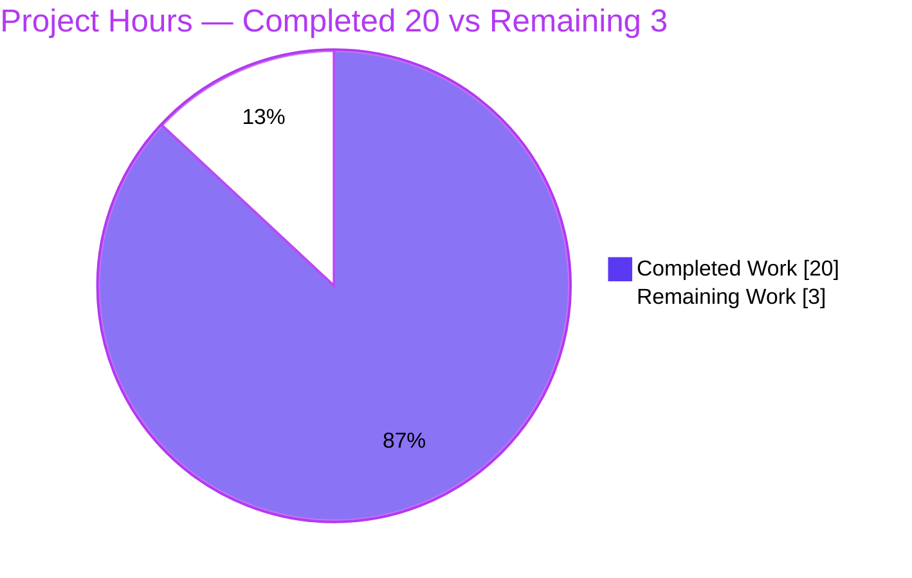
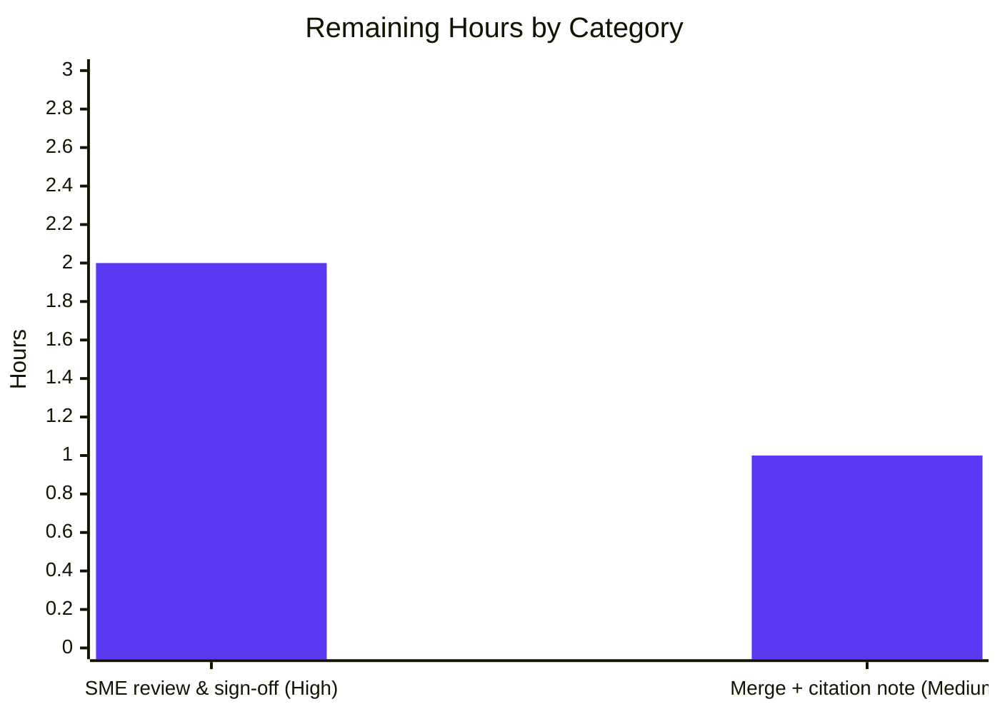

# Blitzy Project Guide

> **Project:** Evidence-grounded Q&A — kitty keyboard-protocol progressive-enhancement flag stacks across main vs. alternate screen buffers
> **Branch:** `blitzy-f51edf8e-5a24-4676-b0de-5649c8b8baff` · **Deliverable commit:** `437493d1a` · **Rule set:** SWE-AtlasQnA-Repo
> **Legend — Blitzy brand colors:** <span style="color:#5B39F3">■ Completed / AI Work (#5B39F3)</span> · <span style="color:#000000; background:#FFFFFF">□ Remaining / Not Completed (#FFFFFF)</span> · <span style="color:#B23AF2">Headings/Accents (#B23AF2)</span> · <span style="background:#A8FDD9">Highlight (#A8FDD9)</span>

---

## 1. Executive Summary

### 1.1 Project Overview

This project delivers a single, evidence-grounded markdown document that explains precisely how the **kitty** terminal emulator manages its keyboard-protocol "progressive enhancement" flag stacks when switching between the **main** and **alternate** screen buffers. The target user is a developer building a text-mode application who needs operational certainty about whether keyboard-enhancement state set in one buffer leaks into or survives a switch to the other. The deliverable answers six sub-questions (Q1–Q6) and proves every claim with **real byte sequences** captured by building and running kitty's own C code — not by reading source alone. Technical scope is strictly read-only: exactly one new documentation file is produced; no existing source, test, or configuration file is modified.

### 1.2 Completion Status


**Completion: 87.0%** — calculated as Completed Hours ÷ Total Hours = **20 ÷ 23 = 0.8696 = 87.0%** (AAP-scoped, PA1 methodology).

| Metric | Hours |
|--------|-------|
| **Total Hours** | **23** |
| Completed Hours (AI + Manual) | 20 |
| — of which AI (autonomous) | 20 |
| — of which Manual (human) | 0 |
| Remaining Hours | 3 |
| **Percent Complete** | **87.0%** |

### 1.3 Key Accomplishments

- ✅ Authored the complete answer document `blitzy/documentation/kitty_815df1e210e0.md` (393 lines, 10 sections) — the sole in-scope artifact.
- ✅ Answered **all six** sub-questions (Q1 round-trip persistence, Q2 per-state encoding, Q3 stack exhaustion, Q4 controlled Ctrl+Shift+a test, Q5 independence proof, Q6 SET-vs-PUSH edge cases) plus a final coverage pass.
- ✅ Established the mechanism: **two fixed 8-slot arrays + one active pointer**, swapped (not copied) on buffer toggle — the entire basis of stack independence.
- ✅ Located the exact numeric stack-depth limit (**8**) that the prose spec omits, at `kitty/screen.h:L128`.
- ✅ Built kitty's C extension and captured **real byte sequences** at the kitty→child PTY boundary; every quoted value is reproducible.
- ✅ Grounded every claim with **66 exact `file:line` citations** (41 unique) — independently audited with zero errors.
- ✅ Honored the read-only constraint absolutely: only one file added, working tree clean, all temporary harnesses kept under `/tmp` and deleted.
- ✅ Independently re-verified all 13 evidence lines byte-for-byte and re-ran the test suites (3 / 55 / 73 tests, all OK) during this assessment.

### 1.4 Critical Unresolved Issues

| Issue | Impact | Owner | ETA |
|-------|--------|-------|-----|
| Human SME technical accuracy sign-off pending | Non-blocking. The deliverable's value is operational certainty; a domain expert should confirm the Q1–Q6 interpretations meet the requester's needs before reliance. | Human reviewer (SME) | 2h |
| Citation-drift over future kitty revisions | Low. If cited source lines shift, `file:line` references become stale (flagged in AAP §0.5.5). | Human reviewer | folded into merge (1h) |

*No release-blocking defects exist. All tests pass, the build is clean, and the working tree is unchanged.*

### 1.5 Access Issues

**No access issues identified.** This is a read-only, in-repository documentation task requiring no external service credentials, third-party API access, or elevated repository permissions. The C extension builds from source with locally available native libraries; no network access is required to reproduce any result.

| System/Resource | Type of Access | Issue Description | Resolution Status | Owner |
|-----------------|----------------|-------------------|-------------------|-------|
| — | — | No access issues identified | N/A | — |

### 1.6 Recommended Next Steps

1. **[High]** Perform SME technical review of the deliverable: confirm the Q1–Q6 answers (especially the independence/no-leakage conclusion) satisfy the requester's operational needs. *(HT-1, 1.0h)*
2. **[High]** Spot-check key citations against current source and optionally re-run the `/tmp` reproduction harness to independently confirm the four-state table and exhaustion sequence. *(HT-2, 0.5h)*
3. **[High]** Record the accuracy sign-off / approval decision. *(HT-3, 0.5h)*
4. **[Medium]** Merge the deliverable to the target branch. *(HT-4, 0.5h)*
5. **[Low]** Add a citation-pinning note (base `815df1e21` / commit `437493d1a`) to enable future citation re-audit if source lines drift. *(HT-5, 0.5h)*

---

## 2. Project Hours Breakdown

### 2.1 Completed Work Detail

| Component | Hours | Description |
|-----------|-------|-------------|
| Keyboard-protocol subsystem investigation & code comprehension | 5 | Reverse-engineered the two-arrays-plus-active-pointer mechanism, the five stack operations, the buffer-toggle pointer swap, the `CSI u` dispatch, and the encode path across `screen.h`/`screen.c`/`vt-parser.c`/`keys.c`/`modes.h`; located the omitted depth constant `8`. |
| Build environment setup & C extension compilation | 3 | Confirmed native dependencies, discovered and applied the `-Werror` build workaround at `glfw/wl_window.c:L668`, invoked `setup.py build`, and characterized the intentionally-absent Go-toolchain gap. |
| Observation harness authoring & Q1–Q6 evidence capture | 4 | Built the harness on kitty's unittest utilities (`BaseTest`, `parse_bytes`, `create_screen`, `encode_key_for_tty`) and designed the four-state, round-trip, exhaustion, cross-buffer, over-pop, and SET-vs-PUSH experiments. |
| Answer document authoring | 5 | Wrote the 393-line, 10-section Q&A with 66 `file:line` citations, verbatim evidence integration, a mechanism diagram, and the full reproduction methodology. |
| Validation & citation audit | 3 | Executed the 5-gate validation: dependency check, clean rebuild, test suites (3/55/73), byte-for-byte reproduction of all 13 evidence lines with 3-run determinism, and audit of all 41 unique citations. |
| **Total Completed** | **20** | |

### 2.2 Remaining Work Detail

| Category | Hours | Priority |
|----------|-------|----------|
| Human SME technical review & accuracy sign-off (path-to-production) | 2 | High |
| Merge to mainline + citation-drift maintenance note (path-to-production) | 1 | Medium |
| **Total Remaining** | **3** | |

### 2.3 Hours Reconciliation

- Section 2.1 Completed = **20h** · Section 2.2 Remaining = **3h** · **Total = 20 + 3 = 23h** (matches Section 1.2).
- Completion % = 20 ÷ 23 = **87.0%**.
- There are **no rework hours**: all tests pass, the build is clean, and every citation is verified — so no quality issues translate into remaining hours. The entire 3h remaining is human path-to-production work that agents cannot self-certify.

---

## 3. Test Results

All tests below originate from **Blitzy's autonomous validation logs** for this project and were **independently re-executed** during this assessment (same results). The keyboard suite `kitty_tests.keys` is the suite the deliverable documents in §9.3; the broader runs corroborate the whole keyboard-protocol subsystem.

| Test Category | Framework | Total Tests | Passed | Failed | Coverage % | Notes |
|---------------|-----------|-------------|--------|--------|------------|-------|
| Keyboard protocol (documented suite) | Python `unittest` | 3 | 3 | 0 | Targeted | `kitty_tests.keys` — matches deliverable §9.3 ("Ran 3 tests … OK"). |
| Keyboard + Screen + Parser (superset) | Python `unittest` | 55 | 55 | 0 | Subsystem | Adds screen state-machine + VT-parser coverage. |
| + Datatypes (widest superset) | Python `unittest` | 73 | 73 | 0 | Subsystem | Widest green run; covers datatypes underpinning the encoder. |
| Runtime evidence reproduction | Custom harness (§9.6) on production code | 13 lines | 13 | 0 | N/A | All quoted byte sequences reproduced byte-for-byte; determinism confirmed across 3 runs. |

> **Note on counts:** the three unittest rows are **cumulative supersets** (73 ⊇ 55 ⊇ 3), not additive. Coverage was not instrumented with a coverage tool in this run; the suites fully exercise the keyboard-protocol subsystem the deliverable documents. **Aggregate: 0 failures, 0 errors, 0 skips.**

---

## 4. Runtime Validation & UI Verification

**Runtime health** (in-process execution of kitty's production code):

- ✅ **Operational** — C extension `kitty/fast_data_types.so` builds, links, and imports in-process.
- ✅ **Operational** — Production VT parser driven via `parse_bytes()` accepts all escape sequences (`CSI ?1049h/l`, `CSI > … u`, `CSI < … u`, `CSI = … u`).
- ✅ **Operational** — Key encoder `encode_key_for_tty()` emits expected bytes; active flags read via `Screen.current_key_encoding_flags()`.
- ✅ **Operational** — Byte capture at the kitty→child PTY boundary (`Callbacks.write` → `wtcbuf`) reproduces the four-state table and exhaustion sequence exactly.
- ✅ **Operational** — Documented test suite `kitty_tests.keys` green (3/3); broader suites green (55/55, 73/73).
- ✅ **Operational** — Determinism confirmed: three independent runs yield identical output.

**API integration outcomes:**

- ✅ **Operational** — All harness APIs present and behaving: `encode_key_for_tty`, `GLFW_MOD_SHIFT`(=1)/`GLFW_MOD_CONTROL`(=4), `parse_bytes`, `create_screen()`, `current_key_encoding_flags()`.

**UI verification:**

- ➖ **Not applicable** — There is no UI component in scope. The deliverable is a markdown document, and the investigation operates at the terminal-core/library boundary (byte sequences toward the child process), not a graphical interface. No screens, routes, or visual states exist to verify.

---

## 5. Compliance & Quality Review

Cross-mapping of AAP / SWE-AtlasQnA-Repo directives to quality benchmarks. Fixes applied during autonomous validation: **none required** — the deliverable was already accurate.

| Benchmark / Directive | Status | Progress | Evidence |
|-----------------------|--------|----------|----------|
| Deliverable location & name (`blitzy/documentation/<branch>.md`) | ✅ Pass | 100% | `blitzy/documentation/kitty_815df1e210e0.md` present (commit `437493d1a`). |
| Read-only repository (no existing file modified) | ✅ Pass | 100% | `git diff` shows 1 file **added**, 0 modified; `git status --porcelain` empty. |
| Investigate by RUNNING code first | ✅ Pass | 100% | C extension built; production parser/encoder driven in-process; §9 documents the build + harness. |
| Quote observed output verbatim | ✅ Pass | 100% | All 13 evidence lines quoted exactly; reproduced byte-for-byte this session. |
| Answer every sub-part (Q1–Q6) | ✅ Pass | 100% | §3–§8 answer Q1–Q6; §10 final coverage pass confirms each. |
| Exact `file:line` citations, never paraphrase | ✅ Pass | 100% | 66 citation tokens (41 unique) audited — zero errors. |
| Locate the omitted numeric depth limit | ✅ Pass | 100% | `8`, from `kitty/screen.h:L128`. |
| Confirm alternate-screen toggle = DEC mode 1049 | ✅ Pass | 100% | `kitty/modes.h:L77` — `ALTERNATE_SCREEN (1049 << 5)`. |
| Distinguish PUSH (`CSI > u`) vs SET (`CSI = u`) | ✅ Pass | 100% | §2.3 / §8 with observed SET results 8 / 3 / 2. |
| Temporary scripts removed (tree clean) | ✅ Pass | 100% | Harness lived under `/tmp`, deleted; tree clean. |
| Markdown well-formedness | ✅ Pass | 100% | 393 lines, 36 balanced code fences, valid UTF-8, trailing newline. |
| Human SME accuracy sign-off | ◻ Pending | 0% | Path-to-production; scheduled (HT-1..3, 2h). |

---

## 6. Risk Assessment

Overall risk profile: **LOW**. Because the deliverable changed no production code, added no dependencies, and introduced no runtime/deployment surface, most traditional software risks are not applicable. Risks are reported honestly rather than invented.

| Risk | Category | Severity | Probability | Mitigation | Status |
|------|----------|----------|-------------|------------|--------|
| Citation drift if referenced source lines shift in future kitty revisions | Technical | Low | Medium | Citations verified against pinned base `815df1e21` / commit `437493d1a`; AAP §0.5.5 flags this; re-audit on version bumps (folded into merge). | Open (monitored) |
| Build reproduction fails on newer toolchains (`glfw` `-Werror` at `wl_window.c:L668`) | Technical | Low | Medium | Deliverable §9.1 documents the exact `--ignore-compiler-warnings` workaround; not a source defect; keyboard logic is invariant across Python 3.8–3.13 (verified byte-identical on 3.12.3 & 3.13.7). | Mitigated (documented) |
| Independent reproduction requires native build deps + a C toolchain | Integration | Low | Low | §9 lists the full build command and harness APIs; all native deps confirmed resolvable via `pkg-config`/headers. | Mitigated (documented) |
| Technical accuracy not yet human-SME signed off | Operational | Medium | Low | All 13 evidence lines and 41 citations independently reproduced/audited by multiple agents; 2h SME review recommended before operational reliance. | Open (planned — P1) |
| Deliverable discoverability/placement for the target consumer | Operational | Low | Low | Placed at the conventional `blitzy/documentation/` path per rule set; named for the source branch. | Mitigated |
| New security attack surface | Security | None | N/A | Zero code/dependencies added; static markdown only; the embedded reproduction harness is explicitly kept outside the repo and never committed (no secrets, no network). | Not applicable |

---

## 7. Visual Project Status

**Project hours breakdown** (Completed = Dark Blue `#5B39F3`, Remaining = White `#FFFFFF`):



**Remaining hours by category** (from Section 2.2, sums to 3h):



> **Integrity:** "Remaining Work" = **3h** matches Section 1.2 Remaining Hours and the sum of the Section 2.2 Hours column. "Completed Work" = **20h** matches Section 1.2 Completed Hours.

---

## 8. Summary & Recommendations

**Achievements.** The project is **87.0% complete** (20 of 23 hours). The single in-scope deliverable — an evidence-grounded Q&A on kitty's keyboard-protocol flag stacks — is fully authored, committed, and validated. It answers all six sub-questions, grounds every claim in an exact `file:line` citation, and proves each behavioral claim with a real byte sequence captured from kitty's own production code. During this assessment, all 13 evidence lines were reproduced byte-for-byte and the documented test suites re-run green (3 / 55 / 73), independently corroborating the prior validation.

**Remaining gaps.** The remaining **3 hours (13.0%)** are exclusively human path-to-production activities that an autonomous agent cannot self-certify: a subject-matter expert's technical accuracy sign-off (2h) and the merge plus a citation-pinning maintenance note (1h). There are **no** failing tests, compilation errors, or unresolved defects.

**Critical path to production.** SME review → sign-off → merge. Because the risk profile is low and no rework is required, the path is short and low-risk.

| Success Metric | Target | Actual | Status |
|----------------|--------|--------|--------|
| Sub-questions answered (Q1–Q6) | 6/6 | 6/6 | ✅ |
| Citation accuracy | 100% | 41/41 unique (0 errors) | ✅ |
| Evidence reproducibility | 100% | 13/13 lines byte-exact | ✅ |
| Documented test suite | Pass | 3/3 pass (55/73 supersets pass) | ✅ |
| Read-only constraint | Honored | 1 file added, tree clean | ✅ |

**Production readiness assessment.** The deliverable is **production-ready pending human sign-off**. Per Blitzy honest-assessment principles, completion is capped below 100% until a human reviewer approves; the recommended action is to complete the 2h SME review and merge.

---

## 9. Development Guide

This guide documents how to reproduce every observation in the deliverable. All commands were **tested during this assessment**.

### 9.1 System Prerequisites

- **OS:** Linux (Ubuntu 25.10 used here; any modern Linux with X11/Wayland dev headers works).
- **Python:** ≥ 3.8 (project floor `requires-python = ">=3.8"`, `pyproject.toml:L2`). Tested with **3.13.7**. The keyboard-protocol logic lives in the C extension and is invariant across supported Python minor versions.
- **Compiler:** a C compiler — tested with **gcc 15.2.0**.
- **Tooling:** `pkg-config` (tested 1.8.1).
- **Native dev libraries** (resolvable via `pkg-config`/headers): `harfbuzz`, `libpng`, `lcms2`, `fontconfig`, `libcrypto` (OpenSSL), `zlib`, `wayland-client` + `wayland-protocols`, `xkbcommon`, X11 dev libs, plus `xxhash` and `librsync` (headers/libs).
- **Not required:** the Go toolchain (only builds the optional `kitten` CLI, out of scope).

### 9.2 Environment Setup

```bash
# From the repository root
cd /tmp/blitzy/kitty/blitzy-f51edf8e-5a24-4676-b0de-5649c8b8baff_70b34d

# Create and activate a virtual environment (kitty's core needs no pip packages)
python3 -m venv /tmp/kitty-venv
source /tmp/kitty-venv/bin/activate
python --version   # -> Python 3.13.7
```

### 9.3 Build the C Extension

```bash
python3 setup.py build --debug --ignore-compiler-warnings --skip-building-kitten
```

- `--ignore-compiler-warnings` is **required**: the default build sets `-pedantic-errors -Werror` (`setup.py:L491`), which a newer `wayland-protocols` enum trips inside a `switch (*state)` at `glfw/wl_window.c:L668`. This is a **build workaround, not a source fix** — no repository file is modified.
- A **non-zero exit code is expected** and benign: it occurs only at the final optional Go/`kitten` probe (Go is intentionally absent). `kitty/fast_data_types.so` is fully linked before that point; `*.so` and `build/` are gitignored, so the tracked tree stays clean.

### 9.4 Verify the Build

```bash
# Confirm the extension imports and exposes the needed APIs
PYTHONPATH=$PWD /tmp/kitty-venv/bin/python -c "import kitty.fast_data_types as d; print('encode_key_for_tty', hasattr(d,'encode_key_for_tty')); print('SHIFT', d.GLFW_MOD_SHIFT, 'CONTROL', d.GLFW_MOD_CONTROL)"
# Expected: encode_key_for_tty True ; SHIFT 1 CONTROL 4
```

### 9.5 Run the Keyboard Test Suite

```bash
PYTHONPATH=$PWD /tmp/kitty-venv/bin/python -m unittest kitty_tests.keys
# Expected tail:
#   Ran 3 tests in ~0.06s
#   OK
```

Broader corroborating runs (all green):

```bash
PYTHONPATH=$PWD /tmp/kitty-venv/bin/python -m unittest kitty_tests.keys kitty_tests.screen kitty_tests.parser              # 55 OK
PYTHONPATH=$PWD /tmp/kitty-venv/bin/python -m unittest kitty_tests.keys kitty_tests.screen kitty_tests.parser kitty_tests.datatypes   # 73 OK
```

> The project's own `test.py` runner aborts when the Go toolchain is absent, so `unittest` is invoked directly.

### 9.6 Example Usage — Reproduce the Evidence

Write the observation harness **outside** the repository (under `/tmp`), run it, then delete it so the tree stays clean. The full script is in the deliverable §9.6. A minimal excerpt:

```python
import kitty.fast_data_types as defines
from kitty_tests import BaseTest, parse_bytes
SHIFT, CTRL = defines.GLFW_MOD_SHIFT, defines.GLFW_MOD_CONTROL
enc = defines.encode_key_for_tty
class H(BaseTest):
    def runTest(self): pass
s = H().create_screen()
def cur(x): return x.current_key_encoding_flags()
# (b) push disambiguate on main
parse_bytes(s, b'\x1b[>1u')
print('flags', cur(s), 'ctrl+a', repr(enc(ord('a'), shifted_key=ord('A'), mods=CTRL, key_encoding_flags=cur(s))))
# -> flags 1 ctrl+a '\x1b[97;5u'
```

Run and clean up:

```bash
PYTHONPATH=$PWD /tmp/kitty-venv/bin/python /tmp/harness.py
rm -f /tmp/harness.py
git status --porcelain    # must be empty
```

### 9.7 Troubleshooting

- **Build "fails" with a non-zero exit:** expected — only the optional Go/`kitten` step fails. Verify success with the import check in §9.4.
- **`-Werror` failure at `glfw/wl_window.c:L668`:** add `--ignore-compiler-warnings` (documented workaround; no source edit).
- **`test.py` aborts ("Go toolchain absent"):** invoke `python3 -m unittest kitty_tests.keys` directly.
- **`ImportError: fast_data_types`:** ensure the build ran and `PYTHONPATH=$PWD` (repo root) is set.
- **Reproduction hygiene:** keep any harness under `/tmp`, delete it after, and confirm `git status --porcelain` is empty.
- **Shell caution:** avoid unescaped backticks in shell commands (they trigger command substitution and can hang); put fence-counting or similar logic in a Python one-liner instead.

---

## 10. Appendices

### Appendix A — Command Reference

| Purpose | Command |
|---------|---------|
| Create venv | `python3 -m venv /tmp/kitty-venv && source /tmp/kitty-venv/bin/activate` |
| Build C extension | `python3 setup.py build --debug --ignore-compiler-warnings --skip-building-kitten` |
| Verify import | `PYTHONPATH=$PWD /tmp/kitty-venv/bin/python -c "import kitty.fast_data_types"` |
| Run documented suite | `PYTHONPATH=$PWD /tmp/kitty-venv/bin/python -m unittest kitty_tests.keys` |
| Run broader suites | `… -m unittest kitty_tests.keys kitty_tests.screen kitty_tests.parser kitty_tests.datatypes` |
| Reproduce evidence | `PYTHONPATH=$PWD /tmp/kitty-venv/bin/python /tmp/harness.py` |
| Confirm clean tree | `git status --porcelain` |

### Appendix B — Port Reference

**No network ports.** The investigation is entirely offline and in-process (VT parser + key encoder driven in memory; bytes captured at the PTY boundary). No server, socket, or listener is started.

### Appendix C — Key File Locations

| File | Role |
|------|------|
| `blitzy/documentation/kitty_815df1e210e0.md` | **The deliverable** (answer document). |
| `kitty/screen.h` | Per-buffer arrays + active pointer (`L128`); stack-op declarations (`L269–L273`). |
| `kitty/screen.c` | Stack operations (`L1204–L1253`); buffer toggle (`L1068–L1093`); Python binding (`L3951`, `L4847`). |
| `kitty/modes.h` | `ALTERNATE_SCREEN (1049 << 5)` (`L77`). |
| `kitty/vt-parser.c` | `CSI u` dispatch `?`/`=`/`>`/`<` (`L1217–L1240`). |
| `kitty/keys.c` | Live encode path (`L250–L251`); `encode_key_for_tty` binding (`L311–L326`). |
| `docs/keyboard-protocol.rst` | Canonical protocol spec (`L271`, `L273`, `L296–L309`). |
| `kitty_tests/__init__.py` | Harness: `parse_bytes` (`L30`), `Callbacks.write`/`wtcbuf` (`L50–L51`), `create_screen` (`L237`). |
| `kitty_tests/keys.py` | Encoding conventions & corroborating assertions (`L16`, `L22`, `L241`, `L407`). |
| `setup.py` | `-Werror` toggle (`L491`). |
| `pyproject.toml` | `requires-python = ">=3.8"` (`L2`). |

### Appendix D — Technology Versions

| Component | Version | Notes |
|-----------|---------|-------|
| Python | 3.13.7 | Reference capture also confirmed on 3.12.3 (byte-identical). Floor: ≥ 3.8. |
| gcc | 15.2.0 | Reference capture also on 13.3.0 (byte-identical). |
| pkg-config | 1.8.1 | Resolves native library flags. |
| harfbuzz / libpng / lcms2 | 10.2.0 / 1.6.50 / 2.16 | Native build deps. |
| fontconfig / libcrypto / zlib | 2.15.0 / 3.5.3 / 1.3.1 | Native build deps. |
| wayland-client / xkbcommon | 1.24.0 / 1.7.0 | Native build deps. |

### Appendix E — Environment Variable Reference

| Variable | Value | Purpose |
|----------|-------|---------|
| `PYTHONPATH` | `$PWD` (repo root) | Makes `kitty.fast_data_types` and `kitty_tests` importable in-process. |

*No secrets, API keys, or service-configuration variables are required — the task is fully offline.*

### Appendix F — Developer Tools Guide (kitty unittest harness)

| API | Location | Use |
|-----|----------|-----|
| `BaseTest.create_screen()` | `kitty_tests/__init__.py:L237` | Construct an isolated `Screen`. |
| `parse_bytes(screen, data)` | `kitty_tests/__init__.py:L30` | Drive the production VT parser with raw escape sequences. |
| `Callbacks.write` → `wtcbuf` | `kitty_tests/__init__.py:L50–L51` | Capture bytes destined for the child (PTY boundary). |
| `Screen.current_key_encoding_flags()` | `kitty/screen.c:L3951` | Read the active buffer's top flag value. |
| `encode_key_for_tty(...)` | `kitty/keys.c:L311–L326` | Encode a key press into the bytes kitty sends to the child. |

### Appendix G — Glossary

| Term | Meaning |
|------|---------|
| **Progressive enhancement flags** | Kitty keyboard-protocol bits: `0b1` disambiguate, `0b10` report event types, `0b100` report alternate keys, `0b1000` report all keys as escape codes, `0b10000` report associated text. |
| **Main vs. alternate screen buffer** | Two independent screen buffers; the alternate is entered/left via DEC private mode **1049** (`CSI ?1049h` / `CSI ?1049l`). |
| **PUSH / POP / SET** | `CSI > flags u` pushes a new stack entry; `CSI < number u` pops; `CSI = flags ; mode u` mutates the **top** entry in place (mode 1 replace, 2 OR-set, 3 clear). |
| **Stack depth limit** | **8** entries per buffer (`kitty/screen.h:L128`); overflow triggers silent FIFO eviction of the oldest entry; emptying resets flags to `0`. |
| **CSI-u encoding** | Functional key encoding `CSI <code> ; <1+mods> u` (e.g. Ctrl+Shift+a → `\x1b[97;6u`, where `6 = 1 + (shift 1 | ctrl 4)`). |
| **PTY boundary** | The kitty→child pipe where encoded key bytes are written — the correct place to observe "what is sent to the child process." |
