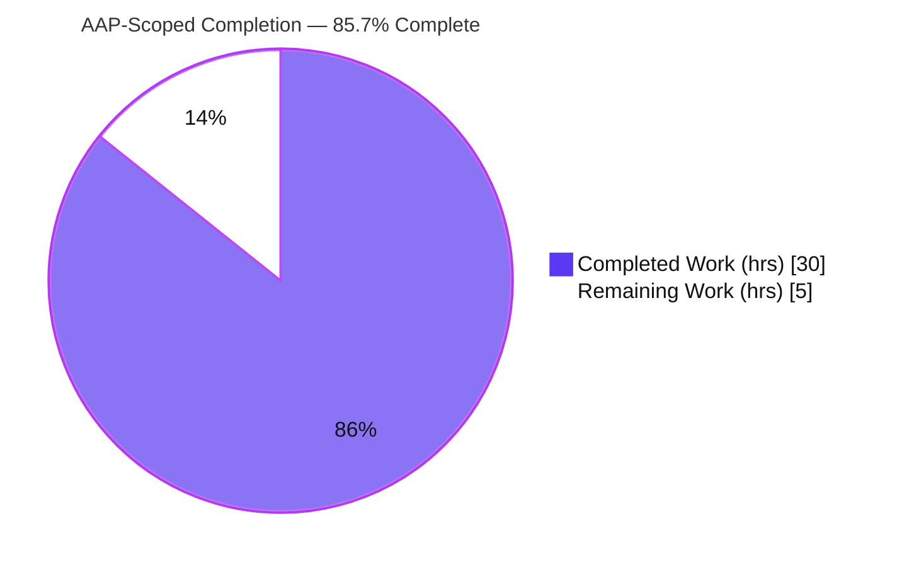
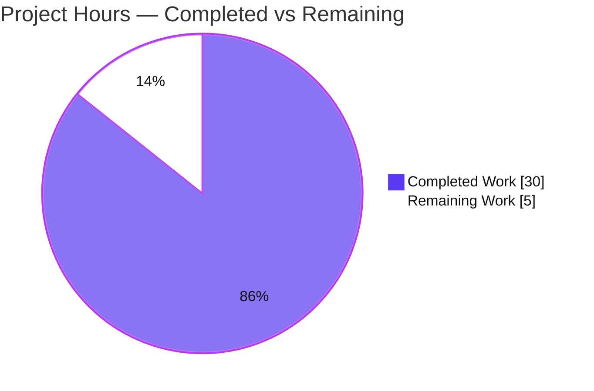
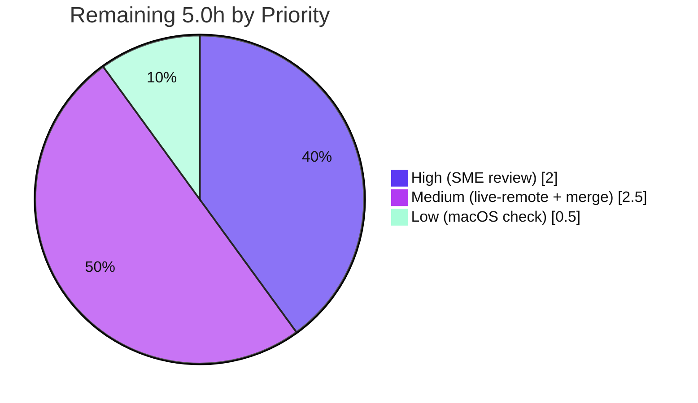

# Blitzy Project Guide — kitty SSH-Kitten Code-Grounded Walkthrough (Q1–Q9)

> **Brand legend.** Throughout this guide, **Completed / AI Work** is rendered in **Dark Blue `#5B39F3`** and **Remaining / Not Completed** in **White `#FFFFFF`**. Headings/accents use Violet‑Black `#B23AF2`; soft highlights use Mint `#A8FDD9`.

---

## 1. Executive Summary

### 1.1 Project Overview

This project authors a single, **code‑grounded onboarding document** that explains how the kitty terminal emulator's **SSH kitten** securely bootstraps kitty's shell integration onto a remote host. It is a **read‑only documentation / code‑comprehension Q&A task** (rule `SWE-AtlasQnA-Repo`): the source is studied and built but never changed. The target audience is engineers onboarding to the SSH‑kitten subsystem. The deliverable answers nine sub‑questions (Q1–Q9) spanning three layers — the Go client (`kittens/ssh/*.go`), the remote shell/Python bootstrap (`shell-integration/ssh/bootstrap.*`), and the local Python serving handler (`kitty/window.py`, `kittens/ssh/utils.py`, `kitty/shm.py`) — with exact `file:line` citations and verbatim observed output. The technical scope is comprehension, security analysis, and protocol tracing; there is no runtime component to deploy.

### 1.2 Completion Status



<div align="center"><strong>Overall Completion: 85.7%</strong> &nbsp;•&nbsp; <span style="color:#5B39F3">■ Completed 30.0h</span> &nbsp; <span style="color:#B23AF2">□ Remaining 5.0h</span></div>

| Metric | Value |
|--------|-------|
| **Total Hours** | **35.0** |
| **Completed Hours (AI + Manual)** | **30.0** (30.0 AI‑autonomous + 0.0 Manual) |
| **Remaining Hours** | **5.0** |
| **Percent Complete** | **85.7%** |

> Completion is computed with the PA1 AAP‑scoped, hours‑based method: `Completed / (Completed + Remaining) = 30.0 / (30.0 + 5.0) = 85.7%`. Every autonomous AAP requirement is delivered; the 5.0 remaining hours are exclusively **human path‑to‑production** (review, empirical verification, merge).

### 1.3 Key Accomplishments

- ✅ **Single deliverable authored & committed** — `blitzy/documentation/kitty_815df1e210e0.md` (1,004 lines / 7,153 words) at the correct rule‑mandated path.
- ✅ **All nine questions answered** — Q1–Q9 each in a dedicated section (39–95 lines), 1:1 with the AAP, plus an end‑to‑end overview with a Mermaid data‑flow diagram (Q7) and a 9/9 coverage‑pass checklist.
- ✅ **Three‑layer coverage** — Go client + remote bootstrap scripts + local Python serving handler, all cited.
- ✅ **Exhaustive grounding** — 205 `file:line` citations across 17 source files; load‑bearing literals quoted verbatim (`0o600`, VT/FF/CR/BS map `0x0b/0x0c/0x0d/0x08`, 254‑byte chunk, DCS prefix `\033P@kitty-ssh|`, six ControlMaster options, exact error strings).
- ✅ **Build‑and‑run‑first honored** — project built to `kitten 0.35.2`; Go suites `ok kitty/kittens/ssh` + `ok kitty/tools/utils/shm` (8 PASS / 0 FAIL); observation appendices (a–g) reproduce the security mechanics byte‑for‑byte.
- ✅ **Read‑only mandate upheld** — `git diff 815df1e21..HEAD` shows exactly one file added; working tree clean; `go.mod`/`go.sum` unchanged.
- ✅ **Honest scope discipline** — the two items not observed end‑to‑end are explicitly flagged rather than asserted.

### 1.4 Critical Unresolved Issues

| Issue | Impact | Owner | ETA |
|-------|--------|-------|-----|
| _None — no blocking issues._ The deliverable is complete, verified, and committed; zero source files required modification. | None | — | — |

### 1.5 Access Issues

| System/Resource | Type of Access | Issue Description | Resolution Status | Owner |
|-----------------|----------------|-------------------|-------------------|-------|
| _No access issues identified._ Repository, Go/Python/C toolchain, and the designated build container were all available; the project built and the studied test suites ran successfully. | — | — | Resolved / N/A | — |

### 1.6 Recommended Next Steps

1. **[High]** Subject‑matter‑expert **accuracy review** of the Q1–Q9 explanations and a citation sample before acceptance (2.0h).
2. **[Medium]** Perform a **live `kitten ssh` end‑to‑end run** against a real/containerized remote host to empirically confirm the reconstructed flow the document flags as unobserved (2.0h).
3. **[Medium]** **Merge/accept** the documentation PR, re‑confirming the read‑only mandate (`git diff` = 1 file) at merge time (0.5h).
4. **[Low]** **Empirically confirm the macOS 255‑byte TTY input‑queue limit** on actual macOS (currently quoted from the code comment at `kittens/ssh/utils.py:140-142`) (0.5h).

---

## 2. Project Hours Breakdown

### 2.1 Completed Work Detail

All completed hours are AI‑autonomous. Each component traces to an AAP requirement or the rule's investigate‑by‑running mandate.

| Component | Hours | Description |
|-----------|------:|-------------|
| Environment build & toolchain setup | 2.5 | Canonical mixed Python+C+Go build (`python3 setup.py build` → `kitten 0.35.2`); resolved the C‑extension‑before‑Go‑codegen ordering. |
| Test execution & observation‑script capture | 3.5 | Ran the studied Go suites; authored throwaway observation scripts and captured verbatim output for appendix (a)–(g). |
| Cross‑layer code comprehension | 7.0 | Traced 17 source files across 3 layers / 2 languages (Go client, remote scripts, Python serving handler). |
| Web research (external framing) | 1.0 | SSH `ControlMaster` multiplexing + POSIX `shm_open` security semantics (Background section only). |
| Q1 — Shared‑memory credential passing | 1.0 | Write path in `bootstrap_script`, validated read path in `read_data_from_shared_memory`. |
| Q2 — Bootstrap generation | 0.75 | `prepare_script` / `bootstrap_script`; template selection, placeholder substitution, embedded payload. |
| Q3 — Archive build & transport | 1.0 | `make_tarfile` (gzip+tar PAX), chunked serving, remote untar. |
| Q4 — Connection‑state struct | 0.5 | `connection_data` field‑by‑field enumeration. |
| Q5 — Connection reuse / ControlMaster | 1.0 | `connection_sharing_args`, `ssh -O check` piggyback decision. |
| Q6 — Per‑shell encoding | 1.25 | `wrap_bootstrap_script`; VT/FF/CR/BS map + remote `tr` decode; Python base64 variant. |
| Q7 — End‑to‑end trace + Mermaid | 1.25 | `run_ssh` orchestration narrative with data‑flow diagram. |
| Q8 — Shared‑memory security model | 1.25 | Ownership/permission re‑validation, read‑once‑unlink, unguessable names, password handshake. |
| Q9 — TTY DCS handshake | 1.0 | `dcs_to_kitty` framing + `KITTY_DATA_START`/`OK`/`KITTY_DATA_END` protocol. |
| Supporting structure | 2.0 | Methodology, three‑layer map, end‑to‑end overview, additional details, background, appendix assembly. |
| Citation verification & QA | 4.0 | 205‑citation bounds sweep, load‑bearing literal verification, F1–F4 code‑review corrections, FIX‑1/FIX‑2 range precision, markdown hygiene. |
| Coverage pass + cleanup + commits | 1.0 | 9/9 coverage checklist, temp‑script removal, 4 commits. |
| **Total Completed** | **30.0** | **Matches Completed Hours in §1.2.** |

### 2.2 Remaining Work Detail

All remaining work is human path‑to‑production. Each item traces to an AAP directive (grounding/verification) or standard acceptance/merge.

| Category | Hours | Priority |
|----------|------:|----------|
| SME technical accuracy review of the Q1–Q9 answer document | 2.0 | High |
| Live remote SSH end‑to‑end verification (doc‑flagged unobserved) | 2.0 | Medium |
| macOS 255‑byte TTY limit empirical confirmation (doc‑flagged) | 0.5 | Low |
| Merge / acceptance of the documentation PR | 0.5 | Medium |
| **Total Remaining** | **5.0** | **Matches Remaining Hours in §1.2 and §7 pie.** |

### 2.3 Hours Reconciliation

| Check | Computation | Result |
|-------|-------------|--------|
| §2.1 total = Completed (§1.2) | 30.0 = 30.0 | ✅ |
| §2.2 total = Remaining (§1.2) | 5.0 = 5.0 | ✅ |
| §2.1 + §2.2 = Total (§1.2) | 30.0 + 5.0 = 35.0 | ✅ |
| §1.2 = §2.2 = §7 remaining | 5.0 = 5.0 = 5.0 | ✅ |
| Completion % | 30.0 / 35.0 = **85.7%** | ✅ |

---

## 3. Test Results

All tests below originate from **Blitzy's autonomous validation logs** for this project and were **independently re‑executed** during this assessment. These are the only test suites relevant to the deliverable's claims (the SSH kitten and the shared‑memory primitives it relies on). Command: `go test -count=1 ./kittens/ssh/ ./tools/utils/shm/`.

| Test Category | Framework | Total Tests | Passed | Failed | Coverage % | Notes |
|---------------|-----------|------------:|-------:|-------:|-----------:|-------|
| Unit — SSH kitten | `go test` | 7 | 7 | 0 | Not measured | `ok  kitty/kittens/ssh  0.049s` |
| Unit — Shared memory (`shm`) | `go test` | 1 | 1 | 0 | Not measured | `ok  kitty/tools/utils/shm  0.005s` |
| **Total** | **`go test`** | **8** | **8** | **0** | **—** | **0 SKIP; verbose tally 8 PASS / 0 FAIL** |

> **Integrity note.** Test counts reflect top‑level Go test functions. Pass/fail markers (`ok …`) are quoted from the autonomous run and reproduced here. Line/branch coverage was not part of the run (pass/fail only); marked "Not measured" rather than estimated. Static analysis (not a test suite) is reported in §4.

---

## 4. Runtime Validation & UI Verification

This is a documentation Q&A task with **no UI and no server/daemon**; "runtime" validation therefore means the build, static analysis, and the reproducible observation scripts.

**Build & binary health**
- ✅ **Operational** — `CC=gcc-13 CXX=g++-13 python3 setup.py build` exits 0; `./kitty/launcher/kitten --version` → `kitten 0.35.2 created by Kovid Goyal` (15.7 MB binary present).

**Static analysis (read‑only)**
- ✅ **Operational** — `go build ./kittens/ssh/ ./tools/utils/shm/` exit 0.
- ✅ **Operational** — `go vet ./kittens/ssh/ ./tools/utils/shm/` exit 0.
- ✅ **Operational** — `python3 -m py_compile kitty/window.py kittens/ssh/utils.py kitty/shm.py` exit 0.
- ✅ **Operational** — C extension imports; `SHM_NAME_MAX = 1023` observed.

**Observation reproductions (appendix a–g)**
- ✅ **Operational** — (a) kitten version, (b) toolchain versions, (c) `go test` markers, (d) control‑char substitution byte‑for‑byte, (e) shm create + `0o600` permissions, (f) unguessable base32 names, (g) Python `shm` + `SHM_NAME_MAX`.

**Document integrity**
- ✅ **Operational** — 205 citations, 0 out‑of‑range, 0 missing‑file (independent sweep); 42 balanced code fences; trailing newline.

**UI / API verification**
- ➖ **N/A** — no UI, no HTTP API, no rendered frontend in scope for this documentation task.

**Live remote SSH end‑to‑end**
- ⚠ **Partial** — the end‑to‑end narrative (DCS request/response over the TTY, 254‑byte chunking, untar + terminfo compile + login‑shell re‑exec) is reconstructed from source plus reproduced unit‑level mechanics and passing tests; it was **not** run against a live remote host. This is explicitly flagged in the document's coverage pass and queued as human task H2.

---

## 5. Compliance & Quality Review

Cross‑mapping the governing `SWE-AtlasQnA-Repo` rule and each AAP deliverable to Blitzy's quality/compliance benchmarks. Fixes applied during autonomous validation are noted.

| Benchmark / AAP Deliverable | Requirement | Status | Evidence / Notes |
|-----------------------------|-------------|--------|------------------|
| **Rule R1 — Deliverable path** | `blitzy/documentation/<branch>.md` | ✅ Pass | `blitzy/documentation/kitty_815df1e210e0.md` present. |
| **Rule R2 — Investigate by running** | Build + run first, quote real output | ✅ Pass | Built to `kitten 0.35.2`; Go suites run; appendix a–g verbatim. |
| **Rule R3 — Answer every part** | Decompose + coverage pass | ✅ Pass | Q1–Q9 dedicated sections; 9/9 coverage checklist. |
| **Rule R4 — Exactness & grounding** | Exact `file:line`; never paraphrase values; flag unverifiable | ✅ Pass | 205 citations; literals verbatim; 2 items explicitly flagged. |
| **Rule R5 — Read‑only scope** | No source edits; temp scripts removed | ✅ Pass | `git diff` = 1 file added; tree clean; temp scripts removed. |
| **AAP Q1 — Shared‑memory credentials** | Explain secure credential passing | ✅ Pass | Q1 section (78 lines), cites write/read paths + `0o600`. |
| **AAP Q2 — Bootstrap generation** | Template/placeholder/payload | ✅ Pass | Q2 section (46 lines). |
| **AAP Q3 — Archive build & transport** | tar+gzip, terminfo, chunking | ✅ Pass | Q3 section (65 lines); 254‑byte chunk cited. |
| **AAP Q4 — Connection state** | `connection_data` struct | ✅ Pass | Q4 section (39 lines). |
| **AAP Q5 — Connection reuse** | ControlMaster multiplexing | ✅ Pass | Q5 section (79 lines); 6 options cited. |
| **AAP Q6 — Per‑shell encoding** | POSIX sh vs Python | ✅ Pass | Q6 section (88 lines); VT/FF/CR/BS map + `tr` decode. |
| **AAP Q7 — End‑to‑end trace** | Full narrative | ✅ Pass | Q7 section (75 lines) + Mermaid diagram. |
| **AAP Q8 — Shared‑memory security** | Ownership/perms/read‑once/names/pw | ✅ Pass | Q8 section (95 lines); error strings verbatim. |
| **AAP Q9 — TTY DCS handshake** | DCS request/response protocol | ✅ Pass | Q9 section (76 lines); DCS prefix + markers cited. |
| **Markdown hygiene** | Balanced fences, resolving anchors, trailing newline | ✅ Pass | 42 fences balanced; anchors resolve; trailing newline. |
| **Citation bounds** | All `file:line` in range | ✅ Pass | Independent sweep: 205 checked, 0 out‑of‑range, 0 missing. |
| **Empirical end‑to‑end** | Live remote run | ⚠ Partial | Reconstructed + unit‑verified; live run flagged (H2). |

**Fixes applied during autonomous validation (in‑scope doc only):**
- **FIX‑1** (doc L192): `kittens/ssh/main.go:511-529` → `:511-525` (aligned to `get_remote_command` definition).
- **FIX‑2** (doc L279): `shell-integration/ssh/bootstrap.sh:132-133` → `:130-132` (aligned to `compile_terminfo`/`mv_files_and_dirs`).
- Earlier code‑review corrections F1–F4 and a QA "FINAL_ALT" pass (normalized `tr` literal, HEAD‑wording clarity) were folded in across the 4 commits. All quoted literals were already exact; these were line‑range precision refinements.

**Outstanding quality item:** SME accuracy sign‑off (H1) — the acceptance gate for an onboarding artifact.

---

## 6. Risk Assessment

Risk profile is that of a **read‑only documentation task**: no deployed runtime, no new attack surface, no dependency/config changes. No High or Critical risks exist.

| Risk | Category | Severity | Probability | Mitigation | Status |
|------|----------|----------|-------------|------------|--------|
| Citation drift — doc pins HEAD `815df1e21`; future source edits could stale `file:line` refs | Technical | Low | Medium | Revision pinned at top of doc; re‑validate citations on major refactors | Mitigated |
| End‑to‑end flow reconstructed, not live‑executed (Q7) | Technical | Low | Low | Doc flags explicitly; unit mechanics reproduced; live‑remote task H2 queued | Open (flagged) |
| No new attack surface introduced | Security | None | N/A | Read‑only mandate enforced (`git diff` = 1 doc file; zero code/dep/config change) | Closed |
| Accuracy of the documented security model (shm ownership/perms, password handshake) | Security | Low | Low | Load‑bearing literals verified exact (`0o600`, error strings, `TokenHex`); SME review H1 | Open (pending review) |
| No runtime / deployment surface | Operational | None | N/A | Nothing deployed; monitoring/health/rollback not applicable | Closed |
| Documentation rot over time | Operational | Low | Medium | Revision‑pinned; owner refreshes on subsystem changes | Open (informational) |
| Live remote SSH path unexercised (real cross‑host DCS/TTY, macOS chunking) | Integration | Low | Low | Unit mechanics reproduced + tests pass; live‑remote verification H2 | Open (flagged) |
| No external service credentials/keys/network config required | Integration | None | N/A | Task needs none | Closed |

---

## 7. Visual Project Status

### 7.1 Project Hours Breakdown



- **Completed Work** (`#5B39F3`): **30.0h** — matches §1.2 Completed and §2.1 total.
- **Remaining Work** (`#FFFFFF`): **5.0h** — matches §1.2 Remaining and §2.2 total.

### 7.2 Remaining Work by Priority



### 7.3 Remaining Hours per Category (from §2.2)

| Category | Hours | Bar |
|----------|------:|-----|
| SME accuracy review (High) | 2.0 | ████████ |
| Live remote SSH verification (Medium) | 2.0 | ████████ |
| Merge / acceptance (Medium) | 0.5 | ██ |
| macOS 255‑byte check (Low) | 0.5 | ██ |
| **Total** | **5.0** | |

> **Integrity:** §7 "Remaining Work" = 5.0h equals §1.2 Remaining and the §2.2 sum. §7 "Completed Work" = 30.0h equals §1.2 Completed and the §2.1 sum.

---

## 8. Summary & Recommendations

**Achievements.** Every autonomous, AAP‑scoped requirement is delivered. The project produced one comprehensive, code‑grounded answer document (`blitzy/documentation/kitty_815df1e210e0.md`, 1,004 lines) that answers all nine sub‑questions across the SSH kitten's three layers, grounded in 205 exact `file:line` citations and verbatim observed output. The build‑and‑run‑first mandate was honored (project built to `kitten 0.35.2`; Go suites 8 PASS / 0 FAIL), and the read‑only mandate was upheld (a single file added; clean tree). Independent re‑verification during this assessment reproduced the test markers, the citation bounds sweep (205/0/0), and the markdown hygiene checks.

**Remaining gaps.** The 5.0 remaining hours are entirely **human path‑to‑production**: a subject‑matter‑expert accuracy review (the acceptance gate), an empirical live‑remote `kitten ssh` run, an optional macOS 255‑byte confirmation, and merge. The document itself honestly flags the two items it did not observe end‑to‑end rather than asserting them.

**Critical path to production.** SME accuracy review (H1, High) → optionally live‑remote verification (H2) → merge (H3). No blocking issues stand in the way.

**Success metrics.** 9/9 questions answered; 205/205 citations in range; 8/8 tests passing; 1/1 file added (read‑only upheld); 0 unresolved issues.

**Production‑readiness assessment.** For an onboarding documentation artifact, the deliverable is **substantially production‑ready at 85.7% AAP‑scoped completion**. The remaining 14.3% represents genuine human review/verification/merge that, by design, cannot be completed autonomously. Recommended disposition: **accept after SME sign‑off.**

| Metric | Value |
|--------|-------|
| AAP‑scoped completion | 85.7% |
| Autonomous hours delivered | 30.0 |
| Human hours remaining | 5.0 |
| Blocking issues | 0 |
| Overall risk | Low |

---

## 9. Development Guide

Every command below was executed in the assessment environment and is copy‑pasteable. Commands are read‑only or build‑only; none modify tracked source.

### 9.1 System Prerequisites

- **OS:** Linux (Ubuntu 25.10 verified; the designated build container is `ghcr.io/scaleapi/swe-atlas:swe_atlas_QnA_kovidgoyal_kitty_1.0`).
- **Go:** 1.22+ (`go.mod:3` requires `go 1.22`). Observed: `go1.22.12`.
- **Python:** 3.8+ (`pyproject.toml`). Observed: `3.13.7`.
- **C compiler:** C11 (`gcc`/`g++`). Observed: `gcc-13 (Ubuntu 13.4.0-4ubuntu1) 13.4.0`.
- **System build libraries** (per `.github/workflows/ci.py`):
  ```bash
  # Debian/Ubuntu
  sudo DEBIAN_FRONTEND=noninteractive apt-get install -y \
    libgl1-mesa-dev libxkbcommon-dev libharfbuzz-dev libfontconfig-dev \
    liblcms2-dev libpng-dev libxxhash-dev uuid-dev python3-dev \
    libssl-dev libsimde-dev build-essential
  ```

### 9.2 Environment Setup

```bash
# Work on the delivered branch (repo already checked out at the branch)
git checkout blitzy-77ecf02b-e1b6-4d18-8f19-0c4c925e8d33

# Confirm toolchain versions
go version                 # -> go version go1.22.12 linux/amd64
python3 --version          # -> Python 3.13.7
gcc-13 --version | head -1 # -> gcc-13 (Ubuntu 13.4.0-4ubuntu1) 13.4.0
```

### 9.3 Build (canonical mixed Python + C + Go)

```bash
# The FULL setup.py build is required (not just `go build`):
# Go code generation runs via `kitty +launch`, which depends on the
# built C extension kitty/fast_data_types.so.
CC=gcc-13 CXX=g++-13 python3 setup.py build      # -> exit 0
```

### 9.4 Verify the Build

```bash
./kitty/launcher/kitten --version
# Expected: kitten 0.35.2 created by Kovid Goyal
```

### 9.5 Run the Studied Test Suites (observation)

```bash
go test -count=1 ./kittens/ssh/ ./tools/utils/shm/
# Expected:
#   ok  kitty/kittens/ssh        0.049s
#   ok  kitty/tools/utils/shm    0.005s
```

### 9.6 Read‑Only Static Analysis

```bash
go build ./kittens/ssh/ ./tools/utils/shm/          # exit 0
go vet   ./kittens/ssh/ ./tools/utils/shm/          # exit 0
python3 -m py_compile kitty/window.py kittens/ssh/utils.py kitty/shm.py  # exit 0
```

### 9.7 Read & Review the Deliverable

```bash
# View the document
less blitzy/documentation/kitty_815df1e210e0.md

# List the answer sections (Q1..Q9 + structure)
grep -nE '^#{1,3} ' blitzy/documentation/kitty_815df1e210e0.md

# Reviewer citation bounds sweep (expects: 205 checked, 0 out-of-range, 0 missing)
python3 - <<'PY'
import re, os
doc = "blitzy/documentation/kitty_815df1e210e0.md"
pat = re.compile(r'([A-Za-z0-9_./-]+\.(?:go|py|sh)):(\d+)(?:-(\d+))?')
checked = oor = missing = 0
for m in pat.finditer(open(doc).read()):
    f, a, b = m.group(1), int(m.group(2)), m.group(3)
    if not os.path.exists(f):
        missing += 1; continue
    n = sum(1 for _ in open(f, encoding='utf-8', errors='replace'))
    hi = int(b) if b else a
    checked += 1
    if a < 1 or hi < a or hi > n:
        oor += 1
print(f"citations checked={checked}, out-of-range={oor}, missing-file={missing}")
PY

# Markdown hygiene (expects: even fence count, trailing newline)
awk '/^```/{c++} END{print "code fences:", c, (c%2==0?"(balanced)":"(UNBALANCED)")}' \
  blitzy/documentation/kitty_815df1e210e0.md
```

### 9.8 Confirm Read‑Only Mandate

```bash
git diff 815df1e21..HEAD --name-status
# Expected: A  blitzy/documentation/kitty_815df1e210e0.md   (ONLY)
git status --porcelain    # Expected: empty (clean tree)
```

### 9.9 Example Usage — Reproduce an Observation

```bash
# Reproduce the Q6 POSIX-sh control-character substitution (appendix d):
python3 - <<'PY'
repl = {"'":"\v", "\\":"\f", "\n":"\r", "!":"\b"}
s = "echo 'hi'\\n!"
enc = "".join(repl.get(ch, ch) for ch in s)
print("INPUT :", s.encode().hex())
print("ENCODED:", enc.encode().hex())
# Remote decodes with:  tr \v\f\r\b \047\134\n\041
PY
```

> A full **live** run — `kitten ssh <host>` against a real remote — exercises the DCS request/response over the TTY, 254‑byte chunked transfer, remote untar, terminfo compile (`tic`), and login‑shell re‑exec. This is the empirical verification queued as human task **H2**.

### 9.10 Troubleshooting

- **Go packages fail to compile (missing generated `kitty` package):** you skipped the full build. Run `python3 setup.py build` first — Go codegen depends on the built C extension.
- **C extension build errors (`simde/x86/avx2.h` not found):** install `libsimde-dev` (and `libssl-dev`).
- **Wrong compiler picked up:** pin it explicitly with `CC=gcc-13 CXX=g++-13`.
- **`kitten: command not found`:** the binary is at `./kitty/launcher/kitten` after the build (it is git‑ignored, not committed).

---

## 10. Appendices

### Appendix A — Command Reference

| Purpose | Command |
|---------|---------|
| Build (canonical) | `CC=gcc-13 CXX=g++-13 python3 setup.py build` |
| Version check | `./kitty/launcher/kitten --version` |
| Run studied tests | `go test -count=1 ./kittens/ssh/ ./tools/utils/shm/` |
| Go build (static) | `go build ./kittens/ssh/ ./tools/utils/shm/` |
| Go vet (static) | `go vet ./kittens/ssh/ ./tools/utils/shm/` |
| Python compile check | `python3 -m py_compile kitty/window.py kittens/ssh/utils.py kitty/shm.py` |
| List doc sections | `grep -nE '^#{1,3} ' blitzy/documentation/kitty_815df1e210e0.md` |
| Confirm read‑only diff | `git diff 815df1e21..HEAD --name-status` |
| Commit history | `git log --oneline 815df1e21..HEAD` |

### Appendix B — Port Reference

➖ **Not applicable.** This documentation Q&A task exposes no network services and binds no ports. (A live `kitten ssh` run uses the standard SSH port 22 on the target host, but that is external and out of scope for the deliverable.)

### Appendix C — Key File Locations

| Path | Role |
|------|------|
| `blitzy/documentation/kitty_815df1e210e0.md` | **The deliverable** (1,004 lines) |
| `kittens/ssh/main.go` | Orchestration: `run_ssh`, `connection_data`, `make_tarfile`, `bootstrap_script`, `wrap_bootstrap_script`, `connection_sharing_args`, `read_data_from_shared_memory` |
| `kittens/ssh/config.go`, `utils.go`, `askpass.go` | Host‑option parsing, SSH helpers, `SSH_ASKPASS` helper |
| `kittens/ssh/utils.py` | `get_ssh_data` (254‑byte chunks), `read_data_from_shared_memory` (owner/perm validation) |
| `kitty/window.py` | `handle_remote_ssh` (drives `get_ssh_data`) |
| `kitty/shm.py` | POSIX shm wrapper over `fast_data_types.shm_open`/`shm_unlink` |
| `tools/utils/shm/shm_fs.go` (+ `specific_*.go`) | Atomic owner‑only create (`O_EXCL`, `0600`); per‑platform `SHM_DIR` |
| `tools/utils/paths.go` | `RandomFilename` (crypto‑random base32 names) |
| `tools/crypto/crypto.go`, `tools/utils/secrets/tokens.go` | `TokenHex` per‑connection data password |
| `shell-integration/ssh/bootstrap.sh` / `bootstrap.py` / `bootstrap-utils.sh` | Remote entry scripts + helpers |

### Appendix D — Technology Versions (observed)

| Component | Version | Source of Requirement |
|-----------|---------|-----------------------|
| Go toolchain | `go1.22.12 linux/amd64` | `go.mod:3` requires `go 1.22` |
| CPython | `3.13.7` | `pyproject.toml` requires `>=3.8` |
| gcc/g++ | `13.4.0` (`gcc-13`) | C11 extension build |
| kitten binary | `kitten 0.35.2` | `kitty/constants.py:25` (`Version(0, 35, 2)`) |
| C extension | `SHM_NAME_MAX = 1023` | `kitty.fast_data_types` |

### Appendix E — Environment Variable Reference

| Variable | Value | Purpose |
|----------|-------|---------|
| `CC` | `gcc-13` | Select C compiler for the extension build |
| `CXX` | `g++-13` | Select C++ compiler for the build |
| `DEBIAN_FRONTEND` | `noninteractive` | Non‑interactive apt for prerequisite install |

> No application/runtime environment variables are required — this is a build‑and‑read task, not a service.

### Appendix F — Developer Tools Guide

- **`go test`** — runs the SSH‑kitten and shm suites for observation (`-count=1` disables caching; add `-v` for per‑function markers).
- **`go vet`** — read‑only static correctness checks (no `--fix`).
- **`py_compile`** — byte‑compiles Python serving files to catch syntax errors without executing them.
- **Citation bounds sweep** (Appendix in §9.7) — parses every `file:line[-line]` in the doc and confirms it lies within the cited file (expects 205 / 0 / 0).
- **Markdown fence check** (§9.7) — confirms code fences are balanced.

### Appendix G — Glossary

| Term | Meaning |
|------|---------|
| **SSH kitten** | kitty's `kitten ssh` client that bootstraps shell integration onto a remote host |
| **Bootstrap script** | `bootstrap.sh`/`bootstrap.py` sent to and executed on the remote to request data and re‑exec the login shell |
| **Shell integration** | kitty features (prompt marks, etc.) enabled in the remote shell via the transported archive |
| **DCS** | Device Control String — the in‑band escape framing (`\033P@kitty-ssh\|…\033\\`) used for the terminal↔remote handshake |
| **shm** | POSIX shared memory (`/dev/shm` tmpfs on Linux) used to pass credentials owner‑only (`0600`) |
| **ControlMaster / ControlPath / ControlPersist** | OpenSSH connection‑multiplexing directives enabling connection reuse (Q5) |
| **terminfo** | Terminal capability database; the kitty entry is compiled on the remote with `tic` |
| **`TokenHex`** | Generator of the per‑connection random data password echoed back by the remote |
| **`RandomFilename`** | Crypto‑random base32 name generator making shm object names unguessable |
| **PAX tar** | The tar format used for the in‑memory, gzip‑compressed shell‑integration archive |

---

*Prepared by the Blitzy autonomous assessment agent. All hours, percentages, and test counts are internally consistent across Sections 1.2, 2.1, 2.2, 3, and 7; cross‑section integrity rules validated prior to submission (Completed 30.0h + Remaining 5.0h = 35.0h Total; 85.7% complete; Completed `#5B39F3`, Remaining `#FFFFFF`).*