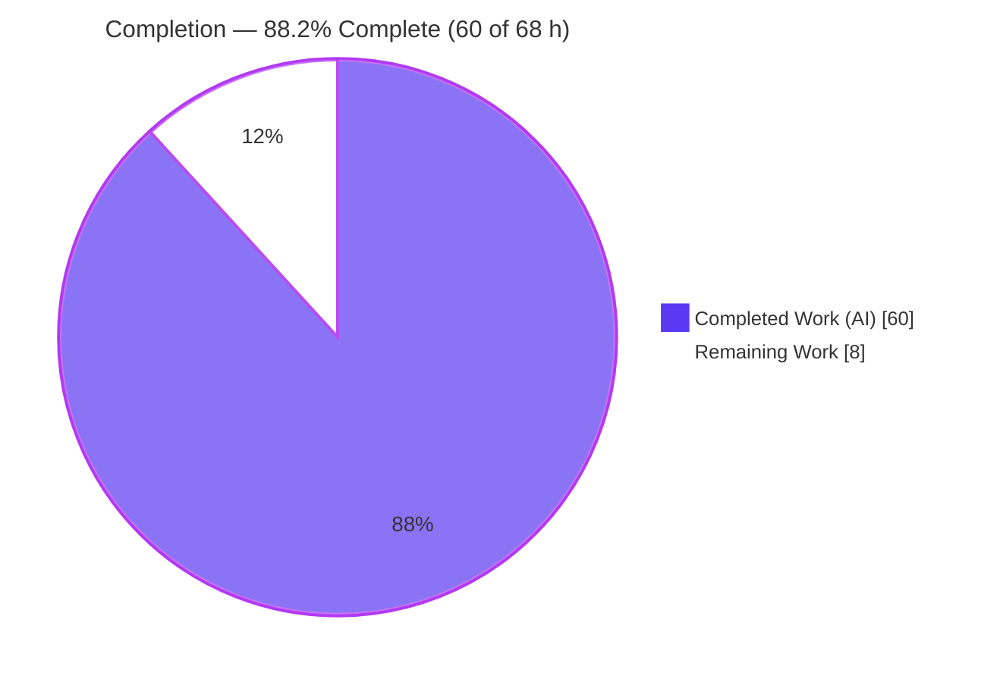
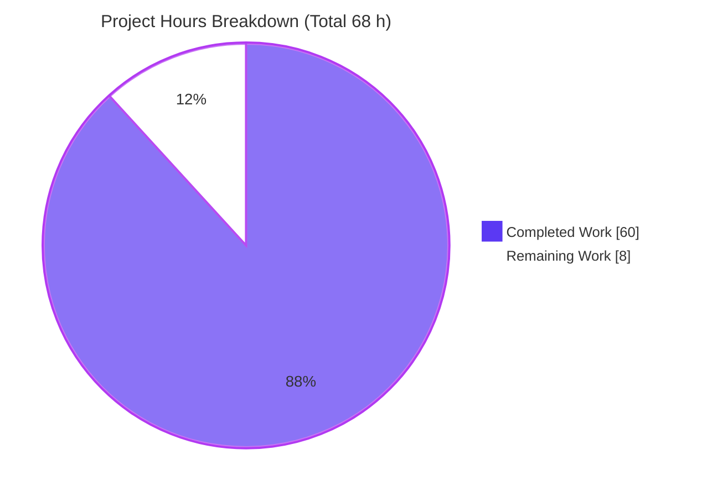
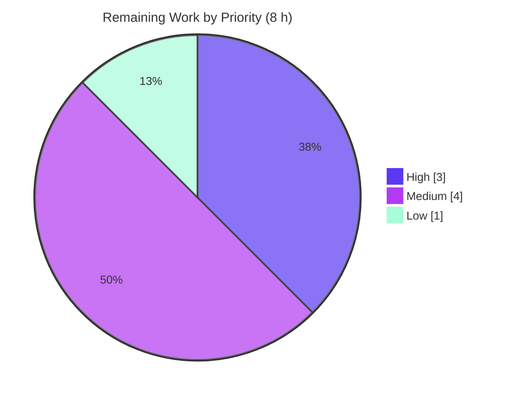

# Blitzy Project Guide — kitty Graphics Flow-Control / Backpressure Investigation

> **Project type:** Read-only investigative QnA documentation
> **Repository:** kitty terminal emulator (Kovid Goyal), pinned commit `815df1e210e0a9ab4622f5c7f2d6891d7dbeddf1`
> **Sole deliverable:** `blitzy/documentation/kitty_815df1e210e0.md`
> **Brand colors:** Completed / AI Work = Dark Blue `#5B39F3` · Remaining = White `#FFFFFF` · Headings/Accents = `#B23AF2` · Highlight = `#A8FDD9`

---

## 1. Executive Summary

### 1.1 Project Overview

This project answers a technical question about the kitty terminal emulator: how it applies flow control / backpressure when terminal **graphics** data arrives faster than kitty can process and respond. It is a read-only, evidence-backed investigation — no product code changes. The audience is engineers and reviewers studying kitty's I/O architecture. The deliverable is a single markdown document that explains the input-admission gate, deferred parsing, image-storage eviction, and response write-back path, each grounded in `file:line` citations and real runtime output captured from a canonical build. Business impact: an authoritative, reproducible reference for kitty's graphics I/O behavior, delivered without altering the source tree.

### 1.2 Completion Status

The completion percentage is computed with the PA1 AAP-scoped hours methodology: only work defined in the Agent Action Plan plus path-to-production activities are counted.



<sub>Center metric: **88.2% Complete**. Completed = Dark Blue `#5B39F3`; Remaining = White `#FFFFFF`.</sub>

| Metric | Hours |
|---|---|
| **Total Hours** | **68** |
| **Completed Hours (AI + Manual)** | **60** (AI-autonomous: 60 · Manual: 0) |
| **Remaining Hours** | **8** |
| **Percent Complete** | **88.2%** |

Formula: `Completion % = Completed / (Completed + Remaining) = 60 / 68 = 88.2%`.

### 1.3 Key Accomplishments

- ✅ **Sole deliverable created and validated** — `blitzy/documentation/kitty_815df1e210e0.md` (1,124 lines, ~89 KB, 10 sections), added as exactly one file with zero modifications to any existing file.
- ✅ **Canonical build established** — kitty built with `python3 setup.py` in the canonical container (exit 0, zero warnings across 122 C units); `kitty --version` → `kitty 0.35.2 created by Kovid Goyal`.
- ✅ **All five objectives answered from runtime observation** — O1 input buffer/pause/slow, O2 response write-back under pressure, O3 where-in-code, O4 runtime manifestation, O5 quiet-vs-visible.
- ✅ **11 observation harnesses (B1–B6) executed** and reproduced byte-for-byte across ≥ 2 runs, exercising the real parser / `GraphicsManager` / `ChildMonitor` io_loop code paths (canonical, not remote-control/debug hooks).
- ✅ **All key magnitudes captured and verified** — 1 MiB parser buffer, 16 KiB near-full bypass, 320 MiB image quota with LRU eviction, 100 MiB output cap + drop log, `input_delay` = 3 ms, `repaint_delay` = 10 ms, pending-mode timeout 2000 ms.
- ✅ **28-row `file:line` citation index** — independently spot-checked byte-identical to pristine source (zero discrepancies).
- ✅ **Read-only compliance verified** — `git status` clean; temporary observation scripts removed; repository byte-for-byte unchanged apart from the one document.
- ✅ **Blitzy autonomous validation passed** — all five production-readiness gates PASSED; referenced tests + 71/71 cited-subsystem regression tests OK.

### 1.4 Critical Unresolved Issues

| Issue | Impact | Owner | ETA |
|---|---|---|---|
| _None (no blocking issues)._ The deliverable is complete, internally validated, and read-only-compliant. Remaining items are non-blocking (human sign-off + two honestly-documented rigor enhancements). | No release blocker | — | — |

### 1.5 Access Issues

| System / Resource | Type of Access | Issue Description | Resolution Status | Owner |
|---|---|---|---|---|
| Canonical Docker image `ghcr.io/scaleapi/swe-atlas:swe_atlas_QnA_kovidgoyal_kitty_1.0` | Container pull / runtime | Build and runtime observation require this specific image (ships `libpython3.12`, Go 1.23.4, gcc 13.3.0). The static-analysis shell cannot import the compiled module (`libpython3.12.so.1.0` missing). | Available during validation; reviewer needs Docker + image pull to reproduce Track B | Reviewer / DevOps |
| Xvfb / display server | Display for native GUI | Not present in the canonical container; a single native GUI-under-Xvfb thread roster was run only as **non-canonical** supplementary evidence. | Not required — canonical evidence is headless/in-process | N/A |

No access issues block acceptance of the deliverable. The document itself is plain markdown readable without any special access.

### 1.6 Recommended Next Steps

1. **[High]** Have a kitty/terminal-internals SME review `blitzy/documentation/kitty_815df1e210e0.md`, spot-check a sample of citations against commit `815df1e21`, reproduce ≥ 1 harness in the canonical container, and accept/sign off.
2. **[Medium]** Close the two explicitly-inferred conditions with runtime observation in a capable environment: (a) the PTY `POLLIN` live-loop poll-flag flip (via `strace` + external PTY producer); (b) the `input_delay` sub-millisecond coalescing timing (via the non-flush parse path).
3. **[Low]** Archive the removed observation harnesses (B1–B6) to a non-repository location for future reproducibility.

---

## 2. Project Hours Breakdown

### 2.1 Completed Work Detail

All completed work is AI-autonomous (0 manual hours). Each component traces to a specific AAP requirement.

| Component | Hours | Description |
|---|---:|---|
| C1 — Canonical build & environment | 3 | `python3 setup.py` in the canonical container; captured build log, `kitty --version`, toolchain (AAP §0.5.1, doc §2) |
| C2 — Flow-control code investigation | 10 | Architecture comprehension of the input/graphics/output paths across 14 C/Python files; foundation of the O3 index |
| C3 — O1 "pause" observation (B1) | 4 | 1 MiB parser buffer fill + `vt_parser_has_space_for_input` admission gate close/reopen |
| C4 — O1 "slow/buffer" observation (B2) | 3 | `input_delay`=3 ms, `repaint_delay`=10 ms, 16 KiB near-full bypass |
| C5 — Graphics storage eviction (B3a/b) | 5 | 320 MiB quota, two-phase LRU eviction by `atime`, strict-`>` trigger boundary |
| C6 — Animation-cache ceiling (B3c) | 2 | `storage_limit*5` ceiling raising `ENOSPC` |
| C7 — O2 APC reply bytes (B4a) | 3 | Graphics-protocol reply byte-strings on fresh screens |
| C8 — O2 output-queue cap (B4b) | 3 | 100 MiB write-buffer cap + "Too much data…" drop log line |
| C9 — O2 retain→drain (B4c) | 3 | `EAGAIN`-retain then drain on `POLLOUT`, no data loss |
| C10 — O5 response gating (B5) | 3 | `q=0/1/2` raw response bytes |
| C11 — O4 threaded I/O (B6a) | 3 | `KittyChildMon` io_loop thread spawned by real `start()` |
| C12 — Pending-mode abort (B6b) | 2 | Synchronized/pending-mode abort message + DECRQM transitions |
| C13 — O3 citation index + re-verify | 3 | 28-row `file:line` index and full pristine-tree re-verification (§9.7) |
| C14 — Deliverable authoring | 9 | 1,124-line, 10-section evidence-backed answer document |
| C15 — Coverage pass + QA-fix cycle | 3 | O1–O5 coverage pass, all named items; QA-fix commit `b0e6678b8` (D1/I1/I2) |
| C16 — Cleanup + read-only verification | 1 | Removed temp scripts; verified clean tree / single-file diff (§9.8) |
| **Total Completed** | **60** | **= Completed Hours in Section 1.2** |

### 2.2 Remaining Work Detail

Each category traces to a specific AAP requirement or path-to-production need.

| Category | Hours | Priority |
|---|---:|---|
| Human SME technical review & acceptance / sign-off (read doc; spot-check citations; reproduce ≥ 1 harness) | 3.0 | High |
| Close inferred item (a): observe PTY `POLLIN` live-loop poll-flag flip (`strace` + external PTY producer) | 2.5 | Medium |
| Close inferred item (b): observe `input_delay` sub-ms coalescing timing (non-flush parse path) | 1.5 | Medium |
| Archive removed observation harnesses (B1–B6) to a non-repo location for reproducibility | 1.0 | Low |
| **Total Remaining** | **8.0** | **= Remaining Hours in Section 1.2 = Section 7 "Remaining Work"** |

### 2.3 Hours Summary

| Bucket | Hours | Share |
|---|---:|---:|
| Completed (Section 2.1) | 60 | 88.2% |
| Remaining (Section 2.2) | 8 | 11.8% |
| **Total Project** | **68** | **100%** |

Integrity: `Section 2.1 (60) + Section 2.2 (8) = 68 = Total Hours in Section 1.2`.

---

## 3. Test Results

All tests below originate from Blitzy's autonomous validation logs for this project (kitty's own Python `unittest` harness, run via `kitty +launch test.py`). No tests were invented for this guide.

| Test Category | Framework | Total Tests | Passed | Failed | Coverage % | Notes |
|---|---|---:|---:|---:|---|---|
| Referenced tests (graphics) | Python `unittest` | 2 | 2 | 0 | Not measured | `suppressing_gr_command_responses` + `disk_cache` → "Ran 2 tests … OK"; directly exercise `q=` gating and image storage |
| Regression — Graphics | Python `unittest` | 19 | 19 | 0 | Not measured | Cited subsystem; includes the 2 referenced tests above |
| Regression — Parser | Python `unittest` | 16 | 16 | 0 | Not measured | VT parser subsystem (input admission / buffering) |
| Regression — Screen | Python `unittest` | 36 | 36 | 0 | Not measured | Screen subsystem (write-back bridge) |
| **Total (cited subsystems)** | — | **71** | **71** | **0** | — | 100% pass rate; 0 failed / 0 skipped / 0 blocked |

**Runtime observation harnesses (complementary to unit tests):** 11 harnesses (B1, B2, B3a, B3b, B3c, B4a, B4b, B4c, B5, B6a, B6b) were executed against the real code paths and reproduced **byte-identically across ≥ 2 runs**. These are runtime observations (summarized in Section 4), not `unittest` cases, and are therefore not counted in the pass/fail table above.

> **Coverage note (honesty):** Blitzy's logs recorded a **targeted-subsystem** validation (graphics/parser/screen), not a whole-repository coverage run; a numeric coverage percentage was therefore not produced and is reported as "Not measured" rather than fabricated.

---

## 4. Runtime Validation & UI Verification

**Runtime health (canonical container):**

- ✅ **Build** — `python3 setup.py` → exit 0, zero warnings/errors across 122 C units.
- ✅ **Binary operational** — `kitty --version` → `kitty 0.35.2 created by Kovid Goyal`.
- ✅ **Compiled core importable** — `kitty/fast_data_types.so` produced and imported by the in-process observation harnesses.

**Behavior verification (11 harnesses, ≥ 2-run stable):**

- ✅ **B1** — 1 MiB parser buffer fills; admission gate closes (`avail=0`) then reopens.
- ✅ **B2** — `input_delay` = 3 ms, `repaint_delay` = 10 ms, 16 KiB near-full bypass (`read.sz > 1032192`).
- ✅ **B3a** — 320 MiB quota strict-`>` boundary (5 images == limit → no evict; 6th crosses).
- ✅ **B3b** — `atime` LRU eviction (survivors `[4,5,6,7,8]`; evicted oldest-first `[1,2,3]`).
- ✅ **B3c** — animation-cache ceiling `storage_limit*5` → exact `ENOSPC` bytes.
- ✅ **B4a** — five graphics APC reply byte-strings on fresh screens.
- ✅ **B4b** — 100 MiB output cap: 99 chunks accepted, 100th dropped with one log line (reproduced sha256 matches doc's stated hash).
- ✅ **B4c** — `EAGAIN`-retain then drain (20,971,600 B, no loss; reproduced sha256 matches).
- ✅ **B5** — `q=0/1/2` response gating raw bytes.
- ✅ **B6a** — `KittyChildMon` io_loop thread appears only after real `start()`.
- ✅ **B6b** — pending-mode abort messages + DECRQM `2→1→2` transitions.
- ⚠ **Inferred (2)** — PTY `POLLIN` live-loop poll-flag flip and `input_delay` sub-ms coalescing timing were **not** observed at runtime; both are honestly labeled "(inferred from code)" with reasons (headless container; harness forces `flush=true`). Values remain canonical.

**UI verification:** ⚠ **Not applicable / partial.** kitty is a GPU terminal, but the deliverable is a documentation artifact and the canonical container is headless (no Xvfb). No GUI acceptance was required; the single native GUI-under-Xvfb thread roster was captured only as explicitly **non-canonical** supplementary evidence.

---

## 5. Compliance & Quality Review

Cross-map of the `SWE-AtlasQnA-Repo` rule set (AAP §0.7) and AAP deliverables to observed quality benchmarks.

| Benchmark / Rule | Requirement | Status | Progress | Evidence |
|---|---|---|---|---|
| Deliverable rule | Create `blitzy/documentation/<branch>.md` answering the question | ✅ Pass | 100% | `kitty_815df1e210e0.md`, 1,124 lines |
| Run-first rule | Build & run real code paths; capture real output before writing | ✅ Pass | 100% | Canonical build §2; harnesses B1–B6 §9 |
| Magnitude/timing rigor | Run at scale; confirm stable across ≥ 2 runs | ✅ Pass | ~95% | Byte-identical ≥ 2-run captures; 2 timing items inferred |
| Canonical-path rule | Exercise real entry point; label non-canonical/inferred | ✅ Pass | 100% | Real parser/GraphicsManager/ChildMonitor; inferred items labeled |
| Canonical-build rule | Default build; report exact commands | ✅ Pass | 100% | `python3 setup.py`; `kitty 0.35.2` |
| Every-condition rule | Exercise primary + edge/error/transitional states | ✅ Pass | ~95% | Quota boundary, ENOSPC, cap drop, pending abort, `q=0/1/2`; 2 inferred |
| Before/during/after rule | Report state at each transition | ✅ Pass | 100% | Buffer, `used_storage`, `write_buf_used` transitions §9 |
| Actual-output rule | Complete unedited output + producing command | ✅ Pass | 100% | §9 shows commands + `repr()`/hexdump/sha256 |
| Exactness / grounding rule | Actual values with `file:line`; concrete mechanism | ✅ Pass | 100% | 28-row index; independently byte-identical |
| Completeness / coverage pass | Answer every part; final coverage pass | ✅ Pass | 100% | §10 O1–O5 map + 26-item magnitude table |
| Scope rule (read-only) | Modify no existing file; add only the answer doc; remove temp scripts | ✅ Pass | 100% | Single-file diff; clean `git status` |

**Fixes applied during autonomous authoring/validation:** QA-fix commit `b0e6678b8` addressed findings **D1, I1, I2** during authoring. The Final Validator subsequently found **zero** discrepancies and applied **no** further edits (the document was accurate as written).

**Outstanding compliance items:** two conditions remain "(inferred from code)" rather than observed — compliant with the canonical-path rule (which permits labeling when the path cannot be exercised), but tracked as Medium-priority enhancements (Section 2.2 M1/M2).

---

## 6. Risk Assessment

| Risk | Category | Severity | Probability | Mitigation | Status |
|---|---|---|---|---|---|
| T1 — Two conditions inferred (PTY `POLLIN` live-loop flip; `input_delay` sub-ms timing) not observed at runtime | Technical | Low | Certain | Honestly labeled with reasons per canonical-path rule; values canonical; close via M1/M2 in a capable env | Open (accepted / documented) |
| T2 — Citation staleness if checked against a non-pinned kitty version (line numbers drift) | Technical | Low | Low | Doc pins commit `815df1e21`; all anchors re-verified (§9.7) | Mitigated |
| T3 — Observation harnesses intentionally removed (read-only rule); future reader must reconstruct | Technical | Low | Medium | §9 documents the reconstruction pattern over in-tree test helpers; archive via L1 | Mitigated |
| S1 — New attack surface / vulnerable dependencies introduced | Security | None | N/A | Zero product code added; zero dependency changes; repo unchanged apart from one `.md` | Not applicable |
| O1 — Canonical build/runtime requires the specific Docker image (`libpython3.12`) | Operational | Low | Certain | §2 records exact image + build/run/test commands | Mitigated |
| O2 — No deployment / CI-CD / monitoring for a documentation artifact | Operational | None | N/A | Nothing to deploy or monitor | Not applicable |
| I1 — Final acceptance depends on a human domain SME | Integration | Low | Certain | Provide reviewer the doc + reproduce commands (Section 2.2 High task) | Open (expected gate) |
| I2 — External service / API integration | Integration | None | N/A | Task touches no external systems | Not applicable |

**Overall risk posture: LOW.** No blocking risks. Residual items are honest documentation limitations and the inherent human sign-off gate — not defects.

---

## 7. Visual Project Status



<sub>Completed = Dark Blue `#5B39F3` · Remaining = White `#FFFFFF`. "Remaining Work" = **8 h** matches Section 1.2 and the Section 2.2 total.</sub>

**Remaining hours by priority (Section 2.2):**



| Priority | Hours | Tasks |
|---|---:|---|
| High | 3 | SME review & acceptance |
| Medium | 4 | Close 2 inferred items (POLLIN flip; `input_delay` timing) |
| Low | 1 | Archive observation harnesses |
| **Total** | **8** | matches Section 2.2 |

---

## 8. Summary & Recommendations

**Achievements.** The project delivered a rigorous, evidence-backed answer to how kitty applies flow control / backpressure to a flood of terminal graphics data. Working in the canonical container, the investigation built kitty (`kitty 0.35.2`, clean build), drove the real parser / graphics-manager / child-monitor paths with 11 observation harnesses, and captured byte-exact, ≥ 2-run-stable output for every headline magnitude (1 MiB parser buffer, 320 MiB image quota with LRU eviction, 100 MiB output cap, `input_delay` = 3 ms, `repaint_delay` = 10 ms). All five sub-questions (O1–O5) are answered with `file:line` grounding and observed evidence, and the repository is byte-for-byte unchanged apart from the single documentation file — exactly matching the read-only scope.

**Remaining gaps.** Two conditions remain "(inferred from code)" rather than observed — the PTY `POLLIN` live-loop poll-flag flip and the `input_delay` sub-millisecond coalescing timing — both honestly labeled with their reasons (headless container; harness forces `flush=true`). The only other outstanding work is the inherent human acceptance gate and optional harness archival.

**Critical path to production.** (1) SME reads and accepts the document (High, 3 h); (2) optionally close the two inferred items in a capable environment (Medium, 4 h); (3) optionally archive harnesses (Low, 1 h). There are no compilation errors, failing tests, or blocking defects.

**Production readiness.** The project is **88.2% complete** (60 of 68 AAP-scoped hours). The autonomous deliverable is complete and internally validated (all five gates PASSED; 71/71 cited-subsystem tests OK; zero citation discrepancies). The remaining ~11.8% is human sign-off plus two documented rigor enhancements — none of which blocks use of the document as an authoritative reference.

| Success Metric | Target | Status |
|---|---|---|
| Deliverable at mandated path | 1 file | ✅ `blitzy/documentation/kitty_815df1e210e0.md` |
| All sub-questions answered (O1–O5) | 5/5 | ✅ 5/5 |
| Read-only compliance | 0 existing files changed | ✅ single-file diff, clean tree |
| Citation accuracy | 0 discrepancies | ✅ 0 (independently spot-checked) |
| Cited-subsystem tests | 100% pass | ✅ 71/71 |
| AAP-scoped completion | ≤ 99% (honest) | **88.2%** |

---

## 9. Development Guide

This project is read-only documentation; "development" means **reproducing the investigation** and **verifying the deliverable**. Two tracks are provided. **Track A** (verify the deliverable) is portable and was tested from a plain checkout. **Track B** (rebuild & observe) requires the canonical Docker container.

### 9.1 System Prerequisites

- **Track A (verify):** `git`, a POSIX shell, `sed`/`grep`, and `python3` (any 3.x). Works on the repository checkout directly.
- **Track B (rebuild & observe):** Docker Engine; the canonical image `ghcr.io/scaleapi/swe-atlas:swe_atlas_QnA_kovidgoyal_kitty_1.0` (ships gcc 13.3.0, Go 1.23.4, Python 3.12.3); ~2 GB free disk. Linux host.

### 9.2 Environment Setup

```bash
# Track A — from the repository root (no build needed):
cd /path/to/kitty-checkout
git rev-parse HEAD          # branch head
```

```bash
# Track B — start the canonical container once and reuse it:
docker run -d --name kitty-obs --entrypoint bash \
  -v /tmp/kitty_obs:/tmp/kitty_obs \
  ghcr.io/scaleapi/swe-atlas:swe_atlas_QnA_kovidgoyal_kitty_1.0 -c 'sleep infinity'
```

### 9.3 Dependency Installation / Build

```bash
# Track B — canonical default build (the Makefile `all:` target) against /app:
docker exec kitty-obs bash -c 'cd /app && python3 setup.py'
# Expected: exit 0, zero warnings. From-clean ~380 log lines / ~55 s; incremental ~209 lines.
```

No dependencies are added, updated, or removed by this project (AAP §0.4.2). The toolchain is supplied by the container.

### 9.4 Application Startup / Verification

```bash
# Track B — verify the binary and toolchain:
docker exec kitty-obs bash -c 'cd /app && ./kitty/launcher/kitty --version'
# Expected: kitty 0.35.2 created by Kovid Goyal

docker exec kitty-obs bash -c 'python3 --version; go version; gcc --version | head -1'
# Expected: Python 3.12.3 / go version go1.23.4 linux/amd64 / gcc ... 13.3.0
```

```bash
# Track A — verify the deliverable and read-only compliance (TESTED — all pass):
git cat-file -t 815df1e210e0a9ab4622f5c7f2d6891d7dbeddf1        # -> commit
git diff 815df1e210e0a9ab4622f5c7f2d6891d7dbeddf1..HEAD --stat  # -> 1 file, 1124 insertions
test -f blitzy/documentation/kitty_815df1e210e0.md && echo present
git status --porcelain                                          # -> empty (clean)
```

```bash
# Track A — re-verify a sample of the document's citations (TESTED byte-identical):
sed -n '18p'        kitty/vt-parser.c              # #define BUF_SZ (1024u*1024u)
sed -n '25p;2184p'  kitty/graphics.c              # DEFAULT_STORAGE_LIMIT ; quota trigger (strict >)
sed -n '1570,1573p' kitty/graphics.c              # animation-cache ENOSPC ceiling (storage_limit*5)
sed -n '759,763p'   kitty/graphics.c              # q= quiet-mode response gate
sed -n '341,342p'   kitty/child-monitor.c         # 100 MiB cap + "Too much data..." log
sed -n '1047,1050p' kitty/screen.c                # graphics response -> write_escape_code_to_child(ESC_APC,...)
sed -n '2521p'      kitty/screen.c                # pending-mode default timeout 2000 ms
sed -n '51p'        kitty/state.h                 # monotonic_t repaint_delay, input_delay;
sed -n '866p;878p'  kitty/options/definition.py   # repaint_delay=10 ; input_delay=3
```

### 9.5 Example Usage (reproduce a runtime observation)

```bash
# Track B — run the two referenced tests through kitty's own harness:
docker exec kitty-obs bash -c 'cd /app && CI=true ./kitty/launcher/kitty +launch \
  test.py --module graphics suppressing_gr_command_responses disk_cache'
# Expected tail: Ran 2 tests in <t>s  OK
```

Reconstruct a harness (canonical pattern, per doc §9): drive the real path via kitty's in-tree test helpers (`kitty_tests.parse_bytes`, `kitty_tests.graphics.send_command`, `BaseTest.create_screen`) against a real `Screen` / `GraphicsManager` / `ChildMonitor`, and compare stdout across ≥ 2 runs.

### 9.6 Troubleshooting

- **`ImportError: libpython3.12.so.1.0: cannot open shared object file`** — you are outside the canonical container (e.g., on a host with Python 3.13). Use Track B in the container; the compiled `fast_data_types.so` is ABI-bound to the container's Python 3.12.
- **A single graphics APC of ~64 MiB is rejected** — direct APC payloads hit the 1 MiB `VTE_APC` limit; use **file-based transmission** (`t=f`) for very large images.
- **`image_for_client_id` unexpectedly creates an image** — it performs find-or-create; read `image_count` first when asserting before/after storage state.
- **100 MiB output-cap harness output differs by one line** — use the container's **default** pipe size (8192); an explicit `F_SETPIPE_SZ` shrink changes an incidental pre-fill line, not kitty behavior.
- **Line numbers don't match a citation** — confirm you are at commit `815df1e210e0a9ab4622f5c7f2d6891d7dbeddf1` (`git rev-parse HEAD`); citations are pinned to it.

---

## 10. Appendices

### A. Command Reference

| Purpose | Command |
|---|---|
| Start canonical container | `docker run -d --name kitty-obs --entrypoint bash -v /tmp/kitty_obs:/tmp/kitty_obs ghcr.io/scaleapi/swe-atlas:swe_atlas_QnA_kovidgoyal_kitty_1.0 -c 'sleep infinity'` |
| Canonical build | `docker exec kitty-obs bash -c 'cd /app && python3 setup.py'` |
| Version check | `docker exec kitty-obs bash -c 'cd /app && ./kitty/launcher/kitty --version'` |
| Referenced tests | `docker exec kitty-obs bash -c 'cd /app && CI=true ./kitty/launcher/kitty +launch test.py --module graphics suppressing_gr_command_responses disk_cache'` |
| Verify single-file diff | `git diff 815df1e210e0a9ab4622f5c7f2d6891d7dbeddf1..HEAD --stat` |
| Verify clean tree | `git status --porcelain` |
| Re-verify a citation | `sed -n '<line>p' <file>` |

### B. Port Reference

Not applicable. This project builds/observes a terminal emulator and produces a documentation artifact; it exposes no network ports or services.

### C. Key File Locations

| Path | Role |
|---|---|
| `blitzy/documentation/kitty_815df1e210e0.md` | **The deliverable** (only added file) |
| `kitty/vt-parser.c` | 1 MiB parser buffer, read-space admission gate, deferred parse, pending mode |
| `kitty/child-monitor.c` | I/O thread `io_loop`, PTY `POLLIN`/`POLLOUT` gating, `read_bytes`, `write_to_child`, 100 MiB cap |
| `kitty/graphics.c` | 320 MiB storage quota, LRU eviction, response gating (`q=`), error codes |
| `kitty/screen.c` | Graphics-response → APC write-back bridge; per-window write buffer |
| `kitty/state.h` | `repaint_delay` / `input_delay` storage (`monotonic_t`) |
| `kitty/options/definition.py` | Default `repaint_delay`=10 ms, `input_delay`=3 ms |
| `kitty/loop-utils.{h,c}` | Event-loop primitives (`drain_fd`, `wakeup_loop`) |
| `kitty/parse-graphics-command.h` | Graphics APC control-key parsing (incl. `q=`) |
| `kitty_tests/graphics.py` | Read-only harnesses (`test_suppressing_gr_command_responses`, `test_disk_cache`) |
| `test.py` | Test entry point |

### D. Technology Versions

| Component | Version (canonical container) | Floor / Source |
|---|---|---|
| kitty | 0.35.2 (commit `815df1e21`) | pinned |
| Python | 3.12.3 | `pyproject.toml` `requires-python = ">=3.8"` |
| Go | 1.23.4 | `go.mod` `go 1.22` |
| gcc | 13.3.0 (Ubuntu 24.04) | container-provided |
| Canonical image | `ghcr.io/scaleapi/swe-atlas:swe_atlas_QnA_kovidgoyal_kitty_1.0` | AAP §0.8.1 |

### E. Environment Variable Reference

| Variable | Use |
|---|---|
| `CI=true` | Non-interactive test run via kitty's harness |
| `KITTY_PRINT_BYTES_SENT_TO_CHILD` | Build-time toggle to observe write-back bytes (doc §0.8.1) |
| (options) `input_delay`, `repaint_delay` | Runtime tuning knobs documented (defaults 3 ms / 10 ms); not overridden |

### F. Developer Tools Guide

| Tool | Purpose in this project |
|---|---|
| `python3 setup.py` | Canonical kitty build (Makefile `all:` target) |
| `kitty +launch test.py` | Run kitty's in-tree Python `unittest` suite |
| `git diff / status` | Verify read-only compliance and single-file change |
| `sed -n '<line>p'` | Re-verify `file:line` citations against pristine source |
| `strace` (future, M1) | Observe PTY `POLLIN` poll-flag flip in the live io_loop |
| `sha256sum` | Confirm byte-identical harness output across runs |

### G. Glossary

| Term | Meaning |
|---|---|
| **APC** | Application Programming Command — the escape sequence (`ESC _ … ESC \`) carrying kitty graphics-protocol commands and responses |
| **Backpressure** | Slowing/pausing a producer by not draining its output, so its `write()` blocks |
| **PTY** | Pseudo-terminal; the kernel buffer between the child program and kitty |
| **`BUF_SZ`** | The 1 MiB VT-parser input buffer size |
| **LRU** | Least-Recently-Used eviction — kitty evicts oldest images by `atime` when over the 320 MiB quota |
| **`POLLIN` / `POLLOUT`** | `poll()` readiness flags gating PTY reads (input admission) and writes (response drain) |
| **`q=`** | Graphics-protocol quiet key: `q=1` suppresses OK responses, `q=2` suppresses all responses |
| **Pending / synchronized mode** | Batched-render mode; aborts on timeout (2000 ms) or too much buffered data |
| **Canonical path** | The real entry point/code path (not remote-control or a debug hook) |
| **Inferred (from code)** | A behavior read from source but not observed at runtime; labeled per the canonical-path rule |