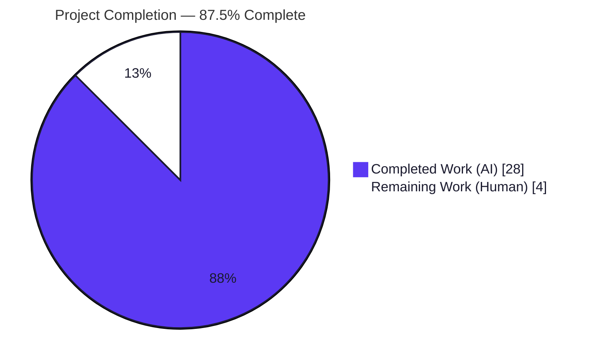
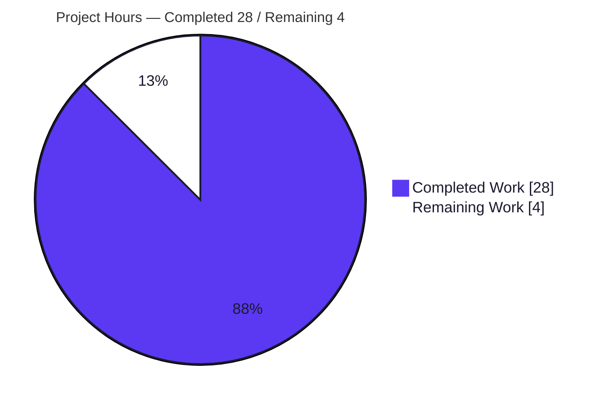
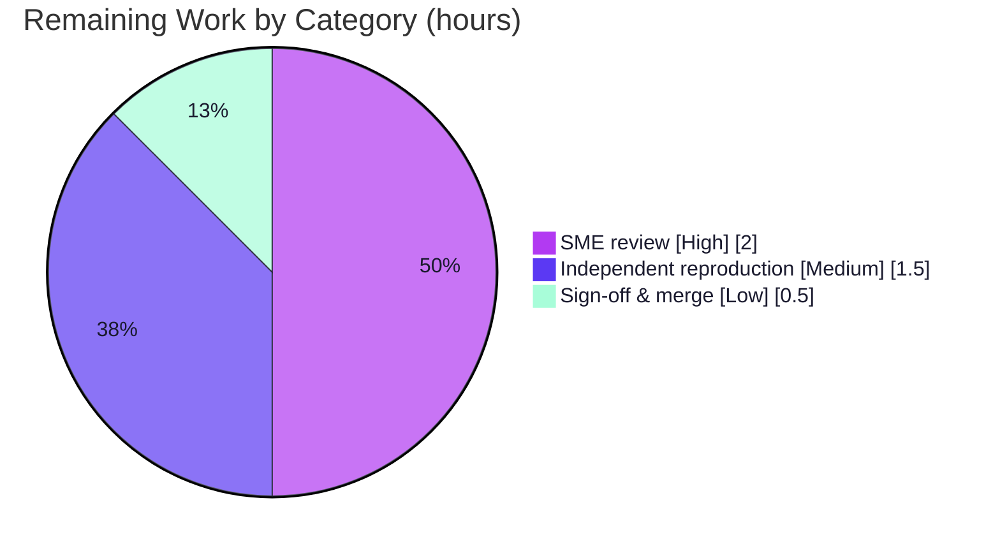

# Blitzy Project Guide — kitty Build‑Artifact ↔ Test‑Execution Dependency Analysis

> **Deliverable type:** QnA / Technical Analysis (documentation). **Source repository:** `kovidgoyal/kitty` (GPU‑accelerated terminal emulator). **Target commit:** `815df1e210e0a9ab4622f5c7f2d6891d7dbeddf1`. **Branch:** `blitzy-8d54fbae-381e-410b-b490-527fcd30cc77` (source branch `kitty_815df1e210e0`).

---

## Section 1 — Executive Summary

### 1.1 Project Overview

This project answers, with empirical evidence, how kitty's compiled C/Go build artifacts relate to its Python/Go test‑execution flow. The single deliverable is one Markdown document — `blitzy/documentation/kitty_815df1e210e0.md` — that explains which extension modules load during testing, how failures cascade when each is absent, what the test output reveals about the dependency structure, and which modules are critical versus optional. The audience is engineers maintaining or onboarding to kitty's build/test system. No production code is changed; the source tree remains byte‑for‑byte unchanged. All conclusions are grounded in an actual `setup.py build`, an actual `./test.py` run, and three isolated extension‑removal experiments.

### 1.2 Completion Status



> Legend — **Completed = Dark Blue `#5B39F3`**, **Remaining = White `#FFFFFF`**.

| Metric | Value |
|---|---:|
| **Total Hours** | **32.0** |
| **Completed Hours (AI + Manual)** | **28.0** (AI: 28.0 / Manual: 0.0) |
| **Remaining Hours** | **4.0** |
| **Percent Complete** | **87.5%** |

Completion is computed per AAP‑scoped methodology: `Completed ÷ (Completed + Remaining) = 28.0 ÷ 32.0 = 87.5%`. The denominator includes only work defined in the Agent Action Plan (build, test, cascade experiments, evidence reading, document authoring, cleanup) plus the standard path‑to‑production steps for a documentation deliverable (human review and sign‑off).

### 1.3 Key Accomplishments

- ✅ **Reproducible from‑source build** — `python3 setup.py build` compiles **62 C objects** + the Go binary under `-Werror -pedantic-errors -std=c11` with zero warnings (EXIT 0, ~64s), producing all five artifacts.
- ✅ **All five build artifacts produced & verified** as valid ELF: `fast_data_types.so` (1,213,072 B), `glfw-x11.so` (357,584 B), `rsync.so` (55,032 B), `kitty` C launcher (36,288 B), `kitten` Go binary (15,765,764 B).
- ✅ **Baseline test suite executed** — `CI=true ./test.py` → "Ran 145 tests", all Go tests succeeded; documented as the expected healthy‑run baseline.
- ✅ **Three cascade experiments reproduced** on an isolated `/tmp` copy (never the source): `fast_data_types.so` (hard‑critical → 100% blast radius), `rsync.so` (discovery‑critical → 0 tests even for an unrelated single module), `glfw-x11.so` (soft/optional → 2 localized failures only).
- ✅ **Complete import‑chain trace** established: `test.py:L8` → `kitty_tests/__init__.py:L21/L22` → (`kitty/config.py:L10` → `kitty/conf/utils.py:L27`) and `fast_data_types`; discovery → `file_transmission.py:L13` → `rsync`; `glfw-x11` reached only by path/`ctypes`.
- ✅ **All three user questions answered** with a Q→section mapping table and an Appendix summary; every claim cites a file:line locator or captured output.
- ✅ **Deliverable correctly named & placed** — `blitzy/documentation/kitty_815df1e210e0.md` (filename = source branch name).
- ✅ **Source repository byte‑for‑byte clean** — exactly one file added (+594/−0); `git status --porcelain` empty; build artifacts gitignored.

### 1.4 Critical Unresolved Issues

| Issue | Impact | Owner | ETA |
|---|---|---|---|
| _None — no blocking issues._ | The deliverable is complete, validated, and the repository is clean. The only remaining items are routine human acceptance steps (Section 1.6 / 2.2), none of which block release. | — | — |

> For awareness (non‑blocking): the healthy‑run baseline includes 2 `test_font_selection` sub‑test failures caused by an **environment font‑data gap** (Ubuntu Mono naming/version), explicitly classified out‑of‑scope by AAP §0.3.2 and documented in the deliverable as the expected baseline — it is **not** a code or extension defect.

### 1.5 Access Issues

**No access issues identified.** The repository, build toolchain, Go module proxy cache, and all system development libraries were fully accessible; the build, test run, and all three cascade experiments completed without any permission, credential, or network‑access blocker. This is a closed‑world, code‑grounded analysis requiring no third‑party API or external service access.

### 1.6 Recommended Next Steps

1. **[High]** Conduct an SME technical‑accuracy review of `kitty_815df1e210e0.md` — confirm the cited file:line locators, the three cascade outputs, and the artifact inventory against the code (HT‑1, 2.0h).
2. **[Medium]** Independently reproduce the build, baseline test run, and the three isolated‑copy cascade experiments in a fresh environment using the Section 9 / deliverable §11 recipe (HT‑2, 1.5h).
3. **[Low]** Obtain stakeholder sign‑off and merge the documentation deliverable to mainline (HT‑3, 0.5h).
4. **[Low]** (Optional) Note in any downstream consumption that findings are scoped to the Linux/X11 build at this specific commit; macOS/Wayland or other Python versions may differ in incidental details (e.g., skip counts, `glfw-cocoa`).

---

## Section 2 — Project Hours Breakdown

### 2.1 Completed Work Detail

All components trace to AAP‑specified activities (environment/build, empirical investigation, document authoring, cleanup/compliance). **Total = 28.0 hours.**

| Component | Hours | Description |
|---|---:|---|
| Environment provisioning & toolchain setup | 2.5 | Install C compiler (gcc‑13), Go 1.22, and ~20 system dev libraries per `.github/workflows/ci.py` (mandatory libcrypto/ssl, harfbuzz, lcms2, fontconfig, libpng, libxxhash, xkbcommon family, GL/X11, dbus) plus Pillow + pygments. |
| From‑source build & artifact verification | 2.5 | Run `python3 setup.py build`; verify all 5 artifacts as valid ELF (byte sizes, observed `-l` link flags, `readelf -d` DT_NEEDED, 62‑object count for `fast_data_types.so`). |
| Baseline test execution & runner architecture analysis | 2.5 | Run `CI=true ./test.py`; analyze the runner (`find_all_tests` discovery, `itertests` import‑failure guard, `GoProc`/`run_go` Go subprocess) and document the 145‑test baseline + skips. |
| Cascade experiments (3, isolated‑copy methodology) | 4.0 | Design the archive‑and‑extract isolated‑copy approach; hide/capture/restore each of `fast_data_types.so`, `rsync.so`, `glfw-x11.so`; capture exact outputs incl. the `--module check_build` cross‑check proving discovery precedes the `--module` filter. |
| Static evidence reading & import‑chain tracing | 4.0 | Read ~17 reference files (incl. the 2,173‑line `setup.py`) and establish exact file:line locators for the live import chain across `test.py`, `kitty_tests/*`, `kitty/config.py`, `conf/utils.py`, `constants.py`. |
| Doc authoring — core analysis (§1–5) | 4.5 | Objective & method, build procedure & prerequisites, compiled‑artifact inventory, per‑test‑module import map, live import‑chain trace + Mermaid diagram. |
| Doc authoring — experiments, taxonomy & dependency structure (§6–9) | 3.0 | Three cascade experiment write‑ups with captured output, critical‑vs‑optional taxonomy, output‑signature/dependency‑structure interpretation (Q2), Python‑vs‑Go categories. |
| Doc authoring — rationale, reproduction & answer synthesis (§10–11 + Appendix) | 1.5 | Rationale/thinking, reproduction commands, and the explicit three‑question answer synthesis. |
| Cleanup, git‑clean verification & rules compliance | 1.5 | Remove all temporary scaffolding & the isolated copy; verify `git status --short` empty; confirm filename/placement/no‑modification rules. |
| Review‑correction cycle (commit `99c31e442`) | 2.0 | Address review findings, including reconciling the font‑failure root cause (empirically Ubuntu Mono naming, not "Source Code Pro"). |
| **Total** | **28.0** | |

### 2.2 Remaining Work Detail

All remaining items are human path‑to‑production acceptance steps for a documentation deliverable. **Total = 4.0 hours.**

| Category | Hours | Priority |
|---|---:|---|
| SME technical‑accuracy review of the 594‑line deliverable (verify locators, experiment outputs, artifact inventory, scope/baseline/font‑cause statements) | 2.0 | High |
| Independent reproduction of build + baseline tests + 3 cascade experiments in a fresh environment | 1.5 | Medium |
| Stakeholder sign‑off & merge of the documentation deliverable | 0.5 | Low |
| **Total** | **4.0** | |

> **Consistency:** Section 2.1 (28.0) + Section 2.2 (4.0) = **32.0** = Total Hours in Section 1.2. Remaining (4.0) is identical in Sections 1.2, 2.2, and 7.

---

## Section 3 — Test Results

All figures below originate from Blitzy's autonomous validation logs (`CI=true ./test.py`, re‑run twice, deterministic). The suite is a functional/behavioral suite using kitty's own `unittest`‑based harness and a parallel Go `testing` subprocess; it does not run a line‑coverage gate, so coverage is reported as "Not measured (functional suite)".

| Test Category | Framework | Total Tests | Passed | Failed | Coverage % | Notes |
|---|---|---:|---:|---:|---|---|
| Python unit / integration | `unittest` + custom `BaseTest`/`PTY`/`Callbacks` harness | 145 | 139 | 2 | Not measured (functional) | Runner printed "Ran 145 tests … FAILED (failures=2, skipped=4)". The 2 failures are sub‑tests of a **single** out‑of‑scope method `test_font_selection` (Ubuntu Mono font‑data gap). 4 legitimate skips. All in‑scope methods pass. |
| Build‑verification subset | `unittest` (`kitty_tests/check_build.py`) | 3 (incl. above) | 3 | 0 | Extension‑load: 100% | `test_loading_extensions`, `test_loading_shaders`, `test_glfw_modules` all pass — empirically confirms all 3 `.so` artifacts load. |
| Go | Go stdlib `testing` (subprocess via `GoProc`/`run_go`) | 43 test files (all) | All | 0 | Not measured | Runner printed "All Go tests succeeded". Isolated failure domain; compiles independently of the CPython `.so` extensions. |

**Pass summary:** 139 Python passed + 2 out‑of‑scope font sub‑test failures + 4 skips = 145 run; **all Go tests pass; 0 errors.** The 4 skips are all legitimate: `ca_certificates` (frozen‑build only), `fallback_font` (macOS‑only), and two `fish_integration` tests (fish shell not installed).

> **Integrity (Rule 3):** Every number above comes from kitty's own test runner output captured during autonomous validation — no external or fabricated tests are included.

---

## Section 4 — Runtime Validation & UI Verification

**Runtime health — build artifacts & launchers:**

- ✅ **Operational** — `./kitty/launcher/kitty --version` → `kitty 0.35.2`.
- ✅ **Operational** — `./kitty/launcher/kitten --version` → `kitten 0.35.2`.
- ✅ **Operational** — `fast_data_types.so` imports under the launcher (Color symbol resolves; ~587 symbols exposed).
- ✅ **Operational** — `rsync.so` imports `Differ`/`Hasher`/`Patcher`/`parse_ftc` — exactly the symbols `file_transmission.py:L13` requires.
- ✅ **Operational** — `glfw-x11.so` resolves via `glfw_path('x11')` and loads via `ctypes.CDLL`.
- ✅ **Operational** — single‑module harness check: `CI=true ./test.py --module datatypes` → "Ran 18 tests / OK" (independently re‑verified).

**API integration outcomes:**

- ✅ **Operational** — Build → test integration: the freshly compiled launcher (`#!./kitty/launcher/kitty +launch`) successfully executes the Python test runner end‑to‑end.
- N/A — No external/network API integrations exist in scope (closed‑world analysis; web research explicitly not required per AAP §0.2.2).

**UI verification:**

- N/A — **No user interface in scope.** The deliverable is a technical analysis of a terminal‑emulator build/test system (AAP §0.5.3 explicitly: "Not applicable"). There is no design system, screen, or visual component to verify.

---

## Section 5 — Compliance & Quality Review

AAP deliverables and binding rules cross‑mapped to Blitzy quality/compliance benchmarks.

| Benchmark / AAP Requirement | Status | Progress | Evidence |
|---|---|---|---|
| Single Markdown deliverable, filename = source branch name | ✅ Pass | 100% | `blitzy/documentation/kitty_815df1e210e0.md` |
| Placed in `blitzy/documentation/` (destination repo) | ✅ Pass | 100% | File present at required path |
| No source‑repository modification (no UPDATE/DELETE) | ✅ Pass | 100% | Diff vs base = 1 file, +594/−0, status A; `git status --porcelain` empty |
| No code added besides the document | ✅ Pass | 100% | Only the `.md` is tracked; build artifacts gitignored; temp scaffolding removed |
| Empirically grounded (actual build + actual test run) | ✅ Pass | 100% | Clean `setup.py build` + `CI=true ./test.py` baseline captured |
| Cascade behavior empirically induced (isolated copy) | ✅ Pass | 100% | 3 experiments reproduced on a `/tmp` copy; source untouched |
| All 3 user questions answered | ✅ Pass | 100% | Q→section table (L26–28) + Appendix summary (L587–594) |
| Evidence over assumption (every claim cited) | ✅ Pass | 100% | Validator confirmed every file:line locator EXACT |
| Reasoning / rationale provided | ✅ Pass | 100% | Deliverable §10 (Rationale/Thinking) |
| Temporary scaffolding cleaned up; repo clean | ✅ Pass | 100% | Validator: all temp + isolated copy removed; tree byte‑for‑byte unchanged |
| Code quality of build (no warnings under strict flags) | ✅ Pass | 100% | `-Werror -pedantic-errors -std=c11`, zero warnings, EXIT 0 |
| Fix applied during validation — font‑cause reconciliation | ✅ Pass | 100% | Commit `99c31e442` corrected root cause to Ubuntu Mono naming |
| SME human accuracy review | ⬜ Pending | 0% | Scheduled — HT‑1 (Section 2.2) |

**Fixes applied during autonomous validation:** the review‑correction commit `99c31e442` reconciled the font‑failure root cause (the AAP hypothesized "Source Code Pro unavailable", but empirically Source Code Pro **passes**; the true cause is the Ubuntu Mono font naming/version gap). **Outstanding:** human SME review and merge (non‑blocking).

---

## Section 6 — Risk Assessment

| Risk | Category | Severity | Probability | Mitigation | Status |
|---|---|---|---|---|---|
| Findings are scoped to Linux/X11, Python 3.13, commit `815df1e210e0`; macOS/Wayland or other Python versions may differ in incidental details (e.g., `glfw-cocoa`, skip counts) | Technical | Low | Medium | Deliverable states an explicit scope caveat (commit/branch/Linux‑X11) in its Method and Appendix | Mitigated |
| Reproducibility depends on correct toolchain provisioning (esp. **mandatory** libcrypto) | Technical | Low | Low | Deliverable §2.3 + §11 enumerate prerequisites and mirror `ci.py:install_deps` | Mitigated |
| Test‑baseline drift — "145 tests / 2 font failures / 4 skips" is environment/version‑sensitive (e.g., installing zsh shifts skips 4→6) | Technical | Low | Medium | Deliverable §9.2 explicitly documents the skip‑count sensitivity | Documented |
| Build artifacts present in working tree (gitignored) could be removed by an aggressive `git clean -x` | Operational | Informational | Low | Artifacts are reproducible via one `setup.py build`; nothing is deployed | Accepted |
| AAP‑vs‑empirical discrepancy on font‑failure root cause | Acceptance | Low | N/A | Reconciled in review commit `99c31e442`; deliverable states the empirically correct cause | Resolved |
| Security exposure | Security | None | — | No code, runtime surface, credentials, or dependencies introduced by the deliverable | N/A |
| External integration failure | Integration | None | — | No external service/API/network integration in scope | N/A |

**Overall risk posture: LOW.** As a documentation/QnA deliverable with no deployment, runtime, security, or integration surface, residual risk is confined to environment‑specificity and reproducibility, both already mitigated within the document.

---

## Section 7 — Visual Project Status

**Project hours breakdown** (Completed = Dark Blue `#5B39F3`, Remaining = White `#FFFFFF`):



**Remaining hours by category** (from Section 2.2; total = 4.0h):



> **Integrity (Rule 1):** the pie chart "Remaining Work" value (**4**) equals Section 1.2 Remaining Hours (4.0) and the sum of the Section 2.2 Hours column (2.0 + 1.5 + 0.5 = 4.0). "Completed Work" (**28**) equals Section 1.2 Completed Hours and the Section 2.1 total.

---

## Section 8 — Summary & Recommendations

**Achievements.** The project delivers a complete, empirically grounded technical analysis of kitty's build‑artifact ↔ test‑execution dependency relationship. Every AAP‑specified activity — provisioning the toolchain, performing a clean from‑source build of the C/Go artifacts, running the baseline test suite, conducting three isolated extension‑removal experiments, tracing the live import chain, and authoring the 594‑line cited document — is complete and was exhaustively validated. The repository is byte‑for‑byte unchanged, satisfying the project's hard constraint.

**Remaining gaps.** No engineering work remains. The outstanding 4.0 hours are routine human acceptance: an SME accuracy review, an optional independent reproduction, and stakeholder sign‑off/merge.

**Critical path to production.** SME review (HT‑1) → optional reproduction (HT‑2) → sign‑off & merge (HT‑3). None of these are blocked, and the development guide in Section 9 makes the reproduction step turn‑key.

**Success metrics.** All five autonomous validation gates pass (dependencies, compilation, runtime, tests, in‑scope deliverable). The build is warning‑free under `-Werror -pedantic-errors`; all in‑scope tests pass; all three user questions are answered with cited evidence; and the two residual test failures are the explicitly out‑of‑scope, documented font‑data baseline — not defects.

**Production‑readiness assessment.** The project is **87.5% complete** and **ready for human review**. For a documentation deliverable, "production" is acceptance and merge; the artifact is final, accurate, and self‑reproducing. Recommendation: proceed to SME review and merge.

| Dimension | Status |
|---|---|
| AAP‑scoped autonomous work | 100% complete (28.0 / 28.0 h) |
| Path‑to‑production (human) | 0% (4.0 h remaining) |
| Overall completion | **87.5%** |
| Blocking issues | None |
| Repository cleanliness | Clean (byte‑for‑byte) |

---

## Section 9 — Development Guide

This guide builds kitty from source, runs its test suite, and reproduces the three cascade experiments. **Every command below was tested on the validation environment.**

### 9.1 System Prerequisites

- **OS:** Linux (analysis performed on Ubuntu; X11 backend). macOS is supported by kitty but yields incidental differences (e.g., `glfw-cocoa`).
- **Python:** ≥ 3.8 required by the project (`pyproject.toml`); validated with **Python 3.13.7**.
- **Go:** must satisfy `go 1.22` (`go.mod`); validated with **go1.22.12**.
- **C compiler:** C11‑capable; validated with **gcc‑13 (13.4.0)**.
- **pkg-config:** validated **1.8.1**.

### 9.2 Environment Setup

```bash
# CI-equivalent environment (extended timeouts + CI code paths)
export CI=true
export CC=gcc-13
export LANG=en_US.UTF-8 LC_ALL=en_US.UTF-8
export PATH="$PATH:/usr/local/go/bin"   # ensure Go 1.22 is discoverable
```

### 9.3 Dependency Installation

```bash
# System dev libraries (mirrors .github/workflows/ci.py:install_deps).
# libssl-dev (libcrypto) is MANDATORY — the build aborts without it.
sudo apt-get update
DEBIAN_FRONTEND=noninteractive sudo apt-get install -y \
  build-essential pkg-config \
  libssl-dev libxxhash-dev \
  libharfbuzz-dev liblcms2-dev libfontconfig-dev libpng-dev \
  libxkbcommon-dev libxkbcommon-x11-dev libxcb-xkb-dev \
  libgl1-mesa-dev libxi-dev libxrandr-dev libxinerama-dev libxcursor-dev libx11-xcb-dev \
  libdbus-1-dev libcanberra-dev libsystemd-dev uuid-dev

# Python helper libraries. On Ubuntu's PEP 668 system Python, a plain
# `pip install` is blocked ("externally-managed-environment"); use a venv
# or pass --break-system-packages (as the container image did):
pip install --break-system-packages Pillow pygments
```

### 9.4 Build (produces the 3 .so + 2 launchers)

```bash
cd <repo-root>
python3 setup.py build          # canonical; ~64s clean. Equivalent: `make all`
# Verify artifacts:
ls -l kitty/fast_data_types.so kitty/glfw-x11.so kittens/transfer/rsync.so \
      kitty/launcher/kitty kitty/launcher/kitten
```

Expected: five files present. `kitty/fast_data_types.so` ≈ 1.21 MB, `glfw-x11.so` ≈ 358 KB, `rsync.so` ≈ 55 KB, `kitty` launcher ≈ 36 KB, `kitten` ≈ 15.8 MB. (Sizes are environment‑dependent but should be close.)

### 9.5 Verification

```bash
./kitty/launcher/kitty   --version     # => kitty 0.35.2
./kitty/launcher/kitten  --version     # => kitten 0.35.2
```

### 9.6 Run the Test Suite

```bash
CI=true ./test.py                       # full suite. Equivalent: `make test`
# Expected baseline: "Ran 145 tests", "FAILED (failures=2, skipped=4)",
#                    "All Go tests succeeded".
# The 2 failures are the documented, out-of-scope Ubuntu-Mono font-data baseline.

CI=true ./test.py --module datatypes    # single fast module => "Ran 18 tests / OK"
```

### 9.7 Example Usage — Reproduce the Cascade Experiments (isolated copy only)

```bash
# Work on a disposable copy so the source repo is never modified.
tmp="$(mktemp -d /tmp/kitty_copy.XXXXXX)"
tar -C "$PWD" -cf - --exclude=.git . | tar -C "$tmp" -xf -
cd "$tmp"

# Experiment A — hard-critical: import-time abort, 0 tests, ModuleNotFoundError.
mv kitty/fast_data_types.so{,.HIDDEN}; CI=true ./test.py; mv kitty/fast_data_types.so{.HIDDEN,}

# Experiment B — discovery-critical: 0 tests EVEN for an unrelated single module.
mv kittens/transfer/rsync.so{,.HIDDEN}; CI=true ./test.py --module check_build; mv kittens/transfer/rsync.so{.HIDDEN,}

# Experiment C — soft/optional: discovery completes; only 2 localized failures.
mv kitty/glfw-x11.so{,.HIDDEN}; CI=true ./test.py --module glfw; mv kitty/glfw-x11.so{.HIDDEN,}

cd - && rm -rf "$tmp"                    # leaves the source byte-for-byte clean
git status --porcelain                   # expect: empty
```

### 9.8 Troubleshooting

| Symptom | Cause | Resolution |
|---|---|---|
| `package libcrypto not found` (build aborts) | `libssl-dev` missing | `apt-get install -y libssl-dev` (mandatory) |
| `error: externally-managed-environment` on `pip install` | Ubuntu PEP 668 system Python | Use a venv, or `pip install --break-system-packages Pillow pygments` |
| `go: command not found` | Go not on PATH | `export PATH="$PATH:/usr/local/go/bin"` (Go 1.22) |
| Skip count is 6, not 4 | `zsh` is installed (adds 2 shell‑integration skips) | Expected — see deliverable §9.2; not an error |
| `glfw-wayland.so` not built | Wayland dev libs absent | Expected/graceful — X11 backend is the active one |
| `ModuleNotFoundError: kitty.fast_data_types` when running tests | Build not run / artifact missing | Run `python3 setup.py build` first (tests run under the compiled launcher) |

---

## Section 10 — Appendices

### Appendix A — Command Reference

| Command | Purpose |
|---|---|
| `python3 setup.py build` | Compile C extensions, C launcher, and Go `kitten` binary |
| `make all` | Equivalent to `python3 setup.py` |
| `make test` / `python3 setup.py test` | Build (if needed) and run the test suite |
| `make clean` / `python3 setup.py clean` | Remove build artifacts |
| `CI=true ./test.py` | Run the full test suite under the compiled launcher |
| `CI=true ./test.py --module <name>` | Run a single test module (e.g., `datatypes`, `check_build`, `glfw`) |
| `./kitty/launcher/kitty --version` | Verify the C launcher / primary extension |
| `git status --porcelain` | Confirm the working tree is clean |

### Appendix B — Port Reference

**Not applicable.** kitty's test suite and this analysis expose no network ports or listening services. All test execution is in‑process (Python) or via a local subprocess (Go), with no TCP/UDP binding in scope.

### Appendix C — Key File Locations

| Path | Role |
|---|---|
| `blitzy/documentation/kitty_815df1e210e0.md` | **The deliverable** (594 lines) |
| `test.py` | Test entry point (`#!./kitty/launcher/kitty +launch`; imports `kitty_tests.main`) |
| `kitty_tests/main.py` | Test orchestrator: `find_all_tests` (excludes `main`,`gr`), `itertests` guard, `GoProc`/`run_go` |
| `kitty_tests/__init__.py` | `BaseTest`/`PTY` harness; module‑level `kitty.config` (L21) + `fast_data_types` (L22) imports |
| `kitty_tests/file_transmission.py` | Module‑level `rsync` import (L13) — the discovery‑cascade source |
| `kitty_tests/check_build.py` | Build‑verification tests for extensions, shaders, GLFW modules |
| `setup.py` | Build orchestrator (`build()` L1084‑1095; `compile_glfw()`; rsync at L986) |
| `kitty/config.py` → `kitty/conf/utils.py` | Transitive chain to `from ..fast_data_types import Color` (L27) |
| `kitty/constants.py` | `glfw_path()` resolves `glfw-<module>.so` (L191‑193) |
| `kitty/fast_data_types.so`, `kitty/glfw-x11.so`, `kittens/transfer/rsync.so` | Build artifacts (gitignored) |
| `kitty/launcher/kitty`, `kitty/launcher/kitten` | C + Go launcher binaries (gitignored) |

### Appendix D — Technology Versions (validated)

| Component | Version |
|---|---|
| CPython | 3.13.7 (project floor ≥ 3.8) |
| Go | go1.22.12 (matches `go.mod` `go 1.22`) |
| gcc | gcc‑13 13.4.0 (default `gcc` 15.2.0 also present) |
| pkg-config | 1.8.1 |
| Pillow | 12.2.0 |
| Pygments | 2.20.0 |
| libcrypto (OpenSSL) | 3.5.3 (mandatory build dep) |
| libxxhash | 0.8.3 (required by `rsync.so`) |
| kitty / kitten | 0.35.2 |

### Appendix E — Environment Variable Reference

| Variable | Value | Purpose |
|---|---|---|
| `CI` | `true` | Enables CI‑equivalent test behavior (extended timeouts, CI‑only paths) |
| `CC` | `gcc-13` | Selects the C compiler for the build |
| `LANG` / `LC_ALL` | `en_US.UTF-8` | UTF‑8 locale for the test harness |
| `PATH` | `…:/usr/local/go/bin` | Makes the Go 1.22 toolchain discoverable |

### Appendix F — Developer Tools Guide

- **Build system:** custom Python `setup.py` (~2,173 lines) — the only mechanism that materializes the `.so` extensions; `make` targets delegate to it.
- **Python test framework:** stdlib `unittest` with a custom `BaseTest`/`PTY`/`Callbacks` harness; discovery via `find_all_tests()` which imports **every** non‑excluded module before applying any `--module` filter (the root of the discovery cascade).
- **Go test framework:** stdlib `testing`, run in a parallel subprocess via `GoProc`/`run_go` — an isolated failure domain that compiles independently of the CPython extensions.
- **CI reference:** `.github/workflows/ci.py` (`install_deps`, `build_kitty`, `test_kitty`) is the canonical recipe this analysis mirrors locally.

### Appendix G — Glossary

| Term | Meaning |
|---|---|
| **Build artifact** | A compiled output not committed to git: `fast_data_types.so`, `glfw-x11.so`, `rsync.so`, and the `kitty`/`kitten` launchers. |
| **Hard‑critical** | An extension imported at test‑package load; its absence aborts before any test runs (blast radius 100%). Here: `fast_data_types.so`. |
| **Discovery‑critical** | An extension imported at module level by one test module; because discovery imports all modules first, its absence aborts the whole run — even a single unrelated `--module`. Here: `rsync.so`. |
| **Soft / optional** | An artifact loaded by path via `ctypes`, not as a Python import; its absence produces only localized failures. Here: `glfw-x11.so`. |
| **Cascade** | The propagation of a single missing artifact into broader test failures, determined by *where in the lifecycle* the dependency is resolved. |
| **Import‑time abort** | A failure during module import (`ModuleNotFoundError`) with no "Ran N tests" line — the signature of a module‑level dependency. |
| **AAP** | Agent Action Plan — the governing specification for this task. |

---

*Project Guide generated for branch `blitzy-8d54fbae-381e-410b-b490-527fcd30cc77` at HEAD `99c31e442`. Completion 87.5% (28.0 of 32.0 hours). Source repository byte‑for‑byte unchanged; the sole deliverable is `blitzy/documentation/kitty_815df1e210e0.md`.*