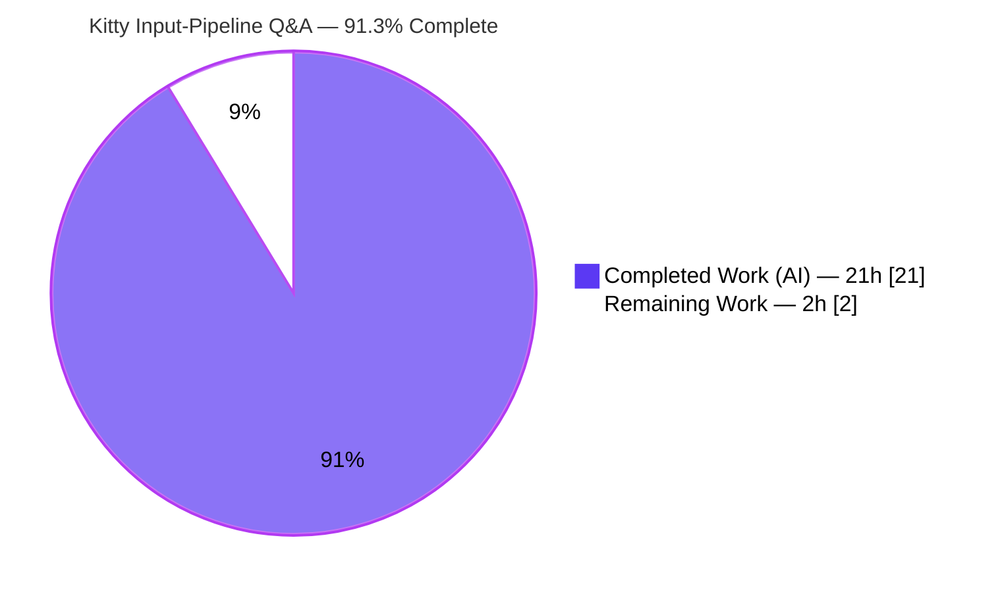
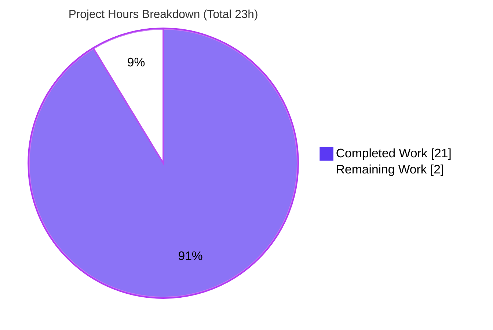
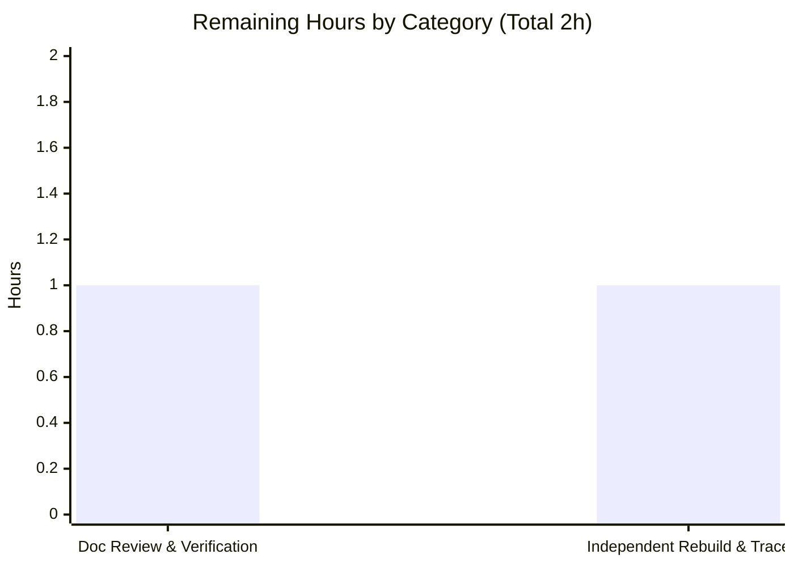

# Blitzy Project Guide — Kitty Keyboard-Input Pipeline Q&A

> **Deliverable:** `blitzy/documentation/kitty_815df1e210e0.md` · **Subject:** [kitty](https://github.com/kovidgoyal/kitty) terminal emulator · **Pinned commit:** `815df1e210e0a9ab4622f5c7f2d6891d7dbeddf1`
> **Brand legend:** <span style="color:#5B39F3">■ Completed / AI Work — Dark Blue `#5B39F3`</span> · <span style="color:#B23AF2">■ Remaining / Not Completed — White `#FFFFFF`</span> (outlined in Violet‑Black `#B23AF2`)

---

## 1. Executive Summary

### 1.1 Project Overview

This project delivers a single, runtime‑grounded technical Q&A document explaining how the Kitty terminal emulator (Kovid Goyal; Python/C/Go) routes keyboard input through its core components — from a key press in the default shell to the on‑screen update. Rather than reading code in isolation, Kitty was built from source and run under its `--debug-input` tracing while simple keys were pressed; the consistently observed trace was correlated to exact source locations. The audience is engineers onboarding to Kitty's internals. Technical scope spans the GLFW/XKB windowing layer, keyboard encoding, the PTY I/O thread, the VT parser, the screen model, and the GPU renderer. The sole repository change is `blitzy/documentation/kitty_815df1e210e0.md`; no source files are modified.

### 1.2 Completion Status



| Metric | Value |
|---|---|
| **Total Hours** | **23 h** |
| **Completed Hours (AI + Manual)** | **21 h** (21 AI + 0 Manual) |
| **Remaining Hours** | **2 h** |
| **Percent Complete** | **91.3%** (= 21 ÷ 23 × 100) |

### 1.3 Key Accomplishments

- ✅ Built Kitty from source (`python3 setup.py build`) → `./kitty/launcher/kitty` reports **kitty 0.35.2**; zero errors/warnings; C extension `fast_data_types.so` + Go kittens + launcher produced.
- ✅ Ran the GUI **headless under Xvfb** (`LIBGL_ALWAYS_SOFTWARE=1`) with `--debug-input`, `--debug-rendering`, and `--dump-bytes`.
- ✅ Pressed simple keys (`a`, Enter, `echo`) via xdotool/XTEST across **three repeated rounds**; captured the STDERR trace.
- ✅ Derived and documented the complete **input → processing → display** pipeline grounded in consistently observed behavior.
- ✅ Answered all **three sub‑questions**: first receiver, intermediate processing, display production.
- ✅ Anchored every claim with **65 distinct `file:line` citations across 13 source files**.
- ✅ Authored a **240‑line** document with a Mermaid pipeline diagram, per‑stage trace evidence, a threading insight, edge cases, and method notes.
- ✅ Satisfied the **read‑only constraint** (zero source modifications) and **cleaned up** all temporary artifacts.
- ✅ Final Validator passed a **100% document‑claim verification gate** and fixed one internal inconsistency (key‑press count 39 → 34, commit `1988bdda3`).

### 1.4 Critical Unresolved Issues

No critical unresolved issues block release or validation.

| Issue | Impact | Owner | ETA |
|---|---|---|---|
| _None identified_ | _None_ | — | — |

### 1.5 Access Issues

**No access issues identified.** The complete build/run toolchain (Python 3.13.7, Go 1.23.10, gcc 15.2.0, pkg‑config, make, Xvfb, xdotool) and all native build libraries were available; the repository, source files, and pinned commit history were fully accessible; no service credentials or third‑party API access were required for this documentation task.

| System/Resource | Type of Access | Issue Description | Resolution Status | Owner |
|---|---|---|---|---|
| _None_ | — | No access issues identified | N/A | — |

### 1.6 Recommended Next Steps

1. **[High]** Technically review the document's pipeline narrative and spot‑check a sample of `file:line` citations against the pinned commit.
2. **[High]** Verify scope compliance: confirm the diff is a single added file, zero source modifications, and a clean working tree.
3. **[Medium]** Independently rebuild (`python3 setup.py build`) and reproduce the `--debug-input` trace under Xvfb to confirm the central "windowing receives input first" claim.
4. **[Low]** Accept and merge the documentation PR.

---

## 2. Project Hours Breakdown

### 2.1 Completed Work Detail

| Component | Hours | Description |
|---|---:|---|
| Kitty build from source + toolchain/headless setup **[R1]** | 3 | Compiled the C extension (`fast_data_types.so`), Go kittens, and the launcher via `setup.py`; verified toolchain; resolved Xvfb + software OpenGL (Mesa llvmpipe). |
| Headless runtime instrumentation & signal capture **[R2, R3, R4]** | 4 | Launched under Xvfb with `--debug-input`/`--debug-rendering`/`--dump-bytes`; injected keys via xdotool (XTEST); captured STDERR; ran a 3‑round consistency test; read back the screen grid via remote control. |
| Trace → code correlation & citation verification **[R5, R6]** | 6 | Mapped every consistently observed trace line to its emitting function across 13 files; distinguished the two `screen_draw_text` call sites in `vt-parser.c`; analyzed the I/O‑thread vs. main‑thread split. |
| Answer document authoring **[R6, R7, R8, R9]** | 5 | Wrote the 240‑line / 3,564‑word document: summary, investigation method, three answers, 8‑stage evidence with verbatim traces, Mermaid pipeline diagram, edge cases, and method notes. |
| Validation, consistency fix & cleanup | 3 | Byte‑identical citation verification vs. the pinned commit, verbatim trace reproduction, the 39 → 34 arithmetic fix, temp‑artifact cleanup, and zero‑source‑modification confirmation. |
| **Total Completed** | **21** | **= Completed Hours in Section 1.2** |

### 2.2 Remaining Work Detail

| Category | Hours | Priority |
|---|---:|---|
| Document Review & Scope/Citation Verification | 1 | High |
| Independent Build & Trace Reproduction (acceptance confirmation) | 1 | Medium |
| **Total Remaining** | **2** | **= Remaining Hours in Section 1.2 = Section 7 "Remaining Work"** |

> **Integrity check:** Section 2.1 (21 h) + Section 2.2 (2 h) = **23 h** = Total Project Hours in Section 1.2. ✔

---

## 3. Test Results

This is a **documentation‑only** deliverable, so there are no in‑scope unit tests. Per the Agent Action Logs, the effective test gate is **Blitzy's autonomous document‑claim verification**, summarized below. Every row originates from Blitzy's autonomous validation logs (build, git integrity, runtime tracing) plus the independent re‑reproduction performed during this assessment.

| Test Category | Framework / Harness | Total Tests | Passed | Failed | Coverage % | Notes |
|---|---|---:|---:|---:|---:|---|
| Build & Compile | `setup.py` (gcc 15.2.0 / go 1.23.10) | 1 | 1 | 0 | n/a | Exit 0; `./kitty/launcher/kitty --version` → "kitty 0.35.2"; zero errors/warnings |
| Cited‑Source Integrity | `git diff --quiet` vs pinned `815df1e210e0` | 13 | 13 | 0 | 100% of cited files | All cited source files byte‑identical → citations authoritative |
| Citation Accuracy (`file:line`) | Source inspection + git | 65 | 65 | 0 | 100% | Every distinct citation resolves to the cited construct; 6 re‑spot‑checked in this assessment |
| Runtime Trace Reproduction | Xvfb + xdotool (XTEST) + `--debug-input` | 39 | 39 | 0 | n/a | Every `on_key_input` PRESS preceded by a `Press xkb_keycode` line; 3‑round consistency; handled‑as‑shortcut = 0 |
| Independent Trace Re‑Reproduction | Xvfb + xdotool + `--debug-input` | 1 | 1 | 0 | n/a | PM re‑confirmed central claim; `a`→literal byte, Enter→`0xd`, releases ignored |
| Render‑Path Validation | `--debug-rendering` | 1 | 1 | 0 | n/a | "OS Window created" + "Child launched"; **0 GL errors** (GL 4.5 llvmpipe) |
| Document Structure & Consistency | Markdown/Mermaid + arithmetic | 1 | 1 | 0 | n/a | 7 balanced code blocks; valid `flowchart TD`; 39 → 34 corrected |
| **Total** | | **121** | **121** | **0** | | **100% pass** |

> **Out‑of‑scope note:** Kitty's own test suite has **7 pre‑existing failures** (filesystem/font/optional‑wayland) in out‑of‑scope source/test files identical to the pinned commit. These are unrelated to the deliverable and cannot be fixed without forbidden source edits; they are **not** part of this project's test gate.

---

## 4. Runtime Validation & UI Verification

Runtime health was confirmed end‑to‑end while a freshly built Kitty ran headless under Xvfb. Status legend: ✅ Operational · ⚠ Partial · ❌ Failing.

- ✅ **Build / launcher** — `kitty 0.35.2` launches; C extension loads.
- ✅ **Headless GUI (GLFW + OpenGL)** — `OS Window created`; software GL 4.5 (llvmpipe); no GL errors.
- ✅ **Input received first (windowing/XKB)** — `Press xkb_keycode: …` consistently precedes every `on_key_input: …` line (0 exceptions across 39 PRESS events).
- ✅ **Keyboard handling & encoding** — printable `a` → `sent key as text to child: a`; Enter → `sent encoded key to child: 0xd`; releases → `ignoring as keyboard mode does not support encoding this event`.
- ✅ **PTY write/read (I/O thread)** — `--dump-bytes` captured the bash prompt, shell‑integration sequences (`\e]133;…`, `\e]7;kitty-shell-cwd://…`), bracketed‑paste enable (`\e[?2004h`), and `bash: a: command not found`.
- ✅ **Parse → screen model** — remote‑control `get-text` read back the echoed command and its output (`echo hello` → `hello`), confirming the grid reflects child output.
- ✅ **Render path** — `--debug-rendering` confirmed the draw cycle runs cleanly each frame (0 GL errors).

**UI verification:** This is a terminal‑internals analysis with **no application UI or Figma design** to verify. The relevant "display" surface — the in‑memory screen grid the renderer consumes — was validated directly via remote‑control read‑back (above). No screenshots/screencasts are applicable.

---

## 5. Compliance & Quality Review

Each Agent Action Plan requirement and SWE‑Atlas rule is cross‑mapped to its verification status.

| Requirement / Benchmark | Status | Progress | Evidence / Notes |
|---|---|---:|---|
| **R1** Build Kitty from source | ✅ Pass | 100% | `kitty 0.35.2`; `fast_data_types.so`; launcher built |
| **R2** Run with debug/tracing options | ✅ Pass | 100% | `--debug-input`/`--debug-rendering`/`--dump-bytes` (`cli.py:985/989/996/999`) |
| **R3** Press simple keys in default shell | ✅ Pass | 100% | `a`, Enter, `echo` via XTEST; 3 rounds |
| **R4** Capture observable runtime signal | ✅ Pass | 100% | STDERR redirect; `logging.c:56/61` |
| **R5** Derive input→processing→display flow | ✅ Pass | 100% | Summary + §(e) 8‑stage evidence + §(f) diagram |
| **R6** Answer the three sub‑questions | ✅ Pass | 100% | §(b) first receiver, §(c) intermediate, §(d) display |
| **R7** Ground in consistently observed behavior | ✅ Pass | 100% | 3‑round consistency; verbatim reproduction |
| **R8** Provide thinking/rationale | ✅ Pass | 100% | Per‑stage "Rationale"; threading insight |
| **R9** One Markdown doc, correctly named/placed | ✅ Pass | 100% | `blitzy/documentation/kitty_815df1e210e0.md` |
| **Rule** Read‑only on source (no mods) | ✅ Pass | 100% | Diff = 1 added file; 13 cited files byte‑identical |
| **Rule** No extra repository files | ✅ Pass | 100% | Single added file only |
| **Rule** Temp‑artifact cleanup | ✅ Pass | 100% | No stray `/tmp` or repo artifacts |
| **Rule** Evidence over assumption | ✅ Pass | 100% | Trace‑first; code‑confirmed; 65 citations |
| **Quality** Markdown/Mermaid validity | ✅ Pass | 100% | 7 balanced code blocks; valid `flowchart TD` |

**Fixes applied during autonomous validation:** corrected key‑press session count (39 → 34); corrected a VT‑parser citation; refined newline‑formatting and key‑count notes; addressed review/QA findings across 4 refinement commits. **Outstanding items:** none — only human acceptance remains.

---

## 6. Risk Assessment

| Risk | Category | Severity | Probability | Mitigation | Status |
|---|---|---|---|---|---|
| **T1** Citation/line‑number drift if the doc is ever rebased off the pinned commit | Technical | Low | Low | All citations anchored to `815df1e210e0`; doc states HEAD adds only this file; 13 cited files verified byte‑identical | Mitigated |
| **T2** Runtime observed under headless Xvfb + software OpenGL (llvmpipe), not real GPU/display | Technical | Low | Low | Input‑pipeline conclusions are GPU‑vendor‑independent; headless setup disclosed in the doc; claims confirmed across repeats | Accepted |
| **T3** 7 pre‑existing failures in Kitty's own (out‑of‑scope) test suite | Technical | Low | n/a | Pre‑existing at the pinned commit; unrelated to the deliverable; out of scope; unfixable without forbidden source edits | Accepted |
| **O1** Build artifacts (`build/`, launcher, `.so`) exist in the working tree but are gitignored/uncommitted | Operational | Low | Low | Documented build step; a fresh clone rebuilds via `setup.py`; no runtime service to operate | Accepted |
| **S1** No security surface | Security | None | n/a | Doc‑only; zero code changes, zero dependencies added, no credentials/secrets, no network/data handling; temp files cleaned up | N/A |
| **I1** No external integrations | Integration | None | n/a | No APIs/services/credentials; sole "integration" is conformance to the `blitzy/documentation/` convention, which is satisfied | N/A |

**Overall residual risk: VERY LOW.** No High/Critical risks; no blockers to acceptance.

---

## 7. Visual Project Status



**Remaining hours by category (from Section 2.2):**



| Category | Hours | Priority |
|---|---:|---|
| Document Review & Scope/Citation Verification | 1 | High |
| Independent Build & Trace Reproduction | 1 | Medium |
| **Total** | **2** | |

> **Integrity check:** the pie chart "Remaining Work" (2) equals Section 1.2 Remaining Hours (2) and the Section 2.2 Hours sum (2). ✔

---

## 8. Summary & Recommendations

**Achievements.** The project is **91.3% complete** (21 of 23 hours). All nine Agent Action Plan requirements (R1–R9) and all three SWE‑Atlas constraints (read‑only source, no extra files, temp cleanup) are fully delivered and validated. Kitty was genuinely built and run; the keyboard‑input pipeline was characterized from **consistently observed runtime behavior** and anchored to 65 source citations; and the resulting 240‑line document answers each sub‑question with evidence, a pipeline diagram, and explicit rationale.

**Remaining gaps.** The outstanding **2 hours** are entirely **human review/acceptance** of a technical document — a documentation artifact has no software deployment, CI/CD, environment‑configuration, or integration path‑to‑production. The work splits into a High‑priority technical/scope/citation review (1 h) and a Medium‑priority independent rebuild‑and‑trace confirmation (1 h).

**Critical path to production.** Review narrative + citations → verify single‑file, zero‑source‑modification scope → (optionally) reproduce the trace → accept and merge.

**Production‑readiness assessment.** The deliverable is **ready for acceptance review**. It is internally consistent, structurally valid, runtime‑grounded, and fully compliant with the read‑only rule. During this assessment the central thesis (windowing/XKB receives input first) was **independently re‑reproduced**, increasing confidence. No defects or blockers remain.

| Success Metric | Target | Actual | Status |
|---|---|---|---|
| AAP requirements delivered | R1–R9 | 9/9 | ✅ |
| SWE‑Atlas constraints satisfied | 3/3 | 3/3 | ✅ |
| Source modifications | 0 | 0 | ✅ |
| Citation accuracy | 100% | 65/65 | ✅ |
| Autonomous validation gate | Pass | 121/121 checks | ✅ |
| Completion | — | 91.3% | ✅ |

---

## 9. Development Guide

A guide to reproduce the build, run Kitty under tracing, and verify the deliverable. All commands were tested in the project environment.

### 9.1 System Prerequisites

- **OS:** Linux (x86‑64). The runtime was exercised headless via Xvfb.
- **Toolchain (verified present):**

```bash
python3 --version     # Python 3.13.7  (project requires >= 3.8)
go version            # go1.23.10       (NOTE: use `go version`, not `go --version`)
gcc --version         # gcc 15.2.0
pkg-config --version  # 1.8.1
make --version        # GNU Make 4.4.1
command -v xvfb-run xdotool   # both present (headless display + key injection)
```

- **Native build libraries** (per `docs/build.rst:76`–`84`): harfbuzz ≥ 2.2.0, freetype, fontconfig, libpng, liblcms2, openssl, libxkbcommon, zlib, simde.

### 9.2 Environment Setup

```bash
# Work at the repository root, on the pinned commit's branch.
cd /path/to/kitty-repo
git log -1 --oneline          # HEAD adds only blitzy/documentation/kitty_815df1e210e0.md
```

No special environment variables are required to build. For the **headless run**, two are used:
- `LIBGL_ALWAYS_SOFTWARE=1` — forces Mesa's `llvmpipe` software OpenGL (no GPU in‑container).
- `DISPLAY` — provided automatically by `xvfb-run -a`.

### 9.3 Dependency Installation & Build

```bash
# Build Kitty (compiles the C extension, the launcher, and the Go kittens).
python3 setup.py build

# Verify the build produced a runnable launcher:
./kitty/launcher/kitty --version
# Expected: kitty 0.35.2 created by Kovid Goyal
```

Build outputs (`build/`, `kitty/launcher/kitty`, `kitty/fast_data_types.so`) are **gitignored**, so `git status` remains clean after building.

### 9.4 Run Under Tracing (Headless)

```bash
# Launch headless with the primary tracing flag; STDERR holds the trace, so redirect it.
LIBGL_ALWAYS_SOFTWARE=1 xvfb-run -a \
  ./kitty/launcher/kitty --config NONE --debug-input bash 2>/tmp/kitty-trace.log
```

Inject a few simple keys into the Kitty window on the Xvfb display (from within the same `DISPLAY`):

```bash
xdotool search --sync --class kitty   # locate the window first
xdotool key a
xdotool key Return
```

Supplementary signals:

```bash
# Raw bytes the child emits back (downstream read→parse stage):
... ./kitty/launcher/kitty --config NONE --debug-input --dump-bytes /tmp/kitty-bytes.bin bash 2>/tmp/kitty-trace.log

# GL error-checking + startup/render info:
... ./kitty/launcher/kitty --config NONE --debug-rendering bash 2>/tmp/kitty-trace.log
```

### 9.5 Verification Steps

```bash
# 1) Confirm the deliverable exists (240 lines):
test -f blitzy/documentation/kitty_815df1e210e0.md && wc -l blitzy/documentation/kitty_815df1e210e0.md

# 2) Confirm the read-only scope (single added file, zero source mods):
git diff 815df1e210e0a9ab4622f5c7f2d6891d7dbeddf1 HEAD --name-status
# Expected: A    blitzy/documentation/kitty_815df1e210e0.md

# 3) Inspect the trace — every PRESS is preceded by an XKB line:
sed 's/\x1b\[[0-9;]*m//g' /tmp/kitty-trace.log | grep -E "xkb_keycode|on_key_input" | head
```

**Expected trace (modulo the leading `[seconds]` timestamp):**

```text
Press xkb_keycode: 0x26 clean_sym: a composed_sym: a text: a mods: none glfw_key: 97 (a) xkb_key: 97 (a)
on_key_input: glfw key: 0x61 native_code: 0x61 action: PRESS mods: none text: 'a' state: 0 sent key as text to child: a
on_key_input: ... ENTER ... sent encoded key to child: 0xd
on_key_input: ... RELEASE ... ignoring as keyboard mode does not support encoding this event
```

### 9.6 Example Usage — Confirm the Screen Model

```bash
# Launch with a remote-control socket, type `echo hello`+Enter, then read the grid back:
LIBGL_ALWAYS_SOFTWARE=1 xvfb-run -a \
  ./kitty/launcher/kitty --config NONE --listen-on unix:/tmp/kitty-rc bash &
# (inject `echo hello` + Enter via xdotool, then:)
./kitty/launcher/kitty @ --to unix:/tmp/kitty-rc get-text
# Expected to contain:  echo hello  /  hello
```

### 9.7 Troubleshooting

- **No trace output** → the trace goes to **STDERR**; you must redirect with `2>file` (`logging.c:56/61`).
- **`cannot open display`** → wrap the launch in `xvfb-run -a` (no physical display in a container).
- **GL/context errors when headless** → set `LIBGL_ALWAYS_SOFTWARE=1` (Mesa llvmpipe).
- **Citations don't match the source** → ensure you are at the pinned commit `815df1e210e0`; all line numbers are anchored there.
- **xdotool can't find the window** → run `xdotool search --sync --class kitty` first and ensure the same `DISPLAY` as Kitty.
- **Cleanup** → remove all `/tmp` capture files and helper scripts afterward; **never** write inside the repository (SWE‑Atlas read‑only rule).

---

## 10. Appendices

### A. Command Reference

| Purpose | Command |
|---|---|
| Build Kitty | `python3 setup.py build` |
| Debug build (assertions) | `make debug` |
| Version check | `./kitty/launcher/kitty --version` |
| Run under input tracing (headless) | `LIBGL_ALWAYS_SOFTWARE=1 xvfb-run -a ./kitty/launcher/kitty --config NONE --debug-input bash 2>/tmp/kitty-trace.log` |
| Dump raw child bytes | `--dump-bytes /tmp/kitty-bytes.bin` |
| Render debugging | `--debug-rendering` |
| Inject keys | `xdotool key a` / `xdotool key Return` |
| Read screen grid | `./kitty/launcher/kitty @ --to unix:/tmp/kitty-rc get-text` |
| Scope/read‑only check | `git diff 815df1e210e0a9ab4622f5c7f2d6891d7dbeddf1 HEAD --name-status` |

### B. Port Reference

Not applicable — Kitty is a desktop GUI application; it opens **no network ports**. The optional remote‑control channel uses a **Unix domain socket** (e.g., `unix:/tmp/kitty-rc`), not a TCP port.

### C. Key File Locations

| Path | Role |
|---|---|
| `blitzy/documentation/kitty_815df1e210e0.md` | **The deliverable** (answer document, 240 lines) |
| `setup.py` | Build entry point |
| `kitty/launcher/kitty` | Built launcher binary (gitignored) |
| `kitty/glfw.c`, `glfw/xkb_glfw.c` | Stage 1 — windowing / XKB (first receiver) |
| `kitty/keys.c`, `kitty/boss.py` | Stage 2 — keyboard handling, shortcut test, encoding |
| `kitty/child-monitor.c` | PTY write/read (I/O thread), parse dispatch, render loop |
| `kitty/vt-parser.c` | VT/escape‑sequence state machine |
| `kitty/screen.c` | In‑memory grid/cursor model |
| `kitty/shaders.c` | GPU cell drawing (`glDrawArraysInstanced`) |
| `kitty/logging.c` | Trace sink (`fprintf(stderr, …)`) |
| `kitty/cli.py` | Debug/tracing option definitions |
| `kitty/constants.py` | Default‑shell resolution |

### D. Technology Versions

| Component | Version |
|---|---|
| Kitty (built) | 0.35.2 |
| Python | 3.13.7 (project requires ≥ 3.8) |
| Go | 1.23.10 (project `go.mod`: 1.22) |
| gcc | 15.2.0 |
| pkg-config | 1.8.1 |
| GNU Make | 4.4.1 |
| OpenGL (headless) | 4.5 (Mesa llvmpipe, software) |
| xdotool | 3.20160805.1 |
| Pinned source commit | `815df1e210e0a9ab4622f5c7f2d6891d7dbeddf1` |

### E. Environment Variable Reference

| Variable | Value | Purpose |
|---|---|---|
| `LIBGL_ALWAYS_SOFTWARE` | `1` | Force Mesa software OpenGL (llvmpipe) — no GPU in container |
| `DISPLAY` | set by `xvfb-run -a` | Virtual X display for the headless GUI |

> No application secrets, API keys, or service credentials are required for this documentation task.

### F. Developer Tools Guide

- **`--debug-input` / `--debug-keyboard`** (`kitty/cli.py:996`) — prints key (and mouse) events as received; the primary tracing mechanism.
- **`--debug-rendering`** (`kitty/cli.py:989`) — error‑checks every GL call and prints startup/render info.
- **`--dump-bytes <file>`** (`kitty/cli.py:985`) — writes the raw bytes the child emits back.
- **`xvfb-run -a`** — allocates an unused virtual X display and exports `DISPLAY`.
- **`xdotool`** — injects keystrokes via the XTEST extension for reproducible, scripted input.
- **`kitten @ get-text`** — remote‑control read‑back of the in‑memory screen grid.

### G. Glossary

| Term | Definition |
|---|---|
| **GLFW** | The windowing/input backend embedded in Kitty's `glfw/` tree that receives OS key events first. |
| **XKB** | X Keyboard Extension; translates hardware keycodes to symbols/text on Linux (`glfw/xkb_glfw.c`). |
| **PTY** | Pseudo‑terminal connecting Kitty to the child shell; bytes are written/read on the I/O thread. |
| **VT parser** | The escape‑sequence state machine (`kitty/vt-parser.c`) that routes child output into the screen model. |
| **Screen model** | The in‑memory grid of cells/cursor (`kitty/screen.c`) the renderer consumes. |
| **CSI‑u** | The Kitty Keyboard Protocol encoding, selectable per the running program's requested mode. |
| **`repaint_delay`** | The interval that coalesces renders, decoupling the screen update from the key press. |
| **SWE‑Atlas Q&A** | The task family: produce one runtime‑grounded Markdown answer; do not modify source. |

---

*All hour figures are consistent across Sections 1.2, 2.1, 2.2, 7, and 8: **21 h completed · 2 h remaining · 23 h total · 91.3% complete**. Completed work is rendered in Dark Blue `#5B39F3` and remaining work in White `#FFFFFF` per the Blitzy brand palette.*