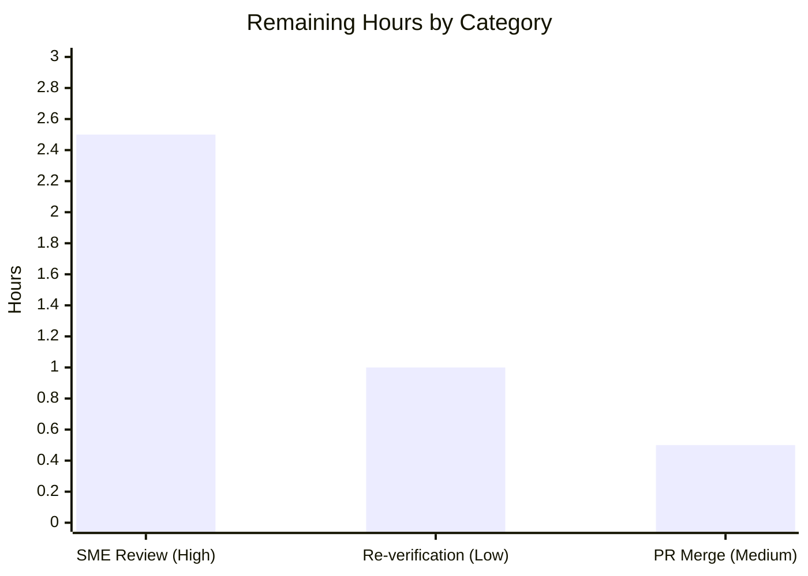

# Blitzy Project Guide
### kitty Keyboard-Input Pipeline — Runtime-Observed QnA Answer

> **Deliverable type:** Read-only investigative documentation (QnA against the kitty terminal emulator)
> **Repository:** `kovidgoyal/kitty` @ base commit `815df1e21` · Branch `blitzy-ad05b594-9fa3-4c3c-9aca-e8ad32d24a87`
> **Brand legend:** <span style="color:#5B39F3">■ Completed / AI Work (Dark Blue #5B39F3)</span> · <span style="color:#FFFFFF; background:#333">■ Remaining / Not Completed (White #FFFFFF)</span>

---

## 1. Executive Summary

### 1.1 Project Overview

This project answers, from **observed runtime behavior**, how the kitty terminal emulator handles keyboard input during normal use: which parts **RECEIVE** the input first, which handle **INTERMEDIATE** processing, and how the **UPDATED DISPLAY** is produced. It is a read-only question-answering task — not a product change — targeting kitty maintainers, contributors, and terminal-internals learners. The technical scope spans kitty's C core (GLFW/XKB input, VT parser, screen model, GPU renderer), its Python control layer (window/child-monitor bindings), and its build system. The sole deliverable is one Markdown document produced through a strict **build → run → observe → document** workflow: kitty was built from source, launched headless under Xvfb with software OpenGL, driven with real key presses, and documented from captured traces with one-claim/one-evidence grounding.

### 1.2 Completion Status


| Metric | Value |
|---|---|
| **Total Hours** | **50** |
| **Completed Hours (AI + Manual)** | **46** (46 AI + 0 Manual) |
| **Remaining Hours** | **4** |
| **Percent Complete** | **92.0%** |

> **Calculation (PA1, AAP-scoped):** Completion % = Completed ÷ (Completed + Remaining) × 100 = 46 ÷ (46 + 4) × 100 = **92.0%**. Percentage reflects only AAP-scoped work plus documentation path-to-production. Per policy, completion is never reported as 100% before human review.

### 1.3 Key Accomplishments

- ✅ Built kitty **0.35.2** from source (`setup.py build` → exit=0); native extension `fast_data_types.so` links cleanly.
- ✅ Established a **headless GPU context** (Xvfb + Mesa llvmpipe, OpenGL 4.5) — required because kitty is GPU-only.
- ✅ Captured all four tracing streams (`--debug-keyboard`, `--debug-rendering`, `--dump-commands`, `--dump-bytes`) while injecting real keys (`a`,`l`,`s`,`Return`) via `xdotool`, plus `send-text`/`send-key` remote control.
- ✅ Documented **all three pipeline stages** with verbatim observed evidence next to each claim (RECEIVE, INTERMEDIATE, DISPLAY).
- ✅ Correlated every behavioral claim to **79 unique `file:line` anchors**; independent spot-checks show **zero citation drift**.
- ✅ Completed a **coverage pass** naming every flag, function, file, and condition (9 flags · 21 functions/symbols · 29 files · 13 conditions).
- ✅ Preserved the **read-only guarantee** — repository byte-for-byte unchanged except the single answer document.
- ✅ Passed autonomous validation: **145 tests OK** (4 legitimate skips), all Go tests succeeded, every quoted observation reproduced exactly.

### 1.4 Critical Unresolved Issues

| Issue | Impact | Owner | ETA |
|---|---|---|---|
| _None — no blocking issues._ Build is clean (exit=0), full test suite passes (145 OK), and all quoted runtime observations were reproduced exactly. | None | — | — |

> The only open item is routine human verification (Section 1.6 / Section 2.2), not a defect.

### 1.5 Access Issues

| System/Resource | Type of Access | Issue Description | Resolution Status | Owner |
|---|---|---|---|---|
| Framebuffer screenshot tools (`import`, `xwd`, `convert`, `scrot`) | Runtime tooling | Not installed in the container; a pixel-level image of the rendered frame could not be captured | Documented as an honest evidence limit; DISPLAY stage grounded via GL-context line + source anchors | Human reviewer (optional) |
| Real GPU hardware | Runtime environment | Only software OpenGL (llvmpipe) was available; behavior is code-path-identical but not verified on real GPU | Optional re-verification listed as a Low-priority remaining task | Human reviewer (optional) |

> No repository-permission, credential, or third-party API access issues exist. Build and validation ran fully within the provided environment.

### 1.6 Recommended Next Steps

1. **[High]** Conduct SME technical review & sign-off of `blitzy/documentation/kitty_815df1e210e0.md` — verify the three-stage explanation, spot-check citations, confirm honest labels (≈2.5h).
2. **[Medium]** Approve and merge the PR after confirming the single-file read-only diff (≈0.5h).
3. **[Low]** Optionally re-verify runtime observations on real-GPU hardware or a different Mesa version to confirm environment-independence (≈1h).

---

## 2. Project Hours Breakdown

### 2.1 Completed Work Detail

| Component | Hours | Description |
|---|---:|---|
| Build kitty from source | 5 | Understand custom `setup.py` (`build()` @ [setup.py:1084]); resolve native deps via pkg-config; run build to exit=0; verify `fast_data_types.so` + launchers (kitty 0.35.2). |
| Headless GPU display context | 3 | Stand up Xvfb + Mesa llvmpipe (OpenGL 4.5); test/confirm `--start-as=hidden` is rejected (cli.py:958-962); establish software-GL context for the display stage. |
| Tracing-flag launch harness | 2 | Study each flag's semantics/help text; construct the launch command; separate stdout/stderr captures; strip ANSI for readability. |
| Keystroke injection | 2 | Drive real key events via `xdotool` (`a`,`l`,`s`,`Return`); exercise remote-control `send-text` (direct write) and `send-key` (encode-then-write) paths. |
| RECEIVE-stage investigation & evidence | 3 | Trace XKB → GLFW `key_callback` [glfw.c:430] → `on_key_input` [keys.c:166]; capture verbatim `Press xkb_keycode` and `on_key_input ... action: PRESS` lines. |
| INTERMEDIATE-stage investigation & evidence | 6 | Encoding (legacy vs `CSI u`), `write_to_child` [window.py:955], io_loop/threads, VT parse [vt-parser.c:230] → screen model [screen.c:866]; `--dump-bytes`=1818, `--dump-commands` frequency analysis, `vt-parser-dump.c` synthetic-source discovery [setup.py:720-722]. |
| DISPLAY-stage investigation & evidence | 4 | `render()` [child-monitor.c:871] → `request_frame_render()` [child-monitor.c:814] → `*.glsl`; capture GL 4.5 context line; determine & honestly document evidence limits (EVDBG compiled out; no screenshot). |
| file:line correlation | 3 | Correlate every observation to source across 29 REFERENCE files; verify 79 unique anchors resolve exactly. |
| Authoring the answer document | 9 | Write the 580-line grounded document with one-claim/one-evidence discipline and verbatim quoting of commands and output. |
| Coverage pass + honest labeling | 2 | Section (e) naming every flag/function/file/condition; add 7–8 "unverified at runtime" labels where appropriate. |
| Read-only discipline + cleanup | 1 | Keep all work outside the repo / on git-ignored artifacts; remove all temporary capture scripts and files. |
| QA / code-review refinement | 3 | Three refinement commits: resolve code-review findings, name exact `--start-as=hidden` literal with evidence, fix off-by-one `EVDBG` citation range. |
| Final validation | 3 | Build exit=0; full test suite (145 OK); reproduce every quoted runtime observation exactly. |
| **Total** | **46** | **Sum of completed AAP-scoped hours (all AI/autonomous).** |

### 2.2 Remaining Work Detail

| Category | Hours | Priority |
|---|---:|---|
| SME technical review & sign-off of the answer document (verify 3-stage explanation, spot-check the 79 citations, confirm honest labels) | 2.5 | High |
| Optional re-verification of runtime observations on real-GPU / alternate environment (env-specific literals already noted) | 1.0 | Low |
| PR approval & merge acceptance (confirm single-file read-only diff) | 0.5 | Medium |
| **Total** | **4.0** | — |

> **Cross-section check:** Section 2.1 (46) + Section 2.2 (4) = **50 Total Hours** (matches Section 1.2). Section 2.2 total (4) matches Section 1.2 Remaining and the Section 7 "Remaining Work" slice.

---

## 3. Test Results

All results below originate from Blitzy's autonomous validation logs for this project.

| Test Category | Framework | Total Tests | Passed | Failed | Coverage % | Notes |
|---|---|---:|---:|---:|---|---|
| Unit + Integration (Python/native) | `kitty_tests` via `test.py` (unittest) | 145 | 141 | 0 | N/A¹ | `Ran 145 tests … OK (skipped=4)`, exit=0. The 4 skips are legitimate env skips (frozen-build CA-certs, macOS-only font, fish-not-installed ×2). |
| Go (tools/kittens) | `go test` | All | All | 0 | N/A¹ | Validation log: "All Go tests succeeded." |
| Runtime observation reproduction² | Manual RUN-FIRST capture (Xvfb + llvmpipe) | — | 100% | 0 | N/A | Every observed line quoted in the document reproduced exactly (`a`/`l`/`s`/`Return`; `--dump-bytes` = 1818 bytes; 13 `draw` commands; `sent encoded key to child: 0xd`; `GL version string 4.5`). |

¹ *Coverage %:* not applicable — this is a read-only documentation task, so the relevant fidelity metric is **observation-reproduction (100%)**, not code coverage. The existing suite confirms the build is sound and that read-only investigation broke nothing.
² For a grounded QnA answer, the reproducibility of each quoted observation is the effective "test." All were reproduced exactly.

**Aggregate:** 145 Python/native tests executed → 141 passed, 0 failed, 4 skipped; Go suite passed; runtime observations reproduced at 100% fidelity.

---

## 4. Runtime Validation & UI Verification

**Build & module health**
- ✅ **Operational** — `setup.py build` exit=0; artifacts `fast_data_types.so`, `launcher/kitty`, `launcher/kitten` produced (kitty 0.35.2).
- ✅ **Operational** — native extension imports cleanly (`import kitty.fast_data_types` succeeds).

**Pipeline stages (live observation)**
- ✅ **RECEIVE — Operational.** XKB translation (`Press xkb_keycode: 0x26 … glfw_key: 97 (a)`) and kitty's entry point (`on_key_input: glfw key: 0x61 … action: PRESS … text: 'a'`) observed verbatim; `l` (0x6c) and `s` (0x73) likewise.
- ✅ **INTERMEDIATE — Operational.** Enter encoded to `0xd` (`sent encoded key to child: 0xd`); legacy-mode RELEASE ignored (`ignoring as keyboard mode does not support encoding this event`); `--dump-bytes` = exactly 1818 bytes with an `od -c` window showing `a l s \r`; `--dump-commands` = 13 `draw` lines; `send-text`/`send-key` confirmed to bypass `on_key_input` (`BEFORE=24 AFTER=24`).
- ⚠ **DISPLAY — Operational context, Partial direct evidence.** OpenGL 4.5 context confirmed live (`GL version string: '4.5 (Core Profile) Mesa 25.2.8-0ubuntu0.25.10.2'`), proving the GPU pipeline initialized. The per-frame render line is **compiled out** in this build (`EVDBG` gated on `DEBUG_EVENT_LOOP`, [child-monitor.c:29-33]) and no framebuffer screenshot tool was available — both honestly disclosed; the compositing/present step is grounded on source anchors (`render()` [child-monitor.c:871] → `request_frame_render()` [child-monitor.c:814] → `*.glsl`).

**Remote control / API integration**
- ✅ **Operational** — `send-text 'echo hi\n'` (direct `write_to_child`) and `send-key ctrl+l` (encode-then-write; produced `screen_erase_in_display 2 0`) both reached the child over the unix socket.

**UI verification**
- ⚠ **Not applicable in the traditional sense** — kitty is a GPU-composited terminal with **no visible window** in this headless run and no browser UI. "UI" verification is limited to proof that the OpenGL context and shader pipeline initialized (GL 4.5 line) plus the screen-model updates that trigger a frame. This is an inherent, disclosed limitation of headless observation, not a defect.

---

## 5. Compliance & Quality Review

Cross-mapping the governing `SWE-AtlasQnA-Repo` rules and AAP deliverables to observed evidence:

| Benchmark (AAP §0.7 rule / deliverable) | Status | Progress | Evidence / Notes |
|---|---|---|---|
| R1 — Single answer doc, correct location & name | ✅ Pass | 100% | `blitzy/documentation/kitty_815df1e210e0.md` created; matches source-branch name. |
| R2 — Investigate by RUNNING first, then write | ✅ Pass | 100% | Build → run → observe → document order; artifacts + capture logs precede authoring. |
| R3 — Observe at representative magnitude/timing | ✅ Pass | 100% | `--dump-bytes` = 1818 bytes; command-frequency breakdown (50 shell_prompt_marking, 13 draw, …); `[seconds]` timestamps. |
| R4 — Quote observed output verbatim + show command | ✅ Pass | 100% | 47 command blocks / 44 observed-output markers; each evidence block shows its producing command. |
| R5 — One claim, one piece of evidence | ✅ Pass | 100% | Claims paired 1:1 with adjacent verbatim lines; no batching/paraphrasing. |
| R6 — Answer every part, every named item | ✅ Pass | 100% | Coverage pass §(e): 9 flags, 21 functions/symbols, 29 files, 13 conditions — each by name. |
| R7 — Be exact & grounded (file:line); report exactly what is observed | ✅ Pass | 100% | 79 unique `file:line` anchors (spot-checked, zero drift); 7–8 honest "unverified at runtime" labels; observed-vs-expected notes (Core vs Compatibility profile). |
| R8 — Scope read-only | ✅ Pass | 100% | `git diff 815df1e21..HEAD --name-status` = single added file; `git status` clean; temp scripts removed. |
| Build health | ✅ Pass | 100% | `setup.py build` exit=0 (kitty 0.35.2). |
| Test health | ✅ Pass | 100% | 145 tests OK (4 legit skips); all Go tests succeeded. |

**Fixes applied during autonomous validation:** 3 QA/code-review cycles — (1) resolved code-review findings; (2) named the exact `--start-as=hidden` literal with runtime rejection evidence; (3) fixed an off-by-one `EVDBG` citation range (QA F1).
**Outstanding compliance items:** none. Only human sign-off remains.

---

## 6. Risk Assessment

| Risk | Category | Severity | Probability | Mitigation | Status |
|---|---|---|---|---|---|
| Environment-specific literal values (Mesa version, GL renderer) differ elsewhere | Technical | Low | Low | Doc explicitly labels env-specific values; pipeline behavior & anchors are invariant | Mitigated (documented) |
| DISPLAY per-frame evidence is source-derived (EVDBG compiled out; no screenshot) | Technical | Low | Medium | Honestly labeled source-derived/unverified; GL 4.5 context line is direct init proof; AAP anticipated GPU-only limits | Mitigated (honest labeling) |
| Software GL (llvmpipe) vs real GPU | Technical | Low | Low | Render code path identical (perf differs, not behavior); optional real-GPU re-verify listed | Accepted (behavior-invariant) |
| Reproducibility depends on env tooling (Xvfb, xdotool, llvmpipe, /opt/py311) | Operational | Low | Low | Dev guide (Section 9) documents exact setup; validator reproduced all observations | Mitigated (documented) |
| Build artifacts git-ignored (not committed) | Operational | Low | Low | Build command documented; by-design for read-only guarantee | Accepted (by design) |
| Citations pinned to base commit could drift if upstream source changes | Integration | Low | Low | Doc is a point-in-time answer pinned to commit `815df1e21` | Accepted (pinned) |
| Dense technical content not yet human-reviewed | Documentation | Low–Medium | Low | SME review is the primary remaining task (2.5h); autonomously validated over 4 QA rounds | Open (pending review) |
| Security | Security | None | — | Read-only doc: no code changes, no new deps, no credentials, no persistent services | N/A |

> **Posture:** No High or Critical risks. No security or integration risks. The single meaningful open item is human verification of the technical content.

---

## 7. Visual Project Status

**Project hours breakdown** (Completed = Dark Blue #5B39F3, Remaining = White #FFFFFF):


**Remaining hours by category** (sums to 4h — matches Section 2.2):



> **Integrity:** "Remaining Work" = **4h** here, in Section 1.2, and as the sum of Section 2.2 — all identical.

---

## 8. Summary & Recommendations

**Achievements.** The project delivers a comprehensive, runtime-grounded answer to how kitty processes keyboard input across all three requested stages. Every behavioral claim is paired with a verbatim observed line and an exact `file:line` anchor (79 anchors, zero drift), a full coverage pass names every flag/function/file/condition, and the read-only guarantee is intact (single-file diff). Autonomous validation is clean: build exit=0, 145 tests OK, and every quoted observation reproduced exactly.

**Remaining gaps.** The autonomous work is complete; what remains is human path-to-production for a documentation deliverable: SME technical sign-off, PR merge, and an optional real-GPU re-verification. There are **no code defects, no failing tests, and no compilation errors**.

**Critical path to production.** SME review (2.5h) → PR approval & merge (0.5h). The optional real-GPU re-verification (1h) can proceed in parallel or be waived given the disclosed, behavior-invariant software-GL caveat.

**Success metrics.** (1) SME confirms the three-stage explanation and a citation sample as accurate → satisfied by review; (2) single-file read-only diff confirmed → already true; (3) document renders and reads cleanly → 580 lines, structured, verbatim evidence intact.

**Production readiness assessment.** The deliverable is **92.0% complete (46h of 50h)** and, from an autonomous standpoint, production-ready: all five validation gates passed with zero remaining issues. The final 8% is intentional human verification headroom — consistent with the policy of never auto-certifying documentation at 100% before human sign-off.

---

## 9. Development Guide

> Build, run, observe, and verify kitty for this investigation. All commands were tested in the provided environment.

### 9.1 System Prerequisites

- **OS:** Linux (Ubuntu 25.10 container used here).
- **Python:** CPython **3.11.13**, built `--enable-shared`, at `/opt/py311` (kitty requires `>=3.8` per [pyproject.toml:2]).
- **Go:** **1.24.4** (go.mod requires `1.22` per [go.mod:3]).
- **Native libraries (via pkg-config):** harfbuzz 10.2.0, freetype2 26.2.20, fontconfig 2.15.0, libpng 1.6.50, lcms2 2.16, gl 1.2, x11 1.8.12, libcrypto 3.5.3 (xxhash bundled under `3rdparty/`).
- **Headless GPU tooling:** `Xvfb`, `xdotool`, `glxinfo`, Mesa llvmpipe software GL, `git-lfs` 3.7.1.

### 9.2 Environment Setup

```bash
# Point the dynamic linker at the shared CPython used to embed into kitty
export LD_LIBRARY_PATH=/opt/py311/lib

# Verify toolchain
/opt/py311/bin/python3.11 --version      # Python 3.11.13
go version                               # go1.24.4 linux/amd64

# Verify native deps resolve
for lib in harfbuzz freetype2 fontconfig libpng lcms2 gl x11 libcrypto; do
  printf "%-12s " "$lib:"; pkg-config --modversion "$lib" 2>/dev/null || echo "n/a"
done
```

### 9.3 Build

```bash
export LD_LIBRARY_PATH=/opt/py311/lib
/opt/py311/bin/python3.11 setup.py build --verbose        # build entry: setup.py:1084 -> exit=0
```

Verify the build:

```bash
LD_LIBRARY_PATH=/opt/py311/lib ./kitty/launcher/kitty --version
# expected: kitty 0.35.2 created by Kovid Goyal

LD_LIBRARY_PATH=/opt/py311/lib /opt/py311/bin/python3.11 \
  -c "import kitty.fast_data_types as f; print('native ext OK:', f.wcswidth('ab'))"
# expected: native ext OK: 2
```

### 9.4 Headless Display Context (kitty is GPU-only)

```bash
Xvfb :99 -screen 0 1280x800x24 -ac +extension GLX +render -noreset &
export DISPLAY=:99 LIBGL_ALWAYS_SOFTWARE=1 GALLIUM_DRIVER=llvmpipe
glxinfo | grep -i "OpenGL version"
# expected: OpenGL version string: 4.5 ... Mesa ... (llvmpipe)
```

> Note: `--start-as=hidden` is **not** a valid value in this version — it is rejected at CLI-parse time (choices are `normal,fullscreen,maximized,minimized`, [kitty/cli.py:958-962]). Use Xvfb for headless runs.

### 9.5 Run with Tracing + Inject Keys

```bash
mkdir -p /tmp/kitty_captures
./kitty/launcher/kitty --config NONE -o allow_remote_control=yes -o confirm_os_window_close=0 \
  --listen-on unix:/tmp/kitty.sock \
  --debug-keyboard --debug-rendering --dump-commands \
  --dump-bytes /tmp/kitty_captures/dump_bytes.bin \
  bash --norc --noprofile \
  > /tmp/kitty_captures/kitty_stdout.log 2> /tmp/kitty_captures/kitty_debug.log &

# Real key events (exercise the RECEIVE stage)
WID=$(xdotool search --class kitty | head -1)
xdotool windowactivate --sync "$WID"
xdotool key --clearmodifiers a l s Return

# Remote control (INTERMEDIATE write paths)
./kitty/launcher/kitty @ --to unix:/tmp/kitty.sock send-text 'echo hi\n'
./kitty/launcher/kitty @ --to unix:/tmp/kitty.sock send-key ctrl+l
```

### 9.6 Verification Steps

```bash
# RECEIVE: key entry point line (stderr; ANSI stripped)
sed -E "s/\x1b\[[0-9;]*m//g" /tmp/kitty_captures/kitty_debug.log | grep on_key_input
# INTERMEDIATE: raw child bytes captured
wc -c < /tmp/kitty_captures/dump_bytes.bin        # 1818 in the reference run
grep "^draw " /tmp/kitty_captures/kitty_stdout.log
# DISPLAY: live OpenGL context (stdout, flushes on exit)
grep "GL version string" /tmp/kitty_captures/kitty_stdout.log
```

### 9.7 Run the Test Suite

```bash
DISPLAY=:99 LD_LIBRARY_PATH=/opt/py311/lib LIBGL_ALWAYS_SOFTWARE=1 GALLIUM_DRIVER=llvmpipe \
  CI=true LC_ALL=C.UTF-8 LANG=C.UTF-8 TMPDIR=/tmp/kitty_clean_tmp ./test.py
# expected: Ran 145 tests ... OK (skipped=4); All Go tests succeeded
```

### 9.8 Read the Answer

```bash
less blitzy/documentation/kitty_815df1e210e0.md   # 580 lines
```

### 9.9 Troubleshooting

- **`--start-as=hidden` errors out** → expected; not a valid choice in kitty 0.35.2. Use Xvfb.
- **Launcher fails to start / can't find libpython** → `export LD_LIBRARY_PATH=/opt/py311/lib`.
- **`wayland-protocols not found` during build** → benign; build proceeds X11-only (matches upstream CI).
- **`Failed to open systemd user bus`** → benign warning (no systemd user session in container).
- **No screenshot of the rendered frame** → no `import`/`xwd`/`scrot` in env; DISPLAY stage is grounded via the GL-context line + source anchors.
- **Cleanup** → capture files live under `/tmp/kitty_captures/` (outside the repo); remove them and stop Xvfb (`kill <specific-xvfb-pid>`) to leave the repo unchanged.

---

## 10. Appendices

### A. Command Reference

| Purpose | Command |
|---|---|
| Build | `LD_LIBRARY_PATH=/opt/py311/lib /opt/py311/bin/python3.11 setup.py build --verbose` |
| Version check | `./kitty/launcher/kitty --version` |
| Start virtual display | `Xvfb :99 -screen 0 1280x800x24 -ac +extension GLX +render -noreset &` |
| Run + trace | `./kitty/launcher/kitty --config NONE ... --debug-keyboard --debug-rendering --dump-commands --dump-bytes <file> bash --norc --noprofile` |
| Inject real keys | `xdotool key --clearmodifiers a l s Return` |
| Remote send text | `./kitty/launcher/kitty @ --to unix:/tmp/kitty.sock send-text 'echo hi\n'` |
| Remote send key | `./kitty/launcher/kitty @ --to unix:/tmp/kitty.sock send-key ctrl+l` |
| Run tests | `CI=true LC_ALL=C.UTF-8 TMPDIR=/tmp/kitty_clean_tmp ./test.py` |
| Read-only check | `git status --porcelain` (expect empty); `git diff 815df1e21..HEAD --name-status` |

### B. Port / Endpoint Reference

| Endpoint | Value | Purpose |
|---|---|---|
| Remote-control socket | `unix:/tmp/kitty.sock` | `kitty @` remote commands (`send-text`, `send-key`) |
| Virtual display | `DISPLAY=:99` (Xvfb) | Headless OpenGL context |

> No TCP network ports are used; remote control is over a local unix-domain socket.

### C. Key File Locations

| Path | Role |
|---|---|
| `blitzy/documentation/kitty_815df1e210e0.md` | **The deliverable** (580 lines) |
| `kitty/glfw.c` (:430, :439, :1292) | RECEIVE — GLFW `key_callback` → `on_key_input` |
| `kitty/keys.c` (:166, :172, :176) | RECEIVE — `on_key_input` entry point + debug gate |
| `glfw/xkb_glfw.c` | RECEIVE (Linux) — XKB keymap/modifier translation |
| `kitty/key_encoding.c` (:414) | INTERMEDIATE — key encoding (legacy vs `CSI u`) |
| `kitty/window.py` (:955) | INTERMEDIATE — `write_to_child` PTY sink |
| `kitty/child-monitor.c` (:229/:438/:871/:29-33) | INTERMEDIATE + DISPLAY — io loop, parse, render, EVDBG gate |
| `kitty/vt-parser.c` (:230) · `kitty/screen.c` (:866) | INTERMEDIATE — VT parse → screen model |
| `kitty/gl.c` (:72) · `kitty/*.glsl` | DISPLAY — OpenGL infra + shader stages |
| `kitty/cli.py` (:958-999) | Debug/tracing flag definitions |
| `kitty/rc/send_text.py` (:256) · `kitty/rc/send_key.py` (:63) | Keystroke injection paths |
| `setup.py` (:1084, :720-722) | Build entry + `vt-parser-dump.c` synthetic-source mapping |

### D. Technology Versions

| Component | Version |
|---|---|
| kitty | 0.35.2 |
| CPython | 3.11.13 (`--enable-shared`, /opt/py311) |
| Go | 1.24.4 (go.mod requires 1.22) |
| Mesa (OpenGL) | 25.2.8-0ubuntu0.25.10.2 (llvmpipe, GL 4.5) |
| harfbuzz / freetype2 / fontconfig | 10.2.0 / 26.2.20 / 2.15.0 |
| libpng / lcms2 / libcrypto | 1.6.50 / 2.16 / 3.5.3 |
| x11 / git-lfs | 1.8.12 / 3.7.1 |

### E. Environment Variable Reference

| Variable | Value | Purpose |
|---|---|---|
| `LD_LIBRARY_PATH` | `/opt/py311/lib` | Locate the shared CPython embedded by the launcher |
| `DISPLAY` | `:99` | Target the Xvfb virtual display |
| `LIBGL_ALWAYS_SOFTWARE` | `1` | Force software OpenGL |
| `GALLIUM_DRIVER` | `llvmpipe` | Select the Mesa software rasterizer |
| `CI` | `true` | Non-interactive test run |
| `LC_ALL` / `LANG` | `C.UTF-8` | Deterministic locale for tests |
| `TMPDIR` | `/tmp/kitty_clean_tmp` | Isolated temp dir for the test suite |

### F. Developer Tools Guide (kitty tracing flags)

| Flag (alias) | file:line | Effect / output |
|---|---|---|
| `--debug-input` / `--debug-keyboard` | [kitty/cli.py:996] | "Print out key and mouse events as they are received." → **stderr** |
| `--debug-rendering` / `--debug-gl` | [kitty/cli.py:989] | Force OpenGL error checks + print misc info (GL version) → **stdout/stderr** |
| `--dump-commands` | [kitty/cli.py:972] | "Output commands received from child process to STDOUT." → **stdout** |
| `--dump-bytes <file>` | [kitty/cli.py:985] | "Path to file in which to store the raw bytes received from the child process." → **file** |
| `--replay-commands` | [kitty/cli.py:977] | Replay a prior `--dump-commands` dump (not exercised) |

### G. Glossary

| Term | Meaning |
|---|---|
| **RECEIVE / INTERMEDIATE / DISPLAY** | The three stages a keystroke traverses in kitty |
| **GLFW** | Windowing/input library; delivers key events via `key_callback` |
| **XKB** | X Keyboard Extension; translates hardware keycodes to symbols on Linux |
| **IME** | Input Method Editor; composed-text path (`on_IME_input`) — not exercised here |
| **PTY** | Pseudo-terminal connecting kitty to the child shell |
| **VT parser** | State machine classifying child output bytes into screen operations |
| **CSI u** | kitty keyboard protocol encoding (opt-in via `CSI > 1 u`); vs legacy escape codes |
| **PRESS / RELEASE / REPEAT** | Key `action` values in the `on_key_input` debug line |
| **EVDBG** | Event-loop debug macro; compiled out unless `DEBUG_EVENT_LOOP` is defined |
| **llvmpipe** | Mesa's software OpenGL rasterizer (used for headless GPU context) |
| **Xvfb** | X virtual framebuffer providing a headless display |

---

*Generated by the Blitzy Platform. Completion (92.0%) reflects AAP-scoped work plus documentation path-to-production. Completed = Dark Blue (#5B39F3); Remaining = White (#FFFFFF).*