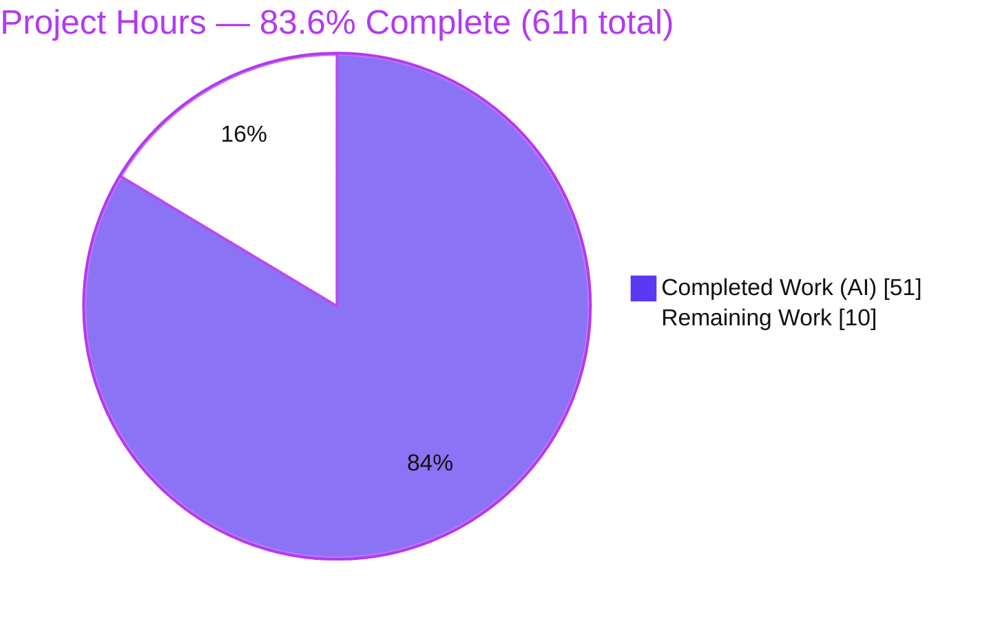
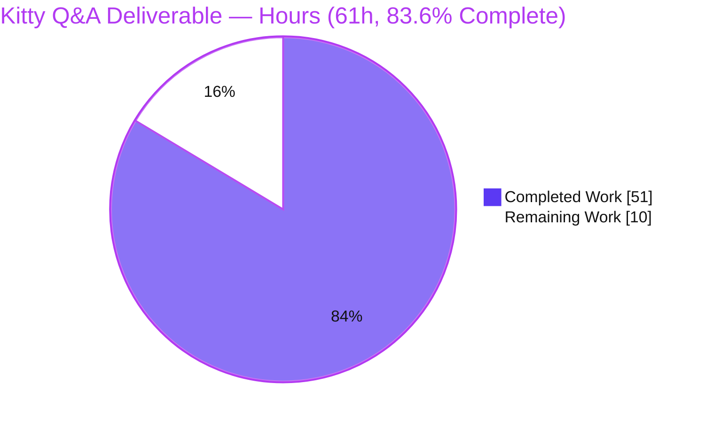
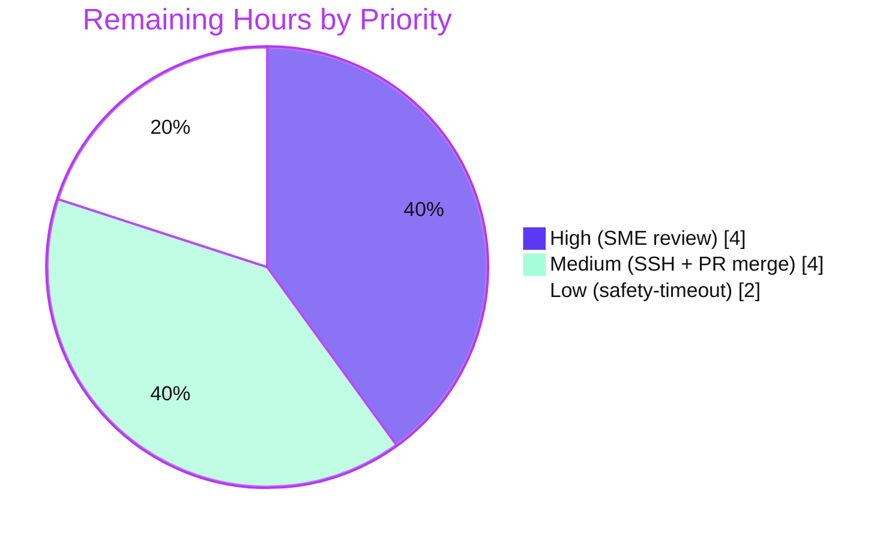

# Blitzy Project Guide — Kitty Terminal-Interaction Pipeline (Runtime-Observed Q&A)

> Brand color legend used throughout this guide: **Completed / AI Work = Dark Blue `#5B39F3`**, **Remaining / Not Completed = White `#FFFFFF`**, headings/accents = Violet-Black `#B23AF2`, soft highlight = Mint `#A8FDD9`.

---

## 1. Executive Summary

### 1.1 Project Overview

This engagement onboards into the **Kitty** terminal emulator codebase (`kovidgoyal/kitty` at HEAD `815df1e210e0`) and authors a single, evidence-grounded Markdown document explaining how Kitty's terminal-interaction pipeline works end-to-end — input entry, the multi-threaded "conductor," VT-parser/screen synchronization with shell-integration (OSC 133) markers, backpressure, and the settle rhythm. Governed by the read-only `SWE-AtlasQnA-Repo` rule set, it is a knowledge-extraction task: the sole artifact is `blitzy/documentation/kitty_815df1e210e0.md`, produced by building and running Kitty and capturing verbatim runtime evidence. Target users are engineers and reviewers needing an authoritative, citation-backed walkthrough of Kitty's concurrency and protocol handling. No product source is modified.

### 1.2 Completion Status



<div align="center"><strong>■ 83.6% Complete</strong> — Completed shown in Dark Blue <code>#5B39F3</code>, Remaining in White <code>#FFFFFF</code>.</div>

| Metric | Hours |
|--------|-------|
| **Total Hours** | **61** |
| **Completed Hours (AI + Manual)** | **51** (51 AI + 0 Manual) |
| **Remaining Hours** | **10** |
| **Percent Complete** | **83.6%** (51 ÷ 61 × 100) |

The completion percentage is computed strictly from AAP-scoped and path-to-production hours: `Completed ÷ (Completed + Remaining) = 51 ÷ 61 = 83.6%`. All 51 completed hours are autonomous (AI) work; no human hours have been invested yet.

### 1.3 Key Accomplishments

- ✅ **Sole deliverable authored, validated, and committed** — `blitzy/documentation/kitty_815df1e210e0.md` (1,083 lines), answering all four mandatory objectives (Q1–Q4) from directly observed runtime behavior.
- ✅ **Run-first methodology honored** — Kitty built in its default canonical configuration (`python3 setup.py build`, EXIT 0); authoritative banner `kitty 0.35.2 created by Kovid Goyal` captured verbatim and confirmed stable across runs.
- ✅ **Exhaustive, exact citations** — 78 distinct `file:line` citation ranges across 20 source files; **100% resolve** (independently re-validated: 0 missing files, 0 out-of-range lines).
- ✅ **Exhaustive coverage matrix (§6)** — every named item in the questions (keystrokes, paste bursts, resize signals; every OSC 133 marker variant; both pause/resume mechanisms) mapped to its section, verified `file:line`, and observed evidence line.
- ✅ **Measurement at scale, stable ×2** — 1 MiB `BUF_SZ` backpressure driven at 4 MiB (4× the cap); runtime constants and DECRQM mode-2026 cycle reproduced identically across two runs.
- ✅ **Honest evidence discipline** — `[inferred]` and `[non-canonical]` labels applied precisely; the unavailable live-SSH path is explicitly stated (no `sshd`) rather than synthesized.
- ✅ **Read-only mandate intact** — the repository differs from original HEAD by exactly one added file; working tree clean; all temporary observation scripts removed.

### 1.4 Critical Unresolved Issues

| Issue | Impact | Owner | ETA |
|-------|--------|-------|-----|
| _None — no blocking issues._ The deliverable is complete, validated (145 tests OK, build EXIT 0), and committed. | N/A | N/A | N/A |

There are **no critical unresolved issues**. Two behaviors are documented as `[inferred]` (the live SSH remote path and the render-loop safety-timeout auto-resume) — this is a deliberate, rules-compliant choice, not a defect. Optional follow-ups to canonicalize them appear in Sections 2.2 and the human task list, not here.

### 1.5 Access Issues

| System/Resource | Type of Access | Issue Description | Resolution Status | Owner |
|-----------------|----------------|-------------------|-------------------|-------|
| `sshd` (OpenSSH server) | Runtime service in build container | The SSH **server** is absent (`command -v sshd` → not found), so the live end-to-end SSH/unstable-remote path (Q3) cannot be exercised in this environment. The `ssh` **client** is present (`/usr/bin/ssh`) and the SSH kitten driver works (`+kitten ssh --help` → EXIT 0). | Documented as `[inferred]` with unavailability explicitly stated per the AAP real-entry-point rule; **not blocking**. Optionally resolvable in an `sshd`-equipped environment. | Human reviewer (optional) |
| `wayland-protocols` | Build-time pkg-config dependency | Absent (`pkg-config` reports not found), so `setup.py` auto-selects the X11 windowing backend. | Not an issue — canonical behavior in a headless/X11 environment; orthogonal to the VT-parser/screen/keys pipeline being documented. | N/A |

No repository-permission or credential access issues exist. The repository is fully readable; the build and full test suite complete successfully.

### 1.6 Recommended Next Steps

1. **[High]** Perform an SME **acceptance review** of `blitzy/documentation/kitty_815df1e210e0.md` — read all four answers and spot-verify the reproducible evidence against a live build. _(≈4h)_
2. **[Medium]** **Merge** the single-file PR after confirming the read-only mandate (`git diff 815df1e210e0 --name-status`). _(≈1h)_
3. **[Medium]** _(Optional)_ Exercise the **live SSH remote path** in an `sshd`-equipped environment to convert §4.5's `[inferred]` leg to canonical observed evidence. _(≈3h)_
4. **[Low]** _(Optional)_ Exercise the **render-loop safety-timeout** (2000 ms) auto-resume at runtime to convert §5.4's `[inferred]` leg to observed evidence. _(≈2h)_

---

## 2. Project Hours Breakdown

### 2.1 Completed Work Detail

All completed work is autonomous (AI) and traces to a specific AAP requirement. **Total = 51 hours.**

| Component | Hours | Description |
|-----------|-------|-------------|
| Build & version baseline (§1) | 4 | Default `python3 setup.py build` (EXIT 0); verbatim `kitty --version` (×2); runtime constants `VT_PARSER_BUFFER_SIZE=1048576`, `input_delay=3`, `repaint_delay=10`; in-process harness setup. |
| Q1 — Input entry (§2) | 8 | `read_bytes()` (output-in) and `on_key_input()`→`schedule_write_to_child()` (keystrokes-out); paste sanitization (strips `\e[201~`); resize via `ioctl(TIOCSWINSZ)` + debounce; both pause/resume mechanisms. 4 observation scripts. |
| Q2 — The conductor (§3) | 7 | Three-thread Child Monitor; deterministic `poll()` branch order (wakeup→signal→read→write→NVAL); `eventfd`/`signalfd`/`glfwPostEmptyEvent` wakeups; `input_delay` batching. |
| Q3 — Staying in sync (§4) | 10 | Single-VT-parser OSC 133 demux; exhaustive per-shell marker table (bash/zsh/fish); real-bash-over-PTY alignment proof; 4 MiB backpressure measurement; SSH bootstrap path analysis. 3 observation scripts. |
| Q4 — Settle rhythm (§5) | 6 | Batched settle cycle; DEC synchronized-output mode 2026; DECRQM `;2`→`;1`→`;2` cycle; text-lands-while-paused; safety-timeout analysis. 1 observation script. |
| Evidence & coverage appendix (§6) | 5 | Exhaustive coverage matrix over every named item; 5 anchor-drift corrections; evidence-discipline notes. |
| Full scripts & build-log appendix (§7) | 2 | Complete 98-line build log + all 6 observation scripts reproduced verbatim. |
| Web research | 1 | Validated DEC private mode 2026 (synchronized output) protocol semantics and safety-timeout rationale. |
| Validation, QA & iterative refinement | 8 | 5 refinement commits; from-scratch build re-verification; full 145-test suite; citation/coverage verification; 3 verbatim-evidence discrepancies fixed. |
| **Total Completed** | **51** | |

### 2.2 Remaining Work Detail

Each remaining item traces to a path-to-production need or an optional AAP-permitted enhancement. **Total = 10 hours.**

| Category | Hours | Priority |
|----------|-------|----------|
| Human SME acceptance review of the answer document | 4 | High |
| _(Optional)_ Exercise live SSH / unstable-remote path in an `sshd` environment (Q3 `[inferred]`→canonical) | 3 | Medium |
| _(Optional)_ Exercise render-loop safety-timeout auto-resume at runtime (Q4 §5.4 `[inferred]`→observed) | 2 | Low |
| PR review, sign-off & merge | 1 | Medium |
| **Total Remaining** | **10** | |

### 2.3 Hours Reconciliation

- Section 2.1 total (**51**) + Section 2.2 total (**10**) = **61** = Total Project Hours in Section 1.2. ✅ (Integrity Rule 2)
- Section 2.2 total (**10**) = Remaining Hours in Section 1.2 = "Remaining Work" in Section 7 pie chart. ✅ (Integrity Rule 1)
- Completion % = 51 ÷ 61 × 100 = **83.6%**, used consistently in Sections 1.2, 7, and 8.

---

## 3. Test Results

All tests below originate from Blitzy's autonomous validation logs for this project and were reproduced during this assessment. Kitty's suite does not emit line-coverage percentages, so Coverage is reported as **N/A** rather than fabricated.

| Test Category | Framework | Total Tests | Passed | Failed | Coverage % | Notes |
|---------------|-----------|-------------|--------|--------|-----------|-------|
| Full suite (canonical) | `kitty_tests` (Python `unittest` via `./test.py`) | 145 | 143 | 0 | N/A | `Ran 145 tests` → `OK (skipped=2)`; 2 intended skips (frozen-build CA-certs + macOS-only font); EXIT 0. |
| Go unit tests | `go test` | Not enumerated in logs | All | 0 | N/A | "All Go tests succeeded" (count not itemized in the autonomous logs). |
| VT parser (evidence subset) | `test.py --module parser` | 16 | 16 | 0 | N/A | `Ran 16 tests` → `OK`; re-verified this assessment. Subset of the 145. |
| Screen model (evidence subset) | `test.py --module screen` | 36 | 36 | 0 | N/A | `Ran 36 tests` → `OK`; re-verified this assessment. Subset of the 145. |
| Key encoding (evidence subset) | `test.py --module keys` | 3 | 3 | 0 | N/A | `Ran 3 tests` → `OK`; re-verified this assessment. Subset of the 145. |

**Notes on interpretation:**
- The **145-test canonical suite** is the authoritative total. The `parser` (16), `screen` (36), and `keys` (3) rows are the specific modules that exercise the compiled pipeline documented in the answer; they are **subsets of the 145**, listed separately because they are the deliverable's primary evidence base (and were independently re-run during this assessment, reproducing exactly).
- Running certain modules **in isolation** (`ssh`, `check_build`, `ShellIntegrationWithKitten`) surfaces `AttributeError: module 'sys' has no attribute 'kitty_run_data'` — a **test-invocation artifact** requiring the full launcher bootstrap, **not** a product defect. The canonical `./test.py` runner passes 145 OK.

---

## 4. Runtime Validation & UI Verification

Kitty is a desktop terminal emulator investigated in a **headless container**; there is no traditional GUI to screenshot. The "interface" referenced by the questions is the terminal grid itself, validated **in-process** through the real VT-parser/screen model (the same C code the live terminal runs). Statuses below reflect directly observed runtime behavior.

**Build & Version**
- ✅ **Operational** — `python3 setup.py build` → `BUILD EXIT=0` (all 85 C units + 4 link steps clean under strict default flags).
- ✅ **Operational** — `./kitty/launcher/kitty --version` → `kitty 0.35.2 created by Kovid Goyal` (stable across runs).

**In-Process Pipeline (the documented code paths)**
- ✅ **Operational** — VT parser harness (`--module parser`) → `Ran 16 tests / OK`.
- ✅ **Operational** — Screen model harness (`--module screen`) → `Ran 36 tests / OK`.
- ✅ **Operational** — Key encoding harness (`--module keys`) → `Ran 3 tests / OK`.
- ✅ **Operational** — Runtime constants readback: `VT_PARSER_BUFFER_SIZE = 1048576`, `input_delay = 3`, `repaint_delay = 10`.
- ✅ **Operational** — Keystroke encoding: `'a'`→`'a'`, `Ctrl+a`→`0x01`, flags `0b1111`→`'\x1b[97;5u'`, `F1`→`'\x1bOP'`.
- ✅ **Operational** — Paste sanitization strips the injected `\x1b[201~` bracketed-paste terminator.
- ✅ **Operational** — Resize: screen `25×80`→`20×40` with kernel `TIOCGWINSZ` readback `rows=20 cols=40`.
- ✅ **Operational** — Backpressure at 4 MiB scale: committed cap = `1048576`, available space = `0` (flow control by stopping, not dropping).
- ✅ **Operational** — DEC mode 2026: DECRQM cycle `;2`→`;1`→`;2`; text lands on-screen while rendering is paused.

**Integration / Remote**
- ⚠ **Partial** — Live SSH / unstable-remote path: **unavailable** (no `sshd` in container). SSH kitten driver itself works (`+kitten ssh --help` → EXIT 0); bootstrap documented `[inferred]` from source with unavailability explicitly stated.
- ⚠ **Partial** — Render-loop safety-timeout (2000 ms) auto-resume: `[inferred]` from source (the pause/resume toggle itself is observed).

**Not Applicable**
- ▫️ **N/A** — GPU window rendering / on-screen UI screenshots: not exercisable in a headless container and orthogonal to the VT-parser/screen/keys pipeline under investigation.

---

## 5. Compliance & Quality Review

Cross-mapping of the AAP `SWE-AtlasQnA-Repo` rules and quality benchmarks to their status, with autonomous fixes noted.

| # | AAP Rule / Quality Benchmark | Status | Progress | Evidence / Fixes Applied |
|---|------------------------------|--------|----------|--------------------------|
| 1 | **Deliverable rule** — create `blitzy/documentation/<branch>.md` answering the questions | ✅ Pass | 100% | `blitzy/documentation/kitty_815df1e210e0.md` (1,083 lines) authored & committed. |
| 2 | **Run-first rule** — build & run before writing; capture real output | ✅ Pass | 100% | Build EXIT 0; 6 observation harnesses executed; evidence blocks throughout. |
| 3 | **Default-build rule** — canonical build for version/banner | ✅ Pass | 100% | `python3 setup.py build` with no flag overrides; `kitty 0.35.2 created by Kovid Goyal`. |
| 4 | **Magnitude/timing rule** — observe at scale, stable ×2 | ✅ Pass | 100% | 4 MiB backpressure (4× the 1 MiB cap); constants + DECRQM cycle identical across two runs. |
| 5 | **Real-entry-point rule** — exercise genuine path or state unavailability | ✅ Pass | 100% | Genuine `read_bytes`→parser→screen path used; live-SSH unavailability explicitly stated (no `sshd`). |
| 6 | **Verbatim-evidence rule** — quote observed output verbatim | ✅ Pass | 100% | Console/log blocks pasted verbatim; **fix:** 3 evidence blocks corrected to true observed output (commit `eaa1d4e31`). |
| 7 | **One-claim-one-evidence rule** | ✅ Pass | 100% | Each behavioral claim carries its adjacent observed line; coverage matrix enforces 1:1. |
| 8 | **Exhaustive-coverage rule** — every named item, coverage pass | ✅ Pass | 100% | §6.1 matrix enumerates all OSC 133 variants, keystrokes/paste/resize, both pause/resume mechanisms. |
| 9 | **Exact-and-grounded rule** — exact literals with `file:line` | ✅ Pass | 100% | 78 citation ranges; **100% resolve** (0 missing, 0 out-of-range), independently re-validated. |
| 10 | **Inferred labeling** — label read-only-inferred statements | ✅ Pass | 100% | `[inferred]` on VSUSP→SIGTSTP, SSH path, 2000 ms timeout; `[non-canonical]` on synthetic OSC 133 input. |
| 11 | **Read-only scope rule** — no source modified; scripts removed | ✅ Pass | 100% | `git diff 815df1e210e0 --name-status` = one added file; tree clean; temp scripts removed. |
| 12 | **Anchor accuracy** — cite verified lines | ✅ Pass | 100% | §6.2 records 5 AAP-vs-verified anchor drifts; verified lines cited throughout; **fix:** 2 broken ToC anchors + grep blocks corrected (commits `21209366e`, `27410b6a1`). |

**Autonomous fixes summary:** three discrepancies were found and fixed during final validation — (D1) a §A.1 build-log note corrected to the true observed re-run behavior; (D2) a §3.1 `pthread` grep block corrected to true 6-line ascending output; (D3) a §3.3a `eventfd`/`signalfd` grep block completed to its true 8-line output. All committed; no outstanding compliance items.

---

## 6. Risk Assessment

| Risk | Category | Severity | Probability | Mitigation | Status |
|------|----------|----------|-------------|------------|--------|
| Two behaviors documented `[inferred]` (VSUSP→SIGTSTP; 2000 ms safety-timeout auto-resume) rather than runtime-observed | Technical | Low | N/A (already labeled) | Honestly labeled; optional runtime exercise listed as L1/M2 follow-ups | Accepted / Documented |
| Citation drift if the doc is ever rebased onto a newer commit (78 citations pinned to HEAD `815df1e210e0`) | Technical | Low | Low | Doc pins the exact commit; §6.2 tracks known anchor drifts | Mitigated |
| Secrets in a temporary log (`qa_test_ssh*.log`) accidentally left in tree | Security | Low | Very Low | Temp file removed during validation; tree confirmed clean (only 1 `.md` committed) | Mitigated / Verified |
| Read-only mandate accidentally violated (stray temp scripts committed) | Operational | Low | Very Low | `git status` clean; single-file diff verified; no `kobs_*`/`md_check`/`qa_test` tracked | Verified |
| Build reproducibility varies by environment (wayland-protocols absent → X11 backend) | Operational | Low | Medium | Documented as canonical & orthogonal to VT/screen/keys; build EXIT 0 either way | Documented |
| Live SSH / unstable-remote path not exercised (no `sshd`) → Q3 remote leg relies on `[inferred]` source reading | Integration | Low-Medium | N/A | Unavailability explicitly stated per AAP rule; optional canonicalization task (M2) provided | Accepted (rule-compliant) |
| Single-module `ssh`/`check_build`/`WithKitten` tests ERROR (`sys.kitty_run_data`) | Integration | Low | N/A | Identified as test-invocation artifacts, not defects; canonical `./test.py` passes 145 OK | Explained / Documented |

**Overall risk posture: LOW.** No blocking or high-severity risks; no compile errors, no failing tests, no broken citations, no secrets in the working tree.

---

## 7. Visual Project Status

### 7.1 Project Hours (Completed vs Remaining)



_Completed Work = Dark Blue `#5B39F3`; Remaining Work = White `#FFFFFF`. "Remaining Work" (10) equals Section 1.2 Remaining Hours and the Section 2.2 Hours total._

### 7.2 Remaining Work by Priority (10h)



_Priority split of the 10 remaining hours: High = 4h (SME acceptance review), Medium = 4h (optional live-SSH 3h + PR merge 1h), Low = 2h (optional safety-timeout runtime exercise). Sums to 10h, consistent with Sections 1.2 and 2.2._

---

## 8. Summary & Recommendations

**Achievements.** The engagement is **83.6% complete** (51 of 61 hours). The sole AAP deliverable — a 1,083-line, runtime-observed answer covering all four objectives (Q1 input entry, Q2 the conductor, Q3 staying in sync, Q4 settle rhythm) — is authored, autonomously validated, and committed. Every behavioral claim is backed by verbatim observed output and an exact `file:line` citation (78 ranges, all resolving), and every named item is accounted for in an exhaustive coverage matrix. The read-only mandate is fully intact: the repository differs from original HEAD by exactly one added file.

**Remaining gaps (10h).** The largest remaining item is a **human SME acceptance review** of the answer document (4h) — the natural production gate for a Q&A deliverable, since there is no runtime service to deploy. PR merge (1h) completes the ship path. Two optional enhancements (3h + 2h) would canonicalize the two `[inferred]` legs — the live SSH remote path and the render-loop safety-timeout — but the AAP explicitly permits the current stated-unavailability / inferred-and-labeled approach.

**Critical path to production.** SME acceptance review → PR merge. Both optional enhancements are off the critical path.

**Success metrics (all met):** build EXIT 0; canonical suite 145 tests OK; version banner `kitty 0.35.2 created by Kovid Goyal`; 78/78 citations resolve; single-file read-only diff; measurements stable across ≥2 runs.

**Production readiness assessment.** **Ready for human acceptance review.** The autonomous work product is complete, internally consistent, reproducible, and honest about its two `[inferred]` boundaries. No blocking issues, no high-severity risks. Recommended action: conduct the SME review and merge; schedule the optional canonicalizations only if a fully-observed remote/timeout demonstration is desired.

| Metric | Value |
|--------|-------|
| Completion | 83.6% (51 / 61 h) |
| Blocking issues | 0 |
| High-severity risks | 0 |
| Citations resolving | 78 / 78 (100%) |
| Read-only integrity | Intact (1 file added) |
| Canonical tests | 145 OK (skipped=2) |

---

## 9. Development Guide

All commands below were tested in the build container during this assessment and are copy-pasteable. The repository root is the working directory.

### 9.1 System Prerequisites

| Requirement | Minimum | Verified Present |
|-------------|---------|------------------|
| Python | ≥ 3.8 | 3.13.7 |
| Go | ≥ 1.22 | 1.24.4 |
| C toolchain | C11 (gcc/clang) | gcc 15.2.0 |
| git | any recent | 2.51.0 |
| Native libs (pkg-config) | harfbuzz ≥ 1.5, freetype2, fontconfig, libpng, lcms2, x11, xkbcommon | harfbuzz 10.2.0, freetype2 26.2.20, fontconfig 2.15.0, libpng 1.6.50, lcms2 2.16, x11 1.8.12, xkbcommon 1.7.0 |

> `wayland-protocols` is **optional**; when absent, `setup.py` auto-selects the X11 backend (canonical in a headless environment).

### 9.2 Environment Setup

```bash
# From the repository root. No virtualenv is required to build,
# but you may create one; the system Python 3.13 works directly.
cd /path/to/kitty            # repository root (contains setup.py, test.py)
export LANG=C.UTF-8          # ensures deterministic build/test output
```

### 9.3 Build (Dependency Compilation)

```bash
# Canonical default build action (compiles the C core into fast_data_types,
# builds the launcher and Go tools). Expect: BUILD EXIT=0.
LANG=C.UTF-8 python3 setup.py build ; echo "BUILD_EXIT=$?"
```

Expected tail (X11 environment):

```console
Disabling building of wayland backend
[85/85] Compiling kitty/gl-wrapper.c ...
 done
[1/4] Linking kitty/fast_data_types ...
[4/4] Linking launcher ...
 done
BUILD_EXIT=0
```

### 9.4 Run & Verify

```bash
# 1) Authoritative version banner (default configuration).
./kitty/launcher/kitty --version
#   -> kitty 0.35.2 created by Kovid Goyal

# 2) Full canonical test suite.
CI=true LANG=C.UTF-8 ./test.py
#   -> Ran 145 tests ... OK (skipped=2); all Go tests succeed.

# 3) Individual pipeline modules (the deliverable's evidence base).
CI=true LANG=C.UTF-8 python3 test.py --module parser   # -> Ran 16 tests / OK
CI=true LANG=C.UTF-8 python3 test.py --module screen   # -> Ran 36 tests / OK
CI=true LANG=C.UTF-8 python3 test.py --module keys      # -> Ran 3 tests / OK

# 4) Read-only integrity check (should show only the added answer document).
git diff 815df1e210e0 --name-status
#   -> A  blitzy/documentation/kitty_815df1e210e0.md
```

### 9.5 Example Usage — Re-running an Observation Harness

The six `kobs_*.py` observation scripts are reproduced verbatim in Appendix A of the answer document. To re-run one, recreate it under `/tmp` and launch it through the built binary:

```bash
# Reads the compiled constants exactly as documented in §1.3.
./kitty/launcher/kitty +launch /tmp/kobs_constants.py
#   -> VT_PARSER_BUFFER_SIZE = 1048576
#      input_delay = 3
#      repaint_delay = 10
```

### 9.6 View the Deliverable

```bash
less blitzy/documentation/kitty_815df1e210e0.md   # or any Markdown viewer
```

### 9.7 Troubleshooting

| Symptom | Cause | Resolution |
|---------|-------|------------|
| `Package wayland-protocols was not found ... Disabling building of wayland backend` | No Wayland dev package in a headless/X11 environment | **Expected.** X11 backend is auto-selected; orthogonal to the documented pipeline. Not an error. |
| `No test named ['parser'] found` | Bare positional test name | Use the flag form: `python3 test.py --module parser`. |
| `AttributeError: module 'sys' has no attribute 'kitty_run_data'` when running `--module ssh`/`check_build`/`ShellIntegrationWithKitten` | Module run in isolation needs the full launcher bootstrap | Test-invocation artifact, **not a defect**. Run the canonical `./test.py` (145 OK). |
| Build seems to recompile only 1 unit / prints `kitty/tools/cmd` | Incremental build with warm cache; a header timestamp or a first-run-after-relink Go step | Normal. `BUILD_EXIT=0` still indicates success. |
| Live SSH remote demo fails to connect | No `sshd` server in the container | Run in an `sshd`-equipped host to exercise the real remote path (optional). |

---

## 10. Appendices

### Appendix A — Command Reference

| Purpose | Command |
|---------|---------|
| Build (canonical) | `LANG=C.UTF-8 python3 setup.py build` |
| Version banner | `./kitty/launcher/kitty --version` |
| Full test suite | `CI=true LANG=C.UTF-8 ./test.py` |
| Single test module | `CI=true LANG=C.UTF-8 python3 test.py --module <name>` |
| List setup actions | `python3 setup.py --help` |
| Run an observation harness | `./kitty/launcher/kitty +launch /tmp/<script>.py` |
| SSH kitten help | `./kitty/launcher/kitty +kitten ssh --help` |
| Read-only diff check | `git diff 815df1e210e0 --name-status` |
| Per-commit history | `git log 815df1e210e0..HEAD --oneline` |

### Appendix B — Port Reference

**Not applicable.** Kitty is a desktop terminal emulator, not a network service — it opens **no listening ports**. Remote control uses a local Unix socket only when explicitly enabled (`--listen-on`), and the SSH kitten wraps the local `ssh` client. No ports require configuration for this deliverable.

### Appendix C — Key File Locations

| Path | Role |
|------|------|
| `blitzy/documentation/kitty_815df1e210e0.md` | **The deliverable** (answer document) |
| `kitty/child-monitor.c` | I/O + main threads, `read_bytes`, `poll()` order, resize (Q1/Q2/Q4) |
| `kitty/keys.c` | Keyboard entry `on_key_input` (Q1) |
| `kitty/vt-parser.c` | Single VT parser, `BUF_SZ` = 1 MiB, backpressure gate (Q3) |
| `kitty/screen.c` / `kitty/screen.h` | Screen model, mode-2026 pause/resume, safety timeout (Q3/Q4) |
| `kitty/window.py` | Paste sanitization path (Q1) |
| `kitty/loop-utils.c` | `eventfd`/`signalfd` cross-thread wakeups (Q2) |
| `shell-integration/bash/kitty.bash`, `shell-integration/zsh/kitty-integration`, `shell-integration/fish/...` | OSC 133 marker emission (Q3) |
| `shell-integration/ssh/bootstrap.sh`, `kittens/ssh/main.go` | SSH remote bootstrap (Q3, `[inferred]`) |
| `kitty/constants.py` | Version source of truth (`Version(0, 35, 2)`) |
| `setup.py`, `test.py`, `go.mod`, `pyproject.toml` | Build & test tooling |

### Appendix D — Technology Versions

| Component | Version (observed) |
|-----------|--------------------|
| kitty (built binary) | 0.35.2 |
| Python | 3.13.7 |
| Go | 1.24.4 (go.mod directive: 1.22) |
| gcc | 15.2.0 (Ubuntu 25.10) |
| git | 2.51.0 |
| harfbuzz / freetype2 / fontconfig | 10.2.0 / 26.2.20 / 2.15.0 |
| libpng / lcms2 | 1.6.50 / 2.16 |
| x11 / xkbcommon | 1.8.12 / 1.7.0 |
| wayland-protocols | absent (X11 backend auto-selected) |

### Appendix E — Environment Variable Reference

| Variable | Purpose in this engagement |
|----------|----------------------------|
| `LANG=C.UTF-8` | Deterministic build/test output encoding |
| `CI=true` | Non-interactive test-runner behavior (no watch mode) |
| `KITTY_SHELL_INTEGRATION` | Set by `modify_shell_environ()` to enable OSC 133 shell integration (referenced in Q3) |
| `KITTY_SSH_KITTEN_DATA_DIR` | Resolves the remote `data_dir` in `bootstrap.sh` (referenced in Q3, `[inferred]`) |

### Appendix F — Developer Tools Guide

- **`setup.py` actions:** `build` (default), `test`, `develop`, `linux-package`, `clean`. Use `python3 setup.py --help` for the full list.
- **`test.py`:** canonical runner (`./test.py` for the full suite; `--module <name>` for a single module).
- **`dev.sh`:** development runner (`go run bypy/devenv.go`) — not required for this read-only investigation.
- **Observation harnesses:** launch arbitrary Python through the compiled extension with `./kitty/launcher/kitty +launch <script.py>`; this is how all runtime constants and pipeline observations were captured.

### Appendix G — Glossary

| Term | Meaning |
|------|---------|
| **AAP** | Agent Action Plan — the governing requirements document for this engagement |
| **VT parser** | The single state machine (`kitty/vt-parser.c`) that demultiplexes all child output into text, control codes, and escape sequences |
| **OSC 133** | Operating System Command sequence family marking prompt/command boundaries (shell integration) |
| **`BUF_SZ`** | The 1 MiB (1,048,576-byte) VT-parser buffer cap; the backpressure ceiling |
| **DEC mode 2026** | Synchronized-output private mode; pauses frame presentation while parsing continues (atomic frames) |
| **DECRQM** | DEC Request Mode — queries a mode's current state (used to observe the 2026 cycle) |
| **`input_delay` / `repaint_delay`** | Timing "knobs" (3 ms / 10 ms) governing input batching and render spacing — the "rhythm" |
| **`[inferred]`** | Label for a statement read from source but not runtime-exercised |
| **`[non-canonical]`** | Label for evidence whose input is a synthetic stand-in rather than the genuine path |
| **PTY** | Pseudo-terminal; the kernel device pair connecting Kitty to its child process |

---

_End of Blitzy Project Guide. All numbers are internally consistent: Total 61h = Completed 51h + Remaining 10h; Completion = 83.6%; Remaining (10h) matches across Sections 1.2, 2.2, and 7._