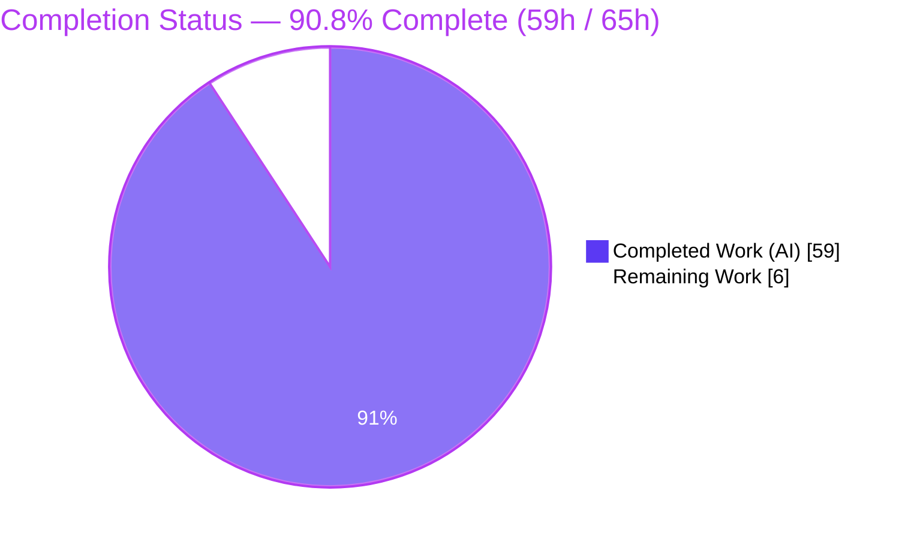
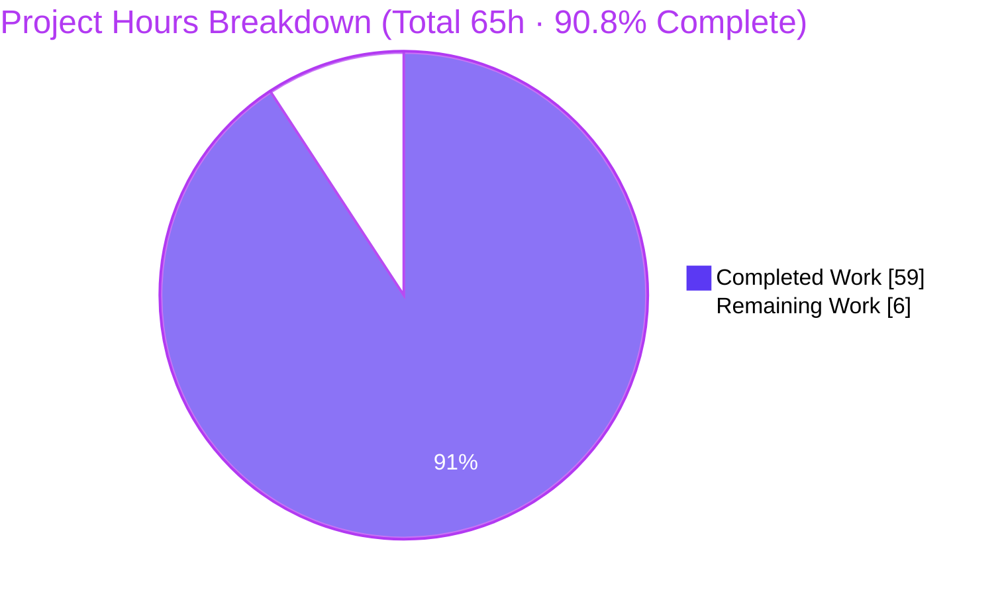
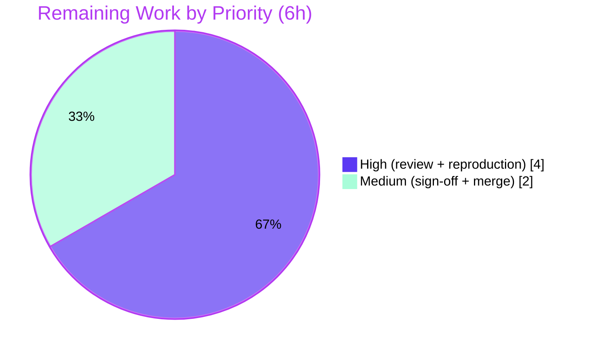

# Blitzy Project Guide — kitty Flow-Control &amp; Backpressure Investigation

> **Deliverable:** `blitzy/documentation/kitty_815df1e210e0.md` — a runtime-verified, read-only code-investigation document.
> **Baseline:** `815df1e21` → **HEAD:** `ec7531576` · **Branch:** `blitzy-326dde93-4726-46de-9d8c-0601d6602ae4`
>
> **Brand color legend:** <span style="color:#5B39F3">■</span> **Completed / AI Work — Dark Blue `#5B39F3`** · <span style="color:#FFFFFF">□</span> **Remaining — White `#FFFFFF`** · Headings/accents Violet-Black `#B23AF2` · Highlights Mint `#A8FDD9`.

---

## 1. Executive Summary

### 1.1 Project Overview

This project is a **read-only code investigation** of the **kitty** terminal emulator. Its objective is to produce one authoritative, runtime-verified document explaining how kitty regulates data flow (flow control / backpressure) when terminal output — especially graphics-protocol data — arrives faster than kitty can comfortably process and respond to. The audience is terminal/systems engineers and reviewers who need a grounded, reproducible account of kitty's buffering, pause, throttle, write-back, and graphics-quota mechanisms. Technical scope spans two data directions (inbound read path, outbound write path) plus graphics-specific limits and synchronized-update pending mode, all across kitty's C core. The sole artifact produced is the answer document; **no source code is modified.**

### 1.2 Completion Status

The project is **90.8% complete** — measured strictly against AAP-scoped work using the hours-based methodology (Completed ÷ Total × 100 = 59 ÷ 65).



| Metric | Hours |
|---|---|
| **Total Hours** | **65** |
| **Completed Hours (AI + Manual)** | **59** (59 AI + 0 Manual) |
| **Remaining Hours** | **6** |
| **Percent Complete** | **90.8%** |

*Color mapping — Completed Work `#5B39F3` (Dark Blue); Remaining Work `#FFFFFF` (White).*

### 1.3 Key Accomplishments

- ✅ **Deliverable authored and committed** — `blitzy/documentation/kitty_815df1e210e0.md` (2,077 lines, 17,521 words, ~138 KB) across 6 progressive QA commits.
- ✅ **Read-only mandate satisfied** — `git diff 815df1e21..HEAD --name-status` = a single `A` (add); **0** existing source files modified; working tree clean.
- ✅ **Run-first investigation** — kitty built canonically and driven through its **real PTY** entry point; every claim paired with complete, unedited output and a `file:line` citation.
- ✅ **Both data directions + graphics + pending mode covered** — inbound buffer/pause/throttle, outbound cap/drain/EAGAIN ladder, 320 MiB storage quota + LRU, 5× frame cache, size guards, `q=` suppression, DECSET 2026 pause.
- ✅ **All six sub-questions answered** — (a) buffer/pause/throttle, (b) response write-back, (c) code location, (d) runtime manifestation, (e) silent vs visible, (f) hygiene.
- ✅ **84 distinct `file:line` citations verified exact** at HEAD against the kitty source.
- ✅ **7 canonical runtime observations reproduced ≥2 runs each** — all match the document.
- ✅ **Corroboration tests pass** — parser 16/16, screen 36/36, graphics 19/19 (independently re-run).
- ✅ **Zero placeholders** — no TODO/FIXME/stub content anywhere in the deliverable.

### 1.4 Critical Unresolved Issues

| Issue | Impact | Owner | ETA |
|---|---|---|---|
| **No release-blocking issues identified** | All AAP-scoped autonomous work is complete and validated | — | — |
| *(Non-blocking, out-of-scope)* `kitty_tests/fonts.py::test_font_selection` fails in environments lacking the "Source Code Pro" font | **None** on the deliverable — font handling is explicitly out of AAP scope (§0.3.2); the failure is environment-blocked and pre-existing (no source modified) | Human (optional) | Optional |

### 1.5 Access Issues

**No access issues identified** that affect the deliverable. The source repository, build toolchain, test harness, and headless runtime were all fully accessible during autonomous work.

| System/Resource | Type of Access | Issue Description | Resolution Status | Owner |
|---|---|---|---|---|
| Source repository (kitty @ `815df1e21`) | Read/Write (branch) | None — full access | ✅ Resolved | — |
| Build toolchain (Python, cc, make) | Execute | None — canonical build succeeds | ✅ Resolved | — |
| Font package registry (network) | Install | *(Informational, non-blocking)* No network to install "Source Code Pro"; affects only an out-of-scope font test, not the deliverable | ⚠ Environment limitation (out of scope) | Human (optional) |

### 1.6 Recommended Next Steps

1. **[High]** Perform SME technical review of the investigation document — spot-check the flow-control mechanisms and `file:line` citations across §2 (inbound), §3 (outbound), §4 (graphics), §5 (pending mode) against the kitty source.
2. **[High]** Independently reproduce at least one canonical observation (e.g., the outbound 100 MiB overflow log, or `q=` graphics suppression) after a fresh canonical build to confirm the run-first evidence.
3. **[Medium]** Obtain stakeholder sign-off confirming the deliverable answers all six sub-questions and covers both data directions plus graphics and pending mode.
4. **[Medium]** Merge `blitzy/documentation/kitty_815df1e210e0.md` into the target branch (trivial single-file add; no source conflicts).
5. **[Low]** *(Optional, out of scope)* If a fully green full-suite CI run is desired, install the "Source Code Pro" font to resolve the pre-existing `test_font_selection` failure.

---

## 2. Project Hours Breakdown

### 2.1 Completed Work Detail

Every completed component below is autonomous Blitzy work traceable to a specific AAP requirement. **Total = 59 hours** (matches Completed Hours in §1.2).

| Component | Hours | Description |
|---|---|---|
| Build &amp; runtime environment | 4 | Canonical Build A (`setup.py build --ignore-compiler-warnings`) + instrumented Build B (debug / event-loop / poll-events / bytes-sent) + headless Xvfb + `LIBGL_ALWAYS_SOFTWARE=1` setup |
| Inbound path investigation (§2.1–2.4) | 9 | 1 MiB `BUF_SZ` buffer, `POLLIN`-drop pause → OS PTY backpressure, `input_delay=3ms` throttle / force-parse, 256 KiB escape-code bound; code reading of `vt-parser.c` + `child-monitor.c`; harnesses `flood_plain`/`esc_boundaries`/`tiny_input`; evidence E1/E2/E2b/D ≥2 runs |
| Outbound path investigation (§3.1–3.4) | 9 | 100 MiB cap + overflow log, `POLLOUT`-gated draining, full `write_to_child` branch ladder (`EAGAIN`/`ret==0`/`EINTR`/`perror`), graphics-shares-path; harnesses `fill_writebuf`/`fill_eagain`/`fill_slowdrain` + fault-injection W; evidence F/EAGAIN/W ≥2 runs |
| Graphics-specific investigation (§4.1–4.4) | 10 | 320 MiB storage quota + LRU eviction, 5× frame cache `ENOSPC`, per-image size/format guards (`EINVAL`/`EFBIG`), `q=` suppression; harnesses `storage_canonical`/`lru_canonical`/`graphics_guards`/`graphics_efbig`/`graphics_b1_qsuppress` + in-process; evidence B1/B2c/B3/B4c/E-EFBIG/F11 ≥2 runs |
| Pending-mode investigation (§5) | 3 | Synchronized-update DECSET 2026 render pause, 2000 ms default timeout, auto-unpause; `pending_child` harness; evidence C ≥2 runs |
| Reference map + citation verification (§6) | 4 | `file:line` reference map + verification of 84 distinct citations exact at HEAD |
| Document authoring (synthesis) | 10 | §0 executive answer + §7 silent-vs-visible table + §8 observed-vs-inferred ledger + §9 hygiene + §10 harness appendix (2,077 lines total) |
| QA remediation (6 commits) | 10 | 21 code-review findings + APC off-by-one (`screen.c:970→971`) + hygiene/portability note + QA5 runtime-evidence strengthening + QA6 F11 harness citations |
| **Total** | **59** | |

### 2.2 Remaining Work Detail

All remaining work is human-gated path-to-production. **Total = 6 hours** (matches Remaining Hours in §1.2 and the "Remaining Work" value in §7).

| Category | Hours | Priority |
|---|---|---|
| SME technical accuracy review of flow-control claims &amp; 84 `file:line` citations (§2–§5 vs kitty source) | 2.5 | High |
| Independent reproduction of ≥1 canonical observation after a fresh build (verify run-first evidence &amp; §8 ledger) | 1.5 | High |
| Stakeholder sign-off / acceptance (all 6 sub-questions + both directions + graphics + pending mode) | 1 | Medium |
| Merge / integration of `blitzy/documentation/` into target branch | 1 | Medium |
| **Total** | **6** | |

> *Out-of-scope, 0h toward AAP remaining:* optionally installing the "Source Code Pro" font to resolve the pre-existing, environment-blocked `test_font_selection` failure (font handling excluded per AAP §0.3.2). Held at 0h so it does not affect the 6h remaining total.

---

## 3. Test Results

All tests below originate from Blitzy's autonomous validation logs for this project and were independently re-executed via `./kitty/launcher/kitty +launch test.py --module <name>`. These are the kitty repository's own unit tests, used to **corroborate** the document's claims (per deliverable §1.6 and §8); this is a read-only task, so no new tests were authored. "Coverage %" is reported as pass rate, as no separate coverage instrumentation is part of this investigation.

| Test Category | Framework | Total Tests | Passed | Failed | Coverage % | Notes |
|---|---|---|---|---|---|---|
| Unit — parser | kitty test harness (Python `unittest`) | 16 | 16 | 0 | 100% pass | Corroborates §2 inbound parser-buffer boundary; DECRQM `?2026$p` transitions (`parser.py:456-465`) |
| Unit — screen | kitty test harness (Python `unittest`) | 36 | 36 | 0 | 100% pass | Corroborates §5 synchronized-update / pending-mode state machine |
| Unit — graphics | kitty test harness (Python `unittest`) | 19 | 19 | 0 | 100% pass | Corroborates §4 storage-quota LRU + 5× frame cache (`graphics.py:1189` `test_graphics_quota_enforcement`) |
| **Deliverable-relevant subtotal** | — | **71** | **71** | **0** | **100% pass** | All modules cited by the document pass |
| Full suite (context) | kitty test harness (Python) + Go | 145 | 144 | 1 | 99.3% pass | Sole failure = `kitty_tests/fonts.py::test_font_selection` — **out-of-scope** (font handling excluded §0.3.2), environment-blocked, pre-existing; all Go tests pass |

---

## 4. Runtime Validation &amp; UI Verification

kitty was built canonically and driven through its **real PTY** entry point (headless via Xvfb + `LIBGL_ALWAYS_SOFTWARE=1`). Each observation was run **≥2 times** and matches the document. This is a terminal-emulator core investigation, so "UI verification" is the observable runtime behavior of the I/O loop and protocol responses rather than a graphical UI.

**Build &amp; environment health**
- ✅ **Canonical build** — `CI=true python3 setup.py build --ignore-compiler-warnings` → exit 0; `fast_data_types.so` = 1,253,792 B; `launcher/kitty` = 40,384 B.
- ✅ **Compiled constants match the document** — `BUF_SZ` = 1,048,576 (1 MiB); `MAX_ESCAPE_CODE` = 262,144 (256 KiB).
- ✅ **Canonical defaults match** — `input_delay` = 3 ms, `repaint_delay` = 10 ms, graphics `storage_limit` = 320 MiB.
- ✅ **Headless launch verified** — child process runs inside kitty and writes to a side-file (launcher exit 0).

**Inbound (read) path**
- ✅ **E1 — inbound pacing** — producer bounded to ~110–112 MiB/s through kitty vs ~108–137 GiB/s to `/dev/null` (≈10³× reduction); child paced, not killed.
- ✅ **E2 — inbound pause** — child froze at a fixed byte count while blocked in `write()` on the full PTY (silent OS backpressure); resumed on unblock.

**Outbound (write-to-child) path**
- ✅ **F — 100 MiB cap** — the exact visible log `Too much data being sent to child with id: 1, ignoring it` emitted en masse (byte-for-byte = `child-monitor.c:342`); reaching the cap also confirms `EAGAIN` retention works.
- ✅ **W — branch ladder** — `ret==0` retain, `EINTR` retry, hard-error `perror`+discard branches exercised via fault injection (labeled non-canonical in §8).

**Graphics-specific**
- ✅ **B1 — `q=` suppression** — `q=0` both replies / `q=1` OK suppressed / `q=2` all suppressed (byte-identical across runs).
- ✅ **B2c — 320 MiB storage quota** — four 100 MB transmits > 320 MiB → LRU eviction of oldest; only survivors remain.
- ✅ **B4c — per-image guards** — zero-dim / unknown-format / PNG-size `EINVAL` + over-dimension `Image too large`; F11 stale-id leak reproduced canonically.

**Synchronized-update pending mode**
- ✅ **C — DECSET 2026** — rendering paused; auto-unpaused at the 2000 ms default; identical bracketing across runs.

**Overall:** ✅ Operational — all validated behaviors reproduce and match the document; ⚠ none partial; ❌ none failing (within AAP scope).

---

## 5. Compliance &amp; Quality Review

AAP deliverables and the binding SWE-AtlasQnA rule set cross-mapped to their fulfillment status. Fixes applied during autonomous validation are noted; there are no outstanding in-scope items.

| Benchmark / AAP Requirement | Requirement | Status | Progress | Notes |
|---|---|---|---|---|
| **Main Rule** — Read-only deliverable | Create only the answer doc; modify no source | ✅ Pass | 100% | `git diff 815df1e21..HEAD` = 1 CREATE, 0 modified; temp scripts in `/tmp/kitty_obs` removed |
| **Rule 1** — Run-first, canonical, ≥2 runs, real entry point, exact commands | Build + run before writing; canonical config; stable across ≥2 runs | ✅ Pass | 100% | §1 build/run commands verbatim; §8 stability (F7) documents ≥2 runs; real PTY entry point |
| **Rule 2** — Exhaustive conditions &amp; complete evidence | Primary + edge/error paths; before/during/after; unedited output | ✅ Pass | 100% | §2.4 escape-code, §3.2 full branch ladder, §4 edge cases; contiguous unedited windows + counted totals |
| **Rule 3** — Observed-vs-inferred discipline | Label inferred; observed evidence beside each claim | ✅ Pass | 100% | §8 ledger labels observed-canonical / instrumented / in-process / fault-injection / inferred |
| **Rule 4** — Complete, precise, grounded | Decompose; exact values; `file:line`; cause→effect | ✅ Pass | 100% | 84 exact citations; per-mechanism function/struct named; cause→effect throughout |
| **Sub-questions (a)–(f)** | Answer every named part | ✅ Pass | 100% | §0 executive answer maps each; §6 reference map; §7 silent-vs-visible |
| **Both data directions** | Inbound + outbound | ✅ Pass | 100% | §2 inbound + §3 outbound |
| **Graphics-specific limits** | Quota, frame cache, guards, `q=` | ✅ Pass | 100% | §4.1–4.4 |
| **Investigation hygiene** | Repo unchanged; temp artifacts removed | ✅ Pass | 100% | §9 proof + idempotent cleanup; working tree clean |
| **Zero-placeholder** | No TODO/FIXME/stub | ✅ Pass | 100% | Grep confirms none in deliverable |
| **Compilation quality** | In-scope C core compiles clean | ✅ Pass | 100% | 4 in-scope C files: 0 errors / 0 warnings (canonical build) |
| Citation off-by-one (APC introducer) | Correct `screen.c` line | ✅ Fixed | 100% | Corrected `:970 → :971` in QA round (commit `e13dd875e`) |
| Overflow-count portability | Counts are run-dependent magnitudes | ✅ Fixed | 100% | Portability note added in §3.3 (commit `8f509af97`) |

---

## 6. Risk Assessment

| Risk | Category | Severity | Probability | Mitigation | Status |
|---|---|---|---|---|---|
| Citation `file:line` drift if kitty source is later updated | Technical | Low | Medium | Citations anchored to named baseline `815df1e21`; doc states exact HEAD (§9) | Mitigated |
| Overflow-count magnitudes are host/run-dependent (e.g., 1,107,992 vs 321,546) | Technical | Low | Low | Explicit portability note in §3.3; counts labeled as magnitudes, not constants | Resolved |
| A few claims (5× frame-cache `ENOSPC`, F11 fresh-process empty reply) are in-process/non-canonical only | Technical | Low | Low | Explicitly labeled non-canonical in §8; corroborated by repo test `graphics.py:1189` | Resolved (disclosed) |
| No security-relevant change introduced | Security | None | — | Read-only doc; no code, dependencies, credentials, or attack surface added (the investigation documents kitty's own DoS protections but changes nothing) | N/A |
| Reproduction needs headless build (Xvfb + `LIBGL`) and `--ignore-compiler-warnings` for out-of-scope `glfw/wl_window.c` under newer wayland-protocols | Operational | Low | Medium | Exact commands in §1; workaround changes no source and has no flow-control impact | Mitigated |
| Build artifacts are git-ignored; a fresh checkout must rebuild before re-observing | Operational | Low | Low | §1 documents Build A/B verbatim; artifacts reproduce deterministically | Mitigated |
| Standalone markdown add — trivial integration, no source conflicts | Integration | Low | Low | Git-verified single-file add | Low |
| Reviewer environment may lack "Source Code Pro" → out-of-scope test failure on full-suite run | Integration | Low | Medium | Documented out-of-scope / env-blocked / pre-existing; 71 deliverable-relevant tests pass 100% | Documented |

---

## 7. Visual Project Status



*Color mapping — Completed Work `#5B39F3` (Dark Blue); Remaining Work `#FFFFFF` (White). "Remaining Work" = 6h, identical to §1.2 Remaining Hours and the §2.2 total.*

**Remaining hours by priority (from §2.2):**



*High = 4h (2.5 + 1.5); Medium = 2h (1 + 1); sum = 6h.*

---

## 8. Summary &amp; Recommendations

**Achievements.** The project delivers a comprehensive, runtime-verified investigation of kitty's flow-control and backpressure behavior as a single read-only document (`blitzy/documentation/kitty_815df1e210e0.md`, 2,077 lines). It answers all six named sub-questions, covers both data directions (inbound and outbound) plus graphics-specific limits and synchronized-update pending mode, grounds every claim in one of 84 exact `file:line` citations, and pairs each behavioral claim with complete, unedited runtime output captured through kitty's real PTY entry point. The read-only mandate is provably satisfied: exactly one file added, zero source files modified.

**Remaining gaps.** The project is **90.8% complete** (59h of 65h). The remaining **6h** is entirely human-gated: SME technical review (2.5h) and independent reproduction of the run-first evidence (1.5h), followed by stakeholder sign-off (1h) and merge (1h). No autonomous work remains and there are no release-blocking issues.

**Critical path to production.** (1) SME reviews the document against the kitty source → (2) reviewer reproduces ≥1 canonical observation from a fresh build → (3) stakeholder sign-off → (4) merge. Estimated wall-clock: well under one working day.

**Success metrics (all met within AAP scope).** Canonical build exit 0; in-scope C core compiles with 0 errors/0 warnings; 71 deliverable-relevant tests pass (100%); 7 runtime observations reproduced ≥2 runs each; 84 citations exact; working tree clean.

**Production readiness assessment.** **Ready for human review.** For a read-only documentation deliverable, "production" is acceptance and merge of the answer document. The content is complete, accurate, grounded, and rule-compliant; the only prerequisites to merge are human validation and sign-off.

| Success Metric | Target | Actual | Status |
|---|---|---|---|
| AAP sub-questions answered | 6/6 | 6/6 | ✅ |
| Data directions covered | 2/2 | 2/2 | ✅ |
| Source files modified (read-only) | 0 | 0 | ✅ |
| Deliverable-relevant tests passing | 100% | 71/71 (100%) | ✅ |
| Citations verified exact | all | 84/84 | ✅ |
| Runtime observations reproduced (≥2 runs) | all | 7/7 | ✅ |

---

## 9. Development Guide

All commands below were tested in the working environment and are copy-pasteable. Run them from the repository root.

### 9.1 System Prerequisites

| Tool | Version (verified) | Purpose |
|---|---|---|
| Python 3 | 3.13.7 (AAP referenced 3.12.3; both work) | kitty Python layer + `setup.py` build |
| C toolchain (`cc`) | Ubuntu 15.2.0 | Compiles `fast_data_types` C extension + launcher |
| GNU Make | 4.4.1 | Convenience build targets (`make`, `make debug-event-loop`) |
| Xvfb | present | Virtual X display for headless GL |
| git | present | Read-only diff / status verification |

### 9.2 Environment Setup

```bash
# From the repository root. The repo root is PYTHONPATH.
cd /path/to/kitty
export PYTHONPATH=.

# Headless runs require a virtual X display and software GL:
Xvfb :99 -screen 0 1024x768x24 &   # note the printed PID to stop it later
export DISPLAY=:99
export LIBGL_ALWAYS_SOFTWARE=1
```

### 9.3 Dependency Installation / Build

This is an in-tree build; **no PyPI packages are required**. Build kitty in its canonical (default) configuration:

```bash
CI=true python3 setup.py build --ignore-compiler-warnings
```

- Produces `kitty/fast_data_types.so` (**1,253,792 B**), `kitty/launcher/kitty` (**40,384 B**), `kitty/glfw-x11.so`, `kitty/glfw-wayland.so`, `kitty/launcher/kitten`.
- `--ignore-compiler-warnings` is required **only** because the environment's `wayland-protocols` is newer than kitty@`815df1e21` expects, which makes the **out-of-scope** file `glfw/wl_window.c` trip `-Werror`. It sets `werror=''` (`setup.py:491`, `:1231`), changes **no source**, and has no flow-control impact.

### 9.4 Application Startup / Verification

**Verify build artifacts and compiled constants:**

```bash
test -f kitty/fast_data_types.so && test -x kitty/launcher/kitty && echo "artifacts present"

PYTHONPATH=. python3 -c "from kitty.fast_data_types import VT_PARSER_BUFFER_SIZE, VT_PARSER_MAX_ESCAPE_CODE_SIZE; print(VT_PARSER_BUFFER_SIZE, VT_PARSER_MAX_ESCAPE_CODE_SIZE)"
# expected: 1048576 262144   (1 MiB buffer, 256 KiB max escape code)
```

**Run the deliverable-relevant corroboration tests (all should report OK):**

```bash
CI=true ./kitty/launcher/kitty +launch test.py --module parser    # Ran 16 tests ... OK
CI=true ./kitty/launcher/kitty +launch test.py --module screen    # Ran 36 tests ... OK
CI=true ./kitty/launcher/kitty +launch test.py --module graphics  # Ran 19 tests ... OK
```

**View the deliverable:**

```bash
less blitzy/documentation/kitty_815df1e210e0.md
wc -l blitzy/documentation/kitty_815df1e210e0.md   # 2077
```

**Verify the read-only mandate:**

```bash
git diff --name-status 815df1e21..HEAD
# expected single line: A  blitzy/documentation/kitty_815df1e210e0.md
git status --porcelain --untracked-files=all       # expected: empty (clean)
```

### 9.5 Example Usage — Reproduce a Canonical Observation

Observation harnesses live **outside** the repo (e.g., `/tmp/kitty_obs`). The child's stdout is the PTY (rendered inside kitty's window, **not** the outer shell), so harnesses write results to a **side-file**:

```bash
# Canonical headless run template (fill <harness> and <side_file>):
DISPLAY=:99 LIBGL_ALWAYS_SOFTWARE=1 PYTHONPATH=. timeout 20 \
  kitty/launcher/kitty --config NONE -o confirm_os_window_close=0 \
  python3 /tmp/kitty_obs/<harness>.py <side_file>
# launcher exits 0; read results from <side_file>
```

The full source of every harness (`flood_plain.py`, `fill_writebuf.py`, `fill_eagain.py`, graphics/pending harnesses, etc.) is reproduced verbatim in the deliverable's **§10 harness appendix**.

### 9.6 Troubleshooting

| Symptom | Cause | Resolution |
|---|---|---|
| Build fails on `glfw/wl_window.c` with `-Werror` | Newer `wayland-protocols` than kitty@`815df1e21` expects (out-of-scope file) | Add `--ignore-compiler-warnings` (changes no source) |
| No output on the outer shell when running a child in kitty | Child stdout is the PTY, rendered in kitty's window | Write results to a side-file (as all harnesses do) |
| GL / display errors on a headless host | No X display / hardware GL | Start `Xvfb :99` and set `DISPLAY=:99 LIBGL_ALWAYS_SOFTWARE=1` |
| `test_font_selection` fails | "Source Code Pro" font absent + no network (out of scope) | Ignore — out-of-scope, env-blocked, pre-existing; deliverable tests are unaffected |
| Stopping the virtual display | `Xvfb` runs in the background | Capture its PID at launch and `kill <pid>` (never a broad `pkill`) |

---

## 10. Appendices

### A. Command Reference

| Purpose | Command |
|---|---|
| Canonical build | `CI=true python3 setup.py build --ignore-compiler-warnings` |
| Debug/event-loop build | `make debug-event-loop` |
| Verify constants | `PYTHONPATH=. python3 -c "from kitty.fast_data_types import VT_PARSER_BUFFER_SIZE, VT_PARSER_MAX_ESCAPE_CODE_SIZE; print(VT_PARSER_BUFFER_SIZE, VT_PARSER_MAX_ESCAPE_CODE_SIZE)"` |
| Run a test module | `CI=true ./kitty/launcher/kitty +launch test.py --module <parser\|screen\|graphics>` |
| Start virtual display | `Xvfb :99 -screen 0 1024x768x24 &` |
| Headless run template | `DISPLAY=:99 LIBGL_ALWAYS_SOFTWARE=1 PYTHONPATH=. kitty/launcher/kitty --config NONE -o confirm_os_window_close=0 python3 <child> <args>` |
| Read-only proof | `git diff --name-status 815df1e21..HEAD` |
| Clean-tree check | `git status --porcelain --untracked-files=all` |

### B. Port Reference

No network ports are used. The only "port"-like resource is the virtual X display **`:99`** (Xvfb) used for headless runs.

### C. Key File Locations

| Path | Role |
|---|---|
| `blitzy/documentation/kitty_815df1e210e0.md` | **The deliverable** (only file added) |
| `kitty/vt-parser.c` | Inbound 1 MiB buffer, parse timing (reference) |
| `kitty/child-monitor.c` | Poll-based I/O loop; POLLIN/POLLOUT gating; 100 MiB write cap (reference) |
| `kitty/graphics.c` | 320 MiB storage quota + LRU; frame cache; size guards; `q=` (reference) |
| `kitty/screen.c` | Response dispatch; synchronized-update pending mode (reference) |
| `kitty/options/definition.py` · `types.py` | Canonical defaults `input_delay=3`, `repaint_delay=10` (reference) |
| `kitty/fast_data_types.so` · `kitty/launcher/kitty` | Build artifacts (git-ignored) |

### D. Technology Versions

| Component | Version |
|---|---|
| kitty source baseline | `815df1e210e0…` ("Wire up applying of font config", 2024-05-18) |
| Delivery HEAD | `ec7531576` |
| Python | 3.13.7 |
| C compiler | cc (Ubuntu) 15.2.0 |
| GNU Make | 4.4.1 |
| Canonical `fast_data_types.so` | 1,253,792 B |
| Launcher `kitty` | 40,384 B |

### E. Environment Variable Reference

| Variable | Value | Purpose |
|---|---|---|
| `PYTHONPATH` | `.` | Repository root import path |
| `DISPLAY` | `:99` | Virtual X display (Xvfb) |
| `LIBGL_ALWAYS_SOFTWARE` | `1` | Software GL rendering (headless) |
| `CI` | `true` | Non-interactive build/test |
| `KITTY_PRINT_BYTES_SENT_TO_CHILD` | (debug build) | Prints bytes written to child (diagnostics only) |

### F. Developer Tools Guide

- **Build instrumentation:** `make debug-event-loop` compiles with `--debug --extra-logging=event-loop`, enabling `DEBUG_EVENT_LOOP` and per-fd `DEBUG_POLL_EVENTS` `revents` printing — used only as labeled non-canonical diagnostics (never for magnitude/timing values).
- **Test harness:** `./kitty/launcher/kitty +launch test.py --module <name>` runs the kitty unit tests; `test.py` shebang is `#!./kitty/launcher/kitty +launch`.
- **Read-only hygiene:** keep all observation scripts outside the repo (`/tmp/kitty_obs`); stop background `Xvfb` by its captured PID (never a broad `pkill`/`killall`).

### G. Glossary

| Term | Meaning |
|---|---|
| **Backpressure** | Slowing/pausing a producer by not consuming — here, kitty stops reading so the kernel PTY buffer fills and the child's `write()` blocks |
| **PTY** | Pseudo-terminal connecting kitty (master) and the child process (slave) |
| **`POLLIN` / `POLLOUT`** | poll(2) events for readable / writable file descriptors; kitty gates these to apply flow control |
| **`EAGAIN` / `EWOULDBLOCK`** | Non-blocking `write()` "try again" — kitty keeps data buffered for the next `POLLOUT` |
| **APC** | Application Program Command escape sequence (`ESC _`) — the kitty graphics-protocol carrier |
| **DECSET 2026** | Synchronized-update ("pending") mode control code that pauses rendering |
| **LRU eviction** | Least-Recently-Used removal of oldest images when the 320 MiB graphics storage quota is exceeded |
| **Canonical vs non-canonical** | Canonical = default release build via real PTY; non-canonical = in-process test hooks, reduced limits, fault injection, or debug builds (always labeled) |

---

*End of Blitzy Project Guide. Cross-section integrity validated: §1.2 Remaining (6h) = §2.2 total (6h) = §7 "Remaining Work" (6); §2.1 (59h) + §2.2 (6h) = 65h Total; completion 59/65 = 90.8% consistent across §1.2, §7, §8. All tests originate from Blitzy's autonomous validation logs. Colors: Completed `#5B39F3`, Remaining `#FFFFFF`.*