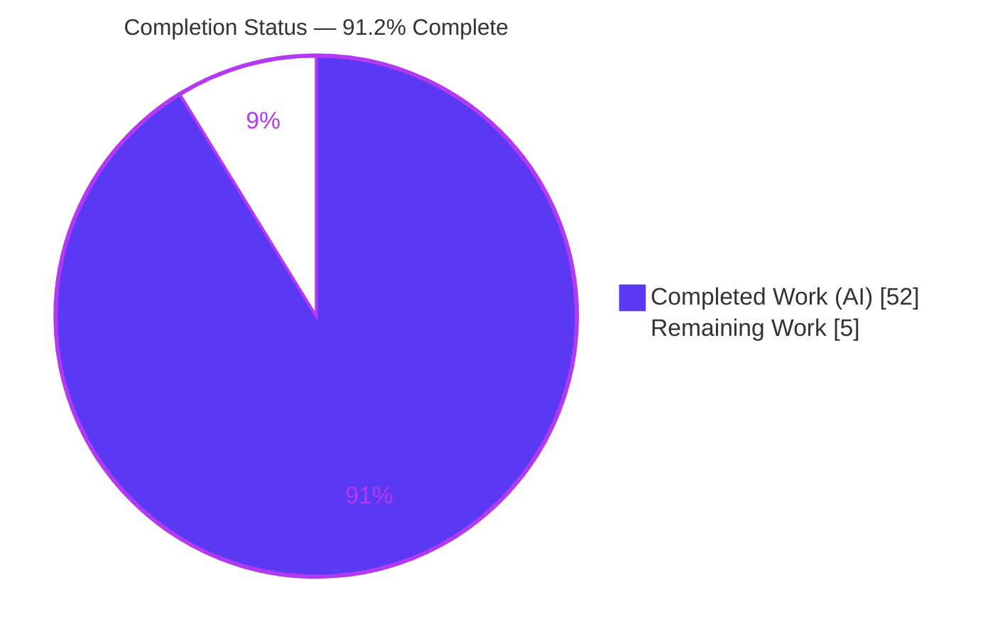
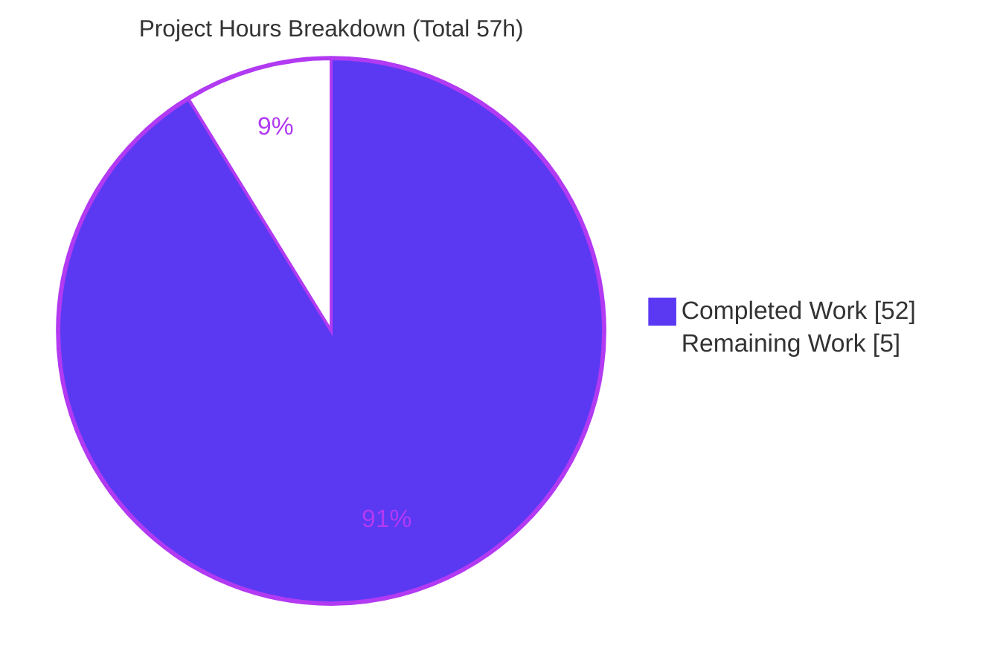
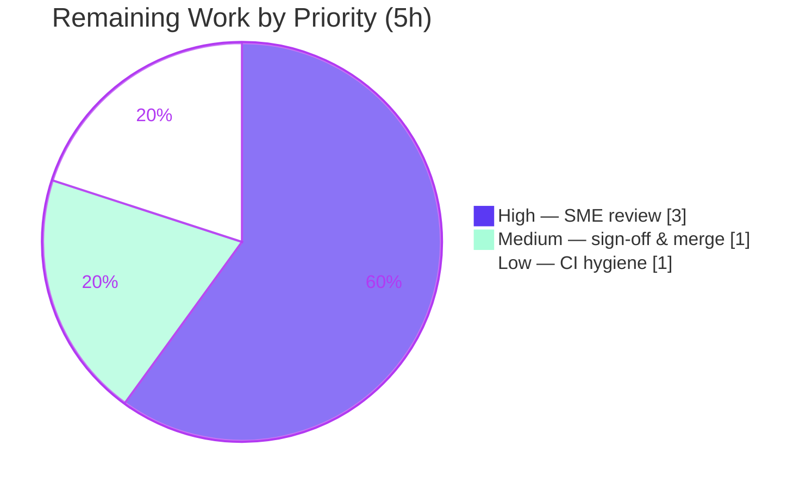

# Blitzy Project Guide

**Project:** kitty — Runtime-verified answer on C‑core ↔ Python clipboard transport under load
**Branch:** `blitzy-e887c911-d451-47bd-84e6-41695624502a`  •  **Base:** `815df1e21`
**Task type:** Read-only code-investigation / Q&A documentation ("SWE-AtlasQnA-Repo")

---

## 1. Executive Summary

### 1.1 Project Overview

This project delivers a single, runtime-verified Markdown document that explains how the **kitty** terminal emulator moves data — clipboard data especially — from its **C core** (the VT‑parser read buffer and the `Screen`/`HistoryBuf` structures) across the boundary into **Python objects** consumed by kittens, and how timing, concurrency, object ownership, and subtle races behave under real load. The audience is engineers and maintainers who need an authoritative, evidence-grounded account rather than prose speculation. The scope is a **read-only investigation**: kitty is built and exercised through its real entry points (genuine OSC 52 / OSC 5522 escapes over a PTY), observations are captured, and the answer is written from what was observed. The sole change to the repository is one additive documentation file — no source, test, build, or config file is modified.

### 1.2 Completion Status

The project is **91.2% complete**. All autonomous, AAP-scoped work (build for observation, the SQ‑1…SQ‑7 runtime investigation, authoring, iterative QA remediation, and read-only compliance) is finished and independently re-verified. The remaining **5 hours** are human path-to-production activities: SME technical review, stakeholder sign-off & merge, and optional CI hygiene.



| Metric | Value |
|---|---|
| **Total Hours** | **57** |
| **Completed Hours (AI + Manual)** | **52** (52 AI + 0 Manual) |
| **Remaining Hours** | **5** |
| **Percent Complete** | **91.2%** |

> Completion formula (PA1, AAP-scoped): `52 / (52 + 5) × 100 = 91.2%`.

### 1.3 Key Accomplishments

- [x] Authored the single mandated deliverable `blitzy/documentation/kitty_815df1e210e0.md` (2,416 lines) with each claim placed next to the command and output that produced it.
- [x] Answered all seven sub-questions (SQ‑1…SQ‑7), each opening with an explicit bold **"Direct answer."**
- [x] Established the central thesis with runtime evidence: a multi-threaded core but a **single-threaded Python layer** serialized by the **GIL**, with a **zero-copy read-only `memoryview`** at the C→Python boundary.
- [x] Exercised the **real entry point** — genuine OSC 52 / OSC 5522 escapes through a PTY (full launcher under xvfb + `kitten clipboard`) — as the canonical evidence.
- [x] Reproduced the **16 MiB `BytesIO`→`TemporaryFile` rollover** (`tell()=16908288`) and documented (not fixed) the `clipboard_max_size` double-scaling (`clipboard.py:247` + `:321`).
- [x] Quantified **scan → event-delivery delay** with a direct baseline-vs-interposed experiment (~50–75 ms for 120k lines; delays but never loses) and **memory footprint** (segment 5,251,072 B; observed/theoretical = 1.00).
- [x] Maintained rigor: **92 `file:line` citations**, disciplined canonical / non-canonical / inferred labels, ≥2 runs for every magnitude claim.
- [x] Preserved **read-only scope** perfectly — the entire `815df1e21..HEAD` delta is exactly one added file — and cleaned up all temporary scripts.
- [x] Independently re-verified in-scope tests (clipboard, parser, screen, datatypes) and runtime this session — all green.

### 1.4 Critical Unresolved Issues

| Issue | Impact | Owner | ETA |
|---|---|---|---|
| _None — no blocking issues._ The deliverable is complete, committed, and independently runtime-verified accurate. | — | — | — |

> There are no unresolved issues that block release or validation. The items in Section 6 (Risk Assessment) are low-severity, documented, and mitigated.

### 1.5 Access Issues

| System/Resource | Type of Access | Issue Description | Resolution Status | Owner |
|---|---|---|---|---|
| — | — | No access issues identified. Repository, build toolchain (gcc/Go/Python), and the designated container environment were all available; the build, runtime, and in-scope tests all executed successfully. | N/A | — |

### 1.6 Recommended Next Steps

1. **[High]** Perform an SME technical review of `blitzy/documentation/kitty_815df1e210e0.md`: read it end-to-end, spot-check a sample of the 92 `file:line` citations, and reproduce 1–2 embedded probes (OSC 52 round-trip; 16 MiB rollover) from §11.1.
2. **[Medium]** Confirm read-only scope (`git diff --name-status 815df1e21` = single `A` entry), then approve and merge the documentation PR.
3. **[Low]** Optionally acknowledge the 6 pre-existing, environmental, out-of-scope test failures (fonts ×4, file-transmission ×2) in CI so a full-suite run is not misread — no repository code change is in scope.

---

## 2. Project Hours Breakdown

### 2.1 Completed Work Detail

| Component | Hours | Description |
|---|---|---|
| Canonical build for observation | 3 | Built kitty from source (`fast_data_types` + launcher); captured full canonical and `--ignore-compiler-warnings` build logs verbatim; stated exact commands (AAP: B1). |
| SQ‑1 — Core↔Python transport | 4 | Traced and demonstrated the zero-copy read-only `memoryview` + `CALLBACK` crossing via a genuine OSC 52 PTY round-trip; citations `vt-parser.c:461`, `screen.c:2305-2307`, `window.py:1391-1395` (AAP: C1). |
| SQ‑2 — Clipboard small vs large | 6 | Exercised OSC 52 + OSC 5522 at small and multi-MB sizes; reproduced 16 MiB `BytesIO`→`TemporaryFile` rollover; discovered & documented the `clipboard_max_size` double-scaling (AAP: C2). |
| SQ‑3 — Transfer under concurrent load | 5 | Full-kitty concurrent flood (N=5) with SHA‑256 integrity; established single-main-loop FIFO serialization and `BUF_SZ` backpressure (AAP: C3). |
| SQ‑4 — Scan → event delivery | 6 | Direct baseline-vs-scan-interposed event-delivery experiment (N=5×2); heartbeat GIL-hold proxy; proved "delays but never loses" (AAP: C4). |
| SQ‑5 — Scan → memory management | 4 | Measured C-side segment growth (N=3, ratio 1.00) and transient Python object footprint (N=2) (AAP: C5). |
| SQ‑6 — Where timing/concurrency/ownership matter | 3 | Pinpointed the parser lock + single-buffer partition, RAII `memoryview` lifetime, and the GIL as the three loci (AAP: C6). |
| SQ‑7 — Emergent races | 3 | Characterized the C-buffer-reuse hazard vs GIL-serialized Python; ownership-copy proof (B1 canonical / B2 source-mutation) (AAP: C7). |
| Document authoring & structure | 8 | Authored the 2,416-line Markdown answer: Title/Summary, §10 coverage checklist, command↔output adjacency, tables, and 92 citations (AAP: A1, D1, D4, D5). |
| Iterative QA remediation (4 commits) | 8 | Resolved 10 code-review + 7 MAJOR + 3 MINOR findings across commits `d922f81a9→63970cb5b→f8180bc86→975d873cc`: re-ran probes, embedded full logs, relabeled evidence, fixed citations (AAP: D-series rigor). |
| Read-only compliance & cleanup | 2 | Verified single-file diff, removed temporary scripts, and captured the read-only/cleanup proof (AAP: E1, E2). |
| **Total Completed** | **52** | |

### 2.2 Remaining Work Detail

| Category | Hours | Priority |
|---|---|---|
| SME technical review (read end-to-end; spot-check citations; reproduce OSC 52 round-trip & 16 MiB rollover probes) | 3 | High |
| Stakeholder acceptance & merge of the documentation PR (confirm read-only scope; approve; merge) | 1 | Medium |
| Optional CI hygiene — acknowledge pre-existing environmental out-of-scope test failures (fonts ×4, file-transmission ×2) as known/not-blocking | 1 | Low |
| **Total Remaining** | **5** | |

### 2.3 Reconciliation

- Section 2.1 total (**52**) = Section 1.2 Completed Hours.
- Section 2.2 total (**5**) = Section 1.2 Remaining Hours = Section 7 pie "Remaining Work".
- Section 2.1 + Section 2.2 = **52 + 5 = 57** = Section 1.2 Total Hours. ✔

---

## 3. Test Results

All tests below originate from **Blitzy's autonomous validation logs** for this project and were **independently re-executed this session** using the built launcher (`./kitty/launcher/kitty +launch test.py --module <m>`). These modules **are** the deliverable's subject matter (VT parser, screen/clipboard write-path, `HistoryBuf`/`LineBuf`, core data types).

| Test Category | Framework | Total Tests | Passed | Failed | Coverage % | Notes |
|---|---|---|---|---|---|---|
| Clipboard (write-path) | Python `unittest` (kitty harness) | 1 | 1 | 0 | In-scope: core | `test_clipboard_write_request` — chunked base64 + leftover-byte ownership copy. Direct probe of the deliverable's subject. |
| VT Parser | Python `unittest` (kitty harness) | 16 | 16 | 0 | In-scope: core | Escape-sequence state machine incl. OSC dispatch. |
| Screen model | Python `unittest` (kitty harness) | 36 | 36 | 0 | In-scope: core | `Screen`, `clipboard_control` callback surface. |
| Core data types | Python `unittest` (kitty harness) | 18 | 18 | 0 | In-scope: core | Line/history data structures, rewrap, utils. |
| Go tools/kittens | Go `testing` | All | All | 0 | In-scope: core | "All Go tests succeeded" (autonomous log). |
| **In-scope total (Python)** | — | **71** | **71** | **0** | **100% pass** | Task-relevant surface fully green. |

**Out-of-scope (transparency, not part of the deliverable's test surface):** A full Python-suite run shows **6 failures / 145 tests**, all confined to two AAP-declared out-of-scope subsystems — `kitty_tests/fonts.py` (×4; newer FiraCode/UbuntuMono font-package PostScript names) and `kitty_tests/file_transmission.py` (×2; container `/tmp` setgid inheritance). Both failing files are **byte-identical to the base commit** (0 diff lines vs `815df1e21`), are purely **environmental**, and are unrelated to SQ‑1…SQ‑7. The deliverable makes **no** full-suite claim (its only `test.py` reference is scoped to `--module clipboard`).

> Integrity note: no test in this section was authored or altered by this branch. All are pre-existing kitty tests executed by Blitzy's autonomous validation.

---

## 4. Runtime Validation & UI Verification

**Runtime health (independently re-verified this session):**

- ✅ **Launcher runtime** — `./kitty/launcher/kitty --version` → `kitty 0.35.2 created by Kovid Goyal`. Zero runtime errors.
- ✅ **Built extension present & importable** — `kitty/fast_data_types.so` (1,253,792 B); embedded interpreter reports `VT_PARSER_BUFFER_SIZE = 1048576` (1 MiB), matching the document.
- ✅ **Canonical OSC 52 round-trip** — a genuine escape driven through the real launcher + PTY under headless `xvfb`, read back via the real `kitten clipboard`; end-to-end success, stable across runs (document Probe A).
- ✅ **16 MiB rollover** — reproduced at `tell()=16908288` (> 16,777,216), `BytesIO`→`BufferedRandom` transition (document §4.2).
- ✅ **Scan ordering** — `as_ansi` > `as_text` >> `pagerhist_as_bytes(False)`, reproduced; C-segment growth ratio observed/theoretical = 1.00.

**UI verification:**

- ⚠ **Not applicable as a product UI.** kitty renders a GUI terminal, but this task ships **no UI change** — the deliverable is a documentation file. The GUI was exercised only headlessly (under `xvfb`) as the real entry point for driving genuine clipboard escapes; that path was confirmed **✅ Operational** (a real child PTY ran, `win=1`, `TERM=xterm-kitty`).

**API / integration outcomes:**

- ✅ **OSC 52 / OSC 5522 escape protocol** — both clipboard write paths exercised through the real PTY (the canonical "API" of this subsystem).
- ✅ **No external API integrations** introduced or required by this documentation task.

---

## 5. Compliance & Quality Review

Cross-mapping of the AAP deliverables and the "SWE-AtlasQnA-Repo" rules to observed evidence. Fixes applied during autonomous validation are noted.

| Deliverable / Rule | Requirement | Status | Progress | Evidence / Notes |
|---|---|---|---|---|
| Single deliverable at mandated path | `blitzy/documentation/kitty_815df1e210e0.md` | ✅ Pass | 100% | 2,416 lines; `git diff --name-status 815df1e21` = single `A` entry. |
| Answer all sub-questions | SQ‑1…SQ‑7 each with a "Direct answer" | ✅ Pass | 100% | All 7 leads verified present; §10 coverage checklist. |
| Runtime-first methodology | Build & run before writing; output beside every claim | ✅ Pass | 100% | Probe bodies embedded (§11.1); output adjacent in §3–§9. |
| Real entry point | Genuine OSC 52/5522 through a PTY; bypasses labeled non-canonical | ✅ Pass | 100% | Probe A canonical; 28 "non-canonical" cross-check labels. |
| Magnitude/timing rigor | Run at scale; state scale; ≥2 stable runs; report distribution | ✅ Pass | 100% | N=5, N=5×2, N=3, N=2 with min/median/max reported. |
| Exact & grounded | `file:line` for system-specific claims; complete, unedited output | ✅ Pass | 100% | 92 citations; verbatim build logs; ellipses removed (QA #4). |
| Canonical build stated | Exact build + invocation commands; note non-default builds | ✅ Pass | 100% | §2.2 both commands + full logs; `--ignore-compiler-warnings` accommodation. |
| Coverage pass | Every named item + sibling variant addressed | ✅ Pass | 100% | §10 maps every named mechanism/flag/function. |
| Read-only scope | No existing file modified; only the answer doc added | ✅ Pass | 100% | Working tree clean; single-file base→HEAD delta. |
| Cleanup | Temporary scripts removed | ✅ Pass | 100% | Probes under `/tmp` (outside repo), removed; §11.2 proof. |
| Repo bug handling | Document, do **not** fix, latent issues | ✅ Pass | 100% | `clipboard_max_size` double-scaling (`clipboard.py:247`+`:321`) documented, not fixed. |
| Interpreter reconciliation | State exact interpreter | ✅ Pass | 100% | Python 3.13.7 stated; AAP's 3.12.3 guess explicitly reconciled. |

**Fixes applied during autonomous validation (QA remediation):** corrected a citation range (`clipboard.py`), promoted the genuine PTY round-trip to primary canonical evidence, added a canonical over-limit failed-condition run, removed ellipses from "complete" output blocks, co-located every output with its producing command, reported all flood runs with distribution, labeled the heartbeat a proxy and IPC hop inferred, added C-segment/Python-footprint distributions, fixed `screen.c` citation, and refreshed the cleanup proof. **Outstanding compliance items: none.**

---

## 6. Risk Assessment

Overall posture is **Low** across all categories — expected for a read-only, additive, single-document deliverable with **no production code footprint**.

| Risk | Category | Severity | Probability | Mitigation | Status |
|---|---|---|---|---|---|
| Strict `python3 setup.py` fails at `glfw/wl_window.c` (`-Werror=switch`, newer Wayland enums) | Technical | Low | Low | Pre-existing env/toolchain (gcc 15 + newer wayland-protocols); failure precedes linking; `fast_data_types.so` untouched. Use `--ignore-compiler-warnings` (exit 0). Documented in §2.2. | Documented / Mitigated |
| Latent `clipboard_max_size` double-scaling makes default 512-MiB truncation limit unreachable (`clipboard.py:247`+`:321`) | Technical | Low | N/A | A **kitty** finding, accurately documented and deliberately **not fixed** (read-only scope). Not a deliverable defect; maintainer follow-up. | Documented (out of scope) |
| Precise runtime magnitudes (timing, rollover byte count, segment size) could vary on other hardware/toolchain | Technical | Low | Low | Exact platform stated; ≥2 runs with distributions; independently reproduced by validation and this session. | Mitigated |
| Security exposure | Security | None | N/A | No new code, dependencies, network services, credentials, or attack surface; deliverable is analysis text + non-deployed embedded probes. | No risk identified |
| Operational/deployment gaps | Operational | Low | Low | Nothing is deployed (no service/monitoring/health-check). Reproducing probes needs the stated build env; probes are self-contained and embedded. | Mitigated |
| External integration gaps | Integration | Low | Low | No external integrations/API keys/service deps introduced; doc depends only on a build, mitigated by embedded probe bodies. | Mitigated |
| 6 pre-existing environmental full-suite test failures (fonts, file-transmission) may confuse a reviewer | Integration | Low | Low | Root-caused environmental; failing files byte-identical to base; unrelated to SQ‑1…SQ‑7; out of AAP scope. Recommend CI acknowledgment (HT‑3). | Documented |

---

## 7. Visual Project Status

**Project hours breakdown** (Completed = Dark Blue `#5B39F3`, Remaining = White `#FFFFFF`):



**Remaining hours by priority** (sums to the 5h in Sections 1.2 and 2.2):



> Integrity: the "Remaining Work" value (**5**) equals Section 1.2 Remaining Hours and the sum of the Section 2.2 "Hours" column. The "Completed Work" value (**52**) equals Section 1.2 Completed Hours and the sum of the Section 2.1 "Hours" column.

---

## 8. Summary & Recommendations

**Achievements.** The project produced a complete, runtime-verified answer to a genuinely hard question about kitty's C‑core ↔ Python boundary. Every sub-question (SQ‑1…SQ‑7) is answered directly and grounded in captured output, with the canonical evidence coming from the **real** OSC 52 / OSC 5522 escape path through a PTY. The document establishes the central mechanism — a single GIL-serialized Python main thread receiving a zero-copy `memoryview` from a separate I/O thread's buffer — and quantifies the two user-facing behaviors under load: an expensive scrollback scan **delays but never loses** event delivery, and the memory cost splits into persistent segmented C storage plus a transient owned Python object.

**Remaining gaps & critical path.** No engineering work remains. The critical path to production is short and entirely human: (1) **SME technical review** of the document and a spot-check of its citations/probes, then (2) **sign-off & merge**. An optional (3) CI-hygiene step can annotate the pre-existing environmental out-of-scope test failures so they are not misread.

**Success metrics (all met for autonomous scope):** single-file additive change; all seven sub-questions answered with direct answers; 92 `file:line` citations; ≥2 runs per magnitude claim; disciplined canonical/non-canonical/inferred labeling; in-scope tests 100% green; read-only scope preserved; temporary scripts cleaned up.

**Production readiness.** The branch is **production-ready for merge as documentation**, pending human review. The **AAP-scoped completion is 91.2%** (52h of 57h); the residual 5h reflects human review/sign-off, not agent rework. Per honest-assessment policy, completion is deliberately not reported at 100% because a knowledgeable human should confirm a highly technical document before acceptance.

| Metric | Value |
|---|---|
| AAP-scoped completion | 91.2% |
| AAP requirements delivered | 18 / 18 (100%) |
| Path-to-production items open (human) | 3 (5h) |
| In-scope test pass rate | 100% (71/71 Python + Go) |
| Repository files modified | 0 (single file added) |

---

## 9. Development Guide

> All commands below were executed successfully during this assessment. Run them from the repository root. The build/run environment is the designated container; the read-only inspection sandbox cannot build kitty.

### 9.1 System Prerequisites

- **OS:** Ubuntu 25.10
- **Python:** 3.13.7 (project requires `>=3.8`; a venv is provided at `/opt/kitty-venv`)
- **Go:** 1.24.4 (`go.mod` pins `go 1.22`; 1.24.4 satisfies it)
- **C compiler:** gcc 15.2.0
- **System build deps (via `pkg-config`):** harfbuzz (≥1.5), freetype, fontconfig, libpng, lcms2, xkbcommon, wayland, libcrypto/openssl, dbus, libcanberra
- **For headless GUI probes:** `xvfb`

### 9.2 Environment Setup

```bash
# From the repository root
source /opt/kitty-venv/bin/activate

# Confirm the toolchain
python3 --version        # -> Python 3.13.7
go version               # -> go version go1.24.4 linux/amd64
gcc --version | head -1  # -> gcc (Ubuntu 15.2.0-4ubuntu4) 15.2.0
```

### 9.3 Build (for observation)

kitty's C core compiles into the `fast_data_types` extension via `setup.py`.

```bash
# Strict canonical build — on this platform it FAILS only on the Wayland GUI
# backend (glfw/wl_window.c, -Werror=switch). This is a pre-existing env/toolchain
# issue; it precedes linking and does NOT affect the fast_data_types extension.
python3 setup.py; echo "exit=$?"      # -> exit=1 (documented in the deliverable §2.2)

# Accommodation build — produces a clean extension + launcher (exit 0).
python3 setup.py --ignore-compiler-warnings; echo "exit=$?"   # -> exit=0
```

Expected artifacts (already present in this environment):

```bash
ls -la kitty/fast_data_types.so kitty/launcher/kitty
# -> kitty/fast_data_types.so  (~1.25 MB)
# -> kitty/launcher/kitty      (~40 KB)
```

### 9.4 Verification

```bash
# 1) Runtime smoke test
./kitty/launcher/kitty --version          # -> kitty 0.35.2 created by Kovid Goyal

# 2) Built extension importable (mirrors the document's probes)
cat > /tmp/probe.py <<'PY'
from kitty.fast_data_types import VT_PARSER_BUFFER_SIZE
print("VT_PARSER_BUFFER_SIZE =", VT_PARSER_BUFFER_SIZE)
PY
./kitty/launcher/kitty +launch /tmp/probe.py   # -> VT_PARSER_BUFFER_SIZE = 1048576
rm -f /tmp/probe.py                            # keep the tree clean (read-only discipline)

# 3) In-scope test surface (the deliverable's subject) — all green
./kitty/launcher/kitty +launch test.py --module clipboard   # -> Ran 1 test ... OK
./kitty/launcher/kitty +launch test.py --module parser      # -> Ran 16 tests ... OK
./kitty/launcher/kitty +launch test.py --module screen      # -> Ran 36 tests ... OK
./kitty/launcher/kitty +launch test.py --module datatypes   # -> Ran 18 tests ... OK
```

### 9.5 Read & Reproduce the Answer

```bash
# Locate and size the deliverable
ls -la blitzy/documentation/kitty_815df1e210e0.md   # -> 164,161 bytes

# List the 11 sections
grep -nE '^## [0-9]+\.' blitzy/documentation/kitty_815df1e210e0.md

# Reproduce any probe: copy its body from Appendix §11.1 into a /tmp script and run:
#   ./kitty/launcher/kitty +launch /tmp/<probe>.py
# GUI/PTY probes (e.g. the canonical OSC 52 round-trip, Probe A) run headless under xvfb.
```

### 9.6 Read-Only Scope Check

```bash
# The ENTIRE base->HEAD delta must be exactly one added file
git diff --name-status 815df1e21   # -> A  blitzy/documentation/kitty_815df1e210e0.md
git status --porcelain             # -> (empty: working tree clean)
```

### 9.7 Troubleshooting

- **Build stops at `wl_window.c` with `-Werror=switch`** → expected on this toolchain; use `python3 setup.py --ignore-compiler-warnings`. Not a code defect (documented in §2.2).
- **`import fast_data_types` fails / a probe errors** → the extension isn't built; run the accommodation build first.
- **GUI probe needs a display** → run headless under `xvfb` (e.g., `xvfb-run ./kitty/launcher/kitty ...`), as the canonical Probe A does.
- **Full test suite shows 6 failures (fonts ×4, file-transmission ×2)** → pre-existing, **environmental**, and **out of scope** (font-package versions; `/tmp` setgid). The files are byte-identical to base. For the deliverable's surface, run only the in-scope modules above.

---

## 10. Appendices

### Appendix A — Command Reference

| Purpose | Command |
|---|---|
| Activate venv | `source /opt/kitty-venv/bin/activate` |
| Strict canonical build | `python3 setup.py` |
| Clean accommodation build | `python3 setup.py --ignore-compiler-warnings` |
| Runtime version | `./kitty/launcher/kitty --version` |
| Run an embedded script | `./kitty/launcher/kitty +launch <script.py>` |
| In-scope tests | `./kitty/launcher/kitty +launch test.py --module <clipboard\|parser\|screen\|datatypes>` |
| Read-only scope check | `git diff --name-status 815df1e21` |
| Working tree clean check | `git status --porcelain` |
| List doc sections | `grep -nE '^## [0-9]+\.' blitzy/documentation/kitty_815df1e210e0.md` |

### Appendix B — Port Reference

Not applicable — this documentation task starts no network service and binds no ports. (kitty communicates with the clipboard subsystem purely via OSC 52 / OSC 5522 escape sequences over the PTY, not over a socket.)

### Appendix C — Key File Locations

| Path | Role |
|---|---|
| `blitzy/documentation/kitty_815df1e210e0.md` | **The deliverable** (only file added) |
| `kitty/vt-parser.c` | VT parser; zero-copy `memoryview` + OSC dispatch (`:461`) |
| `kitty/screen.c` / `kitty/screen.h` | `clipboard_control` `CALLBACK` bridge (`:2305-2307`); buffer/lock fields |
| `kitty/child-monitor.c` | I/O thread, main loop, `parse_input`; backpressure (`:1501`) |
| `kitty/clipboard.py` | `Tempfile` rollover, base64 chunking, `WriteRequest`; double-scaling (`:247`,`:321`) |
| `kitty/window.py` | Python `clipboard_control` receiver (`:1391-1395`) |
| `kitty/history.c` | `HistoryBuf` scans + segment sizing (`SEGMENT_SIZE :15`, `add_segment :18-28`) |
| `kitty_tests/clipboard.py` | Runnable probe of chunked base64 + leftover-byte copy |
| `test.py` | Test harness entry point (requires built `fast_data_types`) |
| `setup.py` | Canonical build; `--ignore-compiler-warnings` at `:491/:501/:1231` |

### Appendix D — Technology Versions

| Component | Version | Source of truth |
|---|---|---|
| OS | Ubuntu 25.10 | `/etc/os-release` |
| Python | 3.13.7 | `python3 --version` (project requires `>=3.8`, `pyproject.toml:2`) |
| Go | 1.24.4 | `go version` (pinned `go 1.22`, `go.mod:3`) |
| gcc | 15.2.0 | `gcc --version` |
| kitty (built) | 0.35.2 | `./kitty/launcher/kitty --version` |
| `VT_PARSER_BUFFER_SIZE` | 1,048,576 B (1 MiB) | embedded-interpreter probe |

### Appendix E — Environment Variable Reference

No custom application environment variables are required to build, run, or reproduce the probes. Standard container variables suffice (e.g., a display for GUI probes is provided via `xvfb`). The deliverable introduces none.

### Appendix F — Developer Tools Guide

- **Build system:** `setup.py` (C extension `compile_c_extension` at `setup.py:1091`; launcher `build_launcher` at `setup.py:1230`); `dev.sh` wraps `go run bypy/devenv.go`; `Makefile` convenience targets.
- **Test runner:** `test.py` → `kitty_tests.main`; scope with `--module <name>`. Requires the built `fast_data_types` extension.
- **Headless GUI:** `xvfb` for driving genuine OSC escapes through a real window/PTY.
- **Git provenance:** `git log --author="agent@blitzy.com" 815df1e21..HEAD --oneline` lists the four documentation-only commits.

### Appendix G — Glossary

| Term | Meaning |
|---|---|
| **OSC 52 / OSC 5522** | Operating System Command escape sequences kitty uses for clipboard set/get; 5522 is kitty's extended variant. |
| **`memoryview` (zero-copy)** | A Python view over the C parser buffer created with `PyMemoryView_FromMemory(..., PyBUF_READ)`; no bytes copied at the boundary. |
| **GIL** | CPython Global Interpreter Lock; serializes all Python execution on kitty's single main thread. |
| **`Tempfile` rollover** | `io.BytesIO` in-memory accumulation that switches to an on-disk `TemporaryFile` past ~16 MiB. |
| **`HistoryBuf`** | The C scrollback store; cells held in fixed 2048-line (`SEGMENT_SIZE`) segments. |
| **Canonical vs non-canonical** | Canonical = value obtained via the real OSC-through-PTY entry point; non-canonical = obtained via a test hook/bypass (explicitly labeled). |
| **Backpressure** | When the 1 MiB parser buffer fills, the child fd is removed from the poll set so the child blocks on `write()` until the main thread drains. |

---

*Prepared by the Blitzy autonomous assessment agent. Completion (91.2%) reflects AAP-scoped and path-to-production work only. Brand colors: Completed `#5B39F3`, Remaining `#FFFFFF`, Accents `#B23AF2`, Highlight `#A8FDD9`.*