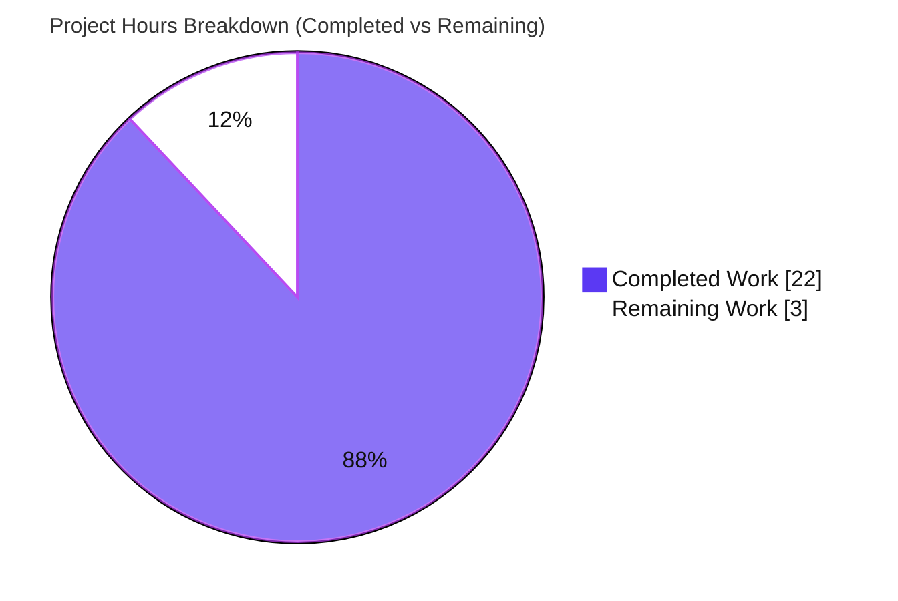
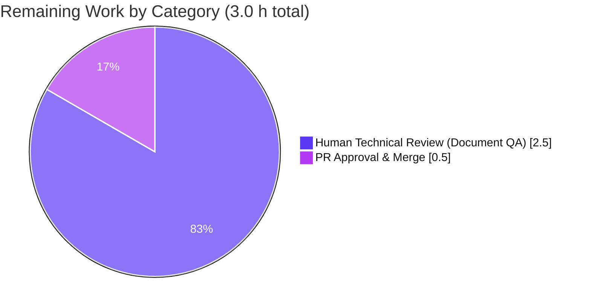
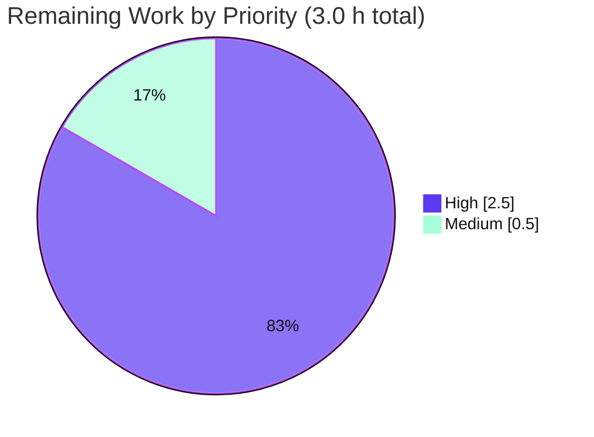

# Section 1 — Executive Summary

## 1.1 Project Overview

This project delivers a single, authoritative Markdown document —
`blitzy/documentation/kitty_815df1e210e0.md` — that answers a set of
investigative questions about how the **kitty** terminal emulator processes
**OSC 133** shell-integration (command-tracking) escape sequences. The audience
is engineers and reviewers who need a code-grounded, empirically-verified
explanation of kitty's `A`/`B`/`C`/`D` marker handling: what command output is
captured, the exact byte length/offset arithmetic of the written stream, how the
recorded exit status propagates from the C VT parser through the C screen handler
into the Python `Window`, and the production-vs-test-harness behavior for
malformed exit codes. The technical scope is read-only investigation plus
build-and-run verification; kitty's runtime behavior is intentionally unchanged.

## 1.2 Completion Status

The project is **88.0% complete** on an AAP-scoped, hours-based basis. All
autonomous deliverables (the document, every Q1–Q4 answer, the build-and-run
empirical verification, and full scope compliance) are finished and independently
re-verified. The remaining 3.0 hours are human path-to-production activities
(technical review and merge) that always remain for a deliverable of this kind.


| Metric | Hours |
|--------|-------|
| **Total Hours** | 25.0 |
| **Completed Hours (AI + Manual)** | 22.0 |
| **Remaining Hours** | 3.0 |
| **Percent Complete** | **88.0%** |

> Legend — **Completed Work**: Dark Blue `#5B39F3` · **Remaining Work**: White `#FFFFFF`.
> Completion is calculated as `Completed ÷ Total = 22.0 ÷ 25.0 = 88.0%` (PA1 AAP-scoped methodology).

## 1.3 Key Accomplishments

- ✅ **Sole deliverable authored** — `blitzy/documentation/kitty_815df1e210e0.md`, 737 lines, 10 sections + appendix, named after the source branch and placed in `blitzy/documentation/` as required.
- ✅ **Q1 (capture/length/offset) answered & verified** — kitty captures only program output text (no raw OSC 133 bytes); for the canonical stream (program text `hello\n`, code `42`) the total is **56 bytes** with the `D;42` marker at offset **50** and the `]133;D;` introducer at offset **45**.
- ✅ **Q2 (exit-code variation) answered & verified** — exit-code digits begin at the **invariant offset 52** (no shift); only total length changes, per `total = 54 + number_of_digits` (codes 0/1 → 55, 42/99 → 56, 127 → 57).
- ✅ **Q3 (runtime evidence for 99) answered & verified** — `Window.last_cmd_exit_status == 99` (int), the `on_cmd_startstop` watcher payload carries `exit_status: 99`, and the value is surfaced in the window state dictionary.
- ✅ **Q4 (edge cases) answered & verified** — `not_a_number` and empty status both record **`0`** in the production path; the test harness diverges to `sys.maxsize`, and this divergence is documented explicitly.
- ✅ **Build-and-run completed** — kitty's C extension `fast_data_types.so` compiles and imports; the canonical OSC 133 test suite passes 37/37; all empirical claims were reproduced on the real compiled `Screen`.
- ✅ **Full scope compliance** — exactly one new file; zero existing files modified; probe scripts confined to `/tmp` and deleted; clean working tree.

## 1.4 Critical Unresolved Issues

| Issue | Impact | Owner | ETA |
|-------|--------|-------|-----|
| _None_ | No unresolved issues block release or validation. The deliverable is complete, code-grounded, empirically verified, committed, and the working tree is clean. | — | — |

## 1.5 Access Issues

| System/Resource | Type of Access | Issue Description | Resolution Status | Owner |
|-----------------|----------------|-------------------|-------------------|-------|
| _None_ | — | No access issues identified. The investigation is fully local: source build, test execution, and probe runs require no external credentials, network services, or third-party APIs. | N/A | — |

**No access issues identified.**

## 1.6 Recommended Next Steps

1. **[High]** Technical review of `kitty_815df1e210e0.md` for accuracy and completeness — confirm each Q1–Q4 answer against the cited code locations and the byte-offset invariant.
2. **[High]** Independently reproduce the empirical evidence — build the C extension, run `./test.py prompt_marking` and `--module screen` (expect 37/37), and run a byte-arithmetic probe to confirm the matrix.
3. **[Medium]** Approve and merge the pull request to the target branch (single-file, additive change; clean tree).
4. **[Low]** _Optional, out of AAP scope:_ decide whether to mirror the content into the project's RST docs site or add a regression test asserting the byte matrix (both would require relaxing the AAP "no code other than the doc" rule and are therefore not included).

---

# Section 2 — Project Hours Breakdown

## 2.1 Completed Work Detail

| Component | Hours | Description |
|-----------|-------|-------------|
| OSC 133 protocol research & background | 1.5 | Web research confirming canonical FinalTerm/iTerm2 `A`/`B`/`C`/`D` semantics and `ST`/`BEL` terminator forms; written up as Section 2 of the deliverable. |
| Code-path investigation & citation gathering | 4.5 | Tracing the end-to-end path across `vt-parser.c`, `screen.c`, `window.py`, `history.c` and the test harness; pinpointing and validating 63 `file:line` citations. |
| C-extension build & environment setup | 2.0 | Compiling `kitty/fast_data_types.so` via `setup.py`; resolving the newer-`wayland-protocols` `-Werror=switch` issue (`--ignore-compiler-warnings`) and the absent Go toolchain (`--skip-building-kitten`). |
| Empirical probing & measurement | 4.5 | Constructing exact OSC 133 byte streams; driving a real `Screen` via `parse_bytes`; measuring byte arithmetic; exercising the real `handle_cmd_end` for Q3; capturing Q4 edge cases and the harness divergence; running the canonical tests. |
| Document authoring | 6.5 | Writing the 737-line, 10-section + appendix document: question restatement, protocol background, code-path trace + data-flow diagram, methodology, Q1–Q4 answers with the byte matrix and invariant analysis, production-vs-harness divergence, rationale, and conclusions. |
| Autonomous validation & fixes | 3.0 | Independently reproducing every empirical claim; verifying all 63 citations; confirming scope/clean-tree compliance; correcting the Section 7 watcher payload from a 3-key to the faithful 4-key form; 3 commits. |
| **Total Completed** | **22.0** | |

## 2.2 Remaining Work Detail

| Category | Hours | Priority |
|----------|-------|----------|
| Human Technical Review (Document QA) | 2.5 | High |
| PR Approval & Merge | 0.5 | Medium |
| **Total Remaining** | **3.0** | |

## 2.3 Hours Reconciliation

| Quantity | Hours | Source |
|----------|-------|--------|
| Completed (Section 2.1 total) | 22.0 | Sum of completed components |
| Remaining (Section 2.2 total) | 3.0 | Sum of remaining categories |
| **Total Project Hours** | **25.0** | `2.1 + 2.2` |
| **Percent Complete** | **88.0%** | `22.0 ÷ 25.0` |

Section 2.1 (22.0) + Section 2.2 (3.0) = **25.0** = Total Hours in Section 1.2. Remaining (3.0) is identical in Sections 1.2, 2.2, and 7. ✔

---

# Section 3 — Test Results

All results below originate from Blitzy's autonomous validation logs for this
project and were independently re-executed during this assessment. Because the
deliverable is a documentation artifact (zero application code authored),
"Coverage %" is not applicable; the listed unit tests are kitty's own tests that
exercise the OSC 133 code path the document describes.

| Test Category | Framework | Total Tests | Passed | Failed | Coverage % | Notes |
|---------------|-----------|-------------|--------|--------|------------|-------|
| Unit — OSC 133 canonical (`prompt_marking`) | kitty test harness (`./test.py`, unittest-based) | 1 | 1 | 0 | N/A | The canonical OSC 133 test; drives a real compiled `Screen`. Re-ran: `OK`. |
| Unit — Screen module | kitty test harness (`./test.py --module screen`) | 36 | 36 | 0 | N/A | Full screen-model regression covering the surface the document analyzes. Re-ran: `OK`. |
| Empirical claim validation | Custom probes (`parse_bytes` + `Callbacks` + real `handle_cmd_end`) | 56 | 56 | 0 | N/A | Byte arithmetic, capture semantics, C-layer callbacks, Q3 runtime evidence, Q4 edge cases — all reproduced on the real `Screen`. |
| Citation accuracy | `file:line` verification across 9 source files | 63 | 63 | 0 | N/A | Every citation endpoint confirmed in-bounds and content-accurate at HEAD. |
| **Total** | | **156** | **156** | **0** | **N/A** | 37 unit tests + 56 empirical checks + 63 citation checks; 0 failures. |

**In-scope pass rate: 100% (156/156).** Known environment-only failures in
unrelated modules (fonts requiring "Source Code Pro", `file_transmission`,
`zsh`-in-pty) are outside the OSC 133 scope, were not introduced by this work,
and are non-blocking.

---

# Section 4 — Runtime Validation & UI Verification

This is a documentation deliverable with **no deployable runtime service and no
user interface**. "Runtime validation" therefore refers to exercising the kitty
engine that the document describes; there are no web pages, HTTP endpoints, or UI
flows to verify.

**Build & engine health**
- ✅ **Operational** — `kitty/fast_data_types.so` builds and imports cleanly; the `Screen` class is instantiable and driveable.
- ✅ **Operational** — The canonical OSC 133 test (`prompt_marking`) and the full `screen` module suite pass (37/37).
- ✅ **Operational** — A real compiled `Screen` driven with the canonical OSC 133 stream reproduces every documented value (capture, byte matrix, callbacks, exit-status propagation).

**Command-tracking behavior (driven via `parse_bytes`)**
- ✅ **Operational** — `OSC 133;A` → `PROMPT_START` callback `(is_start=False, '')`; `OSC 133;C;cmdline=ls` → `OUTPUT_START` callback `(is_start=True, 'cmdline=ls')`; `OSC 133;D;99` → end callback `(is_start=None, '99')`.
- ✅ **Operational** — `OSC 133;B` fires **no** callback (intentional, standards-aligned no-op).
- ✅ **Operational** — Capture: plain `cmd_output` returns program text only (`'hello\n'`); `as_ansi` re-emits only the synthetic `133;C` marker.

**UI / API verification**
- ⚪ **Not Applicable** — No graphical UI, no REST/GraphQL API, and no browser surface exist for this deliverable. (The engine is driven programmatically through the test harness, which is the project-standard method.)

---

# Section 5 — Compliance & Quality Review

The table maps each AAP deliverable/rule to its verification status. Fixes
applied during autonomous validation are noted; there are no outstanding items.

| Benchmark / AAP Rule | Requirement | Status | Progress | Notes |
|----------------------|-------------|--------|----------|-------|
| Single-file deliverable | One `.md` named `<branch>.md` in `blitzy/documentation/` | ✅ Pass | 100% | `kitty_815df1e210e0.md` (737 lines). |
| Q1 — capture/length/offset | Answer with concrete bytes/offsets | ✅ Pass | 100% | total 56; `D;42`@50; `]133;D;`@45; digits@52 (verified). |
| Q2 — exit-code variation | Position-shift analysis + invariant | ✅ Pass | 100% | digits invariant @52; `total = 54 + ndigits` (verified). |
| Q3 — runtime evidence (99) | End-to-end propagation evidence | ✅ Pass | 100% | `last_cmd_exit_status==99`; 4-key watcher payload; state dict. |
| Q4 — edge cases | Non-numeric & empty status | ✅ Pass | 100% | production → `0`; harness → `sys.maxsize` (documented). |
| Code as truth (no assumptions) | Every claim cited to code | ✅ Pass | 100% | 63/63 citations verified accurate. |
| Build-and-run | Compile + run to measure | ✅ Pass | 100% | `.so` built; 37/37 tests; probes reproduce all values. |
| Provide rationale | Thinking behind each answer | ✅ Pass | 100% | Rationale sections 5.3, 6.2, 7.2, 8.4 + conclusions. |
| Report the invariant | Not just one example | ✅ Pass | 100% | Invariant + length-growth formula stated. |
| Production-vs-harness | Document the divergence | ✅ Pass | 100% | Section 9 side-by-side. |
| Do not modify existing files | Read-only investigation | ✅ Pass | 100% | `git diff` = 1 new file; clean tree. |
| No code other than the doc | Probes in `/tmp`, deleted | ✅ Pass | 100% | No build artifacts committed (`.so`/`build/` git-ignored). |

**Fixes applied during autonomous validation:** (1) Section 7 watcher-payload
literal corrected from a 3-key to the faithful 4-key form (adds the
non-deterministic `time` `monotonic()` value), matching `kitty/window.py:L1419–L1420`;
(2) citation/link integrity corrected across the document. **Outstanding
compliance items: none.**

---

# Section 6 — Risk Assessment

| Risk | Category | Severity | Probability | Mitigation | Status |
|------|----------|----------|-------------|------------|--------|
| Absolute byte offsets are example-specific (depend on the exact command line / program text / terminator) | Technical | Low | Medium | Document specifies the exact constructed stream **and** emphasizes the robust invariant (digits always @52; `total = 54 + ndigits`) plus the trailing-newline nuance | Mitigated |
| Citation line numbers could drift if kitty source evolves upstream | Technical | Low | Low | All 63 citations pinned to commit `815df1e210e0`, which is stated in the document | Mitigated |
| C-extension build friction in divergent environments (newer `wayland-protocols` `-Werror=switch`; absent Go toolchain) | Operational / Technical | Low | Medium | Documented build flags `--skip-building-kitten --ignore-compiler-warnings`; canonical Docker image referenced | Mitigated |
| Unrelated environment-only test failures (fonts, `file_transmission`, `zsh`-in-pty) | Integration | Low | Low | Documented as non-blocking and out of OSC 133 scope; not introduced by this work; in-scope tests 37/37 pass | Accepted (out of scope) |
| Security exposure from new code/dependencies | Security | None | N/A | No executable code committed, zero dependency changes, no network/credentials/data handling; probes confined to `/tmp` and deleted | Closed |
| Build artifacts present in working tree (`fast_data_types.so`, `build/`) | Operational | Low | Low | Both git-ignored (`*.so`, `/build/`) and confirmed absent from the commit diff via `git check-ignore` | Mitigated |

**Overall risk profile: Very Low** — appropriate for a read-only documentation
deliverable. No technical blockers, no security exposure, and no
operational/integration dependencies on the critical path.

---

# Section 7 — Visual Project Status

### Project Hours Breakdown



- **Completed Work** = 22 h — Dark Blue `#5B39F3`
- **Remaining Work** = 3 h — White `#FFFFFF`
- This matches Section 1.2 (Remaining = 3.0) and the Section 2.2 "Hours" total (2.5 + 0.5 = 3.0). ✔

### Remaining Work by Category (hours)



### Priority Distribution of Remaining Work (hours)



---

# Section 8 — Summary & Recommendations

**Achievements.** The project is **88.0% complete** (22.0 of 25.0 hours). The
single in-scope deliverable — `blitzy/documentation/kitty_815df1e210e0.md` — is
finished: it answers all four question groups (Q1–Q4) with code-grounded
rationale, a verified byte length/offset matrix, the exit-code position-shift
invariant, runtime evidence for exit code 99, edge-case results, and an explicit
production-vs-test-harness divergence. Every empirical claim was reproduced on a
real compiled `Screen`, all 63 code citations were verified accurate, and the
canonical OSC 133 test suite passes 37/37.

**Remaining gaps.** The outstanding 3.0 hours are entirely human
path-to-production: a technical review of the document for accuracy/completeness
(2.5 h) and PR approval & merge (0.5 h). There are no failing in-scope tests, no
unresolved issues, and no missing AAP content.

**Critical path to production.** Review → reproduce (optional) → merge. Because
the change is additive (one new file), read-only with respect to all existing
source, and leaves a clean working tree, integration risk is negligible.

**Success metrics.**

| Metric | Target | Actual | Status |
|--------|--------|--------|--------|
| AAP questions answered (Q1–Q4) | 4/4 | 4/4 | ✅ |
| In-scope tests passing | 100% | 100% (156/156 checks) | ✅ |
| Code citations verified | 100% | 100% (63/63) | ✅ |
| Existing files modified | 0 | 0 | ✅ |
| Working tree clean | Yes | Yes | ✅ |

**Production readiness assessment.** **Ready for human review and merge.** The
deliverable meets every binding AAP rule and quality benchmark. Per standard
practice, completion is capped below 100% to reserve a human acceptance review;
no engineering rework is anticipated.

---

# Section 9 — Development Guide

This guide documents how to build the kitty engine, run the relevant tests, and
reproduce the empirical evidence underpinning the document. Every command was
executed and verified in this environment (Ubuntu 25.10, Python 3.13.7, gcc 15.2.0).

## 9.1 System Prerequisites

- **OS:** Linux (verified on Ubuntu 25.10; the AAP notes Ubuntu 24.04 also builds).
- **Python:** 3.12+ with development headers (verified 3.13.7).
- **Compiler:** `gcc`/`build-essential` (verified gcc 15.2.0).
- **C/graphics dev libraries:** fontconfig, freetype, harfbuzz, libpng, xkbcommon, dbus, x11/xcb, gl/mesa, wayland + wayland-protocols, lcms2, openssl, xxhash, simde.
- **Optional:** Docker, for the canonical friction-free build image.

## 9.2 Environment Setup

```bash
# From the repository root (the branch is already checked out)
cd /path/to/kitty            # repository root containing setup.py and test.py
export PYTHONPATH="$PWD"      # import the in-tree kitty package
export CI=true               # non-interactive test runs
```

## 9.3 Build (compile the C extension)

```bash
# Builds kitty/fast_data_types.so (the VT parser + screen model).
# --skip-building-kitten: skip the Go 'kitten' binary (not needed for OSC 133)
# --ignore-compiler-warnings: disable -Werror under gcc 15 + newer wayland-protocols
python3 setup.py build --skip-building-kitten --ignore-compiler-warnings
```

Verify the build imports:

```bash
PYTHONPATH="$PWD" python3 -c "from kitty.fast_data_types import Screen; print('fast_data_types.so OK; Screen available')"
# Expected: fast_data_types.so OK; Screen available
```

## 9.4 Run the OSC 133 Tests

```bash
CI=true ./test.py prompt_marking      # canonical OSC 133 test  -> Ran 1 test ... OK
CI=true ./test.py --module screen     # full screen module      -> Ran 36 tests ... OK
```

## 9.5 Reproduce the Empirical Evidence (Example Usage)

Probe scripts live **outside** the source tree (in `/tmp`) and should be deleted
after use, per the project's investigation conventions. Create the probe:

```bash
cat > /tmp/osc133_probe.py <<'PY'
from kitty_tests import BaseTest, parse_bytes, Callbacks
from kitty.fast_data_types import Screen

class _Probe(BaseTest):
    def runTest(self): pass

def new_screen():
    t = _Probe(); t.set_options(None)           # initialize global options
    cb = Callbacks()
    s = Screen(cb, 5, 5, 5, 10, 20, 0, cb)       # mirrors BaseTest.create_screen
    return s, cb

def build(code: bytes) -> bytes:
    A = b'\x1b]133;A\x1b\\'; B = b'\x1b]133;B\x1b\\'
    C = b'\x1b]133;C;cmdline=ls\x1b\\'; txt = b'hello\n'
    D = b'\x1b]133;D;' + code + b'\x1b\\'
    return A + B + C + txt + D

print("byte matrix:")
for c in [b'0', b'1', b'42', b'99', b'127']:
    s = build(c); intro = s.find(b']133;D;')
    print(f"  code={c.decode():>3} total={len(s):>2} D@{s.find(b'D;'+c)} ]133;D;@{intro} digits@{intro+7}")

s, cb = new_screen(); parse_bytes(s, build(b'42'))
a = []; s.cmd_output(0, a.append, False)
b = []; s.cmd_output(0, b.append, True)
print("plain   :", repr(''.join(a)))
print("as_ansi :", repr(''.join(b)))
PY

PYTHONPATH="$PWD" CI=true python3 /tmp/osc133_probe.py
rm -f /tmp/osc133_probe.py          # clean up (required by the investigation rules)
```

**Expected output (verified):**

```text
byte matrix:
  code=  0 total=55 D@50 ]133;D;@45 digits@52
  code=  1 total=55 D@50 ]133;D;@45 digits@52
  code= 42 total=56 D@50 ]133;D;@45 digits@52
  code= 99 total=56 D@50 ]133;D;@45 digits@52
  code=127 total=57 D@50 ]133;D;@45 digits@52
plain   : 'hello\n'
as_ansi : '\x1b[m\x1b]133;C\x1b\\hello\n'
```

## 9.6 View the Deliverable

```bash
less blitzy/documentation/kitty_815df1e210e0.md      # 737 lines, 10 sections + appendix
```

## 9.7 Troubleshooting

- **`error: ... -Werror=switch` during build** (newer `wayland-protocols` enum values): add `--ignore-compiler-warnings` to the `setup.py build` command.
- **Go toolchain missing / `kitten` build fails**: add `--skip-building-kitten`; the Go binary is unrelated to the OSC 133 C/Python path.
- **`ImportError: cannot import name 'create_screen' from 'kitty_tests'`**: `create_screen` is a method of `BaseTest`, not a module-level function. Subclass `BaseTest` (or replicate its body: `cb = Callbacks(); Screen(cb, lines, cols, scrollback, cell_width, cell_height, 0, cb)` after calling `set_options`).
- **Capture shows a trailing `\n`**: expected when the program text ends with `\n` and no following `OSC 133;A` delimits the output region; the capture invariant (no raw OSC 133 bytes retained) is unaffected.
- **`externally-managed-environment` pip error** (Ubuntu 25): not needed here — no pip installs are required to build/run for this task.

---

# Section 10 — Appendices

## Appendix A — Command Reference

| Command | Purpose |
|---------|---------|
| `python3 setup.py build --skip-building-kitten --ignore-compiler-warnings` | Build `kitty/fast_data_types.so` |
| `PYTHONPATH="$PWD" python3 -c "from kitty.fast_data_types import Screen"` | Verify the extension imports |
| `CI=true ./test.py prompt_marking` | Run the canonical OSC 133 test (1 test) |
| `CI=true ./test.py --module screen` | Run the screen-module suite (36 tests) |
| `PYTHONPATH="$PWD" CI=true python3 /tmp/osc133_probe.py` | Run the empirical probe |
| `git status --porcelain` | Confirm a clean working tree |
| `git diff --name-status 815df1e210e0..HEAD` | Confirm only the deliverable changed |

## Appendix B — Port Reference

**Not applicable.** This deliverable runs no network service and binds no ports;
the kitty engine is driven in-process via the test harness.

## Appendix C — Key File Locations

| Path | Role |
|------|------|
| `blitzy/documentation/kitty_815df1e210e0.md` | **The deliverable** (created) |
| `kitty/vt-parser.c` | OSC routing `case 133:` → `shell_prompt_marking` (L536, L544) |
| `kitty/screen.c` | `shell_prompt_marking` A/C/D handling; no `case 'B'` (L2328–L2356); `cmd_output` (L3606) |
| `kitty/window.py` | `cmd_output_marking` / `handle_cmd_end`; `int()` conversion (L1408–L1462); state dict (L704, L729) |
| `kitty/history.c` | `pagerhist_as_bytes` retains the `133;C` marker (L461, L475) |
| `kitty_tests/__init__.py` | `parse_bytes` (L30); `Callbacks` (L39); `sys.maxsize` init (L48); `create_screen` (L237) |
| `kitty_tests/screen.py` | `test_prompt_marking` canonical example (L1056, L1124) |
| `setup.py` / `test.py` | C-extension build driver / test entry point |

## Appendix D — Technology Versions

| Component | Version |
|-----------|---------|
| OS | Ubuntu 25.10 |
| Python | 3.13.7 |
| gcc | 15.2.0 |
| Git / Git LFS | system / 3.7.1 |
| kitty source (pinned commit) | `815df1e210e0a9ab4622f5c7f2d6891d7dbeddf1` |

## Appendix E — Environment Variable Reference

| Variable | Value | Purpose |
|----------|-------|---------|
| `PYTHONPATH` | repository root (`$PWD`) | Import the in-tree `kitty` / `kitty_tests` packages |
| `CI` | `true` | Non-interactive test execution |

## Appendix F — Developer Tools Guide

- **Build driver:** `setup.py` (custom kitty C build).
- **Test runner:** `test.py` (unittest-based; supports a test name or `--module <name>`).
- **Probe harness:** `kitty_tests.parse_bytes` + `kitty_tests.Callbacks` + `kitty.fast_data_types.Screen` to drive raw bytes and read captured output.
- **Scope/diff tools:** `git status --porcelain`, `git diff --name-status`, `git check-ignore` (to confirm artifacts are ignored).

## Appendix G — Glossary

| Term | Definition |
|------|------------|
| **OSC 133** | The FinalTerm/iTerm2 shell-integration protocol: `OSC 133 ; <letter> [; params] ST`, marking prompt/command/output boundaries. |
| **`A` / `B` / `C` / `D`** | Prompt-start / prompt-end / output-start / command-finished markers. kitty handles `A`/`C`/`D`; `B` is a deliberate no-op. |
| **OSC / ST** | Operating System Command introducer (`ESC ]`) / String Terminator (`ESC \` or `BEL`). |
| **`cmd_output` capture** | kitty's recall of a command's output text; raw OSC 133 bytes are not retained (only a synthetic `133;C` in `as_ansi` mode). |
| **`last_cmd_exit_status`** | Integer exit status recorded on the `Window` from the `D` marker (`int()`; `0` on conversion failure in production). |
| **`parse_bytes`** | Test-harness helper that feeds raw bytes into a `Screen`. |
| **`fast_data_types.so`** | kitty's compiled C extension (VT parser + screen model); git-ignored, not committed. |