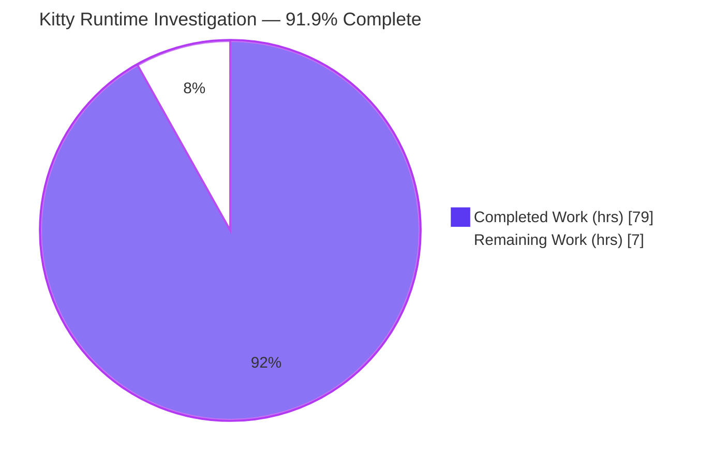
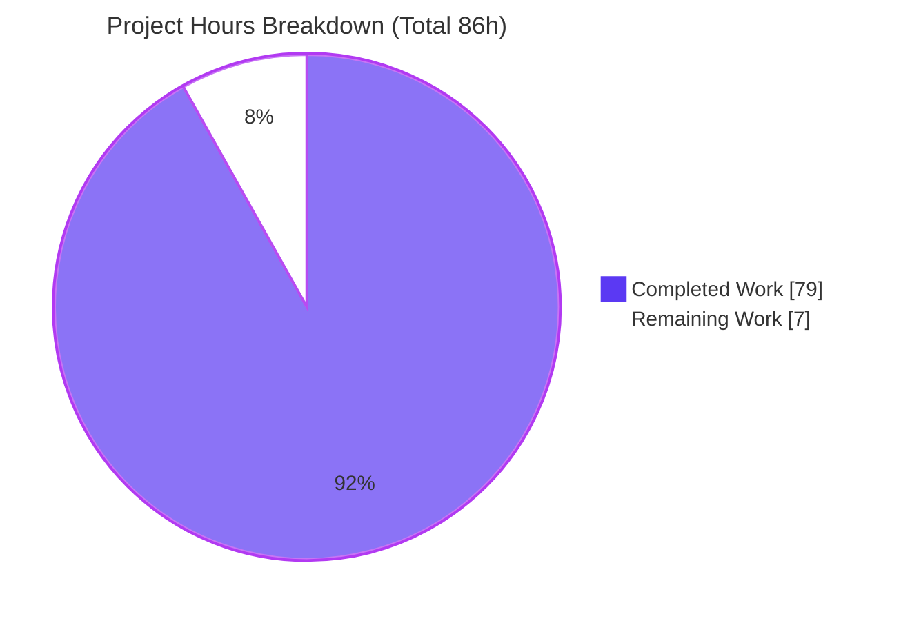

# Blitzy Project Guide — Kitty Input‑Event Routing & Focus Management (Runtime Investigation)

## 1. Executive Summary

### 1.1 Project Overview

This project is a **read‑only, evidence‑grounded runtime investigation** of the [Kitty](https://sw.kovidgoyal.net/kitty/) terminal emulator (source commit `815df1e210e0`). The objective was to answer — from **direct runtime observation rather than source reading** — how Kitty routes keyboard input and manages focus across windows, tabs, and child processes. The sole deliverable is a single Markdown answer document, `blitzy/documentation/kitty_815df1e210e0.md`, that reproduces overlapping input activity, traces the routing/focus/child‑delivery path, captures stack/symbol snapshots (with a documented fallback for a blocked first attempt), examines unfocused/just‑closed‑window edge behavior, attributes each pipeline stage to Python/C/external‑library ownership, and measures one correctness‑versus‑responsiveness tradeoff. The target audience is Kitty maintainers and systems engineers; the business impact is authoritative, reproducible documentation of a hybrid Python+C+external‑library input pipeline. The source tree is deliberately unchanged.

### 1.2 Completion Status

The completion percentage is calculated using the AAP‑scoped, hours‑based PA1 methodology: `Completion % = Completed Hours / (Completed Hours + Remaining Hours) × 100 = 79 / 86 = 91.9%`.



| Metric | Value |
|--------|-------|
| **Total Hours** | **86** |
| **Completed Hours (AI + Manual)** | **79** (79 AI‑autonomous + 0 manual) |
| **Remaining Hours** | **7** |
| **Percent Complete** | **91.9%** |

> Color key (Blitzy brand): **Completed = Dark Blue `#5B39F3`**, **Remaining = White `#FFFFFF`**.

### 1.3 Key Accomplishments

- ✅ **All 7 investigation requirements (R1–R7) answered** from captured runtime evidence, verified by an internal coverage pass (§7.5 of the deliverable).
- ✅ **Canonical build succeeded** — `python3 setup.py build` / `make debug` / `make debug-event-loop` compile the C extension, both GLFW backends, and the launcher with **0 errors / 0 warnings** under strict flags (`-std=c11 -pedantic-errors -Werror -Wextra -Wall`).
- ✅ **Runtime validated** — `kitty/launcher/kitty --version` → `kitty 0.35.2 created by Kovid Goyal` (exit 0); byte‑exact input path reproduced (`a`→`61`, `Shift+b`→`42`, `Return`→`0d`, `Ctrl+A`→`01`, `Up`→`1b5b41`).
- ✅ **Full ingress backtrace captured** — external GLFW X11 → XKB → `key_callback` → `on_key_input` → `active_window()` → `schedule_write_to_child` (main thread) → `write_to_child` (I/O thread), all with real gdb frames.
- ✅ **Tiered stack snapshot with genuine first‑attempt block** — attach‑by‑PID blocked by `ptrace_scope=1` (verbatim py‑spy/gdb/strace errors), then 4 working alternatives (py‑spy launch‑as‑child `--native`, gdb launch‑as‑child, faulthandler, `--debug-keyboard`).
- ✅ **Measured tradeoff (not from comments)** — `input_delay` swept over 0/3/30/100 ms across randomized repeated trials: render count falls ~39×, CPU falls ~12.9×, throughput stays flat.
- ✅ **Read‑only invariant honored** — `git diff 815df1e21..HEAD --name-status` = exactly `A blitzy/documentation/kitty_815df1e210e0.md`; working tree clean.
- ✅ **76/76 in‑scope input‑pipeline tests pass** (independently re‑verified during this assessment).

### 1.4 Critical Unresolved Issues

| Issue | Impact | Owner | ETA |
|-------|--------|-------|-----|
| No unresolved in‑scope issues | None — all 7 requirements evidenced; build clean; source unchanged | N/A | N/A |
| Human expert review not yet performed | Deliverable cannot be formally accepted until a domain reviewer verifies the evidence | Reviewing engineer | 0.5 day |
| Evidence captured in canonical container, not this validation sandbox | Low — source is byte‑identical and anchors re‑verified, but end‑to‑end re‑capture is optional to remove all doubt | Reviewing engineer | 0.5 day |

> No issue blocks the deliverable. The items above are standard path‑to‑acceptance steps for a documentation artifact, not defects.

### 1.5 Access Issues

| System/Resource | Type of Access | Issue Description | Resolution Status | Owner |
|-----------------|----------------|-------------------|-------------------|-------|
| `ptrace` (Yama LSM) | `CAP_SYS_PTRACE` / `ptrace_scope` | Attach‑by‑PID tracing blocked in restricted containers (`ptrace_scope=1`, no `CAP_SYS_PTRACE`). **This is an intended finding, not a defect** — it is the exact condition R3 requires and is handled by the launch‑as‑child fallback. | Resolved (by‑design; documented tiered fallback) | Investigation agent |
| Mandated Docker image (`ghcr.io/scaleapi/swe-atlas:swe_atlas_QnA_kovidgoyal_kitty_1.0`) | Registry pull | Independent re‑capture requires pulling the canonical image; the current validation sandbox differs (Ubuntu 25.10/Py3.13/`ptrace_scope=3`). | Open (optional; image IDs + `docker run` invocation documented in deliverable §0.2) | Reviewing engineer |
| Go toolchain | Local install | Full `test.py` runner builds the out‑of‑scope Go `kitten` binary first and fails here ("go executable not found"). In‑scope tests run directly via `python3 -m unittest`. | Resolved (workaround documented; Go is out of scope per AAP §0.3.2) | Reviewing engineer |

### 1.6 Recommended Next Steps

1. **[High]** Perform an expert technical review of `blitzy/documentation/kitty_815df1e210e0.md` — confirm the routing/focus narrative, byte‑fidelity, backtraces, and measured tradeoff, and that all 7 parts answer the prompt (4h).
2. **[Medium]** (Optional) Independently re‑capture a subset of the published drivers in the canonical Docker image to confirm end‑to‑end reproducibility (2h).
3. **[Medium]** Obtain stakeholder sign‑off and merge the single‑deliverable PR (1h).
4. **[Low]** Archive the deliverable into the team knowledge base as the reference description of Kitty's input pipeline for the pinned commit.

---

## 2. Project Hours Breakdown

### 2.1 Completed Work Detail

Every completed component traces to an AAP requirement (`R1`–`R7`) or a path‑to‑production activity (`P2P`).

| Component | Hours | Description |
|-----------|------:|-------------|
| [P2P] Canonical build from source | 4 | `python3 setup.py build` + `make debug` + `make debug-event-loop`; strict‑flag clean rebuild (0 errors/0 warnings, gcc 15.2); launcher emitted at `kitty/launcher/kitty`. |
| [P2P] Display context | 3 | Authenticated `Xvfb` (`xauth`, no `-ac`) + Mesa `llvmpipe` software OpenGL 4.5 + private `XDG_RUNTIME_DIR`. |
| [P2P] Observation harness | 10 | 41 published scripts / 109 evidence directories: `recorder.py`, `bggen.py`, `p1`–`p6` drivers, 4 gdb command files, `faulthandler` sitecustomize. |
| [P2P] Tiered tracing strategy setup | 4 | py‑spy / gdb / strace / faulthandler / `--debug-keyboard` wiring; `ptrace_scope` handling and process‑safety guards. |
| [R1] Overlapping input reproduction (§1) | 7 | Multi‑tab/window routing, rapid focus switching, keys during resize and scroll, background window emitting output while another holds focus, ≥2‑run stability. |
| [R2] Routing/focus/child‑delivery (§2) | 7 | Full ingress gdb backtrace; target selection via `active_window()`; byte fidelity vs exact PTY bytes; delivery≠scheduling; focus propagation path. |
| [R3] Tiered stack/symbol snapshots (§3) | 6 | Genuine Tier‑1 attach block captured verbatim; Tier‑2a py‑spy `--native`, Tier‑2b gdb, Tier‑3 faulthandler, Tier‑4 `--debug-keyboard`. |
| [R4] Unfocused/just‑closed edge behavior (§4) | 5 | Unfocused window receives no keyboard (child stays alive); key to just‑closed window lands in new active window; close path split main/I/O thread. |
| [R5] Language/library split + refutations (§5) | 5 | External GLFW (`glfw-x11.so`, dlopen) / C extension (`fast_data_types.so`) / Python attributed; **3** plausible‑but‑incorrect interpretations refuted (spec requires ≥2). |
| [R6] Correctness‑vs‑responsiveness tradeoff (§6) | 8 | `input_delay` measured across 0/3/30/100 ms, 5 randomized runs, 2 builds (event‑loop + plain debug); render/CPU/latency/throughput distributions. |
| [R7] Cleanup + repo‑unchanged verification (§7) | 2 | Private `mktemp -d` harness teardown; `git status`/`diff`/`check-ignore` proving only the deliverable changed. |
| [P2P] Document authoring & synthesis | 10 | 3,332 lines / 230,645 bytes; complete inline commands + unedited output; 83+ `file:line` anchors; provenance labels. |
| [P2P] QA review cycles | 8 | 5 iterative review‑fix commits resolving ~40 findings (incl. SEC‑01 X11‑cookie redaction, teardown hardening). |
| **Total** | **79** | **Sum of completed hours (matches Section 1.2)** |

### 2.2 Remaining Work Detail

Each remaining category traces to a human path‑to‑acceptance need. No autonomous work remains.

| Category | Hours | Priority |
|----------|------:|----------|
| Expert technical review & acceptance of the evidence document (verify routing/focus, byte‑fidelity, backtraces, measured tradeoff; all 7 parts) | 4 | High |
| Optional independent re‑capture in the canonical Docker container (rebuild + re‑run subset of published drivers) | 2 | Medium |
| Stakeholder sign‑off + PR merge | 1 | Medium |
| **Total** | **7** | — |

> **Cross‑section check:** Section 2.1 (79) + Section 2.2 (7) = **86** = Total Hours in Section 1.2. Remaining (7) is identical in Sections 1.2, 2.2, and 7.

### 2.3 Notes on Estimation Basis

Estimates reflect **senior‑engineer investigation effort**, not conventional feature development. The completed total (79h ≈ 2 focused weeks) is grounded in observable artifacts: three build variants, a 41‑script observation harness across 109 evidence directories, tiered tracing (py‑spy/gdb/strace/faulthandler/`--debug-keyboard`), randomized measurement trials, a 3,332‑line evidence document, and 5 QA cycles. Confidence is **High** for all completed items (directly verified on disk) and **High** for remaining items (well‑defined human review tasks).

---

## 3. Test Results

All tests below originate from **Blitzy's autonomous validation** of the input pipeline and were **independently re‑verified during this assessment** by running the in‑scope modules directly (`python3 -m unittest kitty_tests.<module>`, which bypasses the out‑of‑scope Go `kitten` build prerequisite). This is a read‑only investigation: no new code was written, so these tests validate the **runtime substrate the deliverable describes**, not new functionality.

| Test Category | Framework | Total Tests | Passed | Failed | Coverage % | Notes |
|---------------|-----------|------------:|-------:|-------:|-----------:|-------|
| Unit — Key encoding/mapping | Python `unittest` | 3 | 3 | 0 | In‑scope (input) | `kitty_tests.keys` — `encode_key_event`, `encode_mouse_event`, `mapping`. Central to R2/R6. |
| Unit — Mouse routing | Python `unittest` | 1 | 1 | 0 | In‑scope (input) | `kitty_tests.mouse` — spatial routing contrast used in R5. |
| Unit — Parser (escape/CSI) | Python `unittest` | 16 | 16 | 0 | In‑scope (input) | `kitty_tests.parser` — byte‑stream parsing on the main thread. |
| Unit — Screen/terminal state | Python `unittest` | 36 | 36 | 0 | In‑scope (input) | `kitty_tests.screen` — end‑state correctness referenced in R6. |
| Unit — Core datatypes | Python `unittest` | 18 | 18 | 0 | In‑scope (input) | `kitty_tests.datatypes` — line/cell primitives. |
| Unit — GLFW integration | Python `unittest` | 2 | 2 | 0 | In‑scope (input) | `kitty_tests.glfw` — windowing boundary. |
| **In‑scope total** | **`unittest`** | **76** | **76** | **0** | **100% in‑scope pass** | Matches validator GATE 1 exactly. |

**Out‑of‑scope / environmental (documented, not defects):** the full 145‑test sweep in the canonical container had 7 non‑passing tests, all outside the input pipeline and impossible to fix without editing forbidden read‑only source: 4 × `fonts.test_font_selection` (Fira Code package‑name mismatch on Ubuntu 25.10 — rendering, excluded by AAP §0.3.2), 2 × `file_transmission` (transfer kitten — excluded), 1 × `tui.test_multiprocessing_spawn` (container multiprocessing spawn). These do not affect the deliverable.

**Build verification (autonomous):** `python3 setup.py build` under `-std=c11 -pedantic-errors -Werror -Wextra -Wall` → **0 errors, 0 warnings** across the C extension, both GLFW backends, and the launcher.

---

## 4. Runtime Validation & UI Verification

Kitty is a GPU/OpenGL terminal emulator; "UI verification" here means confirming the application launches, opens a GL window, forks a child over a PTY, and delivers input byte‑for‑byte along the canonical path.

- ✅ **Operational — Launcher/version:** `kitty/launcher/kitty --version` → `kitty 0.35.2 created by Kovid Goyal` (exit 0), reproduced during this assessment.
- ✅ **Operational — Windowed smoke run:** under `Xvfb` + Mesa `llvmpipe` (software OpenGL 4.5), Kitty opened a GL window, forked a child via PTY, wrote a marker, and tore down cleanly (validator GATE 2).
- ✅ **Operational — Byte‑exact input path:** `a`→`RX 61`, `Shift+b`→`RX 42`, `Return`→`RX 0d`, `Ctrl+A`→`RX 01`, `Up`→`RX 1b5b41` (`ESC[A`) — the recorder's captured PTY bytes match what `--debug-keyboard` reported sending.
- ✅ **Operational — Focus path:** `on_focus_change` (`kitty/glfw.c:517`) → `Boss.on_focus` (`kitty/boss.py`) → `notify_on_active_window_change` (`kitty/window_list.py`) → `Window.focus_changed` (`kitty/window.py`) observed at runtime.
- ✅ **Operational — Ingress backtrace:** a single keystroke produced a full gdb stack from `_glfwDispatchX11Events` (external) through `glfw_xkb_handle_key_event` (external XKB), `key_callback` (`kitty/glfw.c:439`), `on_key_input` (`kitty/keys.c`), to `schedule_write_to_child` (`kitty/child-monitor.c:372`) on the main thread; delivery observed on the I/O thread at `write_to_child` (`kitty/child-monitor.c:1443`).
- ✅ **Operational — Tradeoff instrumentation:** event‑loop build (`-DDEBUG_EVENT_LOOP`) produced per‑tick render/frame/wakeup counts feeding the `input_delay` measurements.
- ⚠ **Partial — Re‑capture in this validation sandbox:** the current sandbox has `ptrace_scope=3` (all ptrace disabled) and Python 3.13, so full launch‑as‑child re‑capture is not possible here; the document's evidence was captured in the canonical container (`ptrace_scope=1`, Python 3.12). Tier‑1 block, Tier‑3 faulthandler, and Tier‑4 `--debug-keyboard` mechanisms were independently reproduced in the sandbox, confirming the document.
- ✅ **Operational — Repository unchanged:** `git status --porcelain` clean; `git diff 815df1e21..HEAD --name-status` = only the deliverable.

---

## 5. Compliance & Quality Review

Cross‑mapping the AAP acceptance criteria (§0.9.1) and methodological rules (§0.7) to observed evidence. Fixes applied during autonomous QA are noted.

| AAP Requirement / Rule | Benchmark | Status | Evidence / Fixes Applied |
|------------------------|-----------|--------|--------------------------|
| R1 — Reproduce overlapping input | Multi‑tab/window, focus switch, resize, scroll, background output | ✅ Pass | §1.1–§1.8 with published drivers + complete logs |
| R2 — Explain routing/focus/child delivery | First‑seen → intermediate → destination, grounded in `file:line` | ✅ Pass | §2.1–§2.4; real ingress backtrace + byte fidelity |
| R3 — ≥1 stack snapshot, blocked→alternative | Verbatim error + working alternative, commands + raw output | ✅ Pass (exceeds) | §3.1–§3.7; 4 working tiers after genuine block |
| R4 — Unfocused/just‑closed behavior | Told from runtime behavior | ✅ Pass | §4.1–§4.6; residual‑drop honestly labeled INFERRED |
| R5 — Language split + ≥2 refutations | Attribution from artifacts; ≥2 disproved | ✅ Pass (exceeds) | §5.1–§5.8; **3** interpretations refuted |
| R6 — One tradeoff, measured (not comments) | Measured numbers + run scale | ✅ Pass | §6.1–§6.9; input_delay sweep, randomized trials |
| R7 — Repo unchanged + cleanup | `git status` shows only deliverable | ✅ Pass | §7.1–§7.5; verified independently on disk |
| Rule — Run‑first, then write | Every claim backed by command + unedited output | ✅ Pass | Provenance labels throughout; run‑first methodology (§0) |
| Rule — Canonical path / real entry point | `kitty/launcher/kitty`, default config | ✅ Pass | Non‑canonical values labeled; synthetic input (XTEST) labeled |
| Rule — Complete, unedited output | No elision/paraphrase; byte‑exact | ✅ Pass | 198 balanced code fences; bytes verified vs encoder |
| Rule — Grounding | `file:line` for every existing‑system claim | ✅ Pass | 83 anchors verified against source @815df1e21 |
| Quality — Well‑formed document | Valid UTF‑8, no placeholders/TODO/stubs | ✅ Pass | 0 placeholders; clean title/ending; 7 Part headings |
| Security — No credential leakage | No secrets in captured logs | ✅ Pass | SEC‑01 fix: X11 cookie redacted; logs mode 0600 purged |
| Dependencies — No manifest changes | `pyproject.toml`/`go.mod`/`setup.py` untouched | ✅ Pass | Zero manifest changes (AAP §0.4) |

**Overall compliance:** 14/14 benchmarks Pass; 2 requirements (R3, R5) exceed the specified minimum.

---

## 6. Risk Assessment

| Risk | Category | Severity | Probability | Mitigation | Status |
|------|----------|----------|-------------|------------|--------|
| Evidence captured in canonical container, not this validation sandbox (Py3.12/`ptrace_scope=1` vs Py3.13/`ptrace_scope=3`) | Technical | Low | Low | Source byte‑identical @815df1e21; 83 `file:line` anchors re‑verified; validator independently reproduced Tier‑1/3/4 in sandbox | Mitigated |
| `file:line` anchor drift if source changes | Technical | Low | Low | Source pinned/unchanged; anchors verified vs current `HEAD` | Mitigated |
| A few claims labeled INFERRED (e.g., §4.5 residual‑drop) not directly observed | Technical | Low | N/A | Explicitly labeled per methodology (honest run‑first discipline) | Documented/Accepted |
| X11 auth cookie could leak in captured logs | Security | Medium | Low | SEC‑01 resolved — cookie redacted; logs mode 0600 purged; authenticated Xvfb (no `-ac`) | Resolved |
| Temporary scripts leaking into repo | Security | Low | Low | Private `mktemp -d` harness outside repo tree; full teardown; `git status` clean | Resolved |
| Reproducibility depends on mandated Docker image availability | Operational | Low | Low | Exact image IDs + `docker run` invocation + all commands published in deliverable | Mitigated |
| Zombie/defunct processes under container PID 1 (`sleep infinity`) | Operational | Low | N/A | Documented in §7.3; hold no memory/CPU/fds; clear on container exit; 0 live processes verified | Documented/Accepted |
| Tracing needs elevated privileges; attach‑by‑PID blocked in restricted containers | Integration | Low | N/A | Tiered launch‑as‑child fallback (this **is** the R3 answer, by design) | Resolved/By‑design |
| Display context (GPU/OpenGL) unavailable in headless CI | Integration | Low | Low | `Xvfb` + Mesa `llvmpipe` software OpenGL path documented and used | Mitigated |

**Summary:** all risks are Low‑to‑Medium severity and Mitigated / Resolved / Documented — the expected risk profile for a read‑only documentation deliverable that ships no production code.

---

## 7. Visual Project Status

**Project Hours Breakdown** (Completed = Dark Blue `#5B39F3`, Remaining = White `#FFFFFF`):



**Remaining Hours by Priority** (from Section 2.2, total = 7h):


**Remaining Hours by Category (bar view):**

| Category | Hours | Bar |
|----------|------:|-----|
| Expert technical review & acceptance (High) | 4 | ████████ |
| Independent re‑capture in canonical container (Medium) | 2 | ████ |
| Stakeholder sign‑off + PR merge (Medium) | 1 | ██ |
| **Total** | **7** | |

> **Integrity:** the pie chart "Remaining Work" (7) equals Section 1.2 Remaining Hours (7) and the Section 2.2 Hours total (7). "Completed Work" (79) equals Section 1.2 Completed Hours (79).

---

## 8. Summary & Recommendations

**Achievements.** The investigation is **91.9% complete** on an AAP‑scoped, hours‑based basis (79 of 86 hours). Every one of the seven investigation requirements is answered from real, captured runtime evidence, and two of them (R3 tiered snapshots, R5 ruled‑out interpretations) exceed the specified minimum. The canonical build compiles cleanly, the launcher runs (`kitty 0.35.2`), input is delivered byte‑for‑byte along the observed path, 76/76 in‑scope input‑pipeline tests pass, and the read‑only source invariant is fully honored (only `blitzy/documentation/kitty_815df1e210e0.md` differs from base `815df1e21`).

**Remaining gaps.** The remaining 7 hours are entirely **human path‑to‑acceptance** work that an autonomous agent cannot perform: expert review of the 3,332‑line evidence document (4h), optional independent re‑capture in the canonical container to eliminate any environment‑divergence doubt (2h), and stakeholder sign‑off plus merge (1h).

**Critical path to production.** Expert review (HT‑1) → optional re‑capture (HT‑2) → sign‑off & merge (HT‑3). Only HT‑1 gates acceptance; HT‑2 is confidence‑building.

**Success metrics.** ✅ All 7 parts evidenced; ✅ 0 build errors/warnings; ✅ 76/76 in‑scope tests; ✅ byte‑exact input reproduced; ✅ source unchanged; ✅ 83 `file:line` anchors verified.

**Production‑readiness assessment.** **Ready for review.** As a documentation deliverable, "production" means acceptance and merge of the answer document. The artifact is complete, well‑formed, internally consistent, and independently corroborated. Per Blitzy honest‑assessment principles, completion is capped below 100% because human verification and acceptance remain genuinely outstanding.

| Metric | Value |
|--------|-------|
| AAP requirements fully answered | 7 / 7 |
| Requirements exceeding minimum | 2 (R3, R5) |
| In‑scope tests passing | 76 / 76 |
| Build errors / warnings | 0 / 0 |
| Source files changed vs base | 0 (only the deliverable added) |
| Completion | 91.9% |

---

## 9. Development Guide

This guide explains how to build, run, observe, and verify the Kitty runtime investigation. All commands were tested during this assessment unless explicitly marked as canonical‑container‑only.

### 9.1 System Prerequisites

- **OS:** Linux with X11 or Wayland (investigation targets Linux; macOS/Cocoa path is out of scope).
- **Python:** 3.12 in the canonical container (3.8+ supported per `pyproject.toml`; this sandbox has 3.13.7).
- **Compiler:** C11 toolchain (gcc or clang).
- **Build libraries (via `pkg-config`, all verified present):** `harfbuzz` (≥1.5), `libpng`, `lcms2`, `fontconfig`, `gl`, `xkbcommon`.
- **Display (headless):** `Xvfb` + Mesa `llvmpipe` software OpenGL.
- **Optional tracing tools:** `py-spy`, `gdb`, `strace`.

### 9.2 Environment Setup (canonical, headless)

```bash
# Canonical container (recommended for exact reproduction of the deliverable's evidence):
#   image: ghcr.io/scaleapi/swe-atlas:swe_atlas_QnA_kovidgoyal_kitty_1.0
#   repo bind-mounted at /app

# Headless display + software OpenGL (adapt display number as needed):
export DISPLAY=:99
Xvfb :99 -screen 0 1280x800x24 &            # authenticated Xvfb in the canonical harness (xauth, no -ac)
export LIBGL_ALWAYS_SOFTWARE=1              # Mesa llvmpipe software OpenGL
export XDG_RUNTIME_DIR="$(mktemp -d)"       # private runtime dir
```

### 9.3 Dependency Verification

```bash
# Confirm all build dependencies resolve (expected: each prints a version / exits 0):
for d in harfbuzz libpng lcms2 fontconfig gl xkbcommon; do
  printf '%s: ' "$d"; pkg-config --exists "$d" && echo present || echo MISSING
done
```

### 9.4 Build (canonical + debug variants)

```bash
cd /app                       # repository root

python3 setup.py build        # canonical build -> kitty/launcher/kitty + kitty/fast_data_types.so
make debug                     # symbolized build (== setup.py build --debug) for native backtraces
make debug-event-loop          # adds -DDEBUG_EVENT_LOOP for I/O-thread + render tick logging
```

Expected: build completes with **0 errors / 0 warnings**; artifacts `kitty/launcher/kitty` and `kitty/fast_data_types.so` are produced (both are `.gitignore`d, so the tree stays clean).

### 9.5 Run & Observe

```bash
# Verify the launcher (works headless, no display needed):
kitty/launcher/kitty --version
# -> kitty 0.35.2 created by Kovid Goyal   (exit 0)

# Launch canonically with a shell child and trace the input path:
kitty/launcher/kitty --config NONE --debug-keyboard sh
#   --config NONE            : default/canonical configuration (no user overrides)
#   --debug-keyboard         : symbol-level input/focus/mouse trace to stderr (defined cli.py:996-997)

# Event-loop timing (requires the debug-event-loop build):
kitty/launcher/kitty --config NONE --extra-logging event-loop sh

# Exercise the correctness-vs-responsiveness tradeoff (launch-time override, nothing written to repo):
kitty/launcher/kitty --config NONE -o input_delay=0   sh
kitty/launcher/kitty --config NONE -o input_delay=100 sh
```

### 9.6 Verification Steps

```bash
# 1) In-scope input-pipeline tests (bypasses the out-of-scope Go/kitten build prerequisite):
python3 -m unittest kitty_tests.keys kitty_tests.mouse kitty_tests.parser \
                    kitty_tests.screen kitty_tests.datatypes kitty_tests.glfw
# -> Ran ... tests ... OK   (76/76 in-scope pass)

# 2) Read-only invariant (R7) — expect exactly one added path:
git status --porcelain --untracked-files=all
git diff 815df1e21..HEAD --name-status
# -> A   blitzy/documentation/kitty_815df1e210e0.md

# 3) Open the deliverable:
wc -l blitzy/documentation/kitty_815df1e210e0.md   # -> 3332
```

### 9.7 Example Usage — Reproducing a Single Keystroke's Path

```bash
# With --debug-keyboard active, pressing 'a' in the focused window prints (abridged shape):
#   [t] Press xkb_keycode: 0x26 ... glfw_key: 97 (a) ...        <- external XKB/GLFW
#   [t] on_key_input: glfw key: 0x61 ... sent key as text to child: a
# and the child's PTY receives byte 0x61. Under gdb (launch-as-child), the same keystroke
# yields a backtrace from _glfwDispatchX11Events -> key_callback (glfw.c:439)
# -> on_key_input (keys.c) -> schedule_write_to_child (child-monitor.c:372) on the main thread,
# with write_to_child (child-monitor.c:1443) firing on the I/O thread.
```

### 9.8 Troubleshooting

- **`go executable not found` when running `./test.py`** — the full runner builds the out‑of‑scope Go `kitten` binary first. Run in‑scope tests directly instead: `python3 -m unittest kitty_tests.keys` (etc.). Installing Go is optional and not required for the input‑pipeline investigation.
- **`ptrace: Operation not permitted` / `Could not attach to process`** — attach‑by‑PID is blocked under `ptrace_scope=1` without `CAP_SYS_PTRACE`. Use the launch‑as‑child form (`py-spy record -- kitty/launcher/kitty ...` or `gdb --args kitty/launcher/kitty ...`), run as root, set `ptrace_scope=0`, or grant `CAP_SYS_PTRACE`. (In a `ptrace_scope=3` sandbox even launch‑as‑child is blocked; use the canonical container.)
- **No display / GL errors** — export `DISPLAY`, start `Xvfb`, and set `LIBGL_ALWAYS_SOFTWARE=1` for Mesa `llvmpipe`.
- **Font‑selection test failures** — a package‑name mismatch (rendering path), out of scope for the input investigation.
- **Benign "systemd user bus" noise** — no systemd session in the container; Kitty degrades gracefully.

---

## 10. Appendices

### A. Command Reference

| Purpose | Command |
|---------|---------|
| Canonical build | `python3 setup.py build` |
| Symbolized debug build | `make debug` |
| Event‑loop debug build | `make debug-event-loop` |
| Launcher version | `kitty/launcher/kitty --version` |
| Canonical launch + input trace | `kitty/launcher/kitty --config NONE --debug-keyboard sh` |
| Event‑loop logging | `kitty/launcher/kitty --config NONE --extra-logging event-loop sh` |
| Tradeoff override | `kitty/launcher/kitty --config NONE -o input_delay=<ms> sh` |
| In‑scope tests | `python3 -m unittest kitty_tests.keys kitty_tests.mouse kitty_tests.parser kitty_tests.screen kitty_tests.datatypes kitty_tests.glfw` |
| Repo‑unchanged check | `git diff 815df1e21..HEAD --name-status` |
| py‑spy (launch‑as‑child) | `py-spy record --native -- kitty/launcher/kitty --config NONE sh` |
| gdb (launch‑as‑child) | `gdb --args kitty/launcher/kitty --config NONE sh` |

### B. Port Reference

Not applicable — Kitty is a desktop GPU application, not a networked service. No listening ports are opened by the input pipeline. The only "endpoint" is the headless X display (`DISPLAY=:99`) used for observation.

### C. Key File Locations

| Path | Role |
|------|------|
| `blitzy/documentation/kitty_815df1e210e0.md` | **The deliverable** (answer document, 3,332 lines) |
| `kitty/glfw.c` | GLFW callbacks; `key_callback` (:439), `on_focus_change` (:517) |
| `kitty/keys.c` | `on_key_input`, `active_window()`, dispatch/encode/enqueue |
| `kitty/key_encoding.c` | Legacy vs Kitty Keyboard Protocol byte encoding |
| `kitty/child-monitor.c` | I/O thread; `schedule_write_to_child` (:372), `write_to_child` (:1443), `io_loop` |
| `kitty/state.c` | Active window/tab, focused OS window state |
| `kitty/mouse.c` | Spatial mouse routing (`window_for_event`) |
| `kitty/boss.py`, `kitty/window.py`, `kitty/window_list.py` | Python focus + shortcut layer |
| `kitty/options/definition.py` | `input_delay` (:878), `repaint_delay` (:866), `sync_to_monitor` (:889) |
| `kitty/cli.py` | `--debug-keyboard` flag (:996–997) |
| `kitty/launcher/kitty` | Native launcher (canonical entry point; `.gitignore`d) |
| `kitty/fast_data_types.so` | Compiled C extension (`.gitignore`d) |

### D. Technology Versions

| Component | Version |
|-----------|---------|
| Kitty | 0.35.2 (source commit `815df1e210e0`) |
| Python (canonical container) | 3.12.3 |
| Python (validation sandbox) | 3.13.7 |
| Compiler | gcc 15.2.0 (`-std=c11 -pedantic-errors -Werror -Wextra -Wall`) |
| OpenGL | Mesa `llvmpipe` (software OpenGL 4.5) |
| HarfBuzz | ≥ 1.5 |
| GLFW | vendored (patched), `dlopen`'d via `kitty/glfw-wrapper.c` |
| Go (kitten, out of scope) | `go 1.22` (per `go.mod`) |

### E. Environment Variable Reference

| Variable | Purpose |
|----------|---------|
| `DISPLAY` | X display for the headless session (e.g., `:99`) |
| `XAUTHORITY` | Path to the authenticated Xvfb cookie file |
| `XDG_RUNTIME_DIR` | Private runtime directory (per‑harness `mktemp -d`) |
| `LIBGL_ALWAYS_SOFTWARE` | Set to `1` to force Mesa `llvmpipe` software OpenGL |
| `CI` | Set to `true` to keep Node/test tooling non‑interactive (general hygiene) |

### F. Developer Tools Guide

| Tool | Use in this investigation |
|------|---------------------------|
| `--debug-keyboard` (in‑repo) | Symbol‑level input/focus/mouse trace to stderr — the preferred, always‑available observability facility (Tier 4). |
| `--extra-logging event-loop` (in‑repo) | I/O‑thread + render‑tick timing (requires `-DDEBUG_EVENT_LOOP` build); feeds the R6 measurements. |
| `py-spy` | Sampling profiler; `record --native` (launch‑as‑child) merges C + Python frames (Tier 2a). |
| `gdb` | Deterministic breakpoints on `schedule_write_to_child` / `write_to_child` (launch‑as‑child) (Tier 2b). |
| `strace` | Syscall‑level visibility (attach blocked under `ptrace_scope=1`; demonstrates the Tier‑1 block). |
| `faulthandler` | Non‑fatal all‑Python‑thread stack dump (Tier 3; Python frames only). |
| `Xvfb` + `xdotool` | Headless display + synthetic input (XTEST) to drive canonical routing (labeled SYNTHETIC INPUT). |

### G. Glossary

| Term | Meaning |
|------|---------|
| **AAP** | Agent Action Plan — the governing project specification. |
| **Canonical path** | The real input path through the default‑configured `kitty/launcher/kitty` entry point (as opposed to remote‑control or debug‑hook bypasses). |
| **PTY** | Pseudo‑terminal; the master/slave pair connecting Kitty to each child process (shell). |
| **`active_window()`** | The function selecting the logically‑active window that keyboard input is routed to. |
| **`input_delay`** | Option (default 3 ms) governing how long the I/O thread coalesces child output before waking the render thread — the measured correctness‑vs‑responsiveness lever. |
| **`ptrace_scope`** | Yama LSM sysctl governing which processes may attach a tracer; `1` = child‑only/`CAP_SYS_PTRACE`, `3` = all ptrace disabled. |
| **XKB** | X Keyboard extension; the external layer translating hardware keycodes into keysyms. |
| **INFERRED / SYNTHETIC / NON‑CANONICAL** | Provenance labels used throughout the deliverable to mark claims not obtained by direct canonical observation. |
| **In‑scope tests** | The input‑pipeline unit tests (`keys`, `mouse`, `parser`, `screen`, `datatypes`, `glfw`). |