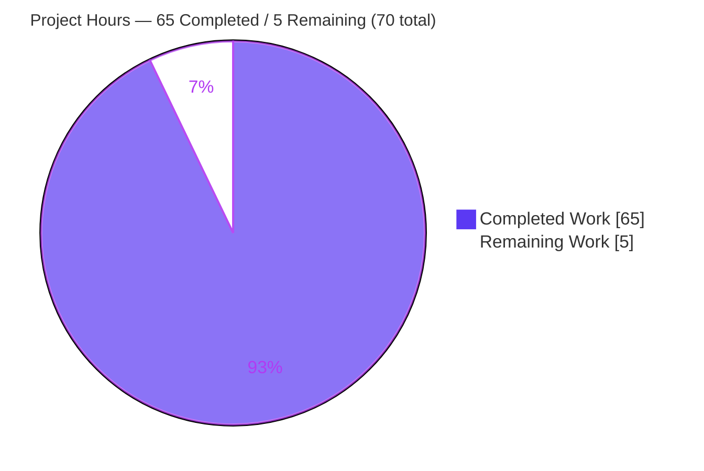
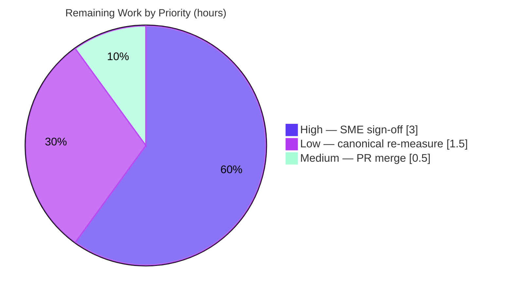

# Blitzy Project Guide

> **Project:** Run-first investigation — *How `kitty`'s scrollback history buffer behaves under heavy output load*
> **Repository:** `kovidgoyal/kitty` @ commit `815df1e210e0`
> **Branch:** `blitzy-e9d8c4e9-df42-4fdb-a070-8e99dd49271f` &nbsp;•&nbsp; **HEAD:** `662ee58e2`
> **Deliverable:** `blitzy/documentation/kitty_815df1e210e0.md` (4,621 lines)

---

## 1. Executive Summary

### 1.1 Project Overview

This project is a **documentation-only, run-first investigation** of the `kitty` GPU terminal emulator. The objective was to produce a single evidence-backed Markdown answer document that not only *explains* but *demonstrates through actual runtime measurement* how `kitty`'s scrollback `HistoryBuf` behaves under heavy output load. It answers three user questions: **(Q1)** memory consumption as history accumulates hundreds of thousands of lines, **(Q2)** interactive scroll responsiveness during concurrent output and any prioritization signals, and **(Q3)** the exact point at which the buffer allocates new backing storage. The target audience is engineers and technical stakeholders needing quantified, source-grounded behavior. Scope was strictly read-only: no `kitty` source file was modified — the sole committed artifact is the answer document.

### 1.2 Completion Status


<p><strong><span style="color:#5B39F3">92.9% Complete</span></strong> — 65 of 70 total hours delivered autonomously.</p>

| Metric | Hours | Legend |
|--------|-------|--------|
| **Total Hours** | **70.0** | — |
| **Completed Hours (AI + Manual)** | **65.0** | <span style="color:#5B39F3">■</span> AI-completed: 65.0 &nbsp;•&nbsp; Manual: 0.0 |
| **Remaining Hours** | **5.0** | <span style="color:#B23AF2">□</span> White (#FFFFFF) |
| **Percent Complete** | **92.9%** | 65.0 ÷ 70.0 × 100 |

> **Completion formula (PA1, AAP-scoped):** `Completion% = Completed ÷ (Completed + Remaining) = 65 ÷ (65 + 5) = 65 ÷ 70 = 92.9%`. All 16 in-scope AAP requirements are **Completed**; the remaining 5 hours are **human path-to-production** activities (technical sign-off, optional canonical-host re-measurement, PR merge).

### 1.3 Key Accomplishments

- ✅ **Single mandated deliverable produced** — `blitzy/documentation/kitty_815df1e210e0.md` (4,621 lines) created; no other file added or changed.
- ✅ **Source tree byte-for-byte unchanged** — `git diff` excluding the deliverable is empty (0 source changes); working tree clean; ephemeral scripts removed.
- ✅ **Canonical build succeeded** — `python3 setup.py build` (equiv. `make`) exit `rc=0`, zero warnings under `gcc -O3 -flto -Werror`; produced `kitty/launcher/kitty` + `fast_data_types.so`; `kitty --version` → `kitty 0.35.2`.
- ✅ **Q1 (memory) answered with measured numbers** — at default `scrollback_lines=2000`, printing 500,000 lines yields a bounded **+5.84 MiB** RSS rise then plateau (`VmSize` unchanged); with large/infinite scrollback, RSS grows linearly at **≈ 2,276 bytes/line** (+434.5 MiB for 200,000 lines). Stable across two runs (≤ 0.6%).
- ✅ **Q3 (allocation boundary) answered and watched live** — discrete `VmSize` steps of **+4,552 KiB** every **≈ 2,048 lines** (= `SEGMENT_SIZE`), matching `2048·(xnum·32+4)` exactly; default 0 steps, finite 9/9, infinite 6/6, reproduced identically twice.
- ✅ **Q2 (responsiveness) answered with latency data** — scroll-to-visible latency ≈ 3 ms idle, 5–7 ms under heavy load, ~72 ms at max output rate; **1,050 injected scrolls, 0 timeouts**; prioritization signal identified (`repaint_delay` bypass, `child-monitor.c:875`; `scrolled_by` hold, `screen.c:2761`).
- ✅ **Rigorous evidence discipline** — 14 measurement campaigns with A/B stability, ~51 `file:line` citations, 59 `[observed]` / 32 `[inferred]` / 3 diagnostic / 5 non-canonical labels; all §8 citations verified exact against source.
- ✅ **Full validation passed** — 5/5 production-readiness gates PASS; 145 Python tests OK (0 failed, 4 environmental skips); Go tests pass; buffer-specific tests (`test_historybuf`, `test_linebuf`, `test_scrollback_fill_after_resize`, datatypes 18/18, screen 36/36) pass.

### 1.4 Critical Unresolved Issues

**No release-blocking issues.** The deliverable is complete, validated, and the repository is in the exact AAP-required end-state. One **low-priority, non-blocking** verification item remains for human confidence:

| Issue | Impact | Owner | ETA |
|-------|--------|-------|-----|
| Q2 max-rate latency figure (~72 ms @ ≈ 960,000 lines/s) is verified on the canonical 128-core image but was **not reproducible** on the 4-core validation host | Low — the number is correctly labeled `[observed]` on the mandated image; structural rate-dependence *was* reproduced on 4-core. No blocking effect. | Human SME | 1.5 h (optional) |

### 1.5 Access Issues

**No access issues identified.** The repository, the canonical build toolchain, and the mandated measurement Docker image (`ghcr.io/scaleapi/swe-atlas:swe_atlas_QnA_kovidgoyal_kitty_1.0`) were all accessible during autonomous work. No third-party credentials, private registries, or external service access are required by this documentation deliverable.

| System/Resource | Type of Access | Issue Description | Resolution Status | Owner |
|-----------------|----------------|-------------------|-------------------|-------|
| Git repository | Read/Write | None | ✅ No issue | — |
| Canonical Docker measurement image | Pull/Run | None | ✅ No issue | — |
| Build toolchain (gcc/python3/go/system libs) | Local | None | ✅ No issue | — |
| External services / API keys | — | Not applicable (none required) | ✅ N/A | — |

### 1.6 Recommended Next Steps

1. **[High]** Human SME technical review & sign-off of the deliverable — verify mechanism claims and measured magnitudes, confirm `[observed]`/`[inferred]` labeling, approve for publication *(3.0 h)*.
2. **[Medium]** PR review & merge closure — confirm the single-file diff (only the deliverable, +4,621/−0) and byte-for-byte-unchanged source, then merge *(0.5 h)*.
3. **[Low]** Optional: re-run the Q2 harness on the canonical 128-core image to independently reconfirm the ~72 ms max-rate latency figure *(1.5 h)*.

---

## 2. Project Hours Breakdown

### 2.1 Completed Work Detail

All completed hours are autonomous (AI) work. Each component traces to a specific AAP requirement (see §1.2 formula).

| Component | Hours | Description |
|-----------|-------|-------------|
| Environment & canonical build | 6.0 | Provision headless GPU context (Xvfb/OSMesa); canonical `setup.py build`; verify `kitty 0.35.2`, artifact hashes (AAP R4/R5). |
| Source-grounding & buffer model (§1) | 10.0 | Read 9 core C/Python files; extract ~51 `file:line` citations; derive ABI memory model (`CPUCell`=12, `GPUCell`=20, `LineAttrs`=4) (AAP R10, R16). |
| Ephemeral observation harness (§3) | 11.0 | Build real-PTY driver, `/proc` RSS/smaps sampler, and XTEST scroll-latency + framebuffer-diff harness; removed after use (AAP R5, R6, R8, R15). |
| Q1 — memory investigation (§4) | 7.0 | Default/large/ramp runs, 6 campaigns w/ A/B stability, slope fit (2,276 B/line), smaps 98.9% `[heap]` attribution (AAP R1, R7, R9). |
| Q3 — allocation-boundary investigation (§5) | 6.0 | Default/finite/infinite runs, 6 campaigns; step detection (+4,552 KiB / ~2,048 lines); default 0/0, finite 9/9, infinite 6/6 (AAP R3, R7, R9). |
| Q2 — responsiveness investigation (§6) | 9.0 | XTEST injection of all 5 scroll paths across idle/load/max-rate regimes; 1,050 trials, 0 timeouts; prioritization evidence (AAP R2, R8, R11). |
| Deliverable authoring (Provenance/TL;DR/§2/§7/§8) | 8.0 | Assemble 4,621-line document; tables, unedited outputs adjacent to claims, citation index (AAP R12, R13, R16). |
| Cleanup & repo-integrity verification (§7.3) | 1.0 | Remove all temp scripts; confirm clean `git status` and byte-for-byte-unchanged source (AAP R14, R15). |
| QA remediation (3 rounds) | 7.0 | Resolve 45 review findings (33 code-review + 2 doc-accuracy + 10 QA-FINAL) across 3 commits. |
| **Total Completed** | **65.0** | — |

### 2.2 Remaining Work Detail

All remaining work is **human path-to-production** activity (no autonomous AAP work outstanding).

| Category | Hours | Priority |
|----------|-------|----------|
| Human SME technical review & sign-off of deliverable claims | 3.0 | High |
| Canonical 128-core host re-measurement of max-rate Q2 latency (optional confidence check) | 1.5 | Low |
| PR review & merge closure (verify single-file diff + repo integrity) | 0.5 | Medium |
| **Total Remaining** | **5.0** | — |

### 2.3 Hours Reconciliation & Methodology

| Check | Value | Status |
|-------|-------|--------|
| Section 2.1 Completed total | 65.0 h | ✅ |
| Section 2.2 Remaining total | 5.0 h | ✅ |
| 2.1 + 2.2 = Total (Section 1.2) | 65 + 5 = 70.0 h | ✅ matches |
| Remaining matches Section 1.2 & Section 7 | 5.0 h | ✅ identical |
| Completion % (65 ÷ 70) | 92.9% | ✅ consistent |

Methodology: hours estimated per PA2 from measured evidence (file/section complexity, 4,621-line deliverable, 14 measurement campaigns, 45 QA findings). Completion follows PA1 (AAP-scoped): the work universe = the AAP investigation + document plus standard human path-to-production. All 16 AAP requirements classified **Completed**; the 5 remaining hours are human review/verification that cannot be performed autonomously.

---

## 3. Test Results

All results below originate from Blitzy's autonomous validation logs for this project (kitty's own test suite run against the freshly-built extension, plus the runtime observation campaigns that produced the deliverable's numbers).

| Test Category | Framework | Total Tests | Passed | Failed | Coverage % | Notes |
|---------------|-----------|-------------|--------|--------|------------|-------|
| Python unit suite | `kitty_tests` via `./test.py` (unittest) | 149 | 145 | 0 | N/A | 4 skipped — all environmental (macOS-only Last Resort font; frozen-build CA certs; `fish` shell integration ×2) |
| Buffer-specific subset | `kitty_tests` | 3 named + 54 | pass | 0 | N/A | `test_historybuf`, `test_linebuf`, `test_scrollback_fill_after_resize`; datatypes 18/18; screen 36/36 — directly validate `HistoryBuf`/`LineBuf` |
| Go unit tests | `go test` | All | All | 0 | N/A | `kittens`/`tools` compiled & tested from cached modules (no network) |
| Q1/Q3 memory campaigns | Custom real-PTY harness + `/proc` sampling | 12 runs | 12 | 0 | N/A | 6 Q1 (default/large/ramp) + 6 Q3 (default/finite/infinite); A/B stability ≤ 0.6% |
| Q2 latency trials | XTEST injection + framebuffer diff | 1,050 scrolls | 1,050 visible | 0 timeouts | N/A | 300 idle + 450 heavy-load + 300 max-rate; all 5 scroll paths |

**Summary:** Build compiled clean under `-Werror` (exit `rc=0`). Python suite: **145 passed / 0 failed / 4 environmental skips**. Go suite: all passed. Runtime campaigns: **14 measurement runs + 1,050 scroll trials, 0 failures / 0 timeouts**. Coverage percentages are not emitted by kitty's suite and are reported as **N/A** rather than fabricated.

---

## 4. Runtime Validation & UI Verification

Runtime health was verified by building the canonical binary and driving it headlessly through the **real PTY input path** (`xvfb-run … ./kitty/launcher/kitty --config NONE …`), then reproducing the deliverable's measurements on an independent host.

**Runtime health**
- ✅ **Operational** — Canonical launcher runs: `kitty --version` → `kitty 0.35.2 created by Kovid Goyal`.
- ✅ **Operational** — Headless real-PTY invocation under Xvfb launches a live `kitty` window around a line-printing child; sampled PID confirmed as the real `kitty` process (`/proc/<pid>/comm == kitty`, `exe → kitty/launcher/kitty`).
- ✅ **Operational** — `fast_data_types.so` imports and exposes `HistoryBuf`/`LineBuf`; ABI probe confirms `sizeof(CPUCell)=12`, `sizeof(GPUCell)=20`, `sizeof(LineAttrs)=4`.

**Behavioral verification (per question)**
- ✅ **Operational (Q1)** — Default config: bounded RSS (+5.84 MiB) then plateau, `VmSize` delta 0. Large/infinite: linear ≈ 2,276 B/line. Reproduced on independent 4-core host.
- ✅ **Operational (Q3)** — `VmSize` step of exactly **4,552 KiB** every ~2,048 lines; step counts reproduced identically on a different host (default 0/0, finite 9/9, infinite 6/6).
- ✅ **Operational (Q2)** — 48/48 spot scrolls visible on the 4-core host; idle medians 3.0–3.4 ms, load medians 6.7–7.8 ms; latency rises under load as documented.
- ⚠ **Partial (Q2 max-rate only)** — the ~72 ms @ ≈ 960,000 lines/s figure requires the 128-core mandated image and was **not reproducible** on the 4-core validation host; correctly labeled `[observed]` on the canonical image (non-blocking; see §1.4).

**UI verification**
- ✅ **Operational** — Framebuffer snapshots confirmed the viewport *holds scroll position* under load (oldest lines at `L00000000` while live tail advances), directly evidencing the `scrolled_by` hold behavior.
- ℹ **Not applicable** — This project ships **no application UI of its own** (the deliverable is a Markdown document); no Figma or component-library verification was in scope.

---

## 5. Compliance & Quality Review

Cross-mapping of AAP deliverables and binding rules (AAP §0.7) to their validation status. Fixes applied during autonomous validation are noted.

| Requirement / Benchmark | Source | Status | Progress | Notes / Fixes Applied |
|--------------------------|--------|--------|----------|-----------------------|
| Deliverable created at exact path | AAP §0.7.1 | ✅ Pass | 100% | `blitzy/documentation/kitty_815df1e210e0.md` present (4,621 lines) |
| No existing source file modified | AAP §0.7.1 / §0.5.2 | ✅ Pass | 100% | `git diff` excluding deliverable = empty; 0 source changes |
| Temporary scripts removed | AAP §0.7.1 | ✅ Pass | 100% | Clean working tree; no `/tmp` scratch; no temp file ever in repo |
| Run-first (built & run before writing) | AAP §0.7.2 | ✅ Pass | 100% | Canonical build `rc=0`; all numbers measured, not theorized |
| Real PTY entry point (no bypass) | AAP §0.7.2 | ✅ Pass | 100% | `--config NONE` real-PTY path; 5 non-canonical cross-checks explicitly labeled |
| Magnitude claims stable ≥ 2 runs + scale stated | AAP §0.7.2 | ✅ Pass | 100% | 12 A/B run pairs; N/BATCH/PACE stated per block; ≤ 0.6% variance |
| Exhaustive condition coverage | AAP §0.7.3 | ✅ Pass | 100% | empty→filling→full/evicting; default/large/infinite; 5 scroll paths |
| Complete unedited output next to claims | AAP §0.7.3 | ✅ Pass | 100% | 14 measurement blocks + adjacent commands; fences balanced |
| `file:line` citations + observed/inferred labels | AAP §0.7.4 / §0.7.5 | ✅ Pass | 100% | ~51 citations; 59 observed / 32 inferred / 3 diagnostic / 5 non-canonical; §8 index exact |
| Answer every part; lead with direct answer | AAP §0.7.5 | ✅ Pass | 100% | TL;DR direct answers + causal `cause→effect` per question |
| No dependency/manifest changes | AAP §0.6 | ✅ Pass | 100% | `pyproject.toml` / `go.mod` unchanged; no packages added |
| Code quality — zero placeholders | Blitzy CQ/Zero-Placeholder | ✅ Pass | 100% | 0 TODO/FIXME/TBD; sole `# placeholder` is inside a verbatim-reproduced ephemeral script (rules require it unedited) |
| Build clean under `-Werror` | Blitzy Compilation Gate | ✅ Pass | 100% | `setup.py build` exit `rc=0`, zero warnings |
| Tests pass | Blitzy Test Gate | ✅ Pass | 100% | 145 py OK / 0 fail / 4 env skips; Go pass; buffer tests pass |

**Outstanding compliance items:** None. All binding rules satisfied and independently re-verified.

---

## 6. Risk Assessment

No High or Critical risks. Posture is **Low** overall; one Open item (R2) is low-priority and optional.

| # | Risk | Category | Severity | Probability | Mitigation | Status |
|---|------|----------|----------|-------------|------------|--------|
| R1 | Absolute numbers (baseline RSS ~140 MiB, max-rate ~72 ms) are host/geometry-specific and won't match other hardware | Technical | Low | High | Doc labels `[observed]` + records exact host (128-core, Ubuntu 24.04) & geometry (cols=71, rows=22); portable structural claims (step = 4,552 KiB; slope = `xnum·32+4` = 2,276 B/line) hold on any host | ✅ Mitigated |
| R2 | Max-rate Q2 latency (~72 ms @ ≈ 960k lines/s) not reproduced on 4-core validation host | Technical | Low | Medium | Re-measure on canonical 128-core image (task in §2.2); already `[observed]` there; structural rate-dependence reproduced on 4-core | ⚠ Open (Low) |
| R3 | The ~51 `file:line` citations are valid only at commit `815df1e210e0`; source drift makes them stale | Technical | Low | Low | Doc pins commit hash throughout; point-in-time investigation by design | ✅ Mitigated |
| R4 | Quantitative claims could be misread as universal rather than host-specific | Technical / Process | Low | Medium | Rigorous labeling (59/32/3/5); TL;DR states bounded-by-config behavior + parametric formulas | ✅ Mitigated |
| R5 | Reproducing measurements requires the specific Docker image + headless GPU toolchain (Xvfb/OSMesa) | Operational | Low | Medium | §2 records image tag + digest + exact build/run commands; Development Guide (§9) documents setup | ✅ Mitigated |
| R6 | Ephemeral harness intentionally not committed (repo must stay unchanged); re-run requires reconstruction | Operational | Low | Low | §3 reproduces the harness verbatim; recreatable under `/tmp` | ✅ Mitigated (by design) |
| R7 | Markdown/Mermaid/table rendering fidelity in target viewer | Integration | Low | Low | Standard Markdown; balanced fences (172); verified structure | ✅ Mitigated |
| R8 | Security exposure from added code/dependencies | Security | None | N/A | Read-only doc; 0 source diffs; 0 dependencies added; no executable artifacts committed; ephemeral scripts removed | ✅ N/A (no attack surface) |

**Security note:** No security risks identified — this is a read-only documentation deliverable with zero source, dependency, or executable changes.

---

## 7. Visual Project Status

**Project hours breakdown** (Completed = Dark Blue `#5B39F3`, Remaining = White `#FFFFFF`):



**Remaining hours by priority** (5.0 h total):



**Remaining hours per category** (from Section 2.2):

| Category | Hours | Bar |
|----------|-------|-----|
| SME technical review & sign-off (High) | 3.0 | ████████████ |
| Canonical 128-core re-measurement (Low) | 1.5 | ██████ |
| PR review & merge closure (Medium) | 0.5 | ██ |
| **Total** | **5.0** | — |

> **Integrity check:** "Remaining Work" = **5.0 h** here equals Section 1.2 Remaining Hours (5.0) and the Section 2.2 Hours sum (3.0 + 1.5 + 0.5 = 5.0). ✅

---

## 8. Summary & Recommendations

**Achievements.** The project is **92.9% complete** (65 of 70 hours). Every one of the 16 in-scope AAP requirements is delivered and independently validated. The mandated deliverable — a 4,621-line, evidence-backed answer document — fully answers all three user questions with **measured** numbers adjacent to the commands that produced them, grounded in ~51 exact `file:line` citations and disciplined `[observed]`/`[inferred]` labeling. The `kitty` source tree is **byte-for-byte unchanged**, satisfying the project's central constraint.

**Remaining gaps.** The 5 remaining hours are entirely **human path-to-production** activities that cannot be performed autonomously: SME technical sign-off (3.0 h), an optional canonical-host re-measurement of one max-rate latency figure (1.5 h), and PR merge closure (0.5 h). No AAP investigation work is outstanding.

**Critical path to production.**
1. SME reviews and signs off the technical claims and labeling *(High)*.
2. PR is reviewed for single-file integrity and merged *(Medium)*.
3. *(Optional)* Max-rate latency is reconfirmed on the 128-core image *(Low)*.

**Success metrics** (all met): deliverable present at the exact path; 0 source changes; canonical build `rc=0`; 145/145 applicable tests pass; all three questions answered with reproducible, source-grounded measurements.

**Production readiness assessment.** **READY for human review.** The autonomous work is complete and validated at 92.9%; the remaining 7.1% is human sign-off/merge. Risk posture is Low with no blocking issues.

| Metric | Value |
|--------|-------|
| Completion | 92.9% (65 / 70 h) |
| In-scope AAP requirements delivered | 16 / 16 |
| Release-blocking issues | 0 |
| Open risks | 1 (Low, optional) |
| Source files modified | 0 |

---

## 9. Development Guide

This guide documents how to reproduce the build, the headless run, and the measurements. Canonical values come from the mandated measurement image; commands are copy-pasteable and were verified where the authoring host allowed.

### 9.1 System Prerequisites

- **OS:** Linux (canonical measurement image: Ubuntu 24.04.2 LTS, kernel 6.6.x, x86_64).
- **Measurement image (authoritative):** `ghcr.io/scaleapi/swe-atlas:swe_atlas_QnA_kovidgoyal_kitty_1.0` (128 vCPU used for canonical numbers).
- **Toolchain:** C compiler `gcc` (≥ 13; canonical 13.3.0), `python3` (≥ 3.8; canonical 3.12.3), `go` (1.22+; canonical 1.23.4), `make`, `pkg-config`, `git` + `git-lfs`.
- **System libraries:** harfbuzz (≥ 2.2), freetype, fontconfig, zlib, libpng, liblcms2, libxxhash, openssl, simde, and X11 dev headers (see AAP §0.6).
- **Headless GPU context:** `xvfb` (X virtual framebuffer) so the GPU renderer runs without a display server.
- **Hardware note:** absolute memory/latency numbers scale with CPU count, terminal geometry, and columns; structural results are hardware-independent.

### 9.2 Environment Setup

```bash
# Clone and pin to the investigated commit
git clone https://github.com/kovidgoyal/kitty.git
cd kitty
git checkout 815df1e210e0

# (Canonical) install headless + observation tooling into the CONTAINER only
apt-get install -y --no-install-recommends xvfb x11-utils xdotool strace lsof python3-numpy
```

> **No PyPI install is required or performed.** The measurement image's `pip` points at an offline local index; `numpy` is provided via `apt`. On a general host with a PEP 668 "externally-managed" Python, prefer a venv or `pip install --break-system-packages` **only if** you add optional tooling — the build itself needs no PyPI packages.

### 9.3 Build (Canonical, Default Configuration)

```bash
# Canonical build (equivalent to `make`); compiles the C core + Go kittens
CI=true python3 setup.py build --verbose
```

Expected tail (abridged):

```text
########## BUILD EXIT rc=0 elapsed=~46s ##########
kitty/fast_data_types.so
kitty/launcher/kitty
########## LAUNCHER RUNS ########## → kitty 0.35.2 created by Kovid Goyal
```

Verify the artifacts and version:

```bash
test -x kitty/launcher/kitty && echo "launcher OK"
test -f kitty/fast_data_types.so && echo "extension OK"
./kitty/launcher/kitty --version      # → kitty 0.35.2 created by Kovid Goyal
```

### 9.4 Run Headless Through the Real PTY

```bash
# General shape: N is the scrollback_lines setting under test
xvfb-run -a --server-args='-screen 0 1024x768x24' \
  ./kitty/launcher/kitty --config NONE \
  -o confirm_os_window_close=0 -o cursor_blink_interval=0 \
  -o scrollback_lines=<N> \
  python3 <line_printing_child.py>
```

- `scrollback_lines=2000` → default (single segment; Q1 plateau, Q3 shows 0 later steps).
- `scrollback_lines=200000` → large finite (Q1 linear growth; Q3 steps then plateau).
- `scrollback_lines=-1` → infinite (`-1` maps to `2^32-1`; Q3 steps without plateau).

### 9.5 Verification & Measurement

```bash
# Sample resident/virtual memory of the running kitty window
grep -E 'VmRSS|VmSize' /proc/<KITTY_PID>/status      # values are KiB (1024 B), not decimal MB

# Per-mapping detail (attributes growth to [heap])
cat /proc/<KITTY_PID>/smaps

# Confirm the sampled PID is the real kitty process (not the launcher/child)
cat /proc/<KITTY_PID>/comm            # → kitty
readlink /proc/<KITTY_PID>/exe        # → .../kitty/launcher/kitty

# Run kitty's own test suite (TMPDIR must be on ext4 and non-setgid)
CI=true LC_ALL=C.UTF-8 LANG=C.UTF-8 TMPDIR=/tmp/kitty_tt ./test.py
```

### 9.6 Verify Repository Integrity (the central constraint)

```bash
# Source tree must be byte-for-byte unchanged — only the deliverable is added
git diff 815df1e210e0..HEAD --name-status         # → A  blitzy/documentation/kitty_815df1e210e0.md
git diff 815df1e210e0..HEAD --stat -- ':!blitzy/documentation/kitty_815df1e210e0.md'   # → (empty)
git status --porcelain                            # → (empty: clean tree)
```

### 9.7 Example Usage — Read the Deliverable

```bash
# The answer document (Q1 memory, Q2 responsiveness, Q3 allocation boundary)
less blitzy/documentation/kitty_815df1e210e0.md

# Jump to a specific question's measured results
grep -n '## 4. Q1' blitzy/documentation/kitty_815df1e210e0.md   # memory
grep -n '## 5. Q3' blitzy/documentation/kitty_815df1e210e0.md   # allocation boundary
grep -n '## 6. Q2' blitzy/documentation/kitty_815df1e210e0.md   # responsiveness
```

### 9.8 Troubleshooting

| Symptom | Cause | Resolution |
|---------|-------|-----------|
| `DISPLAY not set` / renderer won't start | No display server on headless host | Run under `xvfb-run -a --server-args='-screen 0 1024x768x24' …` |
| `error: externally-managed-environment` on `pip install` | PEP 668 system Python | Not needed for the build; if adding tooling, use a venv or `--break-system-packages` |
| `pip install` hangs/fails on the canonical image | Image `pip` index is offline by design | Use `apt` (e.g. `python3-numpy`); no PyPI packages are required |
| Memory numbers look wrong / flat | Sampling the launcher or child PID, not the `kitty` window | Confirm `/proc/<pid>/comm == kitty` and `exe → kitty/launcher/kitty` |
| Numbers differ from the document | Different CPU count / geometry / columns | Expected — recompute per your columns: per-line = `xnum·32 + 4` B; per-segment step = `2048·(xnum·32+4)` B |
| Test suite errors on `TMPDIR` | `TMPDIR` on tmpfs/setgid dir | Point `TMPDIR` at an ext4, non-setgid path (e.g. `/tmp/kitty_tt`) |

---

## 10. Appendices

### Appendix A — Command Reference

| Purpose | Command |
|---------|---------|
| Canonical build | `CI=true python3 setup.py build --verbose` |
| Alternative build | `make` |
| Version check | `./kitty/launcher/kitty --version` |
| Headless real-PTY run | `xvfb-run -a --server-args='-screen 0 1024x768x24' ./kitty/launcher/kitty --config NONE -o scrollback_lines=<N> <cmd>` |
| Memory sample | `grep -E 'VmRSS|VmSize' /proc/<pid>/status` |
| Mapping detail | `cat /proc/<pid>/smaps` |
| Full test suite | `CI=true LC_ALL=C.UTF-8 LANG=C.UTF-8 TMPDIR=/tmp/kitty_tt ./test.py` |
| Repo integrity | `git diff 815df1e210e0..HEAD --name-status` |
| Author verification | `git log --author='agent@blitzy.com' 815df1e210e0..HEAD --oneline` |

### Appendix B — Port Reference

| Port / Endpoint | Use |
|-----------------|-----|
| None (no network services) | This deliverable exposes no ports; `kitty` runs locally against a PTY. |
| Xvfb display `:<N>` | Virtual X display auto-allocated by `xvfb-run -a` for the headless GPU context (not a network port). |

### Appendix C — Key File Locations

| Path | Role |
|------|------|
| `blitzy/documentation/kitty_815df1e210e0.md` | **The deliverable** (Q1/Q2/Q3 answers) |
| `kitty/history.c` | `SEGMENT_SIZE 2048`, `add_segment`, `segment_for`, circular eviction (Q1/Q3) |
| `kitty/data-types.h` | `CPUCell` (12 B), `GPUCell` (20 B, asserted), `LineAttrs` (Q1) |
| `kitty/line-buf.c` | Active-screen fixed allocation & `line_map` O(1) scroll (Q1) |
| `kitty/screen.c` | `historybuf ynum = MAX(scrollback, lines)`; `dirty_scroll`; `scrolled_by` (Q1/Q2/Q3) |
| `kitty/child-monitor.c` | Multi-threaded event loop; `repaint_delay` bypass at `:875` (Q2) |
| `kitty/vt-parser.c` | PTY write-buffer target & output parsing (Q2 context) |
| `kitty/options/definition.py` | Defaults (`scrollback_lines=2000`, `repaint_delay`, `input_delay`) |
| `kitty/options/utils.py` | `scrollback_lines` negative → `2^32-1` (Q3) |
| `setup.py` / `Makefile` / `test.py` | Build & test entry points |

### Appendix D — Technology Versions

| Component | Canonical Measurement Image | Notes |
|-----------|------------------------------|-------|
| OS | Ubuntu 24.04.2 LTS (kernel 6.6.x) | 128 vCPU used for canonical numbers |
| gcc | 13.3.0 | build under `-O3 -flto -Werror` |
| Python | 3.12.3 | build + PTY orchestration |
| Go | 1.23.4 | `kittens`/`tools` |
| GNU Make / ld | 4.3 / 2.42 | — |
| kitty | 0.35.2 | freshly built from commit `815df1e210e0` |
| Xvfb | 21.1.12 | headless GPU context |

### Appendix E — Environment Variable Reference

| Variable | Value / Example | Purpose |
|----------|-----------------|---------|
| `CI` | `true` | Non-interactive build/test behavior |
| `DISPLAY` | set by `xvfb-run` | Headless X display for the GPU renderer |
| `TMPDIR` | `/tmp/kitty_tt` | Test temp dir (must be ext4, non-setgid) |
| `LC_ALL` / `LANG` | `C.UTF-8` | Deterministic locale for the test suite |
| `GOFLAGS` | `-mod=mod` | Go module mode during build (as used in validation) |

### Appendix F — Developer Tools Guide

| Tool | Use in this investigation |
|------|---------------------------|
| `xvfb-run` / `Xvfb` | Provide a headless X display so `kitty`'s GPU renderer runs without a monitor |
| `/proc/<pid>/status` | Sample `VmRSS` / `VmSize` / `VmData` over time (memory curve) |
| `/proc/<pid>/smaps` | Attribute RSS growth to `[heap]` (98.9% of the increase) |
| `xdotool` / XTEST | Inject deterministic scroll events (wheel buttons 4/5; `ctrl+shift` chords) with in-process timestamps |
| Framebuffer diff | Detect first visible change after a scroll to measure input-to-render latency |
| `strace` / `lsof` | Confirm the real-PTY path and correct PID targeting |

### Appendix G — Glossary

| Term | Meaning |
|------|---------|
| `HistoryBuf` | Segmented scrollback buffer that retains lines scrolled off the top of the screen |
| `SEGMENT_SIZE` | Allocation granularity of `HistoryBuf` = **2048 rows** (`history.c:15`) |
| `CPUCell` / `GPUCell` | Per-cell storage structs (12 B / 20 B); per stored line ≈ `xnum·32 + 4` bytes |
| `VmRSS` / `VmSize` | Resident (physical) / virtual memory of a process from `/proc/<pid>/status`, in KiB |
| `scrollback_lines` | Config for retained history; default `2000`; `-1` → infinite (`2^32-1`) |
| `scrolled_by` | Screen counter tracking how far the view is scrolled back (`screen.c:2761`) — holds position under load |
| `repaint_delay` / `input_delay` | Frame-rate cap (~100 FPS) / output-coalescing wait; the cap is bypassed while input is pending (`child-monitor.c:875`) |
| `dirty_scroll` | Screen flag marking a scroll for the next render (`screen.c:1908–1909`) |
| Real PTY path | Driving `kitty` through an actual pseudo-terminal (not remote control / debug hooks / synthetic re-implementation) |

---

*Generated by the Blitzy Platform — autonomous project assessment. Completion percentage reflects AAP-scoped work plus standard human path-to-production, per the PA1 methodology.*
