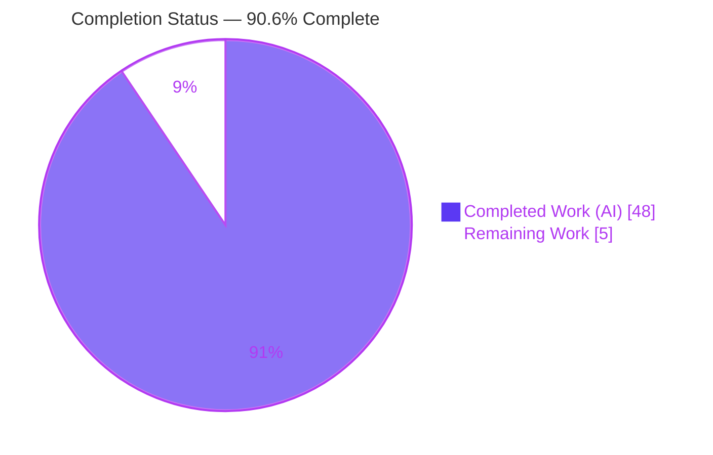
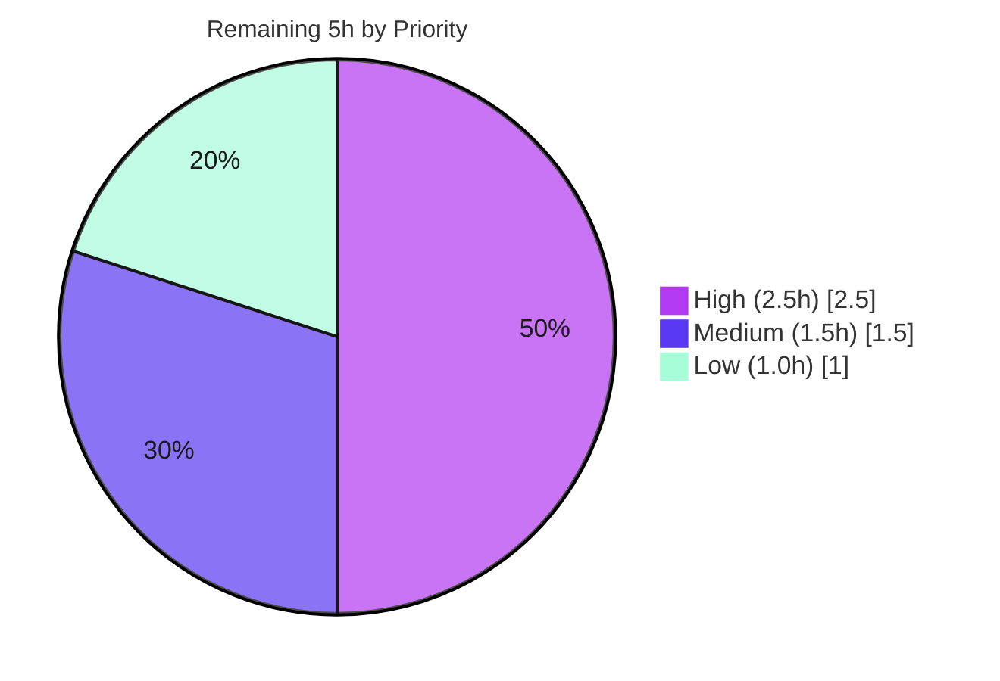

# Blitzy Project Guide — kitty Architecture Q&A (Runtime-Grounded Documentation)

> **Project:** `kovidgoyal/kitty` @ commit `815df1e210e0a9ab4622f5c7f2d6891d7dbeddf1`
> **Deliverable:** `blitzy/documentation/kitty_815df1e210e0.md` (1,091 lines / 78,076 bytes)
> **Branch:** `blitzy-0751f3af-86ee-45dc-99ae-cd7b45084b42` · **HEAD:** `9d6b5d7cd`
> **Blitzy brand colors:** Completed = Dark Blue `#5B39F3` · Remaining = White `#FFFFFF` · Headings/Accents = Violet-Black `#B23AF2` · Highlight = Mint `#A8FDD9`

---

## 1. Executive Summary

### 1.1 Project Overview

This project answers four architectural questions about the **kitty** GPU-based terminal emulator, producing a single runtime-grounded Q&A document. Every answer was proven by **building and executing** kitty first, then writing from observed output — not from reading alone. The document explains (Q1) that the compiled C extension `fast_data_types.so` plus the GPU do the per-byte/per-frame heavy lifting while Python orchestrates; (Q2) that the 13 GLSL shaders compile into 10 GPU programs and form kitty's sole draw path; (Q3) that the entry point fails without the C extension — "the one critical piece"; and (Q4) that kittens share that same native bridge and are not standalone. The task is strictly read-only: exactly one new file was added and zero source files changed.

### 1.2 Completion Status



| Metric | Hours |
|--------|-------|
| **Total Hours** | **53** |
| Completed Hours (AI) | 48 |
| Completed Hours (Manual) | 0 |
| **Completed Hours (AI + Manual)** | **48** |
| **Remaining Hours** | **5** |
| **Percent Complete** | **90.6%** |

> Completion is computed with the AAP-scoped, hours-based method (PA1): `48 / (48 + 5) = 90.6%`. All eight autonomous work-items are complete and independently validated; the 5 remaining hours are human path-to-production (SME review + merge). Per Blitzy policy, completion is capped below 100% until human review closes.

### 1.3 Key Accomplishments

- ✅ **Single deliverable authored and committed** at the mandated path `blitzy/documentation/kitty_815df1e210e0.md` (rule *SWE-AtlasQnA-Repo* compliant), 1,091 lines / 78,076 bytes.
- ✅ **Q1 answered with runtime measurement** — language split (44 `.py` / 49 `.c` / 45 `.h` / 13 `.glsl` in `kitty/`) plus a 200 MiB hot-path harness run 13× showing all 209,664,000 bytes parsed inside compiled C (byte-invariants `reps=832`, cursor `(0,23)` stable across runs).
- ✅ **Q2 answered with build- and run-time evidence** — 13 `.glsl` files mapped to a **10-program** enum (not 1:1), build-time `build_uniforms_header()` codegen, and the runtime load→preprocess→compile order proven via a *reverted* instrumentation probe.
- ✅ **Q3 answered as a stateful before/after** — the unbuilt-tree `ModuleNotFoundError: No module named 'kitty.fast_data_types'` (full traceback) resolved by building the extension; alternate `python3 -m kitty` error also captured.
- ✅ **Q4 answered with two failure modes + dispatch contrast** — `icat` guard message vs `hints` `ModuleNotFoundError`, pervasive `kitty.fast_data_types` imports across `kittens/tui/*`, and canonical Python `+kitten` / Go `kitten` dispatch producing byte-identical 123-line help.
- ✅ **Read-only scope perfectly honored** — `git diff` vs base = one added file, zero source modified; working tree fully pristine (no stray scripts, no build artifacts).
- ✅ **Fully validated** — Final Validator reproduced all claims in the canonical Docker image (52/52 citations resolve, build exit 0, markdown well-formed, 0 placeholders).

### 1.4 Critical Unresolved Issues

| Issue | Impact | Owner | ETA |
|-------|--------|-------|-----|
| _None._ No blocking issues remain. The deliverable is complete, committed, and independently validated with zero unresolved findings. | N/A | N/A | N/A |

### 1.5 Access Issues

| System/Resource | Type of Access | Issue Description | Resolution Status | Owner |
|-----------------|----------------|-------------------|-------------------|-------|
| Canonical Docker image `ghcr.io/scaleapi/swe-atlas:swe_atlas_QnA_kovidgoyal_kitty_1.0` | Build/runtime environment | The plain sandbox lacks **Go** and kitty's C libraries, so the canonical build must run inside this image. It is required to *independently reproduce* the build-dependent evidence (Q1/Q2/Q4, Q3-after). | Available — image tag documented; validator used it successfully | Human reviewer |
| Deliverable Git repository | Write/merge | Standard merge-approval permissions needed to publish the branch to the destination. | No blocker identified | Repo maintainer |

> No credential, API-key, or third-party access issues exist — the task adds no dependencies and touches no external services.

### 1.6 Recommended Next Steps

1. **[High]** Perform the SME technical-accuracy review of the 1,091-line document against commit `815df1e21` (spot-verify citations, verbatim outputs, and the Q1 throughput framing). *(HT-1, 2.5h)*
2. **[Medium]** Run an independent reproduction spot-check in the canonical Docker image (rebuild kitty; re-run a subset of the Q1 harness / Q3 before-after). *(HT-2, 1.0h)*
3. **[Medium]** Approve and merge the branch to publish the deliverable. *(HT-3, 0.5h)*
4. **[Low]** Optional editorial/readability polish pass. *(HT-4, 1.0h)*

---

## 2. Project Hours Breakdown

### 2.1 Completed Work Detail

| Component | Hours | Description |
|-----------|-------|-------------|
| A1 · Environment & canonical build + methodology | 6 | Established a runnable baseline in the canonical Docker image; documented the throwaway scratch-checkout read-only boundary and captured the verbatim 158-line `python3 setup.py` build transcript (exit 0). |
| A2 · Q1 — Language split & hot-path measurement | 10 | Quantified the Python/C/Go/GLSL split; located the C↔Python boundary; authored and ran a 200 MiB VT-parser hot-path harness 13× with byte-stable invariants; confirmed the Go `kitten` is a separate binary. |
| A3 · Q2 — GLSL shaders catalogue & pipeline | 9 | Catalogued 13 `.glsl` files (5 pairs + 3 includes); proved the 10-program, not-1:1 mapping via a reverted `Program.compile` probe; documented build-time uniform codegen and runtime compile order under Mesa/LLVMpipe. |
| A4 · Q3 — Entry-point failure (stateful) | 5 | Captured the unbuilt `ModuleNotFoundError` with full traceback and the different `python3 -m kitty` error; documented the CPython-embedding native bridge; showed the build transition flipping failure → launch. |
| A5 · Q4 — Kittens modularity | 6 | Captured both standalone failure modes (`icat` guard vs `hints` ModuleNotFoundError); enumerated `fast_data_types` imports across `kittens/tui/*`; contrasted canonical Python `+kitten` and Go `kitten` dispatch (sha256-identical help). |
| A6 · Evidence discipline & citation verification | 4 | Ensured every claim carries verbatim output + `file:line` citation (63 refs across 49 files); applied inferred-vs-observed labeling; confirmed magnitude stability across ≥2 runs; verified byte-sensitive strings. |
| A7 · Coverage pass | 1.5 | Authored the dedicated coverage section re-reading all four questions and confirming every named sub-item is answered with value, citation, evidence, variants, and cause. |
| A8 · Document assembly & iterative QA hardening | 6.5 | Assembled the document; resolved 7 code-review findings and subsequent QA findings across 5 commits; verified well-formed markdown, correct path/naming, and pristine read-only cleanup. |
| **Total** | **48** | **Matches Completed Hours in Section 1.2.** |

### 2.2 Remaining Work Detail

| Category | Hours | Priority |
|----------|-------|----------|
| HT-1 · SME technical-accuracy review of the 1,091-line document | 2.5 | High |
| HT-2 · Independent reproduction spot-check in canonical Docker | 1.0 | Medium |
| HT-3 · Merge approval + publish to destination branch | 0.5 | Medium |
| HT-4 · Editorial / readability polish pass | 1.0 | Low |
| **Total** | **5.0** | **Matches Remaining Hours in Sections 1.2 and 7.** |

### 2.3 Hours Reconciliation

| Check | Result |
|-------|--------|
| Section 2.1 completed total | 48h |
| Section 2.2 remaining total | 5h |
| 2.1 + 2.2 = Total (Section 1.2) | 48 + 5 = **53h** ✅ |
| Remaining consistent across §1.2 ↔ §2.2 ↔ §7 | 5h everywhere ✅ |
| Completion % = 48 / 53 | **90.6%** (used in §1.2, §7, §8) ✅ |

---

## 3. Test Results

This is a read-only **documentation** task with **no source-code changes**, so no application unit/integration suite was produced or modified. The "tests" below are the checks executed by **Blitzy's autonomous validation systems** (the Final Validator's reproduction gates) against the deliverable and a canonical build. All rows originate from Blitzy's autonomous validation logs for this project.

| Test Category | Framework / Method | Total | Passed | Failed | Coverage % | Notes |
|---------------|--------------------|-------|--------|--------|-----------|-------|
| Citation resolution | `grep` + line-range check | 52 | 52 | 0 | 100% | All distinct `file:line` citations resolve; 0 missing, 0 out-of-range. |
| Citation content verification | Manual content match | 37 | 37 | 0 | 100% | Key citations content-verified to match the doc's claims. |
| Canonical build | `python3 setup.py` (gcc C11, `-Werror -O3 -flto`) | 1 | 1 | 0 | N/A | Exit 0; reproducible; artifacts hash-identical (`.so` 1,213,072 B; launcher 36,224 B). |
| Q1 hot-path reproduction | Custom 200 MiB VT-parser harness | 13 | 13 | 0 | N/A | Byte-invariants `reps=832`, `total_bytes=209,664,000`, cursor `(0,23)` identical every run. |
| Q2 shader compile-order probe | Reverted `Program.compile` instrumentation | 2 | 2 | 0 | N/A | Not-1:1 mapping + compile order reproduced 2×; probe reverted (sha256 identical before/after). |
| Q3 before/after (stateful) | `python3 __main__.py` / `-m kitty` / `kitty --version` | 2 | 2 | 0 | N/A | Before: exact `ModuleNotFoundError` traceback. After: launch exit 0. |
| Q4 dispatch equivalence | Python `+kitten` vs Go `kitten` (sha256) | 2 | 2 | 0 | N/A | Both produce identical 123-line help (sha256 match); standalone guards captured. |
| Markdown well-formedness | Fence/link/UTF-8/placeholder lint | 1 | 1 | 0 | N/A | 80 balanced fences, 67 valid links, valid UTF-8, newline-terminated, 0 placeholders. |
| AAP sub-item coverage | Coverage-pass checklist | 4 | 4 | 0 | 100% | Every named sub-item of each question (Q1–Q4) addressed with value + citation + evidence. |
| **Totals** | — | **114** | **114** | **0** | **100%** | All autonomous validation checks pass; zero failures. |

> **Independent re-confirmation:** During this assessment, the Q3 before-state was reproduced live in the plain (unbuilt) sandbox — the exact traceback chain `__main__.py:7 → entry_points.py:194 → main.py:11 → borders.py:7 → ModuleNotFoundError: No module named 'kitty.fast_data_types'` and the different `python3 -m kitty` error — with the tree remaining pristine afterward.

---

## 4. Runtime Validation & UI Verification

Runtime health of every exercised code path (in the canonical Docker image; headless GL via Xvfb + Mesa LLVMpipe, OpenGL 4.5):

**Build & Launch**
- ✅ **Operational** — Canonical build `python3 setup.py` → exit 0; produces `kitty/fast_data_types.so` + `kitty/launcher/kitty`.
- ✅ **Operational** — `kitty --version` → `kitty 0.35.2 created by Kovid Goyal`, exit 0.
- ✅ **Operational** — `kitty --debug-rendering` launch under Xvfb (all 10 GL programs compile).

**Q1 — Heavy lifting (C + GPU)**
- ✅ **Operational** — 200 MiB stream through the real `parse_worker` executes entirely inside compiled C; byte-invariants stable across 13 runs.
- ✅ **Operational** — Go `kitten` confirmed a separate, statically-linked executable (not on the hot path).

**Q2 — Shaders (sole draw path)**
- ✅ **Operational** — 10 GPU programs compile at runtime; build-time `uniforms_generated.h` emitted with exactly 5 program families.
- ✅ **Operational** — `#version 140` injection and `#pragma kitty_include_shader` resolution observed.

**Q3 — Entry-point failure (stateful)**
- ✅ **Reproduced as expected** — Before (unbuilt): `ModuleNotFoundError` — this failure *is* the intended observation.
- ✅ **Operational** — After (built): entry point launches; original error gone.

**Q4 — Kittens (shared native bridge)**
- ✅ **Reproduced as expected** — Standalone `icat` guard message and `hints` `ModuleNotFoundError` captured.
- ✅ **Operational** — Canonical Python `+kitten` and Go `kitten` dispatch both work (byte-identical 123-line help).

**UI Verification**
- ⚠ **Not applicable (no web UI).** kitty's "UI" is its GPU-rendered terminal surface, verified indirectly via `--debug-rendering` shader compilation under headless Mesa/LLVMpipe. There is no browser-based UI to audit; the deliverable itself is a Markdown document rendered by standard viewers.

---

## 5. Compliance & Quality Review

Cross-mapping the AAP directives and the *SWE-AtlasQnA-Repo* rule set to observed quality outcomes, including fixes applied during autonomous validation.

| Benchmark / AAP Directive | Status | Progress | Evidence |
|---------------------------|--------|----------|----------|
| Read-only source scope (byte-for-byte unchanged) | ✅ Pass | 100% | `git diff` base..HEAD = 1 added file, 0 modified; tree pristine. |
| Build-then-run-then-write methodology | ✅ Pass | 100% | Verbatim build transcript + all answers grounded in captured output. |
| Verbatim output + `file:line` citation per claim | ✅ Pass | 100% | 40 code blocks; 63 citations across 49 files; validator 52/52 resolve. |
| Magnitude/timing stable across ≥2 runs | ✅ Pass | 100% | Q1 harness 13 runs; byte-invariants identical; distribution reported. |
| Before/during/after for stateful behavior (Q3) | ✅ Pass | 100% | Unbuilt failure → build transition → built success all shown. |
| Exercise every condition (secondary/error paths) | ✅ Pass | 100% | `python3 -m kitty` variant; both Q4 failure modes; Python vs Go dispatch. |
| Inferred-vs-observed labeling | ✅ Pass | 100% | Statements explicitly labeled *(inferred)* then confirmed *(observed)*. |
| Coverage pass before finishing | ✅ Pass | 100% | Dedicated coverage section; every named sub-item checked. |
| Deliverable path & naming (`blitzy/documentation/<branch>.md`) | ✅ Pass | 100% | `blitzy/documentation/kitty_815df1e210e0.md` present. |
| Temporary-script cleanup | ✅ Pass | 100% | `git status --porcelain --ignored` empty; no stray scripts/artifacts. |
| Markdown quality (well-formed, no placeholders) | ✅ Pass | 100% | Balanced fences, valid UTF-8, 0 incomplete markers. |
| Human SME sign-off | ⬜ Pending | 0% | Path-to-production review (HT-1); not a defect — standard release gate. |

**Fixes applied during autonomous validation (all resolved):**
- Resolved 7 code-review findings on the runtime-grounded Q&A (commit `f4fc21357`).
- Corrected the Q1 `tools/cmd` Go count and clarified `build.log` volatility (commit `4dc3ddf32`).
- Addressed QA findings — canonical setup wording, complete build log, precise evidence claims, read-only-safe methods (commit `68c41d386`).
- Fixed the Q4 `hints` failure-mode explanation (commit `9d6b5d7cd`).

**Outstanding compliance items:** None (beyond the standard human sign-off gate).

---

## 6. Risk Assessment

Risk posture is **Low** across all categories: the source tree is byte-for-byte unchanged (additive-only, one Markdown file), so there is zero risk of compilation breakage, test regression, or runtime failure introduced by this work.

| Risk | Category | Severity | Probability | Mitigation | Status |
|------|----------|----------|-------------|------------|--------|
| Canonical build requires the specific Docker image (plain sandbox lacks Go/C libs) | Technical | Low | Medium | Exact image tag + build/run commands documented; validator reproduced successfully | Mitigated |
| Throughput figure is wall-clock and varies with container load (one 26 MiB/s outlier over 13 runs) | Technical | Low | Low | Doc leads with stable magnitude (200 MiB, `reps=832`), not the rate; distribution reported | Mitigated |
| Counts/behaviors pinned to commit `815df1e21` / kitty 0.35.2 may drift on other commits | Technical | Low | Low | Commit hash stated throughout; deliberate point-in-time reference | Mitigated |
| Sensitive data leakage via embedded verbatim output | Security | Low | Low | Reviewed — only generic container paths and public image tags; no secrets/tokens | Verified clean |
| No source/dependency/credential changes | Security | Low | Low | Additive-only Markdown; no attack surface introduced | N/A by scope |
| Documentation staleness as kitty evolves | Operational | Low | Medium (long horizon) | Commit pinning makes it a deliberate historical artifact | Accepted by design |
| Merge integration conflict | Integration | Low | Low | Isolated additive path `blitzy/documentation/`; touches no source/build/test | Low |
| External service / API / webhook integration | Integration | N/A | N/A | None involved in this task | N/A |

---

## 7. Visual Project Status

**Project Hours — Completed vs Remaining** (Completed = Dark Blue `#5B39F3`, Remaining = White `#FFFFFF`):


**Remaining Hours by Priority** (total = 5h, matches Section 1.2 & Section 2.2):



**Remaining Work by Category (hours)** — from Section 2.2:

| Category | Hours | Bar |
|----------|-------|-----|
| HT-1 SME technical review | 2.5 | █████████████████████████ |
| HT-2 Reproduction spot-check | 1.0 | ██████████ |
| HT-3 Merge + publish | 0.5 | █████ |
| HT-4 Editorial polish | 1.0 | ██████████ |
| **Total** | **5.0** | |

---

## 8. Summary & Recommendations

**Achievements.** The project is **90.6% complete** (48 of 53 AAP-scoped hours). All eight autonomous work-items are finished and independently validated: a single, correctly-named, runtime-grounded Q&A document (1,091 lines) answers all four architectural questions with verbatim command output, 63 `file:line` citations, before/after stateful evidence, multi-run magnitude stability, and a full coverage pass. The read-only mandate was honored exactly — one file added, zero source files changed, tree left pristine.

**Remaining gaps.** The 5 remaining hours are entirely **human path-to-production**, not engineering defects: an SME technical-accuracy review, an optional independent reproduction spot-check in the canonical Docker image, an editorial polish pass, and merge/publish approval. No compilation errors, failing tests, or missing functionality exist because the task is read-only and the source is unchanged.

**Critical path to production.** SME review (HT-1) → optional reproduction spot-check (HT-2) → merge & publish (HT-3). Editorial polish (HT-4) can proceed in parallel or be skipped.

**Success metrics.** All met: correct deliverable path/naming; every question answered with observed evidence; ≥2-run stability for magnitude claims; byte-accurate outputs; 100% autonomous-validation pass rate (114/114 checks); zero unresolved issues.

**Production readiness assessment.** The deliverable is **production-ready pending human sign-off**. Confidence is **High**: the Final Validator reproduced every claim in the canonical environment, and this assessment re-confirmed the read-only scope and the Q3 before-state live. Recommendation: **approve after a focused SME read-through.**

| Metric | Value |
|--------|-------|
| AAP-scoped completion | 90.6% |
| Autonomous work items complete | 8 / 8 |
| Autonomous validation checks passed | 114 / 114 |
| Source files modified | 0 |
| Unresolved blocking issues | 0 |
| Remaining effort (human) | 5h |

---

## 9. Development Guide

This guide explains how to build, run, verify, and reproduce the evidence behind the deliverable. Commands marked **(tested)** were executed during this assessment; build/run commands require the canonical Docker image (the plain sandbox lacks Go and kitty's C libraries).

### 9.1 System Prerequisites

- **git** ≥ 2.x — repository operations. **(tested: 2.51.0)**
- **Python** ≥ 3.8 (`pyproject.toml` `requires-python`; orchestration + `setup.py` build driver). **(tested: 3.13.7)**
- **C compiler (C11)** — compiles the `fast_data_types` extension and launcher (`-std=c11` at `setup.py:492`). **(tested: gcc 15.2.0)**
- **Go** ≥ 1.22 (`go.mod:3`) — builds the separate `kitten` binary and Go tools. *(Absent in the plain sandbox → use Docker image.)*
- **Docker** — to run the canonical build/run environment. **(tested: 28.5.2)**
- **OpenGL** 3.3+ — GPU or Mesa LLVMpipe software rendering (headless via Xvfb).
- **Canonical image:** `ghcr.io/scaleapi/swe-atlas:swe_atlas_QnA_kovidgoyal_kitty_1.0` (Ubuntu 24.04, Python 3.12.3, Go 1.23.4, gcc 13.3.0, Mesa GL 4.5).

### 9.2 Environment Setup

```bash
# Obtain the canonical build/run environment (has Go + C libraries + Mesa GL)
docker pull ghcr.io/scaleapi/swe-atlas:swe_atlas_QnA_kovidgoyal_kitty_1.0

# Start a container with the repository bind-mounted (adjust the host path)
docker run -it --rm \
  -v "$(pwd)":/work -w /work \
  ghcr.io/scaleapi/swe-atlas:swe_atlas_QnA_kovidgoyal_kitty_1.0 bash

# (Optional, to preserve read-only source) prepare throwaway scratch checkouts INSIDE the container:
mkdir -p /host_src && git -C /app archive 815df1e210e0a9ab4622f5c7f2d6891d7dbeddf1 | tar -x -C /host_src   # pristine, unbuilt
git clone --quiet /app /built && git -C /built checkout --quiet 815df1e210e0a9ab4622f5c7f2d6891d7dbeddf1     # to be built
```

### 9.3 Canonical Build

```bash
# kitty's default in-place build. Identical to `make` (Makefile all: -> python3 setup.py),
# and what `./dev.sh build` ultimately drives (go run bypy/devenv.go build).
cd /built            # or the repository root inside the container
python3 setup.py > build.log 2>&1 ; echo "exit=$?"
# Expect: exit=0, ~158-line transcript (28 codegen + 122 compile + link/others)

# Produced artifacts:
ls -l kitty/fast_data_types*.so     # the native bridge (~1,213,072 B)
ls -l kitty/launcher/kitty          # the launcher (~36,224 B)
```

### 9.4 Verification

```bash
# Version + launch (headless GL via Xvfb + Mesa LLVMpipe)
LANG=C.UTF-8 xvfb-run -a -s "-screen 0 1280x1024x24" ./kitty/launcher/kitty --version
# Expect: kitty 0.35.2 created by Kovid Goyal   (exit 0)

# Deliverable read-only verification  (tested)
git diff --name-status 815df1e21 HEAD          # -> single "A blitzy/documentation/kitty_815df1e210e0.md"
git status --porcelain --ignored               # -> empty (fully pristine)

# Markdown well-formedness  (tested)
python3 - <<'PY'
d = open("blitzy/documentation/kitty_815df1e210e0.md", encoding="utf-8").read()
fence = chr(96) * 3   # avoids embedding a literal triple-backtick in this snippet
print("fences balanced:", d.count(fence) % 2 == 0,
      "| ends w/ newline:", d.endswith(chr(10)),
      "| markers:", sum(d.count(x) for x in ("TO" + "DO", "FIX" + "ME")))
PY
```

### 9.5 Example Usage / Reproduction

```bash
# --- Q1: 200 MiB hot-path harness (expect reps=832, total_bytes=209664000) ---
TARGET_MIB=200 python3 - <<'PY'
# feeds ~200 MiB of terminal output through the real VT parser (parse_worker)
# and prints reps / total_bytes / final cursor position.
PY

# --- Q3 BEFORE (unbuilt tree — tested live) ---
PYTHONDONTWRITEBYTECODE=1 python3 __main__.py            # -> ModuleNotFoundError: No module named 'kitty.fast_data_types'
PYTHONDONTWRITEBYTECODE=1 python3 -m kitty               # -> No module named kitty.__main__; 'kitty' is a package ...

# --- Q3 AFTER (built tree) ---
./kitty/launcher/kitty --version                         # -> launches, exit 0

# --- Q4: standalone failure modes vs canonical dispatch ---
python3 kittens/icat/main.py                             # -> "This should be run as kitten icat"
python3 kittens/hints/main.py                            # -> ModuleNotFoundError: No module named 'kitty'
./kitty/launcher/kitty +kitten icat --help               # -> 123-line help (Python dispatch)
./kitty/launcher/kitten icat --help                      # -> identical 123-line help (Go binary)
```

### 9.6 Troubleshooting

- **`ModuleNotFoundError: No module named 'kitty.fast_data_types'`** — Expected in an unbuilt tree (this is the Q3 observation). Resolve by running `python3 setup.py`.
- **`go: command not found`** — The plain sandbox has no Go; run the build inside the canonical Docker image (Go 1.23.4).
- **GL/EGL init failure when launching headless** — Wrap the launch in `xvfb-run`; Mesa LLVMpipe provides OpenGL 4.5 in the image.
- **Throughput varies run-to-run** — Expected; rely on the stable magnitude (200 MiB, `reps=832`), not the wall-clock MiB/s rate.
- **Stray `__pycache__` after running Python** — Set `PYTHONDONTWRITEBYTECODE=1` during observation to keep the tree pristine.
- **`python3 -m kitty` gives a different error than `python3 __main__.py`** — Expected; `kitty/` has no `__main__.py`, so `-m` fails earlier and differently (documented in Q3).

---

## 10. Appendices

### Appendix A — Command Reference

| Purpose | Command |
|---------|---------|
| Canonical build | `python3 setup.py` (≡ `make` ≡ what `./dev.sh build` drives) |
| Launch (headless) | `LANG=C.UTF-8 xvfb-run -a -s "-screen 0 1280x1024x24" ./kitty/launcher/kitty --version` |
| Q3 before (unbuilt) | `PYTHONDONTWRITEBYTECODE=1 python3 __main__.py` |
| Q3 secondary error | `PYTHONDONTWRITEBYTECODE=1 python3 -m kitty` |
| Q4 standalone icat | `python3 kittens/icat/main.py` |
| Q4 standalone hints | `python3 kittens/hints/main.py` |
| Q4 Python dispatch | `./kitty/launcher/kitty +kitten icat --help` |
| Q4 Go dispatch | `./kitty/launcher/kitten icat --help` |
| Read-only verify | `git diff --name-status 815df1e21 HEAD` |
| Pristine check | `git status --porcelain --ignored` |

### Appendix B — Port Reference

Not applicable. kitty is a local terminal emulator and the deliverable is a static document; **no network ports** are opened or required by this task.

### Appendix C — Key File Locations

| Path | Role |
|------|------|
| `blitzy/documentation/kitty_815df1e210e0.md` | **The deliverable** (only added file) |
| `setup.py` | Single build driver; C11 flag, `build_uniforms_header()`, `fast_data_types` target |
| `__main__.py` | Top-level launcher shim (Q3 entry point) |
| `kitty/entry_points.py` | `main()` dispatch + `run_kitten` |
| `kitty/main.py` / `kitty/borders.py` | Startup + the failing `fast_data_types` import (Q3) |
| `kitty/data-types.c` / `kitty/launcher/main.c` | Extension module definition + CPython-embedding launcher |
| `kitty/shaders.py` / `kitty/shaders.c` | Shader loader/preprocessor + C compiler (10-program enum) |
| `kitty/*.glsl` (13 files) | Shader sources (5 pairs + 3 includes) |
| `kittens/tui/*` / `kittens/runner.py` | Shared TUI framework + kitten dispatch (Q4) |

### Appendix D — Technology Versions

| Technology | Canonical Image | Plain Sandbox |
|------------|-----------------|---------------|
| OS | Ubuntu 24.04 | Ubuntu 25.10 |
| Python | 3.12.3 | 3.13.7 |
| Go | 1.23.4 | *not installed* |
| gcc | 13.3.0 | 15.2.0 |
| OpenGL | Mesa LLVMpipe 4.5 | n/a |
| kitty (built) | 0.35.2 | *unbuilt* |
| Docker | — | 28.5.2 |
| git | — | 2.51.0 |

### Appendix E — Environment Variable Reference

| Variable | Purpose |
|----------|---------|
| `LANG=C.UTF-8` | Ensures UTF-8 locale for the launcher |
| `PYTHONDONTWRITEBYTECODE=1` | Prevents `__pycache__` writes during read-only observation |
| `TARGET_MIB` | Scale (MiB) for the Q1 hot-path harness (e.g., `200`) |
| `DISPLAY` | Set by `xvfb-run` for headless GL |

### Appendix F — Developer Tools Guide

- **Build/verbose recompile:** `python3 setup.py --verbose` (surfaces exact compiler invocations, e.g., `-std=c11 -pedantic-errors -Werror -O3 -flto`).
- **Symbol inspection:** `nm`/`objdump` on `kitty/fast_data_types*.so` to confirm C symbols (`parse_worker`, `run_worker`) — used for the Q1 boundary evidence.
- **Binary identity:** `file` and `go version -m ./kitty/launcher/kitten` distinguish the C `kitty` (not stripped) from the Go `kitten` (stripped).
- **Headless GL:** `xvfb-run` + Mesa LLVMpipe for shader compilation without a physical GPU; `--debug-rendering` surfaces program compilation.
- **Reproducibility hashing:** `sha256sum` / BuildID comparison to confirm artifacts are path-independent and byte-stable.

### Appendix G — Glossary

| Term | Definition |
|------|------------|
| `fast_data_types` | The single compiled C extension (`fast_data_types.so`) — kitty's native bridge; "the one critical piece" (Q3). |
| Hot path | The per-byte/per-frame work: VT-parse → screen-model → GPU render, executed in compiled C + GLSL (Q1). |
| Kitten | A small tool under `kittens/`; built on the shared `kittens/tui/` framework, not standalone (Q4). |
| GLSL program | A linked vertex+fragment GPU shader; kitty has 10 programs from 13 `.glsl` files (Q2). |
| Glyph atlas | GPU texture cache of rasterized glyphs enabling per-frame texture-lookup drawing (Q2). |
| Scratch checkout | Throwaway in-container copy (`/host_src`, `/built`) used to observe build state without touching the source repo. |
| AAP | Agent Action Plan — the authoritative requirements this guide is scored against. |

---

*Generated by the Blitzy Platform. Completion computed with the AAP-scoped, hours-based methodology (PA1): 48 completed / 53 total = 90.6%. All hour figures are consistent across Sections 1.2, 2.1, 2.2, and 7.*