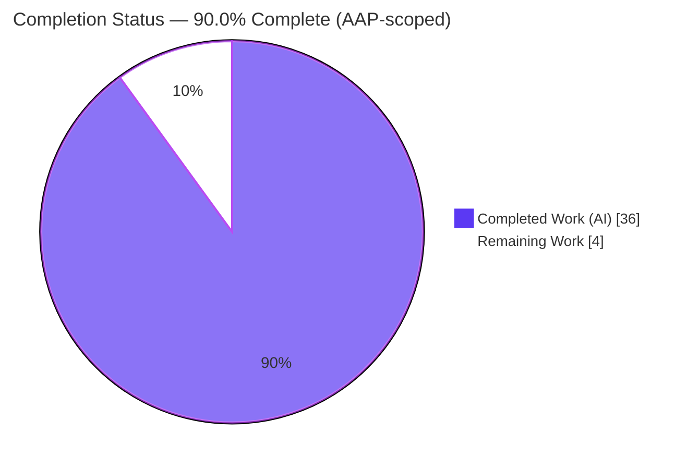
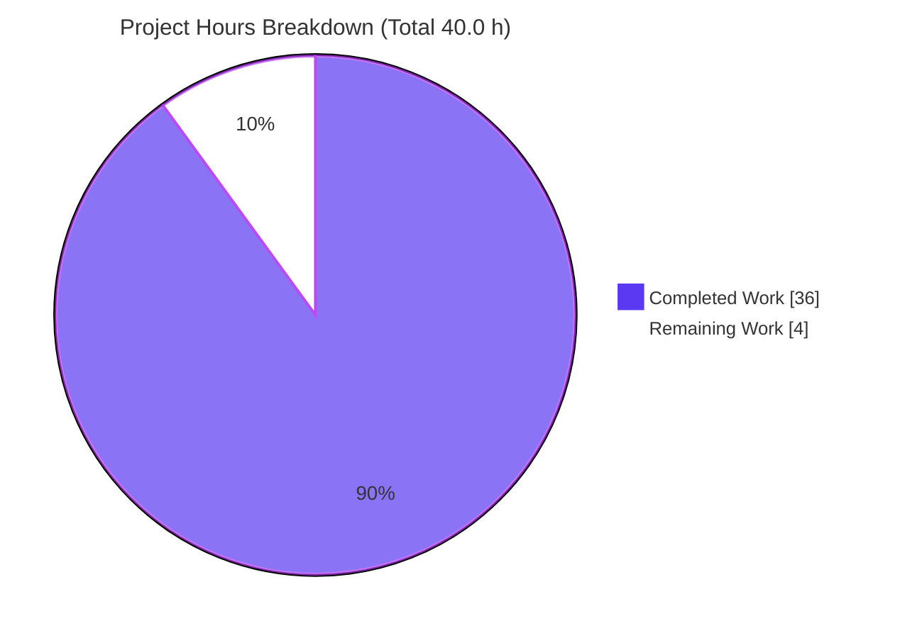
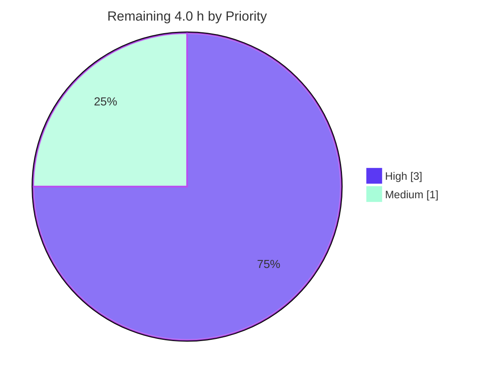

# Blitzy Project Guide — kitty OSC 133 Shell-Integration Parsing Investigation

> **Repository:** `kovidgoyal/kitty` · **Branch:** `blitzy-ed2cb6c3-b0c2-48a8-848d-6c63c7dd2e8a` · **Base commit:** `815df1e210e0a9ab4622f5c7f2d6891d7dbeddf1` · **kitty version:** `0.35.2`
> **Task type:** Read-only runtime investigation / documentation Q&A (rule set "SWE-AtlasQnA-Repo")
> **Sole deliverable:** `blitzy/documentation/kitty_815df1e210e0.md`

---

## 1. Executive Summary

### 1.1 Project Overview

This project empirically investigates and documents how the **kitty** terminal emulator parses and records **OSC 133 (FinalTerm/FTCS) semantic-prompt command-boundary markers** (`A`/`B`/`C`/`D`). The audience is kitty maintainers and shell-integration engineers who need byte-exact, runtime-observed answers rather than code-reading inferences. The single retained artifact is one markdown answer document (`blitzy/documentation/kitty_815df1e210e0.md`, 1,580 lines) that answers three questions — baseline capture (Q1), exit-code variation (Q2), and malformed exit codes (Q3) — each paired with the exact command, complete unedited output, and a `file:line` citation. The technical scope spans the compiled VT parser, the screen marker interpreter, and the Python window receiver, all exercised through their real entry points. It is a strictly read-only investigation: no source, test, config, or build file is modified.

### 1.2 Completion Status



**Center metric: 90.0% Complete** &nbsp;·&nbsp; <span style="color:#5B39F3">■ Completed (Dark Blue #5B39F3)</span> &nbsp;·&nbsp; <span>□ Remaining (White #FFFFFF)</span>

| Metric | Value |
|---|---|
| **Total Hours** | **40.0 h** |
| **Completed Hours (AI + Manual)** | **36.0 h** (AI: 36.0 h · Manual: 0.0 h) |
| **Remaining Hours** | **4.0 h** |
| **Percent Complete** | **90.0%** &nbsp; ( 36.0 ÷ 40.0 × 100 ) |

> Completion is computed with the PA1 AAP-scoped, hours-based method: every hour traces to an AAP requirement or a path-to-production activity. All 16 AAP requirements are delivered and validated; the remaining 4.0 h is mandatory **human** path-to-production (independent reproduction, review sign-off, merge) that cannot be performed autonomously.

### 1.3 Key Accomplishments

- ✅ Built kitty in its **default/canonical configuration** (`python3 setup.py`, **without** `DUMP_COMMANDS`) in the supplied container — `SETUP_EXIT=0`, artifacts `fast_data_types.so` (1,213,072 B) and `launcher/kitty` (36,224 B).
- ✅ Answered **Q1** with byte-exact measurements observed at runtime: raw-stream length **58 B**, `D;42` at **offset 53**, OSC bytes present in the raw stream but **consumed** (absent) from the rendered screen cells (`total 0`).
- ✅ Answered **Q2**: exit-code sweep `0,1,42,99,127` → lengths `57/57/58/58/59`, `D` marker offset **constant at 53** (D is last); demonstrated the digit-count-delta shift on the bash-faithful trailing `A`; captured code-**99** end-to-end (`last_cmd_exit_status = 99`, watcher payload `exit_status: 99`) through the **real** `Window` receiver.
- ✅ Answered **Q3**: both malformed inputs (`not_a_number`, empty) record **`0`** via the real `Window.handle_cmd_end`; the non-canonical test-harness `Callbacks` value (`sys.maxsize`) is included and clearly labeled.
- ✅ Verified **read-only integrity** — only the answer document added since base; temporary probe scripts removed; working tree clean; build artifacts gitignored.
- ✅ Confirmed **stability across ≥2 runs** (byte-identical outputs, SHA-256 verified) and grounded every claim with a `file:line` citation (~151 references).

### 1.4 Critical Unresolved Issues

| Issue | Impact | Owner | ETA |
|---|---|---|---|
| _None — no blocking issues._ All 16 AAP requirements are delivered and validated (all gates passed). | None | — | — |

> There are **no code defects, failing tests, or missing features**. Two low-severity *methodological nuances* (documented, non-blocking) warrant explicit reviewer acknowledgment — see §5 and §6 (risks T2, T3). They do not block merge; they are acceptance items for the human reviewer.

### 1.5 Access Issues

| System/Resource | Type of Access | Issue Description | Resolution Status | Owner |
|---|---|---|---|---|
| Supplied Docker image (`ghcr.io/scaleapi/swe-atlas:swe_atlas_QnA_kovidgoyal_kitty_1.0`) | Build/runtime environment | Compiled parser requires the container's Python 3.12 + Go + pkg-config toolchain; the inspection sandbox has Python 3.13 and lacks Go/pkg-config, so it cannot run the compiled `.so` directly | Expected & documented — all runtime observation performed in-container; sandbox verified byte-arithmetic + artifact sizes independently | Reviewer (has container access) |

> No repository-permission, credential, or third-party API access issues exist. This is a self-contained, read-only investigation with no external service dependencies.

### 1.6 Recommended Next Steps

1. **[High]** Reproduce the build and all three probes inside the supplied container; confirm `EXIT=0` and the documented values/SHA-256 checksums (≈1.5 h).
2. **[High]** Perform technical & compliance review of the answer document, spot-checking citations and the byte arithmetic, and **explicitly accept** the two documented methodological nuances (PROBE B scaffold-fallback; non-default notification-body toggle) (≈1.5 h).
3. **[Medium]** Merge the PR and complete repository housekeeping; confirm build artifacts remain gitignored/uncommitted (≈1.0 h).
4. **[Low]** _(Optional, out of AAP scope)_ Add a lightweight CI job that rebuilds in-container and re-runs the three probes as a regression guard.

---

## 2. Project Hours Breakdown

### 2.1 Completed Work Detail

All completed work is autonomous (AI). Each component traces to an AAP requirement or a required investigation activity.

| Component | Hours | Description |
|---|---:|---|
| C1 — Canonical build & environment foundation | 3.0 | Container setup, toolchain verification, `python3 setup.py` (no `DUMP_COMMANDS`), artifact verification (AAP §0.5.1, R#1) |
| C2 — VT-parser & shell-integration dispatch-chain analysis | 5.0 | Read/trace `vt-parser.c` `case 133`, `screen.c` `shell_prompt_marking` (A/C/D, no B), `window.py` receiver, `kitty_tests` entry, shell-integration emitters (R#2/R#3) |
| C3 — Q1 baseline capture probe & measurements | 3.0 | PROBE A Q1: raw-vs-screen capture, length 58, `D;42` offset 53, OSC-consumption evidence (R#4–R#7) |
| C4 — Q2 exit-code sweep & offset-shift analysis | 3.0 | PROBE A Q2: sweep `0/1/42/99/127`, D-last constant offset, bash-faithful trailing-`A` shift (R#8/R#9) |
| C5 — Q2 code-99 end-to-end + Q3 malformed via real `Window` | 6.0 | PROBE B: real `Window` bytecode, `last_cmd_exit_status`, watcher payload, notify gate + duration nuance, malformed→0 (R#10/R#11) |
| C6 — Dispatch-chain A/B/C/D callback evidence | 2.0 | PROBE C: per-marker `cmd_output_marking` callback forms; proves no `case 'B'`; cells consumed (R#2) |
| C7 — State-transition capture + ≥2-run stability | 2.0 | Before/during/after `D` transitions; byte-identical reruns + SHA-256/diff proof (R#12/R#13) |
| C8 — OSC 133 / FTCS protocol web research | 1.0 | Validated A/B/C/D semantics & BEL/ST terminator conventions against the ecosystem spec (AAP §0.2.2) |
| C9 — Answer-document authoring | 8.0 | 1,580-line document: all sections, exact commands, complete unedited output, ~151 `file:line` citations, reasoning (R#16) |
| C10 — Autonomous validation & code-review remediation | 3.0 | Addressed review findings (+542/-58), build-log characterization fix, citation audit, cleanup & git-clean verification (R#14/R#15) |
| **Total Completed** | **36.0** | Matches Completed Hours in §1.2 |

### 2.2 Remaining Work Detail

All remaining work is **human** path-to-production. Each category traces to a residual risk and a Section 1.6 next step.

| Category | Hours | Priority |
|---|---:|---|
| R1 — Independent runtime reproduction (in-container build + 3 probes, verify values & SHA-256) | 1.5 | High |
| R2 — Technical & compliance review / sign-off (citation spot-check, byte-arithmetic sanity, accept methodological nuances) | 1.5 | High |
| R3 — PR merge & repository housekeeping (confirm clean tree, artifacts gitignored, close PR) | 1.0 | Medium |
| **Total Remaining** | **4.0** | Matches Remaining Hours in §1.2 and §7 pie chart |

### 2.3 Hours Reconciliation

| Check | Result |
|---|---|
| Section 2.1 total (Completed) | 36.0 h |
| Section 2.2 total (Remaining) | 4.0 h |
| **2.1 + 2.2 = Total (§1.2)** | 36.0 + 4.0 = **40.0 h** ✅ |
| **Completion %** | 36.0 ÷ 40.0 × 100 = **90.0%** ✅ |
| **§1.2 ↔ §2.2 ↔ §7 remaining** | 4.0 h in all three ✅ |

---

## 3. Test Results

For this documentation task, "tests" are the **empirical probe verifications** and **validation gates** executed autonomously by Blitzy's validation systems. All entries below originate from Blitzy's autonomous validation logs for this project (GATE 1–4). The upstream kitty `pytest` suite was **not** part of the deliverable scope and was not run; the deliverable is a runtime-observed answer document.

| Test Category | Framework / Harness | Total Checks | Passed | Failed | Coverage | Notes |
|---|---|---:|---:|---:|---|---|
| Runtime Probe A — Q1 + Q2 sweeps + non-canonical `Callbacks` | Canonical launcher `+launch`, real compiled `parse_bytes` | 20 | 20 | 0 | Q1(a–d), Q2(a,b) | `EXIT=0`; byte-identical across 2 runs; SHA-256 `a8e5fa32…724e9f2f` |
| Runtime Probe B — canonical real-`Window`: Q2 code=99 + Q3 malformed | Canonical launcher `+launch`, real `Window` bytecode | 14 | 14 | 0 | Q2(c), Q3 | `EXIT=0`; stable across 2 runs (only monotonic timestamps differ) |
| Runtime Probe C — dispatch chain A/B/C/D | Canonical launcher `+launch`, real compiled `parse_bytes` | 10 | 10 | 0 | Dispatch semantics | `EXIT=0`; byte-identical across 2 runs; SHA-256 `36428420…01a3505f` |
| Canonical Build | `python3 setup.py` | 1 | 1 | 0 | Build gate | `SETUP_EXIT=0`; 122 C units; `vt-parser.c` compiled twice; artifacts verified |
| Document Integrity | UTF-8 / code-fence / NUL scan | 3 | 3 | 0 | Deliverable | Valid UTF-8; 76 balanced code fences; 0 NUL bytes |
| **Totals** | — | **48** | **48** | **0** | — | **100% pass** |

**Supplementary autonomous checks (pass, not double-counted above):** citation audit (~151 `file:line` references verified exact against source), read-only compliance (`git diff --name-status 815df1e210e0 HEAD` = single added file), cleanup verification (no `osc133_probe*` scripts remain in the tree), and ≥2-run stability confirmation for every reported value.

---

## 4. Runtime Validation & UI Verification

**Runtime components exercised (through their real entry points):**

- ✅ **Operational** — Real compiled VT parser (`parse_bytes` → `dispatch_osc` `case 133` → `shell_prompt_marking`); OSC 133 bytes consumed, screen cells render only literal output.
- ✅ **Operational** — Real screen marker interpreter `shell_prompt_marking` (`kitty/screen.c`): `case 'A'`/`'C'`/`'D'` fire; **no `case 'B'`** (B is consumed as a no-op) — confirmed at runtime via PROBE C callback log.
- ✅ **Operational** — Real Python receiver `Window.cmd_output_marking` / `Window.handle_cmd_end` (`kitty/window.py`) executing shipped bytecode: `int()`/`except→0`, watcher payload, notify gate, body string.
- ✅ **Operational** — Canonical launcher `./kitty/launcher/kitty +launch <script>` used to run every probe (per the project's own test convention).
- ✅ **Operational** — `notify_on_cmd_finish` option parser and command-finish watcher payload produced by real shipped code; default value `never` observed to suppress the notification body (expected).

**API integration outcomes:** Not applicable — no external services, network calls, or credentials are involved in this read-only investigation.

**UI verification:** Not applicable — there is **no GUI/UI component in scope**. kitty was driven **headlessly** via the compiled parser and the `+launch` entry point; no window, rendering, or interactive surface was required or exercised. Consequently no screenshots/screencasts apply.

---

## 5. Compliance & Quality Review

The governing "SWE-AtlasQnA-Repo" rules are treated as hard requirements. Each is cross-mapped to observed evidence below.

| Rule / Benchmark | Status | Evidence & Notes |
|---|:--:|---|
| Deliverable name & location (`blitzy/documentation/<branch>.md`) | ✅ Pass | `blitzy/documentation/kitty_815df1e210e0.md` created (only retained artifact) |
| Run-first (build & run before writing) | ✅ Pass | Canonical build + 3 probes executed; document written from captured output |
| Real code path only (no dump build / mock) | ✅ Pass | `parse_bytes` on the no-`DUMP_COMMANDS` build; real `Window` bytecode; PROBE C confirms live callbacks |
| Default / canonical configuration | ✅ Pass | `python3 setup.py`; default options; exact build & invocation commands stated |
| Exercise every condition (incl. edge/error) | ✅ Pass | Q1 baseline; Q2 sweep incl. code 99; Q3 malformed (`not_a_number`, empty) |
| Report state transitions (before/during/after) | ✅ Pass | `last_cmd_exit_status`: `0 → 0 (after C) → 99 (after D)`; malformed `999 → 0` |
| Pick the implementation that manifests the behavior | ✅ Pass | Canonical exit status taken from the real `Window` receiver, not the harness |
| Show complete, unedited output for every claim | ✅ Pass | Full probe outputs embedded next to each claim, with the producing command |
| Magnitude/stability across ≥2 runs | ✅ Pass | Byte-identical reruns; SHA-256 verified; only monotonic timestamps vary |
| Be exact & grounded (`file:line`, named functions) | ✅ Pass | ~151 citations; all spot-checked exact against source |
| Report exactly what is observed; label inferences | ✅ Pass | Non-canonical `Callbacks` value & non-default notify toggle explicitly labeled |
| Answer every part & named item | ✅ Pass | Q1(a–d), Q2(a–c), Q3 both inputs, all named files/functions addressed |
| Read-only scope (no source edits; scripts removed) | ✅ Pass | `git diff` = single added file; probe scripts deleted; artifacts gitignored |

**Fixes applied during autonomous validation:** addressed code-review findings (+542/-58 lines) and corrected the build-log characterization in §2.1/§9.6 (the embedded 332-line log was captured with generated Wayland sources present; a pristine build is 381 lines) — committed `c7e3a33b8`.

**Outstanding compliance items:** none blocking. Two documented nuances require explicit reviewer acceptance (see §6, T2/T3).

---

## 6. Risk Assessment

| Risk | Category | Severity | Probability | Mitigation | Status |
|---|---|:--:|:--:|---|---|
| T1 — Inspection sandbox cannot execute the compiled parser (Python 3.12 `.so` vs 3.13 host); parser-dependent claims not re-run in sandbox | Technical | Low | Low | Byte-arithmetic reproduced exactly in sandbox; artifact sizes match; all 3 probes run in-container (`EXIT=0`, byte-identical, SHA-256) | Mitigated — closes on human reproduction (R1) |
| T2 — PROBE B binds real `Window` bytecode to a scaffolded state object (genuine `Window` needs a live Boss/OS-window/child, impractical headlessly) | Technical | Low | Low | AAP §0.5.1 sanctions this fallback; only surrounding state scaffolded; `int()`/`except`, watcher payload, gate & body are all real shipped bytecode; clearly labeled | Documented — needs reviewer acceptance (R2) |
| T3 — Code-99 notification **body** surfaces only under a non-default `notify_on_cmd_finish` toggle (fresh-process monotonic duration gate) | Technical | Low | Low | Labeled non-default; duration-ordering nuance explained; canonical values (`=99`, watcher `99`) captured under **default** config | Documented honestly |
| S1 — Security exposure from changes | Security | Informational | N/A | Read-only investigation: no shipped code, no new attack surface, no auth/crypto/data handling, no dependency changes | N/A — no security impact |
| O1 — Build-log line count varies with generated Wayland sources (332 vs 381 lines) | Operational | Low | Low | Reconciled & document reworded (commit `c7e3a33b8`); all substantive build facts unchanged | Resolved |
| O2 — Build artifacts are gitignored & Python-3.12-specific (not portable to sandbox) | Operational | Low | Low | Correct per read-only mandate; artifacts never committed | Expected / Documented |
| I1 — External service/API/credential integration | Integration | Informational | N/A | None exists in this investigation | N/A |
| I2 — Run-to-run monotonic timestamp variation | Integration | Informational | Low | Not a reported quantity; stability proof isolates timestamps as the only differing lines | Documented |

**Overall risk: LOW.** Correctness risk is very low — byte-arithmetic independently reproduced exactly, citations verified exact, and the source logic (`int`/`except→0`, no `case 'B'`, `suppress`-retains) matches the documented behavior. The principal residual items are the two methodological nuances (T2, T3), both closed by the human review tasks.

---

## 7. Visual Project Status

**Project hours — completed vs. remaining** (Completed = Dark Blue `#5B39F3`, Remaining = White `#FFFFFF`):



**Remaining work — priority distribution** (High = Dark Blue `#5B39F3`, Medium = Mint `#A8FDD9`):



**Remaining hours per category (Section 2.2):**

| Category | Hours | Bar |
|---|---:|---|
| R1 — Independent runtime reproduction | 1.5 | `███████▌` |
| R2 — Technical & compliance review / sign-off | 1.5 | `███████▌` |
| R3 — PR merge & housekeeping | 1.0 | `█████` |
| **Total** | **4.0** | — |

> **Integrity check:** "Remaining Work" = **4.0 h** here equals the Remaining Hours in §1.2 and the sum of the §2.2 Hours column.

---

## 8. Summary & Recommendations

**Achievements.** The project delivers a rigorous, runtime-observed answer to all three questions about kitty's OSC 133 handling. It builds kitty canonically, drives the **real** compiled parser and the **real** `Window` receiver, and reports byte-exact measurements (Q1 length 58 / offset 53; Q2 sweep `57/57/58/58/59` with a constant `D`-marker offset and a digit-count-delta shift on trailing markers; code-99 recorded as `99` end-to-end; Q3 malformed inputs recorded as `0`). Every claim is paired with its command, complete output, and a `file:line` citation, and every value is stable across ≥2 runs.

**Remaining gaps.** No functional gaps remain. The outstanding **4.0 h** is exclusively human path-to-production: independent in-container reproduction, technical/compliance sign-off, and PR merge. Two low-severity methodological nuances (the AAP-sanctioned PROBE B scaffold-fallback and the non-default notification-body toggle) are fully documented and simply require a reviewer's explicit acknowledgment.

**Critical path to production.** (1) Reproduce in-container → (2) Review & accept nuances → (3) Merge. There are no dependencies between these beyond their order, and no engineering rework is anticipated.

**Success metrics.** All 16 AAP requirements delivered (100% of scope implemented); 48/48 autonomous verifications passed; read-only mandate satisfied (single added file); repository clean.

**Production readiness assessment.** The deliverable is **production-ready pending human review/merge**. At **90.0% AAP-scoped completion**, the work is functionally complete and validated; the reserved 10% reflects mandatory human activities that, by policy, are never auto-completed. Recommendation: **proceed to reproduction and review, then merge.**

| Metric | Value |
|---|---|
| AAP requirements delivered | 16 / 16 |
| Autonomous verifications passed | 48 / 48 (100%) |
| Files changed vs. base | 1 (added) |
| AAP-scoped completion | **90.0%** |
| Production-readiness | Ready pending human review/merge |

---

## 9. Development Guide

This guide reproduces the investigation and verifies the deliverable. Commands are copy-pasteable. Those that require the compiled parser must run **inside the supplied Docker container**; sandbox-independent verification commands are marked accordingly.

### 9.1 System Prerequisites

- **Docker** with access to the supplied image: `ghcr.io/scaleapi/swe-atlas:swe_atlas_QnA_kovidgoyal_kitty_1.0` (Docker Hub: `andrewparkscaleai/coding-agent:kovidgoyal__kitty__815df1e210e0a9ab4622f5c7f2d6891d7dbeddf1`).
- **Inside the container** (already provisioned): Python **3.12.3**, Go **1.23.4**, gcc **13.3.0**, pkg-config **1.8.1**, plus pkg-config libs (harfbuzz, libpng, lcms2, openssl, freetype2, fontconfig, libcanberra, gl, zlib, libxxhash) and `Python.h`.
- **For sandbox-only verification** (no container): Python 3.x is sufficient for the byte-arithmetic and document-integrity checks.

### 9.2 Environment Setup

```bash
# Start / enter the supplied container (repository bind-mounted at /app).
# Example (container name used during validation was "kitty_setup"):
docker exec -it kitty_setup bash
cd /app        # repository root inside the container
```

### 9.3 Canonical Build  _(container-only)_

```bash
# Default/canonical build — exactly what Makefile `all:` runs (no DUMP_COMMANDS):
cd /app && python3 setup.py
# Expect the tail:
#   [1/5] Linking kitty/fast_data_types ...
#   ...
#   SETUP_EXIT=0
# Verify artifacts (gitignored, never committed):
ls -la kitty/fast_data_types*.so kitty/launcher/kitty
#   -rwxr-xr-x ... 1213072 kitty/fast_data_types.so
#   -rwxr-xr-x ...   36224 kitty/launcher/kitty
```

### 9.4 Running the Probes  _(container-only)_

The three probe scripts are reproduced verbatim in the answer document's appendix (§9.3 PROBE A, §9.4 PROBE B, §9.5 PROBE C). Extract each to `/tmp` and run via the canonical launcher:

```bash
cd /app
./kitty/launcher/kitty +launch /tmp/osc133_probe_a.py    # Q1 + Q2 sweeps + non-canonical Callbacks
./kitty/launcher/kitty +launch /tmp/osc133_probe_b.py    # canonical real-Window: Q2 code=99 + Q3
./kitty/launcher/kitty +launch /tmp/osc133_probe_c.py    # dispatch chain A/B/C/D

# Host-side wrapper actually used during validation (required env):
docker exec -e LANG=C.UTF-8 -e LC_ALL=C.UTF-8 -e TMPDIR=/fasttmp kitty_setup \
  bash -lc 'cd /app && ./kitty/launcher/kitty +launch /tmp/osc133_probe_a.py'
```

Expected key values: Q1 `len(stream)=58`, `find(b"D;42")=53`; Q2 D-last lengths `57/57/58/58/59`; code-99 `last_cmd_exit_status=99`; Q3 `not_a_number→0`, `''→0`.

### 9.5 Stability Check  _(container-only)_

```bash
cd /app
./kitty/launcher/kitty +launch /tmp/osc133_probe_a.py > /tmp/a1.txt 2>&1
./kitty/launcher/kitty +launch /tmp/osc133_probe_a.py > /tmp/a2.txt 2>&1
diff /tmp/a1.txt /tmp/a2.txt && echo IDENTICAL
sha256sum /tmp/a1.txt /tmp/a2.txt   # both == a8e5fa32...724e9f2f
```

### 9.6 Verifying the Deliverable  _(sandbox-independent — tested)_

```bash
cd <repo-root>

# (a) Read-only compliance: only the answer document added since base
git diff --name-status 815df1e210e0a9ab4622f5c7f2d6891d7dbeddf1 HEAD
#   A   blitzy/documentation/kitty_815df1e210e0.md

# (b) Clean working tree
git status --porcelain    # (empty output = clean)

# (c) No temporary probe scripts remain in the tree
find . -name 'osc133_probe*' -not -path './.git/*'    # (empty = none)

# (d) Byte-arithmetic reproduction (no compiled parser needed) — Q1/Q2
python3 - <<'PY'
ESC=b'\x1b'; BEL=b'\x07'; osc=lambda p: ESC+b']'+p+BEL
s=osc(b'133;A')+osc(b'133;B')+osc(b'133;C;cmdline=ls -la')+b'total 0\n'+osc(b'133;D;42')
assert len(s)==58 and s.find(b'D;42')==53
print("Q1 len=%d offset=%d (expect 58,53)"%(len(s), s.find(b'D;42')))
print("Q2 D-last lengths:", [len(osc(b'133;A')+osc(b'133;B')+osc(b'133;C;cmdline=ls -la')+b'total 0\n'+osc(b'133;D;'+c)) for c in [b'0',b'1',b'42',b'99',b'127']])
PY

# (e) Document integrity (valid UTF-8, balanced fences, 0 NUL)
python3 - <<'PY'
d=open('blitzy/documentation/kitty_815df1e210e0.md','rb').read(); d.decode('utf-8')
t=d.decode('utf-8'); fences=sum(1 for ln in t.splitlines() if ln.startswith('```'))
print("bytes=%d fences=%d(even=%s) NUL=%d"%(len(d), fences, fences%2==0, d.count(b'\x00')))
PY
```

### 9.7 Example Usage

To read the answers directly, open the document and jump to the relevant section:

```bash
sed -n '15,45p'  blitzy/documentation/kitty_815df1e210e0.md   # §1 Summary (direct answers)
sed -n '349,431p' blitzy/documentation/kitty_815df1e210e0.md  # §4 Q1 baseline
sed -n '432,640p' blitzy/documentation/kitty_815df1e210e0.md  # §5 Q2 exit-code variation
sed -n '641,718p' blitzy/documentation/kitty_815df1e210e0.md  # §6 Q3 malformed
```

### 9.8 Troubleshooting

- **`ImportError: libpython3.12.so.1.0: cannot open shared object file`** — you are running outside the container (or with the wrong Python). The compiled `.so` is Python-3.12-specific; run inside the supplied container. _(Byte-arithmetic and integrity checks in §9.6 do **not** require the parser and work anywhere.)_
- **`go: command not found` / `pkg-config: command not found`** — you are not inside the supplied container; the build toolchain lives only there.
- **Notification body for code-99 does not appear** — this is **expected** under the default `notify_on_cmd_finish = never`, which suppresses the body. The canonical recorded values (`last_cmd_exit_status=99`, watcher `exit_status: 99`) are still produced. To surface the body for inspection, use the explicitly non-default toggle described in §5.3 of the answer document.
- **Build log shows 381 lines, not 332** — expected for a pristine/clean checkout (a 28-step Wayland "Generating" phase precedes the C compile). The C/link/Go phases are identical either way; see §2.1/§9.6 of the answer document.

---

## 10. Appendices

### A. Command Reference

| Purpose | Command | Where |
|---|---|---|
| Canonical build | `cd /app && python3 setup.py` | Container |
| Run a probe | `./kitty/launcher/kitty +launch /tmp/osc133_probe_a.py` | Container |
| Host wrapper | `docker exec -e LANG=C.UTF-8 -e LC_ALL=C.UTF-8 -e TMPDIR=/fasttmp kitty_setup bash -lc '…'` | Host |
| Read-only compliance | `git diff --name-status 815df1e210e0a9ab4622f5c7f2d6891d7dbeddf1 HEAD` | Anywhere |
| Clean-tree check | `git status --porcelain` | Anywhere |
| Stability + checksum | `diff a1.txt a2.txt && sha256sum a1.txt a2.txt` | Container |

### B. Port Reference

Not applicable — this investigation uses no network ports or listening services (headless parser + launcher only).

### C. Key File Locations

| Path | Role |
|---|---|
| `blitzy/documentation/kitty_815df1e210e0.md` | **The deliverable** (answer document) |
| `kitty/vt-parser.c` (`L536–546`) | OSC `case 133` dispatch → `shell_prompt_marking` |
| `kitty/screen.c` (`shell_prompt_marking`) | Marker interpreter; `case 'A'/'C'/'D'`, **no `case 'B'`** |
| `kitty/window.py` (`L1408–1461`, `L244`, `L457`) | Real `Window` receiver: `handle_cmd_end`, `int`/`except→0`, watcher, `cmd_output` |
| `kitty_tests/__init__.py` (`L30–36`, `L71–79`) | Real headless entry `parse_bytes`; divergent `Callbacks` receiver |
| `shell-integration/{bash,zsh,fish}` | Canonical BEL-framed OSC 133 emitters |
| `setup.py` (`L721–722`), `Makefile` (`L12–13`) | Canonical build; `DUMP_COMMANDS` is a separate variant |

### D. Technology Versions

| Component | Version | Source |
|---|---|---|
| kitty | 0.35.2 (commit `815df1e210e0`) | Repository |
| Python (container) | 3.12.3 | Container toolchain |
| Go (container) | 1.23.4 | Container toolchain |
| gcc (container) | 13.3.0 | Container toolchain |
| pkg-config (container) | 1.8.1 | Container toolchain |

### E. Environment Variable Reference

| Variable | Value used | Purpose |
|---|---|---|
| `LANG` | `C.UTF-8` | Deterministic locale for probe output |
| `LC_ALL` | `C.UTF-8` | Deterministic locale for probe output |
| `TMPDIR` | `/fasttmp` | Scratch dir for temporary probe scripts (inside container) |

### F. Developer Tools Guide

- **Real parser entry:** `kitty_tests.parse_bytes(screen, data)` drives the compiled VT parser via the `Screen` test C-API (`test_create_write_buffer` / `test_commit_write_buffer` / `test_parse_written_data`) — the canonical no-GUI way to feed bytes.
- **Canonical launcher:** `./kitty/launcher/kitty +launch <script.py>` runs a Python script in kitty's environment (the project's own test convention).
- **Two notions of "captured output":** the raw byte stream (OSC bytes present) vs. rendered screen cells (OSC consumed) — see §4 of the answer document.

### G. Glossary

| Term | Meaning |
|---|---|
| **OSC 133** | FinalTerm/FTCS semantic-prompt escape sequences marking prompt/command boundaries |
| **`A` / `B` / `C` / `D`** | Prompt start / command start / command-output start / command finished (with optional exit code) |
| **BEL framing** | Terminating OSC with the BEL byte `0x07` (`\a`) — the form kitty's shell integration uses |
| **`shell_prompt_marking`** | The `kitty/screen.c` function that interprets the marker after OSC dispatch |
| **Canonical vs. non-canonical** | Values from the real shipped `Window` receiver are canonical; the test-harness `Callbacks` values are non-canonical |
| **`DUMP_COMMANDS`** | A separate debug build variant (not the default) that would dump parser commands instead of dispatching them |

---

*Prepared by the Blitzy autonomous project-assessment agent. All hour figures are AAP-scoped (PA1 methodology); completion = Completed ÷ (Completed + Remaining) × 100 = 36.0 ÷ 40.0 × 100 = **90.0%**. Brand colors: Completed = Dark Blue `#5B39F3`, Remaining = White `#FFFFFF`.*