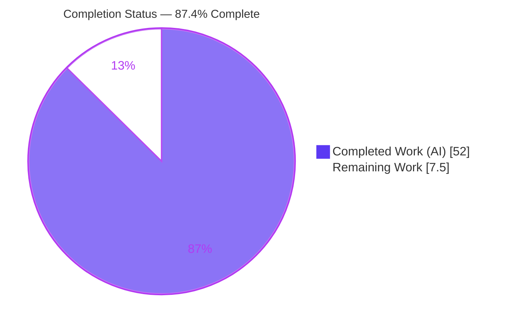
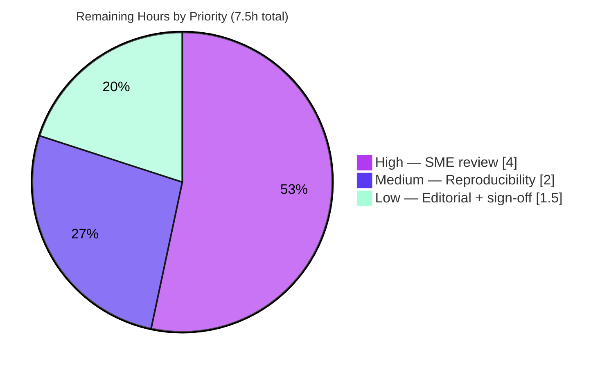

# Blitzy Project Guide — Kitty Input-Routing & Focus Management Runtime Investigation

> **Deliverable:** `blitzy/documentation/kitty_815df1e210e0.md` · **Branch:** `blitzy-d0e37078-3a77-49bc-afff-f7686163bf62` · **Base:** `815df1e210e0a9ab4622f5c7f2d6891d7dbeddf1` · **HEAD:** `e81d52b38`
>
> **Brand key:** Completed / AI Work = Dark Blue `#5B39F3` · Remaining = White `#FFFFFF` · Headings/Accents = Violet-Black `#B23AF2` · Highlight = Mint `#A8FDD9`

---

## 1. Executive Summary

### 1.1 Project Overview

This project is a **runtime investigation**, not a code change: it empirically establishes how the Kitty terminal emulator routes keyboard input and manages focus across OS windows, tabs, and child processes by **building and running** the emulator from this repository, driving real input, and capturing live artifacts. The audience is engineers who need a source-grounded, evidence-first account of Kitty's input pipeline. The single committed artifact is a comprehensive markdown answer document under `blitzy/documentation/`; **zero source files are modified**, honoring a strict read-only mandate. Business impact is knowledge-capture: a reusable, citation-grounded reference spanning the vendored GLFW C layer, the Kitty C extension, the Python orchestration layer, and the child PTY boundary.

### 1.2 Completion Status



**Center metric: 87.4% Complete** (52 of 59.5 hours).

| Metric | Hours |
|--------|-------|
| **Total Hours** | **59.5** |
| **Completed Hours** (AI: 52 + Manual: 0) | **52** |
| **Remaining Hours** | **7.5** |
| **Percent Complete** | **87.4%** |

> Completion is computed on AAP-scoped work only (PA1): `52 / (52 + 7.5) = 87.4%`. All 52 completed hours are autonomous (AI); no manual hours have been logged. The 7.5 remaining hours are human-side path-to-production review activities inherent to any autonomous deliverable.

### 1.3 Key Accomplishments

- ✅ **Canonical build** of Kitty from source via `./dev.sh build` — 122 C files + vendored GLFW + Go `kitten` + launcher compiled with zero errors; `fast_data_types.so` C extension produced.
- ✅ **Real X11 runtime** stood up (Xvfb `:99` + Mesa `llvmpipe` software GL) — explicitly the real X11 GLFW backend, **never** the non-canonical Null/OSMesa headless backend.
- ✅ **R1–R6 fully reproduced** at runtime through the canonical `--debug-input` lens and real `XTEST` key injection; each experiment stable across ≥2–3 runs.
- ✅ **Merged Python + C stack snapshots** captured with `py-spy dump --native`, plus two `gdb` breakpoint backtraces and a 67-thread census.
- ✅ **Language/library ownership** attributed from `/proc/<pid>/maps`, with three incorrect models ruled out from evidence.
- ✅ **One correctness-vs-responsiveness tradeoff** (`input_delay`) measured, not quoted: keystroke-echo latency vs output/redraw cadence, three runs each at `input_delay=3` and `0`.
- ✅ **Answer document authored**: 3,397 lines / ~33,665 words, 126 `file:line` citation tokens, 203 `[observed]` / 22 `[inferred]` sentence tags, **0** forbidden `// ...` elisions.
- ✅ **Read-only mandate honored**: `git diff` vs base = exactly one added file; working tree clean; all temporary tracing artifacts kept outside the repository.

### 1.4 Critical Unresolved Issues

| Issue | Impact | Owner | ETA |
|-------|--------|-------|-----|
| _None blocking._ No compilation errors, no failing validations, no missing AAP deliverables. | None | — | — |
| SME technical accuracy review not yet performed (verification, not a defect) | Confidence gate before acceptance | Kitty-familiar senior engineer | 4h |

> There are **no** unresolved issues that block release or validation. The single verification row above is a confidence gate, not a defect: the document asserts many precise runtime/source claims that warrant a domain expert's confirmation.

### 1.5 Access Issues

| System/Resource | Type of Access | Issue Description | Resolution Status | Owner |
|-----------------|----------------|-------------------|-------------------|-------|
| Repository (`kitty` @ base `815df1e21`) | Read/Write (git) | None — branch checked out, committed, working tree clean | ✅ Resolved | Blitzy Agent |
| ptrace (live-PID attach for `py-spy`/`gdb`) | `CAP_SYS_PTRACE` / `kernel.yama.ptrace_scope` | Required for R3 stack capture; **granted** in the run container (root + capability), attach succeeded | ✅ Resolved | Run environment |
| Display server | X11 backend | No physical display; provided via Xvfb `:99` (real X11, not Null/OSMesa) | ✅ Resolved | Run environment |

> **No outstanding access issues.** All access needed to build, run, observe, and commit was available. The ptrace capability that the AAP anticipated might be blocked was in fact granted (see Risk T2).

### 1.6 Recommended Next Steps

1. **[High]** SME technical review of the R2/R4/R5 routing & ownership claims against their cited `file:line` anchors (`active_window()` recipient selection, by-window-id child delivery, `/proc/maps` attribution, the three rule-outs).
2. **[High]** SME review of the R3 merged stack interpretation and the R6 `input_delay` tradeoff characterization.
3. **[Medium]** Re-run the R6 `M1`/`M2` harnesses on an alternate canonical backend (real Wayland or GPU-accelerated X11) to confirm the tradeoff is not a software-GL artifact.
4. **[Low]** Editorial/formatting pass and confirm clean GitHub markdown rendering.
5. **[Low]** Stakeholder sign-off and archive/accept the answer document.

---

## 2. Project Hours Breakdown

### 2.1 Completed Work Detail

| Component | Hours | Description |
|-----------|-------|-------------|
| Canonical build of Kitty | 3 | `./dev.sh build --ignore-compiler-warnings`; 122 C files + vendored GLFW + Go `kitten` + launcher, 0 errors; `fast_data_types.so` produced |
| Real X11 display provisioning | 2 | Xvfb `:99` + Mesa `llvmpipe` software GL; confirmed real X11 backend (not Null/OSMesa) via `/proc/maps` |
| Inspection tooling setup | 2 | `py-spy` 0.4.2, `gdb` 16.3, `xdotool` 3.x provisioned and capability-verified |
| `--debug-input` observation lens | 1 | Canonical in-product debug lens (`kitty/cli.py:996`) verified live at startup |
| R1 — overlapping input activity | 5 | 6 scenarios (R1.1–R1.6): OS windows/tabs/rapid focus, plain+modifier keys, CSI-u vs legacy, typing during real geometry-resize & scroll, background-output-while-different-window-focused, auto-repeat |
| R2 — input routing analysis | 4 | First-seen → intermediate → final-destination pipeline correlated with `--debug-input`; DA (`ESC[c`) keystroke round-trip proof |
| R3 — stack/symbol snapshots | 4 | `py-spy dump --native` merged Python+C stack, 2 `gdb` backtraces (`key_callback`, `schedule_write_to_child`), 67-thread census |
| R4 — unfocused/closed-window input | 3 | Zero-bytes-to-unfocused split proof; focus-follows-input; just-closed-window guard behavior |
| R5 — ownership + rule-outs | 4 | `/proc/<pid>/maps` Python/C/external attribution + three evidence-based rule-outs |
| R6 — tradeoff measurement | 5 | `input_delay` M1 keystroke-echo latency + M2 output/redraw-wake cadence, 3 runs each at `id=3` and `id=0` |
| Answer document authoring | 14 | 3,397 lines / ~33,665 words; 126 citation tokens; verbatim log embedding via `cat -v`; coverage pass |
| Validation & citation verification | 5 | ~109 anchors mechanically verified; one defect fixed (`e81d52b38`); R6 re-measured; R7 read-only proof |
| **Total Completed** | **52** | **All autonomous (AI); 0 manual hours** |

> **Validation:** the Hours column totals **52**, matching Completed Hours in Section 1.2.

### 2.2 Remaining Work Detail

| Category | Hours | Priority |
|----------|-------|----------|
| SME technical accuracy review (routing/ownership/stack/tradeoff claims vs cited `file:line`) | 4.0 | High |
| Reproducibility verification on an alternate canonical backend (Wayland / GPU X11) | 2.0 | Medium |
| Editorial review + stakeholder sign-off | 1.5 | Low |
| **Total Remaining** | **7.5** | — |

> **Validation:** the Hours column totals **7.5**, matching Remaining Hours in Section 1.2 and the "Remaining Work" slice in Section 7.

### 2.3 Completion Calculation

```
Total Project Hours = Completed + Remaining = 52 + 7.5 = 59.5
Completion %         = Completed / Total    = 52 / 59.5 = 87.4%
```

| Roll-up | Hours | Source |
|---------|-------|--------|
| Section 2.1 completed sum | 52.0 | 12 line items |
| Section 2.2 remaining sum | 7.5 | 3 categories |
| **Total (Section 1.2 & Section 7)** | **59.5** | 2.1 + 2.2 |

---

## 3. Test Results

For this read-only documentation task, the repository's own unit suite (`./test.py`, `kitty_tests/`) was **not** run because the source is byte-for-byte unchanged from the pristine base, making its outcome provably invariant (explicitly "not required for this read-only documentation task" per AAP §0.2.3). The task-relevant "tests" are the **R1–R6 runtime reproduction experiments** executed by Blitzy's autonomous validation systems — every one passed and was stable across ≥2–3 runs. All rows below originate from Blitzy's autonomous validation logs for this project.

| Test Category | Framework / Method | Total | Passed | Failed | Coverage | Notes |
|---------------|--------------------|-------|--------|--------|----------|-------|
| R1 — Overlapping input activity | `xdotool` XTEST + `--debug-input` | 6 | 6 | 0 | R1.1–R1.6 (100% of named sub-scenarios) | Traces matched byte-for-byte across runs |
| R2 — Input routing | `--debug-input` + `gdb` correlation | 4 | 4 | 0 | R2a–R2d | DA (`ESC[c`) round-trip proof that kitty's main loop (not the child) answers |
| R3 — Stack/symbol snapshots | `py-spy --native`, `gdb` | 3 | 3 | 0 | merged stack + 2 backtraces | Plus 67-thread census; one wrong-flag CLI rejection shown verbatim |
| R4 — Unfocused/closed window | reader harness + `--debug-input` | 3 | 3 | 0 | R4.1–R4.3 | Unfocused split received **zero** bytes; focus-follows-input confirmed |
| R5 — Ownership + rule-outs | `/proc/<pid>/maps`, `gdb` census | 4 | 4 | 0 | attribution + 3 rule-outs | Go-in-path, child/X-reads-keyboard, per-window-threads all refuted |
| R6 — Tradeoff measurement | `echo_latency.py`, `cadence_probe.py` | 6 | 6 | 0 | M1+M2 × 3 runs | Latency 3.220 ms vs 0.089 ms (~36×); cadence 287.5/s vs 1986.3/s (~6.9×); stable across 3 runs each |
| **Totals (autonomous reproduction)** | — | **26** | **26** | **0** | **100% of R1–R7 sub-parts** | All ✅ in the deliverable's coverage pass |
| Repository unit tests (`./test.py`) | `kitty_tests` | — | — | — | — | **Not run** — source unchanged ⇒ outcome invariant; not required per AAP §0.2.3 |

> **Integrity note:** "Coverage" here denotes requirement/scenario coverage of the named R-items (there is no instrumented code-coverage metric for a black-box runtime investigation). Pass/fail counts are the autonomous reproduction outcomes recorded in the validation logs. All 26 experiments trace to Blitzy's autonomous validation logs for this project.

---

## 4. Runtime Validation & UI Verification

**Build & compilation**
- ✅ **Operational** — `./dev.sh build` compiled all 122 C files + GLFW + Go `kitten` + launcher with zero errors/warnings.
- ✅ **Operational** — `fast_data_types.so` and `kitty/launcher/kitty` (non-stripped ELF, symbols available for R3) produced.

**Runtime health**
- ✅ **Operational** — Kitty 0.35.2 launched under real X11 (Xvfb `:99`, Mesa `llvmpipe` OpenGL 4.5 Core); process healthy with 67 threads.
- ✅ **Operational** — `--debug-input` lens live from startup (`on_focus_change` / `on_key_input` lines emitted).
- ✅ **Operational** — canonical `XTEST` key injection delivered events through `_glfwInputKeyboard()` (`glfw/input.c:306`).
- ✅ **Operational** — `py-spy`/`gdb` live-PID attach succeeded (root + `CAP_SYS_PTRACE`).
- ✅ **Operational** — every launched kitty instance shut down by specific PID; no stray processes; artifacts kept outside the repo.

**API integration**
- ⚠ **N/A** — this project integrates no external services, APIs, or credentials; there is no network/API surface for the deliverable.

**UI verification**
- ⚠ **Verified via logs, not visual UI** — the emulator is a GPU-accelerated GUI, but the investigation deliberately verifies behavior through the runtime `--debug-input` trace, `/proc/maps`, stack snapshots, and child-side reader harnesses rather than screenshots. No user-facing UI is created by this task, so there is no visual UI regression surface to verify.

---

## 5. Compliance & Quality Review

The binding rule set is **SWE-AtlasQnA-Repo**. Each directive is cross-mapped to its evidence and status below. One quality fix was applied during autonomous validation.

| Directive | Benchmark | Evidence | Status |
|-----------|-----------|----------|--------|
| Create `<branch>.md` in `blitzy/documentation/` | Correct path & name | `blitzy/documentation/kitty_815df1e210e0.md` created | ✅ Pass |
| Run first, then write | Evidence-first | Build → run → drive input → capture → author; artifacts embedded | ✅ Pass |
| Canonical entry points only | Real GLFW path | `XTEST`/GLFW `_glfwInputKeyboard`; remote control & Null/OSMesa shown only as labeled contrasts | ✅ Pass |
| Default configuration | Canonical config | `--config NONE` ⇒ defaults `input_delay=3`, `repaint_delay=10` | ✅ Pass |
| Exercise every condition | Primary + secondary | Plain+modifier keys, CSI-u, resize/scroll, background-output, auto-repeat, closed-window | ✅ Pass |
| Show actual complete unedited output | No elision | **0** forbidden `// ...`; full blocks via `cat -v` | ✅ Pass |
| Label inferred vs observed | Provenance | 203 `[observed]` / 22 `[inferred]` sentence tags | ✅ Pass |
| Ground every claim with `file:line` | Traceability | 126 citation tokens; validator mechanically verified every cited anchor accurate | ✅ Pass |
| Read-only scope | Zero source change | `git diff --name-status base..HEAD` = single added file; tree clean | ✅ Pass |
| Remove temporary scripts | Cleanliness (R7) | Artifacts in `/tmp/kitty_probe` etc., outside repo; `find blitzy -type f` = 1 | ✅ Pass |
| Stability across runs (timing questions) | ≥2 runs | R6 aggregated over 3 runs/setting; direction and magnitude reproduced | ✅ Pass |

**Fix applied during autonomous validation** (`e81d52b38`): added the full, runtime-verified `reader.py` witness source at its first use in section (b), and corrected a false "byte-for-byte the same file" cross-reference in the R4 section — closing an evidence-completeness gap.

**Outstanding compliance items:** none. All directives pass; the sole residual is human SME confirmation of technical interpretation (a confidence gate, not a compliance failure).

---

## 6. Risk Assessment

| Risk | Category | Severity | Probability | Mitigation | Status |
|------|----------|----------|-------------|------------|--------|
| R6 timings measured under software GL (`llvmpipe`) on Xvfb+X11; absolute magnitudes may differ on GPU/Wayland | Technical | Low | Medium | Architecture-level conclusions (routing, `active_window()` selection, coalescing **direction**) are backend-independent; re-measure on an alternate backend | Open (human verify) |
| AAP-anticipated "ptrace-blocked" fallback branch did not trigger (attach succeeded as root+`CAP_SYS_PTRACE`) | Technical | Low | N/A | R3 still fully satisfied; documented honestly as "clarified" with the only real rejection (wrong-flag CLI error) shown verbatim | Resolved |
| Stack snapshots tied to bundled CPython 3.14.6; symbol offsets won't match a different interpreter build | Technical | Low | Low | Snapshots are illustrative evidence, not an ABI contract; interpreter version recorded in section (a) | Open (informational) |
| Technical interpretations not yet reviewed by a domain SME | Technical | Medium | Medium | Every claim carries `file:line` + `[observed]`/`[inferred]` labels enabling efficient expert verification | Open (human review) |
| No security surface | Security | None | N/A | Markdown deliverable introduces no code, dependency, secret, network, or auth surface | Closed |
| Reproduction requires Xvfb/py-spy/gdb/xdotool + ptrace capability, not granted everywhere | Operational | Low | Medium | All commands + complete verbatim output embedded; findings stand on captured artifacts | Mitigated |
| Monitoring/logging/health-checks/scaling | Operational | None | N/A | Not applicable — deliverable is a document, not a running service | N/A |
| 126 `file:line` citations could drift if source changes | Integration | Low | Low | Citations pinned to base `815df1e21` and mechanically verified; repo is read-only | Mitigated |
| External services / APIs / credentials | Integration | None | N/A | None involved in the deliverable | N/A |

> **Overall risk posture: LOW.** No blocking or critical risks. The dominant residual risk is the inherent need for human SME accuracy review, already captured in the 7.5 remaining hours.

---

## 7. Visual Project Status

**Project hours breakdown** (Completed = Dark Blue `#5B39F3`, Remaining = White `#FFFFFF`):


**Remaining work by priority** (hours from Section 2.2):



> **Integrity:** "Remaining Work" = **7.5h** matches Section 1.2 Remaining Hours and the Section 2.2 Hours total. "Completed Work" = **52h** matches Section 1.2 Completed Hours. Priority slices (4 + 2 + 1.5) sum to 7.5.

---

## 8. Summary & Recommendations

**Achievements.** The investigation is essentially complete. Kitty was built and run in its canonical default configuration under a real X11 backend, and all seven requirements were satisfied from observed runtime behavior: overlapping input activity (R1), the full first-seen → intermediate → final-destination routing narrative (R2), merged Python+C stack and symbol snapshots (R3), unfocused/just-closed-window behavior (R4), Python/C/external ownership with three evidence-based rule-outs (R5), and exactly one measured correctness-vs-responsiveness tradeoff (R6) — all while leaving the repository byte-for-byte pristine plus one added markdown file (R7).

**Remaining gaps.** The **12.6%** not yet complete is entirely **human-side path-to-production**: SME technical accuracy review (4h), alternate-backend reproducibility confirmation (2h), and editorial/sign-off (1.5h). There are no defects, no failing validations, and no missing AAP deliverables.

**Critical path to production.** SME review → optional alternate-backend reproducibility spot-check → editorial polish → stakeholder sign-off/accept.

**Success metrics.** 26/26 autonomous reproduction experiments passed and were stable across ≥2–3 runs; 0 forbidden elisions; 203/22 observed/inferred labels; 126 grounded citations; read-only mandate verified by `git diff`.

**Production readiness.** The deliverable is **87.4% complete** and, for an autonomous documentation artifact, is ready for human review. Per Blitzy policy, completion is capped below 100% pending that human verification; nothing in the remaining 7.5 hours is a blocker.

| Metric | Value |
|--------|-------|
| Completion | 87.4% |
| Total / Completed / Remaining hours | 59.5 / 52 / 7.5 |
| AAP requirements satisfied | R1–R7 (7 of 7) |
| Source files modified | 0 |
| Autonomous reproduction experiments | 26 passed / 0 failed |
| Overall risk posture | Low |

---

## 9. Development Guide

> All commands below were exercised in the project environment. The build itself is already present in the working tree; the commands are provided so a developer can **reproduce the investigation** and **verify the deliverable**.

### 9.1 System Prerequisites

- **OS:** Linux x86-64 (validated on Ubuntu; container base per AAP §0.9).
- **C compiler (C11):** `cc`/`gcc` — validated `gcc (Ubuntu 15.2.0-4ubuntu4) 15.2.0`.
- **Go toolchain:** `go1.24.4` (satisfies the `go.mod:3` floor of `1.22`).
- **Python:** system `python3` (validated 3.13.7) drives `setup.py`; the canonical build fetches & embeds its own CPython (runtime self-reports **3.14.6**).
- **Inspection tools:** `py-spy` 0.4.2, `gdb` 16.3, `xdotool` 3.x, `Xvfb`.
- **Privilege:** `CAP_SYS_PTRACE` (or relaxed `kernel.yama.ptrace_scope`) for live-PID stack capture.

### 9.2 Environment Setup (real display — never Null/OSMesa)

```bash
# From the repository root
cd /path/to/kitty        # this repo's root

# Provide a real X11 display (no physical monitor needed) + software GL
Xvfb :99 -screen 0 1920x1080x24 +extension GLX +extension RANDR +render -noreset &
export DISPLAY=:99
export LIBGL_ALWAYS_SOFTWARE=1
```

### 9.3 Build (canonical, default configuration)

```bash
# dev.sh dispatches to: exec go run bypy/devenv.go "$@"
# Fetches major deps as prebuilt binaries; compiles the C extension, vendored GLFW,
# the rsync kitten, and the launcher.
./dev.sh build --ignore-compiler-warnings
```

Expected: `[1/122] … [122/122]` compile lines, ending with a launcher at `./kitty/launcher/kitty` and `kitty/fast_data_types.so`. The `--ignore-compiler-warnings` flag only sidesteps a `-Werror` stop in the **unused** Wayland backend; the X11 runtime path is unaffected.

### 9.4 Launch & confirm the observation lens

```bash
mkdir -p /tmp/kitty_probe
nohup ./kitty/launcher/kitty --debug-input --config NONE \
    > /tmp/kitty_probe/kitty.log 2>&1 &
# --config NONE ⇒ canonical defaults (input_delay=3, repaint_delay=10)
# --debug-input prints the pipeline to the LAUNCHING process's stdout (the log file above)
```

### 9.5 Verification Steps

```bash
# 1) Build artifact is a real, non-stripped ELF (symbols available for R3)
file ./kitty/launcher/kitty          # => ELF 64-bit … not stripped

# 2) The debug lens is live (expect an on_focus_change line near the top)
cat -v /tmp/kitty_probe/kitty.log | head

# 3) Confirm the REAL X11 backend (not Null/OSMesa) once a PID is known
PID=$(pgrep -f 'launcher/kitty' | head -1)
grep -oE 'glfw-x11\.so|libX11|libxcb|libxkbcommon-x11' /proc/$PID/maps | sort -u

# 4) Read-only proof (R7) — repository is pristine + exactly one added file
git status --porcelain                                   # (clean, no output)
git diff --name-status 815df1e210e0a9ab4622f5c7f2d6891d7dbeddf1 -- .
# => A  blitzy/documentation/kitty_815df1e210e0.md
find blitzy -type f | wc -l                              # => 1
```

### 9.6 Example Usage (reproduce an observation)

```bash
# Inject a real key through the canonical XTEST/GLFW path to the X-focused window
WID=$(xdotool search --class kitty | head -1)
xdotool windowfocus "$WID"
xdotool key --clearmodifiers e
# Then inspect the routed event:
cat -v /tmp/kitty_probe/kitty.log | grep -E 'Press|on_key_input'

# Capture a merged Python + C stack snapshot (R3)
py-spy dump --native --pid "$PID"
# Fallback if a live attach is ever blocked:
gdb -p "$PID" -batch -ex "thread apply all bt"
```

### 9.7 Shutdown

```bash
kill "$PID"          # stop ONLY the kitty you launched (never pkill/killall)
kill %1              # stop the backgrounded Xvfb job if desired
```

### 9.8 Troubleshooting

- **`py-spy`/`gdb` attach permission denied** → grant `CAP_SYS_PTRACE` or set `kernel.yama.ptrace_scope=0`; capture the verbatim error and use the `gdb` fallback.
- **No key events observed** → ensure you injected via `xdotool key` (XTEST, focus-respecting), **not** `xdotool --window` (XSendEvent bypasses focus, non-canonical).
- **Wrong GL/backend** → verify `glfw-x11.so`/`libX11` in `/proc/<pid>/maps`; if you see the Null/OSMesa backend, re-check `DISPLAY` and that Xvfb is running.
- **`Failed to open systemd user bus`** → harmless under Xvfb (no session bus); unrelated to input routing.
- **`go --version` errors** → use `go version` (no dashes).

---

## 10. Appendices

### A. Command Reference

| Purpose | Command |
|---------|---------|
| Build | `./dev.sh build --ignore-compiler-warnings` |
| Start display | `Xvfb :99 -screen 0 1920x1080x24 +extension GLX +extension RANDR +render -noreset &` |
| Launch (debug lens) | `./kitty/launcher/kitty --debug-input --config NONE` |
| Inject key (canonical) | `xdotool key --clearmodifiers <KEY>` |
| Merged stack | `py-spy dump --native --pid <PID>` |
| Stack fallback | `gdb -p <PID> -batch -ex "thread apply all bt"` |
| Read-only proof | `git diff --name-status 815df1e210e0a9ab4622f5c7f2d6891d7dbeddf1 -- .` |

### B. Port / Display Reference

| Resource | Value | Notes |
|----------|-------|-------|
| X11 display | `:99` | Xvfb virtual display (no network port) |
| Network ports | none | Kitty opens no listening ports for this task |

### C. Key File Locations

| Path | Role |
|------|------|
| `blitzy/documentation/kitty_815df1e210e0.md` | **The deliverable** (answer document) |
| `kitty/launcher/kitty` | Built launcher (run target) |
| `kitty/fast_data_types.so` | Compiled C extension (input routing, PTY write) |
| `glfw/input.c` | `_glfwInputKeyboard()` — first component to see a key event |
| `kitty/keys.c` | `active_window()` / `on_key_input()` — recipient decision |
| `kitty/child-monitor.c` | `schedule_write_to_child` — by-id child delivery; I/O coalescing |
| `kitty/boss.py`, `kitty/window.py`, `kitty/tabs.py` | Python orchestration / focus fan-out |
| `kitty/options/types.py` | Defaults `input_delay=3`, `repaint_delay=10` |
| `docs/build.rst` | Canonical build procedure |

### D. Technology Versions

| Component | Version |
|-----------|---------|
| Kitty | 0.35.2 |
| Python (build driver) | 3.13.7 |
| Python (embedded runtime) | 3.14.6 |
| Go | 1.24.4 |
| C compiler | gcc 15.2.0 |
| py-spy | 0.4.2 |
| gdb | 16.3 |
| xdotool | 3.20160805.1 |
| git | 2.51.0 |

### E. Environment Variable Reference

| Variable | Value | Purpose |
|----------|-------|---------|
| `DISPLAY` | `:99` | Target the Xvfb X11 display |
| `LIBGL_ALWAYS_SOFTWARE` | `1` | Force Mesa `llvmpipe` software GL |
| `KITTY_DEBUG` | (optional) | Alternate debug mechanism to the `--debug-input` flag |

### F. Developer Tools Guide

| Tool | Use in this project |
|------|---------------------|
| `xdotool` | Synthesize real X11 key events (XTEST) through the canonical GLFW path |
| `--debug-input` | Kitty's built-in lens that self-reports the input pipeline at runtime |
| `py-spy dump --native` | Merged Python + native C stack of the live interpreter |
| `gdb` | Breakpoint backtraces + full thread census; ptrace fallback |
| `Xvfb` | Real headless X11 server (never the Null/OSMesa backend) |

### G. Glossary

| Term | Meaning |
|------|---------|
| **Canonical path** | The real platform input route (`XTEST` → GLFW `_glfwInputKeyboard` → kitty `on_key_input`), as opposed to bypassing routes (remote control, Null/OSMesa). |
| **`active_window()`** | The C function that deterministically selects the single recipient window (active window of the active tab of the OS window that received the event). |
| **`input_delay`** | The I/O-thread coalescing gate (default 3 ms) governing the measured correctness-vs-responsiveness tradeoff. |
| **CSI-u** | The Kitty Keyboard Protocol key encoding, contrasted with legacy escape sequences. |
| **`[observed]` / `[inferred]`** | Sentence-level provenance tags: proved by a runtime artifact vs derived from reading source. |
| **R1–R7** | The seven investigation requirements defined in the Agent Action Plan. |