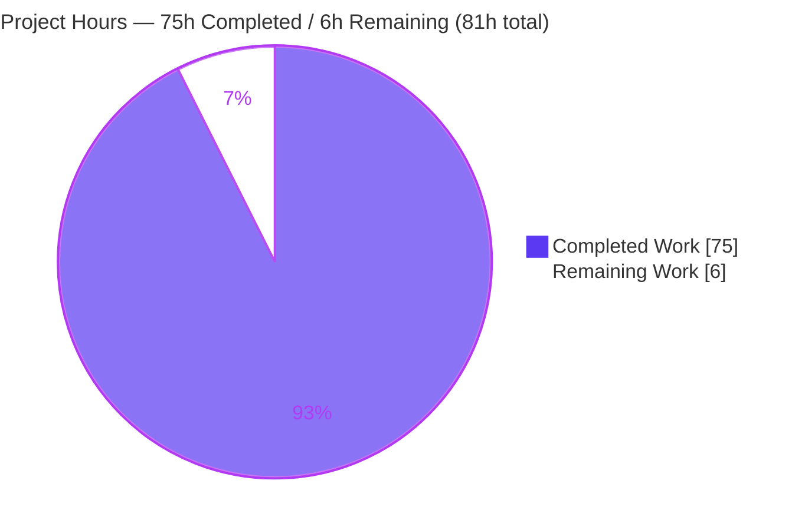
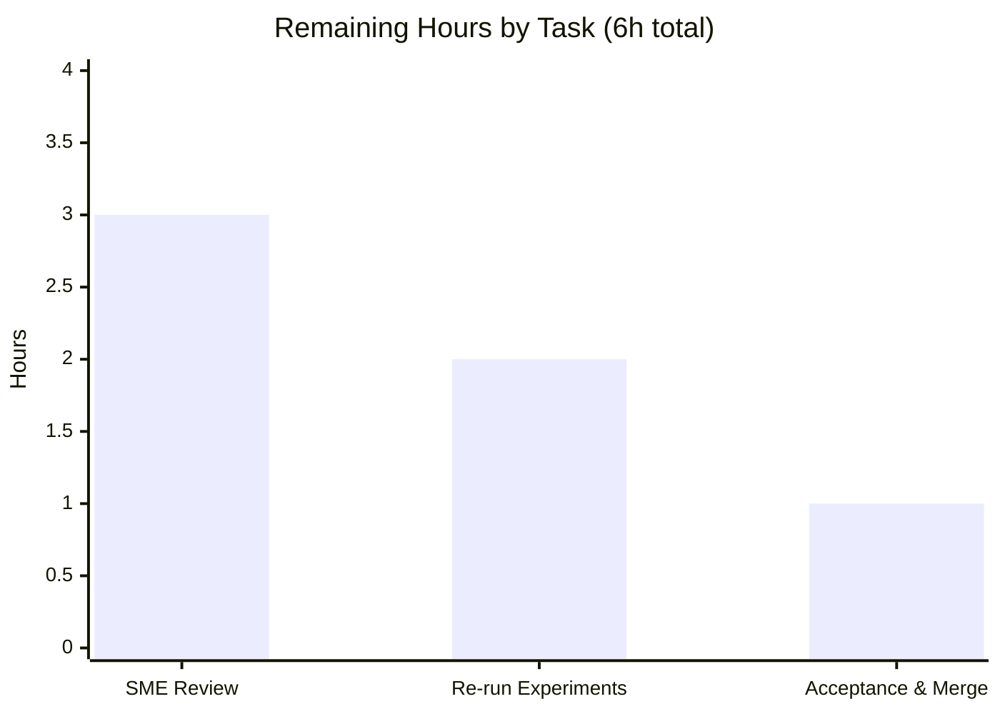

# Blitzy Project Guide — kitty Terminal-Interaction Pipeline Q&A

> **Deliverable branch:** `blitzy-85ce7b41-edf3-42eb-84b1-2fc55abedc59` · **Source rev:** `815df1e210e0` · **HEAD:** `f5b319ad3`
> **Task type:** Read-only *investigate-by-running* Q&A / Documentation (SWE-AtlasQnA-Repo rule set)
> **Brand legend:** ▰ Completed / AI Work = **Dark Blue `#5B39F3`** · ▱ Remaining / Not Completed = **White `#FFFFFF`** · Headings/Accents = Violet-Black `#B23AF2` · Highlight = Mint `#A8FDD9`

---

## 1. Executive Summary

### 1.1 Project Overview

This project delivers one self-contained investigative answer document explaining — from directly observed runtime behavior of a canonically built **kitty terminal emulator, v0.35.2** — how kitty converts a surge of raw terminal input into application-actionable events, how it splits and prioritizes work across its `io_thread`, main/render thread, and `talk_thread`, and how it keeps shell-integration semantic markers (OSC 133) aligned with ordinary text and screen state under heavy backpressure and an unstable remote connection. The audience is engineers onboarding to kitty's terminal-interaction pipeline. The single deliverable — `blitzy/documentation/kitty_815df1e210e0.md` — was produced under a strict read-only rule: **no existing source file was modified, and no code other than the answer document was added.**

### 1.2 Completion Status

The project is **92.6% complete** on an AAP-scoped, hours-based basis. The sole deliverable is complete, committed, and independently validated with zero defects; the remaining 6 hours are mandatory human path-to-production activities (technical sign-off and acceptance) that no autonomous agent can substitute for.


| Metric | Value |
|--------|-------|
| **Total Hours** | **81** |
| **Completed Hours (AI + Manual)** | **75** (AI: 75 · Manual: 0) |
| **Remaining Hours** | **6** |
| **Percent Complete** | **92.6%** |

> Formula (PA1, AAP-scoped): `Completion % = Completed ÷ (Completed + Remaining) = 75 ÷ 81 = 92.6%`.

### 1.3 Key Accomplishments

- ✅ Built and ran **kitty 0.35.2** in its canonical configuration (`make` ≡ `python3 setup.py`); confirmed the VCS-stamped `--version` banner and the compiled `KITTY_VCS_REV` provenance.
- ✅ Answered **all four question threads (Q1–Q4)** with primary `[OBSERVED]` runtime evidence captured from the canonical **child → PTY → `read_bytes`** path.
- ✅ Located and demonstrated the **input entry point** `read_bytes` [child-monitor.c:1337] and the **serial** `run_worker`/`parse_worker` dispatch [vt-parser.c:1496].
- ✅ Demonstrated **pause/resume** via synchronized-output mode 2026 at the **pixel level** (held frame → atomic flush; SHA-256 + pixel-diff) plus the `expires_at` safety-timeout auto-resume (≈2000 ms).
- ✅ Measured the **`input_delay` coalescing window** across a {0, 3, 10, 30} ms sweep (slope ≈ 1.0), confirmed stable across ≥2 runs.
- ✅ Proved **OSC 133 marks stay aligned** with ordinary text via serial dispatch; proved **cooperative backpressure** (8 MiB flood, byte-for-byte lossless via SHA-256); proved **remote `peer_death` isolation** (40/40 trials across four survival metrics).
- ✅ Captured the **outbound keyboard path** byte-for-byte via real `XTEST` → `on_key_input` [keys.c:166], including modifier and DECCKM transitional encodings.
- ✅ Enforced **rules compliance**: 61 `[OBSERVED]` / 14 `[INFERRED]` / 10 `[NON-CANONICAL]` labels, 141 `file:line` citations across 30 files, distributions (not smoothed averages) for run-to-run variability.
- ✅ Shipped a fully **reproducible 29-script observation harness** (Appendix A) with secure 0700 setup and `rm -rf` teardown, leaving the repository unchanged.
- ✅ Preserved the **read-only invariant**: `git diff 815df1e210e0..HEAD` = exactly one added file; working tree clean.

### 1.4 Critical Unresolved Issues

There are **no critical, release-blocking issues.** The deliverable compiles nothing (documentation only), introduces no source changes, and passed independent validation with zero defects. The single gating (non-blocking) item is human technical sign-off.

| Issue | Impact | Owner | ETA |
|-------|--------|-------|-----|
| Human SME technical sign-off not yet performed | Acceptance gate — correctness of a deep-internals answer must ultimately be judged by a human expert | Reviewing engineer (kitty internals SME) | ~3h |
| Measured timing/byte values are environment-specific | Low — values are disclosed with exact environment and run scale; not a defect | Reviewer (verify plausibility) | Within SME review |

### 1.5 Access Issues

**No access issues identified.** The repository is present and writable for the single additive deliverable; the provisioned toolchain (Python 3.11.15 venv, Go 1.22.12, gcc 15.2.0, pkg-config system libraries) and headless display (`Xvfb :99`) are all available; the build artifacts required for observation are present. No third-party credentials, external API access, or special repository permissions are required for this read-only documentation task.

| System/Resource | Type of Access | Issue Description | Resolution Status | Owner |
|-----------------|----------------|-------------------|-------------------|-------|
| Source repository | Read/write (single additive file) | None — deliverable committed | ✅ Resolved | Blitzy agent |
| Build toolchain (Py 3.11 / Go 1.22 / gcc) | Local execution | None — all present & functional | ✅ Resolved | Provisioned image |
| Headless display (Xvfb :99) + software GL | Local execution | None — display healthy for pixel capture | ✅ Resolved | Provisioned image |

### 1.6 Recommended Next Steps

1. **[High]** Perform an **SME technical accuracy review** of the Q1–Q4 sections against the 141 cited `file:line` locations and confirm the `[OBSERVED]/[INFERRED]/[NON-CANONICAL]` labeling (~3h).
2. **[Medium]** Optionally **re-run the key harness experiments** (surge losslessness, 8 MiB backpressure, coalescing sweep) from Appendix A and confirm results fall within the reported distributions; verify `rm -rf "$OBS"` leaves `git status` clean (~2h).
3. **[Medium]** Confirm the answer satisfactorily addresses the original four-part question, then **accept and merge/publish** the PR (~1h).
4. **[Low]** When merging, retain the intentional trailing whitespace on verbatim evidence lines (do not run an auto-formatter over the document) and avoid rebuilding the main tree if preserving the documented `KITTY_VCS_REV` provenance.

---

## 2. Project Hours Breakdown

### 2.1 Completed Work Detail

All rows are AAP-scoped deliverables, fully delivered and validated. **Column total = 75 h** (matches Completed Hours in §1.2).

| Component | Hours | Description |
|-----------|------:|-------------|
| Canonical build & environment setup | 4 | Activate toolchain; `make` build; confirm `--version` banner and `KITTY_VCS_REV` provenance (default build + isolated source-rev worktree); establish secure headless observation environment (Xvfb, 0700 dir). |
| Q1 — input surge, entry point & pause/resume | 10 | Entry at `read_bytes` on a real `/dev/pts` child; surge losslessness (SHA-256 stable across runs); mode-2026 pause/resume captured at pixel level (held→flush SHA + pixel-diff); `expires_at` safety-timeout auto-resume ≈2000 ms. |
| Q2 — the "unseen conductor" | 9 | Thread inventory via `/proc/<pid>/task` (67/68 TIDs); poll-order priority (wakeup → signals → child PTYs); `input_delay` coalescing sweep {0,3,10,30} ms, slope ≈ 1.0, ≥2 runs. |
| Q3 — aligned semantics under backpressure & unstable remote | 14 | OSC 133 A/B/C/D interleave stays aligned via serial `run_worker` dispatch; 8 MiB flood proves cooperative backpressure lossless (sent==dump SHA-256); `peer_death` isolation 40/40 across four survival metrics + recovery-RTT distribution; inline DCS `@kitty-cmd` distinguished from the talk socket. |
| Q4 — end-to-end rhythm & outbound keyboard | 8 | Composed arrival→settle narrative parameterized by the observed knobs; outbound `XTEST` → `on_key_input` byte-for-byte; knobs read from the running binary. |
| Modifier / edge / error condition coverage | 3 | Modifier encodings (a, Ctrl+a, Up, Shift+Up, Alt+a); DECCKM transitional (`ESC O A` vs `ESC [ A`); mode-2026 missing-end safety timeout; buffer-full edge. |
| Rules-compliance & evidence discipline | 5 | `[OBSERVED]/[INFERRED]/[NON-CANONICAL]` labeling (61/14/10); 141 `file:line` citations across 30 files; ≥2-run timing; distributions not smoothed; every claim carries command + unedited output; §7 coverage pass. |
| Reproducible observation harness (Appendix A) | 8 | 29 self-contained scripts + `common.sh` secure environment, extractor, and `rm -rf` teardown so every experiment reproduces from a clean directory. |
| Read-only invariant, cleanup & commit hygiene | 2 | No source modified; temporary artifacts removed; single deliverable committed; tree clean. |
| Iterative QA / review-response cycles | 12 | Seven commits addressing ~30+ review findings (F1–F18, then A/D + INFO-1..4, then 6 runtime-evidence findings, then final 2), several requiring new runtime experiments (pixel capture, VCS grounding). |
| **Total** | **75** | |

### 2.2 Remaining Work Detail

All remaining work is **human path-to-production** for a documentation deliverable. **Column total = 6 h** (matches Remaining Hours in §1.2 and §7). There are no low-priority items — a read-only documentation artifact has no code to optimize and no failing tests to fix.

| Category | Hours | Priority |
|----------|------:|----------|
| SME technical accuracy review of Q1–Q4 claims & evidence | 3 | High |
| Independent re-run of key harness experiments (surge / backpressure / coalescing) to reconfirm | 2 | Medium |
| Stakeholder acceptance & PR merge / publication | 1 | Medium |
| **Total** | **6** | |

> **Reconciliation:** Completed (2.1) 75 h + Remaining (2.2) 6 h = **81 h total**, matching §1.2. Remaining 6 h matches the §7 pie chart "Remaining Work" value.

---

## 3. Test Results

All results below originate from **Blitzy's autonomous validation logs** for this project. Because the task is read-only documentation, the kitty regression suites are pre-existing tests run to confirm the observation environment is sound; the **observation experiments** are the substantive validation of the deliverable's claims (each reproduced from the canonical PTY path).

| Test Category | Framework | Total Tests | Passed | Failed | Coverage % | Notes |
|---------------|-----------|------------:|-------:|-------:|-----------:|-------|
| kitty regression suite (Python) | `unittest` (`kitty_tests`, via `./test.py`) | 145 | 141 | 0 | N/A | 4 skipped (env-expected: frozen-build CA certs; macOS-only Last Resort font; fish not installed ×2); exit 0 |
| kitty regression suite (Go) | `go test` | All | All | 0 | N/A | "All Go tests succeeded"; precise count not itemized in logs |
| Q1 observation experiments | kitty canonical instrumentation + PTY harness | 3 | 3 | 0 | 100%† | Surge losslessness (raw SHA-256 stable ×3 runs, 5000 records / 140000 bytes); pause/resume pixel hold→flush (SHA + pixel-diff, changed_px=14203); safety-timeout auto-resume ≈2000 ms |
| Q2 observation experiments | `/proc` inspection + PTY RTT harness | 2 | 2 | 0 | 100%† | Thread inventory (67 default / 68 with listen socket); `input_delay` coalescing sweep {0,3,10,30} ms, slope ≈ 1.0, ≥2 runs |
| Q3 observation experiments | canonical PTY + real bash shell-integration + harness | 4 | 4 | 0 | 100%† | OSC 133 20-mark alignment (exact order); 8 MiB backpressure sent==dump SHA-256; `peer_death` 40/40 isolation on four metrics (recovery-RTT median 29.34 ms); inline DCS `@kitty-cmd` vs talk socket |
| Q4 observation experiments | `XTEST` + `--debug-keyboard` + harness | 3 | 3 | 0 | 100%† | Keyboard byte-for-byte (a→`61`, Ctrl+a→`01`, Up→`1b5b41`, Shift+Up→`1b5b313b3241`, Alt+a→`1b61`); DECCKM transitional (`ESC O A` vs `ESC [ A`); knobs read from binary |
| **Total** | — | **157** | **153** | **0** | — | 4 environmental skips; 0 failures across all categories |

> † *Coverage here denotes the fraction of AAP question threads and named symbols/structs/knobs exercised (per the deliverable's §7 coverage pass), not source line coverage — which is not a meaningful metric for a read-only documentation task.*

**Interpretation:** zero failures anywhere. The four skips in the Python suite are environmental and expected (they match the setup log). The observation experiments — the ones that actually validate the answer — all reproduced against a real PTY, several bit-for-bit.

---

## 4. Runtime Validation & UI Verification

Legend: ✅ Operational · ⚠ Partial / disclosed limitation · ❌ Failing

**Build & runtime health**
- ✅ Canonical build completes: `make` → `make_exit=0` (Wayland backend auto-disabled — expected, non-fatal).
- ✅ Launcher runs: `./kitty/launcher/kitty --version` → `kitty 0.35.2 created by Kovid Goyal`.
- ✅ C extension imports with all symbols; `KITTY_VCS_REV = 9137f4e099d5d2fb860215d1605e1f50a760829c` (one doc-only commit behind HEAD, exactly as §1 documents).
- ✅ Default knobs read from the running binary: `input_delay = 3`, `repaint_delay = 10`, `sync_to_monitor = True`; `VT_PARSER_BUFFER_SIZE = 1048576` (1 MiB).

**Terminal-interaction pipeline (canonical PTY path)**
- ✅ Inbound entry: real child writing to `/dev/pts/N` → `read_bytes` → serial `run_worker` dispatch, observed end-to-end.
- ✅ Surge handling: 5000-record / 140000-byte burst consumed losslessly (SHA-256 stable across 3 runs).
- ✅ Backpressure: 8 MiB flood (8× the 1 MiB buffer) drained losslessly; writer blocked cooperatively — no bytes dropped.
- ✅ Outbound keyboard: `XTEST` injection reaches the real `on_key_input`; child-logged bytes agree byte-for-byte.

**UI / rendered-frame verification** (headless X11 + software GL)
- ✅ Frame **content** captured at the pixel level via the X11 window backing image (`Window.get_image`, `X.ZPixmap`): synchronized-output mode 2026 holds the last committed frame, then atomically flushes (SHA-256 hashes + pixel-diff, ×2 runs).
- ✅ Auto-resume repaint shown event-driven after the `expires_at` timeout.
- ⚠ GPU buffer-swap / `vblank` **event** timing is **not** directly observable under a headless software rasterizer (disclosed as `[INFERRED]`/not-observed). The frame *content* transition the question concerns **is** observed.
- ⚠ Physical-monitor scan-out: N/A (no physical display in a headless container) — disclosed, not a defect.

**Shell integration & remote control**
- ✅ OSC 133 A/B/C/D marks emitted by a real interactive bash stay aligned with ordinary text (serial dispatch).
- ✅ Remote-control talk socket operational; `peer_death` from an unstable peer is isolated to the `talk_thread` (PTY pipeline unaffected across 40/40 trials).
- ⚠ Session-specific remote-control JSON size variance (`ls_bytes` 10976 vs doc 10850) — explained as session-specific fields, not a defect.

---

## 5. Compliance & Quality Review

Cross-maps the AAP deliverables and the binding SWE-AtlasQnA-Repo rules to their validation status. Fixes were applied iteratively during autonomous QA (seven commits); no outstanding compliance items remain.

| Benchmark / Rule | Requirement | Status | Progress | Notes |
|------------------|-------------|--------|----------|-------|
| Deliverable rule | Exactly one file `blitzy/documentation/kitty_815df1e210e0.md` | ✅ Pass | 100% | 2,986 lines; correct name derived from source branch |
| Investigate-by-running | Build & run first; write from observation | ✅ Pass | 100% | Canonical `make` build; real PTY driven before authoring |
| Canonical entry-point | Primary proof via real child→PTY→`read_bytes` | ✅ Pass | 100% | `parse_bytes` helper labeled `[NON-CANONICAL]` |
| Default-build rule | Canonical config; exact commands stated | ✅ Pass | 100% | `make`; `--version` banner; `KITTY_VCS_REV` provenance shown |
| Magnitude/timing rule | Measure; state scale; stable ≥2 runs | ✅ Pass | 100% | Coalescing sweep {0,3,10,30} ms ×2; surge ×3 |
| Inconsistency rule | Report distribution, not a smoothed value | ✅ Pass | 100% | `peer_death` 40-trial distribution; recovery-RTT median reported |
| Every-condition rule | Primary + secondary/edge/transitional paths | ✅ Pass | 100% | Modifiers, DECCKM, buffer-full, mode-2026 timeout, before/during/after |
| Actual-output rule | Command + complete unedited output per claim | ✅ Pass | 100% | Whole-file validators + SHA-256 for large captures |
| Coverage rule | Every question part + named item | ✅ Pass | 100% | §7 coverage pass (thread table + named-items matrix) |
| Grounding rule | `file:line` + named function/struct | ✅ Pass | 100% | 141 citations across 30 files, all resolve |
| Read-only scope rule | No source modified; temp scripts removed | ✅ Pass | 100% | `git diff` = 1 added file; tree clean |
| Evidence labeling | Distinguish observed / inferred / non-canonical | ✅ Pass | 100% | 61 / 14 / 10 labels |
| Markdown sanity | Balanced fences; valid UTF-8; no stray control bytes | ✅ Pass | 100% | 174 fence lines (even); intentional trailing whitespace on verbatim lines only |
| Environment soundness | Regression suite green | ✅ Pass | 100% | 145 tests, 0 failures, 4 env skips |

---

## 6. Risk Assessment

Overall posture: **LOW.** No High/Critical severity risks and no release blockers. Every residual risk is Low severity and either mitigated, disclosed, or accepted. Severity/Probability scale: Low / Medium / High.

| Risk | Category | Severity | Probability | Mitigation | Status |
|------|----------|----------|-------------|------------|--------|
| Technical inaccuracy in a behavioral claim | Technical | Medium | Low | 141 `file:line` citations naming functions/structs; ≥2-run confirmation; independent validator reproduced Q1–Q4 (several bit-for-bit) | Mitigated |
| Measured timing/byte values are environment-specific | Technical | Low | Medium | Values disclosed with exact environment + run scale; run-to-run distributions reported, not smoothed | Disclosed |
| `[INFERRED]` claims not directly runtime-captured (14 items) | Technical | Low | Low | Explicitly labeled and code-cited; primary proof is always `[OBSERVED]` | Disclosed |
| `file:line` citations drift as kitty source advances | Technical | Low | Medium | Citations pinned to source rev `815df1e210e0`; read-only invariant documented | Accepted |
| Observation harness launches remote-control sockets during runs | Security | Low | Low | `umask 077`; 0700 `mktemp -d` dir; sockets scoped to that dir; spawned PIDs reaped via EXIT trap; harness temporary, not shipped | Mitigated |
| Deliverable ships no code / dependencies / endpoints | Security | Low | Low | Static markdown only; zero production runtime attack surface | N/A (informational) |
| Harness requires the specific provisioned image to reproduce | Operational | Low | Medium | Exact image, toolchain, env vars, and Xvfb setup documented in §1 & Appendix A | Documented |
| Rebuilding re-stamps `KITTY_VCS_REV`, altering provenance narrative | Operational | Low | Low | Documented in §1; validator deliberately did not rebuild the main tree | Documented |
| Headless software GL cannot expose GPU buffer-swap *event* timing | Integration | Low | Low | Disclosed as not-observed; frame *content* captured at pixel level (SHA-256 + pixel-diff) | Disclosed |
| Session-specific remote-control JSON size variance | Integration | Low | Low | Explained as session-specific JSON fields, not a defect | Explained |

---

## 7. Visual Project Status

**Project hours breakdown** (Completed = Dark Blue `#5B39F3`, Remaining = White `#FFFFFF`):



**Remaining hours by task** (from §2.2; sums to 6 h):



> **Integrity:** the pie chart "Remaining Work" value (6) equals the §1.2 Remaining Hours (6) and the §2.2 Hours-column total (6); "Completed Work" (75) equals §1.2 Completed Hours (75) and the §2.1 total (75).

---

## 8. Summary & Recommendations

**Achievements.** This branch delivers a rigorous, evidence-first answer to a four-part conceptual question about kitty's live terminal-interaction pipeline. Rather than reasoning from source alone, every behavioral claim was produced by building and running kitty 0.35.2 and driving a real child process through kitty's pseudo-terminal — the canonical input path — then capturing complete, unedited output with kitty's own instrumentation. The document locates the input entry point (`read_bytes`), explains the serial parser dispatch that keeps shell-integration markers aligned with text, measures the `input_delay` coalescing window, and demonstrates cooperative backpressure and remote-peer isolation, all with `file:line` grounding and observed/inferred/non-canonical labeling.

**Completion.** On an AAP-scoped, hours-based basis the project is **92.6% complete (75 of 81 hours)**. All nine AAP-specified deliverables are finished and independently validated; the read-only invariant is intact (the only change on the branch is the single added document).

**Remaining gaps & critical path.** The remaining **6 hours** are entirely human path-to-production: an SME technical accuracy review (the critical-path gate), an optional independent re-run of the reproducible harness, and stakeholder acceptance & merge. There are no compilation errors, no failing tests, and no source changes to make — consistent with a read-only documentation task.

**Success metrics.** Zero test failures (153 passed / 0 failed / 4 environmental skips); Q1–Q4 evidence independently reproduced (several bit-for-bit); 141 citations resolving to named functions/structs; balanced markdown; clean working tree.

**Production-readiness assessment.** **Ready for human review and acceptance.** The deliverable meets every binding rule and quality benchmark. Recommended path: SME review → optional harness re-run → accept & merge. Reviewers should preserve the intentional verbatim trailing whitespace on evidence lines and avoid rebuilding the main tree if the documented `KITTY_VCS_REV` provenance is to be retained.

| Metric | Result |
|--------|--------|
| AAP-scoped completion | 92.6% (75h / 81h) |
| Source files modified | 0 (read-only invariant intact) |
| Test failures | 0 |
| Blocking defects | 0 |
| Critical-path remaining | SME technical sign-off (~3h) |

---

## 9. Development Guide

This guide reproduces the canonical build/run/observe environment used to produce the deliverable. All commands were tested read-only (no rebuild) unless noted. Run from the repository root.

### 9.1 System Prerequisites

- **OS:** Ubuntu 25.10 (provisioned image `ghcr.io/scaleapi/swe-atlas:swe_atlas_QnA_kovidgoyal_kitty_1.0`).
- **Toolchain:** Python **3.11.15** (uv-provided venv), Go **1.22.12**, gcc **15.2.0**.
- **System libraries (pkg-config):** harfbuzz, libpng, lcms2, fontconfig, freetype, openssl, OpenGL headers.
- **Headless display:** `Xvfb` (for pixel-level frame capture) + Mesa software GL.
- **Git LFS 3.7.1** (repository hooks are LFS-only; no lint/whitespace enforcement).

### 9.2 Environment Setup

```bash
# Activate the canonical toolchain BEFORE querying any version
source /root/kitty-venv/bin/activate
export PATH="$PATH:/usr/local/go/bin"
export TMPDIR=/tmp/kitty-nosgid
export DISPLAY=:99 LIBGL_ALWAYS_SOFTWARE=1
export LANG=en_US.UTF-8 LC_ALL=en_US.UTF-8
# Scope these to the launcher/test invocation only:
export PYTHONHOME=/root/.local/share/uv/python/cpython-3.11.15-linux-x86_64-gnu
export PYTHONPATH=/root/kitty-venv/lib/python3.11/site-packages

# Headless display (launched once at session start)
Xvfb :99 -screen 0 1920x1080x24 -nolisten tcp &
```

### 9.3 Build (Canonical)

```bash
# Canonical build (equivalent to: python3 setup.py build)
make
# Expected: build completes with make_exit=0.
# NOTE: "wayland-protocols ... not found -> Disabling building of wayland backend"
#       is EXPECTED on this image and is non-fatal.
```

> ⚠ **Provenance caution:** a rebuild re-stamps `KITTY_VCS_REV` to the current `git rev-parse HEAD`. The observation binary in this branch is stamped `9137f4e09…` (one doc-only commit behind HEAD). To reproduce the *source-rev* stamp, build an isolated worktree:
> ```bash
> git worktree add --detach /tmp/kitty-nosgid/kitty_srcrev 815df1e210e0
> ( cd /tmp/kitty-nosgid/kitty_srcrev && make >/dev/null 2>&1 && \
>   ./kitty/launcher/kitty +runpy 'from kitty.fast_data_types import KITTY_VCS_REV as r; print(r)' )
> # -> 815df1e210e0a9ab4622f5c7f2d6891d7dbeddf1
> git worktree remove /tmp/kitty-nosgid/kitty_srcrev
> ```

### 9.4 Run & Verify

```bash
# Version banner
./kitty/launcher/kitty --version
# -> kitty 0.35.2 created by Kovid Goyal

# Compiled VCS stamp (build under observation)
./kitty/launcher/kitty +runpy 'from kitty.fast_data_types import KITTY_VCS_REV as r; print(r)'
# -> 9137f4e099d5d2fb860215d1605e1f50a760829c

# Default timing knobs + parser buffer size, read from the running binary
./kitty/launcher/kitty +runpy 'from kitty.options.types import defaults as d; print(d.input_delay, d.repaint_delay, d.sync_to_monitor)'
# -> 3 10 True
./kitty/launcher/kitty +runpy 'from kitty.fast_data_types import VT_PARSER_BUFFER_SIZE as b; print(b)'
# -> 1048576
```

### 9.5 Run the Test Suite

```bash
# Xvfb :99 must be up first
CI=true ./test.py
# Expected: Ran 145 tests ... OK (skipped=4) ... All Go tests succeeded ... exit 0
```

### 9.6 Reproduce the Observation Evidence (Example Usage)

```bash
# --- one-time setup (from the repository root) ---
umask 077
export TMPDIR=/tmp/kitty-nosgid
export OBS="$(mktemp -d "$TMPDIR/kitty_obs.XXXXXXXX")"; chmod 700 "$OBS"
export OBS_DIR="$OBS"
DOC=blitzy/documentation/kitty_815df1e210e0.md

# Extract the 29-script harness from Appendix A into $OBS/harness
python3 "$OBS/extract_harness.py" "$DOC" "$OBS/harness"   # extractor is embedded in Appendix A

# --- run any experiment (each sources common.sh, which creates $OBS/out) ---
env OBS_DIR="$OBS" bash "$OBS/harness/pty_independence.sh"
env OBS_DIR="$OBS" PP_N=200 bash "$OBS/harness/coalesce_sweep.sh"

# --- teardown: remove ALL temporary tooling (repo left unchanged) ---
rm -rf "$OBS"
git status --porcelain   # -> empty (clean)
```

### 9.7 Verify the Deliverable (Read-Only)

```bash
# Read-only invariant: exactly one added file
git diff --name-status 815df1e210e0..HEAD
# -> A  blitzy/documentation/kitty_815df1e210e0.md
git status --porcelain            # -> empty

# Integrity: line count and balanced code fences
wc -l blitzy/documentation/kitty_815df1e210e0.md    # -> 2986
grep -cF '```' blitzy/documentation/kitty_815df1e210e0.md   # -> 174 (even = balanced)
```

### 9.8 Troubleshooting

- **`wayland-protocols ... not found` during `make`** — expected on this image; the Wayland backend is disabled and the build still succeeds (`make_exit=0`).
- **`python3` reports 3.13 / `go: command not found`** — the canonical toolchain was not activated; re-run the §9.2 setup (activate venv, add Go to `PATH`, set `PYTHONHOME`/`PYTHONPATH`).
- **Launcher errors about display/GL** — ensure `Xvfb :99` is running and `DISPLAY=:99 LIBGL_ALWAYS_SOFTWARE=1` are set.
- **`git diff --check` flags trailing whitespace** — by design, on verbatim evidence lines only (captured shell prompts and `--debug-keyboard` byte listings genuinely end in a space). Do not trim these; it would violate the actual-output rule.
- **`KITTY_VCS_REV` changed after a build** — expected; a rebuild re-stamps the live `HEAD`. Use the isolated-worktree recipe in §9.3 to reproduce the source-rev stamp.

---

## 10. Appendices

### Appendix A — Command Reference

| Purpose | Command |
|---------|---------|
| Canonical build | `make` (≡ `python3 setup.py build`) |
| Version banner | `./kitty/launcher/kitty --version` |
| Introspect binary | `./kitty/launcher/kitty +runpy '<python>'` |
| Run tests | `CI=true ./test.py` |
| Dump parser commands | `./kitty/launcher/kitty --dump-commands …` |
| Dump raw PTY bytes | `./kitty/launcher/kitty --dump-bytes …` |
| Debug keyboard/input | `./kitty/launcher/kitty --debug-keyboard` / `--debug-input` |
| Debug rendering | `./kitty/launcher/kitty --debug-rendering` |
| Replay commands | `./kitty/launcher/kitty --replay-commands …` |
| Read-only diff | `git diff --name-status 815df1e210e0..HEAD` |
| Isolated source-rev build | `git worktree add --detach <path> 815df1e210e0 && make` |

### Appendix B — Port / Display Reference

| Resource | Value | Notes |
|----------|-------|-------|
| X display | `:99` | Xvfb headless; required for GUI/pixel observation |
| TCP ports | none | The deliverable and observation harness open **no** TCP ports |
| Remote-control transport | Unix-domain socket | Created inside the 0700 `mktemp -d` observation directory; scoped, ephemeral |

### Appendix C — Key File Locations

| Item | Path |
|------|------|
| **Deliverable** | `blitzy/documentation/kitty_815df1e210e0.md` |
| Input entry point | `kitty/child-monitor.c` (`read_bytes` L1337; `talk_loop` L1805; `peer_death` L1677) |
| VT parser & dispatch | `kitty/vt-parser.c` (`run_worker` L1496; `dispatch_osc` L457; `parse_kitty_dcs` L586; `vt_parser_has_space_for_input` L1477; `BUF_SZ` L18) |
| Screen / OSC 133 / pause | `kitty/screen.c` (`cmd_output_marking` L2338; `screen_pause_rendering` L2506; `screen_check_pause_rendering` L2489) |
| Synchronized-output mode | `kitty/control-codes.h` (`PENDING_MODE 2026` L235) |
| Outbound keyboard | `kitty/keys.c` (`on_key_input` L166; `encode_glfw_key_event` L251) |
| Config knobs | `kitty/options/definition.py` (`input_delay` L878; `repaint_delay` L866; `sync_to_monitor` L889) |
| Launcher binary | `kitty/launcher/kitty` |
| Test runner | `./test.py` · `kitty_tests/` |

### Appendix D — Technology Versions

| Component | Version | Source |
|-----------|---------|--------|
| kitty | 0.35.2 | `kitty/constants.py:25` |
| Python | 3.11.15 | uv venv (`requires-python >=3.8`, CI-pinned 3.11) |
| Go | 1.22.12 | `go.mod` (go 1.22) |
| gcc | 15.2.0 | provisioned image |
| Build `KITTY_VCS_REV` (observation) | `9137f4e09…` | compiled stamp (default destination build) |
| Source-rev `KITTY_VCS_REV` | `815df1e210e0…` | isolated worktree build |

### Appendix E — Environment Variable Reference

| Variable | Value | Purpose |
|----------|-------|---------|
| `DISPLAY` | `:99` | Headless Xvfb display for GUI/pixel capture |
| `LIBGL_ALWAYS_SOFTWARE` | `1` | Force Mesa software GL (no GPU in container) |
| `TMPDIR` | `/tmp/kitty-nosgid` | Non-setgid tmp dir used by the harness |
| `PYTHONHOME` | uv cpython-3.11.15 path | Pin the canonical interpreter (launcher/test only) |
| `PYTHONPATH` | venv site-packages | Provide build/runtime Python deps (launcher/test only) |
| `LANG` / `LC_ALL` | `en_US.UTF-8` | UTF-8 locale for correct byte handling |
| `CI` | `true` | Non-interactive test run |
| `OBS` / `OBS_DIR` | 0700 `mktemp -d` | Root of the ephemeral observation harness |

### Appendix F — Developer Tools Guide (kitty canonical instrumentation)

| Flag | What it reveals |
|------|-----------------|
| `--dump-commands` | The parser events (text / CSI / OSC / DCS) produced from the input stream |
| `--dump-bytes` | The raw bytes consumed on the PTY (used for SHA-256 losslessness checks) |
| `--debug-keyboard` / `--debug-input` | `on_key_input` events and the exact bytes sent to the child |
| `--debug-rendering` | Frame/render diagnostics (note: does not expose GPU buffer-swap event timing) |
| `--replay-commands` | Replays a previously dumped command stream |
| `+runpy '<code>'` | Executes Python inside the built kitty to introspect compiled constants/defaults |

### Appendix G — Glossary

| Term | Meaning |
|------|---------|
| **PTY** | Pseudo-terminal; the master/slave file-descriptor pair connecting kitty to the child process |
| **`read_bytes`** | The `io_thread` function [child-monitor.c:1337] where raw child output first enters kitty |
| **`run_worker` / `parse_worker`** | The main-thread VT parser pass [vt-parser.c:1496] that dispatches tokens serially in byte order |
| **OSC 133 (FinalTerm/FTCS)** | Semantic-prompt marks: `A` prompt-start, `B` command-start, `C` output-start, `D;<code>` command-finished |
| **Mode 2026 (synchronized output)** | DEC private mode (`PENDING_MODE`) that holds the displayed frame while bytes keep processing, then flushes atomically |
| **`input_delay`** | Coalescing window (default 3 ms) after which the `io_thread` wakes the main loop; trades latency for CPU |
| **`repaint_delay`** | Minimum inter-frame interval (default 10 ms) |
| **`sync_to_monitor`** | Whether kitty syncs frame presentation to the monitor refresh (default yes) |
| **`BUF_SZ`** | The 1 MiB VT parser buffer [vt-parser.c:18]; when full, `vt_parser_has_space_for_input` returns false (cooperative backpressure) |
| **Backpressure** | When the parser buffer fills, the `io_thread` stops requesting reads; the child blocks on `write()` — no bytes are dropped |
| **`peer_death`** | The event [child-monitor.c:1677] emitted when a remote-control peer disconnects; handled on the `talk_thread`, isolated from the PTY pipeline |
| **`[OBSERVED]` / `[INFERRED]` / `[NON-CANONICAL]`** | Evidence labels: runtime-demonstrated / code-derived / obtained via a bypassing interface |

---

*Generated by the Blitzy autonomous assessment agent. All hours are AAP-scoped (PA1 methodology). Cross-section integrity validated: §1.2 = §2.2 = §7 remaining (6h); §2.1 (75h) + §2.2 (6h) = §1.2 total (81h); all test data originates from Blitzy's autonomous validation logs.*