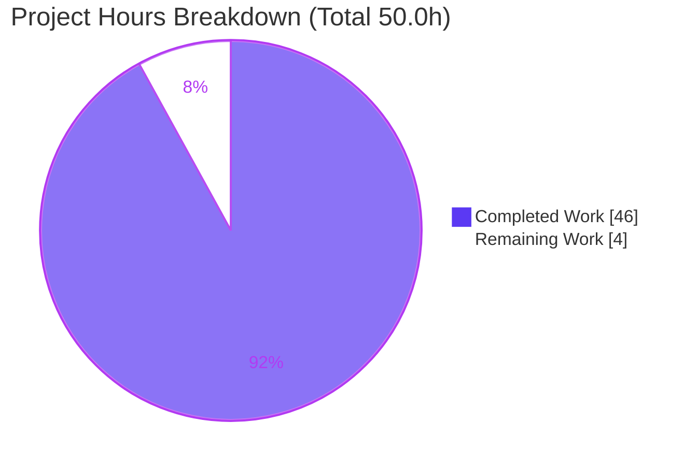
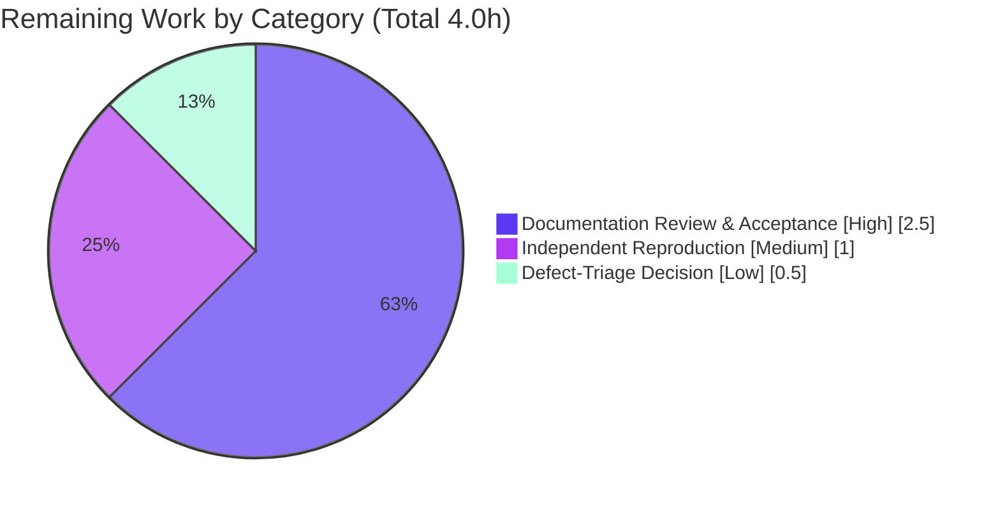

# Blitzy Project Guide — kitty Terminal Reflow (`rewrap`) Investigation

> **Project type:** Read-only, run-first code-comprehension investigation producing a single investigative-documentation deliverable.
> **Branch:** `blitzy-002b6257-9467-45f7-9f19-5f9666bd026e` · **HEAD:** `fc6c0514a` · **Baseline:** `815df1e21`

---

## 1. Executive Summary

### 1.1 Project Overview

This project traces kitty terminal's text-reflow (internally *rewrap*) subsystem end-to-end and diagnoses how and where it fails to preserve logical line boundaries when a window is resized. It is a **read-only, run-first-then-write** code-comprehension task: the target audience is kitty maintainers and terminal-engine engineers. The sole deliverable is one investigative markdown document that answers four sub-questions — (a) trace the rewrap algorithm in C, (b) explain the visible-screen ↔ scrollback interaction during resize, (c) identify line-continuation-propagation issues between the two buffers, and (d) map the complete data flow from the resize entry point. No source file was created, modified, or deleted; every behavioral claim is backed by captured runtime output and every code claim by a `file:line` reference.

### 1.2 Completion Status

The completion percentage is computed with the PA1 AAP-scoped, hours-based methodology: only work defined in the Agent Action Plan (AAP) plus standard path-to-production activity is counted.


| Metric | Hours |
|--------|-------|
| **Total Hours** | **50.0** |
| Completed Hours (AI + Manual) | 46.0 |
| &nbsp;&nbsp;• AI (autonomous) | 46.0 |
| &nbsp;&nbsp;• Manual (human) | 0.0 |
| Remaining Hours | 4.0 |
| **Percent Complete** | **92.0%** |

**Calculation:** `Completion % = Completed ÷ Total × 100 = 46.0 ÷ 50.0 × 100 = 92.0%`

> **Color key (Blitzy brand):** Completed = Dark Blue `#5B39F3`; Remaining = White `#FFFFFF`.

### 1.3 Key Accomplishments

- ✅ **Single mandated deliverable created and committed** — `blitzy/documentation/kitty_815df1e210e0.md` (1,739 lines / 106,670 bytes), named after the source branch as required.
- ✅ **Canonical build succeeds** — `python3 setup.py` exits 0 in ~42 s (122 C compile units + 5 link steps) with zero warnings under strict `-pedantic-errors -Werror`; produces the `kitty.fast_data_types` extension.
- ✅ **All four sub-questions (a)–(d) answered** with runtime evidence and a final §8 coverage pass over every named function, struct, flag, and file.
- ✅ **Root cause confirmed at runtime** — a soft-wrapped logical line straddling the history↔screen seam **deterministically splits** on resize (1 → 2 logical lines, 3/3 runs, both directions) because history and the visible grid are rewrapped by two independent passes.
- ✅ **Evidence discipline satisfied** — every behavioral claim carries its exact command + complete unedited output; 157 `file:line` anchors; 8 inferred claims explicitly labeled with a CONFIRMED/REFUTED runtime result.
- ✅ **Read-only source integrity preserved** — zero `.c/.h/.py/.go/.rst` files changed; working tree clean; source byte-for-byte unchanged.
- ✅ **Autonomous validation green** — 54/54 reflow-relevant tests pass; all three probe scripts reproduce byte-for-byte across runs.

### 1.4 Critical Unresolved Issues

| Issue | Impact | Owner | ETA |
|-------|--------|-------|-----|
| Confirmed reflow defect (seam continuation-loss) is diagnosed but **not fixed** — fixing is explicitly out of AAP scope | A real kitty product bug remains; a soft-wrapped logical line spanning the scrollback↔visible boundary splits on resize and the damage is permanent/compounding | kitty maintainers / triage owner | To be scheduled as a separate in-scope change |

> No issue blocks acceptance of *this* deliverable — the deliverable's job was to diagnose, which it did. The row above is the finding the document surfaces for downstream disposition.

### 1.5 Access Issues

| System/Resource | Type of Access | Issue Description | Resolution Status | Owner |
|-----------------|----------------|-------------------|-------------------|-------|
| Git repository | Read/Write | None — branch and commit access confirmed; deliverable committed at HEAD `fc6c0514a` | Resolved | Blitzy |
| Canonical Docker image `ghcr.io/scaleapi/swe-atlas:swe_atlas_QnA_kovidgoyal_kitty_1.0` | Pull/Run | None — image available; build, tests, and probes executed inside it | Resolved | Blitzy |

No access issues identified that prevent build validation, integration, or acceptance of the deliverable.

### 1.6 Recommended Next Steps

1. **[High]** Domain-expert review & acceptance of the 1,739-line investigative document — verify the §0 diagnosis, spot-check a sample of the 157 anchors, and confirm the §8 coverage pass. *(2.5 h)*
2. **[Medium]** Independent reproduction confidence check — inside the canonical image, run `python3 setup.py`, `CI=true python3 test.py --module datatypes` and `--module screen`, and re-run the three §7 probe scripts to confirm byte-identical output. *(1.0 h)*
3. **[Low]** Downstream defect-triage decision — decide whether to open an upstream kitty issue and/or schedule a separate, in-scope fix for the seam continuation-loss (the fix itself is out of scope here). *(0.5 h)*

---

## 2. Project Hours Breakdown

### 2.1 Completed Work Detail

Every completed component traces to a specific AAP requirement (objectives (a)–(d), the run-first methodology, evidence discipline, read-only compliance, and web-search framing).

| Component | Hours | Description |
|-----------|------:|-------------|
| U1 · Environment & canonical build | 3.0 | Fresh-clone canonical build via `python3 setup.py` in the Docker image; produced `kitty.fast_data_types` (LineBuf/HistoryBuf/Screen); verified import before/after; captured exact commands + build timing (~42 s, exit 0). Evidence: doc §1, §7.0. |
| U2 · Objective (a) — rewrap algorithm trace | 7.0 | Traced `rewrap_inner` [rewrap.h:L56-96] and its two macro-template instantiations; drove the core in isolation via `LineBuf.rewrap` / `HistoryBuf.rewrap`, reading wrap state with `Line.last_char_has_wrapped_flag()`. Scenarios A1–A7. Evidence: doc §2, §7.1 (`probe_a.py`). |
| U3 · Objective (b) — screen ↔ scrollback interaction | 7.0 | Traced `screen_resize` orchestration (history-first `realloc_hb` L375 → screen-second `realloc_lb` L384); drove the real `Screen.resize`, main & alternate, narrower & wider; observed spillover (history 3→10) and alt discard (0→0). Evidence: doc §3, §7.2 (`probe_b.py`). |
| U4 · Objective (c) — continuation-propagation diagnosis | 10.0 | Constructed seam-straddling inputs; confirmed/refuted five candidate issues; exercised `scrollback_fill_enlarged_window` both states; ≥3-run determinism throughout. Isolated the dropped soft-wrap flag; proved permanent/compounding damage. Evidence: doc §4, §7.3 (`probe_c.py`). |
| U5 · Objective (d) — complete data-flow assembly | 3.0 | Assembled the call chain `Window.set_geometry` → `Screen.resize` → `screen_resize` → continuation setters → spill; authored the mermaid call-flow diagram; documented the PTY-winsize contrast. Corrected the AAP's `realloc_hb/lb` anchors to real call sites. Evidence: doc §5. |
| U6 · Document authoring & evidence discipline | 8.0 | Authored the 1,739-line deliverable: direct-answer lead, per-objective prose, complete unedited evidence appendix (§7), coverage pass (§8), 157 `file:line` anchors, inference labels. Evidence: full document. |
| U7 · Read-only compliance & temp cleanup | 1.5 | Ran build/probes against a fresh clone; verified source byte-for-byte unchanged; removed temporary probe scripts; documented the read-only guarantee (§10). Evidence: `git diff` MD-empty, §10. |
| U8 · Web-search industry framing | 2.0 | Researched terminal reflow conventions (soft/hard wrap, cursor hazard, boundary-reflow difficulty, historical context) to frame kitty's design. Evidence: doc §6, AAP §0.2.2. |
| U9 · Validation & QA hardening (3 checkpoints) | 4.5 | Three QA iterations across four commits; byte-identical re-run of build + 54 tests + 3 probes; anchor-integrity and inference-label fixes. Evidence: commits `0a2f09919`, `00c1c4a8f`, `fc6c0514a`; 5-gate validation PASS. |
| **Total Completed** | **46.0** | |

### 2.2 Remaining Work Detail

All remaining work is human path-to-production for a diagnostic document. No compilation or test-failure remediation exists (build exits 0; 54/54 tests pass), so there are no "immediate fix" tasks.

| Category | Hours | Priority |
|----------|------:|----------|
| Documentation review & acceptance (read, verify diagnosis, spot-check anchors, confirm coverage) | 2.5 | High |
| Independent reproduction confidence check (build + tests + 3 probes inside canonical image) | 1.0 | Medium |
| Downstream defect-triage decision (open upstream issue / schedule separate fix — fix out of scope) | 0.5 | Low |
| **Total Remaining** | **4.0** | |

### 2.3 Hours Reconciliation

| Check | Result |
|-------|--------|
| Section 2.1 completed total | 46.0 h |
| Section 2.2 remaining total | 4.0 h |
| 2.1 + 2.2 = Section 1.2 Total | 46.0 + 4.0 = **50.0 h** ✓ |
| Section 1.2 Remaining = Section 2.2 total = Section 7 "Remaining Work" | 4.0 h ✓ |
| Completion % (46.0 ÷ 50.0) | **92.0%** ✓ |

---

## 3. Test Results

All tests below originate from Blitzy's autonomous validation logs, executed inside the canonical Docker image (Python 3.12.3, GCC 13.3.0, C11) via kitty's own harness `test.py` (Python `unittest`). No external or hand-authored test results are included.

| Test Category | Framework | Total Tests | Passed | Failed | Coverage % | Notes |
|---------------|-----------|------------:|-------:|-------:|-----------:|-------|
| Unit — datatypes module | Python `unittest` | 18 | 18 | 0 | Reflow paths covered | Includes `test_rewrap_simple`, `test_rewrap_wider`, `test_rewrap_narrower`, `test_historybuf` (0.022 s). |
| Unit/Integration — screen module | Python `unittest` | 36 | 36 | 0 | Resize paths covered | Includes `test_resize`, `test_cursor_after_resize`, `test_scrollback_fill_after_resize`, `test_wrapping_serialization` (0.077 s). |
| **Total** | | **54** | **54** | **0** | **100% pass** | Zero FAIL / ERROR / skipped across both modules. |

**Runtime path exercise (from validation logs, not counted as unit tests):** the real reflow entry points `Screen.resize`, `LineBuf.rewrap(other, historybuf)`, `HistoryBuf.rewrap(other)`, and the `Line.last_char_has_wrapped_flag()` probe were all driven successfully (exit 0). The three probe scripts (`probe_a`, `probe_b`, `probe_c`) reproduced **byte-for-byte identical** output to the documented evidence on re-execution.

> **Note on host environment:** These results are sourced from Blitzy's autonomous logs because the assessment host runs Python 3.13, which cannot load the `libpython3.12`-linked `fast_data_types` extension; reproduction requires the canonical image (see §9 Troubleshooting).

---

## 4. Runtime Validation & UI Verification

**Runtime health of the reflow paths (real entry points, canonical build):**

- ✅ **Operational** — Canonical build `python3 setup.py`: exit 0, ~42 s, `kitty/fast_data_types.so` produced (x86-64 ELF, 1,213,072 bytes).
- ✅ **Operational** — Extension import: `LineBuf`, `HistoryBuf`, `Screen`, `Cursor` all present.
- ✅ **Operational** — Real `Screen.resize` binding driven for main & alternate screens, narrower & wider (exit 0).
- ✅ **Operational** — `LineBuf.rewrap(other, historybuf)` and `HistoryBuf.rewrap(other)` driven in isolation (exit 0).
- ✅ **Operational** — `Line.last_char_has_wrapped_flag()` wrap-state probe functional.
- ✅ **Operational** — Probe reproducibility: `probe_a/b/c` output byte-for-byte identical across ≥2 runs (determinism confirmed).

**Observed reflow behaviors (runtime findings — all deterministic across 3 runs):**

- ✅ Within a single buffer, reflow is correct — `LineBuf.rewrap` and `HistoryBuf.rewrap` alone preserve continuation exactly (reproduce kitty's `test_rewrap_*` expectations).
- ✅ Main-screen overflow spills into scrollback (history count 3 → 10); alternate-screen overflow is discarded (history 0 → 0, `[0,0,0]`/3 runs).
- ✅ Cursor is remapped through reflow (narrower `(10,3)→(4,3)`; wider `(5,3)→(9,1)`).
- ⚠ **Partial (confirmed defect, by design not fixed)** — A soft-wrapped logical line straddling the history↔screen seam splits 1 → 2 on resize (both directions), and the damage is permanent and compounds (1 → 2 → 3). This is the documented finding, not a deliverable failure.

**UI Verification:** Not applicable. Terminal reflow is a text-buffer transformation with no user-facing UI, screens, or visual assets (AAP §0.3.3). No browser/visual verification was in scope.

---

## 5. Compliance & Quality Review

AAP deliverables and the SWE-AtlasQnA-Repo rule set cross-mapped to Blitzy's quality benchmarks. Fixes applied during autonomous validation: **none required** — the deliverable was already complete, accurate, and read-only compliant on independent re-execution.

| Benchmark / Rule | Requirement | Status | Evidence / Progress |
|------------------|-------------|--------|---------------------|
| Single mandated deliverable | One `.md` at `blitzy/documentation/<branch>.md` | ✅ Pass | `kitty_815df1e210e0.md` present & committed |
| Answer completeness | All four sub-questions (a)–(d) + coverage pass | ✅ Pass | §2–§5 + §8 coverage pass |
| Run-first methodology | Build & run before writing | ✅ Pass | §1 build, §7 appendix captured first |
| Evidence discipline (behavioral) | Command + complete unedited output per claim | ✅ Pass | 68 fenced blocks; §7.0–§7.3 |
| Evidence discipline (code) | `file:line` per code claim | ✅ Pass | 157 anchors; ~19 spot-verified accurate |
| Inference labeling | Reading-only claims labeled + CONFIRMED/REFUTED | ✅ Pass | 8 inferred labels; §4.2–§4.6 |
| Real entry point | No synthetic stand-in / debug hook | ✅ Pass | `Screen.resize`, `*.rewrap` bindings |
| Canonical / default build | Default `setup.py`; exact commands reported | ✅ Pass | §1; exit 0 under `-Werror` |
| Magnitude at scale | ≥2-run stability, state the scale | ✅ Pass | 3-run determinism throughout (36 mentions) |
| Reproduce inconsistency faithfully | Same input repeated; report distribution | ✅ Pass | `[4,4,4]`, `[(3,3)…]` vs `[(3,0)…]` etc. |
| Read-only source | No source file created/edited/deleted | ✅ Pass | `git diff` MD-empty; §10 guarantee |
| Temp-artifact cleanup | Remove probe scripts afterward | ✅ Pass | §10 cleanup output; tree clean |
| Markdown well-formedness | Balanced fences, valid mermaid, UTF-8 | ✅ Pass | 68 balanced fences, 1 closed mermaid, trailing newline |
| Compiler cleanliness | No warnings/errors under strict flags | ✅ Pass | 122 units, `-pedantic-errors -Werror`, clean |

---

## 6. Risk Assessment

Risk profile is inherently **low** — this is a read-only documentation deliverable with zero code/dependency/credential changes. The one material item is a product defect the investigation surfaced (out-of-scope to fix).

| Risk | Category | Severity | Probability | Mitigation | Status |
|------|----------|----------|-------------|------------|--------|
| RK1 · Confirmed reflow defect (seam continuation-loss) remains unfixed by design; logical line splits on resize, damage permanent & compounding | Technical | Medium | High (deterministic, every run) | Diagnosis §4 supplies root cause + deterministic repro; triage and schedule a separate in-scope fix | Open (fix out of AAP scope) |
| RK2 · `file:line` anchor drift if the source branch evolves (157 anchors pinned to `kitty_815df1e210e0`) | Technical | Low | Low | Branch-pinned; anchors also verified by symbol name; re-verify if rebased | Mitigated |
| RK3 · Reproduction requires the canonical Docker image (host Python 3.13 cannot load the `libpython3.12` extension) | Operational | Low | Medium | §1/§9 document the exact image and build commands | Mitigated (documented) |
| RK4 · Diagnosis staleness if not acted upon before future kitty releases | Operational | Low | Low | Branch/timestamp pinned; triage promptly | Open (informational) |
| Security | Security | None | N/A | No code, dependency, credential, or attack-surface change | N/A |
| Integration | Integration | None | N/A | Single documentation file added; no source/build/CI/API/dependency integration; git tree clean | N/A |

---

## 7. Visual Project Status

**Project hours breakdown** — Completed = Dark Blue `#5B39F3`, Remaining = White `#FFFFFF`:



**Remaining work by category (hours)** — mirrors Section 2.2 (sum = 4.0 h):



> **Integrity:** "Remaining Work" = 4.0 h here equals Section 1.2 Remaining Hours and the Section 2.2 "Hours" column sum. "Completed Work" = 46.0 h equals Section 2.1 total.

---

## 8. Summary & Recommendations

**Achievements.** The project delivered a rigorous, fully evidenced investigation of kitty's reflow (`rewrap`) subsystem in a single 1,739-line document. It traces the macro-templated core algorithm, explains the history-first/screen-second resize orchestration, and — most importantly — **confirms at runtime the exact edge case the user reported**: a soft-wrapped logical line spanning the scrollback↔visible seam deterministically splits on resize because the two buffers are rewrapped by two independent passes, and the damage is permanent and compounding. Every claim is backed by captured output or a `file:line` anchor.

**Completion.** Using the AAP-scoped, hours-based methodology, the project is **92.0% complete** (46.0 of 50.0 hours). All nine AAP-specified work units are complete, validated across five gates, and committed; the source tree is byte-for-byte unchanged.

**Remaining gaps (4.0 h, all human path-to-production).** Domain-expert review & acceptance (2.5 h), an independent reproduction confidence check (1.0 h), and a downstream defect-triage decision (0.5 h). None involves code changes to the deliverable.

**Critical path to production.** Review & accept the document → optionally reproduce inside the canonical image → decide the disposition of the confirmed defect. The reflow fix itself is explicitly out of this task's scope and would be scheduled as a separate change.

**Production-readiness assessment.** For a diagnosis-and-documentation deliverable, the artifact is **production-ready**: it builds and runs the code first, answers every sub-question with a coverage pass, satisfies evidence discipline, and preserves read-only source integrity. The remaining 8.0% is human sign-off and triage, not engineering rework.

| Success Metric | Target | Actual | Status |
|----------------|--------|--------|--------|
| Sub-questions answered | 4 of 4 | 4 of 4 | ✅ |
| Reflow tests passing | 100% | 54/54 (100%) | ✅ |
| Canonical build | exit 0, no warnings | exit 0, ~42 s, clean | ✅ |
| Read-only source integrity | 0 source files changed | 0 changed | ✅ |
| Probe reproducibility | byte-identical | byte-identical | ✅ |
| Completion | High (never 100% pre-review) | 92.0% | ✅ |

---

## 9. Development Guide

This guide reproduces the investigation and verifies the deliverable. Reflow code paths **must** be built and run inside the canonical Docker image, because the `fast_data_types` C extension is ABI-linked to Python 3.12 and will not load on a Python 3.13 host.

### 9.1 System Prerequisites

- **Docker Engine** (28.x verified) — to run the canonical image.
- **Git** (2.x) — for cloning and read-only verification.
- **Canonical image:** `ghcr.io/scaleapi/swe-atlas:swe_atlas_QnA_kovidgoyal_kitty_1.0` (ships Python 3.12.3, GCC 13.3.0, C11).
- Host compilers/Python are **not** required for reproduction; a host Python 3.13 will raise `ImportError: libpython3.12.so.1.0` if used directly (expected).

### 9.2 Environment Setup

```bash
# Work against a FRESH clone so the working repository stays byte-for-byte unchanged.
git clone /tmp/blitzy/kitty/blitzy-002b6257-9467-45f7-9f19-5f9666bd026e_97c78c /tmp/reflow_fresh

# Inside the container, mark the mount as a safe git directory (avoids "dubious ownership").
# (run as part of the docker command below)
```

### 9.3 Dependency Installation

No new dependencies are introduced. The canonical build compiles the bundled C extension; there is no `pip install` step for the reflow investigation.

### 9.4 Build (canonical, default)

```bash
# Canonical build — default setup.py action is "build"; exits 0 in ~42 s, no warnings under -Werror.
docker run --rm --entrypoint /bin/bash \
  -v /tmp/reflow_fresh:/work -w /work \
  ghcr.io/scaleapi/swe-atlas:swe_atlas_QnA_kovidgoyal_kitty_1.0 \
  -c 'git config --global --add safe.directory /work; python3 setup.py'

# Optional debug build:
# ... -c 'git config --global --add safe.directory /work; python3 setup.py build --debug'
```

Expected artifact: `kitty/fast_data_types.so` (x86-64 ELF, ~1.2 MB).

### 9.5 Verification

```bash
# 1) Extension import — reflow classes present.
docker run --rm --entrypoint /bin/bash -v /tmp/reflow_fresh:/work -w /work \
  ghcr.io/scaleapi/swe-atlas:swe_atlas_QnA_kovidgoyal_kitty_1.0 \
  -c 'python3 -c "import kitty.fast_data_types as f; print(all(hasattr(f,n) for n in [\"LineBuf\",\"HistoryBuf\",\"Screen\",\"Cursor\"]))"'
# expected: True

# 2) Reflow test modules — 18/18 and 36/36.
docker run --rm --entrypoint /bin/bash -v /tmp/reflow_fresh:/work -w /work \
  ghcr.io/scaleapi/swe-atlas:swe_atlas_QnA_kovidgoyal_kitty_1.0 \
  -c 'cd /work && CI=true python3 test.py --module datatypes'
docker run --rm --entrypoint /bin/bash -v /tmp/reflow_fresh:/work -w /work \
  ghcr.io/scaleapi/swe-atlas:swe_atlas_QnA_kovidgoyal_kitty_1.0 \
  -c 'cd /work && CI=true python3 test.py --module screen'
```

Read-only integrity checks (run on the working repository — **verified during this assessment**):

```bash
cd /tmp/blitzy/kitty/blitzy-002b6257-9467-45f7-9f19-5f9666bd026e_97c78c
git status --porcelain                                   # empty  => clean tree
git diff 815df1e21 HEAD --name-status                    # A blitzy/documentation/kitty_815df1e210e0.md
git diff 815df1e21 HEAD --name-only -- '*.c' '*.h' '*.py' '*.go' '*.rst'   # empty => no source changed
test -f blitzy/documentation/kitty_815df1e210e0.md && echo PRESENT
```

### 9.6 Example Usage

```bash
# The deliverable IS the product — read it:
less blitzy/documentation/kitty_815df1e210e0.md

# Re-run the documented probes (scripts are reproduced verbatim in §7.1–§7.3 of the deliverable):
docker run --rm --entrypoint /bin/bash \
  -v /tmp/reflow_fresh:/work -v /tmp/reflow_probes:/probes -w /work \
  ghcr.io/scaleapi/swe-atlas:swe_atlas_QnA_kovidgoyal_kitty_1.0 \
  -c 'PYTHONPATH=/work python3 /probes/probe_c.py'
# expected: deterministic seam split + flag-drop output matching §7.3, byte-for-byte
```

### 9.7 Troubleshooting

- **`ImportError: libpython3.12.so.1.0: cannot open shared object file`** — you are on a host Python (3.13). Run inside the canonical image instead.
- **`ModuleNotFoundError: No module named 'kitty.fast_data_types'`** — the extension is not built; run the §9.4 build first.
- **`fatal: detected dubious ownership in repository`** — add `git config --global --add safe.directory /work` before git commands inside the container.
- **Test enters watch mode / hangs** — set `CI=true` (as shown) to force non-interactive single-run.

---

## 10. Appendices

### A. Command Reference

| Purpose | Command |
|---------|---------|
| Canonical build | `python3 setup.py` |
| Debug build | `python3 setup.py build --debug` |
| Run datatypes tests | `CI=true python3 test.py --module datatypes` |
| Run screen tests | `CI=true python3 test.py --module screen` |
| Import check | `python3 -c "import kitty.fast_data_types as f; print(all(hasattr(f,n) for n in ['LineBuf','HistoryBuf','Screen','Cursor']))"` |
| Run a probe | `PYTHONPATH=/work python3 /probes/probe_c.py` |
| Clean-tree check | `git status --porcelain` |
| Single-file diff check | `git diff 815df1e21 HEAD --name-status` |
| Source-unchanged check | `git diff 815df1e21 HEAD --name-only -- '*.c' '*.h' '*.py' '*.go' '*.rst'` |

### B. Port Reference

Not applicable — the reflow investigation runs no network services and opens no ports.

### C. Key File Locations

| Path | Role |
|------|------|
| `blitzy/documentation/kitty_815df1e210e0.md` | **The deliverable** (1,739 lines) |
| `kitty/rewrap.h` | Macro-templated core `rewrap_inner` [L56-96] |
| `kitty/line-buf.c` | `LineBuf` rewrap instantiation + `LineBuf.rewrap` binding |
| `kitty/history.c` | `HistoryBuf` ring-buffer rewrap + `HistoryBuf.rewrap` binding |
| `kitty/screen.c` | `screen_resize` orchestration [L346]; `Screen.resize` binding |
| `kitty/line.c` | `Line.last_char_has_wrapped_flag()` wrap-state probe |
| `kitty/data-types.h` | `next_char_was_wrapped` [L206], `is_continued` [L233] |
| `kitty/window.py` | Resize entry `set_geometry` → `screen.resize` [L850-854] |
| `setup.py` / `test.py` | Build orchestrator / test runner |
| `kitty_tests/datatypes.py`, `kitty_tests/screen.py` | Reflow tests + harness patterns |

### D. Technology Versions

| Component | Version | Context |
|-----------|---------|---------|
| Python (canonical image) | 3.12.3 | Build + probe runtime |
| Python (assessment host) | 3.13.7 | Cannot load extension (ABI) — use image |
| C compiler | GCC 13.3.0, `-std=c11` | Terminal engine build |
| Docker Engine | 28.x | Runs canonical image |
| Git | 2.x | Clone + read-only verification |
| Go | 1.22 | `kitten` CLI only — out of reflow scope |
| Requires-Python | `>=3.8` | `pyproject.toml:L2` |

### E. Environment Variable Reference

| Variable | Value | Purpose |
|----------|-------|---------|
| `CI` | `true` | Forces non-interactive, single-run test execution |
| `PYTHONPATH` | `/work` | Lets probes import the freshly built `kitty.fast_data_types` |

### F. Developer Tools Guide

- **`test.py`** — kitty's unittest runner; `--module <name>` filters to a module (e.g., `datatypes`, `screen`); `--verbosity` controls detail.
- **`setup.py`** — build orchestrator; default action `build`; `build --debug` for a debug build; strict flags `-pedantic-errors -Werror`.
- **Git verification** — the four read-only checks in §9.5 prove the source is byte-for-byte unchanged.

### G. Glossary

| Term | Meaning |
|------|---------|
| Reflow / rewrap | Redistributing buffer text across new dimensions on resize |
| Soft wrap | A line that exceeded column width (reflowable); flagged by `next_char_was_wrapped` |
| Hard wrap | An explicit application newline (a real boundary; not reflowed) |
| `next_char_was_wrapped` | Per-cell bit on the last cell marking a soft wrap [data-types.h:L206] |
| `is_continued` | Per-line attribute derived from the previous line's wrap flag [data-types.h:L233] |
| `LineBuf` | The visible 2-D grid buffer |
| `HistoryBuf` | The scrollback ring buffer (`start_of_data`, `count`) |
| Seam | The boundary between scrollback history and the visible grid |
| Spillover | Visible top rows pushed into scrollback when the grid overflows on resize |

---

*Generated by the Blitzy Platform · Completion 92.0% (46.0 / 50.0 hours) · Read-only investigative-documentation deliverable.*