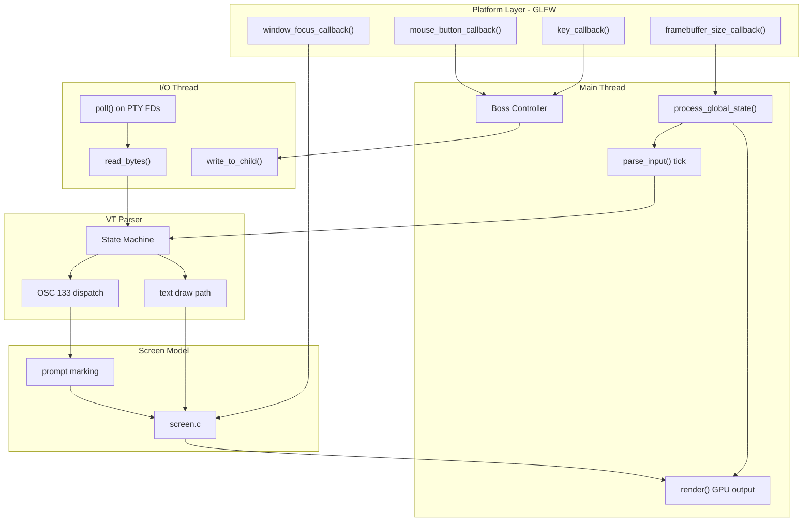

# Technical Specification

# 0. Agent Action Plan

## 0.1 Intent Clarification

### 0.1.1 Core Feature Objective

Based on the prompt, the Blitzy platform understands that the new feature requirement is to produce a comprehensive, self-contained documentation artifact that traces and explains the Kitty terminal emulator's live terminal interaction pipeline — specifically, the full lifecycle of mixed input (keystrokes, paste bursts, resize signals, shell-integration markers) from the moment raw bytes enter the system to the point the interface settles into a stable, coherent visual state. The deliverable is a Markdown file placed at `blitzy/documentation/kitty_815df1e210e0.md` that answers the following questions with code-grounded evidence:

- **Input ingestion**: Where does raw input first enter the system when a surge of bytes arrives from the PTY or when a session is paused and then resumed?
- **Orchestration and ordering**: What internal conductor (thread, loop, data structure) manages timing, ordering, and state handoffs, and how are competing events prioritized?
- **Shell integration interleaving**: When OSC 133 shell-integration markers arrive interleaved with ordinary text, how does the system keep screen state, command context, and input meaning aligned?
- **Backpressure and degraded conditions**: How does the system behave when a remote connection is unstable or the VT parser buffer is nearly full?
- **End-to-end coherence**: What mechanisms prevent the many moving parts from slowly drifting out of sync?

Implicit requirements detected:

- The answer must be grounded entirely in the actual codebase; no assumptions or generalized textbook descriptions.
- Temporary observation scripts may be created during analysis but must be cleaned up — the repository itself must remain unmodified.
- The documentation must include rationale and thinking behind every conclusion drawn.

Feature dependencies and prerequisites:

- Understanding of the three-thread architecture (Main thread, I/O thread via `KittyChildMon`, Talk thread) in `kitty/child-monitor.c`.
- Understanding of the VT parser state machine in `kitty/vt-parser.c` and its buffer/locking model.
- Understanding of the GLFW callback chain (`kitty/glfw.c`, `kitty/keys.c`, `kitty/mouse.c`) and how platform events reach the Boss controller.
- Understanding of shell-integration scripts (`shell-integration/bash/kitty.bash`, etc.) and how OSC 133 markers flow through `kitty/screen.c:shell_prompt_marking()`.

### 0.1.2 Special Instructions and Constraints

- **Repository immutability**: The user explicitly requires that the repository itself remain unchanged. Only a documentation file in `blitzy/documentation/` may be added.
- **Implementation rule "SWE-AtlasQnA-Repo"**: Create a new markdown document named `kitty_815df1e210e0.md` that comprehensively answers the question(s) posed in the prompt, providing thinking and rationale behind the answers, basing all answers on the code as truth, and placing it in `blitzy/documentation/`.
- **Cleanup mandate**: Any temporary scripts created for observation must be cleaned up afterward.
- **No design system**: No UI component library or design system is referenced; the Design System Compliance sub-section is not applicable.

Architectural requirement: Follow the repository's existing documentation conventions; the document should be readable by a newcomer onboarding into the Kitty codebase.

### 0.1.3 Technical Interpretation

These feature requirements translate to the following technical implementation strategy:

- To **answer the input ingestion question**, we will trace the code path starting from `kitty/glfw.c:key_callback()` and `kitty/glfw.c:framebuffer_size_callback()` on the main-thread side, and `kitty/child-monitor.c:io_loop()` → `read_bytes()` → `vt_parser_create_write_buffer()` / `vt_parser_commit_write()` on the I/O-thread side.
- To **explain orchestration and ordering**, we will document the three-thread model in `child-monitor.c`, the `poll()`-based I/O loop, the `input_delay` throttle mechanism, and the `process_global_state()` main-loop tick that calls `parse_input()` → `do_parse()` → `run_worker()`.
- To **explain shell integration interleaving**, we will trace OSC 133 dispatch from `vt-parser.c:dispatch_osc()` (case 133) through `screen.c:shell_prompt_marking()` and explain how prompt markers annotate line attributes without disrupting ongoing text insertion.
- To **explain backpressure**, we will document the 1 MiB VT parser buffer (`BUF_SZ`), the `vt_parser_has_space_for_input()` guard that disables `POLLIN` when the buffer is full, the `write_buf_used` cap at 100 MiB, and the `input_delay` coalescing mechanism.
- To **create the artifact**, we will generate `blitzy/documentation/kitty_815df1e210e0.md` containing the comprehensive narrative with code references, diagrams, and rationale.

## 0.2 Repository Scope Discovery

### 0.2.1 Comprehensive File Analysis

Since this task produces a documentation-only artifact and does not modify any existing code, the "affected files" are the source files that must be analyzed to produce accurate answers. Below is the exhaustive inventory of repository files relevant to answering the user's questions, organized by the input-pipeline subsystem they belong to.

**Core Event Loop and I/O Thread (Child Monitor)**

| File | Relevance |
|---|---|
| `kitty/child-monitor.c` | Central three-thread architecture: I/O thread (`io_loop`), main-thread tick (`process_global_state`, `parse_input`), talk thread; PTY read/write multiplexing via `poll()`; `input_delay` coalescing; child add/remove queues; signal handling |
| `kitty/loop-utils.c` | Event-loop wakeup primitives, signal-fd and event-fd abstractions |
| `kitty/loop-utils.h` | `LoopData` struct, `wakeup_loop()`, `self_pipe()`, `drain_fd()`, signal-fd/event-fd compile-time detection |
| `kitty/monotonic.c` / `kitty/monotonic.h` | High-resolution monotonic clock used for `input_delay`, `repaint_delay`, pause rendering expiry |

**VT Parser and Escape Sequence Dispatch**

| File | Relevance |
|---|---|
| `kitty/vt-parser.c` | The VT parser state machine; `PS` struct with 1 MiB ring buffer; `consume_normal()`, `consume_esc()`, `consume_csi()`, `dispatch_osc()`; `run_worker()` parse loop; `vt_parser_create_write_buffer()` / `vt_parser_commit_write()` / `vt_parser_has_space_for_input()` — the API called from the I/O thread |
| `kitty/vt-parser.h` | Parser type and `ParseData` struct (carries `input_read`, `has_pending_input`, `time_since_new_input`, `write_space_created`) |
| `kitty/control-codes.h` | Control code constants (ESC, CSI, OSC, DCS, APC, etc.) |
| `kitty/modes.h` | Terminal mode flags (`mBRACKETED_PASTE`, `mFOCUS_TRACKING`, `mDECARM`, etc.) |

**Keyboard and Mouse Input Path (GLFW Callbacks)**

| File | Relevance |
|---|---|
| `kitty/glfw.c` | GLFW callback registrations: `key_callback()` → `on_key_input()`, `mouse_button_callback()`, `cursor_pos_callback()`, `scroll_callback()`, `window_focus_callback()` → `focus_in_event()`, `framebuffer_size_callback()` → live resize state machine |
| `kitty/keys.c` | `on_key_input()`: IME state branching, shortcut dispatch via `dispatch_possible_special_key`, key encoding via `encode_glfw_key_event()`, `schedule_write_to_child()` |
| `kitty/keys.h` | Key buffer size, encode function declarations |
| `kitty/key_encoding.c` / `kitty/key_encoding.py` | Kitty keyboard protocol encoder; legacy and CSI u encoding |
| `kitty/mouse.c` | Mouse event dispatch, `focus_in_event()`, `enter_event()`, `scroll_event()`, mouse tracking protocol encoding |

**Screen Model and State Management**

| File | Relevance |
|---|---|
| `kitty/screen.c` | Screen operations: `shell_prompt_marking()` for OSC 133; `screen_pause_rendering()` / `screen_check_pause_rendering()`; `write_escape_code_to_child()`; mode switching; line buffer management; cursor handling |
| `kitty/screen.h` | Screen struct definition: `paused_rendering`, `write_buf` / `write_buf_lock`, `vt_parser`, `ScreenModes`, `prompt_settings` |
| `kitty/state.c` / `kitty/state.h` | Global application state: `global_state` struct with OS windows array, callback OS window, render flags, pending closes/resizes |
| `kitty/line.c` / `kitty/line-buf.c` | Line buffer and cell storage — destination of parsed text |
| `kitty/history.c` | Scrollback history buffer management |
| `kitty/cursor.c` | Cursor position and attribute management |
| `kitty/data-types.h` | Foundational type definitions, `MAX_CHILDREN`, `ParseData` |

**Application Controller and Window Management**

| File | Relevance |
|---|---|
| `kitty/boss.py` | Boss controller singleton: `dispatch_possible_special_key()`, `on_window_resize()`, `peer_message_received()`, `dispatch_action()`, `mouse_event()` |
| `kitty/window.py` | Window class: `write_to_child()`, `paste_text()`, `paste_bytes()`, `encoded_key()`, `send_key()`, `on_mouse_event()` |
| `kitty/main.py` | Application startup and main loop entry |
| `kitty/tabs.py` | Tab management; resize propagation |

**Shell Integration**

| File | Relevance |
|---|---|
| `kitty/shell_integration.py` | Python-side shell environment setup: `modify_shell_environ()`, per-shell setup functions |
| `shell-integration/bash/kitty.bash` | Bash integration: PS0/PS1/PS2 modification, OSC 133 A/C/D emission, cursor shape, CWD notifications |
| `shell-integration/zsh/kitty.zsh` | Zsh integration launcher shim |
| `shell-integration/fish/vendor_conf.d/` | Fish integration: OSC 133 prompt markers, cursor shape |

**Rendering Pipeline (Output Side)**

| File | Relevance |
|---|---|
| `kitty/shaders.c` / `kitty/shaders.py` | Shader orchestration connecting screen state to GPU |
| `kitty/gl.c` / `kitty/gl-wrapper.c` | OpenGL infrastructure for frame output |

### 0.2.2 New File Requirements

The sole new artifact produced by this task:

| New File | Purpose |
|---|---|
| `blitzy/documentation/kitty_815df1e210e0.md` | Comprehensive Markdown document answering the user's onboarding questions about the terminal interaction pipeline. Contains code-referenced explanations, diagrams, and rationale. |

No new source files, test files, or configuration files are created. No existing files are modified.

### 0.2.3 Web Search Research Conducted

No web searches are required for this task. All answers are derived exclusively from the repository source code and the existing technical specification sections. The user specifically requested that answers be "based on the code as the truth."

## 0.3 Dependency Inventory

### 0.3.1 Private and Public Packages

Since this task produces a documentation artifact only and does not introduce, modify, or execute any code, no new dependencies are required. For reference, the packages relevant to the subsystems analyzed for this documentation are listed below with their exact versions from the dependency manifests.

**Python Runtime (from `pyproject.toml`)**

| Registry | Package | Version | Purpose in Analysis |
|---|---|---|---|
| CPython | Python | >=3.8 | Runtime for the Boss controller, window management, shell integration setup |

**Go Module Dependencies (from `go.mod`)**

| Registry | Package | Version | Purpose in Analysis |
|---|---|---|---|
| Go | go (toolchain) | 1.22 | Go-based CLI tools and kitten binary |
| github.com | google/uuid | v1.6.0 | UUID generation used in peer identification |
| golang.org/x | sys | v0.21.0 | System-level calls referenced in tools |

**C Native Dependencies (from `setup.py` and build system)**

| Registry | Package | Version | Purpose in Analysis |
|---|---|---|---|
| System | GLFW (vendored fork) | 3.4 (custom) | Platform windowing, input callbacks, OpenGL context |
| System | FreeType | System-linked | Font rasterization (referenced in rendering path) |
| System | OpenGL | System-linked | GPU rendering pipeline |
| System | POSIX pthreads | System | Three-thread architecture in child-monitor.c |

### 0.3.2 Dependency Updates

No dependency updates are applicable. This task does not modify any import statements, configuration files, build files, CI/CD pipelines, or external reference files. The documentation artifact is a standalone Markdown file with no runtime dependencies.

## 0.4 Integration Analysis

### 0.4.1 Existing Code Touchpoints

This task does not modify any existing code. However, the documentation artifact must accurately describe the following integration points that form the terminal interaction pipeline. These touchpoints represent the "junctions" the user wants to understand:

**Thread Boundary Crossings**

The child-monitor's three-thread architecture creates three critical synchronization boundaries that the documentation must explain:

- **I/O Thread → Main Thread**: The I/O thread (`kitty/child-monitor.c:io_loop()`) reads PTY data via `read_bytes()` into the VT parser's buffer using `vt_parser_create_write_buffer()` / `vt_parser_commit_write()`. It signals the main thread via `wakeup_main_loop()`, throttled by `input_delay`. The main thread then calls `parse_input()` → `do_parse()` → `run_worker()` to consume the buffered data under a per-parser mutex lock.
- **Main Thread → I/O Thread**: When a key event or paste operation writes data to a child, `schedule_write_to_child()` copies data into the Screen's `write_buf` (protected by `write_buf_lock`), then calls `wakeup_io_loop()` so the I/O thread's next `poll()` cycle picks up `POLLOUT` and calls `write_to_child()`.
- **Talk Thread → Main Thread**: Remote control messages arrive via peer sockets in the talk thread, are queued as `Message` structs under `talk_lock`, and dequeued by `parse_input()` on the main thread for dispatch to `boss.peer_message_received()`.

**GLFW Callback → Application Logic**

Platform input events cross from the GLFW backend into application logic through these registered callbacks in `kitty/glfw.c`:

- `key_callback()` → `kitty/keys.c:on_key_input()` → IME branching → `boss.dispatch_possible_special_key()` → key encoding → `schedule_write_to_child()`
- `mouse_button_callback()` → `kitty/mouse.c:mouse_event()` → `boss.mouse_event()` or direct escape encoding to child
- `framebuffer_size_callback()` → live resize state machine → `boss.on_window_resize()` → `tab_manager.resize()` → `resize_pty()` → `ioctl(TIOCSWINSZ)`
- `window_focus_callback()` → `focus_in_event()` → focus-tracking escape sequences to child

**VT Parser → Screen Model → Shell Integration**

The VT parser dispatches to the screen model and shell integration through these integration points:

- `vt-parser.c:dispatch_osc()` case 133 → `screen.c:shell_prompt_marking()` — OSC 133 A/C/D markers annotate line attributes with `prompt_kind` (PROMPT_START, SECONDARY_PROMPT, OUTPUT_START) and invoke the Python callback `cmd_output_marking`.
- `vt-parser.c:consume_normal()` → `screen.c:screen_draw_text()` — Plain text insertion into the line buffer.
- `vt-parser.c:dispatch_osc()` case 7 → `screen.c:process_cwd_notification()` — CWD change tracking.
- CSI mode-set sequences → `screen.c` mode flag updates (e.g., `mBRACKETED_PASTE`, `mFOCUS_TRACKING`).

### 0.4.2 Data Flow Across Integration Boundaries

The following diagram traces how platform events, PTY data, and remote control messages converge in the main-thread tick cycle and reach the screen model:

### 0.4.3 Synchronization Mechanisms

| Mechanism | Location | Protects | Notes |
|---|---|---|---|
| `children_lock` (pthread_mutex) | `child-monitor.c` | `children[]` array, `add_queue`, `remove_queue`, monitored/reaped PIDs | Held briefly during queue operations; never held across I/O |
| `write_buf_lock` (per-Screen) | `screen.h` | `screen->write_buf`, `write_buf_used`, `write_buf_sz` | Locks in I/O thread for `write_to_child()` and in main thread for `schedule_write_to_child()` |
| `talk_lock` (pthread_mutex) | `child-monitor.c` | `messages[]` array between talk thread and main thread | Queued messages dequeued atomically in `parse_input()` |
| VT parser `lock` (per-PS) | `vt-parser.c` | `PS.read`, `PS.write` buffer cursors and `write.pending` | Guards I/O thread writes and main thread reads of the parser buffer |
| `wakeup_loop()` / `drain_fd()` | `loop-utils.h` | Event-fd or self-pipe for cross-thread wakeup | Non-blocking signaling; drained on receipt to prevent spurious wakeups |

## 0.5 Technical Implementation

### 0.5.1 File-by-File Execution Plan

Since this task produces a single documentation artifact, the execution plan has one deliverable and no modifications to existing files.

**Group 1 — Documentation Artifact (CREATE)**

- **CREATE: `blitzy/documentation/kitty_815df1e210e0.md`** — The comprehensive Markdown document answering all of the user's questions about the terminal interaction pipeline. This file will contain:
  - An executive summary of the three-thread architecture
  - A detailed trace of raw input ingestion from PTY file descriptors through the I/O thread's `poll()`/`read_bytes()` cycle
  - The VT parser buffer model (1 MiB ring buffer, `write.pending` staging, `read.consumed` advancement)
  - The `input_delay` coalescing mechanism and its relationship to main-thread wakeups
  - The GLFW callback chain for keyboard, mouse, resize, and focus events
  - The complete key processing pipeline from `key_callback()` through IME branching, shortcut dispatch, protocol-aware encoding, and `schedule_write_to_child()`
  - Shell integration marker flow: how OSC 133 A/C/D markers are emitted by `kitty.bash` (and equivalents), parsed by `dispatch_osc()`, and stored as `line_attrs.prompt_kind` by `shell_prompt_marking()`
  - The paste pipeline: `window.paste_text()` → bracketed paste sanitization → `screen.paste()`
  - The resize pipeline: `framebuffer_size_callback()` → live resize debouncing → `resize_pty()` → `ioctl(TIOCSWINSZ)`
  - Backpressure behavior: `vt_parser_has_space_for_input()` disabling `POLLIN`, the 100 MiB write buffer cap in `schedule_write_to_child`, and pause-rendering as a visual stability mechanism
  - Mermaid diagrams tracing the end-to-end data flow
  - Code file references for every claim

### 0.5.2 Implementation Approach

The documentation artifact will be constructed by systematically tracing each code path identified during the repository scope discovery:

- **Establish the architectural foundation** by documenting the three-thread model from `child-monitor.c`, explaining why a dedicated I/O thread is necessary (to avoid blocking the UI thread on PTY reads) and how the `input_delay` timer prevents excessive main-thread wakeups.
- **Trace the input ingestion path** from the I/O thread's `poll()` call through `read_bytes()` → `vt_parser_create_write_buffer()` → `read()` → `vt_parser_commit_write()`, explaining the lock protocol that allows the I/O thread and main thread to safely share the parser buffer.
- **Document the parsing pipeline** by walking through `run_worker()` in `vt-parser.c`, showing how the main thread acquires the parser lock, consumes all available data in a loop (unlocking during actual parsing for concurrency), and tracks `new_input_at` timestamps.
- **Explain the GLFW callback integration** by showing how `key_callback()` enters `on_key_input()`, which performs IME state handling (WAYLAND_DONE, PREEDIT_CHANGED, COMMIT_TEXT), then attempts shortcut dispatch via `dispatch_possible_special_key()`, and finally falls through to key encoding and `schedule_write_to_child()`.
- **Describe shell integration coherence** by tracing OSC 133 markers from their emission in `kitty.bash` (e.g., `\e]133;A\a` for prompt start, `\e]133;C\a` for command start) through the VT parser's `dispatch_osc()` handler to `shell_prompt_marking()`, showing that markers update line-level attributes without interfering with text flow.
- **Analyze backpressure and degraded conditions** by documenting the `BUF_SZ` (1 MiB) parser buffer limit, the `vt_parser_has_space_for_input()` check that prevents the I/O thread from offering `POLLIN` when the buffer is full, and the `input_delay` mechanism that coalesces bursts.

### 0.5.3 Key Technical Details to Document

The following are the critical mechanisms the document must explain with code evidence:

**The `input_delay` Coalescing Mechanism** (from `child-monitor.c:io_loop()`, lines ~1555-1570):
- After data is received, the I/O thread checks if `now - last_main_loop_wakeup_at > OPT(input_delay)`. If so, it wakes the main loop immediately. If not, it sets `has_pending_wakeups = true` and uses the remaining delay as the `poll()` timeout, ensuring that the main loop is woken at most once per `input_delay` window.

**The VT Parser Buffer Protocol** (from `vt-parser.c`, lines ~1451-1490):
- `vt_parser_create_write_buffer()` returns a pointer into the parser's 1 MiB buffer at the offset beyond already-committed data. The I/O thread writes into this region without holding the parser lock.
- `vt_parser_commit_write()` acquires the lock, records `write.pending += sz`, and stamps `new_input_at` if it was zero.
- `run_worker()` acquires the lock, moves `write.pending` into `read.sz`, then releases the lock during parsing and re-acquires to check for more pending data, creating a produce-consume loop.

**Pause Rendering** (from `screen.c`, lines ~2506-2540):
- Applications can request pause rendering via a CSI sequence. The screen snapshots its current visual state (line buffer, cursor, color profile, selections, graphics) and sets `paused_rendering.expires_at`. While paused, the GPU renders from the snapshot. `screen_check_pause_rendering()` expires the pause after the timeout, restoring live rendering.

## 0.6 Scope Boundaries

### 0.6.1 Exhaustively In Scope

**Documentation artifact:**
- `blitzy/documentation/kitty_815df1e210e0.md` — The sole deliverable

**Source files analyzed for the documentation (read-only, no modifications):**

- Core event loop: `kitty/child-monitor.c`, `kitty/loop-utils.c`, `kitty/loop-utils.h`, `kitty/monotonic.c`, `kitty/monotonic.h`
- VT parser: `kitty/vt-parser.c`, `kitty/vt-parser.h`, `kitty/control-codes.h`, `kitty/modes.h`
- Input handling: `kitty/glfw.c`, `kitty/keys.c`, `kitty/keys.h`, `kitty/key_encoding.c`, `kitty/key_encoding.py`, `kitty/mouse.c`
- Screen model: `kitty/screen.c`, `kitty/screen.h`, `kitty/state.c`, `kitty/state.h`, `kitty/data-types.h`
- Line/cursor/history: `kitty/line.c`, `kitty/line-buf.c`, `kitty/history.c`, `kitty/cursor.c`
- Application controller: `kitty/boss.py`, `kitty/window.py`, `kitty/main.py`, `kitty/tabs.py`
- Shell integration: `kitty/shell_integration.py`, `shell-integration/bash/kitty.bash`, `shell-integration/zsh/kitty.zsh`, `shell-integration/fish/vendor_conf.d/**/*`
- Rendering: `kitty/shaders.c`, `kitty/shaders.py`, `kitty/gl.c`, `kitty/gl-wrapper.c`
- Build/config: `pyproject.toml`, `go.mod`, `setup.py`

**Topics covered in the documentation:**
- Three-thread architecture (I/O, Main, Talk)
- PTY read/write multiplexing via `poll()`
- VT parser state machine and 1 MiB buffer model
- `input_delay` coalescing and main-loop wakeup throttling
- GLFW keyboard, mouse, resize, and focus callback chains
- Key encoding pipeline (legacy and Kitty Keyboard Protocol)
- Paste pipeline with bracketed paste mode handling
- OSC 133 shell integration marker flow (A/C/D prompt marking)
- Resize debouncing and `TIOCSWINSZ` propagation
- Backpressure: buffer saturation, `POLLIN` suppression, write buffer caps
- Pause rendering snapshot mechanism
- Remote control message flow through the talk thread

### 0.6.2 Explicitly Out of Scope

- **GPU rendering internals**: Shader programs, glyph rasterization, and OpenGL pipeline details beyond the render scheduling boundary
- **Font subsystem**: FreeType/CoreText font discovery and shaping details
- **Graphics protocol**: Image display via the Kitty graphics protocol (`kitty/graphics.c`)
- **File transfer protocol**: `kitty/file_transmission.py` transfer state machine
- **Remote control command details**: Individual RC command implementations in `kitty/rc/`
- **Kittens framework**: Kitten execution lifecycle and built-in kitten implementations
- **Configuration parsing**: `kitty/options/` schema, parsing, and materialization internals
- **SSH bootstrap**: Remote host deployment flow in `shell-integration/ssh/`
- **macOS-specific Cocoa integration**: Cocoa pending actions, macOS-specific callbacks
- **Code modifications**: No existing files are modified; no new source code is added
- **Performance optimization**: No performance tuning or benchmarking
- **Refactoring**: No code restructuring of any kind

## 0.7 Rules for Feature Addition

### 0.7.1 Implementation Rule: SWE-AtlasQnA-Repo

The user has specified the following implementation rule that governs this task:

- **Document naming**: Create a new markdown document named `kitty_815df1e210e0.md` (matching the source branch name `kitty_815df1e210e0`).
- **Content requirements**: The document must comprehensively answer the question(s) posed in the prompt, providing thinking and rationale behind the answers.
- **Evidence standard**: Do not make assumptions; base all answers on the code as the truth. Every claim must reference a specific file and, where applicable, a specific function or data structure.
- **Repository immutability**: Do not modify any existing files in the source repository.
- **No additional code**: Do not add any other code in the source repository besides the requested document.
- **Placement**: Place the generated document in the `blitzy/documentation` directory in the destination repo.

### 0.7.2 User-Specified Constraints

- **Temporary scripts**: The user explicitly permits temporary scripts for observation purposes but requires that they be cleaned up afterward and that the repository remain unchanged.
- **Onboarding perspective**: The user is onboarding into the Kitty repository. The documentation should be accessible to someone learning the codebase for the first time, while maintaining technical depth.
- **Question-driven structure**: The document should be organized around the specific questions the user asked, not as a generic architecture overview. The user's mental model — of a "busy junction" with an "unseen conductor" — should be addressed directly.

### 0.7.3 Documentation Quality Rules

- All code references must use the format `file_path:function_name()` or `file_path:line_range` to enable easy cross-referencing.
- Diagrams (Mermaid) should be included to visualize thread interactions, data flow, and state transitions.
- The document should distinguish between the "steady-state" pipeline (normal operation) and "edge-case" behavior (backpressure, unstable connections, pause/resume).
- The document must not speculate about behavior not evident in the code.

## 0.8 References

### 0.8.1 Repository Files and Folders Searched

The following files and folders were systematically inspected to derive the conclusions in this Agent Action Plan:

**Root-level inspection:**
- Root folder contents (`""`) — full directory listing and project summary
- `pyproject.toml` — Python version requirements (>=3.8), mypy and ruff configuration
- `go.mod` — Go module version (1.22) and dependency graph
- `setup.py` (lines 1-60) — Build system, version extraction, Python version check

**Core event loop (kitty/child-monitor.c) — full file (2016 lines):**
- Lines 1-150: Includes, structs (`ChildMonitor`, `Child`), static arrays, mutex declarations, signal handling
- Lines 150-400: `new_childmonitor_object()`, `start()`, `wakeup()`, `add_child()`, `schedule_write_to_child()`, `parse_input()`
- Lines 400-650: `do_parse()`, `parse_input()` main-thread logic, message dequeuing from talk thread, child removal with final flush
- Lines 650-900: Cursor rendering, `prepare_to_render_os_window()`, pause rendering checks, animated image scanning
- Lines 900-1200: Render scheduling, `process_pending_resizes()` with debounce logic, `process_pending_closes()`, macOS Cocoa pending actions
- Lines 1200-1500: `process_global_state()` orchestrator, `main_loop()`, I/O thread `add_children()`/`remove_children()`, `read_bytes()`, signal handling, `write_to_child()`
- Lines 1500-1700: `io_loop()` — the full I/O thread implementation with `poll()`, `input_delay` coalescing, `POLLIN`/`POLLOUT` handling

**VT parser (kitty/vt-parser.c) — critical sections (1596 lines):**
- Lines 1-100: Includes, buffer constants (`BUF_SZ` = 1 MiB, `MAX_ESCAPE_CODE_LENGTH`), dump macros
- Lines 100-350: `PS` struct (parser state with buffer, UTF8 decoder, VTE state), `consume_normal()`, `consume_esc()`
- Lines 457-560: `dispatch_osc()` — OSC routing including case 133 for `shell_prompt_marking()`
- Lines 1400-1500: `run_worker()` — the parse worker called from main thread; `vt_parser_create_write_buffer()`, `vt_parser_commit_write()`, `vt_parser_has_space_for_input()`

**GLFW callback layer (kitty/glfw.c):**
- Lines 430-540: `key_callback()`, `cursor_enter_callback()`, `mouse_button_callback()`, `cursor_pos_callback()`, `scroll_callback()`
- Lines 530+: `window_focus_callback()` — focus event handling, IME updates
- Lines 142-170: `framebuffer_size_callback()` and `live_resize_callback()` — resize pipeline
- Line 1292: `glfwSetKeyboardCallback(glfw_window, key_callback)` — callback registration

**Key processing (kitty/keys.c):**
- Lines 1-100: `PyKeyEvent` type, `is_modifier_key()`, `convert_glfw_key_event_to_python()`
- Lines 166-275: `on_key_input()` — IME branching (WAYLAND_DONE, PREEDIT_CHANGED, COMMIT_TEXT, NONE), shortcut dispatch, key encoding, `schedule_write_to_child()`

**Mouse processing (kitty/mouse.c):**
- `focus_in_event()` (line 658), `enter_event()` (line 686), `mouse_event()` (line 762), `scroll_event()` (line 890)
- `dispatch_mouse_event()` (line 157) — Python callback to `window.on_mouse_event()`

**Screen model (kitty/screen.c — 4932 lines):**
- Lines 2328-2355: `shell_prompt_marking()` — OSC 133 A/C/D processing
- Lines 2488-2540: `screen_check_pause_rendering()`, `screen_pause_rendering()` — snapshot mechanism
- Lines 979-999: `write_escape_code_to_child()` — escape code write-back to PTY

**Screen header (kitty/screen.h):**
- Lines 1-200: Full `Screen` struct with `paused_rendering`, `write_buf`, `vt_parser`, `ScreenModes`, `prompt_settings`

**Application controller (kitty/boss.py — 3094 lines):**
- Lines 1395-1600: `dispatch_possible_special_key()`, `dispatch_action()`, `mouse_event()`
- Lines 1206-1240: `on_window_resize()`
- Lines 776+: `peer_message_received()`

**Window management (kitty/window.py — 1998 lines):**
- Lines 910-1000: `send_key()`, `send_key_sequence()`, `write_to_child()`
- Lines 1700-1800: `paste_bytes()`, `paste_text()`, `paste()`
- Lines 1041+: `on_mouse_event()`

**Loop utilities:**
- `kitty/loop-utils.h` — Full file: `LoopData`, `wakeup_loop()`, `self_pipe()`, `drain_fd()`
- `kitty/loop-utils.c` (266 lines) — Implementation of loop data init, signal reading

**Shell integration:**
- `kitty/shell_integration.py` (lines 1-100) — `setup_bash_env()`, `setup_zsh_env()`, `setup_fish_env()`
- `shell-integration/bash/kitty.bash` — OSC 133 marker emission: line 137 (`133;A;k=s`), line 208 (`133;C`), line 239 (`133;D`)
- `shell-integration/` folder — Structure overview of bash, zsh, fish, ssh sub-folders

**Folders explored:**
- Root (`""`) — full children listing
- `kitty/` — full children listing with 100+ files
- `shell-integration/` — full children listing with 4 sub-folders

### 0.8.2 Technical Specification Sections Referenced

The following technical specification sections were retrieved and consulted:

| Section | Content Used |
|---|---|
| 4.1 HIGH-LEVEL SYSTEM WORKFLOW | Application lifecycle, core event loop architecture, system boundary architecture |
| 4.3 TERMINAL INPUT/OUTPUT PIPELINE | Input processing flow, VT parser dispatch matrix, GPU rendering pipeline |
| 4.4 CONFIGURATION MANAGEMENT FLOW | Configuration loading (for understanding `input_delay`, `repaint_delay` options) |
| 4.7 SHELL INTEGRATION FLOW | Shell environment setup, OSC 133 protocol, active integration features |
| 5.2 COMPONENT DETAILS | Child Monitor three-thread architecture, VT Parser dispatch architecture, Boss controller, GLFW platform layer |

### 0.8.3 Attachments and External References

- **Attachments provided**: None (0 attachments)
- **Figma URLs**: None specified
- **External URLs**: None
- **Environment files**: None found in `/tmp/environments_files/`

