# Technical Specification

# 0. Agent Action Plan

## 0.1 Intent Clarification

### 0.1.1 Core Feature Objective

Based on the prompt, the Blitzy platform understands that the new feature requirement is to **investigate and document the kitty terminal emulator's initialization flow by building from source and observing its runtime startup behavior**. This is an analysis-only, read-only investigation — no source code modifications are permitted.

The specific requirements are:

- **Build kitty from source** to produce a working binary from the repository at commit `815df1e210e0a9ab4622f5c7f2d6891d7dbeddf1` (branch `kitty_815df1e210e0`)
- **Launch kitty** in a display-capable environment and observe its actual rendering backend selection and display configuration detection
- **Trace the critical early startup phase**, specifically the GPU context creation and font system setup that occurs before any content is displayed
- **Map the relationship** between three interconnected subsystems: the window system (GLFW), GPU initialization (OpenGL), and text cell calculations (FreeType/FontConfig)
- **Determine subsystem initialization order** by analyzing the code execution flow through `kitty/main.py`, `kitty/glfw.c`, `kitty/gl.c`, `kitty/fonts.c`, and related modules
- **Identify key values** being computed or detected during the startup process (DPI, content scale, cell dimensions, OpenGL version, font metrics)
- **Report on text rendering capabilities** as detected at runtime (TERM, COLORTERM, terminfo, color support)

Implicit requirements detected:

- A headless display server (Xvfb) is needed since the environment lacks a physical display
- Build dependencies (libfreetype, libfontconfig, libharfbuzz, OpenGL/Mesa, GLFW sources, Go toolchain) must be installed
- The `--debug-rendering` and `--debug-font-fallback` CLI flags are the primary diagnostic instruments for observing initialization behavior
- The output must be a comprehensive markdown document placed in `blitzy/documentation/kitty_815df1e210e0.md` per the `SWE-AtlasQnA-Repo` rule

### 0.1.2 Special Instructions and Constraints

- **CRITICAL**: The user explicitly states: *"Do not make any changes to the repository and leave the actual codebase unchanged."* All investigation must be observational and analytical only.
- **Architectural Requirement**: Base all answers on the code as truth, not on assumptions. Every claim must reference specific source files.
- **Output Requirement**: Create a new markdown document named `kitty_815df1e210e0.md` in `blitzy/documentation/` that comprehensively answers the posed questions.
- **Build Workaround**: A `-Wno-error` CFLAGS override was needed to bypass a Wayland protocol enum mismatch (`XDG_TOPLEVEL_STATE_CONSTRAINED_*` enum values) in `glfw/wl_window.c` that causes a `-Werror` build failure with newer `wayland-protocols`.

### 0.1.3 Technical Interpretation

These feature requirements translate to the following technical implementation strategy:

- To **build kitty from source**, we compile the native C extensions (via `setup.py`), generate Wayland protocol bindings, build Go-based CLI tools, and link against system libraries (FreeType, FontConfig, HarfBuzz, Mesa/OpenGL, X11/Wayland, libdbus, OpenSSL)
- To **observe the rendering backend**, we launch kitty under Xvfb with `--debug-rendering` and capture the GL version string output emitted by `gl_init()` in `kitty/gl.c`
- To **trace the initialization sequence**, we follow the call chain: `kitty/launcher/main.c` → `kitty/entry_points.py:main()` → `kitty/main.py:_main()` → `init_glfw()` → `run_app()` → `set_font_family()` → `create_os_window()` → `gl_init()` → `load_shader_programs()` → `Boss.start()` → `child_monitor.main_loop()`
- To **map subsystem relationships**, we analyze how `load_fonts_data()` in `kitty/fonts.c` depends on DPI values computed in `kitty/glfw.c:get_window_content_scale()`, and how the resulting `cell_width`/`cell_height` values feed into both window sizing (`kitty/os_window_size.py`) and sprite texture allocation (`kitty/shaders.c:alloc_sprite_map()`)
- To **report text rendering capabilities**, we capture the environment variables (`TERM=xterm-kitty`, `COLORTERM=truecolor`) and terminfo capabilities set inside the child process

## 0.2 Repository Scope Discovery

### 0.2.1 Comprehensive File Analysis

The investigation focused on the files directly involved in kitty's initialization flow. Since this is a read-only analysis exercise with no modifications to the codebase, the scope is centered on understanding existing code rather than creating or changing files.

**Core Startup Flow Files (analyzed in detail):**

| File | Language | Role in Initialization |
|---|---|---|
| `kitty/launcher/main.c` | C | Native process entry point; Python embedding; path resolution |
| `kitty/launcher/launcher.h` | C | CLIOptions struct definition for cross-layer communication |
| `kitty/entry_points.py` | Python | Entry point dispatch; routes to `kitty.main.main()` for GUI mode |
| `kitty/main.py` | Python | Master startup orchestrator; GLFW init, font init, Boss creation, event loop |
| `kitty/constants.py` | Python | Path resolution (`glfw_path`), Wayland detection (`is_wayland`), version constants |
| `kitty/cli.py` / `kitty/cli_stub.py` | Python | CLI option parsing and type definitions |
| `kitty/config.py` | Python | Configuration loading and option merging |

**GPU / Window System Files (analyzed in detail):**

| File | Language | Role in Initialization |
|---|---|---|
| `kitty/glfw.c` | C | GLFW wrapper; `glfw_init()`, `create_os_window()`, DPI computation, content scale |
| `kitty/gl.c` | C | OpenGL initialization; `gl_init()` loads GLAD, checks GL version, verifies extensions |
| `kitty/gl.h` | C | GL function declarations and shader management types |
| `kitty/data-types.h` | C | `OPENGL_REQUIRED_VERSION_MAJOR/MINOR` (3.1 on Linux), `GLSL_VERSION` (140), `FONTS_DATA_HEAD` macro |
| `kitty/shaders.c` | C | Sprite map allocation; texture size queries; shader program compilation |
| `kitty/shaders.py` | Python | GLSL source loading; preprocessor substitution; multi-pass cell shader setup |
| `kitty/state.h` / `kitty/state.c` | C | `OSWindow` struct (viewport, DPI, fonts_data); `GlobalState` struct |

**Font System Files (analyzed in detail):**

| File | Language | Role in Initialization |
|---|---|---|
| `kitty/fonts.c` | C | `load_fonts_data()`, `font_group_for()`, `initialize_font_group()`, `calc_cell_metrics()` |
| `kitty/fonts.h` | C | Font data type declarations |
| `kitty/freetype.c` | C | `cell_metrics()`: computes cell_width, cell_height, baseline, underline/strikethrough positions |
| `kitty/fontconfig.c` | C | Linux font discovery via FontConfig |
| `kitty/fonts/render.py` | Python | `set_font_family()`: configures font map, symbol maps; calls `set_font_data()` |
| `kitty/fonts/box_drawing.py` | Python | `set_scale()`: box-drawing scale factors |
| `kitty/os_window_size.py` | Python | `initial_window_size_func()` and `edge_spacing()`: window size from cell dimensions + DPI |

**GLFW Platform Backend Files (examined for context):**

| File | Language | Role |
|---|---|---|
| `glfw/init.c` | C | `glfwInit()`: platform initialization, mutex/TLS creation |
| `glfw/x11_init.c` | C | X11 platform init; `XOpenDisplay`, RandR monitor discovery |
| `glfw/x11_window.c` | C | X11 window creation and management |
| `glfw/context.c` | C | OpenGL context creation, version negotiation |
| `glfw/glx_context.c` | C | GLX context backend for X11 |
| `glfw/egl_context.c` | C | EGL context backend (alternative) |
| `glfw/monitor.c` | C | Monitor enumeration and content scale |
| `glfw/wl_init.c` / `glfw/wl_window.c` | C | Wayland platform backend (not used in our test) |

**Application Controller Files (examined for context):**

| File | Language | Role |
|---|---|---|
| `kitty/boss.py` | Python | Boss controller; `__init__()` wires services; `start()` enters main loop |
| `kitty/child-monitor.c` | C | `main_loop()`: event loop multiplexing PTY I/O, input, render scheduling |
| `kitty/child.py` / `kitty/child.c` | C/Python | Child process spawning and PTY management |
| `kitty/session.py` | Python | Session creation; `get_os_window_sizing_data()` |
| `kitty/debug_config.py` | Python | Diagnostic output including `opengl_version_string()`, `current_fonts()`, `compositor_name()` |

**Build System Files:**

| File | Role |
|---|---|
| `setup.py` | Central build orchestrator; compiles C extensions, generates assets, assembles bundles |
| `Makefile` | Developer build surface; invokes `setup.py` |
| `pyproject.toml` | Python version requirement (`>=3.8`), linter/formatter config |
| `go.mod` / `go.sum` | Go module definition (Go 1.22) for CLI tooling |
| `glfw/glfw.py` | GLFW build helper; generates Wayland protocol code and wrapper headers |

### 0.2.2 Runtime Observations

The following observations were captured by building kitty (version 0.35.2) and launching it under Xvfb (`:99`, 1920×1080, 24-bit depth):

**Rendering Backend Selected:**
- OpenGL Core Profile 4.5, provided by Mesa 25.2.8 (llvmpipe software renderer, LLVM 20.1.2, 256 bits)
- GL version string: `'4.5 (Core Profile) Mesa 25.2.8-0ubuntu0.24.04.1' Detected version: 4.5`
- GLSL version: 4.50 (kitty requires minimum GLSL 140)
- Kitty requires OpenGL >= 3.1 on Linux (defined in `kitty/data-types.h`)

**Display Configuration Detected:**
- Screen: 1920×1080 pixels (488×274 mm), 100×100 DPI
- Content scale: 1.0× / 1.0× (no HiDPI scaling in Xvfb)
- Logical DPI: 96×96 (computed as `scale × 96.0` on Linux, per `dpi_from_scale()` in `kitty/glfw.c`)

**Text Rendering Capabilities:**
- Terminal type: `TERM=xterm-kitty` (custom terminfo entry "KovIdTTY")
- Color support: `COLORTERM=truecolor`, 256 colors via terminfo (`colors#0x100`), 32767 color pairs
- Font family: LiberationMono (Regular, Bold, Italic, Bold-Italic) from `/usr/share/fonts/truetype/liberation/`
- Font discovery: via FontConfig on Linux
- Text shaping: HarfBuzz (OpenType shaping for ligatures and complex scripts)
- Terminal grid: 64 columns × 21 rows (with default font_size=11.0 at 96 DPI in a 1920×1080 window)

### 0.2.3 New File Requirements

Per the `SWE-AtlasQnA-Repo` implementation rule, a single new file must be created:

- **CREATE**: `blitzy/documentation/kitty_815df1e210e0.md` — Comprehensive analysis document answering all questions about kitty's initialization flow, GPU context creation, font system setup, rendering backend selection, display configuration detection, and text rendering capabilities

No other files are to be created or modified in the repository.

## 0.3 Dependency Inventory

### 0.3.1 Private and Public Packages

The following key packages are relevant to kitty's initialization flow analysis:

| Registry | Package | Version | Purpose |
|---|---|---|---|
| System (apt) | `libfreetype6` | 2.13.2+dfsg | FreeType 2 font rasterization engine |
| System (apt) | `libfontconfig1` | 2.15.0 | Font discovery and matching on Linux |
| System (apt) | `libharfbuzz0b` | 8.3.0 | OpenType text shaping (ligatures, complex scripts) |
| System (apt) | `libgl1` / `libglx-mesa0` | Mesa 25.2.8 | OpenGL 4.5 Core Profile runtime (llvmpipe) |
| System (apt) | `libx11-6` | 1.8.7 | X11 client library |
| System (apt) | `libxcursor1` | 1.2.1 | X cursor management |
| System (apt) | `libxrandr2` | 1.5.2 | X RandR extension (monitor configuration) |
| System (apt) | `libwayland-client0` | 1.22.0 | Wayland client library |
| System (apt) | `libdbus-1-3` | N/A | D-Bus IPC (notifications, desktop settings) |
| System (apt) | `libssl3` / `libcrypto` | 3.0.13 | OpenSSL cryptography (remote control encryption) |
| System (apt) | `liblcms2` | N/A | ICC color profile management |
| System (apt) | `libpng16` | 1.6.43 | PNG image decoding (icons, graphics protocol) |
| PyPI (bundled) | Python | 3.12.3 | CPython runtime (requires >=3.8 per `pyproject.toml`) |
| Go modules | `golang` | 1.22 | Go toolchain for CLI tools (`go.mod`) |
| Vendored | GLFW | 3.4 (fork) | Cross-platform windowing, input, OpenGL context (in `glfw/`) |
| Vendored | GLAD | N/A | OpenGL loader generator (in `glad/`) |

### 0.3.2 Dependency Updates

No dependency updates are required. This is a read-only analysis exercise. All dependencies are consumed at their existing versions as found in the repository and system package manager.

### 0.3.3 Import and External Reference Analysis

The initialization flow depends on the following key cross-module imports:

- `kitty/main.py` imports from `kitty/fast_data_types` (the compiled C extension module): `glfw_init`, `create_os_window`, `set_options`, `free_font_data`, `glfw_terminate`, `load_png_data`, `set_custom_cursor`, `set_default_window_icon`, `mask_kitty_signals_process_wide`
- `kitty/main.py` imports from `kitty/fonts/render.py`: `set_font_family`, `dump_font_debug`
- `kitty/main.py` imports from `kitty/shaders.py`: `load_shader_programs`, `CompileError`
- `kitty/main.py` imports from `kitty/os_window_size.py`: `edge_spacing`, `initial_window_size_func`
- `kitty/shaders.py` imports from `kitty/fast_data_types`: `CELL_PROGRAM`, `CELL_BG_PROGRAM`, `CELL_FG_PROGRAM`, `CELL_SPECIAL_PROGRAM`, `GRAPHICS_PROGRAM`, `compile_program`, `init_cell_program`, `GLSL_VERSION`
- `kitty/debug_config.py` imports from `kitty/fast_data_types`: `current_fonts`, `opengl_version_string`, `wayland_compositor_data`

## 0.4 Integration Analysis

### 0.4.1 Existing Code Touchpoints

The kitty initialization flow involves a tightly coupled sequence of subsystem integrations. The following documents every integration point traversed during the critical early startup phase, as traced from source code analysis and live execution:

**Phase 1: Native Bootstrap → Python Entry**

- `kitty/launcher/main.c` → `kitty/entry_points.py:main()`: The C launcher initializes CPython, sets `sys.kitty_run_data` (containing `bundle_exe_dir`, `from_source`, `extensions_dir`), and invokes the Python entry point. For the default GUI path, `entry_points.main()` delegates to `kitty.main.main()`.

**Phase 2: Configuration and Environment Setup**

- `kitty/main.py:_main()` → `kitty/cli.py:parse_args()`: Parses command-line arguments into `CLIOptions`
- `kitty/main.py:_main()` → `kitty/config.py:create_opts()`: Loads and merges configuration files into `Options`
- `kitty/main.py:setup_environment()` → `kitty/child.py:set_default_env()`: Prepares the child environment (PATH, MANPATH, listen_on)
- `kitty/main.py:set_locale()` → `locale.setlocale()`: Sets process locale (with macOS-specific CoreText fallback)
- `kitty/main.py:_main()` → `kitty/fast_data_types.mask_kitty_signals_process_wide()`: Masks signals before GLFW starts threads

**Phase 3: GLFW Platform Initialization**

- `kitty/main.py:init_glfw()` → `kitty/glfw.c:glfw_init()`: Loads the platform-specific GLFW shared library (`glfw-x11.so` or `glfw-wayland.so` or `glfw-cocoa.so`), calls `glfwInit()`, and queries the default DPI via `get_window_dpi(NULL, ...)`
- `kitty/glfw.c:glfw_init()` → `glfw/init.c:glfwInit()` → `glfw/x11_init.c:_glfwPlatformInit()`: Opens the X11 display (`XOpenDisplay`), initializes RandR, discovers monitors, and sets up the XKB keyboard subsystem
- `kitty/glfw.c:get_window_dpi()` → `get_window_content_scale()` → `dpi_from_scale()`: Computes logical DPI as `scale × 96.0` (Linux) or `scale × 72.0` (macOS)

**Phase 4: Font System Initialization**

- `kitty/main.py:run_app()` → `set_scale(opts.box_drawing_scale)`: Configures box-drawing scaling factors
- `kitty/main.py:run_app()` → `set_options(opts, is_wayland(), ...)`: Pushes runtime options to the C layer
- `kitty/main.py:run_app()` → `kitty/fonts/render.py:set_font_family(opts)`: Discovers font files via FontConfig, builds the font descriptor map (medium, bold, italic, bi, symbol_map), and calls `kitty/fonts.c:set_font_data()` which stores the descriptors and clears existing font groups

**Phase 5: OS Window Creation (the critical convergence point)**

- `kitty/main.py:_run_app()` → `kitty/fast_data_types.create_os_window(...)` → `kitty/glfw.c:create_os_window()`: This is where the window system, GPU, and font subsystems converge:
  - Sets OpenGL hints: `GLFW_CONTEXT_VERSION_MAJOR=3`, `GLFW_CONTEXT_VERSION_MINOR=1` (Linux), forward-compatible core profile, no depth/stencil buffers, SRGB capable (X11 only)
  - Creates a temporary invisible GLFW window to probe DPI and content scale
  - Calls `load_fonts_data(font_size, xdpi, ydpi)` → `font_group_for()` → `initialize_font_group()` → `calc_cell_metrics()` to compute cell dimensions
  - Calls `get_window_size(cell_width, cell_height, dpi_x, dpi_y, xscale, yscale)` to determine the window pixel dimensions
  - Creates the actual GLFW window, makes it current, and calls `gl_init()` (GLAD OpenGL loading, version check, extension verification)
  - Loads shader programs via the Python callback `load_all_shaders()`
  - Verifies sRGB framebuffer encoding
  - Registers all GLFW callbacks (resize, focus, mouse, keyboard, DPI change, etc.)
  - Calls `update_os_window_viewport()` to finalize viewport dimensions and aspect ratios

**Phase 6: Boss and Main Loop**

- `kitty/main.py:_run_app()` → `kitty/boss.py:Boss.__init__()`: Creates the Boss controller, which initializes the `ChildMonitor`, clipboard, encryption keys, and sets the global boss singleton
- `kitty/main.py:_run_app()` → `Boss.start(window_id, startup_sessions)` → `child_monitor.main_loop()`: Enters the event loop that multiplexes PTY I/O, input events, and render scheduling

### 0.4.2 Subsystem Initialization Order

The initialization subsystems execute in this precise order, as determined by the call chain in `kitty/main.py`:

```mermaid
flowchart TD
    A[1. Native Launcher<br/>kitty/launcher/main.c] --> B[2. Python Entry<br/>kitty/entry_points.py]
    B --> C[3. CLI Parsing<br/>kitty/cli.py]
    C --> D[4. Config Loading<br/>kitty/config.py]
    D --> E[5. Environment Setup<br/>kitty/main.py:setup_environment]
    E --> F[6. Locale Setting<br/>kitty/main.py:set_locale]
    F --> G[7. Signal Masking<br/>mask_kitty_signals_process_wide]
    G --> H[8. GLFW Init<br/>kitty/glfw.c:glfw_init]
    H --> I[9. Box Drawing Scale<br/>fonts/box_drawing.py:set_scale]
    I --> J[10. Options Push to C<br/>set_options]
    J --> K[11. Font Family Init<br/>fonts/render.py:set_font_family]
    K --> L[12. Font Data Setup<br/>kitty/fonts.c:set_font_data]
    L --> M[13. OS Window Creation<br/>kitty/glfw.c:create_os_window]
    M --> N[14. Temp Window → DPI Probe]
    N --> O[15. Font Group Init<br/>load_fonts_data → calc_cell_metrics]
    O --> P[16. Window Size Calc<br/>os_window_size.py:get_window_size]
    P --> Q[17. Real Window Create<br/>glfwCreateWindow]
    Q --> R[18. GL Init<br/>kitty/gl.c:gl_init → GLAD]
    R --> S[19. Shader Compilation<br/>kitty/shaders.py:load_shader_programs]
    S --> T[20. sRGB Verification<br/>glGetFramebufferAttachment]
    T --> U[21. Sprite Map Alloc<br/>kitty/shaders.c:alloc_sprite_map]
    U --> V[22. Boss Creation<br/>kitty/boss.py]
    V --> W[23. Main Loop Entry<br/>child_monitor.main_loop]
```

### 0.4.3 Key Values Computed During Startup

| Value | Source | Computation | Observed Value |
|---|---|---|---|
| Content scale (X, Y) | `kitty/glfw.c:get_window_content_scale()` | `glfwGetWindowContentScale()` or `glfwGetMonitorContentScale()` | 1.0, 1.0 |
| Logical DPI (X, Y) | `kitty/glfw.c:dpi_from_scale()` | `scale × 96.0` (Linux) | 96.0, 96.0 |
| Font size (pts) | `kitty/config.py` → `OPT(font_size)` | User config or default | 11.0 |
| Cell width (px) | `kitty/freetype.c:cell_metrics()` → `calc_cell_width()` | FreeType hori_advance / 64 for space glyph | ~8 px (LiberationMono at 11pt/96dpi) |
| Cell height (px) | `kitty/freetype.c:cell_metrics()` → `calc_cell_height()` | `ascender - descender + line_gap` in font units → pixels | ~16 px |
| Baseline (px) | `kitty/freetype.c:cell_metrics()` | `font_units_to_pixels_y(ascender)` | ~13 px |
| Underline position (px) | `kitty/freetype.c:cell_metrics()` | `MIN(cell_height-1, ascender - underline_position)` | ~14 px |
| Sprite texture max size | `kitty/shaders.c:alloc_sprite_map()` | `glGetIntegerv(GL_MAX_TEXTURE_SIZE)` | 16384 (Mesa/llvmpipe) |
| Sprite layout (xnum) | `kitty/fonts.c:sprite_tracker_set_layout()` | `max_texture_size / cell_width` | ~2048 |
| OpenGL version | `kitty/gl.c:gl_init()` | `gladLoadGL(glfwGetProcAddress)` | 4.5 |
| Window dimensions | `kitty/os_window_size.py:get_window_size()` | `cell_width × cols / xscale + margins` | Depends on initial_window_size config |
| Terminal grid (cols × rows) | Computed from viewport and cell dimensions | `viewport_width / cell_width`, `viewport_height / cell_height` | 64 cols × 21 rows |
| GLSL version | `kitty/data-types.h` | Compile-time constant | 140 |
| Required GL minimum | `kitty/data-types.h` | Compile-time constant | 3.1 (Linux), 3.3 (macOS) |

## 0.5 Technical Implementation

### 0.5.1 File-by-File Execution Plan

Since this is a read-only investigation task, the only file to be created is the analysis document. No existing files are modified.

**Group 1 — Output Deliverable:**

- **CREATE**: `blitzy/documentation/kitty_815df1e210e0.md` — The comprehensive markdown document answering all user questions about kitty's initialization flow. This file synthesizes findings from source code analysis, build execution, and runtime observation.

### 0.5.2 Implementation Approach

The analysis document will be structured to answer each user question with evidence drawn from the following investigative steps:

**Step 1: Build Verification**
- Built kitty 0.35.2 from source at commit `815df1e210e0` using `make` with system dependencies
- Applied `CFLAGS="-Wno-error"` to work around a Wayland protocol enum mismatch
- Verified the binary: `./kitty/launcher/kitty --version` → `kitty 0.35.2 created by Kovid Goyal`

**Step 2: Runtime Startup Observation**
- Launched kitty under Xvfb (`:99`, 1920×1080, 24-bit, GLX+Mesa llvmpipe)
- Used `--debug-rendering` flag to enable GL version string output from `kitty/gl.c:gl_init()`
- Used `--debug-font-fallback` flag to dump font selection details from `kitty/fonts/render.py:dump_font_debug()`
- Captured child process environment via shell commands redirected to a file

**Step 3: Source Code Tracing**
- Traced the complete initialization sequence from `kitty/launcher/main.c` through `kitty/main.py:_main()` to `child_monitor.main_loop()`
- Mapped the DPI computation chain: `glfwGetMonitorContentScale()` → `dpi_from_scale()` → `load_fonts_data()` → `calc_cell_metrics()` → `get_window_size()`
- Identified the three-way convergence point in `kitty/glfw.c:create_os_window()` where window system, GPU, and font subsystems initialize together
- Documented the key data structures: `FontGroup` (in `kitty/fonts.c`), `OSWindow` (in `kitty/state.h`), `GlobalState` (in `kitty/state.h`)

**Step 4: Text Rendering Capability Assessment**
- Captured `TERM=xterm-kitty`, `COLORTERM=truecolor`, 256-color terminfo
- Analyzed the terminfo capabilities via `infocmp xterm-kitty`
- Documented the font pipeline: FontConfig → FreeType → HarfBuzz → GPU glyph cache → cell shaders

### 0.5.3 Key Findings for the Analysis Document

The document must address these specific findings:

**Rendering Backend Selection:**
The rendering backend is selected in `kitty/glfw.c:create_os_window()`. Kitty requests an OpenGL 3.1+ Core Profile (on Linux) via `glfwWindowHint(GLFW_CONTEXT_VERSION_MAJOR, 3)` and `glfwWindowHint(GLFW_CONTEXT_VERSION_MINOR, 1)`. The actual backend negotiated depends on the platform's GLX/EGL implementation. In our environment, Mesa's llvmpipe software renderer provides OpenGL 4.5 Core Profile.

**Window System → GPU → Font Relationship:**
The relationship is sequential and data-dependent:
1. GLFW provides the windowing context and content scale
2. Content scale determines logical DPI (`scale × 96`)
3. DPI feeds into `load_fonts_data()` which creates a `FontGroup` sized for that DPI
4. `FontGroup.calc_cell_metrics()` uses FreeType to compute `cell_width` and `cell_height` in pixels
5. Cell dimensions feed back into window size calculation and sprite texture layout
6. The OpenGL context (created with the window) enables shader compilation and texture allocation

**Subsystem Initialization Order:**
The order is: GLFW platform init → Font descriptor setup → Temp window creation → DPI probe → Font group init (cell metrics) → Window size calc → Real window creation → OpenGL loading → Shader compilation → Sprite map allocation → Boss creation → Event loop entry

## 0.6 Scope Boundaries

### 0.6.1 Exhaustively In Scope

- **Analysis document**: `blitzy/documentation/kitty_815df1e210e0.md`
- **Source files analyzed** (read-only, not modified):
  - Startup flow: `kitty/launcher/main.c`, `kitty/entry_points.py`, `kitty/main.py`, `kitty/boss.py`
  - GPU/Window: `kitty/glfw.c`, `kitty/gl.c`, `kitty/gl.h`, `kitty/data-types.h`, `kitty/state.h`, `kitty/state.c`
  - Font system: `kitty/fonts.c`, `kitty/fonts.h`, `kitty/freetype.c`, `kitty/fontconfig.c`, `kitty/fonts/render.py`, `kitty/fonts/box_drawing.py`
  - Shaders: `kitty/shaders.c`, `kitty/shaders.py`, `kitty/cell_*.glsl`, `kitty/border_*.glsl`, `kitty/bgimage_*.glsl`, `kitty/graphics_*.glsl`, `kitty/tint_*.glsl`, `kitty/alpha_blend.glsl`, `kitty/linear2srgb.glsl`
  - Window sizing: `kitty/os_window_size.py`, `kitty/session.py`
  - Configuration: `kitty/config.py`, `kitty/constants.py`, `kitty/cli.py`
  - Platform: `glfw/init.c`, `glfw/x11_init.c`, `glfw/x11_window.c`, `glfw/context.c`, `glfw/glx_context.c`, `glfw/monitor.c`
  - Child monitor: `kitty/child-monitor.c`
  - Debug: `kitty/debug_config.py`
  - Build: `setup.py`, `Makefile`, `pyproject.toml`, `go.mod`
- **Runtime observations**: Output from `--debug-rendering`, `--debug-font-fallback`, `glxinfo`, `xdpyinfo`, `infocmp xterm-kitty`, and child process environment capture

### 0.6.2 Explicitly Out of Scope

- **All source code modifications** — The user explicitly requires no changes to the repository
- Kittens framework (`kittens/`) — Not relevant to early startup initialization
- Shell integration (`shell-integration/`) — Post-initialization feature
- Remote control protocol (`kitty/remote_control.py`) — Post-initialization feature
- Graphics protocol (`kitty/graphics.c`) — Runtime protocol, not early startup
- Logo/branding assets (`logo/`) — Not relevant
- Documentation source (`docs/`) — Not relevant to runtime behavior analysis
- CI/CD and GitHub workflows (`.github/`) — Not relevant
- Performance optimization or refactoring — Not in scope
- macOS-specific code paths (`kitty/cocoa_window.m`, `kitty/core_text.m`, `glfw/cocoa_*.m`) — Not exercised in our Linux test environment
- Wayland backend (`glfw/wl_*.c`) — Not exercised (DISPLAY=:99 forces X11)

## 0.7 Rules for Feature Addition

### 0.7.1 User-Specified Rules

The following rules are explicitly defined by the user and the project configuration:

- **SWE-AtlasQnA-Repo Rule**: Create a new markdown document named `<source_branch_name>.md` (i.e., `kitty_815df1e210e0.md`) that comprehensively answers the question(s) posed in the prompt. The document must be placed in the `blitzy/documentation` directory in the destination repository.
- **No Modifications**: Do not modify any existing files in the source repository.
- **No Additional Code**: Do not add any other code in the source repository besides the requested document.
- **Evidence-Based Answers**: Do not make assumptions; base answers on the code as the truth. Provide thinking/rationale behind the answers.
- **Read-Only Investigation**: Build and run the source code to analyze repository behavior as needed, but leave the actual codebase unchanged.

### 0.7.2 Derived Technical Rules

- The analysis document must reference specific file paths and line-level code constructs as evidence
- Runtime observations (GL version string, font selection, terminal capabilities) must be captured from an actual build and launch of kitty, not assumed
- The startup sequence mapping must follow the actual call chain in the source code, not documentation or assumptions
- All DPI, cell metric, and rendering pipeline values must be traceable to specific C functions and data structures

## 0.8 References

### 0.8.1 Files and Folders Searched

The following files and folders were retrieved and analyzed to derive the conclusions in this Agent Action Plan:

**Root-level files:**
- `setup.py` — Build system; Python version checks, compiler flags, native extension compilation
- `Makefile` — Developer build entry point
- `pyproject.toml` — Python version requirement (`>=3.8`), linter config
- `go.mod` / `go.sum` — Go module (Go 1.22), dependency graph for CLI tools
- `__main__.py` — Direct script execution entry point

**Core startup flow (kitty/):**
- `kitty/launcher/main.c` — Native C launcher, Python embedding, path resolution
- `kitty/launcher/launcher.h` — CLIOptions struct
- `kitty/entry_points.py` — Entry point dispatch (lines 1–198)
- `kitty/main.py` — Master startup orchestrator (lines 1–532)
- `kitty/constants.py` — `glfw_path()`, `is_wayland()`, version constants
- `kitty/boss.py` — Boss controller initialization (lines 325–395, 1181–1185)
- `kitty/config.py` — Configuration loading
- `kitty/debug_config.py` — Diagnostic output, compositor detection, font debugging (lines 1–300)

**GPU and windowing (kitty/ and glfw/):**
- `kitty/glfw.c` — GLFW wrapper: `glfw_init()`, `create_os_window()`, DPI computation, content scale (lines 47–1420)
- `kitty/gl.c` — OpenGL initialization: `gl_init()`, `gl_version_string()`, shader compilation (lines 1–400)
- `kitty/gl.h` — GL type declarations
- `kitty/data-types.h` — `OPENGL_REQUIRED_VERSION_*`, `GLSL_VERSION`, `FONTS_DATA_HEAD` (lines 16–348)
- `kitty/state.h` — `OSWindow` struct, `GlobalState` struct (lines 220–270)
- `kitty/shaders.c` — Sprite map allocation, texture queries, shader program management (lines 28–70, 217+)
- `kitty/shaders.py` — GLSL source loading, preprocessor macros, shader compilation (lines 1–210)
- `glfw/init.c` — `glfwInit()` implementation (lines 226–280)
- `glfw/x11_init.c` — X11 platform initialization
- `glfw/x11_window.c` — X11 window creation
- `glfw/context.c` — OpenGL context management
- `glfw/glx_context.c` — GLX context backend
- `glfw/egl_context.c` — EGL context backend
- `glfw/monitor.c` — Monitor enumeration
- `glfw/glfw3.h` — GLFW 3.4 public API header
- `glfw/internal.h` — GLFW private contract
- `glfw/source-info.json` — Backend source manifest

**Font system (kitty/ and kitty/fonts/):**
- `kitty/fonts.c` — `load_fonts_data()`, `font_group_for()`, `initialize_font_group()`, `calc_cell_metrics()`, `set_font_data()`, `send_prerendered_sprites()` (lines 80–1530)
- `kitty/fonts.h` — Font data type declarations
- `kitty/freetype.c` — `cell_metrics()`, `face_from_descriptor()` (lines 262–440)
- `kitty/fontconfig.c` — Linux font discovery
- `kitty/fonts/render.py` — `set_font_family()`, `dump_font_debug()`, `descriptor_for_idx()` (lines 157–210)
- `kitty/fonts/box_drawing.py` — `set_scale()` for box-drawing characters
- `kitty/os_window_size.py` — `initial_window_size_func()`, `edge_spacing()` (lines 1–102)

**Other analyzed files:**
- `kitty/child-monitor.c` — Main event loop (`main_loop()`)
- `kitty/child.py` / `kitty/child.c` — Child process spawning
- `kitty/session.py` — Session creation, `get_os_window_sizing_data()`

**Folders explored:**
- `/` (repository root) — Project structure overview
- `kitty/` — Core application tree
- `kitty/fonts/` — Font rendering subpackage
- `kitty/launcher/` — Native launcher
- `glfw/` — Vendored GLFW library

### 0.8.2 Tech Spec Sections Referenced

- Section 4.1: HIGH-LEVEL SYSTEM WORKFLOW — Application lifecycle overview, system boundary architecture
- Section 4.2: APPLICATION STARTUP FLOW — Native launcher bootstrap, Python bootstrap, Boss initialization
- Section 7.2: GPU Rendering Pipeline — Shader architecture, font rendering pipeline, rendering performance

### 0.8.3 Runtime Tools and Diagnostics Used

- `Xvfb :99 -screen 0 1920x1080x24 +extension GLX` — Headless X11 display server
- `glxinfo` — OpenGL/GLX capability reporting (Mesa llvmpipe, GL 4.5 Core)
- `xdpyinfo` — X display configuration (1920×1080, 100 DPI, 24-bit depth)
- `xrandr` — Monitor configuration
- `infocmp xterm-kitty` — Terminfo capability database inspection
- `fc-list` — FontConfig font listing
- `./kitty/launcher/kitty --debug-rendering --debug-font-fallback` — Kitty's built-in diagnostic flags

### 0.8.4 Attachments

No external attachments (Figma URLs, design files, etc.) were provided for this task.

