# Technical Specification

# 0. Agent Action Plan

## 0.1 Intent Clarification

Based on the prompt, the Blitzy platform understands that the new feature requirement is to conduct a deep observational investigation of the Kitty terminal emulator's startup sequence at commit `815df1e210e0`, answering four tightly related questions about what happens between process launch and a working terminal. The deliverable is a comprehensive markdown document placed in `blitzy/documentation/kitty_815df1e210e0.md`.

### 0.1.1 Core Feature Objective

- **Startup System Inventory** — Identify every subsystem that activates between Kitty process entry and the moment a shell prompt is ready for input. This includes setting up a virtual framebuffer (Xvfb at `:99` with `1280x720x24`) for headless execution, then launching Kitty under that framebuffer to observe the startup sequence through log messages and debug flags (`--debug-rendering`, `--debug-keyboard`, `--debug-font-fallback`).
- **Configuration Resolution Tracing** — Document how Kitty determines its initial configuration on first launch, including the specific files searched (`/etc/xdg/kitty/kitty.conf`, `~/.config/kitty/kitty.conf`), the fallback to built-in defaults when those files are absent, and the concrete output proving those defaults were applied (e.g., window dimensions, font selection, TERM variable).
- **Terminal-to-Shell Communication Path** — Trace the exact mechanism by which Kitty prepares its PTY, forks the child shell process, and delivers the first shell output through the VT parser to the screen model, identifying the code artifacts and log evidence that confirm data was received and drawn.
- **Display System Verification** — Catalog the visible and logged evidence that the GPU rendering pipeline, font pipeline, and screen update system are functioning: GL version strings, font file paths, OpenGL shader compilation, cell data uploads, and frame rendering.

### 0.1.2 Implicit Requirements Detected

- The investigation must produce a standalone markdown document, not modifications to the repository source.
- A virtual framebuffer (Xvfb) must be set up to enable headless execution in the CI/container environment.
- The `sys.kitty_run_data` dictionary must be populated manually when launching Kitty as a Python module (bypassing the C launcher), to provide `bundle_exe_dir`, `from_source`, and `extensions_dir` attributes.
- The Kitty binary must be compiled from source using `python3 setup.py build --ignore-compiler-warnings` to overcome the newer Wayland protocol header enumeration mismatch in the container's `wayland-protocols`.
- The investigation must correlate source code paths with observed log output to provide definitive, evidence-based answers.

### 0.1.3 Special Instructions and Constraints

- **Read-only source constraint**: "Do not modify any of the repository source files while investigating." Only temporary scripts or logs may be created and must be cleaned up.
- **Implementation rule (SWE-AtlasQnA-Repo)**: Create a markdown document named `kitty_815df1e210e0.md` in `blitzy/documentation/`, containing comprehensive answers with thinking/rationale. Do not modify any existing files in the source repository.

### 0.1.4 Technical Interpretation

These feature requirements translate to the following technical investigation and documentation strategy:

- To **map the startup sequence**, we trace execution through `kitty/launcher/main.c` → `kitty/entry_points.py` → `kitty/main.py::_main()` → GLFW init → font init → `AppRunner.__call__()` → `_run_app()` → `Boss.start()` → `ChildMonitor.start()` → I/O thread → main event loop, correlating each step with observed debug output timestamps.
- To **document configuration resolution**, we examine `kitty/cli.py::create_opts()` → `kitty/config.py::load_config()` → `kitty/conf/utils.py::resolve_config()` and `load_config()`, showing the search order and confirming via live output that no config files were found and built-in defaults from `kitty/options/definition.py` and `kitty/options/types.py` were used.
- To **trace terminal-to-shell communication**, we follow `kitty/child.py::Child.fork()` → PTY creation via `os.openpty()` → `fast_data_types.spawn()` → the I/O thread in `kitty/child-monitor.c::io_loop()` → `read_bytes()` → `vt_parser_commit_write()` → `parse_input()` → `screen_draw_text()`, using the `[Child launched]` debug message as proof.
- To **verify the display system**, we capture the GL version string from `kitty/gl.c::gl_init()`, font debug output from `kitty/fonts/render.py::dump_font_debug()`, and shader compilation from `kitty/shaders.py::LoadShaderPrograms.__call__()`.

## 0.2 Repository Scope Discovery

### 0.2.1 Comprehensive File Analysis

The investigation touches the following existing repository files across the startup, configuration, child-process, rendering, and shell-integration subsystems. No files are modified; all are read for analysis purposes.

**Core Startup Path (Python layer)**

| File | Role in Startup |
|------|----------------|
| `kitty/entry_points.py` | Entry-point dispatcher; routes `sys.argv` to `kitty.main.main()` for default GUI mode |
| `kitty/main.py` | Orchestrates the full startup: CLI parsing, config loading, locale, signal masking, GLFW init, font init, `AppRunner`, `_run_app`, Boss creation, event loop, shutdown |
| `kitty/cli.py` | `parse_args()` for CLI option parsing; `create_opts()` and `default_config_paths()` for configuration resolution |
| `kitty/cli_stub.py` | `CLIOptions` dataclass holding parsed command-line state |
| `kitty/boss.py` | `Boss.__init__()` creates `ChildMonitor`; `Boss.start()` starts I/O thread; `Boss.startup_first_child()` creates the first tab, window, and child process |
| `kitty/session.py` | `create_sessions()` builds `Session` objects; `get_os_window_sizing_data()` computes initial window dimensions |
| `kitty/os_window_size.py` | `initial_window_size_func()` returns a callable that computes pixel dimensions from cell size, DPI, and padding |
| `kitty/constants.py` | Defines `appname`, `version`, `config_dir`, `defconf`, `glfw_path()`, `is_wayland()`, `detect_if_wayland_ok()`, resource paths |

**Configuration Subsystem**

| File | Role in Configuration |
|------|----------------------|
| `kitty/config.py` | `load_config()` merges defaults with parsed files; `finalize_keys()` and `finalize_mouse_mappings()` post-process bindings |
| `kitty/conf/utils.py` | `resolve_config()` yields system then user config path; generic `load_config()` tries each path, merges results |
| `kitty/options/definition.py` | Canonical option schema with all default values (font_size=11.0, initial_window_width=640, etc.) |
| `kitty/options/types.py` | `Options` named-tuple type and `defaults` singleton holding built-in default values |
| `kitty/options/parse.py` | `create_result_dict()` and `parse_conf_item()` for line-by-line config parsing |

**Native Launcher and GLFW Layer (C)**

| File | Role in Startup |
|------|----------------|
| `kitty/launcher/main.c` | C entry point; descriptor validation, path resolution, Python embedding, `sys.kitty_run_data` population |
| `kitty/launcher/launcher.h` | `CLIOptions` struct definition for native-to-Python contract |
| `kitty/launcher/single-instance.c` | UNIX socket single-instance coordination |
| `kitty/glfw.c` | `glfw_init()` loads platform backend, initializes GLFW; `create_os_window()` creates the OS window, registers callbacks, emits `"OS Window created"` |
| `glfw/xkb_glfw.c` | `glfw_xkb_compile_keymap()` loads XKB keymaps, emits `"Loading new XKB keymaps"` and modifier indices |
| `kitty/gl.c` | `gl_init()` calls `gladLoadGL()`, checks GL version, emits `"GL version string"` |

**Child Process and I/O Thread (C + Python)**

| File | Role in Child Management |
|------|--------------------------|
| `kitty/child.py` | `Child` class: `get_final_env()` builds child environment (TERM, COLORTERM, TERMINFO, KITTY_PID, etc.); `fork()` creates PTY, spawns child via `fast_data_types.spawn()` |
| `kitty/child-monitor.c` | `start()` launches I/O thread (`io_loop`) and talk thread; `io_loop()` polls PTY fds; `read_bytes()` reads child output into VT parser buffer; `parse_input()` dispatches to screen; `process_global_state()` is the main-thread tick; `render()` triggers GPU frame output |
| `kitty/window.py` | `set_geometry()` resizes the PTY and calls `child.mark_terminal_ready()`; emits `"Child launched"` debug message |

**VT Parser and Screen Model (C)**

| File | Role in Data Flow |
|------|-------------------|
| `kitty/vt-parser.c` | State machine processing all bytes from child; classifies into text, CSI, OSC, DCS, APC; dispatches to `screen_draw_text()` for plain text |
| `kitty/screen.c` | `screen_draw_text()` inserts characters into the line buffer; `screen_on_input()` fires activity callbacks |
| `kitty/line.c` / `kitty/line-buf.c` | Line buffer and history buffer data structures for terminal content |
| `kitty/cursor.c` | Cursor position management |

**Font Pipeline (Python + C)**

| File | Role in Font System |
|------|---------------------|
| `kitty/fonts/render.py` | `set_font_family()` resolves font descriptors, calls `set_font_data()` to push to C; `dump_font_debug()` prints font identity |
| `kitty/fonts/common.py` | `get_font_files()` resolves medium/bold/italic/bi font descriptors from `Options.font_family` |
| `kitty/fonts/fontconfig.py` | `font_for_family()` queries Fontconfig on Linux |
| `kitty/fonts.c` | `send_prerendered_sprites()` rasterizes blank cell, underlines, cursors to GPU; `initialize_font_group()` loads all font faces; `calc_cell_metrics()` computes cell width/height/baseline |

**GPU Rendering Pipeline (Python + C + GLSL)**

| File | Role in Rendering |
|------|-------------------|
| `kitty/shaders.py` | `LoadShaderPrograms.__call__()` compiles cell, graphics, bgimage, tint shaders; `init_cell_program()` |
| `kitty/borders.py` | `load_borders_program()` compiles border shaders |
| `kitty/cell_vertex.glsl` / `kitty/cell_fragment.glsl` | Cell (text + cursor) vertex and fragment shaders |
| `kitty/graphics_vertex.glsl` / `kitty/graphics_fragment.glsl` | Inline image shaders |
| `kitty/bgimage_vertex.glsl` / `kitty/bgimage_fragment.glsl` | Background image shaders |
| `kitty/tint_vertex.glsl` / `kitty/tint_fragment.glsl` | Tint overlay shaders |
| `kitty/alpha_blend.glsl` / `kitty/linear2srgb.glsl` | Utility shaders for blending and color conversion |

**Shell Integration**

| File | Role in Shell Setup |
|------|---------------------|
| `kitty/shell_integration.py` | `modify_shell_environ()` injects shell-specific env vars (ZDOTDIR, ENV, XDG_DATA_DIRS) for integration |
| `shell-integration/bash/kitty.bash` | Bash integration script sourced at shell startup |
| `shell-integration/zsh/` | Zsh integration directory (ZDOTDIR redirect) |
| `shell-integration/fish/` | Fish integration via XDG_DATA_DIRS |

### 0.2.2 Web Search Research Conducted

No external web searches were required. All findings are derived from direct source code analysis and live headless execution of the Kitty binary built from commit `815df1e210e0`.

### 0.2.3 New File Requirements

A single new file is created as the investigation deliverable:

- `blitzy/documentation/kitty_815df1e210e0.md` — Comprehensive markdown document answering all four investigation questions with source-code evidence, observed log output, and explanatory rationale.

## 0.3 Dependency Inventory

### 0.3.1 Private and Public Packages

Since this is a read-only investigation (no code is added to the repository), no new dependencies are introduced. The table below catalogs the key packages that participate in the startup sequence as observed from the repository's dependency manifests.

**Python Dependencies (from `pyproject.toml`)**

| Registry | Package | Version | Purpose in Startup |
|----------|---------|---------|-------------------|
| PyPI (built-in) | Python | >=3.8 (tested with 3.12.3) | Runtime for all Python-layer startup orchestration |

**Go Dependencies (from `go.mod`)**

| Registry | Package | Version | Purpose in Startup |
|----------|---------|---------|-------------------|
| Go modules | go | 1.22 | Go CLI tools and kitten binary compilation |
| Go modules | github.com/ALTree/bigfloat | v0.2.0 | Numeric precision for font metrics |
| Go modules | github.com/alecthomas/chroma/v2 | v2.14.0 | Syntax highlighting in kittens |

**System C Libraries (from `setup.py` pkg-config probes)**

| Registry | Package | Observed Version | Purpose in Startup |
|----------|---------|-----------------|-------------------|
| System | libgl1-mesa-dev | 25.2.8 | OpenGL rendering context (Mesa) |
| System | libx11-dev | 1.8.7 | X11 display connection |
| System | libxkbcommon-dev | 1.6.0 | XKB keymap compilation at GLFW init |
| System | libfreetype6 | 2.13.2 | Font rasterization in the font pipeline |
| System | libfontconfig1 | 2.15.0 | Font discovery and family resolution |
| System | libharfbuzz0b | 8.3.0 | Text shaping for complex scripts |
| System | liblcms2 | 2.14 | Color management |
| System | libpng16 | 1.6.43 | PNG loading for window icon and cursor images |
| System | libssl-dev | 3.0.13 | Encryption for remote control protocol |
| System | libdbus-1 | 1.14.10 | D-Bus for desktop notifications (systemd integration) |
| System | Xvfb | (from x11-utils) | Virtual framebuffer for headless execution |

### 0.3.2 Dependency Updates

No dependency changes are required. This investigation is read-only and produces only a documentation artifact. All existing imports and references remain unmodified.

## 0.4 Integration Analysis

### 0.4.1 Existing Code Touchpoints

The investigation traces five major integration boundaries that are crossed during Kitty's startup. No code is modified, but these are the precise touchpoints observed:

**Native-to-Python Boundary**

- `kitty/launcher/main.c` sets `sys.kitty_run_data` with keys `bundle_exe_dir`, `from_source`, and `extensions_dir` before calling into Python. When running from source without the C launcher, this must be populated manually.
- Python entry at `kitty/entry_points.py::main()` dispatches to `kitty/main.py::main()` for the default GUI path.

**Python-to-C Boundary (Options Push)**

- `kitty/main.py` calls `set_options(opts, is_wayland(), debug_rendering, debug_font_fallback)` from `kitty/fast_data_types` (a C extension module) to push the parsed `Options` object into global C state. This must happen before any rendering or font initialization.
- `set_font_family(opts)` in `kitty/fonts/render.py` calls `set_font_data()` (C) to register font descriptors, glyph rendering callbacks, and symbol map data.

**GLFW Platform Initialization Boundary**

- `kitty/main.py::init_glfw()` selects the platform module (`x11` on this system since `WAYLAND_DISPLAY` is unset) and calls `glfw_init()` → `glfwInit()` in `kitty/glfw.c`.
- On X11, GLFW opens the display connection, triggering `xkbcomp` to compile keymaps. This produces the `"Loading new XKB keymaps"` and `"Modifier indices"` debug messages.
- `create_os_window()` in `kitty/glfw.c` creates the GLFW window, initializes OpenGL context (`gl_init()`), loads shader programs (`load_all_shaders()`), sets the window icon, registers all event callbacks, and emits `"OS Window created"`.

**Boss-to-ChildMonitor Boundary**

- `Boss.__init__()` in `kitty/boss.py` creates `ChildMonitor(on_child_death, dump_callback, talk_fd, listen_fd)`.
- `Boss.start()` calls `self.child_monitor.start()` which in `kitty/child-monitor.c::start()` spawns the I/O thread (`io_loop`) via `pthread_create`. This thread polls PTY file descriptors and the wakeup pipe.
- `Boss.startup_first_child()` → `Boss.add_os_window()` → `TabManager` → `Tab` → `Window` → `Child.fork()` creates the PTY pair via `os.openpty()`, populates the child environment, and calls `fast_data_types.spawn()`.

**I/O Thread to Main Thread Boundary**

- The I/O thread in `kitty/child-monitor.c::io_loop()` reads from child PTY fds via `read_bytes()` into the VT parser buffer.
- It calls `wakeup_main_loop()` (with input_delay throttling) to notify the main thread.
- The main thread's `process_global_state()` calls `parse_input()` which processes buffered VT data via the VT parser → screen model.
- `render()` then calls `render_os_window()` for each OS window, which calls `send_cell_data_to_gpu()` and presents the frame via `glfwSwapBuffers`.

### 0.4.2 Data Flow Summary

```mermaid
flowchart LR
    subgraph Launch["Process Launch"]
        Launcher["C Launcher / Python Entry"]
    end
    subgraph Config["Configuration"]
        CLI["CLI Parsing"] --> ConfigLoad["Config Loading"]
        ConfigLoad --> Defaults["Built-in Defaults"]
    end
    subgraph Platform["Platform Init"]
        GLFW["GLFW Init (X11)"] --> XKB["XKB Keymaps"]
        GLFW --> GLCtx["OpenGL Context"]
        GLCtx --> Shaders["Shader Compilation"]
    end
    subgraph Fonts["Font Pipeline"]
        FontDisc["Fontconfig Discovery"] --> FontLoad["Font Face Loading"]
        FontLoad --> Sprites["Pre-rendered Sprites"]
    end
    subgraph ChildMgmt["Child Management"]
        Boss["Boss Creation"] --> CM["ChildMonitor Start"]
        CM --> IOThread["I/O Thread"]
        CM --> Fork["PTY + Child Fork"]
    end
    subgraph Rendering["Render Loop"]
        VTParse["VT Parser"] --> Screen["Screen Model"]
        Screen --> GPU["GPU Cell Upload"]
        GPU --> Frame["Frame Present"]
    end
    Launcher --> CLI
    Defaults --> GLFW
    Shaders --> Boss
    Sprites --> Boss
    Fork --> IOThread
    IOThread --> VTParse
```



## 0.5 Technical Implementation

### 0.5.1 File-by-File Execution Plan

Since this task is a read-only investigation, the only file created is the deliverable document. All repository files are read but never modified.

- **CREATE**: `blitzy/documentation/kitty_815df1e210e0.md` — The comprehensive analysis document answering the four investigation questions, structured with the following sections:
  - Question 1: Startup systems that come online before the terminal is ready
  - Question 2: Configuration resolution and first-launch defaults
  - Question 3: Terminal-to-shell communication and PTY setup
  - Question 4: Display system evidence (fonts, layout, rendering, logs)

### 0.5.2 Implementation Approach

The document is produced by correlating three evidence sources:

**Source A — Static Code Analysis**

The startup sequence is reconstructed by tracing the call graph from entry point to event loop:

- `kitty/entry_points.py::main()` → detects no special first-arg → calls `kitty.main.main()`
- `kitty/main.py::_main()` orchestrates: `running_in_kitty(True)` → `parse_args()` → `create_opts()` → `setup_environment()` → `set_locale()` → `mask_kitty_signals_process_wide()` → `init_glfw()` → `set_scale()` → `set_options()` → `set_font_family()` → `_run_app()`
- `_run_app()` orchestrates: `set_x11_window_icon()` → `create_sessions()` → `create_os_window()` (which calls `load_all_shaders()` internally) → `Boss()` → `boss.start()` → `boss.child_monitor.main_loop()`
- `Boss.start()` calls `child_monitor.start()` which launches the I/O thread, then `startup_first_child()` which creates windows and forks child processes
- The child's PTY is created in `Child.fork()` via `os.openpty()`, and the child is spawned via `fast_data_types.spawn()`

**Source B — Live Headless Execution**

Kitty was built and launched under Xvfb with debug flags. The observed startup log sequence (with timestamps):

```
[+0.023] running_in_kitty set
[+0.060] CLI parsed
[+0.066] Config loaded (no config files found, using defaults)
[+0.110] Environment setup, locale set, signals masked
[+0.130] GLFW initialized with module: x11
       -> "Loading new XKB keymaps"
       -> "Modifier indices alt:0x3 super:0x6 ..."
[+0.147] Font family set
[+0.237] "OS Window created"
       -> "GL version string: '4.5 (Core Profile) Mesa 25.2.8' Detected version: 4.5"
[+0.252] "Failed to open systemd user bus" (non-fatal)
[+0.259] "Child launched"
       -> Font debug: LiberationMono Normal/Bold/Italic/BoldItalic
```

**Source C — Window Verification**

`xwininfo -root -tree` confirmed the created window:

```
0x20000c "sh": ("kitty" "kitty") 640x400+0+0
```

This confirms: X11 window class is `"kitty"`, initial title is the shell name (`"sh"`), size is `640x400` pixels matching the `initial_window_width`/`initial_window_height` defaults.

### 0.5.3 Key Findings for Each Question

**Q1 — Systems that start up on the way to a working terminal:**

The systems come online in this deterministic order:
- Process-level initialization (running_in_kitty flag, CWD validation)
- CLI argument parser
- Configuration engine (searches `/etc/xdg/kitty/kitty.conf` then `~/.config/kitty/kitty.conf`, falls back to compiled defaults)
- Environment setup (PATH manipulation, listen-on expansion, MANPATH)
- Locale initialization
- Signal masking (SIGINT, SIGTERM, SIGHUP, SIGCHLD, SIGUSR1, SIGUSR2)
- GLFW platform backend loading (X11 `.so` loaded from `extensions_dir`)
- XKB keymap compilation (keyboard layout, modifier mapping)
- Font discovery and loading (Fontconfig queries, FreeType face loading)
- Box-drawing scale configuration
- Options push to C global state
- OpenGL context creation (via GLFW window creation)
- GL driver validation (`gl_init()` → gladLoadGL, version check ≥ 3.3)
- Shader program compilation (cell, graphics, bgimage, tint, border)
- Pre-rendered sprite generation (blank cell, underlines, cursors → GPU texture)
- Window icon loading and setting
- Event callback registration (focus, resize, keyboard, mouse, scroll, drop)
- Session creation (default single-tab, single-window session)
- Boss controller creation (ChildMonitor, clipboard, remote control, encryption key)
- I/O thread launch (poll-based PTY multiplexer)
- PTY pair creation and child process fork
- Shell environment population (TERM, COLORTERM, TERMINFO, KITTY_PID, shell integration vars)
- `mark_terminal_ready()` triggered on first geometry set

**Q2 — Configuration resolution:**

Kitty determines its initial configuration through `resolve_config()` which yields two paths in order: the system config `/etc/xdg/kitty/kitty.conf` and the user config `~/.config/kitty/kitty.conf`. The `load_config()` function attempts to open each; missing files are silently skipped. With no files found, all defaults from `kitty/options/types.py::defaults` apply. Key defaults: `font_size=11.0`, `font_family=monospace` (system), `initial_window_width=(640,'px')`, `initial_window_height=(400,'px')`, `term=xterm-kitty`, `shell_integration=frozenset({'enabled'})`, `scrollback_lines=2000`, `repaint_delay=10ms`, `input_delay=3ms`, `sync_to_monitor=True`, `background_opacity=1.0`.

**Q3 — Terminal-to-shell communication:**

The PTY pair is created by `os.openpty()` in `Child.fork()`. A ready-notification pipe is also created. The child is spawned via `fast_data_types.spawn()` with the slave PTY fd. The master fd is set non-blocking and registered in the I/O thread's poll set. When the window's geometry is first set in `Window.set_geometry()`, `child.mark_terminal_ready()` closes the ready-write fd, unblocking the child's `read()` on the ready-read fd, signaling it may start executing. The I/O thread reads child output via `read_bytes()` into the VT parser's write buffer, which is then parsed on the main thread in `parse_input()`, routing text to `screen_draw_text()`.

**Q4 — Display system evidence:**

Observable evidence includes: the `"GL version string: '4.5 (Core Profile) Mesa 25.2.8-0ubuntu0.24.04.1' Detected version: 4.5"` log confirming OpenGL initialization; font debug output showing `LiberationMono` resolved from Fontconfig at specific file paths; the `"OS Window created"` message confirming GLFW window + GL context; the xwininfo output showing a 640x400 window with class `kitty`; and the `"Child launched"` message confirming that the first geometry set + PTY resize completed, meaning the rendering pipeline has cell metrics and can compose frames.

## 0.6 Scope Boundaries

### 0.6.1 Exhaustively In Scope

**Documentation Deliverable**

- `blitzy/documentation/kitty_815df1e210e0.md` — The sole created artifact

**Repository Files Analyzed (read-only)**

- Startup orchestration: `kitty/main.py`, `kitty/entry_points.py`, `kitty/constants.py`
- Configuration: `kitty/config.py`, `kitty/cli.py`, `kitty/conf/utils.py`, `kitty/options/definition.py`, `kitty/options/types.py`, `kitty/options/parse.py`
- Child management: `kitty/child.py`, `kitty/child-monitor.c`, `kitty/window.py`
- GLFW/Platform: `kitty/glfw.c`, `kitty/gl.c`, `glfw/xkb_glfw.c`
- VT parsing: `kitty/vt-parser.c`, `kitty/screen.c`
- Fonts: `kitty/fonts/render.py`, `kitty/fonts/common.py`, `kitty/fonts.c`
- Rendering: `kitty/shaders.py`, `kitty/borders.py`, `kitty/*.glsl`
- Shell integration: `kitty/shell_integration.py`, `shell-integration/**/*`
- Native launcher: `kitty/launcher/main.c`, `kitty/launcher/launcher.h`, `kitty/launcher/single-instance.c`
- Session: `kitty/session.py`, `kitty/os_window_size.py`
- Boss: `kitty/boss.py`
- Build: `setup.py`, `pyproject.toml`, `go.mod`

**Headless Execution Environment**

- Xvfb virtual framebuffer setup at `:99` with 1280x720x24
- Build via `python3 setup.py build --ignore-compiler-warnings`
- Launch via Python module with manually populated `sys.kitty_run_data`
- Debug flags: `--debug-rendering`, `--debug-keyboard`, `--debug-font-fallback`

### 0.6.2 Explicitly Out of Scope

- Modification of any existing repository source files
- Kitten subsystem startup (kittens are separate programs, not part of the main terminal startup)
- macOS-specific startup paths (Cocoa backend, Launch Services handling, macOS locale detection)
- Wayland-specific startup paths (the container provides X11 only; `WAYLAND_DISPLAY` is unset)
- Remote control protocol initialization details (listen socket, encryption key generation)
- Performance benchmarking or optimization of the startup sequence
- Post-startup behavior (scrollback, keyboard shortcuts, tab management, graphics protocol)
- Single-instance mode coordination (investigated at code level but not exercised live)
- SSH shell integration bootstrap (remote-host deployment, not part of local startup)

## 0.7 Rules for Feature Addition

### 0.7.1 User-Specified Rules

- **SWE-AtlasQnA-Repo**: Create a new markdown document named `kitty_815df1e210e0.md` that comprehensively answers the question(s) posed in the prompt.
- Build and run the source code to analyze the repository behavior as needed.
- Do not make assumptions; base answers on the code as the truth.
- Provide thinking/rationale behind the answers.
- Do not modify any existing files in the source repository.
- Do not add any other code in the source repository (besides the requested document).
- Place the generated document in the `blitzy/documentation` directory in the destination repo.

### 0.7.2 Investigation-Specific Rules

- **Read-only source constraint**: The user explicitly stated "Do not modify any of the repository source files while investigating. Temporary scripts or logs may be created if needed but must be cleaned up when finished."
- **Evidence-based answers**: All claims in the document must reference specific source files, line ranges, or observed log output. No speculative or assumed behavior is included.
- **Headless execution required**: A virtual framebuffer (Xvfb) must be used since the container has no physical display. This is a user requirement, not an assumption.
- **Cleanup obligation**: Any temporary files, Xvfb processes, or helper scripts created during investigation must be removed before completion.

## 0.8 References

### 0.8.1 Repository Files and Folders Searched

The following files and directories were retrieved and analyzed to derive the conclusions in this Agent Action Plan:

**Python Startup and Configuration Files**

- `kitty/entry_points.py` — Entry point dispatcher; full file read
- `kitty/main.py` — Full startup orchestration; full file read (lines 1–530+)
- `kitty/cli.py` — CLI parsing and config path resolution; lines 1–1120
- `kitty/config.py` — Config loading, key/mouse finalization; full file read
- `kitty/conf/utils.py` — Generic config resolution and loading; lines 322–370
- `kitty/constants.py` — Application constants, path resolution, wayland detection; full file read
- `kitty/session.py` — Session creation and window sizing; lines 1–290
- `kitty/os_window_size.py` — Window size computation; full file read
- `kitty/child.py` — Child process management, PTY creation, environment setup; lines 1–380
- `kitty/boss.py` — Boss controller initialization, start, child startup; lines 1–120, 350–440, 1181–1230
- `kitty/window.py` — Window geometry and child launch detection; lines 840–920
- `kitty/shell_integration.py` — Shell environment modification; full file read
- `kitty/fonts/render.py` — Font family setup and debug dump; lines 161–260
- `kitty/fonts/common.py` — Font file resolution; lines 1–60, 281–340
- `kitty/shaders.py` — Shader program compilation; lines 1–220
- `kitty/borders.py` — Border shader compilation; line 63
- `kitty/options/definition.py` — Option schema with defaults; key lines for all investigated options

**C Source Files**

- `kitty/launcher/main.c` — Native launcher bootstrap; lines 1–30
- `kitty/glfw.c` — GLFW init, OS window creation, event callbacks; lines 1250–1340, 1431–1480
- `kitty/gl.c` — OpenGL initialization, version checking; lines 1–100
- `kitty/child-monitor.c` — I/O thread, main loop, render dispatch, child management; lines 281–300, 451–520, 833–960, 1213–1265, 1337–1600
- `kitty/vt-parser.c` — VT parser state machine; lines 1–100
- `kitty/screen.c` — Screen drawing, input handling; lines 705–940
- `kitty/fonts.c` — Font group initialization, sprite pre-rendering; lines 1450–1530
- `glfw/xkb_glfw.c` — XKB keymap compilation; lines 660–700

**Build and Configuration Manifests**

- `pyproject.toml` — Python version requirement (>=3.8), tooling config
- `go.mod` — Go module dependencies (go 1.22)
- `setup.py` — Build system, compilation flags, platform detection; lines 1–100

**Folder Structure**

- Root directory listing
- `kitty/` — Main Python/C source directory
- `kitty/launcher/` — Native C launcher
- `kitty/fonts/` — Font pipeline
- `glfw/` — Vendored GLFW fork
- `shell-integration/` — Shell integration scripts
- `kitty/options/` — Configuration option definitions
- `build/` — Build output directory

### 0.8.2 Attachments

No external attachments were provided for this project.

### 0.8.3 Live Execution Evidence

The following headless execution runs were performed and their output captured as evidence:

- **Build**: `python3 setup.py build --ignore-compiler-warnings` — successful compilation of all C extensions and Go tools
- **Run 1**: Kitty with `--debug-rendering` flag — captured `"OS Window created"`, `"Child launched"`, `"GL version string"` messages
- **Run 2**: Kitty with `--debug-rendering --debug-keyboard` — additionally captured `"Loading new XKB keymaps"` and modifier indices
- **Run 3**: Kitty with `--debug-rendering --debug-font-fallback` — captured full font debug output (LiberationMono family)
- **Run 4**: Instrumented Python startup with timing breakpoints — captured per-phase timing from process start through cleanup
- **Run 5**: Configuration introspection via Python — captured `SYSTEM_CONF`, `defconf`, `config_dir`, `default_config_paths()`, and all key default option values
- **Run 6**: xwininfo window tree capture during Kitty execution — confirmed window `0x20000c "sh": ("kitty" "kitty") 640x400+0+0`

### 0.8.4 Tech Spec Sections Referenced

- Section 4.1 — HIGH-LEVEL SYSTEM WORKFLOW (application lifecycle, event loop architecture)
- Section 4.2 — APPLICATION STARTUP FLOW (native launcher, Python bootstrap, Boss init)
- Section 4.3 — TERMINAL INPUT/OUTPUT PIPELINE (VT parser, GPU rendering pipeline)
- Section 4.4 — CONFIGURATION MANAGEMENT FLOW (config loading, parsing, validation)
- Section 4.7 — SHELL INTEGRATION FLOW (shell environment setup, integration features)

