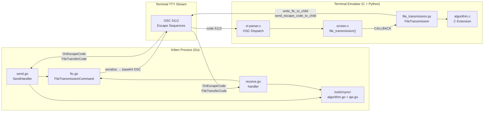

# Technical Specification

# 0. Agent Action Plan

## 0.1 Intent Clarification

### 0.1.1 Core Feature Objective

Based on the prompt, the Blitzy platform understands that the new feature requirement is to **produce comprehensive developer onboarding documentation** that traces the complete journey of file data through kitty's file transfer protocol over SSH connections. This is a read-only analysis and documentation task — no source files are to be modified.

The specific requirements are:

- **Build from source**: Compile the kitty terminal emulator from its multi-language codebase (C, Python, Go, GLSL)
- **SSH + file transfer walkthrough**: Establish an SSH connection using the SSH kitten (`kittens/ssh/`), then initiate a file transfer using the transfer kitten (`kittens/transfer/`)
- **Protocol handshake tracing**: Document how the transfer kitten initiates the protocol handshake and which OSC escape sequences (OSC 5113) establish the transfer session over the terminal connection
- **Rsync-style delta transfer**: Explain how kitty implements rsync-style delta transfer using rolling checksums and strong hashes, and identify the data structures (`BlockHash`, `Operation`, `rolling_checksum`, `diff`) that track file signatures and differences
- **Data encoding and reassembly**: Trace how file chunks are base64-encoded, optionally zlib-compressed, and split into 4096-byte segments for transmission through the terminal stream — and how the receiving side reassembles them while distinguishing transfer data from regular terminal output via the VT parser's OSC dispatch
- **Transfer resumption behavior**: Document what state (if any) allows an interrupted transfer to resume rather than restart, and where resumption metadata would be stored
- **Delta efficiency evidence**: Demonstrate that transferring a modified file sends substantially less data than an initial transfer by identifying the `print_rsync_stats` mechanism and the signature/delta byte tracking in `ProgressTracker`

Implicit requirements detected:

- The documentation must reference exact source file paths and line numbers to ground every claim in code
- The output must be a single markdown file named `kitty_815df1e210e0.md` placed in the `blitzy/documentation/` directory
- Temporary test files used for demonstration must be cleaned up afterward
- Go 1.22 runtime is needed for building the `kitten` binary (not currently installed in the environment)
- The analysis must cover both the Go-side kitten implementation and the Python-side terminal handler since the protocol is bidirectional

### 0.1.2 Special Instructions and Constraints

- **Read-only constraint**: "Do not modify any source files." All analysis is observational; the markdown document is the sole deliverable
- **Temporary file cleanup**: "Temporary test files are fine but clean them up afterwards"
- **No assumptions**: "Do not make assumptions, base your answers on the code as the truth"
- **Rationale required**: "Provide thinking / rationale behind the answers"
- **Output placement**: The generated document goes in `blitzy/documentation/` directory in the destination repo
- **Document naming**: The file must be named `kitty_815df1e210e0.md` (matching the source branch name)

### 0.1.3 Technical Interpretation

These feature requirements translate to the following technical implementation strategy:

- To **trace the protocol handshake**, we will analyze `kittens/transfer/send.go` (lines 383-385) where the OSC prefix `\x1b]5113;id=REQUEST_ID;` and suffix `\x1b\\` are constructed, and `kitty/vt-parser.c` (line 547) where `FILE_TRANSFER_CODE (5113)` dispatches to `file_transmission()` in `kitty/screen.c` (line 2311)
- To **document rsync delta transfer**, we will trace the algorithm in `tools/rsync/algorithm.go` (656 lines) covering `BlockHash`, `rolling_checksum`, `diff`, and `Operation` types, alongside the streaming API in `tools/rsync/api.go` (288 lines) exposing `Patcher` and `Differ`
- To **trace data encoding**, we will follow `kittens/transfer/ftc.go` where `split_for_transfer` chunks data into 4096-byte base64-encoded segments within the `FileTransmissionCommand` serialization format
- To **analyze transfer resumption**, we will examine the protocol state machines in both `kittens/transfer/send.go` (`SendManager` states) and `kittens/transfer/receive.go` (`manager` states) to determine whether persistent resumption metadata exists
- To **demonstrate delta efficiency**, we will reference `kittens/transfer/utils.go` (lines 109-113) where `print_rsync_stats` computes and reports `(delta_bytes + signature_bytes) / total_file_size`
- To **produce the deliverable**, we will create a comprehensive markdown document synthesizing all findings with code references, diagrams, and technical analysis

## 0.2 Repository Scope Discovery

### 0.2.1 Comprehensive File Analysis

The file transfer protocol spans three language layers (Go, Python, C) across multiple directories. Every file listed below has been directly inspected via `read_file` or `get_source_folder_contents`.

**Core Transfer Kitten (Go) — `kittens/transfer/`**

| File | Lines | Purpose |
|------|-------|---------|
| `kittens/transfer/main.go` | 72 | Entry point; dispatches to `send_main` or `receive_main` based on `--direction` flag |
| `kittens/transfer/ftc.go` | 339 | `FileTransmissionCommand` struct, serialization format (`key=value;` pairs), `split_for_transfer` (4096-byte chunking) |
| `kittens/transfer/send.go` | 1289 | `SendHandler`, `SendManager`, `File` structs; state machine (WAITING_FOR_PERMISSION → PERMISSION_GRANTED → transmitting); OSC prefix/suffix construction; rsync integration via `Differ` |
| `kittens/transfer/receive.go` | 1190 | `handler`, `manager`, `remote_file`, `patch_file` structs; receive state machine; signature generation via `Patcher`; delta application |
| `kittens/transfer/utils.go` | ~115 | `print_rsync_stats`, `should_be_compressed` heuristic, `ProgressTracker` |
| `kittens/transfer/utils.py` | — | Python-side utility functions for the transfer kitten |
| `kittens/transfer/main.py` | — | Python entry point for the transfer kitten |
| `kittens/transfer/algorithm.c` | — | C extension: `Hasher`, `Patcher`, `Differ` implementations using xxhash for Python interop |
| `kittens/transfer/rsync.pyi` | 46 | Type stubs for the C extension (`Hasher`, `Patcher`, `Differ`, `parse_ftc`) |
| `kittens/transfer/ftc_test.go` | — | Tests for `FileTransmissionCommand` serialization |
| `kittens/transfer/send_test.go` | — | Tests for sender logic |
| `kittens/transfer/__init__.py` | — | Package init |

**Rsync Algorithm Library (Go) — `tools/rsync/`**

| File | Lines | Purpose |
|------|-------|---------|
| `tools/rsync/algorithm.go` | 656 | Core rsync algorithm: `BlockHash` (20 bytes), `rolling_checksum`, `diff` struct with hash_lookup map, `Operation` types (OpBlock, OpData, OpHash, OpBlockRange), `ApplyDelta`, `CreateDiff` |
| `tools/rsync/api.go` | 288 | Public API: `Patcher` (signature creation + delta application), `Differ` (signature loading + delta creation), streaming interface, signature header format (12 bytes) |
| `tools/rsync/api_test.go` | — | Rsync algorithm tests |

**Terminal-Side Handler (Python) — `kitty/file_transmission.py`**

| File | Lines | Purpose |
|------|-------|---------|
| `kitty/file_transmission.py` | 1249 | `FileTransmission` controller, `FileTransmissionCommand` dataclass, `ActiveSend`/`ActiveReceive` session states, `PatchFile`/`SourceFile`/`DestFile` classes, rsync signature transmission, `write_ftc_to_child` for OSC output |

**VT Parser Integration (C)**

| File | Key Lines | Purpose |
|------|-----------|---------|
| `kitty/control-codes.h` | line 233 | `#define FILE_TRANSFER_CODE 5113` |
| `kitty/vt-parser.c` | lines 547-549 | `case FILE_TRANSFER_CODE:` → `DISPATCH_OSC(file_transmission)` |
| `kitty/screen.c` | line 2311 | `file_transmission(Screen *self, PyObject *data)` → `CALLBACK("file_transmission", "O", data)` |
| `kitty/screen.c` | line 4464 | `send_escape_code_to_child` — sends OSC responses back to kitten |

**Protocol Documentation**

| File | Purpose |
|------|---------|
| `docs/file-transfer-protocol.rst` | Official protocol specification: session lifecycle, send/receive flows, rsync delta mode, quiet modes, authentication bypass |

**Test Files**

| File | Lines | Purpose |
|------|-------|---------|
| `kitty_tests/file_transmission.py` | 540 | Python-side protocol tests: command serialization, rsync roundtrip, pty-based end-to-end testing |
| `kitty_tests/__init__.py` | line 161 | `file_transmission` callback stub for test harness |

**SSH Kitten (Go) — `kittens/ssh/`**

| File | Purpose |
|------|---------|
| `kittens/ssh/main.go` | SSH kitten entry point; bootstrap script generation, shell integration deployment, `kitten` binary transfer to remote |

**Build Configuration**

| File | Purpose |
|------|---------|
| `go.mod` | Go 1.22 module declaration; `zeebo/xxh3` dependency for hashing |
| `pyproject.toml` | Python ≥3.8 requirement |
| `setup.py` | Build orchestration: C compilation, Go binary, shader compilation |

### 0.2.2 Integration Point Discovery

The file transfer protocol integrates across these key boundaries:

- **OSC Escape Code Channel**: The kitten (Go binary running in the terminal's child process) communicates with the terminal emulator (Python/C) via OSC 5113 escape sequences embedded in the standard terminal byte stream
- **VT Parser Dispatch**: `kitty/vt-parser.c` recognizes OSC code 5113 and routes to the `file_transmission` handler in `kitty/screen.c`, which calls back into the Python `FileTransmission` class
- **Rsync C Extension**: The Python-side handler (`kitty/file_transmission.py`) uses a C extension (`kittens/transfer/algorithm.c`) for xxhash-based hashing, signature generation, and delta application — the same algorithm is implemented natively in Go (`tools/rsync/`) for the kitten side
- **SSH Transport Layer**: The SSH kitten (`kittens/ssh/main.go`) bootstraps a remote terminal environment where the `kitten` binary can execute transfer commands, with OSC sequences flowing through the SSH-encrypted channel transparently

### 0.2.3 New File Requirements

- **CREATE**: `blitzy/documentation/kitty_815df1e210e0.md` — Comprehensive markdown document answering all user questions about the file transfer protocol
- No other files are to be created or modified in the source repository

## 0.3 Dependency Inventory

### 0.3.1 Key Packages Relevant to File Transfer

The following packages are directly involved in the file transfer protocol implementation. Versions are taken from `go.mod`, `pyproject.toml`, and the source tree.

| Registry | Package | Version | Purpose |
|----------|---------|---------|---------|
| Go module | `github.com/zeebo/xxh3` | v1.0.2 | xxHash3 (64-bit and 128-bit) used for strong hashes and checksums in rsync algorithm |
| Go module | `golang.org/x/sys` | v0.21.0 | System calls for file metadata (stat, permissions, symlink resolution) |
| Go module | `github.com/google/uuid` | v1.6.0 | UUID generation for transfer session request IDs |
| Go module | `golang.org/x/exp` | v0.0.0-20230801115018 | Extended standard library utilities used in rsync and transfer logic |
| Go stdlib | `compress/zlib` | (stdlib) | Zlib compression/decompression for file data chunks |
| Go stdlib | `encoding/base64` | (stdlib) | Base64 encoding of data payloads and string fields in wire format |
| Go stdlib | `encoding/binary` | (stdlib) | Binary serialization of `BlockHash` (20-byte records) and `Operation` headers |
| Python stdlib | `zlib` | (stdlib) | Zlib decompression on the terminal-emulator side |
| Python (C ext) | `kittens.transfer.rsync` | in-tree | C extension wrapping xxhash for `Hasher`, `Patcher`, `Differ`, `parse_ftc` |
| C library | xxHash | vendored | xxh64 and xxh128 implementations used by `algorithm.c` |
| Go module | `kitty` (self) | go 1.22 | Module root; `tools/rsync/`, `tools/tui/`, `tools/utils/`, `tools/crypto/` are internal packages |
| Python | CPython | ≥ 3.8 | Runtime for `kitty/file_transmission.py` and the terminal emulator process |

### 0.3.2 Build-Time Dependencies

| Dependency | Version | Purpose |
|------------|---------|---------|
| Go compiler | 1.22 | Compiles the `kitten` binary (transfer kitten, SSH kitten, all Go tools) |
| GCC or Clang | C11-capable | Compiles VT parser, screen model, `algorithm.c` extension |
| Python | ≥ 3.8 | Build orchestration via `setup.py`; runtime for terminal emulator |
| FreeType | system | Font rendering (not directly involved in transfer, but required for full build) |
| OpenGL 3.3+ | system | GPU rendering (not directly involved in transfer, but required for full build) |

### 0.3.3 Import Dependencies Within Transfer Subsystem

The transfer protocol involves cross-language imports across the Go, Python, and C layers:

**Go-side imports** (in `kittens/transfer/send.go`, `receive.go`):
- `kitty/tools/rsync` — Rsync `Differ`, `Patcher`, `NewDiffer`, `NewPatcher`
- `kitty/tools/tui/loop` — TUI event loop, `QueueWriteString`, `OnEscapeCode`
- `kitty/tools/utils` — Stream compression, MIME type guessing, humanized sizes
- `kitty/kittens/tui` — Spinner, markup context, progress rendering

**Python-side imports** (in `kitty/file_transmission.py`):
- `kittens.transfer.rsync` — C extension `Patcher`, `Differ`, `Hasher`, `parse_ftc`
- `kitty.fast_data_types` — `FILE_TRANSFER_CODE`, screen callbacks
- `kitty.utils` — Path resolution, base64 utilities

**C dispatch chain** (in `kitty/vt-parser.c` → `kitty/screen.c`):
- `FILE_TRANSFER_CODE` (5113) defined in `kitty/control-codes.h`
- `DISPATCH_OSC(file_transmission)` macro routes to `screen.c` handler
- `CALLBACK("file_transmission", "O", data)` bridges to Python `FileTransmission` class

## 0.4 Integration Analysis

### 0.4.1 Existing Code Touchpoints

The file transfer protocol spans three execution contexts — the kitten process (Go), the terminal emulator core (C), and the terminal controller (Python). The following diagram illustrates the integration architecture:

**Direct integration points requiring analysis:**

- **`kittens/transfer/send.go` (line 384)**: Constructs the OSC prefix `\x1b]5113;id=REQUEST_ID;` and suffix `\x1b\\` — this is the wire format envelope for all protocol commands from the sender
- **`kittens/transfer/receive.go` (line 1089)**: Constructs an identical OSC prefix/suffix for the receive direction
- **`kittens/transfer/ftc.go` (line 326)**: `split_for_transfer` enforces the 4096-byte chunk limit for all data payloads
- **`kitty/vt-parser.c` (line 547)**: The C state machine recognizes OSC code 5113 and dispatches to the `file_transmission` handler via the `DISPATCH_OSC` macro
- **`kitty/screen.c` (line 2311)**: `file_transmission()` receives the parsed OSC payload and forwards it to Python via `CALLBACK("file_transmission", "O", data)`
- **`kitty/file_transmission.py`**: The `FileTransmission` class deserializes the command, routes it through `handle_send_cmd` or `handle_receive_cmd`, and sends responses back via `write_ftc_to_child` which calls `screen.send_escape_code_to_child(ESC_OSC, data)`

### 0.4.2 Rsync Algorithm Integration

The rsync implementation has parallel implementations in Go and Python/C that must produce compatible wire formats:

- **Go side** (`tools/rsync/`): `Patcher` creates signatures, `Differ` computes deltas. Used by the kitten binary when it runs on the sending side
- **Python/C side** (`kitty/file_transmission.py` + `kittens/transfer/algorithm.c`): `PatchFile` wraps the C extension `Patcher` for delta application; `SourceFile` wraps the C extension `Differ` for delta generation. Used by the terminal emulator process

Both sides share the same signature header format (12 bytes: version + checksum_type + strong_hash_type + weak_hash_type + block_size) and the same `BlockHash` record format (20 bytes: index + weak_hash + strong_hash), ensuring cross-language interoperability.

### 0.4.3 SSH Transport Integration

The SSH kitten (`kittens/ssh/main.go`) enables file transfer over SSH by:

- Bootstrapping a remote terminal environment with shell integration
- Deploying the `kitten` static binary to the remote host
- Establishing a terminal session where OSC 5113 sequences flow transparently through the SSH-encrypted channel
- The file transfer protocol is transport-agnostic — it operates identically over direct terminal connections and SSH tunnels because it communicates exclusively through the terminal byte stream

## 0.5 Technical Implementation

### 0.5.1 File-by-File Execution Plan

The deliverable is a single comprehensive markdown document. The following plan traces the analysis sequence needed to produce each section of that document.

**Group 1 — Protocol Handshake and Escape Sequence Analysis**

- **READ**: `kittens/transfer/send.go` (lines 355-385) — Extract OSC prefix/suffix construction for send direction
- **READ**: `kittens/transfer/receive.go` (lines 348-380, 1083-1089) — Extract OSC prefix/suffix construction for receive direction
- **READ**: `kittens/transfer/ftc.go` (lines 120-170) — Document `FileTransmissionCommand` struct fields and serialization format
- **READ**: `kitty/control-codes.h` (line 233) — Confirm `FILE_TRANSFER_CODE = 5113`
- **READ**: `kitty/vt-parser.c` (lines 547-549) — Trace OSC dispatch for code 5113
- **READ**: `kitty/screen.c` (lines 2311-2312, 4464) — Trace C→Python callback and `send_escape_code_to_child`
- **READ**: `docs/file-transfer-protocol.rst` — Protocol specification for session lifecycle

**Group 2 — Rsync Delta Transfer Deep Dive**

- **READ**: `tools/rsync/algorithm.go` (lines 177-262) — `BlockHash` struct, `rolling_checksum`, `signature_iterator`
- **READ**: `tools/rsync/algorithm.go` (lines 340-420) — `rolling_checksum.full()` and `add_one_byte()` implementation
- **READ**: `tools/rsync/algorithm.go` (lines 362-530) — `diff` struct, `hash_lookup` map, window-based scanning, block coalescing
- **READ**: `tools/rsync/algorithm.go` (lines 38-170) — `Operation` type hierarchy (OpBlock, OpData, OpHash, OpBlockRange), serialization
- **READ**: `tools/rsync/algorithm.go` (lines 274-330) — `ApplyDelta` reconstruction logic
- **READ**: `tools/rsync/api.go` (lines 1-120) — `Patcher`/`Differ` API, signature header format
- **READ**: `tools/rsync/api.go` (lines 195-260) — `CreateSignatureIterator`, `CreateDelta`, `CreateDiff`
- **READ**: `tools/rsync/api.go` (lines 260-288) — `NewPatcher` block size calculation: `sqrt(expected_size)`, capped at `MaxBlockSize` (1MB)

**Group 3 — Data Encoding and Reassembly**

- **READ**: `kittens/transfer/ftc.go` (lines 326-339) — `split_for_transfer`: 4096-byte chunking with base64 data encoding
- **READ**: `kittens/transfer/ftc.go` (lines 135-210) — Serialization: semicolon-delimited key=value pairs, `base64.StdEncoding` for strings and data
- **READ**: `kittens/transfer/send.go` (lines 250-340) — `next_chunk`: reads 1MB from file/delta, applies zlib compression, calls `split_for_transfer`
- **READ**: `kittens/transfer/receive.go` (lines 165-220) — `remote_file.write_data`: decompression and reassembly
- **READ**: `kittens/transfer/receive.go` (lines 90-120) — `patch_file`: wraps `rsync.Patcher` with `UpdateDelta(data)` for rsync reconstruction
- **READ**: `kitty/file_transmission.py` (lines 300-450) — `DestFile` and `PatchFile` classes for receive-side file assembly

**Group 4 — Transfer Resumption Analysis**

- **READ**: `kittens/transfer/send.go` (lines 280-400) — `SendManager` state machine: no persistent state between sessions
- **READ**: `kittens/transfer/receive.go` (lines 30-80) — `manager` states: `state_waiting_for_permission` through `state_transferring`; no saved-to-disk resumption state
- **READ**: `docs/file-transfer-protocol.rst` — Protocol spec does not define resumption semantics

**Group 5 — Delta Efficiency Evidence**

- **READ**: `kittens/transfer/utils.go` (lines 109-113) — `print_rsync_stats`: outputs delta size, signature size, transmitted percentage
- **READ**: `kittens/transfer/send.go` (lines 1240-1265) — Post-transfer rsync stats printing with `print_rsync_stats(f.bytes_to_transmit, total_transferred, sig_bytes)`
- **READ**: `tools/rsync/api_test.go` — Test cases validating delta efficiency

**Group 6 — Documentation Output**

- **CREATE**: `blitzy/documentation/kitty_815df1e210e0.md` — Comprehensive analysis document synthesizing all groups above

### 0.5.2 Implementation Approach

The documentation will be produced by:

- **Establishing the protocol foundation**: Documenting the OSC 5113 escape code mechanism, the `FileTransmissionCommand` wire format, and the session lifecycle from `docs/file-transfer-protocol.rst`
- **Tracing the sender flow**: Walking through `send.go`'s `SendHandler` → `SendManager` → `File.metadata_command` → `next_chunk` → `split_for_transfer` pipeline
- **Tracing the receiver flow**: Walking through `receive.go`'s `manager.start_transfer` → `request_files` → `sigwriter` → `remote_file.write_data` → `patch_file.write` pipeline
- **Explaining the rsync algorithm**: Documenting `tools/rsync/algorithm.go`'s signature generation, rolling checksum, diff computation, and delta application with exact struct definitions and code references
- **Analyzing the terminal integration**: Tracing the VT parser → screen → Python callback chain and the reverse `write_ftc_to_child` → `send_escape_code_to_child` path
- **Evaluating resumption**: Documenting the absence of persistent resumption state and explaining the rsync delta mechanism as the protocol's efficiency strategy for re-transfers
- **Quantifying delta efficiency**: Referencing `print_rsync_stats` output format and the mathematical formula for transmitted fraction

### 0.5.3 User Interface Design

Not applicable — this task produces documentation only, with no UI modifications.

## 0.6 Scope Boundaries

### 0.6.1 Exhaustively In Scope

**File transfer protocol core (read-only analysis):**
- `kittens/transfer/**/*.go` — All Go source files in the transfer kitten
- `kittens/transfer/algorithm.c` — C rsync extension for Python interop
- `kittens/transfer/rsync.pyi` — Type stubs for the C extension
- `kittens/transfer/**/*.py` — Python-side transfer kitten utilities
- `tools/rsync/**/*.go` — Go rsync algorithm library (algorithm.go, api.go, api_test.go)

**Terminal-side handler (read-only analysis):**
- `kitty/file_transmission.py` — Python file transmission controller
- `kitty/control-codes.h` (line 233) — FILE_TRANSFER_CODE definition
- `kitty/vt-parser.c` (lines 547-549) — OSC 5113 dispatch
- `kitty/screen.c` (lines 2311-2312, 4464) — file_transmission callback and send_escape_code_to_child

**Protocol documentation (read-only reference):**
- `docs/file-transfer-protocol.rst` — Official protocol specification

**Test files (read-only reference):**
- `kitty_tests/file_transmission.py` — Protocol roundtrip tests
- `kittens/transfer/ftc_test.go` — FTC serialization tests
- `kittens/transfer/send_test.go` — Sender logic tests
- `tools/rsync/api_test.go` — Rsync algorithm tests

**SSH integration (read-only reference):**
- `kittens/ssh/main.go` — SSH kitten bootstrap for remote kitten deployment

**Build configuration (read-only reference):**
- `go.mod` — Go module and dependency versions
- `pyproject.toml` — Python version requirements
- `setup.py` — Build system orchestration

**Deliverable (create):**
- `blitzy/documentation/kitty_815df1e210e0.md` — The comprehensive analysis document

### 0.6.2 Explicitly Out of Scope

- **Source code modifications**: No existing files are to be modified under any circumstances
- **GPU rendering pipeline**: `kitty/*.glsl`, `kitty/shaders.c`, `kitty/gl.c` — unrelated to file transfer
- **Font subsystem**: `kitty/freetype.c`, `kitty/fontconfig.c`, `kitty/glyph-cache.c`
- **Graphics protocol**: `kitty/graphics.c`, `kitty/parse-graphics-command.h`
- **Clipboard protocol**: `kitty/clipboard.py`
- **Window management**: `kitty/layout/`, `kitty/window.py`, `kitty/tabs.py`
- **Remote control API**: `kitty/rc/` (41 command modules)
- **Configuration system**: `kitty/options/`
- **Other kittens**: `kittens/diff/`, `kittens/icat/`, `kittens/themes/`, `kittens/clipboard/`, `kittens/hints/`, etc.
- **GLFW windowing layer**: `glfw/` directory
- **Third-party libraries**: `3rdparty/`
- **Build artifacts and binary output**
- **Performance optimizations or code refactoring**
- **Any features or protocols not directly involved in file transfer

## 0.7 Rules for Feature Addition

### 0.7.1 User-Specified Rules

The following rules are explicitly emphasized by the user and the implementation rules configuration:

- **No source modification**: "Do not modify any existing files in the source repository." All analysis is read-only; the only file created is the documentation markdown
- **No assumptions**: "Do not make assumptions, base your answers on the code as the truth." Every claim in the documentation must be grounded in specific file paths and line references from the source code
- **Provide rationale**: "Provide thinking / rationale behind the answers." The documentation should explain not just *what* the code does but *why* the design decisions were made
- **Temporary file cleanup**: "Temporary test files are fine but clean them up afterwards." Any files created during build or testing must be removed before completion
- **Output placement**: "Place the generated document in the `blitzy/documentation` directory in the destination repo"
- **Output naming**: "Create a new markdown document named `<source_branch_name>.md`" — the file must be named `kitty_815df1e210e0.md`

### 0.7.2 Documentation Quality Requirements

- Every protocol behavior described must cite specific source files and line numbers
- Diagrams should be included where they clarify complex flows (protocol handshake, rsync delta lifecycle, VT parser dispatch chain)
- The document must be self-contained and understandable to a developer onboarding to the kitty codebase
- Code snippets should be minimal and focused, illustrating key data structures and algorithms rather than reproducing large blocks of source code
- The analysis must cover both the Go kitten side and the Python/C terminal side to present the complete bidirectional protocol picture

## 0.8 References

### 0.8.1 Files and Folders Searched

The following files and folders were directly inspected during the analysis phase:

**Repository Root**
- `/` (root) — Full directory listing via `get_source_folder_contents`
- `go.mod` — Go module version (1.22) and dependency declarations
- `pyproject.toml` — Python version requirement (≥3.8)

**Transfer Kitten Directory (`kittens/transfer/`)**
- `kittens/transfer/` — Full directory listing
- `kittens/transfer/main.go` — Entry point, direction dispatch (72 lines)
- `kittens/transfer/ftc.go` — FileTransmissionCommand, serialization, split_for_transfer (339 lines)
- `kittens/transfer/send.go` — Complete sender implementation (1289 lines, read in 6 segments)
- `kittens/transfer/receive.go` — Complete receiver implementation (1190 lines, read in 6 segments)
- `kittens/transfer/utils.go` — Utility functions including `print_rsync_stats`, `should_be_compressed` (~115 lines)
- `kittens/transfer/rsync.pyi` — C extension type stubs (46 lines)
- `kittens/transfer/algorithm.c` — C rsync extension (partial read, first 80 lines)

**Rsync Library (`tools/rsync/`)**
- `tools/rsync/` — Full directory listing
- `tools/rsync/algorithm.go` — Core rsync algorithm (656 lines, read in full across multiple segments)
- `tools/rsync/api.go` — Public Patcher/Differ API (288 lines, read in full)

**Terminal Handler**
- `kitty/file_transmission.py` — Python FileTransmission controller (1249 lines, full read)

**VT Parser Chain**
- `kitty/control-codes.h` — `FILE_TRANSFER_CODE 5113` (line 233)
- `kitty/vt-parser.c` — OSC dispatch for code 5113 (lines 547-549)
- `kitty/screen.c` — `file_transmission()` callback and `send_escape_code_to_child` (lines 2311-2312, 4464, 4853)

**Protocol Documentation**
- `docs/file-transfer-protocol.rst` — Official protocol spec (read lines 1-400)

**Test Files**
- `kitty_tests/file_transmission.py` — File transmission test class (540 lines, references verified)
- `kitty_tests/__init__.py` — Test harness `file_transmission` callback (line 161)

**SSH Kitten**
- `kittens/ssh/` — Full directory listing
- `kittens/ssh/main.go` — SSH bootstrap, kitten binary deployment (references to `bootstrap_script`, line 481)

**Supporting Directories**
- `tools/` — Full directory listing (rsync, tui, crypto, utils)
- `kittens/` — Full directory listing (all 20+ kittens)
- `kitty/` — Full directory listing (core terminal emulator files)
- `tools/tui/` — TUI loop infrastructure (directory listing)

### 0.8.2 Attachments and External References

- No user-provided attachments
- No Figma URLs specified
- No external URLs referenced

### 0.8.3 Tech Spec Sections Consulted

- **Section 2.1 Feature Catalog**: Feature registry including F-005 (Kittens Framework), F-007 (Novel Terminal Protocols), F-021 (Go CLI Tools)
- **Section 3.1 Programming Languages**: C11, Python ≥3.8, Go 1.22 language architecture
- **Section 4.8 Kittens Framework Execution Flow**: Kitten resolution, module loading, execution lifecycle
- **Section 4.9 Protocol Workflows**: File Transfer Protocol flow state diagram, protocol features summary, error recovery model

