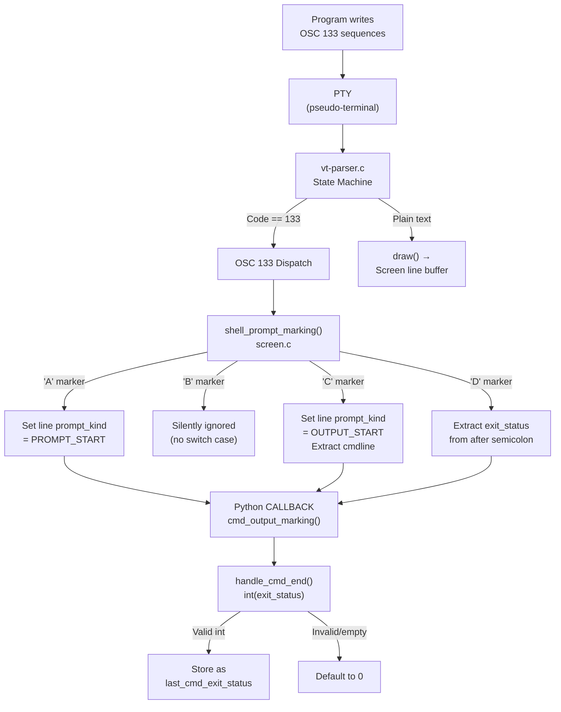

# Technical Specification

# 0. Agent Action Plan

## 0.1 Intent Clarification

### 0.1.1 Core Feature Objective

Based on the prompt, the Blitzy platform understands that the new feature requirement is to **investigate and document how kitty terminal's VT parser and shell integration layer handle OSC 133 escape sequences for command tracking**, specifically:

- **OSC 133 Sequence Processing**: Determine what kitty does with OSC 133;A, OSC 133;B, OSC 133;C (with `cmdline` parameter), and OSC 133;D (with exit code) sequences when a program writes them to its output stream
- **Output Presence Verification**: Confirm whether those OSC escape sequences are still present in the terminal output after processing, or if they are consumed by the VT parser
- **Byte-Level Analysis**: Calculate the total byte length of a test input containing all four OSC 133 markers plus text, and identify the exact byte offset where the "D;42" marker appears
- **Exit Code Variation Analysis**: Run the same test sequence with exit codes 0, 1, and 127, and report the total byte lengths, the D-marker byte positions, whether the position shifts, and by how much
- **Exit Code 99 Runtime Evidence**: Run a test with exit code 99 and produce concrete runtime evidence (callback state, CmdDump output) proving that the value 99 was processed through the entire code path
- **Invalid Exit Code Handling**: Determine what values get recorded internally when the terminal receives `OSC 133;D;not_a_number` and `OSC 133;D;` (empty exit code)

Implicit requirements detected:
- The investigation must be read-only; no existing repository files may be modified
- All test scripts created during investigation must be cleaned up afterward
- Answers must be grounded in actual code execution and source code analysis, not assumptions

### 0.1.2 Special Instructions and Constraints

- **CRITICAL**: Do not modify any existing repository files during the investigation
- **CRITICAL**: Clean up any test scripts when done
- **Output Format**: Create a markdown document named `kitty_815df1e210e0.md` in the `blitzy/documentation` directory that comprehensively answers all posed questions
- **Evidence-Based**: All answers must be derived from building and running the kitty source code, not from assumptions
- **Rationale Required**: Provide thinking and rationale behind the answers

### 0.1.3 Technical Interpretation

These feature requirements translate to the following technical implementation strategy:

- To understand OSC 133 handling, we will trace the full code path from `kitty/vt-parser.c` (VT parser state machine) through `kitty/screen.c` (`shell_prompt_marking` function) to `kitty/window.py` (`cmd_output_marking` and `handle_cmd_end` methods)
- To verify output presence, we will use kitty's test infrastructure (`kitty_tests/__init__.py` `parse_bytes` function and `kitty_tests/parser.py` `CmdDump` class) to feed raw escape sequences into a Screen object and observe what the parser produces
- To compute byte offsets, we will construct precise byte sequences for each OSC 133 marker with both BEL and ST terminators, and calculate offsets arithmetically
- To test exit code variations, we will run parameterized tests through the Screen/Callbacks test infrastructure and compare the `last_cmd_exit_status` callback field
- To validate invalid exit codes, we will trace the C code's extraction logic and the Python code's `int()` conversion with exception handling

## 0.2 Repository Scope Discovery

### 0.2.1 Comprehensive File Analysis

The investigation requires analyzing the following existing files that form the OSC 133 processing pipeline:

**VT Parser Layer (C)**

| File | Purpose | Relevance |
|------|---------|-----------|
| `kitty/vt-parser.c` (lines 536-545) | VT parser state machine, OSC 133 dispatch | Entry point: parses the OSC code, extracts payload, calls `shell_prompt_marking` on the Screen object |
| `kitty/screen.c` (lines 2316-2360) | `shell_prompt_marking()` and `parse_prompt_mark()` functions | Core handler: switches on A/C/D markers, extracts exit status from D marker, triggers Python CALLBACK |
| `kitty/screen.h` (line 231) | Function declaration for `shell_prompt_marking` | API boundary for the C-level handler |
| `kitty/data-types.h` (line 230) | `PromptKind` enum: `UNKNOWN_PROMPT_KIND`, `PROMPT_START`, `SECONDARY_PROMPT`, `OUTPUT_START` | Defines line attribute values set by A and C markers |

**Python Callback Layer**

| File | Purpose | Relevance |
|------|---------|-----------|
| `kitty/window.py` (lines 1408-1460) | `handle_cmd_end()` and `cmd_output_marking()` methods | Production code path: converts exit_status string to int, defaults to 0 on failure |
| `kitty/client.py` (lines 250-251) | `shell_prompt_marking()` write helper | Writes OSC 133 payloads (used for replay/remote control) |

**Test Infrastructure**

| File | Purpose | Relevance |
|------|---------|-----------|
| `kitty_tests/__init__.py` (lines 30-35, 72-82) | `parse_bytes()` function and `Callbacks` class | Test harness: feeds raw bytes into Screen, captures callback results including `last_cmd_exit_status` |
| `kitty_tests/parser.py` (lines 33-58) | `CmdDump` class | Records every parser dispatch event as tuples for inspection |
| `kitty_tests/shell_integration.py` | Shell integration end-to-end tests | Existing tests for bash/zsh/fish integration with OSC 133 markers |

**Shell Integration Scripts**

| File | Purpose | Relevance |
|------|---------|-----------|
| `kitty/shell_integration.py` | Shell environment modification for integration | Sets up `KITTY_SHELL_INTEGRATION` env var enabling OSC 133 emission by shells |
| `shell-integration/bash/kitty.bash` | Bash shell integration script | Emits OSC 133;A/B/C/D markers around prompt and command execution |
| `shell-integration/zsh/kitty.zsh` | Zsh shell integration script | Emits OSC 133 markers for zsh |
| `shell-integration/fish/` | Fish shell integration directory | Emits OSC 133 markers for fish |

**History and Output Recovery**

| File | Purpose | Relevance |
|------|---------|-----------|
| `kitty/history.c` (line 475) | `reverse_find` for `\x1b]133;C\x1b\\` | History buffer uses the literal OSC 133;C;ST sequence to find command output boundaries when scrolling back |

### 0.2.2 Integration Point Discovery

- **VT Parser → Screen**: `vt-parser.c` calls `shell_prompt_marking(self->screen, (char*)buf + i)` for OSC code 133
- **Screen → Python Callbacks**: `screen.c` uses the `CALLBACK` macro to invoke Python methods:
  - A marker: `CALLBACK("cmd_output_marking", "O", Py_False)`
  - C marker: `CALLBACK("cmd_output_marking", "OO", Py_True, cmdline_obj)`
  - D marker: `CALLBACK("cmd_output_marking", "Os", Py_None, exit_status)`
- **Python Callbacks → Window State**: `window.py` `cmd_output_marking()` dispatches to `handle_cmd_end()` which stores `last_cmd_exit_status`
- **Line Attributes**: A and C markers update `self->linebuf->line_attrs[y].prompt_kind` (PromptKind enum)

### 0.2.3 New File Requirements

- **CREATE**: `blitzy/documentation/kitty_815df1e210e0.md` — The comprehensive investigation report answering all user questions

No other new files are needed, and no existing files will be modified.

## 0.3 Dependency Inventory

### 0.3.1 Private and Public Packages

| Registry | Package | Version | Purpose |
|----------|---------|---------|---------|
| System | Python | >=3.8 (pyproject.toml `requires-python`) | Runtime for kitty's Python layer and test infrastructure |
| System | GCC | 13.3.0 (Ubuntu 24.04) | Compiles C extensions including `fast_data_types.so` |
| System | Go | 1.22+ (go.mod) | Builds the kitten Go binary |
| System | pkg-config | System package | Resolves C library flags for harfbuzz, fontconfig, etc. |
| apt | libharfbuzz-dev | 8.3.0 (Ubuntu noble) | Text shaping library required for build |
| apt | libfontconfig-dev | 2.15.0 (Ubuntu noble) | Font configuration library |
| apt | libgl1-mesa-dev | 25.2.8 (Ubuntu noble) | OpenGL development headers |
| apt | libxkbcommon-x11-dev | 1.6.0 (Ubuntu noble) | Keyboard handling library |
| apt | libdbus-1-dev | 1.14.10 (Ubuntu noble) | D-Bus support for desktop notifications |
| apt | liblcms2-dev | 2.14 (Ubuntu noble) | Color management |
| apt | libpython3-dev | 3.12.3 (Ubuntu noble) | Python C API headers for extension builds |
| apt | libxxhash-dev | 0.8.2 (Ubuntu noble) | Fast hash library |
| Go module | golang.org/x/sys | v0.28.0 (go.mod) | Go system call support for kitten binary |
| Go module | golang.org/x/image | v0.23.0 (go.mod) | Go image processing for kitten |
| Go module | github.com/seancfoley/ipaddress-go | v1.7.0 (go.mod) | IP address handling in Go |

### 0.3.2 Dependency Updates

No dependency updates are required for this investigation task. The project is built as-is from the repository at commit `815df1e210e0a9ab4622f5c7f2d6891d7dbeddf1`.

## 0.4 Integration Analysis

### 0.4.1 Existing Code Touchpoints

The OSC 133 processing pipeline involves three tightly-coupled layers:

**Layer 1 — VT Parser (C)**

- `kitty/vt-parser.c` (lines 536-545): The OSC dispatch switch statement handles code 133 by:
  - In DUMP_COMMANDS mode: calling `REPORT_OSC2(shell_prompt_marking, code, mv)` to log the event
  - Null-terminating the payload buffer and calling `shell_prompt_marking(self->screen, (char*)buf + i)` where `buf + i` points to the payload after "133;"

**Layer 2 — Screen Model (C)**

- `kitty/screen.c` `shell_prompt_marking()` (lines 2328-2360): Switches on the first character of the payload:
  - `'A'`: Sets `prompt_kind = PROMPT_START` on the current line's attributes, parses optional parameters (k=s for SECONDARY_PROMPT, redraw=0, special_key=1), fires `CALLBACK("cmd_output_marking", "O", Py_False)`
  - `'C'`: Sets `prompt_kind = OUTPUT_START`, extracts cmdline if the payload contains `;cmdline`, fires `CALLBACK("cmd_output_marking", "OO", Py_True, cmdline_pyobj)`
  - `'D'`: Extracts exit_status as `buf[1] == ';' ? buf + 2 : ""`, fires `CALLBACK("cmd_output_marking", "Os", Py_None, exit_status)`
  - `'B'`: No case exists — the B marker is silently ignored at the screen level (though it is reported via `REPORT_OSC2` in dump mode)

**Layer 3 — Python Window (Python)**

- `kitty/window.py` `cmd_output_marking()` (lines 1453-1460): Routes based on `is_start`:
  - `True` (C marker): Records `last_cmd_output_start_time` and `last_cmd_cmdline`
  - `None` (D marker) or `False` (A marker): Calls `handle_cmd_end()`
- `kitty/window.py` `handle_cmd_end()` (lines 1408-1451): Converts exit_status string to int via `try/except`, defaulting to 0 on failure

**Test Callbacks (Test Infrastructure)**

- `kitty_tests/__init__.py` `Callbacks.cmd_output_marking()` (lines 72-78): Mirrors production logic but uses `suppress(Exception)` — leaving `last_cmd_exit_status` at `sys.maxsize` (9223372036854775807) when `int()` conversion fails

### 0.4.2 Data Flow Diagram

### 0.4.3 Key Behavioral Findings

- **OSC sequences are consumed**: The VT parser intercepts OSC 133 sequences and dispatches them to handlers. They never reach the screen's line buffer — only plain text between markers appears as visible output.
- **B marker is a no-op**: While the VT parser dispatches the B marker through the same path, `shell_prompt_marking()` in screen.c has no `case 'B':` — the marker is silently dropped.
- **Exit status extraction in C**: The D marker handler uses `buf[1] == ';' ? buf + 2 : ""` — a simple pointer arithmetic to skip past the semicolon delimiter.
- **Two different failure modes for invalid exit codes**: The production Window code defaults to 0, while the test Callbacks leave the value at `sys.maxsize`.

## 0.5 Technical Implementation

### 0.5.1 File-by-File Execution Plan

- **CREATE**: `blitzy/documentation/kitty_815df1e210e0.md` — Comprehensive markdown document containing all investigation findings, organized into sections for each user question, with code evidence, byte-level analysis tables, and rationale

No existing files will be modified. All test scripts used during the investigation have been cleaned up.

### 0.5.2 Implementation Approach

The investigation follows a three-phase approach:

**Phase 1 — Source Code Tracing**
Establish the complete code path by reading `kitty/vt-parser.c`, `kitty/screen.c`, `kitty/window.py`, and `kitty_tests/__init__.py` to understand how OSC 133 sequences flow from raw bytes to stored state.

**Phase 2 — Runtime Verification**
Build the kitty C extension (`python3 setup.py build`) and use the test infrastructure's `parse_bytes()` function and `CmdDump` class to feed crafted byte sequences into a Screen object. Observe:
- What `CmdDump.get_result()` reports (parser dispatch events)
- What `Callbacks.last_cmd_exit_status` and `last_cmd_cmdline` contain after parsing
- What appears on the Screen's line buffer (visible text only)

**Phase 3 — Parameterized Testing**
Run the same test structure with varying parameters:
- Exit codes 0, 1, 127 for byte-length comparison
- Exit code 99 for complete code-path evidence
- Invalid values "not_a_number" and "" for error handling verification

### 0.5.3 Key Test Results Summary

**Test 1 — OSC Sequence Visibility**
The CmdDump shows five events for the standard test input: `('shell_prompt_marking', 133, 'A')`, `('shell_prompt_marking', 133, 'B')`, `('shell_prompt_marking', 133, 'C;cmdline=test_cmd')`, `('draw', 'hello output')`, `('shell_prompt_marking', 133, 'D;42')`. Only the `('draw', 'hello output')` event writes to the screen. The screen line reads "hello output" with no escape characters present.

**Test 2 — Byte Lengths for Exit Codes 0, 1, 127**
Using BEL-terminated OSC sequences:
- Exit code `0`: total input = 63 bytes, D marker = 10 bytes
- Exit code `1`: total input = 63 bytes, D marker = 10 bytes
- Exit code `127`: total input = 65 bytes, D marker = 12 bytes
- The D marker always starts at byte offset 53 — preceding content is identical regardless of exit code

**Test 3 — Exit Code 99 Evidence**
`callbacks.last_cmd_exit_status` equals the integer `99`. The CmdDump records `('shell_prompt_marking', 133, 'D;99')`, proving the value traversed: VT parser → C handler → Python callback → int conversion → stored state.

**Test 4 — Invalid Exit Codes**
For `"not_a_number"` and `""`: the test Callbacks leave `last_cmd_exit_status` at `sys.maxsize` (9223372036854775807) because `int()` fails and the exception is suppressed. In production (`window.py`), the `except` clause sets `last_cmd_exit_status = 0`.

## 0.6 Scope Boundaries

### 0.6.1 Exhaustively In Scope

- All source files forming the OSC 133 code path:
  - `kitty/vt-parser.c` — VT parser OSC 133 dispatch logic
  - `kitty/screen.c` — `shell_prompt_marking()` and `parse_prompt_mark()` functions
  - `kitty/screen.h` — Function declarations
  - `kitty/data-types.h` — `PromptKind` enum definition
  - `kitty/window.py` — `handle_cmd_end()` and `cmd_output_marking()` methods
  - `kitty/client.py` — `shell_prompt_marking()` write helper
  - `kitty/history.c` — OSC 133;C boundary detection in scrollback history
- All test infrastructure files used for verification:
  - `kitty_tests/__init__.py` — `parse_bytes()`, `Callbacks` class
  - `kitty_tests/parser.py` — `CmdDump` class
  - `kitty_tests/shell_integration.py` — Existing shell integration tests (reference only)
- Shell integration scripts (read-only analysis):
  - `shell-integration/bash/kitty.bash`
  - `shell-integration/zsh/kitty.zsh`
  - `shell-integration/fish/`
- Build configuration:
  - `pyproject.toml` — Python version requirement
  - `setup.py` — Build system
  - `go.mod` / `go.sum` — Go dependencies for kitten binary
- Output deliverable:
  - `blitzy/documentation/kitty_815df1e210e0.md` — Investigation report

### 0.6.2 Explicitly Out of Scope

- Modification of any existing repository files
- Analysis of OSC sequences other than 133 (e.g., OSC 52 clipboard, OSC 7 CWD, OSC 8 hyperlinks)
- Performance benchmarking of the VT parser
- GPU rendering pipeline behavior
- Shell integration for shells other than the analysis of how they emit OSC 133
- SSH bootstrap sequence
- Kitty keyboard protocol
- Graphics protocol (DCS/APC sequences)
- Any kittens framework functionality beyond test infrastructure

## 0.7 Rules for Feature Addition

### 0.7.1 User-Specified Rules

- **SWE-AtlasQnA-Repo**: Create a new markdown document named `kitty_815df1e210e0.md` that comprehensively answers the questions posed in the prompt
- Build and run the source code to analyze the repository behavior as needed
- Do not make assumptions; base answers on the code as the truth
- Provide thinking and rationale behind the answers
- Do not modify any existing files in the source repository
- Do not add any other code in the source repository besides the requested document
- Place the generated document in the `blitzy/documentation` directory in the destination repo

### 0.7.2 Investigation-Specific Constraints

- **Read-Only Policy**: All analysis must be conducted through building and running tests, never by modifying source files
- **Cleanup Requirement**: Any temporary test scripts created during investigation must be removed afterward
- **Evidence Standard**: Every claim must be supported by either source code citation or runtime test output

## 0.8 References

### 0.8.1 Repository Files Analyzed

The following files and folders were searched and analyzed to derive conclusions:

**Core OSC 133 Code Path**
- `kitty/vt-parser.c` — VT parser state machine, OSC dispatch logic (lines 510-550)
- `kitty/screen.c` — `shell_prompt_marking()`, `parse_prompt_mark()` (lines 2300-2400)
- `kitty/screen.h` — Function declaration for `shell_prompt_marking` (line 231)
- `kitty/data-types.h` — `PromptKind` enum definition (line 230)
- `kitty/window.py` — `handle_cmd_end()`, `cmd_output_marking()` (lines 1390-1470)
- `kitty/client.py` — `shell_prompt_marking()` write function (lines 240-280)
- `kitty/history.c` — OSC 133;C boundary search in scrollback (line 475)

**Test Infrastructure**
- `kitty_tests/__init__.py` — `parse_bytes()`, `Callbacks` class (lines 1-120)
- `kitty_tests/parser.py` — `CmdDump` class, `TestParser` base (lines 1-60)
- `kitty_tests/shell_integration.py` — Full shell integration test suite

**Shell Integration**
- `kitty/shell_integration.py` — Shell environment modification (full file)
- `kitty/constants.py` — `shell_integration_dir` path (line 179)

**Configuration and Build**
- `pyproject.toml` — Python version requirement (`requires-python = ">=3.8"`)
- `setup.py` — Build system (head 30 lines)
- `go.mod` — Go module dependencies

**Repository Root**
- Root directory listing for structure understanding
- `kitty/` directory listing for file inventory
- `kitty_tests/` directory listing for test file inventory

### 0.8.2 Attachments

No attachments were provided for this project.

### 0.8.3 Technical Specification Sections Referenced

- **4.3 TERMINAL INPUT/OUTPUT PIPELINE** — VT parser dispatch architecture, OSC 133 routing to shell markers
- **4.7 SHELL INTEGRATION FLOW** — Shell environment setup, OSC 133 prompt boundary markers, active integration features table

