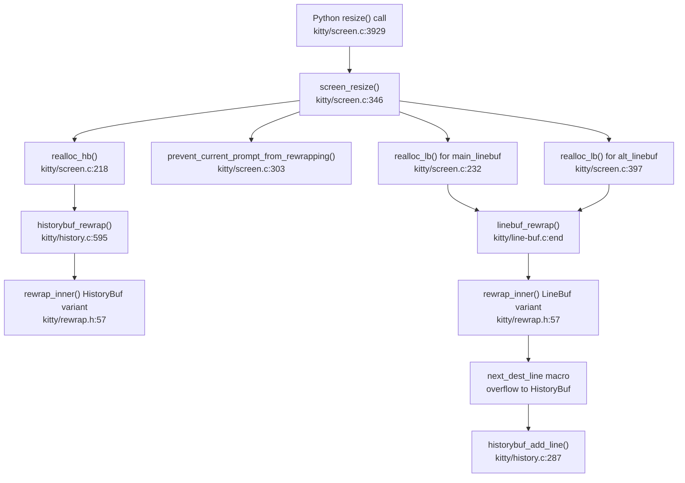

# Technical Specification

# 0. Agent Action Plan

## 0.1 Intent Clarification

### 0.1.1 Core Feature Objective

Based on the prompt, the Blitzy platform understands that the new feature requirement is to **produce a comprehensive technical analysis document** that traces kitty's terminal reflow (rewrap) system — the C implementation responsible for redistributing terminal text across new dimensions when a window is resized — and documents the complete data flow, buffer interactions, and potential edge-case issues.

The specific analysis requirements are:

- **Trace the rewrap implementation in C code**: Walk through the `rewrap_inner()` function in `kitty/rewrap.h`, explaining each step of the algorithm that re-distributes cells from a source buffer to a destination buffer of different dimensions
- **Explain visible screen buffer ↔ scrollback history interaction during resize**: Document how `screen_resize()` in `kitty/screen.c` orchestrates the reallocation of both `HistoryBuf` and `LineBuf`, and how content flows between them during the rewrap process
- **Identify potential issues with line continuation state propagation**: Analyze the dual representation of line continuation (`next_char_was_wrapped` in `GPUCell.attrs` vs `is_continued` in `LineAttrs`) and identify scenarios where these two signals may become inconsistent between the history buffer and the visible screen buffer
- **Document the complete data flow from resize entry point through rewrap logic**: Map the call chain from `screen_resize()` → `realloc_hb()` / `realloc_lb()` → `historybuf_rewrap()` / `linebuf_rewrap()` → `rewrap_inner()`, including all macro overrides that specialize `rewrap_inner` for each buffer type
- **Do not create or modify any files** other than the requested analysis document placed in `blitzy/documentation/`

Implicit requirements detected:

- The analysis must cover the **macro-polymorphism pattern** used in `rewrap.h`, where `#define` overrides (`BufType`, `init_src_line`, `next_dest_line`, `first_dest_line`, `is_src_line_continued`) allow a single generic `rewrap_inner()` to operate on both `LineBuf` and `HistoryBuf`
- The analysis must address the **cursor tracking mechanism** (`TrackCursor` structs) and how cursor positions are remapped during rewrap
- The analysis should explain the **prompt-protection logic** in `prevent_current_prompt_from_rewrapping()`, which blanks shell prompt lines before rewrap to prevent visual flickering
- The analysis must cover the **scrollback fill feature** (`scrollback_fill_enlarged_window` option) that pulls lines from history into the visible buffer after resize

### 0.1.2 Special Instructions and Constraints

- **Read-only analysis**: The user explicitly states "Don't create or modify any files" in the source repository. The only output is a markdown analysis document
- **Implementation rule**: Per the `SWE-AtlasQnA-Repo` rule, the analysis document must be named `kitty_815df1e210e0.md` (the source branch name) and placed in `blitzy/documentation/`
- **Evidence-based**: All claims must be grounded in the actual source code, not assumptions. The user expects direct references to functions, line ranges, and data structures
- **Build and run as needed**: The project may be built to verify behavior, but no source modifications are permitted

### 0.1.3 Technical Interpretation

These feature requirements translate to the following technical implementation strategy:

- To **trace the rewrap implementation**, we will read and analyze `kitty/rewrap.h` (96 lines), `kitty/line-buf.c` (the `linebuf_rewrap()` wrapper and its `#include "rewrap.h"` instantiation), and `kitty/history.c` (the `historybuf_rewrap()` wrapper with its own macro overrides before including `rewrap.h`)
- To **explain the screen↔history interaction**, we will analyze `screen_resize()` in `kitty/screen.c` (lines ~346–470), which orchestrates history buffer reallocation via `realloc_hb()`, line buffer reallocation via `realloc_lb()`, cursor position tracking via `CursorTrack` structs, prompt protection, and post-resize scrollback fill
- To **identify continuation-state issues**, we will analyze the dual-signal architecture: `next_char_was_wrapped` (a per-cell GPU attribute on the last cell of a line) vs `is_continued` (a per-line `LineAttrs` field computed dynamically during `linebuf_init_line()` and `historybuf init_line()`), and trace how these are read and written during `rewrap_inner()`
- To **document the complete data flow**, we will create a comprehensive call-graph and data-flow narrative covering every function in the resize→rewrap chain, including the `next_dest_line` macro's overflow-to-history behavior in the LineBuf specialization

## 0.2 Repository Scope Discovery

### 0.2.1 Comprehensive File Analysis

The following files constitute the complete set of source artifacts relevant to understanding kitty's terminal reflow system. All paths are relative to the repository root.

**Core Rewrap Implementation Files**

| File | Lines | Role in Reflow System |
|------|-------|-----------------------|
| `kitty/rewrap.h` | 96 | Generic rewrap algorithm using macro-polymorphism; contains `rewrap_inner()` — the heart of the reflow logic |
| `kitty/screen.c` | 4932 | Contains `screen_resize()` (entry point), `realloc_hb()`, `realloc_lb()`, `prevent_current_prompt_from_rewrapping()`, and post-resize cursor/scrollback adjustment |
| `kitty/screen.h` | 289 | Screen struct definition including `LineBuf *linebuf`, `HistoryBuf *historybuf`, `Cursor *cursor`, savepoints, and the `scrolled_by` state |
| `kitty/line-buf.c` | 641 | `LineBuf` operations: `linebuf_rewrap()` wrapper, `linebuf_init_line()`, `linebuf_index()`, `linebuf_set_last_char_as_continuation()`, `linebuf_clear_line()`, and the LineBuf-specialization `#include "rewrap.h"` |
| `kitty/history.c` | ~640 | `HistoryBuf` operations: `historybuf_rewrap()` wrapper, `historybuf_add_line()`, `historybuf_pop_line()`, `history_buf_endswith_wrap()`, ring-buffer management, pager history rewrap, and the HistoryBuf-specialization `#include "rewrap.h"` |
| `kitty/line.c` | 1003 | Line-level cell operations used during copy and clear phases of rewrap |
| `kitty/lineops.h` | 136 | Shared line operation declarations including `copy_line()`, `xlimit_for_line()`, `clear_chars_in_line()`, and function prototypes for `linebuf_rewrap()`, `historybuf_rewrap()` |
| `kitty/data-types.h` | 438 | Core type definitions: `GPUCell` (with `CellAttrs.next_char_was_wrapped`), `CPUCell`, `LineAttrs` (with `is_continued`), `LineBuf`, `HistoryBuf`, `Line`, `Cursor` structs |

**Test Files**

| File | Relevant Tests |
|------|----------------|
| `kitty_tests/datatypes.py` | `test_rewrap_simple()`, `test_rewrap_wider()`, `test_rewrap_narrower()` — direct LineBuf and HistoryBuf rewrap tests with continuation assertions |
| `kitty_tests/screen.py` | `test_resize()`, `test_cursor_after_resize()`, `test_scrollback_fill_after_resize()` — integration tests exercising the full `screen_resize()` path |
| `kitty_tests/__init__.py` | `create_screen()` helper and `set_window_size()` method used by resize tests |

**Configuration and Options Files**

| File | Relevance |
|------|-----------|
| `kitty/options/definition.py` | Defines `scrollback_fill_enlarged_window` option (line ~420) that controls post-resize history-to-screen fill behavior |
| `kitty/options/to-c-generated.h` | Generated C interop for `scrollback_fill_enlarged_window` option access from native code |

**Supporting Infrastructure Files**

| File | Relevance |
|------|-----------|
| `kitty/cursor.c` | Cursor struct operations used during position tracking through rewrap |
| `kitty/graphics.c` | `grman_resize()` called during `screen_resize()` to adjust graphics placement after rewrap |

### 0.2.2 Integration Point Discovery

- **Resize entry point**: `screen_resize()` in `kitty/screen.c` is the sole entry point for all terminal resize operations, called from the Python `resize()` method
- **History buffer connection**: During `realloc_lb()`, the `HistoryBuf *hb` is passed to `linebuf_rewrap()`, which passes it to `rewrap_inner()`. When the destination LineBuf overflows (dest is full), excess lines are pushed to the HistoryBuf via the `next_dest_line` macro
- **Graphics manager**: `grman_resize()` is called after both main and alt linebuf rewrap to adjust image positions
- **Cursor tracking**: Two `CursorTrack` structs track cursor and savepoint positions through the rewrap process
- **Prompt protection**: `prevent_current_prompt_from_rewrapping()` copies prompt lines to a temporary buffer and blanks them before rewrap, then restores them after

### 0.2.3 New File Requirements

- **CREATE**: `blitzy/documentation/kitty_815df1e210e0.md` — The comprehensive analysis document answering all questions about the reflow system

No other new files are required. No existing source files will be modified, per the user's explicit instruction.

## 0.3 Dependency Inventory

### 0.3.1 Private and Public Packages

Since this task is a read-only source code analysis producing a documentation artifact, no new dependencies need to be installed. The relevant existing packages within the repository are:

| Package Registry | Name | Version | Purpose |
|-----------------|------|---------|---------|
| System | Python | >=3.8 (per `pyproject.toml`) | Runtime for test execution and project build; Python 3.12.3 available in environment |
| System | C11 Compiler | gcc/clang | Required to build native extensions including `screen.c`, `line-buf.c`, `history.c` |
| Vendored (3rdparty) | ringbuf | Bundled in `3rdparty/ringbuf/` | Ring buffer implementation used by `PagerHistoryBuf` in `kitty/history.c` |
| PyPI | kitty (self) | Current HEAD (815df1e21) | The kitty terminal emulator project under analysis |

### 0.3.2 Dependency Updates

No dependency updates are required for this task. The analysis document will be produced by reading and interpreting existing source code. All relevant C header includes are internal to the project:

- `kitty/data-types.h` — Core type definitions
- `kitty/lineops.h` — Line operation interfaces
- `kitty/rewrap.h` — Generic rewrap algorithm (included twice with different macro definitions)
- `kitty/wcswidth.h` — Wide character width calculations (used in `history.c`)
- `3rdparty/ringbuf/ringbuf.h` — Ring buffer for pager history

No import transformation rules apply since no source files are being modified.

## 0.4 Integration Analysis

### 0.4.1 Existing Code Touchpoints

The following integration points form the critical chain that the analysis document must trace and explain. These are read-only references — none of these files will be modified.

**Primary Resize Call Chain**

**Direct Integration Points (read for analysis)**

- `kitty/screen.c` — `screen_resize()` at line ~346: The main orchestration function that sequences history rewrap, prompt protection, linebuf rewrap, cursor remapping, graphics resize, scrollback fill, and prompt restoration
- `kitty/screen.c` — `realloc_hb()` at line ~218: Allocates a new `HistoryBuf` with the new column count and calls `historybuf_rewrap()` to transfer content
- `kitty/screen.c` — `realloc_lb()` at line ~232: Allocates a new `LineBuf` with new dimensions, sets up `CursorTrack` temp coordinates, and calls `linebuf_rewrap()`
- `kitty/screen.c` — `prevent_current_prompt_from_rewrapping()` at line ~303: Identifies the current shell prompt using `prompt_kind` markers (OSC 133), copies prompt lines to a temporary buffer, and blanks them before rewrap to prevent flicker
- `kitty/line-buf.c` — `linebuf_rewrap()`: Finds the first non-empty content line, sets up `TrackCursor` array for two cursor positions, calls `rewrap_inner()`, and reports content line counts before/after
- `kitty/history.c` — `historybuf_rewrap()`: Fast-path for same dimensions, otherwise resets destination count and calls `rewrap_inner()` with the HistoryBuf macro specialization
- `kitty/rewrap.h` — `rewrap_inner()`: The generic algorithm that iterates source lines, handles continuation detection, trims trailing blanks on hard-break lines, copies cell ranges to destination, tracks cursor remapping, and manages destination line overflow

**Buffer Boundary Interaction Points**

- `kitty/rewrap.h` line ~30 (`next_dest_line` for LineBuf): When the destination LineBuf is full (`dest_y >= dest->ynum - 1`), this macro scrolls the destination buffer via `linebuf_index()` and pushes the scrolled-out line to `historybuf` via `historybuf_add_line()`
- `kitty/history.c` line ~595 (`next_dest_line` for HistoryBuf): When the destination HistoryBuf is full, this calls `historybuf_push()` which advances `start_of_data` in the ring buffer, potentially evicting the oldest line to pager history
- `kitty/screen.c` line ~2837 (`init_line()`): When rendering line 0 of the main linebuf, checks `history_buf_endswith_wrap()` to set `is_continued` on the first visible line — this is the bridge where continuation state crosses the history↔screen boundary
- `kitty/screen.c` line ~431 (scrollback fill): After resize, if `scrollback_fill_enlarged_window` is enabled, calls `historybuf_pop_line()` to pull lines from history back into the visible screen buffer

### 0.4.2 Line Continuation State Architecture

The analysis must document the dual-signal continuation state system:

- **Signal 1 — `next_char_was_wrapped`**: A 1-bit field in `CellAttrs` (part of `GPUCell`), stored on the **last cell** of each line. Set to `true` when a line was soft-wrapped (the next character continued onto the next line). This is the **storage representation**
- **Signal 2 — `is_continued`**: A 1-bit field in `LineAttrs`, **computed dynamically** when a line is initialized via `linebuf_init_line()` or `historybuf init_line()`. It reads the `next_char_was_wrapped` flag from the **previous** line's last GPU cell. This is the **query representation**

The analysis must trace how `rewrap_inner()` reads `is_src_line_continued()` (which checks `next_char_was_wrapped` on the source line) and writes via `next_dest_line(continued)` (which calls `linebuf_set_last_char_as_continuation()` to set `next_char_was_wrapped` on the destination's previous line). It must also identify the special handling at the history↔screen boundary where line 0's `is_continued` is derived from `history_buf_endswith_wrap()` rather than from the previous linebuf line.

## 0.5 Technical Implementation

### 0.5.1 File-by-File Execution Plan

Since this is a documentation-only task, no source files will be created or modified in the kitty repository. The single deliverable is an analysis document.

**Group 1 — Document Creation**

- **CREATE**: `blitzy/documentation/kitty_815df1e210e0.md` — Comprehensive analysis document containing the complete trace of the rewrap implementation, buffer interaction analysis, continuation state propagation analysis, and identified potential issues

**Group 2 — Source Files to Analyze (Read-Only)**

The analysis document must reference and explain the following files in detail:

| File | Analysis Focus |
|------|----------------|
| `kitty/rewrap.h` | Full line-by-line trace of `rewrap_inner()`: loop structure, src/dest coordinate tracking, `copy_range()`, `TrackCursor` remapping, continuation detection, trailing blank trimming, and the `next_dest_line` overflow mechanism |
| `kitty/screen.c` (lines ~218–470) | `screen_resize()` orchestration: history realloc, prompt protection, linebuf realloc, cursor setup, graphics resize, scrollback fill, prompt restoration, and the `CursorTrack` / `setup_cursor` macro |
| `kitty/line-buf.c` (linebuf_rewrap and supporting functions) | `linebuf_rewrap()` content-line detection, fast path for same dimensions, `TrackCursor` setup, and the LineBuf specialization macros (`init_src_line`, `next_dest_line`, `first_dest_line`, `is_src_line_continued`) |
| `kitty/history.c` (historybuf_rewrap and supporting functions) | `historybuf_rewrap()` ring-buffer management, `historybuf_push()` eviction, `pagerhist_rewrap_to()`, and the HistoryBuf specialization macros (`map_src_index`, `init_src_line`, `next_dest_line`) |
| `kitty/data-types.h` (type definitions) | `GPUCell`, `CPUCell`, `CellAttrs`, `LineAttrs`, `LineBuf`, `HistoryBuf`, `Line` struct layouts and their relevance to rewrap state |

### 0.5.2 Implementation Approach

The analysis document will be structured to answer the user's questions in the following order:

- **Establish the data model first**: Explain the `LineBuf`, `HistoryBuf`, `Line`, `GPUCell`, `CPUCell`, `CellAttrs`, and `LineAttrs` structures that form the foundation of the screen model
- **Trace the entry point**: Walk through `screen_resize()` step by step, explaining each phase (pause rendering, prompt protection, history realloc, linebuf realloc, cursor remap, scrollback fill, prompt restore)
- **Deep-dive `rewrap_inner()`**: Provide a detailed trace of the generic algorithm, explaining the macro-polymorphism pattern and how each macro specialization adapts the algorithm for `LineBuf` vs `HistoryBuf`
- **Analyze the buffer boundary**: Document how the `next_dest_line` macro in the LineBuf specialization pushes overflow lines to history, and how `screen_resize()` can pull them back via `historybuf_pop_line()`
- **Identify continuation state issues**: Analyze the `next_char_was_wrapped` / `is_continued` dual representation and identify specific scenarios where the state may not propagate correctly across the history↔screen boundary during and after rewrap
- **Catalog edge cases and potential bugs**: Document the cursor tracking `(t->x > 0)` off-by-one in `rewrap_inner()`, the `src_x_limit` calculation for wide characters, and the prompt protection window where blanked lines affect content line counting

### 0.5.3 Key Analysis Points for the Document

The document must thoroughly cover these technical details derived from code analysis:

- **Macro-polymorphism pattern**: `rewrap.h` is `#include`d twice — once in `line-buf.c` (with default `LineBuf` macros) and once in `history.c` (with overridden `HistoryBuf` macros). The `#ifndef`/`#define` guards in `rewrap.h` allow the defaults to be overridden
- **LineBuf `next_dest_line` overflow behavior**: When `dest_y >= dest->ynum - 1`, the macro calls `linebuf_index(dest, 0, dest->ynum - 1)` to scroll the buffer up (moving the top line's storage to the bottom position), then pushes the old bottom line to `historybuf` via `historybuf_add_line()`, and clears the recycled bottom line
- **HistoryBuf `next_dest_line` push behavior**: Calls `historybuf_push()` which advances the ring buffer, potentially evicting the oldest entry to pager history via `pagerhist_push()`
- **Cursor tracking arithmetic**: The expression `t->x = dest_x + (t->x - src_x + (t->x > 0))` in `rewrap_inner()` applies a +1 adjustment when `t->x > 0` — this requires careful analysis of whether it correctly handles cursor positions at column 0 and at the end of wrapped lines
- **Content line counting**: `linebuf_rewrap()` scans backward from the last line to find `num_content_lines_before` (lines with non-blank content), and after rewrap reads `other->line->ynum + 1` as `num_content_lines_after`. The `is_beyond_content` flag in `CursorTrack` gates special cursor positioning when the cursor was beyond the content area
- **Prompt protection scope**: `prevent_current_prompt_from_rewrapping()` only activates when `self->prompt_settings.redraws_prompts_at_all` is true. It scans backward from cursor to find a `PROMPT_START` or `SECONDARY_PROMPT` marker, then blanks all lines from the prompt start to the end of the buffer. The blanked lines get a fake space character at `cpu_cells[0]` to prevent the rewrap from treating the cursor line as empty

## 0.6 Scope Boundaries

### 0.6.1 Exhaustively In Scope

**Analysis Target Files (read-only)**

- `kitty/rewrap.h` — Complete file (96 lines)
- `kitty/screen.c` — `screen_resize()` and related functions (lines ~218–470), `init_line()` history boundary check (line ~2837)
- `kitty/screen.h` — `Screen` struct definition, full file
- `kitty/line-buf.c` — `linebuf_rewrap()`, `linebuf_init_line()`, `linebuf_index()`, `linebuf_set_last_char_as_continuation()`, `linebuf_line_ends_with_continuation()`, `linebuf_clear_line()`
- `kitty/history.c` — `historybuf_rewrap()`, `historybuf_add_line()`, `historybuf_pop_line()`, `historybuf_push()`, `history_buf_endswith_wrap()`, `history_buf_set_last_char_as_continuation()`, `init_line()` for HistoryBuf, `pagerhist_rewrap_to()`
- `kitty/line.c` — `copy_range()` usage context, cell operations
- `kitty/lineops.h` — Shared declarations and inline helpers (`copy_line()`, `xlimit_for_line()`, `clear_chars_in_line()`)
- `kitty/data-types.h` — `GPUCell`, `CPUCell`, `CellAttrs`, `LineAttrs`, `LineBuf`, `HistoryBuf`, `Line`, `Cursor` structs, `COPY_CELL` macro

**Test Files (read for behavioral context)**

- `kitty_tests/datatypes.py` — `test_rewrap_simple()`, `test_rewrap_wider()`, `test_rewrap_narrower()`, history buf rewrap tests
- `kitty_tests/screen.py` — `test_resize()`, `test_cursor_after_resize()`, `test_scrollback_fill_after_resize()`
- `kitty_tests/__init__.py` — `create_screen()` helper

**Configuration (read for feature understanding)**

- `kitty/options/definition.py` — `scrollback_fill_enlarged_window` option definition

**Deliverable**

- `blitzy/documentation/kitty_815df1e210e0.md` — CREATE: The analysis document

### 0.6.2 Explicitly Out of Scope

- **GPU rendering pipeline**: `kitty/gl.c`, `kitty/shaders.c`, and all GLSL shader files — rendering is downstream of the reflow system and not part of the rewrap logic
- **VT parser and escape sequence processing**: `kitty/vt-parser.c` and dispatch logic — these handle input bytes, not resize/reflow
- **Font subsystem**: `kitty/freetype.c`, `kitty/fontconfig.c`, `kitty/glyph-cache.c` — unrelated to buffer reflow
- **GLFW platform layer**: `glfw/` directory — window management triggers resize but the reflow logic is entirely within the screen/buffer layer
- **Remote control system**: `kitty/rc/` directory — not involved in resize operations
- **Kittens framework**: `kittens/` directory — not involved in core terminal reflow
- **Shell integration**: `shell-integration/` directory — while OSC 133 markers affect prompt protection, the shell scripts themselves are out of scope
- **Go tools layer**: `tools/` directory — not involved in C-level reflow logic
- **Alt screen buffer reflow details**: While `screen_resize()` also rewraps the alt linebuf, the alt buffer does not interact with history, making it a simpler case not central to the user's questions about history↔screen interaction
- **Graphics protocol image placement during resize**: `grman_resize()` is called but its internals are out of scope
- **Any source code modifications**: The user explicitly stated no files should be created or modified in the source repository

## 0.7 Rules for Feature Addition

### 0.7.1 User-Specified Rules

The following rules were explicitly provided by the user and must be strictly followed:

- **SWE-AtlasQnA-Repo Rule**: Create a new markdown document named `kitty_815df1e210e0.md` (matching the source branch name `kitty_815df1e210e0`) that comprehensively answers the questions posed in the prompt
- **Build and run as needed**: The source code may be built and run to analyze repository behavior, but this is supplementary to code reading
- **Do not make assumptions**: All answers must be based on the code as the source of truth, with thinking and rationale provided
- **Provide rationale**: The document must include reasoning behind each conclusion, not just statements of fact
- **Do not modify existing files**: No existing files in the source repository may be changed
- **Do not add code to source repository**: No new code files may be added to the kitty source tree (the analysis document goes in `blitzy/documentation/`)
- **No file creation or modification**: The user explicitly stated "Don't create or modify any files" referring to source files. The only permitted output is the analysis document in the designated documentation directory

### 0.7.2 Documentation Quality Requirements

- The analysis document must trace through actual function calls and data structures, citing specific file paths and line numbers
- All claims about behavior must be verifiable against the source code at commit `815df1e21`
- Edge cases and potential issues must be substantiated with specific code references showing the problematic path
- The document must be self-contained: a reader should be able to understand the reflow system without needing to read the source code alongside it, though source references should enable verification

## 0.8 References

### 0.8.1 Files and Folders Searched

The following files and folders were searched and analyzed to derive the conclusions in this Agent Action Plan:

**Core Reflow Implementation (directly read and analyzed)**

- `kitty/rewrap.h` — Full file read; contains the generic `rewrap_inner()` algorithm, `copy_range()` helper, `TrackCursor` struct, and default macro definitions for `BufType`, `init_src_line`, `first_dest_line`, `next_dest_line`, `is_src_line_continued`, `set_dest_line_attrs`
- `kitty/screen.c` — Lines 200–470 read; contains `realloc_hb()`, `realloc_lb()`, `CursorTrack` struct, `prevent_current_prompt_from_rewrapping()`, `screen_resize()`, scrollback fill logic, and prompt restoration. Also lines 2830–2840 for `init_line()` boundary check
- `kitty/screen.h` — Full file read; `Screen` struct with all buffer pointers, cursor references, and mode flags
- `kitty/line-buf.c` — Full file read; `LineBuf` creation, `linebuf_init_line()`, `linebuf_clear_line()`, `linebuf_index()`, `linebuf_reverse_index()`, `linebuf_set_last_char_as_continuation()`, `linebuf_line_ends_with_continuation()`, `linebuf_rewrap()` wrapper, and `#include "rewrap.h"` instantiation
- `kitty/history.c` — Full file read; `HistoryBuf` creation, segment management, ring-buffer indexing via `index_of()`, `init_line()` with `is_continued` derivation, `historybuf_push()`, `historybuf_add_line()`, `historybuf_pop_line()`, `history_buf_set_last_char_as_continuation()`, `history_buf_endswith_wrap()`, pager history management, `pagerhist_rewrap_to()`, and HistoryBuf macro overrides before `#include "rewrap.h"`
- `kitty/data-types.h` — Full file read; all type definitions (`GPUCell`, `CPUCell`, `CellAttrs` with `next_char_was_wrapped`, `LineAttrs` with `is_continued`, `LineBuf`, `HistoryBuf`, `Line`, `Cursor`)
- `kitty/lineops.h` — Full file read; shared function prototypes and inline helpers

**Test Files (read for behavioral context)**

- `kitty_tests/datatypes.py` — Lines 29–40 (`create_lbuf`), 332–395 (rewrap tests), 500–545 (history buf rewrap tests)
- `kitty_tests/screen.py` — Lines 280–410 (`test_resize`, `test_cursor_after_resize`, `test_scrollback_fill_after_resize`)
- `kitty_tests/__init__.py` — Lines 237–270 (`create_screen` helper, `set_window_size`)

**Configuration Files**

- `kitty/options/definition.py` — grep for `scrollback_fill_enlarged_window`
- `kitty/options/to-c-generated.h` — grep for `scrollback_fill_enlarged_window` C interop
- `pyproject.toml` — Full file read; Python version constraint (`>=3.8`), tooling configuration

**Project Structure**

- Repository root listing
- `kitty/` directory listing
- `kitty_tests/` file discovery via grep

### 0.8.2 Attachments

No attachments were provided with this project.

### 0.8.3 External References

- Repository: kitty terminal emulator at commit `815df1e210e0a9ab4622f5c7f2d6891d7dbeddf1` (branch `kitty_815df1e210e0`)
- Docker image: `ghcr.io/scaleapi/swe-atlas:swe_atlas_QnA_kovidgoyal_kitty_1.0` (container `andrewparkscaleai/coding-agent:kovidgoyal__kitty__815df1e210e0a9ab4622f5c7f2d6891d7dbeddf1`)

