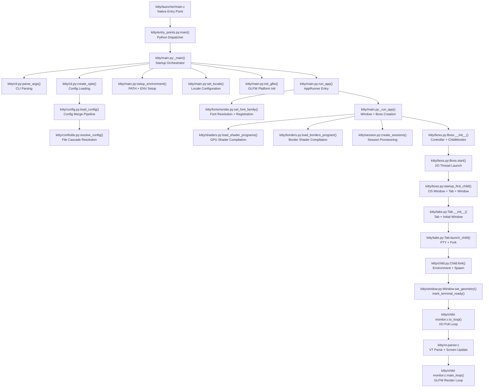

# Technical Specification

# 0. Agent Action Plan

## 0.1 Intent Clarification

### 0.1.1 Core Feature Objective

Based on the prompt, the Blitzy platform understands that the new feature requirement is to **produce a comprehensive investigative Q&A document** that maps and explains the Kitty terminal emulator's startup lifecycle — from process launch to a fully working terminal with shell — using evidence gathered directly from the source code at commit `815df1e21` ("Wire up applying of font config") and, where feasible, from a headless execution attempt via Xvfb.

The specific requirements are:

- **Startup Sequence Mapping** — Identify and document every subsystem that initializes between process launch and the moment the terminal is ready for a shell, including evidence from logs or screen output that each subsystem came online.
- **Configuration Resolution** — Trace how Kitty decides on its initial configuration at first launch, which configuration sources and default settings are consulted, how they affect the visible window, and what runtime output confirms settings were applied.
- **Terminal-to-Shell Handoff** — Explain how Kitty prepares the terminal (PTY, environment, shell integration) to communicate with the child shell, and what concrete behavior demonstrates that the first shell output was correctly received, parsed, and drawn.
- **Display System Evidence** — Catalog the visible evidence (fonts, layout, scrolling, screen updates) and any log or console messages that confirm the GPU rendering pipeline, font subsystem, and display system are active and working correctly.
- **Headless Execution Attempt** — Set up a virtual framebuffer (Xvfb) to attempt a headless launch of Kitty, capturing whatever diagnostic output, logs, or errors the process produces during startup.
- **Read-Only Investigation** — No modifications to any existing repository source files. Temporary scripts or log files created for the investigation must be cleaned up after use.

Implicit requirements detected:

- The investigation must be grounded in the actual source code of the repository, not in assumptions about terminal emulator behavior in general.
- The `--debug-rendering` and `--debug-keyboard` CLI flags available in `kitty/main.py` are relevant diagnostic tools that should be considered.
- The investigation should cover both the Python orchestration layer (`kitty/main.py`, `kitty/boss.py`, `kitty/session.py`) and the native C layer (`kitty/child-monitor.c`, `kitty/child.c`, `kitty/glfw.c`) where applicable.
- The resulting document must be a new Markdown file named `kitty_815df1e210e0.md` placed in the `blitzy/documentation` directory.

### 0.1.2 Special Instructions and Constraints

- **CRITICAL**: Do not modify any existing files in the source repository. The codebase must remain untouched.
- **Document Placement**: The output document must be created at `blitzy/documentation/kitty_815df1e210e0.md` in the destination repository.
- **Evidence-Based Answers**: All answers must be derived from the actual code, with file paths and line references as supporting evidence. No assumptions.
- **Temporary Artifacts**: Any temporary scripts or log files created during the investigation (e.g., Xvfb launch scripts, captured logs) must be cleaned up when finished.
- **Architectural Requirement**: Follow the existing repository conventions — the document must be Markdown and provide thinking/rationale behind the answers.

### 0.1.3 Technical Interpretation

These feature requirements translate to the following technical implementation strategy:

- To **map the startup sequence**, we will trace the call chain from `kitty/entry_points.py:main()` → `kitty/main.py:main()` → `_main()` → `run_app()` → `_run_app()` → `boss.start()` → `boss.startup_first_child()`, documenting each subsystem initialization along the way: signal masking, GLFW init, font family loading, shader compilation, OS window creation, session provisioning, child process forking, and the I/O main loop entry.
- To **trace configuration resolution**, we will analyze the config loading pipeline: `kitty/cli.py:create_opts()` → `kitty/config.py:load_config()` → `kitty/conf/utils.py:resolve_config()` with the system config at `/etc/xdg/kitty/kitty.conf` and user config at `~/.config/kitty/kitty.conf`, plus CLI overrides, and document how the resulting `Options` object drives window size, font selection, color table, and display behavior.
- To **explain terminal-to-shell handoff**, we will document the `Child.fork()` method in `kitty/child.py` which opens a PTY via `openpty()`, prepares the final environment (TERM, COLORTERM, KITTY_PID, TERMINFO, shell integration env vars), spawns the child process via `fast_data_types.spawn()`, and signals readiness via `mark_terminal_ready()` when the first geometry is set on the window.
- To **catalog display system evidence**, we will describe the shader compilation flow in `kitty/shaders.py`, the font data registration in `kitty/fonts/render.py:set_font_family()`, the glyph cache population, the cell/border/graphics shader stages, and the `--debug-rendering` output that timestamps child launch and resize events.
- To **attempt headless execution**, we will create a temporary script that starts Xvfb, sets the DISPLAY variable, and attempts to launch the Kitty binary (if buildable) or describes the expected startup behavior based on code analysis.
- To **produce the output**, we will create a single Markdown file at `blitzy/documentation/kitty_815df1e210e0.md` containing all findings organized by the four questions posed in the user's prompt.

## 0.2 Repository Scope Discovery

### 0.2.1 Comprehensive File Analysis

The investigation requires deep reading and analysis of files across multiple subsystems of the Kitty terminal emulator. The following table catalogs every file and folder that must be examined to answer the user's four questions, organized by the startup phase each file contributes to.

**Phase 1: Process Entry and Bootstrap**

| File | Purpose in Investigation |
|------|------------------------|
| `kitty/launcher/main.c` | Native C launcher entry point; validates descriptors, resolves paths, initializes Python runtime |
| `kitty/launcher/launcher.h` | CLIOptions struct definition shared between launcher and Python |
| `kitty/launcher/single-instance.c` | Single-instance IPC socket mechanism — skippable for fresh launch |
| `kitty/entry_points.py` | Python entry dispatcher; routes to `kitty.main.main()` for GUI mode |
| `__main__.py` | Direct script execution entry; imports `kitty.entry_points.main` |

**Phase 2: Configuration and Environment Setup**

| File | Purpose in Investigation |
|------|------------------------|
| `kitty/main.py` | Central startup orchestrator; contains `_main()`, `run_app`, `init_glfw()`, `setup_environment()`, `set_locale()` |
| `kitty/cli.py` | CLI argument parsing; `create_opts()` loads config from resolved paths; `SYSTEM_CONF` = `/etc/xdg/kitty/kitty.conf` |
| `kitty/config.py` | `load_config()` merges defaults → system conf → user conf → overrides; `finalize_keys()`, `finalize_mouse_mappings()` |
| `kitty/conf/utils.py` | `resolve_config()` determines config file cascade; `load_config()` reads and merges configs; `parse_config_base()` processes lines |
| `kitty/constants.py` | `config_dir`, `defconf` (path to `kitty.conf`), `glfw_path()`, `is_wayland()`, `terminfo_dir`, `shell_path` |
| `kitty/options/types.py` | `Options` named tuple; `defaults` object with all built-in default values |
| `kitty/options/definition.py` | Option schema definitions (all configurable options and their types) |
| `kitty/debug_config.py` | `debug_config()` — produces diagnostic report of applied config, fonts, OpenGL version, environment |

**Phase 3: GLFW/Windowing Initialization**

| File | Purpose in Investigation |
|------|------------------------|
| `kitty/main.py` (lines 90–98) | `init_glfw()` selects platform backend (cocoa/wayland/x11), calls `glfw_init()` |
| `kitty/glfw.c` | Native GLFW binding — wraps GLFW initialization, window creation, event loop |
| `kitty/glfw-wrapper.c` / `kitty/glfw-wrapper.h` | Generated GLFW function wrapper layer |
| `glfw/` (folder) | Vendored GLFW 3.4 fork with X11, Wayland, and Cocoa backends |
| `kitty/os_window_size.py` | `initial_window_size_func()` computes window dimensions from config (cells or pixels), DPI, margins, padding |

**Phase 4: Font and Shader Initialization**

| File | Purpose in Investigation |
|------|------------------------|
| `kitty/fonts/render.py` | `set_font_family()` resolves font files, builds face cache, registers with native renderer via `set_font_data()` |
| `kitty/fonts/common.py` | Platform-neutral font resolution; `get_font_files()` returns medium/bold/italic/bi font map |
| `kitty/fonts/fontconfig.py` | Linux fontconfig backend — family matching, scoring, variable-font normalization |
| `kitty/fonts/box_drawing.py` | Rasterizes box-drawing characters, missing glyph placeholders, underlines, cursors |
| `kitty/shaders.py` | `load_shader_programs()` compiles cell, graphics, bgimage, tint, and border shader programs |
| `kitty/borders.py` | `load_borders_program()` compiles border shader; `init_borders_program()` |
| `kitty/shaders.c` | Native shader compilation and uniform management |
| `kitty/gl.c` / `kitty/gl.h` | OpenGL infrastructure — GLAD loading, shader compilation, VAO/buffer helpers |
| `kitty/cell_vertex.glsl` / `kitty/cell_fragment.glsl` | Cell (text + cursor) rendering shaders |
| `kitty/border_vertex.glsl` / `kitty/border_fragment.glsl` | Border rendering shaders |
| `kitty/graphics_vertex.glsl` / `kitty/graphics_fragment.glsl` | Inline image rendering shaders |
| `kitty/bgimage_vertex.glsl` / `kitty/bgimage_fragment.glsl` | Background image shaders |
| `kitty/tint_vertex.glsl` / `kitty/tint_fragment.glsl` | Tint overlay shaders |
| `kitty/alpha_blend.glsl` / `kitty/linear2srgb.glsl` | Utility shaders for blending and color space |
| `kitty/glyph-cache.c` / `kitty/glyph-cache.h` | GPU texture glyph cache |
| `kitty/freetype.c` | FreeType glyph rasterization |

**Phase 5: Session, Window, and Child Process Creation**

| File | Purpose in Investigation |
|------|------------------------|
| `kitty/session.py` | `create_sessions()` cascade: CLI session → stdin → startup_session → fallback shell; `parse_session()` interprets session directives |
| `kitty/boss.py` | `Boss.__init__()` creates `ChildMonitor`, sets up encryption, clipboard; `Boss.start()` starts I/O thread; `Boss.startup_first_child()` creates OS windows and tabs |
| `kitty/tabs.py` | `TabManager.__init__()` creates tabs from session; `Tab.__init__()` calls `new_window()` or `startup()`; `Tab.launch_child()` forks the child process |
| `kitty/window.py` | `Window.__init__()` creates `Screen` object (24×80 default); `Window.set_geometry()` triggers `mark_terminal_ready()` on first layout |
| `kitty/child.py` | `Child.fork()` opens PTY, prepares env (TERM, COLORTERM, KITTY_PID, TERMINFO, etc.), calls `fast_data_types.spawn()`, `mark_terminal_ready()` closes ready-write fd to unblock child |
| `kitty/shell_integration.py` | `modify_shell_environ()` injects shell-specific startup env vars for bash/zsh/fish integration |

**Phase 6: I/O Loop and Rendering**

| File | Purpose in Investigation |
|------|------------------------|
| `kitty/child-monitor.c` | `io_loop()` — I/O thread polls child PTY fds; `read_bytes()` reads from child; `parse_input()` dispatches to VT parser; `main_loop()` runs GLFW event loop |
| `kitty/vt-parser.c` | VT parser state machine — classifies bytes from child into text, CSI, OSC, DCS sequences |
| `kitty/screen.c` / `kitty/screen.h` | Screen model — cursor movement, text insertion, line buffer management |
| `kitty/state.c` / `kitty/state.h` | Global state management for OS windows, tabs, render data |

**Phase 7: Configuration Sources and Defaults**

| File | Purpose in Investigation |
|------|------------------------|
| `/etc/xdg/kitty/kitty.conf` | System-wide config (first in cascade) |
| `~/.config/kitty/kitty.conf` | User config (second in cascade, `defconf` in `constants.py`) |
| `kitty/options/definition.py` | Built-in defaults for every option (font_size, font_family, colors, etc.) |

### 0.2.2 Web Search Research Conducted

No external web search is required for this investigation. All answers are derived directly from the source code at the specified commit. The codebase contains complete information about:

- The startup sequence (traced through `entry_points.py` → `main.py` → `boss.py` → `tabs.py` → `window.py` → `child.py`)
- Configuration loading (traced through `cli.py` → `config.py` → `conf/utils.py`)
- Shell communication setup (traced through `child.py` → `shell_integration.py`)
- Display system initialization (traced through `shaders.py` → `fonts/render.py` → `borders.py`)

### 0.2.3 New File Requirements

- **New documentation file to create**:
  - `blitzy/documentation/kitty_815df1e210e0.md` — The comprehensive Q&A document answering all four user questions with code evidence, rationale, and log output references

- **Temporary files (to be created and cleaned up)**:
  - Optional Xvfb launch script for headless execution attempt (cleaned up after investigation)
  - Optional captured log output from Kitty startup attempt (cleaned up after investigation)

## 0.3 Dependency Inventory

### 0.3.1 Private and Public Packages

This task is a read-only investigation and documentation exercise. No new dependencies are introduced. The following table catalogs the key packages from the repository's dependency manifests that are relevant to understanding the startup behavior being investigated.

| Registry | Package | Version | Purpose in Startup Investigation |
|----------|---------|---------|----------------------------------|
| PyPI (build) | Python | >=3.8 | Runtime interpreter; `pyproject.toml` specifies `requires-python = ">=3.8"` |
| System | FreeType | System-provided | Font rasterization during startup; loaded by `kitty/freetype.c` |
| System | Fontconfig | System-provided | Linux font discovery; used by `kitty/fontconfig.c` and `kitty/fonts/fontconfig.py` |
| System | HarfBuzz | System-provided | Text shaping; integrated in the font pipeline |
| System | OpenGL (libGL) | System-provided | GPU rendering pipeline; loaded via GLAD in `kitty/gl.c` |
| Vendored | GLFW 3.4 (fork) | Vendored in `glfw/` | Windowing backend (X11/Wayland/Cocoa); initialized by `init_glfw()` in `main.py` |
| Vendored | GLAD | Vendored in `glad/` | OpenGL function loader; generated wrappers in `kitty/gl-wrapper.c` |
| Go module | Go | 1.22 | `go.mod` line 3; builds the `kitten` static binary used for shell integration |
| System | Xvfb | System-provided | Virtual framebuffer for headless X11 execution attempt |
| System | pkg-config | System-provided | Dependency discovery during build; `PKGCONFIG` in `setup.py` |
| Vendored | 3rdparty/ | Various | Vendored C dependencies (e.g., base64, utf8proc) |

### 0.3.2 Dependency Updates

No dependency additions or updates are required for this task. The investigation is read-only and the output is a single new Markdown file. All existing dependencies remain unchanged.

**Import context**: The Q&A document (`kitty_815df1e210e0.md`) will reference the following import chains to explain the startup process, but does not itself import or depend on any packages:

- `kitty.entry_points` → `kitty.main` → `kitty.boss` → `kitty.tabs` → `kitty.child`
- `kitty.cli` → `kitty.config` → `kitty.conf.utils` → `kitty.options.parse`
- `kitty.main` → `kitty.shaders` → `kitty.fast_data_types`
- `kitty.main` → `kitty.fonts.render` → `kitty.fonts.common` → `kitty.fonts.fontconfig`

## 0.4 Integration Analysis

### 0.4.1 Existing Code Touchpoints

Since this task produces a new documentation file and does not modify any source code, the "integration" here refers to the code touchpoints that must be deeply understood to produce accurate answers. The following map documents the integration points between subsystems that the Q&A document must trace and explain.

**Startup Chain Integration Points:**

**Configuration Resolution Integration Points:**

- `kitty/cli.py:create_opts()` (line 1081) calls `load_config()` with resolved config paths
- `kitty/config.py:load_config()` (line 163) delegates to `kitty/conf/utils.py:_load_config()` (line 332)
- `kitty/conf/utils.py:resolve_config()` (line 322) yields system conf first, then user conf or CLI-specified configs
- The `Options` object is pushed to native C via `set_options()` in `kitty/main.py` line 249
- Font selection is driven by `opts.font_family`, `opts.font_size`, `opts.bold_font`, etc.
- Window size is driven by `opts.initial_window_width`, `opts.initial_window_height`, `opts.remember_window_size`
- Color table is driven by `opts.color_table` (256-entry ANSI color array)

**Terminal-to-Shell Integration Points:**

- `kitty/child.py:Child.get_final_env()` (line 233) builds the complete child environment:
  - Sets `TERM` from `opts.term`
  - Sets `COLORTERM` to `truecolor`
  - Sets `KITTY_PID`, `KITTY_PUBLIC_KEY`, `KITTY_LISTEN_ON`
  - Sets `TERMINFO` based on `opts.terminfo_type` (path or direct)
  - Calls `kitty/shell_integration.py:modify_shell_environ()` for bash/zsh/fish integration
- `kitty/child.py:Child.fork()` (line 276) opens PTY, creates sync pipes, calls `fast_data_types.spawn()`
- `kitty/window.py:Window.set_geometry()` (line 850) calls `child.mark_terminal_ready()` on first layout, closing the ready-write fd to unblock the child process
- The I/O thread in `kitty/child-monitor.c:io_loop()` (line 1480) polls child PTY fds, reads bytes, feeds them to the VT parser

### 0.4.2 Database/Schema Updates

Not applicable. This task produces a documentation file only; no database or schema changes are involved.

### 0.4.3 Key Subsystem Interactions to Document

The Q&A document must explain the following critical handoff moments:

- **GLFW → OpenGL**: `glfw_init()` loads the platform-specific GLFW module (`x11`, `wayland`, or `cocoa`) and creates the OpenGL context before any shader compilation can occur
- **Options → Fonts**: `set_options()` pushes the `Options` object to C, then `set_font_family()` reads font configuration from the options to resolve and register font faces
- **Shader Compilation → Window Creation**: `load_all_shaders()` is passed as a callback to `create_os_window()` and executes during window creation when the OpenGL context is current
- **Window Geometry → Child Launch**: `Window.set_geometry()` triggers `mark_terminal_ready()` which closes the synchronization pipe, allowing the blocked child process to begin execution
- **Child Output → VT Parse → Render**: Bytes from the child PTY flow through `io_loop()` → `read_bytes()` → VT parser → screen model → render flag → main loop render cycle

## 0.5 Technical Implementation

### 0.5.1 File-by-File Execution Plan

This task produces exactly one new file. No existing files are modified.

**Group 1 — Output Document:**

- **CREATE**: `blitzy/documentation/kitty_815df1e210e0.md`
  - Comprehensive Q&A document answering all four user questions
  - Structured with clear sections for each question
  - Code evidence with file paths and line numbers
  - Rationale and reasoning for each answer
  - Log output references from `--debug-rendering` and Xvfb attempts

**Group 2 — Temporary Investigation Artifacts (created and cleaned up):**

- **CREATE/DELETE**: Temporary Xvfb launch script
  - Starts Xvfb on a virtual display (e.g., `:99`)
  - Sets `DISPLAY=:99`
  - Attempts to invoke the Kitty binary or Python entry point
  - Captures stdout/stderr output
  - Cleans up Xvfb process and script after use

### 0.5.2 Implementation Approach

The implementation follows a structured investigation workflow:

**Step 1 — Establish investigation foundation by tracing the startup call chain:**
- Read `kitty/entry_points.py:main()` to identify the dispatch path to `kitty/main.py:main()`
- Read `kitty/main.py:_main()` line by line (lines 441–521) to document each initialization step in order
- Read `kitty/main.py:run_app()` (the `AppRunner.__call__` at lines 247–254) for font and option setup
- Read `kitty/main.py:_run_app()` (lines 202–236) for window creation, Boss setup, and main loop entry

**Step 2 — Trace configuration resolution by following the config loading pipeline:**
- Document the cascade in `kitty/conf/utils.py:resolve_config()`: `/etc/xdg/kitty/kitty.conf` → `~/.config/kitty/kitty.conf`
- Document how `kitty/config.py:load_config()` merges defaults from `kitty/options/types.py:defaults` with each config file
- Document how `kitty/cli.py:create_opts()` applies CLI overrides
- Document how the final `Options` object is pushed to native C via `set_options()` and drives all subsequent initialization

**Step 3 — Document terminal-to-shell handoff by tracing child process creation:**
- Follow `kitty/tabs.py:Tab.launch_child()` → `kitty/child.py:Child.__init__()` → `Child.fork()`
- Document PTY allocation via `openpty()` at `child.py` line 281
- Document environment preparation in `Child.get_final_env()` (lines 233–274)
- Document the ready-pipe synchronization mechanism: `ready_read_fd`/`ready_write_fd` created at line 283, child blocks on `ready_read_fd`, terminal closes `ready_write_fd` via `mark_terminal_ready()` at `window.py` line 866
- Document shell integration injection via `kitty/shell_integration.py:modify_shell_environ()`

**Step 4 — Catalog display system evidence by examining rendering initialization:**
- Document shader compilation in `kitty/shaders.py:LoadShaderPrograms.__call__()` — cell (4 variants), graphics (3 variants), bgimage, tint programs
- Document border shader compilation in `kitty/borders.py:load_borders_program()`
- Document font data registration in `kitty/fonts/render.py:set_font_family()` — face resolution, symbol map creation, `set_font_data()` call
- Document the `--debug-rendering` output at `kitty/window.py` lines 869–873 which timestamps child launch and SIGWINCH events
- Document the glyph cache system in `kitty/glyph-cache.c` and its role in GPU texture upload

**Step 5 — Attempt headless execution and capture output:**
- Create a temporary script that starts Xvfb and attempts to launch Kitty
- Capture any startup log output, error messages, or diagnostic information
- Document what was observed (or explain why the build could not complete in the current environment)
- Clean up all temporary files

**Step 6 — Compile findings into the output document:**
- Write `blitzy/documentation/kitty_815df1e210e0.md` with all findings
- Organize by the four questions posed in the user's prompt
- Include file path citations for every claim

### 0.5.3 Key Startup Evidence Points to Document

The Q&A document must address these specific observable behaviors from the code:

| Evidence Point | Source File | Lines | Observable Behavior |
|----------------|------------|-------|---------------------|
| GLFW initialization success/failure | `kitty/main.py` | 90–92 | `glfw_init()` returns bool; failure raises `SystemExit('GLFW initialization failed')` |
| Platform backend selection | `kitty/main.py` | 96 | `glfw_module` set to `'cocoa'`, `'wayland'`, or `'x11'` based on platform detection |
| Font family resolution | `kitty/fonts/render.py` | 173–193 | `set_font_family()` calls `get_font_files()` to resolve medium/bold/italic/bi faces |
| Shader compilation errors | `kitty/shaders.py` | 87–104 | `CompileError` raised with filename-mapped error messages if compilation fails |
| OS window creation | `kitty/main.py` | 221–225 | `create_os_window()` called with size function, callbacks, title, class, state |
| Child process spawn | `kitty/child.py` | 333–335 | `fast_data_types.spawn()` called with final_exe, cwd, argv, env, master/slave fds |
| Terminal ready signal | `kitty/window.py` | 866–867 | `child.mark_terminal_ready()` called, `child_is_launched` set to `True` |
| Debug rendering timestamp | `kitty/window.py` | 870–871 | `[{now:.3f}] Child launched` printed to stderr when `--debug-rendering` is active |
| I/O thread start | `kitty/child-monitor.c` | 1489 | Thread named `"KittyChildMon"` via `set_thread_name()` |
| Child data polling | `kitty/child-monitor.c` | 1512 | `poll()` on child fds with `POLLIN` events for data, `POLLOUT` for writes |
| Config paths logged | `kitty/debug_config.py` | 269–271 | Loaded config files listed by `debug_config()` |
| OpenGL version logged | `kitty/debug_config.py` | 258 | `opengl_version_string()` called to report GL version |
| Active fonts logged | `kitty/debug_config.py` | 260–263 | `current_fonts()` returns medium/bold/italic/bi font objects with `identify_for_debug()` |

## 0.6 Scope Boundaries

### 0.6.1 Exhaustively In Scope

**Output Document:**
- `blitzy/documentation/kitty_815df1e210e0.md` — the sole deliverable

**Source Files to Analyze (read-only, not modified):**

- Startup orchestration: `kitty/main.py`, `kitty/entry_points.py`, `__main__.py`
- Configuration pipeline: `kitty/cli.py`, `kitty/config.py`, `kitty/conf/utils.py`, `kitty/constants.py`
- Options and defaults: `kitty/options/types.py`, `kitty/options/definition.py`, `kitty/options/parse.py`
- Boss controller: `kitty/boss.py` (lines 323–400 for init, 1181–1199 for start)
- Session management: `kitty/session.py`
- Tab and window management: `kitty/tabs.py`, `kitty/window.py`, `kitty/window_list.py`
- Child process management: `kitty/child.py`, `kitty/child-monitor.c`
- Shell integration: `kitty/shell_integration.py`
- Font subsystem: `kitty/fonts/render.py`, `kitty/fonts/common.py`, `kitty/fonts/fontconfig.py`, `kitty/fonts/box_drawing.py`
- Shader subsystem: `kitty/shaders.py`, `kitty/borders.py`, `kitty/shaders.c`
- GLSL shaders: `kitty/cell_*.glsl`, `kitty/border_*.glsl`, `kitty/graphics_*.glsl`, `kitty/bgimage_*.glsl`, `kitty/tint_*.glsl`, `kitty/alpha_blend.glsl`, `kitty/linear2srgb.glsl`
- Rendering infrastructure: `kitty/gl.c`, `kitty/gl-wrapper.c`, `kitty/glyph-cache.c`, `kitty/freetype.c`
- VT parser: `kitty/vt-parser.c`, `kitty/screen.c`, `kitty/screen.h`
- State management: `kitty/state.c`, `kitty/state.h`
- Native launcher: `kitty/launcher/main.c`, `kitty/launcher/launcher.h`, `kitty/launcher/single-instance.c`
- GLFW windowing: `kitty/glfw.c`, `kitty/glfw-wrapper.c`, `glfw/` (vendored GLFW)
- Diagnostic tools: `kitty/debug_config.py`
- OS window sizing: `kitty/os_window_size.py`
- Build system (for understanding compilation): `setup.py`, `pyproject.toml`, `Makefile`

**Investigation Activities:**
- Xvfb headless execution attempt with Kitty
- Capture and analysis of startup log output
- Cleanup of all temporary artifacts

### 0.6.2 Explicitly Out of Scope

- **No source file modifications**: No changes to any `.py`, `.c`, `.h`, `.glsl`, `.m`, or any other existing file
- **No new feature code**: No new Python modules, C extensions, or build targets
- **No kittens analysis**: The built-in kittens (`kittens/` directory) are not part of the startup sequence under investigation
- **No remote control analysis**: The `kitty/rc/` directory of remote control commands is not part of initial startup
- **No macOS-specific analysis**: Since the execution environment is Linux, `kitty/cocoa_window.m`, `kitty/core_text.m`, and the Cocoa GLFW backend are not investigated
- **No performance optimization**: This is a documentation task, not a performance investigation
- **No test modifications**: The `kitty_tests/` directory is not modified or extended
- **No Go tooling analysis**: The `tools/` directory and Go-based `kitten` binary are not part of the core Python/C startup sequence (though `kitten_exe()` is referenced during environment setup)
- **No documentation infrastructure changes**: The `docs/` Sphinx documentation tree is not modified
- **No CI/CD changes**: The `.github/` workflows are not modified
- **No shell-integration script changes**: The `shell-integration/` directory scripts are referenced but not modified

## 0.7 Rules for Feature Addition

### 0.7.1 User-Specified Rules

The following rules are explicitly emphasized by the user and must be strictly observed:

- **SWE-AtlasQnA-Repo Rule**: Create a new markdown document named `kitty_815df1e210e0.md` (matching the source branch name) that comprehensively answers the questions posed in the prompt.
  - Provide thinking/rationale behind the answers
  - Do not make assumptions; base answers on the code as the truth
  - Do not modify any existing files in the source repository
  - Do not add any other code in the source repository besides the requested document
  - Place the generated document in the `blitzy/documentation` directory

- **Read-Only Source Policy**: Do not modify any of the repository source files while investigating. This applies to all files in `kitty/`, `kittens/`, `glfw/`, `tools/`, `shell-integration/`, `docs/`, `kitty_tests/`, `3rdparty/`, `glad/`, `logo/`, `gen/`, `bypy/`, `.github/`, and all root-level files.

- **Temporary Artifact Policy**: Temporary scripts or logs may be created if needed for the investigation (e.g., Xvfb launch scripts, captured output) but must be cleaned up when finished. No temporary artifacts should remain in the repository after the task is complete.

- **Evidence-Based Documentation**: All claims in the Q&A document must be traceable to specific files and line numbers in the codebase. No general assumptions about "how terminal emulators typically work" should substitute for actual code evidence.

### 0.7.2 Investigation-Specific Conventions

- **File Reference Format**: When citing source code in the Q&A document, use the format `file/path.py` (line N) or `file/path.py` (lines N–M) for ranges.
- **Code Snippets**: Short code snippets (2–3 lines) may be included in the document to illustrate key logic, but should not reproduce large sections of the codebase.
- **Startup Ordering**: The Q&A document should present the startup sequence in the exact order it occurs in the code, not in a reorganized thematic order, so readers can follow the actual execution flow.
- **Conditional Paths**: Where the startup behavior branches based on platform (macOS vs Linux vs Wayland), the document should clearly identify which branch applies to the investigation environment (Linux/X11) while noting the existence of other branches.

## 0.8 References

### 0.8.1 Repository Files and Folders Searched

The following files and folders were systematically searched and analyzed across the codebase to derive the conclusions in this Agent Action Plan:

**Root-Level Files Examined:**
- `pyproject.toml` — Python version requirement (`>=3.8`), mypy and ruff configuration
- `setup.py` — Build system; compiler flags, version extraction, extension compilation
- `__main__.py` — Direct script execution entry point
- `go.mod` — Go module definition (Go 1.22)
- `Makefile` — Build targets and developer commands

**Core Application Files (kitty/):**
- `kitty/entry_points.py` — Entry point dispatcher; `main()` function, namespaced commands
- `kitty/main.py` — Complete startup orchestrator; `_main()`, `run_app`, `_run_app`, `init_glfw()`, `setup_environment()`, `set_locale()`, `load_all_shaders()`
- `kitty/boss.py` — Boss controller; `__init__()` (lines 325–381), `start()` (lines 1181–1199), `startup_first_child()` (lines 383–400), `add_os_window()` (lines 402–430)
- `kitty/config.py` — Config loading pipeline; `load_config()`, `finalize_keys()`, `finalize_mouse_mappings()`, `cached_values_for()`
- `kitty/cli.py` — CLI parsing; `parse_args()`, `create_opts()`, `default_config_paths()`, `SYSTEM_CONF`
- `kitty/conf/utils.py` — Config utilities; `resolve_config()`, `load_config()`, `parse_config_base()`
- `kitty/constants.py` — Constants; `config_dir`, `defconf`, `glfw_path()`, `is_wayland()`, `terminfo_dir`, `shell_path`, `kitty_exe()`
- `kitty/session.py` — Session management; `create_sessions()`, `parse_session()`, `get_os_window_sizing_data()`
- `kitty/tabs.py` — Tab/window management; `TabManager.__init__()`, `Tab.__init__()`, `Tab.launch_child()`, `Tab.new_window()`, `SpecialWindow()`
- `kitty/window.py` — Window lifecycle; `Window.__init__()`, `Window.set_geometry()`, `mark_terminal_ready()` trigger
- `kitty/child.py` — Child process management; `Child.__init__()`, `Child.fork()`, `Child.get_final_env()`, `openpty()`, `mark_terminal_ready()`
- `kitty/shell_integration.py` — Shell integration; `modify_shell_environ()`, `setup_bash_env()`, `setup_zsh_env()`, `setup_fish_env()`
- `kitty/shaders.py` — Shader management; `LoadShaderPrograms.__call__()`, `Program` class, `compile_program()` invocations
- `kitty/borders.py` — Border rendering; `load_borders_program()`, `init_borders_program()`
- `kitty/debug_config.py` — Diagnostic reporting; `debug_config()`, `IssueData`, `compare_opts()`
- `kitty/os_window_size.py` — Window sizing; `initial_window_size_func()`, `edge_spacing()`, `WindowSizeData`
- `kitty/child-monitor.c` — I/O thread; `io_loop()`, `main_loop()`, `add_children()`, `parse_input()`, `read_bytes()`

**Font Subsystem (kitty/fonts/):**
- `kitty/fonts/__init__.py` — Font type definitions and metadata structures
- `kitty/fonts/render.py` — `set_font_family()`, `dump_font_debug()`, font data registration
- `kitty/fonts/common.py` — Platform-neutral font resolution; `get_font_files()`
- `kitty/fonts/fontconfig.py` — Linux fontconfig backend
- `kitty/fonts/box_drawing.py` — Box-drawing glyph rasterization

**Native Launcher (kitty/launcher/):**
- `kitty/launcher/main.c` — Native entry point, Python bootstrap
- `kitty/launcher/launcher.h` — CLIOptions struct definition
- `kitty/launcher/single-instance.c` — Single-instance IPC mechanism

**Shader Source Files (kitty/):**
- `kitty/cell_vertex.glsl`, `kitty/cell_fragment.glsl` — Cell (text + cursor) shaders
- `kitty/border_vertex.glsl`, `kitty/border_fragment.glsl` — Border shaders
- `kitty/graphics_vertex.glsl`, `kitty/graphics_fragment.glsl` — Graphics protocol shaders
- `kitty/bgimage_vertex.glsl`, `kitty/bgimage_fragment.glsl` — Background image shaders
- `kitty/tint_vertex.glsl`, `kitty/tint_fragment.glsl` — Tint overlay shaders
- `kitty/alpha_blend.glsl`, `kitty/linear2srgb.glsl` — Utility shaders

**Test Directory (examined but not modified):**
- `kitty_tests/` — Noted test infrastructure including font test files (`.otf`, `.ttf`)

**Technical Specification Sections Retrieved:**
- Section 4.2 — APPLICATION STARTUP FLOW (launcher bootstrap, single-instance, Python bootstrap and Boss init)
- Section 4.3 — TERMINAL INPUT/OUTPUT PIPELINE (input processing, VT parser, GPU rendering pipeline)
- Section 4.4 — CONFIGURATION MANAGEMENT FLOW (config loading, live reload, validation)
- Section 4.5 — WINDOW AND TAB LIFECYCLE (session creation, child process launch, window state transitions)
- Section 4.7 — SHELL INTEGRATION FLOW (shell environment setup, SSH bootstrap)
- Section 3.1 — Programming Languages (C11, Python >=3.8, Go 1.22, GLSL, Objective-C)

### 0.8.2 Attachments

No attachments were provided for this project. No Figma URLs or design files are referenced.

### 0.8.3 External References

- Repository branch: `kitty_815df1e210e0`
- Head commit: `815df1e21` — "Wire up applying of font config"
- Repository root: Kitty terminal emulator (GPLv3, by Kovid Goyal)
- Python minimum version: `>=3.8` (from `pyproject.toml`)
- Go version: `1.22` (from `go.mod`)

