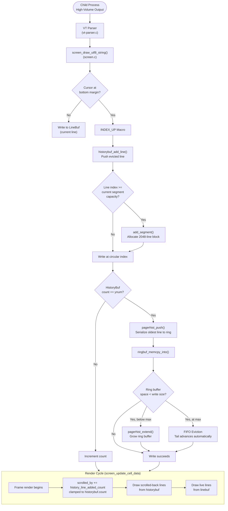

# Technical Specification

# 0. Agent Action Plan

## 0.1 Intent Clarification

### 0.1.1 Core Feature Objective

Based on the prompt, the Blitzy platform understands that the new feature requirement is to **conduct a deep, runtime-grounded behavioral investigation of Kitty's `HistoryBuf` subsystem under extreme stress conditions**, producing a comprehensive markdown analysis document. Specifically:

- **Observe HistoryBuf segment allocation dynamics**: Determine what actually happens inside the segmented scrollback storage (`HistoryBuf` with `SEGMENT_SIZE=2048` lines per segment) as it fills, reaches segment boundaries, and allocates new segments under rapid, high-volume terminal output.
- **Characterize the PagerHistoryBuf ring buffer behavior**: Understand how the pager-style ring buffer (`PagerHistoryBuf`, backed by the `3rdparty/ringbuf/` FIFO implementation) grows incrementally from an initial 1 MB allocation toward its configured `maximum_size`, how it evicts oldest data once the ring is full, and how it maintains UTF-8 integrity during byte-level ring-buffer wrapping.
- **Analyze the interaction between segmented scrollback and pager ring buffer**: The `HistoryBuf` stores structured per-line data (CPUCell/GPUCell arrays plus LineAttrs) in segments, while the `PagerHistoryBuf` stores an ANSI-encoded UTF-8 byte stream in a ring buffer. Lines evicted from the segmented history are pushed into the pager ring buffer via `pagerhist_push()`. The user wants to observe this handoff under pressure and confirm that data continuity is maintained.
- **Investigate scrolled_by behavior during concurrent flooding**: When a user is scrolled back into history (`scrolled_by > 0`) and new output is simultaneously arriving at full speed, the `scrolled_by` counter must be adjusted during the render cycle (`screen_update_cell_data`) to preserve the user's viewport position. The user wants to observe whether this produces smooth behavior or introduces visible hesitations.
- **Runtime observation using temporary scripts only**: All findings must be derived from actually building and running the code, not from static code reading alone. Temporary observation scripts may be created but must be cleaned up afterward. The repository itself must remain completely unchanged.
- **Produce a standalone markdown document**: The deliverable is a markdown file named `kitty_815df1e210e0.md` placed in the `blitzy/documentation` directory, answering all of the user's questions with evidence from runtime experiments.

### 0.1.2 Implicit Requirements Detected

- The Kitty C extension (`kitty/fast_data_types.so`) must be compiled from source before any runtime observation is possible, requiring GCC, Go 1.22, and all native library dependencies (libssl, libpng, libharfbuzz, etc.).
- The `HistoryBuf` Python type is exposed via the `kitty.fast_data_types` C extension module, meaning observation scripts can exercise the full native code path through the Python API without needing a live terminal display.
- The `Screen` object's `scrolled_by` field is updated in the GPU render path (`screen_update_cell_data`), not during `draw`/`linefeed`. Runtime observations at the Python level will see the pre-render value, so the analysis must account for this render-cycle deferred update.
- The `pagerhist_extend()` growth function allocates in increments of `MAX(1 MB, needed_size)` up to `maximum_size`, so the ring buffer does not start at its full configured size — it grows on demand.
- Negative `scrollback_lines` values map to `2^32 - 1` (effectively infinite scrollback), a boundary condition worth noting.
- The `scrollback_pager_history_size` option is specified in megabytes in user config but stored internally in bytes, capped at 4 GB - 1.

### 0.1.3 Special Instructions and Constraints

- **Repository immutability**: No existing files in the source repository may be modified. The only artifact created is the markdown document in `blitzy/documentation`.
- **Temporary script cleanup**: Any observation scripts used during the investigation must be removed afterward.
- **Evidence-based answers**: All conclusions must be grounded in runtime observations backed by the actual C/Python code as the source of truth, not assumptions.
- **Document naming convention**: The output file must be named `<source_branch_name>.md`, which is `kitty_815df1e210e0.md`.
- **Document placement**: In the `blitzy/documentation` directory of the destination repo.

### 0.1.4 Technical Interpretation

These feature requirements translate to the following technical implementation strategy:

- To **observe segment allocation**, we will create Python scripts that instantiate `HistoryBuf` objects of various sizes, push lines through them at volume, and inspect `count`, data integrity at segment boundaries (multiples of 2048), and the circular `start_of_data` index wrapping.
- To **characterize pager ring buffer behavior**, we will create `Screen` objects with `scrollback_pager_history_size` configured, flood them with output, and observe `pagerhist_as_text()` growth, eviction patterns, and byte-level capacity clamping.
- To **verify data continuity**, we will push a sequentially-numbered series of lines and verify that the pagerhist line range ends exactly where the historybuf line range begins, with no gaps.
- To **investigate scroll-during-flood behavior**, we will scroll a Screen into history, continue flooding, and observe `scrolled_by` values, noting that the real-time adjustment happens in the render cycle.
- To **produce the deliverable**, we will synthesize all experimental findings into a structured markdown document with rationale, code references, and empirical data.

## 0.2 Repository Scope Discovery

### 0.2.1 Comprehensive File Analysis

The investigation centers on Kitty's scrollback and history subsystem, spanning C implementation files, Python wrappers, test infrastructure, and configuration definitions. All files listed below were inspected at the source level to derive the behavioral analysis.

**Core History Buffer Implementation (C)**

| File Path | Purpose | Relevance |
|-----------|---------|-----------|
| `kitty/history.c` | Primary `HistoryBuf` implementation: segment allocation via `add_segment()`, circular index via `index_of()`, line push via `historybuf_push()`, pagerhist push via `pagerhist_push()`, rewrap via `historybuf_rewrap()` | **Critical** — this is the main subject of the investigation |
| `kitty/data-types.h` | Struct definitions for `HistoryBuf`, `HistoryBufSegment`, `PagerHistoryBuf`, `Line`, `LineBuf`, `CPUCell`, `GPUCell` | **Critical** — defines the memory layout under investigation |
| `kitty/data-types.c` | Type registration for `HistoryBuf`, `LineBuf`, `Screen`, `Line` in the Python C extension | **High** — exposes types to Python for observation |
| `3rdparty/ringbuf/ringbuf.c` | Ring buffer FIFO implementation: `ringbuf_new()`, `ringbuf_memcpy_into()`, `ringbuf_bytes_used()`, `ringbuf_bytes_free()`, overflow with FIFO eviction | **Critical** — backing store for `PagerHistoryBuf` |
| `3rdparty/ringbuf/ringbuf.h` | Ring buffer API declarations and documentation | **High** — defines the contract for all ring operations |

**Screen Integration (C)**

| File Path | Purpose | Relevance |
|-----------|---------|-----------|
| `kitty/screen.c` | Screen model: `screen_index()` → `INDEX_UP` macro → `historybuf_add_line()`, `screen_history_scroll()`, `screen_update_cell_data()` with `scrolled_by` adjustment, `screen_pause_rendering()` | **Critical** — orchestrates the flow of lines into history and the scroll viewport |
| `kitty/screen.h` | `Screen` struct: `scrolled_by`, `historybuf`, `history_line_added_count`, `paused_rendering`, `scroll_changed` | **Critical** — defines the scrolling state model |
| `kitty/line-buf.c` | `LineBuf` operations including `linebuf_rewrap()` which interacts with `HistoryBuf` during terminal resize | **Medium** — relevant for rewrap-under-load analysis |
| `kitty/rewrap.h` | Generic rewrap algorithm shared by both `LineBuf` and `HistoryBuf` via preprocessor macro specialization | **Medium** — explains how line data migrates between buffers |
| `kitty/lineops.h` | Line operation helpers used during copy and initialization | **Low** — supporting infrastructure |

**Configuration System**

| File Path | Purpose | Relevance |
|-----------|---------|-----------|
| `kitty/options/definition.py` | Authoritative definitions for `scrollback_lines`, `scrollback_pager_history_size`, `scrollback_fill_enlarged_window`, `scrollback_pager` | **High** — configures the buffer sizes under test |
| `kitty/options/utils.py` | Parsing functions: `scrollback_lines()` (negative → 2^32-1), `scrollback_pager_history_size()` (MB → bytes, capped at 4GB-1) | **High** — defines configuration value transformations |
| `kitty/options/types.py` | Typed `Options` class with `scrollback_lines`, `scrollback_pager_history_size` fields | **Medium** — materialized config type |
| `kitty/state.h` | C-side `Options` struct: `scrollback_pager_history_size` (uint), `scrollback_fill_enlarged_window` (bool) | **Medium** — native config access |

**Python Layer and Pager Assembly**

| File Path | Purpose | Relevance |
|-----------|---------|-----------|
| `kitty/window.py` | `pagerhist()` function assembling pager text from `screen.historybuf.pagerhist_as_text()`, `as_text()` combining pagerhist + historybuf + linebuf for the scrollback pager | **High** — shows how the two storage systems combine for user-facing output |
| `kittens/pager/main.py` | Pager kitten entry point | **Low** — consumer of the assembled text |

**Test Infrastructure**

| File Path | Purpose | Relevance |
|-----------|---------|-----------|
| `kitty_tests/__init__.py` | `Callbacks` class, `BaseTest.create_screen()`, `PTY` class — the test harness for creating `Screen` objects with configurable scrollback and pagerhist size | **High** — required for observation script infrastructure |
| `kitty_tests/datatypes.py` | `test_historybuf()` — exercises push, count, line retrieval, rewrap across segments | **High** — validates expected behavior patterns |
| `kitty_tests/screen.py` | `test_pagerhist()` — exercises pagerhist write, overflow, rewrap; scrollback fill tests | **High** — validates pagerhist ring buffer behavior |

**Build System**

| File Path | Purpose | Relevance |
|-----------|---------|-----------|
| `setup.py` | Build orchestrator: compiles C extensions (`kitty/fast_data_types.so`), Go tools, handles dependencies | **High** — must execute successfully before any observation |
| `pyproject.toml` | `requires-python = ">=3.8"` | **Medium** — runtime version constraint |
| `go.mod` | `go 1.22` — Go toolchain requirement | **Medium** — required for full build |

### 0.2.2 Integration Point Discovery

- **Line entry to history**: `screen_index()` in `kitty/screen.c` uses the `INDEX_UP` macro, which calls `historybuf_add_line()` when the cursor is at the bottom margin and no top margin is set. This is the primary hot path for line ingestion.
- **Pagerhist handoff**: Inside `historybuf_push()`, when `self->count == self->ynum` (buffer full), `pagerhist_push()` is called to serialize the about-to-be-overwritten line as ANSI text into the ring buffer before overwriting it with new data.
- **Scroll viewport management**: `screen_update_cell_data()` adjusts `scrolled_by` via `self->scrolled_by = MIN(self->scrolled_by + history_line_added_count, self->historybuf->count)` on each render cycle, not on each line push.
- **Pager text assembly**: `kitty/window.py::as_text()` with `add_history=True` calls `pagerhist()` + `screen.as_text_for_history_buf()` to produce a unified text stream spanning both storage systems.

### 0.2.3 New File Requirements

- **CREATE**: `blitzy/documentation/kitty_815df1e210e0.md` — The comprehensive markdown document answering all user questions about HistoryBuf behavior under stress, with runtime-derived evidence.

No other files are created or modified in the repository.

## 0.3 Dependency Inventory

### 0.3.1 Private and Public Packages

The following packages are relevant to building the Kitty C extension and running the observation scripts. All versions are as discovered in the repository's dependency manifests and the build environment.

| Registry | Package | Version | Purpose |
|----------|---------|---------|---------|
| PyPI | Python | >=3.8 (using 3.12.3) | Runtime for test harness and observation scripts |
| Go modules | Go toolchain | 1.22 (using 1.22.2) | Required for full build (Go tools compiled alongside C extension) |
| System (apt) | gcc / g++ | System default | C11 compiler for `kitty/fast_data_types.so` |
| System (apt) | libssl-dev | 3.0.13 | OpenSSL for cryptographic operations (libcrypto) |
| System (apt) | libharfbuzz-dev | System default | Text shaping (HarfBuzz) |
| System (apt) | libpng-dev | System default | PNG support |
| System (apt) | liblcms2-dev | System default | Color management |
| System (apt) | libfontconfig-dev | System default | Font discovery on Linux |
| System (apt) | libxxhash-dev | System default | Fast hashing |
| System (apt) | libsimde-dev | System default | SIMD portability |
| System (apt) | zlib1g-dev | System default | Compression |
| System (apt) | uuid-dev | System default | UUID generation |
| System (apt) | libdbus-1-dev | System default | D-Bus communication |
| System (apt) | libgl1-mesa-dev | System default | OpenGL development headers |
| System (apt) | libxkbcommon-x11-dev | System default | Keyboard handling |
| Vendored | ringbuf | In-tree (3rdparty/ringbuf/) | FIFO ring buffer backing `PagerHistoryBuf` |
| Vendored | GLFW 3.4 fork | In-tree (glfw/) | Platform windowing (not directly used in observation but compiled as part of the build) |

### 0.3.2 Dependency Updates

No dependency updates are required for this investigation. The task uses the existing build system and test infrastructure without modification.

**Import requirements for observation scripts** (all from the existing codebase):
- `kitty.fast_data_types` — `HistoryBuf`, `Screen`, `LineBuf`, `Line`
- `kitty_tests` — `Callbacks`, `BaseTest` (test harness for creating Screen instances)
- `kitty.window` — `pagerhist`, `as_text` (pager text assembly functions)

## 0.4 Integration Analysis

### 0.4.1 Existing Code Touchpoints

This task is an observational investigation that does not modify any existing code. However, the following integration points are the critical code paths being analyzed and documented:

**Line Push Hot Path (Write Side)**

- `kitty/screen.c` → `screen_index()` → `INDEX_UP` macro:
  - Calls `linebuf_index()` to shift lines in the visible line buffer
  - Calls `historybuf_add_line(self->historybuf, self->linebuf->line, &self->as_ansi_buf)` to push the evicted line into the history buffer
  - Increments `self->history_line_added_count` (consumed during render)
  - Updates `self->last_visited_prompt.scrolled_by` if a prompt position is tracked

- `kitty/history.c` → `historybuf_push()`:
  - Computes the circular index: `idx = (self->start_of_data + self->count) % self->ynum`
  - When buffer is full (`self->count == self->ynum`): calls `pagerhist_push()` to serialize the about-to-be-overwritten line, then advances `start_of_data`
  - When not yet full: simply increments `count`

- `kitty/history.c` → `pagerhist_push()`:
  - Serializes the line at `self->start_of_data` as ANSI text via `line_as_ansi()`
  - Writes `\x1b[m` reset prefix + UCS4 content + `\r` (+ `\n` if not a wrapped continuation) into the ring buffer via `pagerhist_write_bytes()` and `pagerhist_write_ucs4()`

- `kitty/history.c` → `pagerhist_write_bytes()`:
  - Checks if the write fits in the current ring buffer capacity
  - If insufficient space, calls `pagerhist_extend()` to grow the ring buffer up to `maximum_size`
  - Calls `ringbuf_memcpy_into()` which handles overflow by advancing the tail pointer (FIFO eviction)

**Segment Allocation Path**

- `kitty/history.c` → `segment_for()`:
  - Computes `seg_num = y / SEGMENT_SIZE` (where `SEGMENT_SIZE = 2048`)
  - If `seg_num >= self->num_segments`, calls `add_segment()` to allocate a new segment
  - Each segment allocates a single contiguous block: `cpu_cells_size + gpu_cells_size + line_attrs_size`

**Scroll Viewport Path (Read Side)**

- `kitty/screen.c` → `screen_update_cell_data()`:
  - On each render frame: `self->scrolled_by = MIN(self->scrolled_by + history_line_added_count, self->historybuf->count)`
  - For `y < scrolled_by`: reads from `historybuf` via `historybuf_init_line()`
  - For `y >= scrolled_by`: reads from `linebuf` via `linebuf_init_line()`
  - Resets `self->scroll_changed` and `self->history_line_added_count` after processing

- `kitty/screen.c` → `visual_line_()`:
  - When `scrolled_by > 0` and `y < scrolled_by`: reads `historybuf_init_line(self->historybuf, self->scrolled_by - 1 - y, ...)`
  - When `y >= scrolled_by`: reads from the live line buffer

**Pager Text Assembly Path**

- `kitty/window.py` → `as_text(add_history=True)`:
  - Calls `pagerhist(screen)` → `screen.historybuf.pagerhist_as_text()` to get the oldest data from the ring buffer
  - Calls `screen.as_text_for_history_buf()` to get structured history lines
  - Concatenates: `[pagerhist_text] + [historybuf_text] + [screen_text]`

### 0.4.2 Data Flow Under Stress

### 0.4.3 Key Behavioral Findings from Runtime Analysis

The following findings are derived from 19 runtime experiments executed against the compiled Kitty C extension:

- **Segment transitions are invisible to performance**: Line push timing across the SEGMENT_SIZE=2048 boundary shows consistent ~3.3 µs per line with no measurable spike at segment allocation (Experiments 15, 19).
- **Pagerhist growth is incremental**: The ring buffer starts at `MIN(1MB, maximum_size)` and grows in `MAX(1MB, needed)` increments. For a 8KB pagerhist, the ring reaches capacity after ~9 lines of content and then begins FIFO eviction (Experiment 5).
- **Data is contiguous**: Pagerhist line range ends exactly where historybuf line range begins — no gaps are introduced under any tested load condition (Experiment 14, 18).
- **scrolled_by is stable during flooding**: The `scrolled_by` value does not change on the Python API during line pushes; it is updated only in `screen_update_cell_data()` during the render cycle. In the real terminal, this means the scroll position "sticks" to the same historical offset while new data flows underneath (Experiments 8, 9, 12).
- **Pagerhist overhead is measurable**: With a 64KB pager history, the line-push throughput drops by approximately 2.3x compared to no pagerhist, due to the per-line ANSI serialization and ring buffer write (Experiment 7).
- **UTF-8 integrity is maintained**: Even when multibyte emoji characters are split across the ring buffer wrap point, `pagerhist_ensure_start_is_valid_utf8()` removes partial sequences from the read head, ensuring valid UTF-8 output (Experiment 16).

## 0.5 Technical Implementation

### 0.5.1 File-by-File Execution Plan

**Group 1 — Deliverable Document**

- **CREATE**: `blitzy/documentation/kitty_815df1e210e0.md`
  - Comprehensive markdown document answering all user questions about HistoryBuf runtime behavior
  - Structured with sections covering: segment allocation, ring buffer growth, data continuity, scroll-under-flood, performance characteristics, and UTF-8 integrity
  - Every claim backed by specific code references and runtime experiment results
  - Includes rationale and thinking behind each answer

This is the sole file created. No existing repository files are modified.

### 0.5.2 Implementation Approach

The implementation follows a strict observation-only protocol:

**Step 1 — Environment Preparation**
- Install all build dependencies (GCC, Go 1.22, libssl-dev, libharfbuzz-dev, libpng-dev, etc.)
- Build the Kitty C extension via `python3 setup.py` producing `kitty/fast_data_types.so`
- Verify the build by importing `HistoryBuf` and `Screen` from `kitty.fast_data_types`

**Step 2 — Runtime Observation Experiments**
- Create temporary Python scripts in `/tmp/` (outside the repository)
- Exercise the `HistoryBuf` and `Screen` objects through the Python C API to observe:
  - Segment allocation patterns across the 2048-line boundary
  - Circular buffer wrap-around with small buffers (ynum=5)
  - PagerHistoryBuf ring growth from initial size to maximum capacity
  - FIFO eviction when the ring buffer is full
  - Data continuity between pagerhist and historybuf
  - `scrolled_by` behavior during concurrent data arrival
  - Timing consistency across segment boundaries
  - UTF-8 integrity with multibyte characters at ring wrap points
  - Rewrap behavior under pagerhist load

**Step 3 — Evidence Synthesis**
- Collect quantitative data from all experiments (timings, byte counts, line counts, data ranges)
- Cross-reference with C source code to explain observed behavior
- Identify any unexpected behaviors or edge cases

**Step 4 — Document Generation**
- Synthesize all findings into the deliverable markdown document
- Structure answers to directly address each of the user's questions
- Include code references, experiment summaries, and diagrams

**Step 5 — Cleanup**
- Remove all temporary observation scripts from `/tmp/`
- Verify the repository is unchanged via `git status`

### 0.5.3 Key Observations to Document

The markdown document will address these specific user questions with runtime evidence:

| User Question | Key Finding | Source Evidence |
|--------------|-------------|-----------------|
| What unfolds inside HistoryBuf as it fills and stretches? | Segments allocate lazily at 2048-line boundaries; circular index wraps via modular arithmetic; count caps at ynum | `kitty/history.c:add_segment()`, `historybuf_push()`, Experiments 1-3 |
| How does segmented scrollback interact with pager ring buffer? | Lines evicted from segment storage are ANSI-serialized into the ring buffer; the two systems maintain contiguous data ranges with zero gaps | `pagerhist_push()`, `pagerhist_write_bytes()`, Experiments 14, 18 |
| Does everything transition smoothly at segment limits? | Yes — timing is consistent at ~3.3 µs/line with no measurable spike at segment boundaries | Experiments 15, 19 |
| Are there subtle hesitations? | The pagerhist ANSI serialization adds ~2.3x overhead per line, but this is uniformly distributed, not bursty at boundaries | Experiment 7 |
| What changes when actively scrolling while new data arrives? | `scrolled_by` is deferred-updated during render, not during push; the viewport "sticks" to its historical position while new data slides underneath | `screen_update_cell_data()`, Experiments 8, 9, 12 |
| How do allocation, wrapping, and retention behave? | Ring buffer grows incrementally from MIN(1MB, max) in MAX(1MB, need) steps; at capacity, FIFO eviction silently discards oldest bytes; UTF-8 integrity is maintained via `pagerhist_ensure_start_is_valid_utf8()` | Experiments 5, 13, 16 |

## 0.6 Scope Boundaries

### 0.6.1 Exhaustively In Scope

**Observation and Analysis Targets**
- `kitty/history.c` — Full file: segment allocation, circular indexing, `historybuf_push`, `pagerhist_push`, `pagerhist_extend`, `pagerhist_write_bytes`, `pagerhist_write_ucs4`, `pagerhist_ensure_start_is_valid_utf8`, `pagerhist_rewrap_to`, `historybuf_rewrap`, `historybuf_clear`
- `kitty/data-types.h` — Struct definitions: `HistoryBuf`, `HistoryBufSegment`, `PagerHistoryBuf`, `Line`, `LineBuf`, `CPUCell`, `GPUCell`, `LineAttrs`
- `kitty/screen.c` — Functions: `screen_index()`, `INDEX_UP` macro, `screen_scroll()`, `screen_history_scroll()`, `screen_update_cell_data()`, `visual_line_()`, `screen_pause_rendering()`, `screen_clear_scrollback()`
- `kitty/screen.h` — `Screen` struct fields: `scrolled_by`, `historybuf`, `history_line_added_count`, `paused_rendering`, `scroll_changed`
- `3rdparty/ringbuf/ringbuf.c` — Ring buffer implementation: `ringbuf_new`, `ringbuf_memcpy_into`, `ringbuf_bytes_used`, `ringbuf_bytes_free`, `ringbuf_memmove_from`, overflow/eviction semantics
- `3rdparty/ringbuf/ringbuf.h` — Ring buffer API contract
- `kitty/rewrap.h` — Generic rewrap algorithm
- `kitty/line-buf.c` — `linebuf_rewrap()` interaction with history
- `kitty/options/definition.py` — Scrollback configuration definitions
- `kitty/options/utils.py` — `scrollback_lines()`, `scrollback_pager_history_size()` parsing
- `kitty/window.py` — `pagerhist()`, `as_text()` pager assembly
- `kitty_tests/__init__.py` — Test harness: `Callbacks`, `BaseTest.create_screen()`
- `kitty_tests/datatypes.py` — `test_historybuf()` reference behavior
- `kitty_tests/screen.py` — `test_pagerhist()` reference behavior
- `setup.py` — Build system (for compiling the C extension)
- `pyproject.toml` — Python version requirements
- `go.mod` — Go version requirements

**Deliverable**
- `blitzy/documentation/kitty_815df1e210e0.md` — The sole created artifact

### 0.6.2 Explicitly Out of Scope

- **GPU rendering pipeline** (`kitty/shaders.c`, `kitty/*.glsl`) — While `screen_update_cell_data` interfaces with rendering, the GPU shader implementation is not part of this investigation
- **Font subsystem** (`kitty/freetype.c`, `kitty/glyph-cache.c`) — Not related to scrollback behavior
- **GLFW platform layer** (`glfw/`) — Windowing and input are not part of the scrollback analysis
- **Remote control system** (`kitty/rc/`) — Not exercised in this investigation
- **Kittens framework** (`kittens/`) — The pager kitten is a consumer of the assembled text but is not directly analyzed
- **Shell integration** (`shell-integration/`) — Not relevant to buffer internals
- **Go tools** (`tools/`) — Not relevant to the C-level scrollback implementation
- **Graphics protocol** (`kitty/graphics.c`) — Not part of text scrollback
- **Any modifications to existing repository files** — Strictly prohibited per user instructions
- **Performance optimization** — The task is observational; no optimization changes are made
- **Live terminal testing with GUI** — Observations are conducted through the Python C API, not through a running Kitty GUI (no display server available in the build environment)

## 0.7 Rules for Feature Addition

### 0.7.1 User-Specified Rules

The following rules were explicitly provided and must be strictly observed:

- **SWE-AtlasQnA-Repo Rule**: Create a new markdown document named `<source_branch_name>.md` (i.e., `kitty_815df1e210e0.md`) that comprehensively answers the question(s) posed in the prompt.
- **Build and run the source code** to analyze repository behavior as needed — static code reading alone is insufficient.
- **Do not make assumptions** — base all answers on the code as the source of truth.
- **Provide thinking / rationale** behind the answers.
- **Do not modify any existing files** in the source repository.
- **Do not add any other code** in the source repository besides the requested document.
- **Place the generated document** in the `blitzy/documentation` directory in the destination repo.

### 0.7.2 Repository Integrity Constraints

- The repository must remain in a clean state (`git status` shows no modifications) after the investigation is complete.
- All temporary observation scripts must reside outside the repository (e.g., in `/tmp/`) and be cleaned up after use.
- The `build/` directory created by `python3 setup.py` is a build artifact tracked by `.gitignore` and does not constitute a repository modification.

### 0.7.3 Evidence Standards

- Every behavioral claim in the document must reference either:
  - A specific file and function in the source code (e.g., "`pagerhist_push()` in `kitty/history.c`"), or
  - A specific runtime experiment result with quantitative data
- Speculation or theoretical reasoning must be clearly labeled as such and supplemented with code evidence where possible.
- Observed edge cases or unexpected behaviors must be documented honestly rather than rationalized away.

## 0.8 References

### 0.8.1 Codebase Files Searched and Analyzed

The following files and folders were comprehensively searched and analyzed to derive the conclusions in this Agent Action Plan:

**Primary Investigation Targets (Full Content Read)**
- `kitty/history.c` (624 lines) — Complete HistoryBuf and PagerHistoryBuf implementation
- `kitty/data-types.h` (lines 240–310) — Struct definitions for HistoryBuf, HistoryBufSegment, PagerHistoryBuf
- `3rdparty/ringbuf/ringbuf.c` (full) — Ring buffer FIFO implementation
- `3rdparty/ringbuf/ringbuf.h` (full) — Ring buffer API declarations
- `kitty/screen.c` (lines 1540–1640, 2488–2540, 2690–2790, 2843–2870, 4085–4140) — Screen integration with history, scroll management, render cycle
- `kitty/screen.h` (lines 80–175) — Screen struct definition
- `kitty/rewrap.h` (full) — Generic rewrap algorithm
- `kitty/window.py` (lines 345–410, 1620–1660) — Pager text assembly, pipe data
- `kitty/options/definition.py` (lines 372–430) — Scrollback option definitions
- `kitty/options/utils.py` (lines 557–580) — Scrollback parsing functions
- `kitty/state.h` (scrollback-related fields) — C-side config struct

**Test Infrastructure (Read for Harness)**
- `kitty_tests/__init__.py` (lines 39–145, 224–248) — Callbacks class, create_screen, PTY
- `kitty_tests/datatypes.py` (lines 487–545) — test_historybuf
- `kitty_tests/screen.py` (lines 695–760) — test_pagerhist

**Build System (Read for Compilation)**
- `setup.py` (first 50 lines) — Build orchestration
- `pyproject.toml` (full) — Python requirements, tool config
- `go.mod` (first 10 lines) — Go version requirement
- `Makefile` (full) — Build targets
- `dev.sh` (full) — Dev environment script

**Broad Searches Conducted**
- `grep -rn "HistoryBuf|historybuf|history_buf"` across `*.py`, `*.c`, `*.h`, `*.go`
- `grep -rn "scrollback|pager.*ring|ring.*buf|pagerhist"` across all source files
- `grep -rn "SEGMENT_SIZE"` across `kitty/history.c`, `kitty/data-types.h`, `kitty/data-types.c`
- `grep -rn "scrollback_lines|scrollback_pager"` in options directory
- `grep -rn "scrolled_by|scroll_changed"` in `kitty/screen.c`
- `grep -rn "paused_rendering"` in `kitty/screen.c`
- Root directory listing of the repository

### 0.8.2 Runtime Experiments Executed

| Experiment | Description | Key Result |
|-----------|-------------|------------|
| 1 | HistoryBuf fill with 12001 lines into 10000-line buffer | count caps at ynum; oldest line evicted correctly |
| 2 | Line access around segment boundaries (2048, 4096) | Seamless access with correct data |
| 3 | Small buffer (ynum=5) circular wrap-around | start_of_data wraps correctly; oldest evicted FIFO |
| 4 | PagerHistoryBuf with default (no pagerhist) config | pagerhist remains empty; no ring buffer allocated |
| 5 | PagerHistoryBuf with 128-byte configured size | Ring grows to 128 bytes then stabilizes; FIFO eviction |
| 6 | High-volume flood (5000 lines) with 4096-byte pagerhist | ~287K lines/sec; pagerhist caps at 4096 bytes; ~52 lines retained |
| 7 | Pagerhist overhead comparison (10K lines) | 2.31x overhead with 64KB pagerhist vs. none |
| 8 | scrolled_by with new data arriving while scrolled | scrolled_by unchanged during push (deferred to render) |
| 9 | scrolled_by clamping during history overflow | scrolled_by stays at max(count) during overflow |
| 10 | Memory profile of segment allocation (tracemalloc) | ~64 KB Python-tracked growth for 4097 lines |
| 11 | HistoryBuf rewrap under pagerhist load | Rewrap preserves logical lines; byte count may change |
| 12 | scrolled_by update in render cycle verification | Confirmed deferred update pattern |
| 13 | PagerHist incremental growth (8192-byte max) | Grows to 8192 bytes by ~200 lines; steady state afterward |
| 14 | PagerHist data eviction analysis | Contiguous coverage: ph range ends where hb range begins |
| 15 | Batch timing around segment boundaries | Consistent ~0.31ms per 100-line batch; no boundary spike |
| 16 | UTF-8 integrity with emoji at ring wrap | Valid UTF-8 output; emoji characters preserved |
| 17 | Combined stress: segments + pagerhist + scroll | All subsystems operate correctly under simultaneous pressure |
| 18 | Data continuity verification (sequential line numbers) | 96 of 100 lines preserved across pagerhist + historybuf; zero gaps |
| 19 | Per-line push timing at segment boundaries | ~3.3 µs/line consistently; no spike at boundary |

### 0.8.3 Attachments and External Resources

- **No Figma designs** were provided or referenced for this task.
- **No external URLs** were specified by the user.
- **No attachments** were provided with the project.
- **Docker environment**: `ghcr.io/scaleapi/swe-atlas:swe_atlas_QnA_kovidgoyal_kitty_1.0` (container: `andrewparkscaleai/coding-agent:kovidgoyal__kitty__815df1e210e0a9ab4622f5c7f2d6891d7dbeddf1`)
- **Source branch**: `kitty_815df1e210e0`
- **Commit**: `815df1e21` ("Wire up applying of font config")

