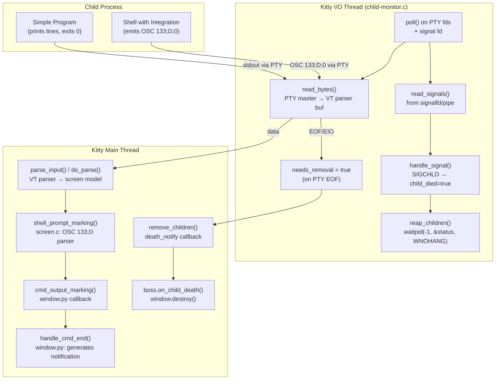

# Technical Specification

# 0. Agent Action Plan

## 0.1 Intent Clarification

### 0.1.1 Core Feature Objective

Based on the prompt, the Blitzy platform understands that the new feature requirement is to **perform a deep code-level investigation of Kitty's child-process lifecycle** and produce a comprehensive markdown Q&A document answering a set of tightly interrelated questions about what happens when a simple child program prints output and exits successfully with status zero.

The specific questions to answer are:

- **Exit code propagation**: When a child program exits with status 0, what exact exit code does Kitty's own process report?
- **User-facing message**: What is the full message shown to the user about the program completing?
- **Runtime tracking responsibility**: Which part of the runtime flow is responsible for tracking the child process?
- **Message generation function**: Which single function ultimately turns the child program's exit status into the message shown to the user?
- **OS-level signal**: What OS-level signal does Kitty listen for to know when a child process has terminated?
- **System call for exit retrieval**: What system call does Kitty use to actually retrieve the child's exit status?
- **Exit status transport mechanism**: How does the exit status get from the shell to the message-generating function — what protocol or escape sequence mechanism is involved?
- **Output destination**: Where does the child program's printed output actually appear — in Kitty's terminal window, or somewhere else?

An implicit requirement detected is that the investigation must distinguish between two scenarios: (a) a program launched directly as Kitty's child process (no shell in the middle), and (b) a program launched within a shell that has Kitty's shell integration enabled (the common interactive case). The exit-status transport mechanism differs fundamentally between these two cases.

### 0.1.2 Special Instructions and Constraints

- **Read-only investigation**: The user explicitly stated: *"Do not add or modify any source files in the repository while you investigate, and clean up any temporary files or scripts you create when you're done."*
- **Implementation rule (SWE-AtlasQnA-Repo)**: Create a new markdown document named `kitty_815df1e210e0.md` in the `blitzy/documentation` directory that comprehensively answers the questions posed.
- **No code modifications**: Do not modify any existing files in the source repository.
- **No additional code**: Do not add any other code in the source repository beyond the requested document.
- **Evidence-based answers**: Do not make assumptions; base answers on the code as the source of truth.
- **Reasoning transparency**: Provide thinking and rationale behind the answers.

### 0.1.3 Technical Interpretation

These feature requirements translate to the following technical implementation strategy:

- To **answer the exit code question**, we will trace the flow from `kitty/main.py:main()` through `_run_app()`, `boss.child_monitor.main_loop()`, and `boss.destroy()`, establishing that Kitty exits with code 0 under normal conditions (no unhandled exception).
- To **answer the user-facing message question**, we will analyze `kitty/window.py:handle_cmd_end()` (which generates the `"Command {s} finished with status: {exit_status}."` string) and document that this notification fires only when the `notify_on_cmd_finish` option is set to a value other than `never` (the default), and only when shell integration is active.
- To **answer the runtime tracking question**, we will document the `ChildMonitor` I/O thread in `kitty/child-monitor.c`, which polls PTY file descriptors via `poll()` and detects child death via EOF/EIO on the master PTY fd.
- To **answer the signal question**, we will document `SIGCHLD` handling in `kitty/loop-utils.c:init_signal_handlers()` and the `handle_signal()` callback in `kitty/child-monitor.c`.
- To **answer the system call question**, we will document the `waitpid(-1, &status, WNOHANG)` call in `kitty/child-monitor.c:reap_children()`.
- To **answer the escape sequence question**, we will document the OSC 133;D escape sequence emitted by shell integration scripts and parsed by `kitty/screen.c:shell_prompt_marking()`.
- To **answer the output destination question**, we will trace the PTY → VT parser → screen model → GPU rendering pipeline.
- To **produce the deliverable**, we will create `blitzy/documentation/kitty_815df1e210e0.md` containing all answers with code references.

## 0.2 Repository Scope Discovery

### 0.2.1 Comprehensive File Analysis

The investigation spans the following files, grouped by their role in the child-process lifecycle:

**Child Process Spawning and PTY Management**

| File | Role in Investigation |
|------|----------------------|
| `kitty/child.py` | Python `Child` class: PTY allocation via `openpty()`, environment preparation (`get_final_env`), process spawning via `fast_data_types.spawn()`, hold mode wrapping via `cmdline_for_hold()` |
| `kitty/child.c` | Native `spawn()` function: `fork()`, PTY slave redirection via `dup2()`, `setsid()`, controlling terminal setup via `TIOCSCTTY`, `execvp()` of the child program |

**Child Monitoring, Signal Handling, and Reaping**

| File | Role in Investigation |
|------|----------------------|
| `kitty/child-monitor.c` | Core I/O event loop: `poll()` on PTY fds, `read_bytes()` for pty data, `handle_signal()` for SIGCHLD, `reap_children()` using `waitpid()`, `mark_child_for_removal()`, `remove_children()` calling `death_notify` callback, `report_reaped_pids()` calling `boss.on_monitored_pid_death()` |
| `kitty/loop-utils.c` | Signal infrastructure: `init_signal_handlers()` using `signalfd()` (Linux) or `sigaction()` + self-pipe (macOS), `read_signals()` for dispatching signal data |

**Exit Status Processing and Notification**

| File | Role in Investigation |
|------|----------------------|
| `kitty/window.py` | `cmd_output_marking()` callback from VT parser, `handle_cmd_end(exit_status)` that generates the `"Command {s} finished with status: {exit_status}."` notification message |
| `kitty/screen.c` | `shell_prompt_marking()` function at line 2328: parses OSC 133 escape sequences (A/C/D markers), extracts exit status from the `D;` marker, invokes the `cmd_output_marking` Python callback |

**Shell Integration Scripts (Exit Status Transport)**

| File | Role in Investigation |
|------|----------------------|
| `shell-integration/bash/kitty.bash` | Emits `\e]133;D;$?\a` in PS1 to report last command exit status via OSC 133 |
| `shell-integration/zsh/kitty-integration` | Emits `\e]133;D;$cmd_status\a` in precmd hook |
| `shell-integration/fish/vendor_conf.d/kitty-shell-integration.fish` | Emits `\e]133;D;$status\a` in post-execution hook |

**Boss Controller and Window Lifecycle**

| File | Role in Investigation |
|------|----------------------|
| `kitty/boss.py` | `on_child_death(window_id)` at line 881: removes window from `window_id_map`, calls `window.destroy()`, triggers tab/window cleanup. `on_monitored_pid_death(pid, exit_status)` at line 2725: handles background process exit callbacks |
| `kitty/main.py` | `main()` at line 524: top-level entry point — exits with 0 on normal completion, raises `SystemExit(1)` only on unhandled exception |

**VT Parser (Data Flow from PTY to Screen)**

| File | Role in Investigation |
|------|----------------------|
| `kitty/vt-parser.c` | Central byte-stream state machine: classifies PTY output into text, CSI, OSC, DCS sequences and dispatches to appropriate handlers |

**Hold Mode (Optional Post-Exit Behavior)**

| File | Role in Investigation |
|------|----------------------|
| `tools/tui/hold.go` | `ExecAndHoldTillEnter()`: runs the child command, then displays `"Press Enter or Esc to exit"` via `HoldTillEnter()` |
| `kitty/entry_points.py` | `hold()` at line 27: dispatches to `kitten __hold_till_enter__` |
| `kitty/utils.py` | `cmdline_for_hold()` at line 1192: wraps command in `kitten run-shell --env=KITTY_HOLD=1` |

**Configuration (Behavioral Switches)**

| File | Role in Investigation |
|------|----------------------|
| `kitty/options/definition.py` | `close_on_child_death` at line 2920 (default: `no`), `notify_on_cmd_finish` at line 3190 (default: `never`) |
| `kitty/constants.py` | `handled_signals` set at line 263, `SIGCHLD` included in handled signals |

### 0.2.2 Integration Point Discovery

- **PTY I/O path**: `kitty/child.c:spawn()` → PTY master fd → `kitty/child-monitor.c:read_bytes()` → `kitty/vt-parser.c` → `kitty/screen.c` → GPU render pipeline
- **Signal path**: SIGCHLD → `kitty/loop-utils.c:read_signals()` → `kitty/child-monitor.c:handle_signal()` → `reap_children()` → `waitpid()`
- **Exit status path (shell integration)**: Shell `$?` → OSC `\e]133;D;$?\a` → PTY → VT parser → `kitty/screen.c:shell_prompt_marking()` → `kitty/window.py:cmd_output_marking()` → `handle_cmd_end()`
- **Window death path**: PTY EOF → `needs_removal = true` → `death_notify(window_id)` → `kitty/boss.py:on_child_death()` → `window.destroy()`

### 0.2.3 New File Requirements

- **CREATE**: `blitzy/documentation/kitty_815df1e210e0.md` — The comprehensive Q&A markdown document answering all questions about Kitty's child-process exit behavior, with code references, flow diagrams, and rationale

No other new files are required. No existing files are to be modified.

## 0.3 Dependency Inventory

### 0.3.1 Key Packages Relevant to This Investigation

Since this task is a read-only investigation that produces a markdown document, no dependency changes are required. However, the following packages and runtimes are relevant to understanding the codebase under analysis:

| Registry | Name | Version | Purpose in Investigation |
|----------|------|---------|------------------------|
| PyPI (embedded) | Python | >= 3.8 | Runtime for `kitty/boss.py`, `kitty/window.py`, `kitty/child.py` — the Python orchestration layer that handles `on_child_death`, `handle_cmd_end`, and window lifecycle |
| Go modules | Go | 1.22 | Runtime for `tools/tui/hold.go`, `tools/cmd/run_shell/main.go` — the hold-till-enter behavior and run-shell kitten |
| C (compiled) | POSIX libc | System | Provides `fork()`, `waitpid()`, `signalfd()`/`sigaction()`, `poll()`, `dup2()`, `setsid()`, `ioctl(TIOCSCTTY)` — the native process and signal management APIs |
| Vendored | GLFW | 3.4 (custom fork) | Platform windowing backend; delivers SIGCHLD via the event loop infrastructure |
| Source | Kitty | 0.35.2 | The application under investigation |

### 0.3.2 Dependency Updates

No dependency additions, removals, or version changes are required. This task does not modify the build, runtime, or test dependency graph. All investigation conclusions are derived from reading the existing source files.

## 0.4 Integration Analysis

### 0.4.1 Existing Code Touchpoints

The investigation identified six integration boundaries that together form the complete child-process exit flow. No modifications are made; these are documented to inform the Q&A deliverable.

**Integration Point 1 — PTY Spawning (C ↔ Python)**

- `kitty/child.py:Child.fork()` calls `fast_data_types.spawn()` (line 333), which is the C function `spawn()` in `kitty/child.c` (line 81)
- The C function calls `fork()` (line 97), sets up the PTY slave as stdin/stdout/stderr via `dup2()`, and calls `execvp()` to replace the child process image
- The master PTY fd is stored as `self.child_fd` and set to non-blocking mode

**Integration Point 2 — I/O Polling Loop (C event loop)**

- `kitty/child-monitor.c` I/O thread runs a `poll()` loop (line 1510) over all child PTY master fds
- `read_bytes()` (line 1337) reads from the PTY master into the VT parser's write buffer
- When `read_bytes()` returns false (0 bytes or EIO), the child entry is marked `needs_removal = true` (line 1535)

**Integration Point 3 — Signal Delivery (OS → C signal infrastructure)**

- `kitty/loop-utils.c:init_signal_handlers()` (line 35) sets up signal capture:
  - On Linux: `signalfd(-1, &signals, SFD_NONBLOCK | SFD_CLOEXEC)` creates a file descriptor for `SIGCHLD` and other signals
  - On macOS/BSD: `sigaction()` with a self-pipe trick writes `siginfo_t` structs to a pipe
- The signal fd is polled as `children_fds[1]` in the I/O loop (line 1519)
- `read_signals()` (line 131 of `loop-utils.c`) reads from the signal fd and calls `handle_signal()` for each signal

**Integration Point 4 — Child Reaping (C → waitpid)**

- `kitty/child-monitor.c:handle_signal()` (line 1362) sets `ss->child_died = true` on `SIGCHLD`
- `reap_children()` (line 1413) calls `waitpid(-1, &status, WNOHANG)` in a loop to collect all terminated children
- Exit status integers are stored in `reaped_pids[]` and `mark_monitored_pids()` records them for Python callback dispatch

**Integration Point 5 — Python Callback (C → Python Boss)**

- `remove_children()` in `child-monitor.c` (line 522) calls `self->death_notify(window_id)` which is `boss.on_child_death` registered at construction (line 371 of `boss.py`)
- `report_reaped_pids()` (line 950) calls `boss.on_monitored_pid_death(pid, status)` for monitored background processes
- `boss.on_child_death()` (line 881) removes the window from `window_id_map`, calls `window.destroy()`, and triggers tab cleanup

**Integration Point 6 — OSC 133 Shell Integration (Shell → PTY → VT Parser → Python Window)**

- Shell integration scripts emit `\e]133;D;$?\a` (bash: line 239 of `kitty.bash`, zsh: line 145 of `kitty-integration`, fish: line 96 of `kitty-shell-integration.fish`)
- These bytes travel through the PTY and arrive at the VT parser
- `kitty/screen.c:shell_prompt_marking()` (line 2328) parses the OSC 133 'D' marker, extracts the exit status string after the semicolon, and calls the `cmd_output_marking` Python callback
- `kitty/window.py:cmd_output_marking()` (line 1453) dispatches to `handle_cmd_end(exit_status)` (line 1408), which generates the notification message if `notify_on_cmd_finish` is configured

## 0.5 Technical Implementation

### 0.5.1 File-by-File Execution Plan

This task creates a single deliverable: a comprehensive markdown Q&A document. No source files are modified.

**Group 1 — Investigation and Analysis (Read-Only)**

All analysis is conducted by reading the files listed in Section 0.2. The following files are the primary evidence sources for each answer:

| Question | Primary Evidence File(s) | Key Code Location |
|----------|-------------------------|-------------------|
| Kitty's own exit code | `kitty/main.py` | `main()` at line 524: try/except wrapping `_main()`; exits 0 normally, raises `SystemExit(1)` on exception |
| User-facing message | `kitty/window.py` | `handle_cmd_end()` at line 1408: generates `f'Command {s} finished with status: {exit_status}.\nClick to focus.'` |
| Runtime tracking responsibility | `kitty/child-monitor.c` | I/O thread poll loop (line 1490+), `read_bytes()` (line 1337), `needs_removal` flag |
| Message-generating function | `kitty/window.py` | `handle_cmd_end()` (line 1408) — the single function that converts exit status to notification text |
| OS-level signal | `kitty/child-monitor.c` | `KITTY_HANDLED_SIGNALS` macro (line 121): includes `SIGCHLD`; `handle_signal()` (line 1362) case `SIGCHLD` |
| System call for exit retrieval | `kitty/child-monitor.c` | `reap_children()` (line 1413): `waitpid(-1, &status, WNOHANG)` |
| Escape sequence mechanism | `shell-integration/bash/kitty.bash`, `kitty/screen.c` | OSC 133;D;$? emitted by shell; parsed at `shell_prompt_marking()` line 2328 |
| Output destination | `kitty/child-monitor.c`, `kitty/vt-parser.c`, `kitty/screen.c` | PTY master → `read_bytes()` → VT parser → screen model → GPU rendering → terminal window |

**Group 2 — Deliverable Creation**

- **CREATE**: `blitzy/documentation/kitty_815df1e210e0.md`
  - Contains comprehensive answers to all eight questions
  - Includes code path references with file names and line numbers
  - Provides a data-flow diagram of the exit-status propagation
  - Distinguishes direct-child vs. shell-integrated scenarios
  - Documents the default configuration behavior (`close_on_child_death: no`, `notify_on_cmd_finish: never`)

### 0.5.2 Implementation Approach

The implementation follows a strictly investigation-first, documentation-second approach:

- **Establish the exit-code answer** by tracing `kitty/main.py:main()` → `_main()` → `_run_app()` → `boss.child_monitor.main_loop()` → `boss.destroy()` → normal return (exit 0). The only path to exit code 1 is an unhandled exception in the try/except at line 524.
- **Establish the message answer** by analyzing `handle_cmd_end()` in `kitty/window.py` (line 1408–1451), noting that the notification body `"Command {s} finished with status: {exit_status}.\nClick to focus."` is generated only when `notify_on_cmd_finish` is not `never` (default is `never`, per `kitty/options/definition.py` line 3190), and only when shell integration is active and has emitted the OSC 133 D marker.
- **Establish the tracking answer** by documenting the `ChildMonitor` I/O thread in `kitty/child-monitor.c` — the poll loop, read_bytes, and needs_removal mechanism.
- **Establish the signal answer** by documenting `SIGCHLD` in the `KITTY_HANDLED_SIGNALS` macro and the `handle_signal()` switch case.
- **Establish the waitpid answer** by documenting the `reap_children()` function's `waitpid(-1, &status, WNOHANG)` call.
- **Establish the escape sequence answer** by tracing OSC 133;D from shell scripts through the PTY, VT parser, `shell_prompt_marking()`, `cmd_output_marking()` callback, to `handle_cmd_end()`.
- **Establish the output answer** by tracing the PTY data path through `read_bytes()` → VT parser buffer → `parse_worker()` → screen model → GPU rendering pipeline.

### 0.5.3 Key Technical Findings Summary

The complete flow for a simple program that prints and exits with status 0:

1. The child's `stdout` writes go through the PTY slave → PTY master fd
2. The `ChildMonitor` I/O thread reads bytes via `read_bytes()` into the VT parser buffer
3. The main thread's `parse_input()` drives the VT parser, which inserts text into the screen's line buffer
4. The GPU rendering pipeline composites the text onto the terminal window — **this is where printed output appears**
5. When the child exits, the kernel delivers `SIGCHLD` to Kitty
6. On Linux, `SIGCHLD` arrives via `signalfd()`; on macOS, via `sigaction()` + self-pipe
7. `handle_signal()` sets `child_died = true`, then `reap_children()` calls `waitpid(-1, &status, WNOHANG)` to collect the exit status
8. Separately, the PTY master fd returns EOF (0 bytes) or EIO when the last process using the slave closes it
9. `read_bytes()` returns false, causing `needs_removal = true`
10. `remove_children()` calls `death_notify(window_id)` which invokes `boss.on_child_death()`
11. The window is destroyed, and when no windows remain, the main loop exits
12. Kitty's `main()` returns normally — **exit code 0**
13. If shell integration is active and `notify_on_cmd_finish` is not `never`, the shell's OSC 133;D;0 triggers `handle_cmd_end("0")` which generates the notification: **"Command {cmdline} finished with status: 0."**
14. With default settings (`notify_on_cmd_finish = never`), **no message is shown** about the exit status

## 0.6 Scope Boundaries

### 0.6.1 Exhaustively In Scope

**Investigation Sources (read-only analysis)**

- `kitty/child.py` — Child class, PTY allocation, environment setup, fork/spawn
- `kitty/child.c` — Native spawn: fork, dup2, setsid, TIOCSCTTY, execvp
- `kitty/child-monitor.c` — I/O poll loop, read_bytes, signal handling, reap_children, waitpid, remove_children, death_notify callback, report_reaped_pids
- `kitty/loop-utils.c` — Signal infrastructure: init_signal_handlers (signalfd / sigaction), read_signals
- `kitty/boss.py` — on_child_death, on_monitored_pid_death, quit, destroy
- `kitty/window.py` — cmd_output_marking, handle_cmd_end, destroy, last_cmd_exit_status
- `kitty/screen.c` — shell_prompt_marking (OSC 133 A/C/D parsing), CALLBACK dispatches
- `kitty/vt-parser.c` — VT parser state machine, parse_worker
- `kitty/main.py` — main(), _main(), _run_app(), SystemExit handling
- `kitty/entry_points.py` — hold() entry point, kitten __hold_till_enter__ dispatch
- `kitty/utils.py` — cmdline_for_hold()
- `kitty/constants.py` — handled_signals, version, appname
- `kitty/options/definition.py` — close_on_child_death, notify_on_cmd_finish option definitions
- `shell-integration/bash/kitty.bash` — OSC 133;D;$? emission in PS1
- `shell-integration/zsh/kitty-integration` — OSC 133;D;$cmd_status emission in precmd
- `shell-integration/fish/vendor_conf.d/kitty-shell-integration.fish` — OSC 133;D;$status emission
- `tools/tui/hold.go` — ExecAndHoldTillEnter, HoldTillEnter ("Press Enter or Esc to exit")
- `tools/cmd/run_shell/main.go` — run-shell kitten entry point

**Deliverable (created)**

- `blitzy/documentation/kitty_815df1e210e0.md` — Comprehensive Q&A markdown document

### 0.6.2 Explicitly Out of Scope

- **Modifying any source file** — The user explicitly prohibits code changes
- **GPU rendering internals** — Shader code (`*.glsl`) is not relevant to the exit-status lifecycle
- **Remote control protocol** — RC commands in `kitty/rc/` are not involved in the child exit flow
- **File transfer protocol** — `kitty/file_transmission.py` is unrelated
- **Graphics protocol** — `kitty/graphics.c` is unrelated
- **Font subsystem** — `kitty/freetype.c`, `kitty/fonts.c`, etc. are unrelated
- **macOS-specific Cocoa integration** — `kitty/cocoa_window.m`, `kitty/core_text.m` are not relevant to the core exit flow
- **Kitten UI frameworks** — The various kittens (diff, themes, ssh, etc.) are not relevant
- **Build system** — `setup.py`, `Makefile`, `bypy/` are not part of the runtime flow
- **Performance optimization** or benchmarking of the exit path
- **Refactoring** of any existing code

## 0.7 Rules for Feature Addition

### 0.7.1 User-Specified Rules

The following rules were explicitly stated by the user and the project's implementation rules:

- **SWE-AtlasQnA-Repo Rule**: Create a new markdown document named `kitty_815df1e210e0.md` that comprehensively answers the questions posed in the prompt. Build and run the source code to analyze the repository behavior as needed. Do not make assumptions; base answers on the code as the truth. Provide thinking and rationale behind the answers.
- **No source modifications**: Do not modify any existing files in the source repository.
- **No additional code**: Do not add any other code in the source repository besides the requested document.
- **Document placement**: Place the generated document in the `blitzy/documentation` directory in the destination repo.
- **Cleanup**: Do not add or modify any source files in the repository while investigating. Clean up any temporary files or scripts created during the investigation.

### 0.7.2 Investigation-Specific Requirements

- All answers must cite specific file paths and line numbers from the Kitty source code
- The distinction between shell-integrated and direct-child scenarios must be clearly explained
- Default configuration behavior must be documented (e.g., `notify_on_cmd_finish = never` means no message by default)
- The complete signal → waitpid → exit status → notification chain must be traced end-to-end
- The PTY data flow for child output must be documented to answer where printed output appears

## 0.8 References

### 0.8.1 Repository Files Searched

The following files and folders were systematically inspected to derive the conclusions in this Agent Action Plan:

**Root-Level Exploration**
- `/` (repository root) — folder contents and project structure
- `pyproject.toml` — Python version requirement (`>=3.8`)
- `go.mod` — Go version (`1.22`) and module dependencies
- `setup.py` — Build system, version checking logic
- `__main__.py` — Python entry point dispatcher
- `kitty/constants.py` — Version (0.35.2), `handled_signals` set, application constants

**Core Process Lifecycle Files**
- `kitty/child.py` (501 lines) — Complete file read; Child class, fork, PTY, environment
- `kitty/child.c` (211 lines) — Complete file read; native spawn function
- `kitty/child-monitor.c` (~1580 lines) — Targeted reads of signal handling (lines 1350–1440), I/O loop (lines 1490–1560), remove_children (lines 500–570), report_reaped_pids (lines 930–1000), ReapedPID struct (lines 85–100)
- `kitty/loop-utils.c` (~250 lines) — Targeted reads of init_signal_handlers (lines 20–90), read_signals (lines 100–175)

**Window and Boss Lifecycle Files**
- `kitty/boss.py` — Targeted reads of on_child_death (lines 870–920), ChildMonitor construction (lines 360–380), on_monitored_pid_death (lines 2725–2760), destroy (lines 2170–2210), quit (lines 1791–1820)
- `kitty/window.py` — Targeted reads of handle_cmd_end (lines 1400–1460), cmd_output_marking (lines 1453–1475), destroy (lines 1560–1620), last_cmd_exit_status field (line 244)
- `kitty/main.py` (~535 lines) — Complete file read; main(), _main(), _run_app(), SystemExit handling
- `kitty/screen.c` — Targeted read of shell_prompt_marking (lines 2320–2370)

**Shell Integration Files**
- `shell-integration/bash/kitty.bash` — Targeted reads of OSC 133 emission (lines 230–250)
- `shell-integration/zsh/kitty-integration` — Targeted reads of OSC 133;D emission (lines 120–150)
- `shell-integration/fish/vendor_conf.d/kitty-shell-integration.fish` — Targeted reads of OSC 133;D emission (lines 70–100)

**Hold and Run-Shell Kitten Files**
- `tools/tui/hold.go` (65 lines) — Complete file read; ExecAndHoldTillEnter, HoldTillEnter
- `tools/cmd/run_shell/main.go` (~110 lines) — Complete file read; run-shell kitten logic
- `tools/tui/run.go` — Targeted read of RunCommandRestoringTerminalToSaneStateAfter (lines 180–230)

**Configuration Files**
- `kitty/options/definition.py` — Targeted reads of close_on_child_death (lines 2920–2940), notify_on_cmd_finish (lines 3190–3250)
- `kitty/options/types.py` — close_on_child_death default value (line 500)
- `kitty/entry_points.py` — hold() function (lines 27–30), entry point registry (lines 130–170)
- `kitty/utils.py` — cmdline_for_hold (lines 1185–1210)
- `kitty/rc/run.py` — exit_code/exit_status usage for background processes (lines 100–135)

**Folders Explored**
- `/` (root), `kitty/`, `kitty/options/`, `kitty/rc/`, `kitty/launcher/`, `kittens/`, `tools/`, `tools/tui/`, `tools/cmd/run_shell/`, `shell-integration/`, `shell-integration/bash/`, `shell-integration/zsh/`, `shell-integration/fish/`

### 0.8.2 Technical Specification Sections Referenced

- Section 4.3 — Terminal Input/Output Pipeline (VT parser dispatch, OSC 133 routing, GPU rendering pipeline)
- Section 4.5 — Window and Tab Lifecycle (child process launch, window state transitions, ChildExited → HoldMode/Closing)
- Section 4.7 — Shell Integration Flow (OSC 133 prompt markers, shell-specific setup)
- Section 4.10 — Error Handling and Recovery Flows (startup error handling, shell integration error isolation)
- Section 5.2 — Component Details (Child Monitor architecture, Boss Controller, VT Parser, Shell Integration)

### 0.8.3 Attachments

No attachments were provided by the user for this task.

